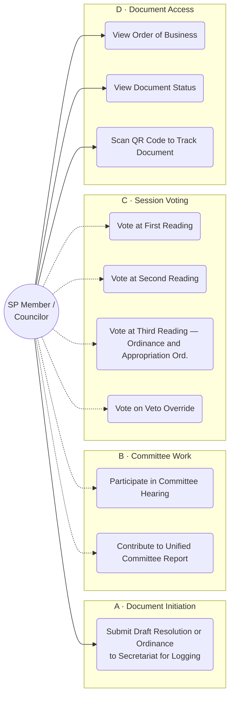
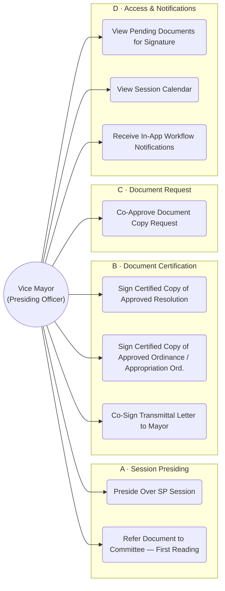
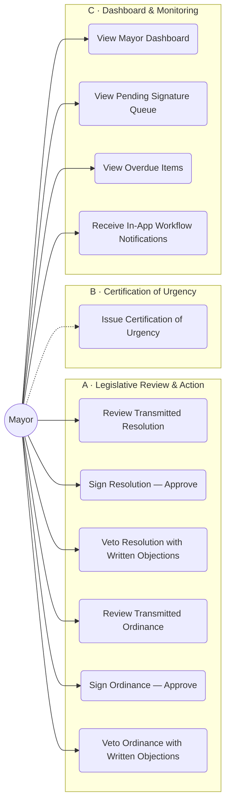
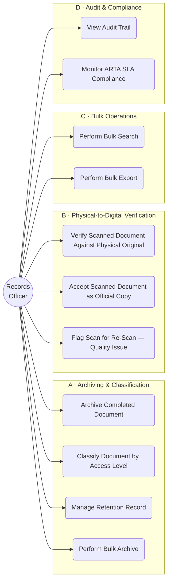
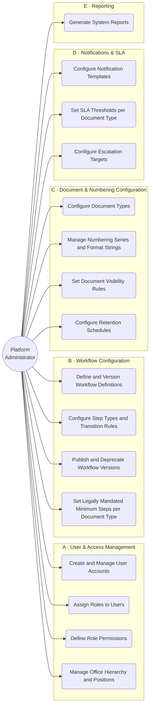
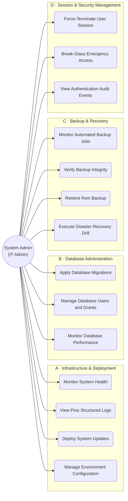
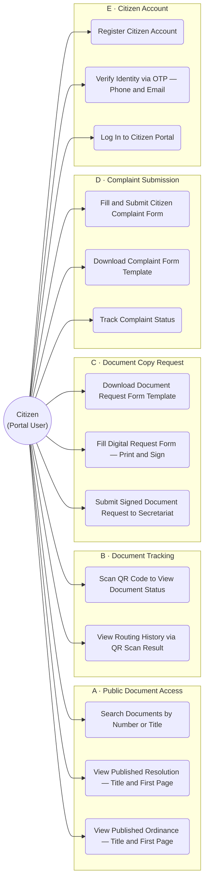

# D1 · Use Case Diagrams — Per Actor — Phase 1

**Document class:** Architecture Reference — Pre-Development  
**Scope:** Confirmed Phase 1 features only  
**Source:** Consolidated Architecture & Requirements Reference — Iteration 3 (June 2026)  
**Date:** June 2026  
**Status:** Draft

---

## Table of Contents

- [L26–38] Notation — Diagram legend (actor/use-case shapes, solid vs. dashed arrow meaning) and the Phase 1B exclusion rule with its Transmittal Letter exception.
- [L40–145] ACT-01 · SP Secretary — 7 use-case groups (intake, legislative workflow, Panlalawigan, sessions, complaints, document requests, workflow admin); the system's primary operator role.
- [L147–191] ACT-02 · SP Member / Councilor — Drafting, committee participation, session voting; most actions shown as Secretariat-mediated (dashed arrows), per the [Inference] note on dashboards.
- [L193–235] ACT-03 · Vice Mayor — Session presiding, First Reading referral, certifying/co-signing approved measures, co-approving copy requests.
- [L237–282] ACT-04 · Mayor — Sign/veto/lapse decisions on resolutions and ordinances, issuing Certification of Urgency (mediated via dashed arrow), dashboard.
- [L284–330] ACT-05 · Records Officer — Archiving, classification, scan-vs-physical verification, bulk search/export; role's actual personnel assignment flagged [Inference].
- [L332–389] ACT-06 · Platform Administrator — No-developer config scope: users/roles, workflow definitions, document types/numbering, notification/SLA settings, reporting.
- [L391–441] ACT-07 · System Administrator (IT Admin) — Infra, DB migrations/grants, backup/DR, session/security controls; explicitly no document-content access.
- [L443–498] ACT-08 · Citizen (Portal User) — Public search/viewing, QR tracking, copy-request and complaint submission flows, account registration/OTP.
- [L500–516] Notes — 7 numbered caveats: Phase 1B exclusion list, Transmittal Letter exception, Councilor-access [Inference], Mayor Cert. of Urgency mediation, Records Officer personnel [Inference], untracked System actor, Designation note.

---

## Notation

| Element          | Representation                                                                                     |
| ---------------- | -------------------------------------------------------------------------------------------------- |
| Actor            | Double circle `(( ))` — placed left of the system boundary                                         |
| Use case         | Rounded rectangle `( )` — inside a functional grouping                                             |
| `→` solid arrow  | Actor directly initiates action in the system                                                      |
| `⇢` dashed arrow | Actor participates; action is mediated by the Secretariat or the outcome is logged by another role |
| Subgraph border  | Functional grouping within the Phase 1 system boundary                                             |

**Scope rule:** Phase 1B and Phase 2+ items are excluded from all diagrams. Exception: where a Phase 1B document type appears as a generated artifact within a confirmed Phase 1 workflow step (e.g., Transmittal Letter / SPS produced during the SP Resolution workflow), it is treated as Phase 1 scope.

---

## ACT-01 · SP Secretary

The SP Secretary and Secretariat staff are the primary Phase 1 system operators. Document intake, workflow logging, series number assignment, Panlalawigan tracking, complaint management, and session administration all flow through this role. `[CONFIRMED]` The Secretariat also records outcomes on behalf of actors who do not have direct system access in Phase 1 — including committee hearing dates communicated verbally, and vote outcomes from physical session proceedings.

```mermaid
flowchart LR
    SEC(("SP\nSecretary"))

    subgraph INTAKE["A · Document Intake & Tracking"]
        A1("Log Incoming Draft Document")
        A2("Assign QR Code at Logging")
        A3("Assign Preliminary Draft Series Number")
        A4("Generate QR Cover Sheet")
        A5("Look Up Document by QR Scan")
    end

    subgraph LEG["B · Legislative Workflow"]
        B1("Process Certification of Urgency")
        B2("Log Committee Referral")
        B3("Enter Committee Hearing Date")
        B4("Accept Committee Report Submission")
        B5("Log Decision — Approve / Reject / Amended")
        B6("Log Amendments to Document")
        B7("Assign Final Series Number")
        B8("Generate Transmittal Letter to Mayor")
        B9("Record Mayor Action — Signed / Vetoed")
        B10("Record 10-Day Lapse into Law")
        B11("Record Veto Override Outcome")
        B12("Conduct Docketing")
        B13("Arrange Newspaper Publication — Penalty Ordinances")
    end

    subgraph PROV["C · Panlalawigan Review"]
        C1("Log Panlalawigan Transmission")
        C2("Record Panlalawigan Outcome")
        C3("Manage VALID-IN-PART Path")
        C4("Process RETURNED Document")
        C5("Record 30-Day Deemed Approval")
    end

    subgraph SESS["D · Session Management"]
        D1("Record Session Attendance")
        D2("Manage Order of Business")
        D3("View SP Secretary Dashboard")
    end

    subgraph COMP["E · Complaint Management"]
        E1("Log Citizen Complaint")
        E2("Route Complaint to Committee or VM")
        E3("Log Complaint Committee Report")
        E4("Notify Complainant of Outcome")
        E5("Mark Complaint as Resolved")
    end

    subgraph DOCR["F · Document Request"]
        F1("Process Document Request Form")
        F2("Generate Printable Request Form")
        F3("Co-Approve Document Copy Request")
    end

    subgraph WFAD["G · Workflow Administration"]
        G1("Manually Advance Workflow Step")
        G2("Monitor ARTA SLA Compliance")
        G3("View Audit Trail")
    end

    SEC --> A1
    SEC --> A2
    SEC --> A3
    SEC --> A4
    SEC --> A5
    SEC --> B1
    SEC --> B2
    SEC --> B3
    SEC --> B4
    SEC --> B5
    SEC --> B6
    SEC --> B7
    SEC --> B8
    SEC --> B9
    SEC --> B10
    SEC --> B11
    SEC --> B12
    SEC --> B13
    SEC --> C1
    SEC --> C2
    SEC --> C3
    SEC --> C4
    SEC --> C5
    SEC --> D1
    SEC --> D2
    SEC --> D3
    SEC --> E1
    SEC --> E2
    SEC --> E3
    SEC --> E4
    SEC --> E5
    SEC --> F1
    SEC --> F2
    SEC --> F3
    SEC --> G1
    SEC --> G2
    SEC --> G3
```

---

## ACT-02 · SP Member / Councilor

SP Members initiate draft documents and participate in the legislative process through physical sessions and committee work. `[CONFIRMED]` In Phase 1, most system interactions are mediated — the Secretariat logs draft submissions, enters hearing dates communicated by committees, and records session vote outcomes on their behalf. Direct system access in Phase 1 is read-oriented: viewing the Order of Business and tracking documents by QR code or number. `[Inference — direct read access implied by Phase 1 IAM module; Councilor dashboards not explicitly confirmed]`

Dashed arrows indicate participation where the system records the outcome through Secretariat logging, not through the actor's direct system action.

---

## ACT-03 · Vice Mayor

The Vice Mayor is the Presiding Officer of the Sangguniang Panlungsod. `[CONFIRMED]` In Phase 1, the Vice Mayor presides over sessions (including First Reading referrals to committee), certifies approved measures before transmittal to the Mayor, co-signs Transmittal Letters, and co-approves document copy requests. `[CONFIRMED]`

**Phase 1B exclusions:** Letter routing (SPR) and Designation issuance are deferred to Phase 1B and do not appear here.

---

## ACT-04 · Mayor

The Mayor reviews and acts on legislative measures transmitted by the SP Secretariat, with a 10-day window to sign, veto, or allow lapse into law. `[CONFIRMED]` The Mayor also issues Certifications of Urgency — formal written documents that bypass committee review and enable same-session First and Second Readings. `[CONFIRMED]` A dedicated Mayor dashboard shows pending signatures and overdue items. `[CONFIRMED]`

The Mayor issues the Certification of Urgency as a physical written document; the Secretariat logs it. The Mayor's system interaction is primarily through the dashboard and review queue.

> **B1 note:** Issuing the Certification of Urgency is a physical action by the Mayor. The dashed arrow reflects that the Secretariat logs the document in the system on the Mayor's behalf. `[CONFIRMED]`

---

## ACT-05 · Records Officer

The Records Officer manages permanent archiving, document classification, physical-to-digital verification, and bulk operations. `[CONFIRMED from workflow steps and Part 11.4]` Bulk archive and export privileges are subject to document classification level constraints. No bulk-delete is permitted. `[CONFIRMED]`

**Role identity note:** The Records Officer is confirmed as a distinct system role referenced throughout the SP Resolution and Ordinance workflows and in the document management design. The specific Secretariat staff member holding this role is not named in current source documents. `[Inference — role exists; personnel assignment unverified]`

---

## ACT-06 · Platform Administrator

The Platform Administrator configures all system behavior without developer involvement. `[CONFIRMED — Part 11.21]` This role **cannot** hold any document-processing role simultaneously (enforced as an architectural invariant). `[CONFIRMED]` The Platform Administrator does not access document content. Scope covers users, workflows, document types, numbering, offices, notifications, SLA, and retention.

---

## ACT-07 · System Administrator (IT Admin)

The System Administrator manages infrastructure, backups, database operations, and security. `[CONFIRMED]` This role has **no access to document content**, enforced at the PostgreSQL permission level (RLS + ABAC). `[CONFIRMED]` The LGU IT Office holds all production credentials; the development team has zero production data access. `[CONFIRMED]`

---

## ACT-08 · Citizen (Portal User)

Citizens interact with the public-facing portal for document discovery, tracking, copy requests, and complaint submission. `[CONFIRMED — Part 11.18, Part 4.15]` Title and first page of published resolutions and ordinances are publicly accessible without an account. `[CONFIRMED]` Full document access requires a paid Document Request Form approved by both Vice Mayor and SP Secretary. Physical signature is still required in Phase 1 for copy requests and complaints. `[CONFIRMED]`

> **Account scope note:** Public viewing (A) and QR tracking (B) do not require a citizen account. An account is needed for online complaint status tracking and for the digital form-fill mode of requests and complaints. `[Inference — explicit per-feature account requirement not stated in source; deduced from "three access modes" and "visible publicly" confirmation]`

---

## Notes

1. **Phase 1B exclusions confirmed.** Letters Received (SPR), Letters Sent (SPS — except Transmittal Letters within the legislative workflow), Memos Incoming (MI), Memos Outgoing (MO), Notices of Committee Hearing (NCH), Notices of Special Session (NOSP), Designations (D), and Barangay Resolutions are all Phase 1B items and do not appear in any diagram. `[CONFIRMED]`
    
2. **Transmittal Letter exception.** "Generate Transmittal Letter to Mayor" appears in ACT-01 (SP Secretary) even though the general SPS document type is Phase 1B. The Transmittal Letter is explicitly included in the Phase 1 SP Resolution and Ordinance workflow specifications. `[CONFIRMED — Part 13 Phase 1 inclusions]`
    
3. **Councilor direct system access.** The IAM module is a Phase 1 core deliverable, implying Councilor accounts exist. However, Councilor-specific dashboards are not confirmed for Phase 1 — only the SP Secretary and Mayor dashboards are explicitly specified. Read-only access (Order of Business, document status) is the basis for including D1–D3 in ACT-02. `[Inference]`
    
4. **Certification of Urgency (Mayor).** The Mayor issues this as a physical written document; it is logged by the Secretariat. The dashed arrow in ACT-04 reflects this mediated system interaction. `[CONFIRMED — Part 4.17]`
    
5. **Records Officer personnel.** The Records Officer is confirmed as a system role with specific privileges (bulk operations, physical-to-digital verification). The specific staff member in the SP Secretariat org chart holding this role is not confirmed in current source documents. `[Inference]`
    
6. **System actor (automated actions) not included.** Several Phase 1 behaviors are system-triggered: the 30-day Panlalawigan timer, 10-day Mayor lapse transition, SLA alert escalation, and OCR on upload. These are System actor use cases and are not represented in the per-actor diagrams above.
    
7. **Designation workflow.** Designation issuance and delegation routing are Phase 1B. The session attendance record for the designated substitute (when VM is absent) is captured through the existing session attendance tracking use case in ACT-01.
    

---

_Supersedes: N/A (first iteration)_  
_Related: Confirmed Workflows — Part 4; Phase 1 Scope — Part 2; Organizational Structure — Part 3_