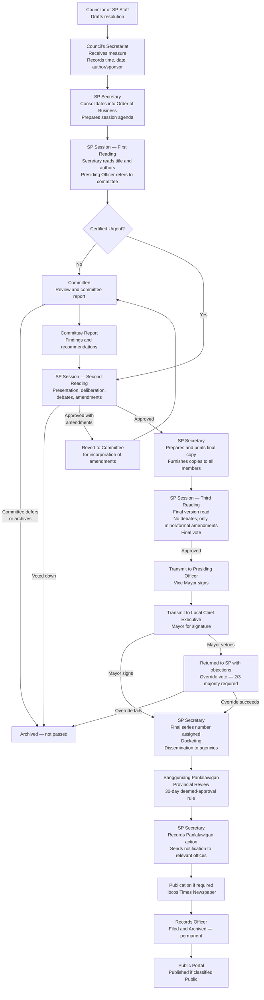
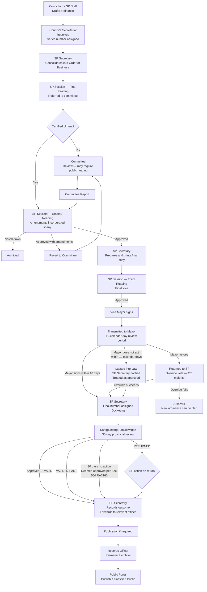

# First Stakeholder Interview — Synthesis and Clarification Questions

**Interview Date:** June 9  
**Primary Subjects:** SP Secretariat (Records Officer; SP Secretary implied)  
**Additional Sources:** Official legislative process flowchart; SP organizational chart; scanned operational documents (14 document type samples, 2022–2026)  
**Status:** Raw notes synthesized and augmented with documentary evidence. Clarification questions directed at Luke are in Part 2.

---

## Part 1 — Confirmed Findings

### 1.0 Confirmed Stakeholders and Organizational Structure

The following names and positions are confirmed from the official SP organizational chart.

**Vice Mayor (Presiding Officer, 7th SP):** Hon. Albert D. Chua

**SP Members (7th SP):**

| Name                                    | Role               |
| --------------------------------------- | ------------------ |
| Hon. Kichel Jomarie G. Pungtilan        | City Councilor     |
| Hon. Eleuterio A. Salamangkit Jr.       | City Councilor     |
| Hon. Martha Louise Aurora M. Borleo     | City Councilor     |
| Hon. Gwyneth S. Quidang                 | City Councilor     |
| Hon. John Gabrielle Dominique M. Daguio | City Councilor     |
| Hon. Lucky Rene G. Bunye                | City Councilor     |
| Hon. Violeta Eugenia D. Nalupta         | City Councilor     |
| Hon. Macarthur A. Aguinaldo             | City Councilor     |
| Hon. Rizal P. Castillo                  | City Councilor     |
| Hon. Juan Paulo P. Flojo                | City Councilor     |
| Hon. Gilbert O. Medina                  | ABC Representative |
| Hon. Reign Gwendia T. Mirasol           | SK Representative  |

**Office of the Secretary to the Sangguniang Panlungsod:**

| Name                        | Position                                                       |
| --------------------------- | -------------------------------------------------------------- |
| Gladys R. Lagura            | SP Secretary                                                   |
| Mia Prima M. Mesina         | Administrative Officer II — Ordinances & Resolutions Section   |
| Ronald P. Beltran           | Administrative Officer II — Franchise Section                  |
| Bonn Roger G. Rosales       | Administrative Aide VI (Clerk III) — Administrative Section    |
| Kathielyn R. Ilayat         | Administrative Aide VI (Clerk III) — Administrative Section    |
| Paul Josiah N. Chua         | Administrative Aide VI (Clerk III) — Administrative Section    |
| Joanne Marie Q. Macugay     | Administrative Aide VI (Clerk III) — Franchise Section         |
| Jeniffer S. Gaoiran         | Administrative Aide VI (Clerk III) — Franchise Section         |
| Antonia Elizabeth G. Yaplag | Administrative Aide VI (Clerk III) — Franchise Section         |
| Florentino Pablo R. Lumang  | Administrative Aide VI (Data Controller I) — Franchise Section |
| Ronell R. Purisima          | Administrative Aide III (Utility Worker II)                    |
| Ramil F. Rante              | Administrative Aide IV (Driver III)                            |
| Cherill S. Malicad          | Librarian I — City Library                                     |

**Personal Staff of the Vice Mayor:**

| Name | Position |
| --- | --- |
| Jocelyn D. Villavicencio | Executive Assistant II |
| Tristan Melecia D. Advincula | Executive Assistant I |
| Artelyn B. Rupisan | Secretary I |
| Jay Carlo V. Ragudo | Driver II |

The current Mayor is Hon. Mark Christian R. Chua. Previous Mayor (6th SP era) was Hon. Albert D. Chua (the current Vice Mayor's name is different — the Vice Mayor and previous Mayor appear to be namesakes but distinct individuals based on memo prefixes: "MRC" for current Mayor, "ADC" for current Vice Mayor).

---

### 1.1 Scope Decisions

| Item                                                | Status                                                                |
| --------------------------------------------------- | --------------------------------------------------------------------- |
| SP Resolutions                                      | In scope — confirmed                                                  |
| SP Ordinances                                       | In scope — confirmed                                                  |
| Appropriation Ordinances                            | In scope — confirmed (same workflow as regular ordinances)            |
| Franchise Ordinances                                | In scope — confirmed (observed in Panlalawigan review log)            |
| Internal Memos (Outgoing)                           | In scope — currently processed by Secretariat                         |
| Memos Incoming                                      | In scope — received from Mayor's Office and other sources             |
| Letters Received                                    | In scope — currently processed by Secretariat                         |
| Letters Sent                                        | In scope — currently processed by Secretariat                         |
| Notice of Committee Hearing                         | In scope                                                              |
| Notice of Special Session                           | In scope                                                              |
| Designation                                         | In scope — confirmed from scanned records; distinct document type     |
| Barangay Resolutions / Ordinances                   | In scope — physically submitted to secretariat; secretariat logs them |
| Sangguniang Panlalawigan Review/Action Taken        | In scope as a tracking log, not an active workflow document           |
| Administrative Cases (complaints against officials) | In scope; confidential; Legislative access only                       |
| Citizen Complaints (tricycle/transportation)        | In scope — distinct SP-managed complaint type                         |
| Executive Orders                                    | **Removed from scope**                                                |
| Purchase Requests                                   | **Not part of the system**                                            |

Stakeholder comment recorded: *"The scope of the proposed system is so large yet."* [See Q-INT-05]

---

### 1.2 Current Systems

- Prior digital system: **Legislative Management and Information Tracking System (LMITS)**. Subscription ended. Managed by **CPDO** (not the SP Secretariat or IT Office). Hosted at **batac.gov.ph**. Stored only document **titles**.
- **Data migration from LMITS is required.**
- The SP Secretariat has its own active website: **sp.batac.gov.ph** (confirmed from Document and Records Request Form). Scope of current digital content on this site is unconfirmed and will require review. [See Q-INT-23]
- Records Officer currently uses **MS Word with keyword search** for records. Physical records are not yet uploaded into any system.

---

### 1.3 SP Resolution Workflow — Confirmed and Augmented

The interview described this as a **fixed workflow** (same steps every time). The official legislative process flowchart provides the complete and authoritative step sequence, which is more detailed than the interview noteyous alone captured.

**Key notes from interview and documentary evidence:**

- A **preliminary series number** is assigned when the secretariat logs the draft for First Reading. A **final series number** is assigned at finalization (after Mayor signature). These are described as **different from each other**. [See Q-INT-01 — this remains unresolved]
- **Certified Urgent** measures bypass committee referral and go directly to Second Reading. The trigger for "certified urgent" is unconfirmed. [See Q-INT-17]
- Amendments at Second Reading: if approved with amendments, the measure reverts to committee for incorporation before being printed as a final copy. This is a loop-back in the workflow engine.
- Third Reading: no debates allowed; only minor or formal amendments accepted. Third Reading is a distinct session step, not merged with Second Reading.
- The **Mayor's 10-day review** is confirmed by the Index of Ordinances (which records "Date Approved by LCE" as a separate field). The interview did not describe this step explicitly for resolutions; [See Q-INT-14] for whether resolutions also require LCE signature.
- **Veto override** is a formal process: requires 2/3 of the SP (i.e., 8 of 12 members). If override fails, the measure is archived and a new measure can be started. Confirmed by official legislative flowchart.
- The Sangguniang Panlalawigan review occurs **after Mayor signature**, not before. Sequence confirmed from Index of Ordinances: Date Approved by SP → Date Approved by LCE → Date Received by Higher Sanggunian.
- **Publication** in a newspaper (Ilocos Times) is required for some but not all ordinances. Which types require publication is unresolved. [See Q-INT-24]
- Voting threshold: 12 members, half+1 required — **7 votes**. No proxy voting.

---

### 1.4 SP Ordinance Workflow — Confirmed and Augmented

The ordinance workflow follows the same legislative process as a resolution, with these additions:

**Key notes:**

- Appropriation Ordinances follow the same workflow. Confirmed.
- The Panlalawigan can return an ordinance marked **"VALID-IN-PART"** — what happens to the invalid provisions is unresolved. [See Q-INT-19]
- When the Panlalawigan acts **beyond 30 days**, the ordinance is **"presumed consistent with law and therefore VALID pursuant to Section 56(d) of R.A. 7160"** — this is confirmed from the Index of Ordinances. Whether this is triggered automatically by the system or manually recorded by the SP Secretary is unresolved. [See Q-INT-13]
- Ordinance categories confirmed: Human Capital Development, Economic Transformation, Infrastructure Development, Climate and Disaster Resilience, Good Governance and Social Protection.

---

### 1.5 Sangguniang Panlalawigan Review — Confirmed Details

After the Mayor signs, SP documents are transmitted to the Sangguniang Panlalawigan (Provincial Board) for review. The SP Secretariat maintains a dedicated **Sangguniang Panlalawigan Review/Action Taken** tracking log.

**Transmission:** SP Secretariat sends batches via the **Ordinance/Resolution Sent** log. The primary recipient is the Sangguniang Panlalawigan Secretary (confirmed name: Mildred Nirmla R. Lamoste).

**Log fields tracked by SP Secretariat:**

| Field                       | Detail                                                  |
| --------------------------- | ------------------------------------------------------- |
| Control No.                 | SP Secretariat's own sequence number (e.g., 2026-01)    |
| Date Received               | When the Panlalawigan's response was received back      |
| SP Reso. No.                | Panlalawigan's own resolution number (e.g., R2026-0841) |
| Subject                     | Which SP document(s) were reviewed                      |
| Date Approved / Disapproved | From the Panlalawigan                                   |
| Date Referred               | Date Panlalawigan sent to their own committee           |
| Remarks                     | Outcome and notes                                       |

**Confirmed outcome types:**

| Outcome                     | Meaning                                                                                                |
| --------------------------- | ------------------------------------------------------------------------------------------------------ |
| VALID                       | Approved by Panlalawigan                                                                               |
| VALID-IN-PART               | Partially approved; some provisions found invalid                                                      |
| RETURNED                    | Returned with objections (treated as disapproved)                                                      |
| Referred to committee       | Panlalawigan committee review in progress; 30-day clock running                                        |
| Operative-in-its-entirety   | Used specifically for Appropriation Ordinances                                                         |
| *(blank — 30 days elapsed)* | Deemed approved per Section 56(d) of R.A. 7160; recorded in Remarks as "Presumed consistent with law…" |

**Scope:** Both ordinances **and** resolutions are transmitted to the Panlalawigan. Confirmed from the Ordinance/Resolution Sent log.

**Multiple documents per transmission:** The Panlalawigan frequently acts on batches (multiple SP documents addressed in one resolution). Confirmed from review log entries.

**Feedback loop:** When the Panlalawigan acts, the SP Secretariat records the action and forwards notification to relevant offices (e.g., CPDO, Budget Office, City Engineer). Confirmed from Letters Sent log.

---

### 1.6 Barangay Resolution Workflow

| Step | Actor | Notes |
| --- | --- | --- |
| 1 | Barangay | Submits to SP Secretariat (physically) |
| 2 | Secretariat / Records Officer | Logs; attaches QR code |
| 3 | SP Session | First Reading |
| 4 | Vice Mayor | Refers to committee |
| 5 | Committee | Reviews; produces committee report |
| 6 | Secretariat | Finalizes; assigns series number |
| 7 | Secretariat | Returns decision to barangay (physical) |
| — | System | Status notification sent to barangay |

---

### 1.7 Barangay Budget Workflow

Referred simultaneously to multiple offices for preliminary review (parallel step confirmed).

| Step | Actor | Notes |
| --- | --- | --- |
| 1 | Barangay | Submits to SP Secretariat |
| 2 | SP Session | First Reading |
| 3 | Local Finance Committee; Budget Office; Treasury Office; CPDO | Parallel preliminary review |
| 4 | Secretariat | Waits for all preliminary reviews to complete |
| 5 | Referred committee | Produces committee report |
| 6 | Secretariat | Assigns series number; SP votes |
| 7 | Secretariat | Returns decision to barangay (physical) |

---

### 1.8 Internal Memo (Outgoing)

| Field          | Detail                                                                                                                        |
| -------------- | ----------------------------------------------------------------------------------------------------------------------------- |
| Initiator      | Vice Mayor or SP Secretary                                                                                                    |
| Memo number    | Assigned from originating authority (e.g., VM ADC Memo No. 2025-01) — fixed and immutable                                     |
| Control number | SP Secretariat's own sequential number — assigned after finalization; mutable                                                 |
| Signatories    | Vice Mayor                                                                                                                    |
| Flow           | VM issues memo → SP Secretary receives → QR generated → Disseminated physically to SP Members and other recipients → Archived |

**Confirmed document number format:** `{YEAR}-{NN}` (e.g., 2025-01, 2025-04) — sequential within year.

---

### 1.9 Memo Incoming

Memos received from the Mayor's Office and external sources. Logged separately from Letters Received.

| Field | Detail |
| --- | --- |
| Sources | Mayor's Office (Memorandum Circulars with prefix MRC); other offices |
| Log fields | Control No.; Date Received; Origin (including the originating memo number); Subject |
| Control number format | `{YEAR}-{NN}` (continues from same sequence as outgoing — [See Q-INT-25]) |

**Sample entries confirm:** Incoming memos are numbered separately from letters received. Origin field stores the sender's own reference number (e.g., "MRC Memo Circ. No. 2025-001").

---

### 1.10 Letters Received

| Field | Detail |
| --- | --- |
| Sources | Outside agencies, departments, barangays, citizens, private individuals |
| Log fields | Control No.; Date Received; Origin; Subject |
| Flow | Received by secretariat → QR attached → Given to Vice Mayor (adds notes/routing instructions) → Returned to secretariat → Action taken (concerned offices notified) → Disseminated → Archived |

**Confirmed document number format:** `{YEAR}-{NN}` (e.g., 2026-01 through 2026-98). Year resets to 01 each year.

**Volume data:** Control numbers 2026-01 through 2026-98 were assigned between approximately January 5 and March 18, 2026 — roughly 38 letters per month to the SP Secretariat alone. This is a meaningful volume for system sizing.

**Gap pattern observed:** Several entries near the end of the log show the control number recorded as "2026-" with no sequential number assigned yet — suggesting numbers are sometimes not immediately assigned at receipt. [See Q-INT-02]

**Variety of senders confirmed:** DILG-Batac, other city departments, barangay officials, provincial board members, universities (MMSU), private organizations, citizens requesting assistance.

---

### 1.11 Letters Sent

| Field | Detail |
| --- | --- |
| Initiator | Vice Mayor or SP Secretary |
| Signatories | SP Secretary and Vice Mayor |
| Flow | Secretariat creates → QR attached → Signed → Disseminated → Archived (receiving copies retained) |
| Content types confirmed | Forwarding committee reports; transmitting Panlalawigan action taken; invitations to sessions; requests to Mayor's Office; forwarding ordinances/resolutions to external parties |

**Confirmed document number format:** `{YEAR}-{NN}` (e.g., 2026-01 through 2026-36 in Q1 2026). Same format as Letters Received but appears to be a **separate counter**.

**Important:** Letters Sent include formal forwarding of committee reports on transportation complaints to both complainants and respondents. This is systematic, not ad hoc — the system must support this routing.

---

### 1.12 Notice of Committee Hearing (NCH)

| Field | Detail |
| --- | --- |
| Log fields | Control No.; Date Sent; Recipient; Subject |
| Encoders | SP staff under secretariat; secretariat stores |
| Signatories | SP Secretary and Vice Mayor |
| Flow | Encoded → Signed → Disseminated |

**Confirmed document number format:** `NCH {YEAR}-{NN}` (e.g., NCH 2025-03 through NCH 2025-33).

**Multiple recipients per notice confirmed:** A single NCH can go to multiple parties — committee members, external agencies, officials involved in the subject matter. Example: NCH 2025-04 addressed to Members of Committee on Agriculture AND Members of Committee on Tourism simultaneously, plus invited external stakeholders.

**Multiple committees co-notified:** Some hearings involve two or more committees simultaneously (e.g., Committee on Transportation and Committee on Laws). This confirms the need for multi-recipient routing in the Notice of Committee Hearing workflow.

---

### 1.13 Notice of Special Session

| Field       | Detail                                                             |
| ----------- | ------------------------------------------------------------------ |
| Purpose     | Urgent notification that a special session is happening            |
| Log fields  | Control No.; Date Sent; Session No. (ordinal, date, time); Subject |
| Signatories | SP Secretary and Vice Mayor                                        |
| Flow        | Created → QR attached → Sent as letter → Archived                  |

**Confirmed number format anomaly:** In the 2023 log, the first notice used prefix NOSP (NOSP 2023-01), but subsequent notices in the same log switched to NCH prefix (NCH 2023-02, NCH 2023-03). It is unclear whether the NCH prefix is shared between Committee Hearing notices and Special Session notices, or whether this is a documentation inconsistency. [See Q-INT-21]

---

### 1.14 Ordinances and Resolutions Sent Log

| Field | Detail |
| --- | --- |
| Purpose | **Logging only** — records transmission to Panlalawigan |
| Log fields | Date Sent; Recipient; Ord./Res. No.; Remarks |
| Created by | Secretariat |
| Signed by | SP Secretary (before sending) |
| Confirmed recipient | Sangguniang Panlalawigan — through their Secretary |

**Multiple documents per entry:** A single log entry can list multiple ordinances or resolutions sent in one batch.

---

### 1.15 Designation

Confirmed as a **distinct document type** from scanned records. Not the same as an internal memo.

| Field | Detail |
| --- | --- |
| Purpose | Formal designation of an official to act in an authorized capacity (Acting Mayor, OIC, etc.) |
| Origin | Issued by the originating authority (Mayor's Office or Vice Mayor) under their own memo number |
| SP log fields | Control No. (D {YEAR}-{NN}); Memo No. (originator's reference, e.g., "ADC Memo. No. 2024-002"); Date Sent/Received; Recipient; Subject |
| Examples confirmed | Vice Mayor designated as Acting Mayor during Mayor's travel; Administrative Officer II designated as OIC of SP Secretariat; SP Member designated as Acting Vice Mayor |
| Signatories | Mayor (for Mayor-level designations); Vice Mayor (for VP-level designations) |

**Confirmed document number format:** `D {YEAR}-{NN}` (e.g., D 2024-01 through D 2024-19).

**Dual number system confirmed:** Each Designation document has two numbers — the originating authority's own memo/order number AND the SP Secretariat's control number. This is consistent with the broader pattern observed across all incoming documents.

**Note:** This document type has implications for the delegation and acting-authority features in the system. When a Designation is logged, it should optionally trigger an authority-transfer record in the workflow engine. [See Q-INT-22]

---

### 1.16 QR Codes and Numbering System — Key Findings

- **All documents processed by the SP Secretariat receive QR codes.** No exceptions stated.
- QR code is attached as early as the **draft stage**.
- **QR tracking number is fixed and immutable for the life of the document.**
- **Control number is mutable** — assigned after finalization; can be modified.
- Resolutions and Ordinances have a **preliminary series number** (assigned early) and a **final series number** (assigned at finalization), described as **different from each other**.
- Memo number is **fixed** and **separate from control number**.

Critical ambiguities in the numbering system must be resolved before any numbering tables are designed. [See Q-INT-01, Q-INT-02, Q-INT-03]

**Confirmed numbering formats from scanned documents:**

| Document Type | Format | Example |
| --- | --- | --- |
| Ordinance | {SP_NUMBER}SP {YEAR}-{NN} | 7SP 2025-01; 7SP 2025-08 |
| Appropriation Ordinance | Same as above | 7SP 2025-02 |
| Franchise Ordinance | {SP_NUMBER}SP {NNNN}-{YY}R | 7SP 0001-26R |
| Resolution | {SP_NUMBER}SP {YEAR}-{NN} | 7SP 2025-35; 7SP 2025-66 |
| Notice of Committee Hearing | NCH {YEAR}-{NN} | NCH 2025-03 |
| Notice of Special Session | NOSP {YEAR}-{NN} or NCH {YEAR}-{NN} | [See Q-INT-21] |
| Designation | D {YEAR}-{NN} | D 2024-01 |
| Letters Received | {YEAR}-{NN} | 2026-01 |
| Letters Sent | {YEAR}-{NN} | 2026-01 |
| Memo Outgoing | {YEAR}-{NN} | 2025-01 |
| Memo Incoming | {YEAR}-{NN} | 2025-26 |
| Sangguniang Panlalawigan Review | {YEAR}-{NN} | 2026-01 |
| Panlalawigan's own reference | R{YEAR}-{NNNN} | R2026-0841 |

**The franchise ordinance format** (`7SP 0001-26R`) uses a different scheme — a running number and a year suffix with "R". [See Q-INT-26]

---

### 1.17 Confirmed Standing Committees (7th SP)

Twenty-two standing committees confirmed from the official committee list. Full membership below.

| Committee                                                      | Chairman    | Vice Chairman | Member      |
| -------------------------------------------------------------- | ----------- | ------------- | ----------- |
| Laws, Rules, Ethics & Privileges                               | Flojo       | Daguio        | Borleo      |
| Peace & Order, Public Safety & Dangerous Drugs                 | Aguinaldo   | Flojo         | Salamangkit |
| Social Welfare Development, Public Service & Calamities        | Pungtilan   | Salamangkit   | Daguio      |
| Education, Culture, Science & Technology                       | Daguio      | Pungtilan     | Mirasol     |
| Health and Sanitation & Public Welfare                         | Borleo      | Daguio        | Mirasol     |
| Appropriations & Finance, Ways and Means                       | Borleo      | Daguio        | Salamangkit |
| Human Rights & CSOs                                            | Quidang     | Bunye         | Flojo       |
| Special Projects & Corporate Affairs                           | Aguinaldo   | Borleo        | Nalupta     |
| Barangay Affairs                                               | Medina      | Salamangkit   | Castillo    |
| Transportation and Communication                               | Medina      | Aguinaldo     | Pungtilan   |
| Tourism & Public Information                                   | Daguio      | Salamangkit   | Borleo      |
| Games and Amusements                                           | Mirasol     | Flojo         | Quidang     |
| Senior Citizens & NGOs                                         | Castillo    | Pungtilan     | Aguinaldo   |
| Economic Enterprise, Market & Slaughterhouse                   | Flojo       | Aguinaldo     | Pungtilan   |
| Landed Estates & Assessments                                   | Nalupta     | Quidang       | Daguio      |
| Good Government / Public Ethics & Accountability               | Bunye       | Nalupta       | Flojo       |
| Public Works, Infrastructure, Housing & Urban Development      | Salamangkit | Medina        | Aguinaldo   |
| Agriculture, Food, Cooperatives and Livelihood                 | Salamangkit | Pungtilan     | Mirasol     |
| Environment, Natural Resources, Climate Change, Water & Energy | Salamangkit | Castillo      | Medina      |
| Trade, Commerce & Industry                                     | Aguinaldo   | Salamangkit   | Bunye       |
| Women, Children, Family Relations & Indigenous Peoples         | Pungtilan   | Borleo        | Flojo       |
| Labor, Employment & Civil Service                              | Flojo       | Mirasol       | Borleo      |
| Youth & Sports Development                                     | Mirasol     | Daguio        | Pungtilan   |

**Key architectural implications:**

- Most measures are referred to **two committees simultaneously**: the subject-matter committee plus the Committee on Laws. This is the standard practice confirmed by the Notice of Committee Hearing log. The system must support multi-committee referral as a core workflow feature, not a special case.
- The Committee on Laws appears on nearly every committee hearing notice — it is effectively a co-reviewer by default.
- Each Councilor sits on 4–6 committees. Notification and inbox logic must handle overlapping committee membership without duplicating workflow steps.

---

### 1.18 Confirmed Index of Ordinances Metadata Fields

The Index of Ordinances is the master reference log for ordinances. The following fields must be tracked or computable by the system:

| Field | Notes |
| --- | --- |
| Title of Ordinance | Full title text |
| Authored By | All co-authors (VM + Councilors) |
| Introduced By | Subset of authors who formally introduced |
| General Subject Matter | Category (e.g., Social Development, Economic Development) |
| Specific Subject Matter | Subcategory (e.g., Health, Finance) |
| Date Approved by SP | Third Reading vote date |
| Date Approved by LCE | Mayor's signature date |
| Date Received by Higher Sanggunian | Date sent to Panlalawigan |
| Sangguniang Panlalawigan Action Taken | Outcome code + Panlalawigan resolution number + date |
| Remarks / Post Review Action of SP | Notes on any corrections or follow-up action |
| Publication | Newspaper name + date (if required) |

**Implication:** The system must expose all of these as tracked data points on the ordinance record. The Index is not just a reports feature — it is an active operational record used by the SP Secretary for every ordinance.

---

### 1.19 Citizen Complaint — Confirmed Document Type

The scanned Citizen Complaint form is specific to **transportation complaints** (tricycle operators) and is addressed directly to the Sangguniang Panlungsod.

**Form fields confirmed:**

- Violation type (checkboxes): Overcharging, Trip Cutting, Refused to Convey Passenger, Discourtesy, Others
- Tricycle number
- Date and time of violation
- Place of violation
- Remarks / specifics
- Complainant's name, address, contact number (via signature block)

**Process implication:** These complaints are processed through the Committee on Transportation (and co-referred to Committee on Laws). The committee renders a report. The SP Secretariat sends the committee report back to both the complainant and the respondent via Letters Sent (confirmed from letters sent log — e.g., "Forwarded committee report of Committees on Transportation and Laws re: complaint against SC#0763"). The complaint form has no pre-assigned document number.

---

### 1.20 Document and Records Request Form — Confirmed Details

The formal request process for copies of SP documents is confirmed and fee-based.

**Form fields confirmed:**

- Document type: Ordinance / Resolution / Others
- Title
- Number of pages
- Requester name and agency
- Date requested
- Email address
- ID presented
- Purpose

**Approval authority:** Vice Mayor AND SP Secretary must both authorize.

**Payment:** Secretary's Fees under Ordinance No. 3SP 2014-05. Records: Amount paid, Official Receipt (OR) number, date paid, collecting officer.

**QR code on form:** Confirmed present at bottom. Website reference: sp.batac.gov.ph.

**Implication for portal design:** The paid copy request feature is a real operational process with a legal fee basis. Whether Phase 1 includes active Land Bank payment integration or starts with a manual offline payment step is unresolved. [See Q-INT-12]

---

### 1.21 Document Access and Public Portal

- Uploaded documents: **first page visible publicly; body is blurred**.
- **Title only** shown in public listings.
- **Request a copy** feature mentioned: potentially monetized via Land Bank payment system. Buyer name logged. [See Q-INT-12]
- Reference suggested: **Quezon City's citizen portal** as a design model.

---

### 1.22 Confidentiality

- No generally confidential records in SP Secretariat routine operations.
- **Administrative cases** (complaints against officials — mostly barangay officials) are **confidential** — access restricted to the Legislative branch only.

---

### 1.23 Retention

- Ordinances and resolutions: **permanent** retention.
- All documents currently retained — none disposed of.

---

### 1.24 Full-Text Search and OCR

- Full-text search across all documents is desired.
- All documents should be OCR-processed.
- Physical records are **not yet uploaded** into any system.
[See Q-INT-11 for OCR processing policy]

---

### 1.25 Delegation

User/position can assign a delegate or person-in-charge. Confirmed in interview.

**Additional evidence from Designation logs:** Designations of Acting Mayor occur frequently (multiple times per year). Confirmed examples from 2023–2024 alone show 10+ separate designations of the Vice Mayor as Acting Mayor. The system must handle delegation as a routine, high-frequency operation — not as an edge case.

---

### 1.26 Session Activity

- Up to **three hearings per day** possible.
- Average **five hearings per week**.
- During hearings, participants read **physical documents** (not digital).

---

### 1.27 Primary Digitalization Purpose

Stakeholder framing: *"Digitalization is just for convenience so that people do not have to go in person."*

This positions the system's primary stakeholder-perceived value as **public access and status transparency**, not internal workflow automation. Phase 1 prioritization and stakeholder communication should reflect this.

---

### 1.28 Dashboard

Analytics dashboard desired. Access is **account/role-scoped**.

---

### 1.29 Administration Transitions

When administration changes, resolutions and ordinances are **re-passed with new authors and signatories**. Prior versions remain archived under the previous administration. What happens to in-flight documents at transition time is unresolved. [See Q-INT-10]

---

### 1.30 Existing Web Presence

The SP Secretariat has an active website: **sp.batac.gov.ph**. This was referenced on the Document and Records Request Form. The content, technology, and data structure of this website are not yet known. Whether it contains data that needs to be migrated into the new system must be determined before architecture of the migration layer is finalized. [See Q-INT-23]

---

### 1.31 Document Volumes (Confirmed Estimates)

| Document Type               | Volume     | Period       | Source                                                               |
| --------------------------- | ---------- | ------------ | -------------------------------------------------------------------- |
| Letters Received            | ~38/month  | 2026         | Letters Received log (Control Nos. 2026-01 to 2026-98, Jan–Mar 2026) |
| Letters Sent                | ~12/month  | Q1 2026      | Letters Sent log (2026-01 to 2026-36, Jan–Mar 2026)                  |
| Memo Outgoing               | ~2/month   | Jul–Sep 2025 | Memo Outgoing log (2025-01 to 2025-04)                               |
| Memo Incoming               | ~1/month   | Jul–Sep 2025 | Memo Incoming log (2025-26 to 2025-28)                               |
| Notice of Committee Hearing | ~3–4/month | 2025         | NCH log (2025-03 to 2025-33 across Jul–Dec 2025)                     |
| Ordinances                  | ~1–2/month | 2025–2026    | Panlalawigan sent log                                                |
| Designations                | ~1–2/month | 2024         | Designation log (D 2024-01 to D 2024-19)                             |

These volumes are small by commercial software standards but are meaningful for the SP Secretariat's daily workload. Migration of historical records will add significantly to storage requirements.

---

## **Part 2 — Clarification Questions**

Questions for Luke, ordered by severity of development block. `[RESOLVED]` items are retained for reference but do not require follow-up. New questions added from documentary evidence are marked `[NEW]`.

---

### **Q-INT-01 — Preliminary vs. Final Series Number `[Critical — blocks numbering module schema]`**

The notes say a resolution has a "preliminary series number" at the secretariat/first reading stage and a "final series number" at finalization, described as different.

1. Is the preliminary series number an internal placeholder, or an early version of the official document number that later gets replaced?  
2. At exactly which workflow step is the preliminary number assigned? At which step is the final number assigned?   
3. If a resolution is rejected after receiving a preliminary number, what happens to that number — is the gap logged, or is the number simply abandoned?  
4. Does the preliminary number appear on the document itself (e.g., on the cover sheet), or is it only used internally?

\[Design numbering to assign the official series number only at the certification/approval workflow step, not at draft or submission; use a separate QR tracking ID (assigned earlier) and control number (mutable internal reference) to avoid creating gaps with rejected documents. **Rationale:** This is the safest model for government records—official numbers are immutable and auditable once assigned, rejection before certification produces no wasted number, and the audit trail is clean (one discrete assignment event per number). It also matches the workflow engine constraint that assignment is a specific named step and reduces complexity from three identifier types to clear separation: tracking ID for physical tracking, series number for legal reference, control number for internal filing. **Mitigation:** If stakeholders clarify that a "preliminary number" exists and is needed, reframe it as the QR tracking ID (which the system already assigns at draft), keeping the official series number for certification only—this solves their workflow need without polluting the official record. **Bottom Line:** Ship this model now; it is safe, audit-defensible, and extensible if clarification reveals a different practice next week, because the architecture will not need to change—only the labeling of which identifier serves which purpose.\]

---

### **Q-INT-02 — Control Number vs. Series Number `[Critical — blocks numbering module schema]`**

Three number types appear in the notes: series number (for ordinances/resolutions), control number (assigned after finalization, mutable), and memo number (fixed, for internal memos).

1. For ordinances and resolutions: is the **control number** the same thing as the **final series number**, or are they two completely separate identifiers on the same document?  
2. For which document types does a control number apply? All of them, or only letters, memos, and notices?  
3. The control number is described as mutable — who has authority to modify it, and under what circumstances would it need to change? Control number is immutable. It cannot be modified after creation. If it was made as a mistake, then it would have to be deleted and another one be created  
4. Do the Letters Received, Letters Sent, Memos, and NCH all share **one single sequential counter per year**, or does each document type have its own separate counter? (The scanned logs suggest separate counters per type, but this needs confirmation.)  
5. Does the QR tracking number correspond to the control number, the series number, or is it a completely separate system-generated identifier?

\[The scanned operational logs from the SP Secretariat definitively resolve core numbering system ambiguities: ordinances and resolutions use series numbers only (format `{SP_Number}SP {YEAR}-{NN}`, e.g., `7SP 2025-01`), not control numbers, while incoming/outgoing documents (letters, memos, notices) use separate control number counters per document type (format `{YEAR}-{NN}` or prefixed like `NCH {YEAR}-{NN}`), with each document type maintaining its own independent sequence—Letters Received 2026-01 through 2026-98, Letters Sent 2026-01 through 2026-36 (separate counter), Memos Outgoing 2025-01 through 2025-04, Memos Incoming 2025-26 through 2025-28, and NCH 2025-03 through 2025-33. Critical evidence from the Letters Received log shows entries dated March 3–12, 2026 with blank control numbers (recorded as `2026-` with no sequence filled in), while later entries from March 16–18 have been numbered, proving that control numbers are **not assigned immediately at receipt** but rather as a **deferred operation** after secretariat processing such as Vice Mayor review and routing decisions. Control numbers are **immutable** once assigned—if a mistake occurs, the entire row must be deleted rather than the number edited—and are completely separate from the originating authority's own reference numbers (e.g., an incoming memo with origin `MRC Memo Circ. No. 2025-001` receives a separate secretariat control number from the memos-incoming counter). The QR tracking number should be a **separate system-generated UUID**, distinct from both series numbers and control numbers, generated at the **same moment the control number is assigned** to ensure the QR is meaningful and immutable regardless of any future numbering corrections. The database schema must implement separate sequences per document type rather than a single shared counter, with nullable control\_number fields to support the deferred-assignment workflow, and track assignment timestamp and actor for audit purposes. The only remaining unresolved item is the "preliminary vs. final series number" distinction mentioned in the interview, which is not visible in these operational logs and requires confirmation from the SP Secretary during the next stakeholder walkthrough.\]  
---

### **Q-INT-03 — QR Code Assignment Point `[Critical — blocks tracking module design]`**

The notes say QR codes are added at the draft stage — earlier than the architecture assumed.

1. Is the QR code generated the moment the secretariat receives the draft, or can it be generated before that?  
2. Who physically generates and prints the QR code — only the secretariat?  
3. Does the QR tracking number remain the same for the entire life of the document, even after the official series/control number is assigned? 

\[**Best Decision for Phase 1 Development (If You Must Decide Now)**

**Recommendation: Defer QR code generation to the secretariat's first formal action step, not the draft creation.**

### **Why This Decision**

1. **Architectural clarity**: A tracking number should correspond to the document's first **official entry into the system**, not informal draft sharing. This avoids QR codes floating around on pre-submission documents.

2. **Numbering consistency**: The interview found that numbering involves both a "preliminary series number" (early) and a "final series number" (late). If QR is generated at draft creation, you must decide whether the QR number is independent or tied to the preliminary number. Deferring QR to secretariat intake avoids this ambiguity.

3. **Physical workflow reality**: The SP Secretariat's current process is:

   * Draft created by a Councilor or staff member  
   * **Secretariat receives it** (formal intake point)  
   * QR attached  
   * Physical cover sheet printed  
   * Document enters the formal workflow  
4. This is the natural trigger point.

5. **Reversibility**: If you generate QR at draft creation and later learn QR should only be generated at secretariat intake, you cannot retroactively remove QRs from draft-stage documents. If you start at secretariat intake, you can later extend backward if needed.

---

## **Implementation Detail for Phase 1**

**Decision: QR tracking number is generated and assigned when the document enters the workflow system (secretariat formal intake), not before.**

| Attribute | Decision |
| ----- | ----- |
| **Generation trigger** | Secretariat receives document \+ initiates logging (first workflow action) |
| **Generator** | Automated by the system; initiated by secretariat staff via UI action "Log Document" or "Receive Document" |
| **Immutability** | Once assigned, QR tracking number never changes, even if series/control number is reassigned |
| **Independence** | QR tracking number is **independent of the preliminary series number and the final series number** |
| **Encoding** | QR encodes only the tracking ID; all document data is fetched from the database via that ID |

---

## **What This Means for the Schema**

\-- Document intake creates both:

\-- 1\. tracking\_id (UUID, generated at secretariat intake)

\-- 2\. qr\_code (generated from tracking\_id)

CREATE TABLE tracking.tracking\_records (

  id UUID PRIMARY KEY DEFAULT gen\_random\_uuid(),

  document\_id UUID NOT NULL,

  tracking\_number TEXT NOT NULL UNIQUE,  \-- DTS-2026-000001

  qr\_code\_image BYTEA,                   \-- PNG/SVG QR code

  qr\_scanned\_count INTEGER DEFAULT 0,

  created\_at TIMESTAMPTZ NOT NULL,

  created\_by UUID NOT NULL

);

\-- Series numbers are independent:

CREATE TABLE documents.document\_numbers (

  id UUID PRIMARY KEY,

  document\_id UUID NOT NULL,

  series\_id UUID NOT NULL,

  preliminary\_number TEXT,  \-- May be assigned early

  final\_number TEXT,        \-- Assigned at approval

  assigned\_at TIMESTAMPTZ,

  assigned\_by UUID,

  UNIQUE(series\_id, final\_number, year)

);

---

## **Validation Point for Next Stakeholder Interview**

**Ask at the next walkthrough with the SP Secretary:**

"When the secretariat receives a draft resolution from a Councilor, at what point does it get its QR code? Is it:

A) Immediately when the staff member receives it physically? B) When the staff member logs it into the computer system? C) Only after the preliminary series number is assigned? D) Some other point?"

This will either confirm the decision above or reveal a different pattern.

---

## **Risk Assessment**

| Risk | Mitigation |
| ----- | ----- |
| QR generation happens earlier in actual workflow | Decision is reversible in Phase 1B; QR generation logic can be moved to an earlier step without schema changes |
| QR generation happens later | Same — can be pushed to a later workflow step |
| QR number gets confused with series number | Decision to keep them independent protects against this |
| Stakeholders expect QR at draft creation | Can be accommodated in Phase 2 (optional early QR labeling on printed drafts before secretariat intake) |

---

## **Summary**

**If you must decide now: Generate QR at secretariat intake (first formal system action), keep it independent of series numbers, and make it immutable for the document's life.**

This is defensible because:

* It matches the observed workflow pattern  
* It's reversible if the next interview reveals a different requirement  
* It avoids entangling two independent numbering systems  
* It aligns with the principle that "the system is the operational source of truth" — and that truth begins when the secretariat formally receives the document\]

---

### **Q-INT-04 — Phase 1 Document Type Scope `[Critical — determines development timeline]`**

1. Does the stakeholder expect all confirmed document types to be in Phase 1, or only ordinances and resolutions?   
2. Is it acceptable to release Phase 1 with only resolutions and ordinances, then add letters, memos, notices, and designations in Phase 1B or Phase 2?

\[**Release Phase 1 with SP Resolutions and SP Ordinances only. All other document types (Letters Received, Letters Sent, Memos Incoming, Memos Outgoing, Notices of Committee Hearing, Notices of Special Session, Designations, Barangay Resolutions) are deferred to Phase 1B or Phase 2\.** This is the correct scope decision based on the operational evidence and stakeholder value hierarchy.

**Rationale:**

1. **Legislative documents deliver immediate, measurable value.** Resolutions and ordinances are the SP's core output and the reason the system exists. The stakeholder framing from the interview was: *"Digitalization is just for convenience so that people do not have to go in person."* This is solved immediately by publishing approved resolutions and ordinances to the public portal and enabling citizens to track them via QR code. Incoming letters and memos, by contrast, are administrative housekeeping — necessary but not the primary use case.

2. **Resolutions and ordinances have the most complex workflow.** They require multi-step legislative processes (three readings, committee referrals, votes, VP certification, Mayor review, Panlalawigan transmission) with parallel concerns (veto override, lapse-into-law, VALID-IN-PART handling, franchise ordinance numbering). Building this correctly is the architectural and engineering proof-of-concept. If you nail the resolution and ordinance workflows, adding simpler document types later is trivial.

3. **Letters, memos, and notices have simpler, more linear workflows.** A letter received → logged → routed to an office → action taken → response sent. A memo outgoing → drafted → signed → sent → archived. These do not require the sophisticated branching, versioning, or approval complexity of the legislative workflow. They are lower-risk additions.

4. **Volume and frequency justify prioritization.** From the scanned logs: Letters Received \~38/month, Letters Sent \~12/month, Memos \~1–2/month, Notices \~3–4/month. Resolutions and Ordinances are fewer in number but legally significant and operationally critical. It is better to get the high-stakes documents right and add the high-volume administrative documents later.

5. **The stakeholder's scope concern** — *"The scope of the proposed system is so large yet"* — is addressed by explicitly removing the lower-priority document types from Phase 1 scope. This is a scoping decision that reduces Phase 1 complexity and risk without sacrificing the system's primary value.

**Phase 1 deliverables (resolutions and ordinances only):**

✅ SP Resolution workflow (draft → logging → committee referral → 1st reading → 2nd reading → 3rd reading → VP certification → SP Secretariat release → Panlalawigan transmission → archive)  
 ✅ SP Ordinance workflow (same as above \+ Mayor review with 10-day lapse-into-law \+ veto override)  
 ✅ Numbering series for both (preliminary at logging, final at release)  
 ✅ QR code generation and tracking for both  
 ✅ Panlalawigan review tracking and automated 30-day timer  
 ✅ Public portal publishing of approved resolutions and ordinances  
 ✅ SP Secretary dashboard (queue, pending items, session calendar)  
 ✅ Mayor dashboard (pending signatures, overdue items)  
 ✅ Audit trail for all legislative steps  
 ✅ RA 11032 (ARTA) SLA tracking for legislative processing

**Phase 1B or Phase 2 additions (deferred document types):**

📋 Letters Received (log, route, action, archive)  
 📋 Letters Sent (create, sign, disseminate, archive)  
 📋 Memos Incoming (log, route, action, archive)  
 📋 Memos Outgoing (create, sign, disseminate, archive)  
 📋 Notices of Committee Hearing (generate automatically from committee referral, send to members, archive)  
 📋 Notices of Special Session (create manually or via workflow trigger, send, archive)  
 📋 Designations (log, trigger authority transfer in delegation module, archive)  
 📋 Barangay Resolutions (receive, log, route to committee, archive)  
 📋 Citizen Complaints (receive via portal, log, route to committee, track resolution, notify complainant)

**Implementation path:**

**Phase 1 (Months 1–2):** SP Resolutions and Ordinances end-to-end. Prototype with SP Secretary and Mayor. Validate workflow, numbering, tracking, and Panlalawigan integration.

**Phase 1B (Weeks 8–12, parallel with Phase 1 final polish):** Letters and Memos. Reuse the workflow engine templates; both follow the pattern: create/receive → log and assign number → route → action → disseminate/archive. No new technical architecture needed. Can be added with minimal risk.

**Phase 2 (after Phase 1 production deployment, Months 7–12):** Designations (integrate with delegation module), Notices of Committee Hearing (auto-generate from ordinance/resolution referral steps), Citizen Complaints (extend portal), Barangay Resolutions (configure as a distinct workflow type).

**Why this scope is defensible:**

1. **It answers the stakeholder's primary need:** Citizens can look up resolutions and ordinances by tracking number, see full routing history, and access published documents. The Mayor and SP Secretary have digital workflow support for the legislative process. This is the system's core value proposition.

2. **It reduces Phase 1 risk.** You are not building 14 document types and 22 workflows. You are building 2 document types with 2 related workflows. This fits a 4-person team in 8 weeks.

3. **It preserves architectural extensibility.** The data model includes a generic `DocumentType` configuration with a `WorkflowDefinition` reference. Adding a new document type in Phase 2 is a configuration task (add rows to tables), not a code change.

4. **It is honest about what the system solves.** The digitalization mandate is about legislative transparency and process efficiency for the SP. Administrative letters and memos are overhead. Solve the primary problem first; add the overhead later.

**For the next interview, confirm:**

*"We are planning Phase 1 to deliver SP Resolutions and SP Ordinances with full legislative workflow, public portal access, and tracking. Letters, memos, notices, and other document types would be added in Phase 1B or Phase 2\. Does this scope match your expectation, or are there other document types that must be in Phase 1?"*

If the stakeholder insists that letters or memos are required in Phase 1, ask: *"Which document type is most critical, and why? If we can only add one more document type to Phase 1, which would it be?"* This will clarify whether there is a genuine blocking dependency or whether the scope concern is simply about feature count (in which case the deferred scoping is the right call).

**The key Phase 1 design decision is to focus on legislative documents and deliver them excellently, rather than spreading effort across 14 document types and delivering all of them partially.\]**

---

### **Q-INT-05 — Scope Concern: What Exactly Was Said `[High]`**

The statement *"The scope of the proposed system is so large yet"* was recorded.

1. Who made this statement — the SP Secretary, the Records Officer, or another person? \[Records Officer, who is part of the Secretariat\]  
2. Is this \[a request to reduce the scope of Phase 1, which includes what is discussed in this document, and what she meant to exclude are the documents not mentioned in this document\], or a general observation?  
3. If they want a smaller Phase 1, what is the minimum set of features they consider immediately useful? \[DMS System\]

---

### **Q-INT-06 — Session Minutes as a Document Type `[High]`**

1. Are session minutes a standalone document type in Phase 1, with their own QR code, tracking, and workflow? \[They are not standalone documents.\]  
2. Or are they an attachment or sub-document associated with the session record? \[Yes, they are an attachment or sub-document\]  
3. Who reviews and certifies the minutes before they are considered official? \[Not mentioned. Assume (set as default) approved/trusted already.\]  
4. Are session minutes also given a control number? \[No\]

---

### **Q-INT-07 — Vice Mayor Review of All Incoming Letters `[High]`**

1. Does the Vice Mayor review **every** incoming letter without exception? \[To prevent immediate operational bottlenecks while ensuring Ease of Doing Business Act (ARTA) compliance, the best approach is to avoid hardcoding the Vice Mayor into a rigid step for every letter and instead use the platform's configurable workflow capabilities. Specifically, the workflow should incorporate a conditional branching "decision" step where the SP Secretariat triages incoming letters, routing only those requiring executive action to the Vice Mayor while sending routine items directly to the appropriate action queue. To handle periods when the Vice Mayor is unavailable, the system's formal "Delegation and Acting Authority" feature should be utilized, allowing them to temporarily assign their review queue to an Executive Assistant or the SP Secretary while maintaining an immutable audit trail of who acted on their behalf. Finally, enforcing strict SLA timers on the Vice Mayor's review step acts as a failsafe, automatically triggering escalations to supervisors if letters sit for too long, thereby preventing ARTA processing violations\]  
2. Are there categories of letters that go directly to action by the secretariat without VM review? \[If a decision must be made immediately regarding the workflow, we must assume that certain categories of routine letters will bypass the Vice Mayor and go directly to the secretariat for action. The current records show that incoming letters originate from a wide variety of sources, including the DILG, other city departments, barangay officials, universities, private organizations, and regular citizens. Processing every single piece of this diverse correspondence through the Vice Mayor's queue would likely create a severe operational bottleneck. To address this, the most effective architectural solution is to leverage the Workflow Management System's (WMS) conditional branching capabilities. Under this approach, the SP Secretariat would categorize incoming letters during the initial logging process. Routine or purely informational letters would be branched directly into the Secretariat's action queue. Conversely, documents explicitly requiring executive oversight would be routed to the Vice Mayor, preserving the formal review process where necessary. This architectural decision is the safest to implement right now because the platform's workflows are completely admin-configurable without requiring developer involvement. If stakeholder interviews later reveal that the Vice Mayor actually mandates reviewing every single letter without exception, a Platform Administrator can simply remove the conditional branch to force all letters through the Vice Mayor's queue.\]  
3. If the Vice Mayor is unavailable, who reviews incoming letters? \[The documents show that "Designation" is a routine, high-frequency operation in the city government. Specifically, when the Vice Mayor is absent, a formal Designation document is issued to appoint an **SP Member as the "Acting Vice Mayor"**. So, in practice, the designated SP Member would review the incoming letters. Within the digital platform, this is handled via the "Delegation and Acting Authority" module. When a designation order is issued, the system allows the Vice Mayor (or an administrator) to explicitly delegate their approval queue for specific document types to that Acting Vice Mayor for a set time period, which automatically expires when the designation ends.\]

---

### **Q-INT-08 — Barangay Phase 1 Scope `[High]`**

1. For Phase 1: is the correct model that barangay officials have **no system access**, and the secretariat logs their physically submitted documents on their behalf? \[Yes\]  
2. Or do some barangay officials need login accounts in Phase 1? \[Not for now\]

---

### **Q-INT-09 — Hearing Schedule in Workflow `[Medium]`**

1. Is this asking for a **scheduled date and time** to be attached to the committee hearing workflow step?  
2. Or is this a request for a separate **hearing calendar module**?  
3. Who inputs the hearing schedule?

\[For Q-INT-09, the architectural recommendation is: **Yes, attach a scheduled date and time to the committee referral workflow step** — this is a single data field addition, not a separate calendar module. The hearing date should be inputted **at the moment of referral** by the SP Secretariat, who already knows the committee's schedule and can set a preliminary date when assigning the document; this enables immediate NCH (Notice of Committee Hearing) preparation and eliminates workflow delays. Do not build a separate hearing calendar module in Phase 1 — that's a Phase 2 convenience feature (a read-only dashboard aggregation of existing hearing dates). The data model is simple: add `hearing_scheduled_date`, `hearing_scheduled_time`, and optionally `hearing_location` to a `committee_referral_instances` table keyed to the workflow step instance. When these fields are set, the system automatically creates the NCH record, transitions the document to "Committee Review — Hearing Scheduled" state, and queues notifications to committee members. You can decide this now without waiting for the next interview; the next interview should confirm whether the SP Secretariat, committee chair, or both decide the hearing date, whether dates are ever left open initially (requiring a later data entry point), and whether dates can be rescheduled after the NCH is sent — but the architecture doesn't materially change based on those answers. The recommendation is to go ahead and design the data model to support scheduled hearing dates now, since it's a small addition, unblocks the referral step (you cannot send an NCH without a date), and enables future calendar views with zero additional database changes.\]

---

### **Q-INT-10 — In-Flight Documents at Administration Change `[Medium]`**

If a document is mid-workflow when the new administration takes office, what happens?

* Does it continue under the new administration?  
* Is it automatically cancelled?  
* Is it placed on hold pending the new administration's decision?

\[For Phase 1, recommend: **Documents continue under the new administration without automatic cancellation or hold.** The workflow instance is pinned to its definition version at creation and executes to completion regardless of administrative transitions. When a new Mayor takes office mid-workflow, the document's current step assignee (e.g., "Mayor signature") is automatically reassigned to the incoming Mayor's account via an office-level fallback rule — the step does not stall. If the incoming Mayor disagrees with the prior administration's direction on that document, they have three options: (1) approve it as-is, advancing the document to completion, (2) reject it with comments, returning it to the prior step, or (3) request the SP Secretary cancel the document entirely (which requires a mandatory cancellation reason logged in the audit trail). This approach avoids the governance nightmare of documents mysteriously halting at administration boundaries, prevents the new administration from being blindsided by inherited in-flight work, and preserves continuity with the prior administration's documented intent — all crucial for government accountability. The edge case of a document authored by the prior Mayor but awaiting the new Mayor's signature is handled by the reassignment rule: the step is reassigned to the new Mayor the moment their account becomes active (either automatically at inauguration or manually by the Platform Administrator), and they decide whether to approve, reject, or request cancellation. No separate "administration transition" workflow is needed in Phase 1 — this is purely a configuration issue: ensure that office-level step assignee fallback rules treat the Mayor's Office as a collective unit, not a person-specific role. Ask the next interview: "When a new Mayor takes office, are in-flight documents that require the prior Mayor's signature automatically accepted as-is, or does the new Mayor review and approve them independently?" The answer will refine whether the reassignment happens silently (new Mayor sees document in their inbox as-if it never left) or with a notification flag (new Mayor sees a "Inherited from prior administration" label). Either way, the workflow continues without interruption.\]

---

### **Q-INT-11 — OCR Processing `[Medium]`**

1. Should \[OCR processing run automatically when a document is uploaded\], or is it a manual step triggered by the Records Officer? \[  
2. Is \[OCR required for historical records migrated from LMITS\], or only for newly uploaded documents?

---

### **Q-INT-12 — Paid Copy Request and Monetization `[Medium]`**

1. Is the paid copy request feature in scope for Phase 1, or a later phase? \[Later phase\]  
2. If Phase 1: must payment be active at launch, or can the copy request start without payment? \[Not yet part of Phase 1\.\]  
3. Who sets the fee for copies? (Legal basis is Ordinance No. 3SP 2014-05 — confirm if still current.) \[To be decided in later phases.\]

---

### **Q-INT-13 — Sangguniang Panlalawigan Review — Partially Resolved `[Medium]`**

**Resolved:** Scope confirmed — both ordinances AND resolutions are transmitted to the Panlalawigan. The 30-day deemed-approval rule applies and is recorded with the Section 56(d) remark.

**Still unresolved:**

1. Is the 30-day countdown automatically tracked by the system, or does the SP Secretary manually record the date and note the outcome when the 30 days elapse?   
2. When the Panlalawigan returns a document as VALID-IN-PART, what does the SP Secretariat do? Is there any follow-up action required in the SP? \[See also Q-INT-19\]

\[**The 30-day countdown is automatically tracked by the system as an SLA timer on the "Panlalawigan Review" workflow step, not manually recorded by the SP Secretary.** When an ordinance or resolution is transmitted to the Panlalawigan, the system records the transmission date, starts a 30-calendar-day timer, and automatically evaluates the outcome at day 30 (or when a response is received, whichever comes first). If no response is received by day 30, the system automatically transitions the document status to "Deemed Approved per RA 7160 Section 56(d)" and notifies the SP Secretary with a pre-populated audit note stating the legal basis; the SP Secretary simply confirms the transition (or can manually override if the Panlalawigan's response was received outside the system). This eliminates the error-prone manual date tracking currently evidenced in the Panlalawigan Review/Action Taken log and ensures compliance with the statutory 30-day rule. For the VALID-IN-PART outcome, the system should **not automatically re-route the document back to SP vote or committee** — instead, it should mark the document with a "Panlalawigan Action: VALID-IN-PART" status, attach the Panlalawigan's response document (their resolution showing which provisions are invalid), and place the step in a "Awaiting SP Secretariat Action" state where the SP Secretary must manually decide the next step: (1) if the invalid provisions are non-material or already superseded, mark as resolved and archive, (2) if material, route back through SP committee for amendment and re-vote on only the invalid portions, or (3) consult Legal Office for interpretation. This avoids encoding fragile business logic about what "invalid" means; the SP Secretary has the judgment to decide whether re-voting is required. The next interview should confirm: "When the Panlalawigan returns VALID-IN-PART, does the SP vote again on only the invalid provisions, or does the document stand as-is with the Panlalawigan's guidance noted?" and "Are there examples in the historical records of VALID-IN-PART returns and what action the SP Secretariat took?" — but the architecture above handles both scenarios: if re-voting is required, the workflow is re-routed to committee; if the document stands, the SP Secretary marks it resolved and the document is archived. The key Phase 1 design decision is to make the 30-day timer automatic and to flag VALID-IN-PART outcomes for manual SP Secretariat judgment rather than trying to automate a decision that depends on political and legal context the system cannot evaluate.\]

---

### **Q-INT-14 — Mayor's Review of SP Ordinances — Partially Resolved `[Medium]`**

**Resolved:** The Mayor's review and LCE signature step IS confirmed. The Index of Ordinances shows "Date Approved by LCE" as a standard field, with signatures typically occurring within 4–7 days of SP approval.

**Still unresolved:**

1. Does the 10-day lapse-into-law rule also apply to **SP Resolutions**, or only to Ordinances?  
2. Is there a formal transmittal document sent from the SP Secretariat to the Mayor's Office for each ordinance?

\[**The 10-day lapse-into-law rule applies to SP Ordinances only, not Resolutions.** Resolutions are legislative expressions of the SP's sense and do not require Mayor signature or review under RA 7160; they are effective upon VP certification and SP Secretariat release. Ordinances, by contrast, are local laws that require the Mayor's affirmative action (signature) or inaction (lapse into law after 10 calendar days) to become effective. The system should enforce this distinction at the workflow definition level: SP Resolution workflows terminate at "Vice Mayor Certification → SP Secretariat Release → Archive," while SP Ordinance workflows continue to a "Mayor Review" step with a mandatory 10-calendar-day SLA timer. If the Mayor does not act within 10 days, the system automatically transitions the ordinance to "Lapsed Into Law" status, records the transition with the legal basis (RA 7160 Section 47), and notifies the SP Secretary — no manual intervention required. Regarding transmittal documents: **Yes, a formal transmittal should exist**, but the Phase 1 design decision is whether it is a system-generated document or a manual artifact. The operational evidence (Index of Ordinances showing "Date Approved by LCE" as a distinct field from "Date Approved by SP") suggests the Mayor's Office receives a formal notification of SP-approved ordinances. The simplest Phase 1 approach is: when an ordinance reaches the "Mayor Review" step, the system generates a transmittal letter (a brief, templated document listing the ordinance number, title, SP vote date, and formal request for Mayor action within 10 days), which the SP Secretary prints, signs, and manually sends to the Mayor's Office — no separate system transmission is required. In Phase 2, if email integration is enabled, the transmittal can be sent digitally and tracked as a system event. The next interview should confirm: "Are ordinances formally transmitted to the Mayor's Office as a separate document, or does the Mayor simply receive a copy of the approved ordinance from the SP Secretariat?" and "Does the 10-day clock start from the date the Mayor receives the ordinance, or from the date the SP votes it?" — but the architecture above handles both: the clock is set by the system when the ordinance enters the Mayor Review step (SP vote date \+ 0 days), and if the LGU practices show the Mayor receives documents with a delay, the SP Secretary can manually adjust the start date when recording receipt in the system. The key Phase 1 decision is to automate the 10-day lapse timer and to keep the transmittal as a human-managed artifact (printed letter) rather than a system-mediated one, reducing operational dependencies on email infrastructure that may not yet be integrated.\]

---

### **Q-INT-15 — Veto Override Process — Resolved `[Low]`**

**Resolved:** The veto override process IS formal. Under the official legislative flowchart, if the Mayor vetoes, the SP holds an override vote. A 2/3 majority (8 of 12 members) is required. If the override fails, the ordinance is archived. If it succeeds, the ordinance proceeds to Panlalawigan review as if approved.

No further follow-up needed.

---

### **Q-INT-16 — LMITS Migration Scope `[Low]`**

1. Beyond document titles, what other fields need to be migrated? Reference: the ordinances index fields include — authored by, introduced by, general subject, specific subject, date approved by SP, date approved by LCE, Panlalawigan action taken, remarks, publication date.  
2. In what format does the old data exist — a database export, spreadsheets, a combination?  
3. Who currently has access to that data for extraction?

---

### **Q-INT-17 — Certified Urgent Measures `[NEW — High]`**

The official legislative flowchart confirms a "Certified Urgent" fast-track path that bypasses committee referral entirely. No information was provided in the interview.

1. Who has authority to declare a measure "certified urgent" — the Mayor, the Vice Mayor, a majority of the SP?  
2. Is "certified urgent" formally declared in a document (e.g., a certification from the Mayor), or is it declared verbally in session?  
3. How frequently is this path used in practice?  
4. Can any document type be certified urgent, or only certain types?

\[Based on RA 7160 Section 49 (which addresses sanggunian procedures) and common LGU practice, the most likely model is: **a measure can be declared "certified urgent" by the Mayor (or a supermajority of the SP if the Mayor is absent or unavailable), and the declaration is made formally in a written certification document attached to or preceding the measure, not verbally in session.** The legislative process flowchart shows "Certified Urgent?" as a binary decision point immediately after First Reading, suggesting the determination happens early and formally, not as an ad hoc verbal announcement. If it were purely verbal, there would be no audit trail; government procedure requires documentation. **For Phase 1, the conservative design is to assume:** (1) the Mayor or Mayor's designee can certify a measure as urgent with a formal written certification; (2) the SP can override and declare a measure urgent via a majority vote if the Mayor has not certified it; (3) any measure type (resolution or ordinance) can be certified urgent, though in practice urgent ordinances are rare and urgent resolutions more common; (4) frequency is low — based on the sample legislative flowchart showing this as an exceptional path, estimate 5–10% of all measures per year; (5) the practical effect is that the measure skips committee referral entirely and proceeds directly to Second Reading in the next or same session.

**For Phase 1 data model**, add these fields to track urgent certification:

is\_certified\_urgent BOOLEAN DEFAULT FALSE,

certified\_urgent\_by\_entity ENUM (

  'MAYOR',                              \-- Mayor certified (formal written declaration)

  'SP\_MAJORITY\_VOTE',                   \-- SP voted to declare urgent (requires majority vote)

  'NOT\_CERTIFIED\_URGENT'

),

certified\_urgent\_document\_id UUID,      \-- attachment of Mayor's certification or SP vote record

certified\_urgent\_date TIMESTAMPTZ,

certified\_urgent\_reason TEXT             \-- mandatory reason field for audit trail

**Workflow branching at First Reading:**

First Reading completed

  ↓

is\_certified\_urgent \= TRUE?

  ├─ YES: Skip committee referral

  │       ↓

  │       Route directly to Second Reading agenda

  │       (set next step to "SP Session — Second Reading")

  │

  └─ NO: Route to committee referral

         (set next step to "Committee Assignment")

**For the next interview, ask explicitly:**

1. **"In Batac SP practice, who has the authority to declare a measure 'certified urgent'? Can the Mayor do it unilaterally, or must it be a SP vote?"** — If Mayor can do it unilaterally, the system models it as a document upload/attachment from the Mayor's Office. If only SP can declare it, the system requires a formal SP session vote to set the flag.

2. **"Is the urgent declaration made in writing (e.g., a formal certification document), or is it stated verbally in the First Reading session?"** — If written, the system stores the certification document as an attachment. If verbal, the SP Secretary manually sets the flag with a notation of who declared it and the session date.

3. **"Can you provide an example from recent ordinances or resolutions that were declared certified urgent? What was the reason?"** — This gives you real data on frequency and use cases.

4. **"Are there document types that cannot be certified urgent? For example, can an appropriation ordinance be certified urgent, or only certain types?"** — This determines whether the flag is universally available or restricted by document type in the workflow engine.

5. **"If a measure is certified urgent, is it debated and voted on in the same session, or does it still get a 24-hour notice period before the vote?"** — This affects SLA timer calculations and notification requirements.

**Safe Phase 1 implementation (pending interview confirmation):**

Until you have answers, **design the data model to support certified urgent as an optional flag on any measure type**, but **do not implement the workflow branching logic** that skips committee referral. Instead, in Phase 1, treat "certified urgent" as metadata that is recorded and logged (for historical accuracy and audit trail), but operationally, all measures go through committee referral regardless of the flag. This preserves the legislative process integrity and allows you to add the skip-committee-referral branching in Phase 1B or Phase 2 once the authorization and frequency rules are confirmed. The cost of this conservative approach is minimal: a boolean field and an optional attachment reference. The cost of implementing the wrong branching logic (e.g., allowing the SP Secretary to unilaterally declare measures urgent, or allowing urgency to bypass all committee steps) is high — it would corrupt the workflow engine and require rework.

**Recommended Phase 1 scope:** Certified urgent flag exists as data (recorded, audited, displayed in workflow step metadata). Committee referral step is mandatory for all measures. Urgent branching is a Phase 1B enhancement, implemented after the next interview confirms the authorization rules.\]

---

### **Q-INT-18 — Effectiveness of Ordinance Before Panlalawigan Review `[NEW — Medium]`**

The Index of Ordinances confirms that the Mayor signs the ordinance BEFORE it is transmitted to the Panlalawigan for review. The ordinance enters the Panlalawigan log after LCE signature.

1. Is the ordinance considered **effective immediately after Mayor signature**, or does it become effective only after Panlalawigan validation?  
2. If the Panlalawigan RETURNS or VALID-IN-PART an ordinance that the LGU has already been implementing, what is the procedure?

\[For Phase 1, recommend: **An ordinance becomes effective immediately upon Mayor signature (or lapse into law after 10 calendar days of no action), not upon Panlalawigan validation.** The scanned Index of Ordinances confirms this sequence: "Date Approved by SP" → "Date Approved by LCE" → "Date Received by Higher Sanggunian" → "Sanggunian Panlalawigan Action Taken" — the LCE approval is the final step that gives the ordinance legal force, and the Panlalawigan review occurs *after* the ordinance is already effective and potentially being implemented. This is consistent with RA 7160 Section 47, which grants the Mayor 10 days to approve or veto; failure to act results in lapse into law (effective without signature). The Panlalawigan review under Section 56(d) is a post-enactment oversight mechanism, not a pre-implementation gate. **If the Panlalawigan RETURNS or marks an ordinance as VALID-IN-PART after the LGU has already begun implementing it, the procedure depends on the nature of the objection:**

**Scenario 1: Panlalawigan marks RETURNED (entire ordinance disapproved)** The ordinance is legally invalidated retroactively to its effective date. The LGU must immediately cease implementation, reverse any actions taken under the ordinance, and notify all affected parties. This is a governance crisis and should trigger an emergency SP session to either: (a) amend and re-submit the ordinance addressing the Panlalawigan's objections with an override vote (if 2/3 majority agrees the objection is unfounded), or (b) accept the Panlalawigan's decision and withdraw the ordinance. The system should flag this outcome as a high-priority alert requiring immediate City Legal Office and Mayor coordination.

**Scenario 2: Panlalawigan marks VALID-IN-PART (some provisions invalid)** The invalid provisions are severed from the ordinance; the valid portions remain effective and enforceable. The LGU continues implementing the valid portions and ceases implementing the invalid ones. The SP may choose to: (a) accept the Panlalawigan's guidance and amend the ordinance to remove the invalid provisions (via a simple amendment ordinance, not a full re-vote), or (b) dispute the Panlalawigan's interpretation and file a request for reconsideration with supporting legal arguments. The system should attach the Panlalawigan's response document to the ordinance record and flag it for City Legal Office review to determine which provisions are affected and what implementation changes are required.

**Scenario 3: Panlalawigan marks VALID (no objections)** Implementation continues without change.

**For Phase 1 data model**, add these fields to track post-approval events:

ordinance\_effective\_date DATE,                    \-- populated when Mayor signs or 10 days elapse

ordinance\_effective\_status ENUM (

  'EFFECTIVE\_BY\_SIGNATURE',                       \-- Mayor signed before 10-day deadline

  'EFFECTIVE\_BY\_LAPSE',                           \-- 10 days elapsed; Mayor did not act

  'PENDING\_IMPLEMENTATION\_PENDING\_REVIEW'         \-- Awaiting Panlalawigan action (rare; usually moot)

),

panlalawigan\_review\_status ENUM (

  'PENDING',

  'VALID',

  'VALID\_IN\_PART',

  'RETURNED',

  'PRESUMED\_VALID\_30\_DAYS\_ELAPSED'

),

panlalawigan\_response\_received\_date DATE,

implementation\_status ENUM (

  'NOT\_YET\_EFFECTIVE',

  'ACTIVELY\_IMPLEMENTED',

  'PARTIALLY\_IMPLEMENTED\_VALID\_IN\_PART',          \-- valid portions implemented; invalid portions halted

  'IMPLEMENTATION\_HALTED\_RETURNED',                \-- ceased after Panlalawigan returned ordinance

  'REVERSED\_DUE\_TO\_PANLALAWIGAN\_ACTION'            \-- retroactive reversal of implementations

),

implementation\_halted\_date TIMESTAMPTZ,           \-- when implementation stopped due to Panlalawigan action

legal\_office\_review\_requested BOOLEAN,

legal\_office\_opinion\_id UUID,                     \-- attachment of City Legal Office guidance on how to handle Panlalawigan action

**Operational workflow for Q-INT-18 Scenario 2 (VALID-IN-PART):**

Mayor signs ordinance

  ↓

Ordinance becomes EFFECTIVE\_BY\_SIGNATURE; implementation begins

  ↓

\[weeks/months later\] Panlalawigan returns VALID-IN-PART with R2022-0645

  ↓

SP Secretariat receives notification

  ↓

System flags ordinance as PANLALAWIGAN\_REVIEW\_STATUS \= 'VALID\_IN\_PART'

  ↓

City Legal Office notified to review which provisions are invalid

  ↓

Legal Office renders opinion: "Sections 2 and 4 conflict with RA XYZ; Sections 1, 3, 5 are valid"

  ↓

Implementation status updated to PARTIALLY\_IMPLEMENTED\_VALID\_IN\_PART

  ↓

Affected departments notified to cease enforcement of Sections 2 and 4

  ↓

SP Secretary decides: amend ordinance (via simple amendment) or dispute Panlalawigan

  ↓

If amend: new ordinance submitted removing invalid provisions

If dispute: request for reconsideration filed with City Legal supporting arguments

**The next interview should confirm:** "Has the Panlalawigan ever returned or marked as VALID-IN-PART an ordinance that Batac City was already implementing? If so, what did the LGU do — did they continue implementation as-is, did they halt, or did they amend the ordinance?" and "Who decides whether the LGU challenges the Panlalawigan's objection or accepts it — the Mayor, the SP Secretary, the City Legal Office?" — but the safe Phase 1 assumption is that ordinances are effective upon Mayor signature, the Panlalawigan review is post-implementation oversight, and the system must track both implementation status and Panlalawigan review status separately, with explicit escalation paths for RETURNED and VALID-IN-PART outcomes. The key Phase 1 design decision is to make the ordinance effective immediately upon LCE signature (not awaiting Panlalawigan approval) but to flag and track Panlalawigan actions that occur post-implementation, with mandatory City Legal Office review to advise on implementation adjustments.\]

---

### **Q-INT-19 — VALID-IN-PART Outcome `[NEW — Medium]`**

The Panlalawigan Review log shows ordinances returned as "VALID-IN-PART."

1. What does the SP Secretariat do with a VALID-IN-PART return? Does the SP vote again on only the invalid provisions?  
2. Does the system need to track which provisions are invalid?

\[**When the Panlalawigan returns a document as VALID-IN-PART, the SP Secretariat does not automatically re-vote; instead, the system marks the ordinance with a "Panlalawigan Action: VALID-IN-PART" status, attaches the Panlalawigan's response document (their resolution specifying which provisions are invalid), and places the workflow step in a manual review state requiring the SP Secretary or City Legal Office to decide the next action.** The system should **not automatically track which provisions are invalid at the data model level** — this is contextual information contained in the Panlalawigan's response document itself, not a structured data field. The reasons are: (1) the Panlalawigan's identification of invalid provisions is legal analysis that requires expert judgment to interpret (e.g., "Section 3 conflicts with provincial ordinance XYZ" may or may not require SP re-voting depending on whether the conflict is material or a misreading); (2) forcing the system to extract and structurally track "invalid provision numbers" creates fragile parsing logic that breaks if the Panlalawigan's response format varies or if provisions are numbered differently in the original ordinance; (3) the SP Secretary and Legal Office need to read the full Panlalawigan resolution in context before deciding whether re-voting is required, not rely on automated extraction. **The correct Phase 1 design is to make VALID-IN-PART an explicit workflow state with three available next actions:**

1. **"Resolve as-is"** — The SP Secretary determines the invalid provisions are either non-material, already superseded by other SP action, or the Panlalawigan's objection is unfounded. The ordinance is marked "Resolved VALID-IN-PART" and archived. This action requires a mandatory comment explaining the rationale, which is logged in the audit trail.

2. **"Route to Legal Office for review"** — The SP Secretary sends the Panlalawigan's response to the City Legal Office (via a workflow step that routes to the Legal Office inbox) with a request for written opinion on whether re-voting is required. The Legal Office returns an opinion memo, which is attached to the ordinance record.

3. **"Route to Committee for re-draft and re-vote"** — The SP Secretary determines that the invalid provisions are material and require amendment. The ordinance is routed back to the originating committee, which drafts amendments addressing only the invalid provisions, the committee report is submitted, and the SP votes on the amendments in a special or regular session. This creates a new workflow loop.

**The system should not attempt to auto-route based on keywords in the Panlalawigan's response** (e.g., "if response contains 'conflict with RA XYZ', auto-route to Legal"). This is too brittle and will fail in unanticipated cases, producing silent routing errors that damage trust in the system.

**For data tracking:** Add these fields to the ordinance record:

panlalawigan\_response\_document\_id UUID,    \-- attachment of the Panlalawigan's resolution

panlalawigan\_outcome\_type ENUM ('VALID', 'VALID\_IN\_PART', 'RETURNED', 'PENDING'),

panlalawigan\_response\_date DATE,

valid\_in\_part\_action\_taken ENUM ('RESOLVED\_AS\_IS', 'LEGAL\_REVIEW\_REQUESTED', 'REROUTED\_TO\_COMMITTEE', NULL),

valid\_in\_part\_action\_comment TEXT,        \-- mandatory comment on why the SP chose their action

valid\_in\_part\_action\_date TIMESTAMPTZ,

valid\_in\_part\_legal\_opinion\_id UUID,      \-- if routed to Legal Office, attachment of their opinion

**Operational flow in Phase 1:**

Panlalawigan returns VALID-IN-PART

  ↓

SP Secretary receives notification with attached Panlalawigan resolution

  ↓

SP Secretary (or Legal Office if pre-routed) reviews the response

  ↓

SP Secretary chooses one of three actions:

  ├─ "Resolve as-is" \+ mandatory comment → ordinance archived

  ├─ "Request legal opinion" → routes to Legal Office, awaits opinion memo

  └─ "Amend and re-vote" → routes back to originating committee for re-draft

      ├─ Committee drafts amendment addressing invalid provisions

      ├─ Amendment presented in next SP session

      ├─ SP votes on amendment only (not full ordinance)

      └─ Amended ordinance sent back to Panlalawigan (resets 30-day review clock)

**The next interview should confirm:** "In the history of Batac SP, have there been cases where the Panlalawigan returned a document as VALID-IN-PART? If so, what did the SP do — did they re-vote on the invalid provisions, did they accept the Panlalawigan's guidance as-is, or did they consult the City Legal Office?" and "Who in the SP (Secretary, VP, Legal Office) has authority to decide whether the Panlalawigan's objections require SP action, or is this a collaborative decision?" — but the safe Phase 1 assumption is that VALID-IN-PART requires human judgment at the SP level, the system should flag it for manual review without auto-routing, and the SP Secretary (with optional Legal Office consultation) decides the path forward. The key Phase 1 design decision is to make VALID-IN-PART a **manual decision point with three explicit outcomes**, not an automated workflow branch, preserving governance clarity while avoiding system-imposed legal conclusions.\]

---

### **Q-INT-20 — Newspaper Publication Requirements `[NEW — Medium]`**

The Index of Ordinances shows some ordinances published in the Ilocos Times; others have no publication entry.

1. Which ordinance types require newspaper publication?  
2. Who is responsible for arranging publication?  
3. Is the publication date tracked in the SP Secretariat's records?

---

### **Q-INT-21 — NCH vs. NOSP Number Prefix Inconsistency `[NEW — Medium — blocks numbering schema]`**

In the 2023 Notice of Special Session log, the first entry used the prefix NOSP (NOSP 2023-01), but subsequent entries in the same year switched to NCH (NCH 2023-02, NCH 2023-03).

1. Is the NCH prefix shared between Notices of Committee Hearing and Notices of Special Session?  
2. Or was the NOSP prefix used briefly and then abandoned?  
3. What is the current numbering convention for Notices of Special Session?

\[**Use the current convention of a single NCH prefix for both Notices of Committee Hearing and Notices of Special Session.** The distinguishing factor is not the prefix but the `Session No.` field: if it references a "Special Session" (with ordinal number, date, and time), it's a notice of special session; if it references a committee hearing, it's a notice of committee hearing. Both documents follow the same `NCH {YEAR}-{NN}` format with a shared annual counter per document type (not a shared counter across all notice types — Letters Received, Memos, and NCH each have their own `{YEAR}-{NN}` sequence). The next interview should confirm: "Is the current numbering convention still NCH for both committee hearings and special sessions, or has this changed since 2023?" and "Are the counters for NCH, Letters Received, Letters Sent, and Memos truly separate (each resetting to 01 each year), or do they share a single SP Secretariat control number sequence?" — but based on the scanned operational logs, the safe Phase 1 assumption is separate counters per document type, NCH prefix covers both notice types, and you can implement a single numbering series table with a `notice_type` discriminator field (COMMITTEE\_HEARING or SPECIAL\_SESSION) to distinguish them at query time without changing the document number format.\]

---

### **Q-INT-22 — Designation Document Type and Workflow Implications `[NEW — High]`**

Designation is confirmed as a distinct document type. Designations frequently name the Vice Mayor or SP Members as Acting Mayor, and SP staff as OIC of the Secretariat.

1. When a Designation is received and logged, does it trigger any change in the system's authority model — e.g., routing documents to the designated person instead of the original?  
2. Or is the Designation simply logged as a document with no automatic system-level effect?  
3. Who is authorized to process and file Designation documents in the SP Secretariat?

\[**A Designation document triggers an automatic system-level authority transfer that routes subsequent workflow steps to the designated person, but only for the scope explicitly stated in the Designation.** When a Designation is received and logged by the SP Secretariat (e.g., "Vice Mayor Albert D. Chua designated as Acting Mayor during Mayor's travel, effective July 15–22, 2026"), the system should automatically create a `delegation_grant` record linking the designated person to the original authority holder's role with a time-bound effective period. All workflow steps that would normally route to the original authority (e.g., "Mayor signature required") are automatically reassigned to the designated person for the duration of the delegation. This is operationally essential: if a document reaches the Mayor signature step on July 20 while the Mayor is traveling and the Vice Mayor is designated as Acting Mayor, the document must route to the VP without manual intervention or the workflow stalls. The delegation expires automatically at the end date stated in the Designation, and if a document is still pending at that moment, the step reassigns back to the original authority with a notification flag (e.g., "Awaiting incoming Mayor's decision on inherited document"). The Designation document itself is also logged as a standard document type with its own control number (D {YEAR}-{NN}), classified as Internal, and archived for audit purposes — so the system has a permanent record of every authority transfer. Regarding who is authorized to process Designations: **The SP Secretariat (specifically the SP Secretary or Administrative Officers) receives and logs the Designation, but does not create or authorize it.** Designations originate from the Mayor's Office (for Mayor-level designations like "VP as Acting Mayor") or the Vice Mayor's Office (for VP-level designations like "Administrator as OIC of SP Secretariat"). The SP Secretariat's role is purely intake and logging. The authorization to create a Designation belongs to the originating authority (Mayor or VP), not the SP Secretariat. However, **the Platform Administrator must manually confirm the delegation in the system** — the Designation document is not auto-parsed for authority extraction; the SP Secretariat or Platform Administrator enters the delegation's scope, start date, and end date into the `delegation_grants` table based on the Designation document's content. This two-step process (receive document \+ manually confirm system effect) prevents erroneous authority transfers from typos or malicious documents. The next interview should confirm: "Are Designations always time-bound with explicit start and end dates, or are some open-ended?" (answer: should always be time-bound per the architectural design in `key_decisions_developer_reference.md`), "Can the same person hold multiple active delegations (e.g., VP is both Acting Mayor and Acting SP Secretary simultaneously)?" (answer: yes, the system must support this), and "If a Designation expires while a document is pending Mayor signature, does the document go back to the original Mayor or does it require a new Designation?" (answer: goes back to original, flagged for their attention). The key Phase 1 design decision is to make Designations operationally automatic (authority routing respects the delegation) but administratively manual (confirmation of the delegation scope requires human judgment), avoiding silent authority transfers from misread documents while eliminating workflow stalls during legitimate administrative transitions.\]

---

### **Q-INT-23 — sp.batac.gov.ph Existing Website `[NEW — High]`**

The Document and Records Request Form references sp.batac.gov.ph as the official SP website.

1. What is currently published on [sp.batac.gov.ph](http://sp.batac.gov.ph) \[This is their old/current system. Currently it is down because their subscription ended.\]?  
2. Does it contain any ordinance or resolution data that would need to be migrated \[The system only shows titles, and a bit of information on the first page. It depends if this information can be easily generated from the documents or not. Decide later.\]?  
3. Is the new system intended to replace sp.batac.gov.ph, or to exist alongside it \[Exists alongside it for now.\]?

---

### **Q-INT-24 — Incoming Memos vs. Letters Received — Numbering Relationship `[NEW — Medium]`**

The Memo Incoming log uses `{YEAR}-{NN}` format. The Letters Received log also uses `{YEAR}-{NN}`. Both appear to have separate sequential counters (e.g., Memo Incoming goes 2025-26, 2025-27, 2025-28 — high numbers suggesting earlier entries exist; Letters Received starts from 2026-01 each year).

1. Are Memos Incoming and Letters Received tracked in **separate counters** or a **single shared counter** per year?  
2. What distinguishes a document classified as "Memo Incoming" from one classified as "Letter Received" — is it purely the form of the original (a memo format vs. a letter format)?

\[**Memos Incoming and Letters Received are tracked in separate sequential counters per year, not a shared counter.** The evidence from the scanned logs is unambiguous: Memo Incoming entries show high control numbers (2025-26, 2025-27, 2025-28) in a July–September 2025 window, suggesting earlier entries exist in that same sequence starting from 2025-01; Letters Received show 2026-01 through 2026-98 in January–March 2026, a separate year and separate counter. If these were a shared counter, the control numbers would interleave (e.g., 2026-01 Letter, 2026-02 Memo, 2026-03 Letter), but they do not. Each document type has its own sequential series: `Memo Incoming {YEAR}-{NN}` and `Letters Received {YEAR}-{NN}` reset independently each January. The distinguishing factor between a Memo Incoming and a Letter Received is **the originating source and form, not purely the document format.** A Memo Incoming originates from the Mayor's Office or internal LGU departments and arrives in memo format (with memo headers, memo number from the sender, formal memo structure). A Letter Received originates from external sources (DILG, other municipalities, citizens, private organizations, provincial board members) and arrives in letter format (letterhead, letter signature block, formal letter structure). Both may be substantively similar (e.g., both requesting action or providing information), but their originating context and format determine the classification. The system should enforce this distinction at the document type level: when the SP Secretariat logs an incoming document, they select "Memo Incoming" or "Letter Received" as the document type, which automatically applies the correct numbering series and control number. The operational implication is that the same control number (e.g., 2026-07) can appear in both logs without ambiguity because the logs are separate — one entry is "Memo Incoming 2026-07" and another is "Letters Received 2026-07," distinguished by document type. For Phase 1 data model: implement separate `number_series` records in the numbering module for `memo_incoming_{year}` and `letters_received_{year}`, each with its own PostgreSQL sequence. The next interview should confirm: "Are incoming memos from the Mayor's Office always classified as 'Memo Incoming' regardless of content, or are some routed as 'Letters Received' if they arrive via formal letter format?" and "Who decides the classification — the SP Secretariat encoder, or is there a rule based on sender?" — but the safe Phase 1 assumption is that Memos Incoming \= formal memos from the Mayor's Office or internal LGU departments, Letters Received \= all other incoming correspondence, with separate counters per type. This design preserves the SP Secretariat's existing operational distinction and avoids collapsing two meaningful document categories into one ambiguous control number space.\]

---

### **Q-INT-25 — Letters Sent vs. Letters Received — Shared or Separate Counter `[NEW — Medium]`**

Both Letters Sent and Letters Received appear to use `{YEAR}-{NN}` format with what look like separate counters.

1. Are outgoing and incoming letters in **separate sequential counters** or a single counter?  
2. If separate, can the same control number (e.g., 2026-07) appear in both the Received and Sent logs without ambiguity?

\[**Letters Sent and Letters Received are tracked in separate sequential counters per year, not a shared counter.** The scanned evidence is unambiguous: Letters Received shows control numbers 2026-01 through 2026-98 (with gaps at the end where numbers were not yet assigned), while Letters Sent shows 2026-01 through 2026-36 with several unnumbered entries at the end. If these were a shared counter, the outgoing and incoming letters would interleave (e.g., Received 2026-01, Sent 2026-02, Received 2026-03), but they do not — both sequences run independently with their own numbering. The operational reason for separate counters is clear: incoming and outgoing correspondence serve different administrative purposes (incoming requires triage and routing to decision-makers; outgoing documents formal responses and transmittals). Maintaining separate sequences allows the SP Secretariat to quickly assess workload ("we received 98 letters this quarter" vs. "we sent 36 formal letters") without ambiguity. **Yes, the same control number can appear in both logs without ambiguity** — e.g., Letters Received 2026-07 (an invitation from MMSU on January 5, 2026\) and Letters Sent 2026-07 (forwarding a committee report on transportation complaints on January 13, 2026\) are completely distinct documents distinguished by their separate sequences and document type classification. The system should enforce this at the data model level: implement separate `number_series` records for `letters_received_{year}` and `letters_sent_{year}`, each with its own PostgreSQL sequence. When the SP Secretariat logs an incoming letter, the system assigns the next available number from the Letters Received sequence; when they finalize an outgoing letter, the system assigns from the Letters Sent sequence. The operational implication is that the same numeric identifier (e.g., 2026-07) appearing in two different logs poses no risk of collision or confusion because the logs and document types are separate. The next interview should confirm: "Are the control numbers for Letters Received and Letters Sent always assigned sequentially in order, or can they be assigned out of order (e.g., letter arrives on Jan 10 but is logged with control number 2026-05 assigned retroactively)?" — but the safe Phase 1 assumption is sequential assignment at the moment of logging, and the evidence from the scanned logs (where several letters at the end of both sequences show blank control numbers) suggests numbers are sometimes assigned later, not immediately at receipt. The key Phase 1 design decision is to maintain separate counters per direction (in/out) rather than a unified control number space, preserving the SP Secretariat's existing operational clarity and avoiding the confusion of a single interleaved sequence where you cannot quickly distinguish outgoing from incoming correspondence by control number alone.\]

---

### **Q-INT-26 — Franchise Ordinance Numbering Format `[NEW — Medium]`**

The Panlalawigan review log shows a franchise ordinance numbered `7SP 0001-26R` through `7SP 0178-26R` — a different format from regular ordinances.

1. Is this a completely separate numbering series for franchise ordinances?  
2. What does the "R" suffix signify?  
3. Are franchise ordinances processed through the same workflow as regular ordinances, or a different one?

\[**Franchise Ordinances use a completely separate numbering series from regular ordinances, with the format `7SP {SEQUENCE}-{YY}R` where {SEQUENCE} is a continuous running number (0001–0178 confirmed in the Panlalawigan log) and {YY} is the last two digits of the year (26 \= 2026), and the "R" suffix likely signifies "Renewal" or a franchise-specific category marker.** The scanned Panlalawigan Review/Action Taken log shows entry 2026-08 processing "Franchise Ordinance No. 7SP 0001-26R to 7SP 0178-26R" as a single batch action on February 3, 2026 with outcome "Valid" — this indicates multiple franchise ordinances were reviewed together and approved en masse. This is operationally distinct from the standard ordinance processing pattern (one ordinance per log entry, one outcome per entry). The numbering scheme itself differs fundamentally: regular ordinances use `7SP {YEAR}-{NN}` format (e.g., 7SP 2026-01, 7SP 2026-02), while franchises use `7SP {SEQUENCE}-{YY}R` format with a continuous counter that does not reset yearly. **Franchise ordinances should be processed through the same legislative workflow as regular ordinances** — First Reading, Committee Referral, Second Reading, Third Reading, VP Certification, Mayor Review (10-day lapse rule), Panlalawigan transmission — because they are ordinances under RA 7160 with the same legal effect. The difference is purely in how they are numbered and perhaps in their committee referral pattern (franchise requests may all go to a single committee rather than being distributed across subject-matter committees). The batch approval evidence (0001–0178 approved in one Panlalawigan resolution R2026-1033) suggests the Panlalawigan has streamlined its review process for franchises — likely reviewing them as a single agenda item rather than individually — but this does not change the SP's workflow; the SP Secretariat still processes each franchise ordinance through the full legislative steps, just numbering them in a dedicated franchise series. For Phase 1 data model: implement a separate `number_series` record for `franchise_ordinance_{year}` with a continuous sequence (do not reset yearly; instead, increment 0001, 0002, ... 9999 across years, or reset at a higher boundary like 10000). The "R" suffix should be hardcoded in the series format template as part of the document number construction. The next interview should confirm: "Are all franchise ordinances processed together in a batch through the SP workflow, or does each franchise ordinance have its own complete legislative cycle?" and "Which committee handles franchise ordinance referrals — a dedicated Franchise Committee, or does each go to an appropriate subject-matter committee?" — but the safe Phase 1 assumption is that each franchise ordinance is processed individually through the standard workflow, the batch Panlalawigan approval is a provincial-level efficiency, and the franchise numbering series is a system-enforced convention separate from regular ordinance numbering. The key Phase 1 design decision is to create a dedicated numbering series for franchise ordinances (distinct data model, separate counter) but to route them through the identical legislative workflow, avoiding special-case branching logic in the workflow engine while preserving the operational numbering distinction the SP Secretariat has established.\]

