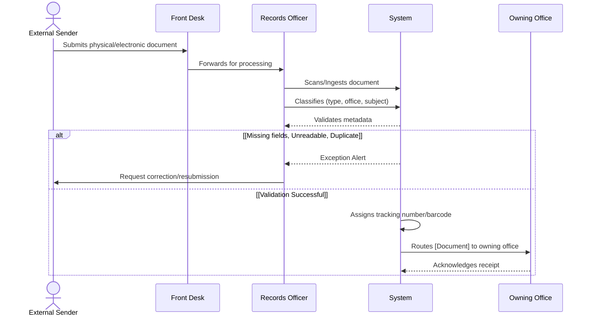

# Capture and Register Incoming Documents

```mermaid
sequenceDiagram
    actor Ext as External Sender
    participant FD as Front Desk
    participant RO as Records Officer
    participant Sys as System
    participant Office as Owning Office

    Ext->>FD: Submits physical/electronic document
    FD->>RO: Forwards for processing
    RO->>Sys: Scans/Ingests document
    RO->>Sys: Classifies (type, office, subject)
    Sys-->>RO: Validates metadata
    
    alt [Missing fields, Unreadable, Duplicate]
        Sys-->>RO: Exception Alert
        RO->>Ext: Request correction/resubmission
    else [Validation Successful]
        Sys->>Sys: Assigns tracking number/barcode
        Sys->>Office: Routes [Document] to owning office
        Office-->>Sys: Acknowledges receipt
    end
```