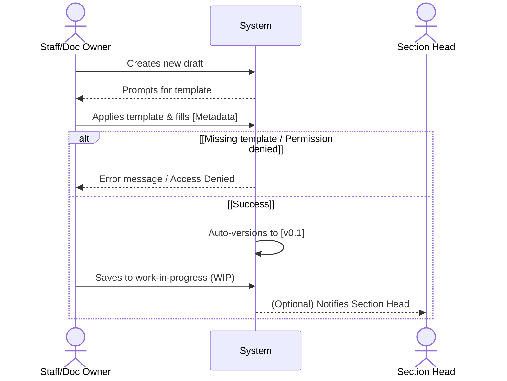

# Draft and Author Internal Documents

```mermaid
sequenceDiagram
    actor Owner as Staff/Doc Owner
    participant Sys as System
    actor SH as Section Head

    Owner->>Sys: Creates new draft
    Sys-->>Owner: Prompts for template
    Owner->>Sys: Applies template & fills [Metadata]
    
    alt [Missing template / Permission denied]
        Sys-->>Owner: Error message / Access Denied
    else [Success]
        Sys->>Sys: Auto-versions to [v0.1]
        Owner->>Sys: Saves to work-in-progress (WIP)
        Sys-->>SH: (Optional) Notifies Section Head
    end
``` 