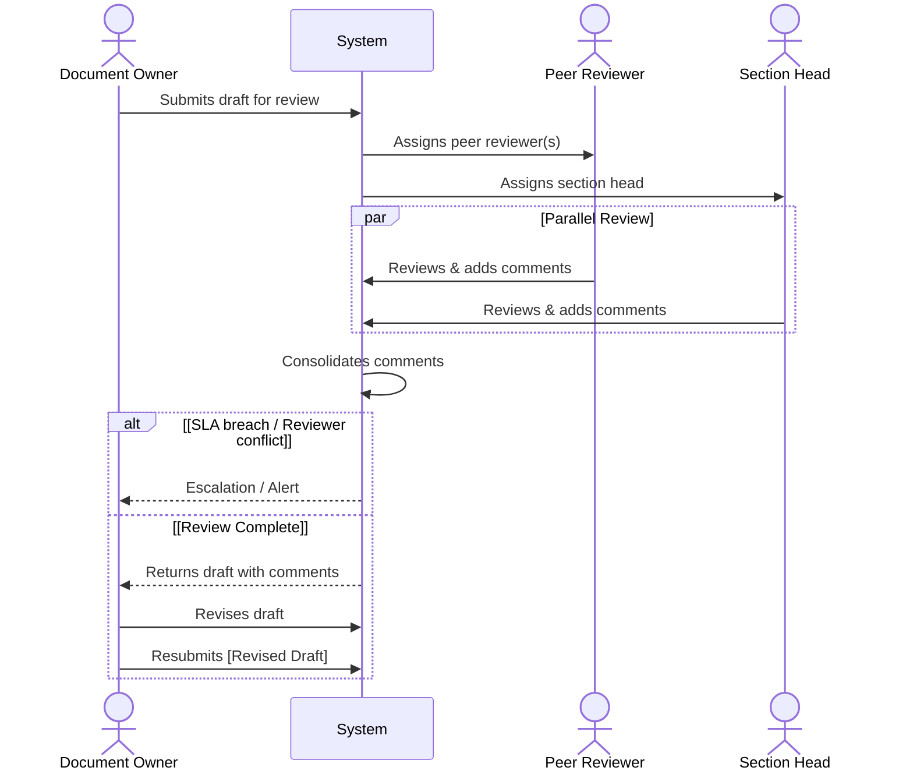

#

```mermaid
sequenceDiagram
    actor Author as Document Owner
    participant Sys as System
    actor PR as Peer Reviewer
    actor SH as Section Head

    Author->>Sys: Submits draft for review
    Sys->>PR: Assigns peer reviewer(s)
    Sys->>SH: Assigns section head
    
    par Parallel Review
        PR->>Sys: Reviews & adds comments
        SH->>Sys: Reviews & adds comments
    end
    
    Sys->>Sys: Consolidates comments
    
    alt [SLA breach / Reviewer conflict]
        Sys-->>Author: Escalation / Alert
    else [Review Complete]
        Sys-->>Author: Returns draft with comments
        Author->>Sys: Revises draft
        Author->>Sys: Resubmits [Revised Draft]
    end
```