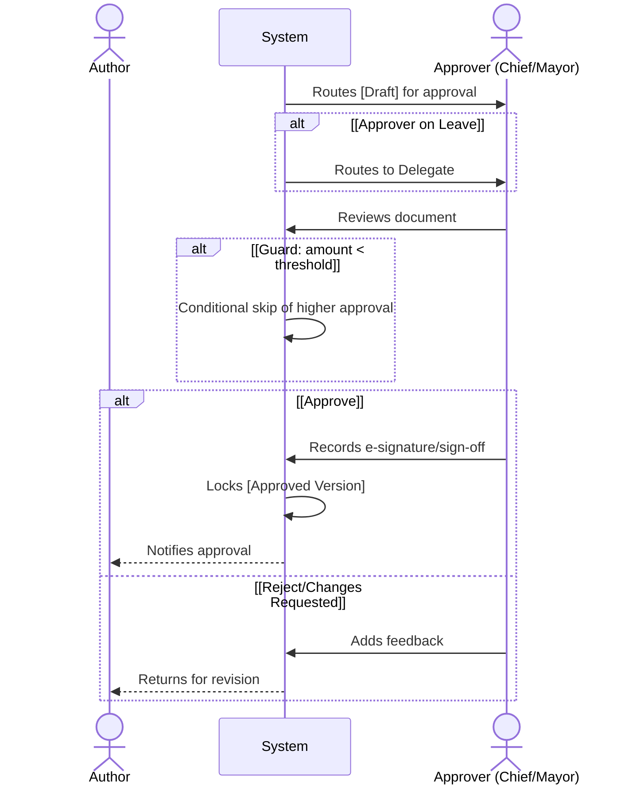

# Approval Workflow

```mermaid
sequenceDiagram
    actor Author as Author
    participant Sys as System
    actor App as Approver (Chief/Mayor)

    Sys->>App: Routes [Draft] for approval
    
    alt [Approver on Leave]
        Sys->>App: Routes to Delegate
    end
    
    App->>Sys: Reviews document
    
    alt [Guard: amount < threshold]
        Sys->>Sys: Conditional skip of higher approval
    end
    
    alt [Approve]
        App->>Sys: Records e-signature/sign-off
        Sys->>Sys: Locks [Approved Version]
        Sys-->>Author: Notifies approval
    else [Reject/Changes Requested]
        App->>Sys: Adds feedback
        Sys-->>Author: Returns for revision
    end
```