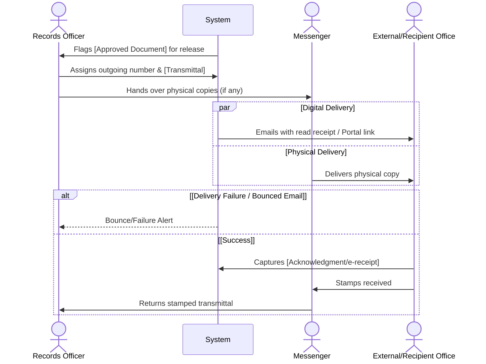

# Release, Routing, and Acknowledgment

```mermaid
sequenceDiagram
    actor RO as Records Officer
    participant Sys as System
    actor Mess as Messenger
    actor Rec as External/Recipient Office

    Sys->>RO: Flags [Approved Document] for release
    RO->>Sys: Assigns outgoing number & [Transmittal]
    RO->>Mess: Hands over physical copies (if any)
    
    par Digital Delivery
        Sys->>Rec: Emails with read receipt / Portal link
    and Physical Delivery
        Mess->>Rec: Delivers physical copy
    end
    
    alt [Delivery Failure / Bounced Email]
        Sys-->>RO: Bounce/Failure Alert
    else [Success]
        Rec->>Sys: Captures [Acknowledgment/e-receipt]
        Rec->>Mess: Stamps received
        Mess->>RO: Returns stamped transmittal
    end
```