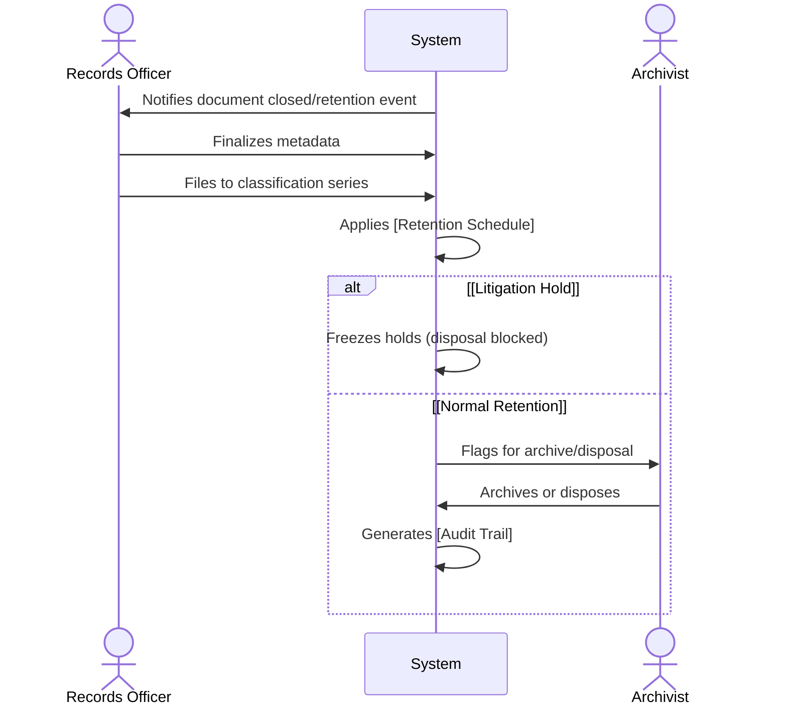

# Filing, Archiving, and Retention

```mermaid
sequenceDiagram
    actor RO as Records Officer
    participant Sys as System
    actor Arch as Archivist

    Sys->>RO: Notifies document closed/retention event
    RO->>Sys: Finalizes metadata
    RO->>Sys: Files to classification series
    Sys->>Sys: Applies [Retention Schedule]
    
    alt [Litigation Hold]
        Sys->>Sys: Freezes holds (disposal blocked)
    else [Normal Retention]
        Sys->>Arch: Flags for archive/disposal
        Arch->>Sys: Archives or disposes
        Sys->>Sys: Generates [Audit Trail]
    end
```