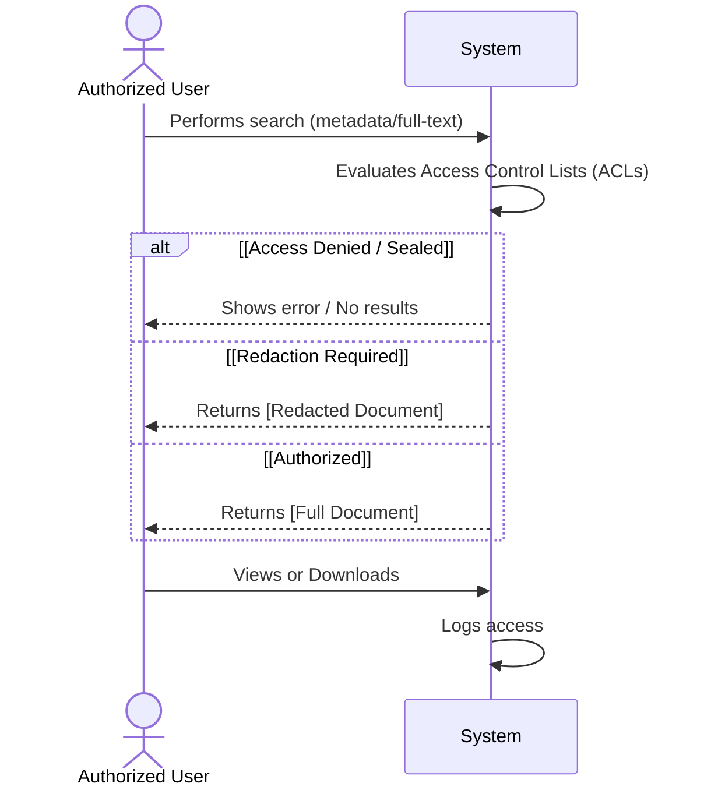

# Search, Retrieval, and Access Control

```mermaid
sequenceDiagram
    actor User as Authorized User
    participant Sys as System

    User->>Sys: Performs search (metadata/full-text)
    Sys->>Sys: Evaluates Access Control Lists (ACLs)
    
    alt [Access Denied / Sealed]
        Sys-->>User: Shows error / No results
    else [Redaction Required]
        Sys-->>User: Returns [Redacted Document]
    else [Authorized]
        Sys-->>User: Returns [Full Document]
    end
    
    User->>Sys: Views or Downloads
    Sys->>Sys: Logs access
```