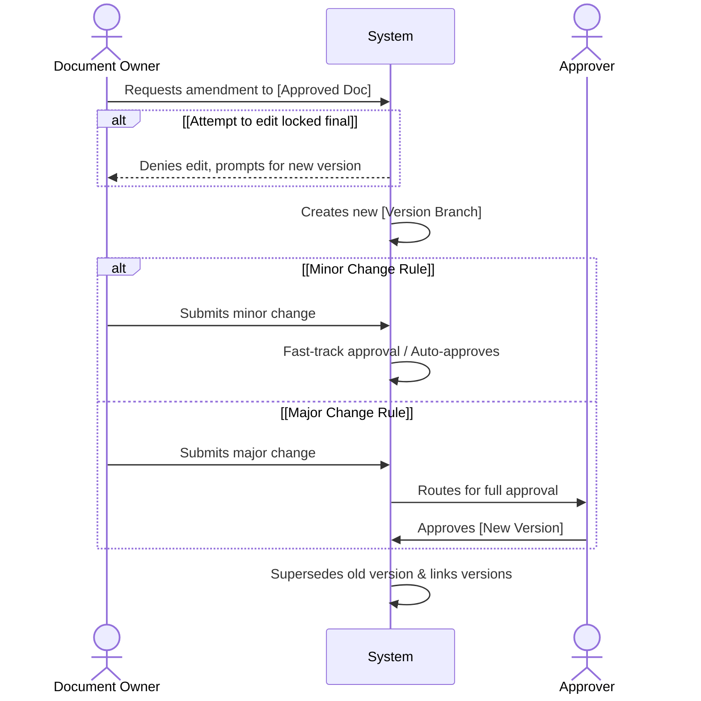

# Versioning and Amendments

```mermaid
sequenceDiagram
    actor Owner as Document Owner
    participant Sys as System
    actor App as Approver

    Owner->>Sys: Requests amendment to [Approved Doc]
    
    alt [Attempt to edit locked final]
        Sys-->>Owner: Denies edit, prompts for new version
    end
    
    Sys->>Sys: Creates new [Version Branch]
    
    alt [Minor Change Rule]
        Owner->>Sys: Submits minor change
        Sys->>Sys: Fast-track approval / Auto-approves
    else [Major Change Rule]
        Owner->>Sys: Submits major change
        Sys->>App: Routes for full approval
        App->>Sys: Approves [New Version]
    end
    
    Sys->>Sys: Supersedes old version & links versions
```