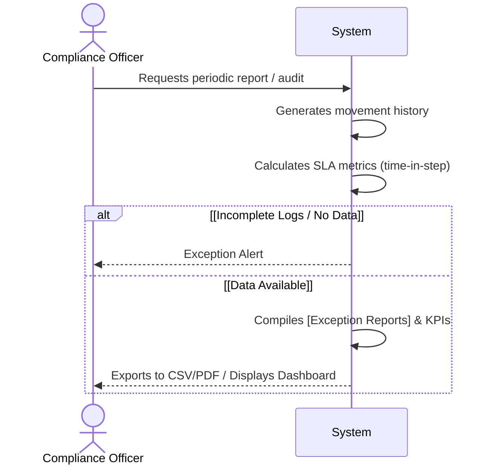

# Audit, Reporting, and SLAs

```mermaid
sequenceDiagram
    actor CO as Compliance Officer
    participant Sys as System

    CO->>Sys: Requests periodic report / audit
    Sys->>Sys: Generates movement history
    Sys->>Sys: Calculates SLA metrics (time-in-step)
    
    alt [Incomplete Logs / No Data]
        Sys-->>CO: Exception Alert
    else [Data Available]
        Sys->>Sys: Compiles [Exception Reports] & KPIs
        Sys-->>CO: Exports to CSV/PDF / Displays Dashboard
    end
```