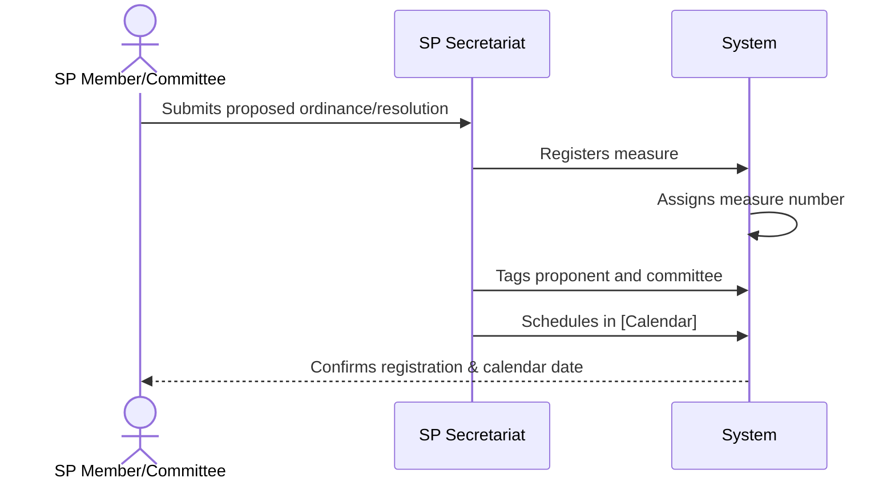

# Intake of Proposed Ordinances/Resolutions

```mermaid
sequenceDiagram
    actor Prop as SP Member/Committee
    participant Sec as SP Secretariat
    participant Sys as System

    Prop->>Sec: Submits proposed ordinance/resolution
    Sec->>Sys: Registers measure
    Sys->>Sys: Assigns measure number
    Sec->>Sys: Tags proponent and committee
    Sec->>Sys: Schedules in [Calendar]
    Sys-->>Prop: Confirms registration & calendar date
```