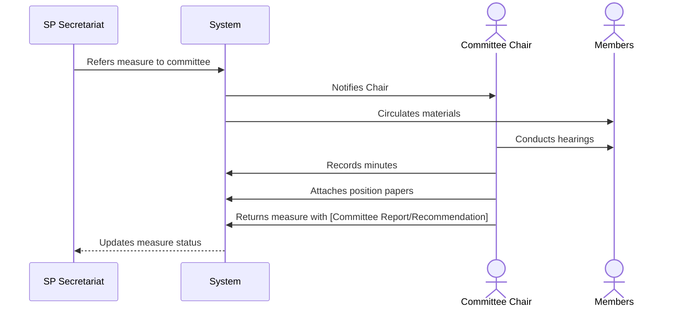

# Committee Referral and Hearings

```mermaid
sequenceDiagram
    participant Sec as SP Secretariat
    participant Sys as System
    actor Chair as Committee Chair
    actor Mem as Members

    Sec->>Sys: Refers measure to committee
    Sys->>Chair: Notifies Chair
    Sys->>Mem: Circulates materials
    Chair->>Mem: Conducts hearings
    Chair->>Sys: Records minutes
    Chair->>Sys: Attaches position papers
    Chair->>Sys: Returns measure with [Committee Report/Recommendation]
    Sys-->>Sec: Updates measure status
```