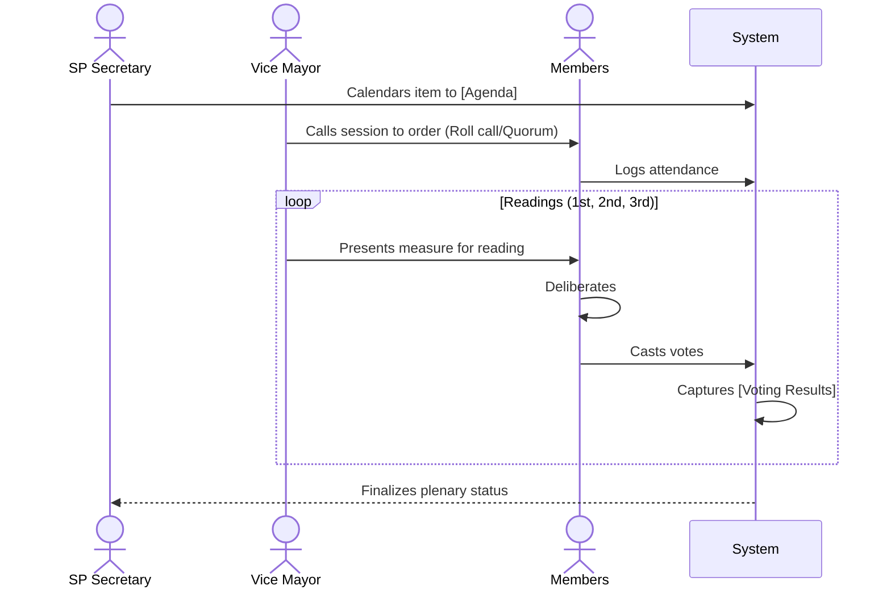

# Plenary Calendar and Session Management

```mermaid
sequenceDiagram
    actor Sec as SP Secretary
    actor VM as Vice Mayor
    actor Mem as Members
    participant Sys as System

    Sec->>Sys: Calendars item to [Agenda]
    VM->>Mem: Calls session to order (Roll call/Quorum)
    Mem->>Sys: Logs attendance
    
    loop Readings (1st, 2nd, 3rd)
        VM->>Mem: Presents measure for reading
        Mem->>Mem: Deliberates
        Mem->>Sys: Casts votes
        Sys->>Sys: Captures [Voting Results]
    end
    
    Sys-->>Sec: Finalizes plenary status
```