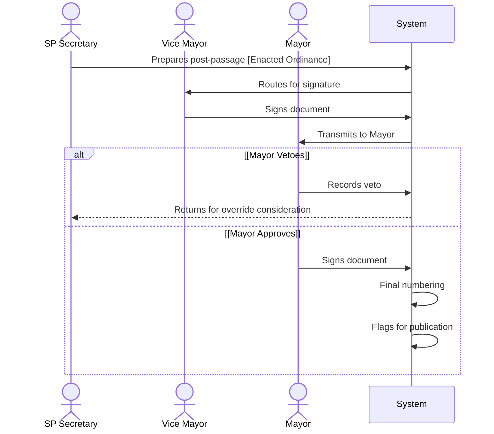

# Signing and Enactment Workflow

```mermaid
sequenceDiagram
    actor Sec as SP Secretary
    actor VM as Vice Mayor
    actor Mayor as Mayor
    participant Sys as System

    Sec->>Sys: Prepares post-passage [Enacted Ordinance]
    Sys->>VM: Routes for signature
    VM->>Sys: Signs document
    Sys->>Mayor: Transmits to Mayor
    
    alt [Mayor Vetoes]
        Mayor->>Sys: Records veto
        Sys-->>Sec: Returns for override consideration
    else [Mayor Approves]
        Mayor->>Sys: Signs document
        Sys->>Sys: Final numbering
        Sys->>Sys: Flags for publication
    end
```