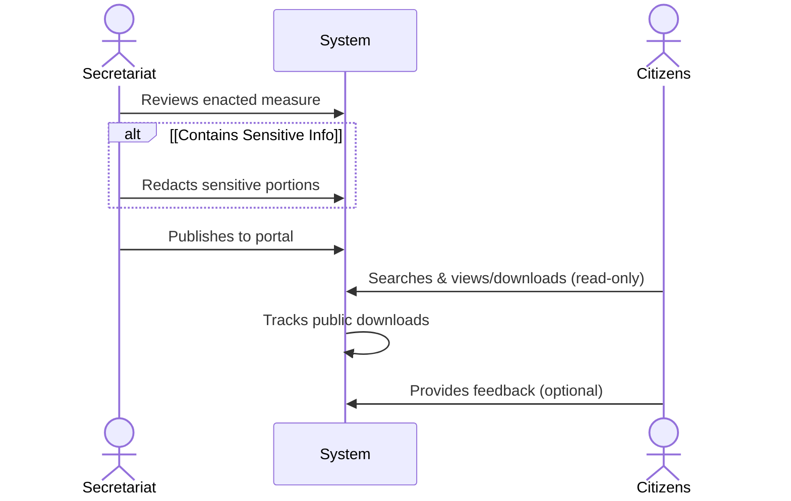

# Publication and Public Access

```mermaid
sequenceDiagram
    actor Sec as Secretariat
    participant Sys as System
    actor Cit as Citizens

    Sec->>Sys: Reviews enacted measure
    
    alt [Contains Sensitive Info]
        Sec->>Sys: Redacts sensitive portions
    end
    
    Sec->>Sys: Publishes to portal
    Cit->>Sys: Searches & views/downloads (read-only)
    Sys->>Sys: Tracks public downloads
    Cit->>Sys: Provides feedback (optional)
```