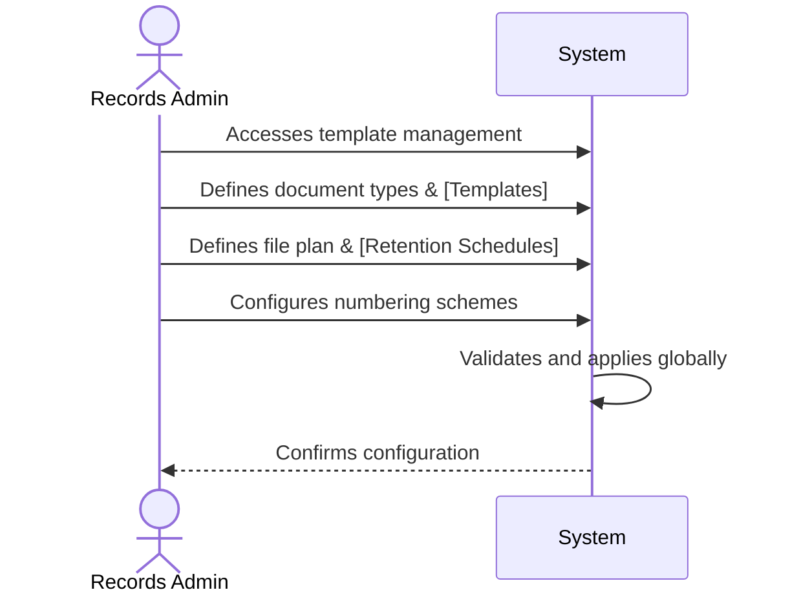

# Template and Classification Management

```mermaid
sequenceDiagram
    actor Admin as Records Admin
    participant Sys as System

    Admin->>Sys: Accesses template management
    Admin->>Sys: Defines document types & [Templates]
    Admin->>Sys: Defines file plan & [Retention Schedules]
    Admin->>Sys: Configures numbering schemes
    Sys->>Sys: Validates and applies globally
    Sys-->>Admin: Confirms configuration
```