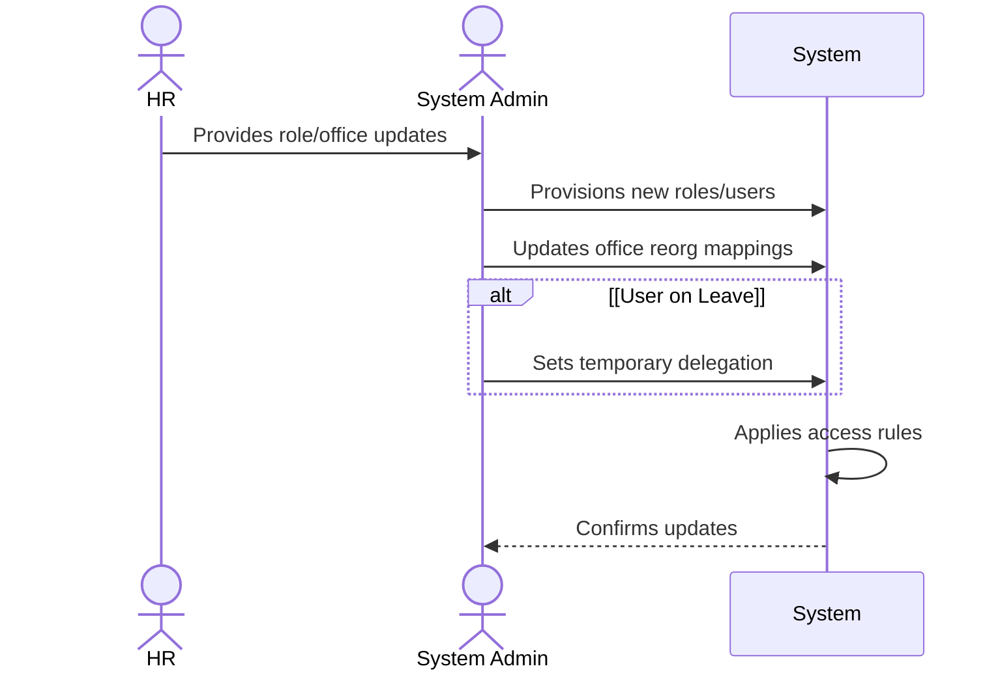

# User/Role and Delegation Management

```mermaid
sequenceDiagram
    actor HR as HR
    actor Admin as System Admin
    participant Sys as System

    HR->>Admin: Provides role/office updates
    Admin->>Sys: Provisions new roles/users
    Admin->>Sys: Updates office reorg mappings
    
    alt [User on Leave]
        Admin->>Sys: Sets temporary delegation
    end
    
    Sys->>Sys: Applies access rules
    Sys-->>Admin: Confirms updates
```