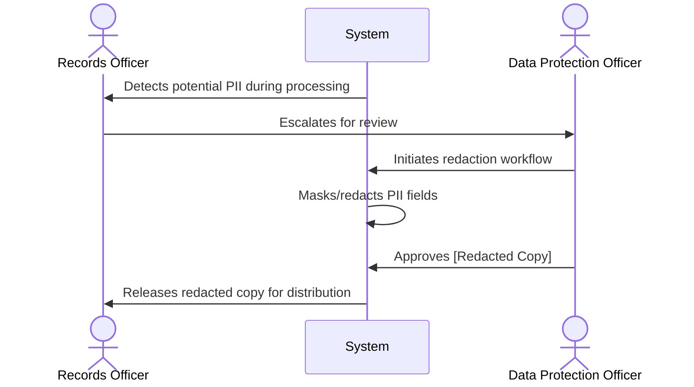

# Security, Redaction, and PII Handling

```mermaid
sequenceDiagram
    actor RO as Records Officer
    participant Sys as System
    actor DPO as Data Protection Officer

    Sys->>RO: Detects potential PII during processing
    RO->>DPO: Escalates for review
    DPO->>Sys: Initiates redaction workflow
    Sys->>Sys: Masks/redacts PII fields
    DPO->>Sys: Approves [Redacted Copy]
    Sys->>RO: Releases redacted copy for distribution
```