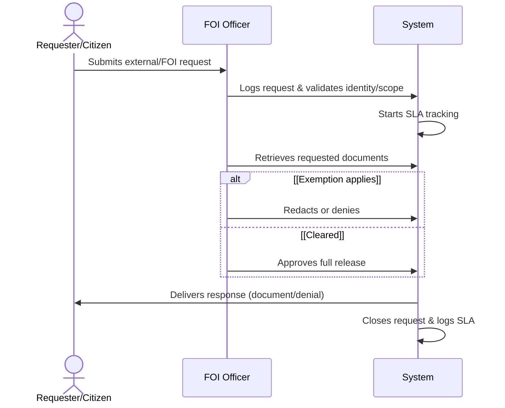

# External Requests and FOI Handling

```mermaid
sequenceDiagram
    actor Cit as Requester/Citizen
    participant FOI as FOI Officer
    participant Sys as System

    Cit->>FOI: Submits external/FOI request
    FOI->>Sys: Logs request & validates identity/scope
    Sys->>Sys: Starts SLA tracking
    FOI->>Sys: Retrieves requested documents
    
    alt [Exemption applies]
        FOI->>Sys: Redacts or denies
    else [Cleared]
        FOI->>Sys: Approves full release
    end
    
    Sys->>Cit: Delivers response (document/denial)
    Sys->>Sys: Closes request & logs SLA
```