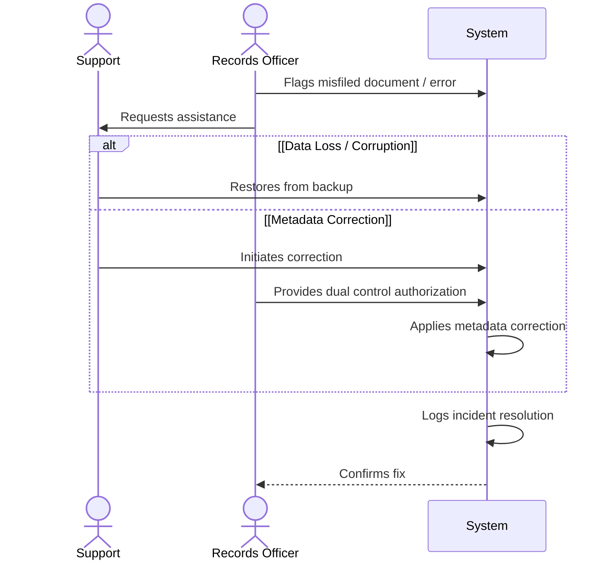

# Incident and Exception Handling

```mermaid
sequenceDiagram
    actor Support as Support
    actor RO as Records Officer
    participant Sys as System

    RO->>Sys: Flags misfiled document / error
    RO->>Support: Requests assistance
    
    alt [Data Loss / Corruption]
        Support->>Sys: Restores from backup
    else [Metadata Correction]
        Support->>Sys: Initiates correction
        RO->>Sys: Provides dual control authorization
        Sys->>Sys: Applies metadata correction
    end
    
    Sys->>Sys: Logs incident resolution
    Sys-->>RO: Confirms fix
```