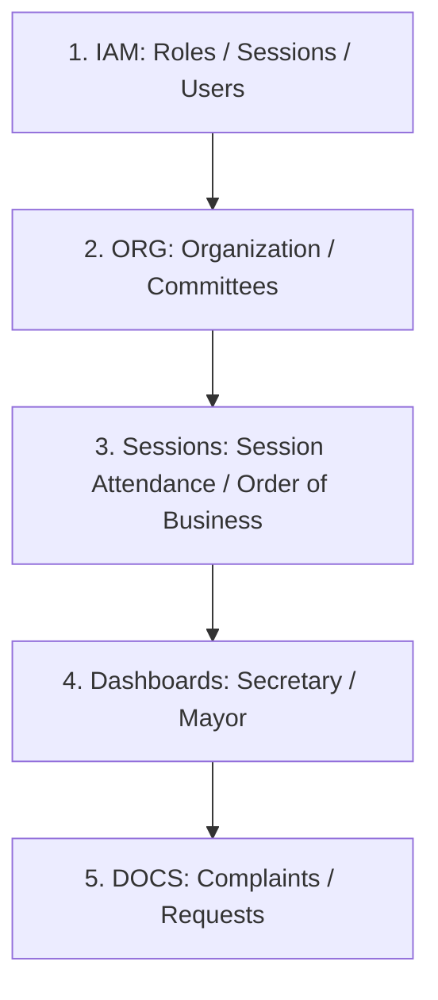

# Batac City LGU Platform — Frontend Task Planning: Architecture and Findings

## Table of Contents

- [L19–L42] 1. System Overview & Pipeline Status — Pipeline architecture, Step 3/4 stall details, unpopulated module placeholders, and domain-owned task generation mechanisms.
- [L43–L86] 2. Master Frontend Task List Feasibility & Feasibility Inventory — Feasibility of generation, the three-tier status framework, and tables of unbuilt and blocked routes.
- [L87–L104] 3. Confirmed Repository Ground Truth — Actual built pages, empty Next.js portal shell, panel counts, and flat React Router registration conventions.
- [L105–L145] 4. Module-by-Module Verification & Analysis — Database procedures, roles, schemas, live bugs, and get-endpoint gaps for IAM, ORG, WF, DOCS, and AUDIT.
- [L146–L170] 5. Unresolved Cross-Document Tensions — Designation vs. delegation conflicts, unowned sysadmin infrastructure features, and workflow panel enforcement asymmetry.
- [L171–L272] 6. Frontend Build Plan — Build sequencing rationale and lists of routes excluded due to backend or specification blockers.
  - [L173–L189] Suggested Build Order — Optimal five-step build sequence mapped by route dependency to avoid broken navigation links.
  - [L190–L196] Shared Frontend Conventions — tRPC client setup, query invalidation, conditional toast requirements, and list of reusable Tier-3 domain components.
  - [L197–L272] Per-Route Build Instructions — Step-by-step implementation details, role gates, tRPC hooks, and UI requirements for each unbuilt route.
- [L273–L286] 7. Stale Documentation & Live Bugs — Mismatches in specs, live bugs (MultiReferralPanel gate, revokeRole targetId), and stale codebase comments.

---

## 1. System Overview & Pipeline Status

### Pipeline Architecture (A1 Pipeline)
The Batac City LGU Platform is built via a document-governed, multi-pass generation pipeline defined in `docs/pre-development/A1-AGENTS.md`. Module-level task lists (infra, ui, iam, audit, org, docs, wf, track) are produced through a 14-pass generation process where each module pass loads a defined document set plus the already-generated task lists of its prerequisite modules, in dependency-wave order (Wave A → B → C → ... → G). 

The human-facing operator playbook for this pipeline is `build-master-tasklist.md` (located in the repo root).

### Pipeline Stall Points
- **Step 3 (Outline)**: Output file `a1-outline-phases.md` is empty (0 lines). This step has never been executed.
- **Step 4 (Integration)**: Output file `a1-master-phased-task-list.md` is empty (0 lines). Because Step 4 depends on the Step 3 outline, the pipeline stalled at Step 3.
- **Unpopulated Placeholders**: The module task files `notif.md`, `portal.md`, and `rec.md` exist as files but are genuinely empty (0 bytes), as their Step 2 passes have not yet been run.

### The Frontend Ownership Model
There is no standalone "FE" (frontend) module in the system by design. Feature-specific frontend work is distributed to whichever backend/domain module owns that feature area:
- **UI Module**: Component library foundation and the 16 Tier 3 domain components only. No feature pages.
- **Feature Pages**: Owned and built by their corresponding backend modules (e.g., `DOCS` owns document-facing pages; `WF` owns workflow-facing pages).
- **Dependency Rule**: UI feature pages depend on the backend module tasks that implement the tRPC procedures they call.

### Task Generation Mechanisms
1. **Mechanism 1 (Document-Based)**: Sourced from pre-development architecture documents (F1, Zustand store design, accessibility checklist, etc.) and prior task lists. These passes can run ahead of implementation.
2. **Mechanism 2 (Post-Closure Forensic)**: Appended ad-hoc to task lists after a module's main task list is formally closed (e.g., `fe.md` for WF, and tasks `TASK-DOCS-020–023` in `docs.md`). These require reading the actual current state of specific source files line-by-line and structurally cannot run ahead of implementation.

---

## 2. Master Frontend Task List Feasibility & Feasibility Inventory

### Feasibility of a Master Task List
A complete, execution-ready master frontend task list cannot be generated purely from the A1 pipeline's document-based mechanisms. This is because:
1. F1 (the application route map) was never loaded by the Step 2 passes of six modules (IAM, AUDIT, ORG, DOCS, WF, TRACK).
2. The pipeline's Step 4 "missing task detection" operation only validates the prerequisite graph (broken task ID references) and does not perform semantic validation against F1.

However, a high-level master component/page inventory with build status is achievable by cross-referencing F1's route map against direct filesystem observation of built pages and backend routers.

### The Three-Tier Status Framework
To classify unbuilt frontend surfaces:
- **Tier 1 — Built**: The page or component directory exists on disk and is verified.
- **Tier 2 — Frontend-Only Gap**: The backend procedures exist and are verified working; only the frontend page itself is missing.
- **Tier 3 — Backend-Blocked / Spec-Blocked**: The backend procedures, modules, or specification itself do not yet exist.

### Master Route Inventory

#### Tier 2 — Genuinely Frontend-Only Gaps (21 Routes)
These pages have active backends and can be built immediately:

| Module | Routes | Backend status |
|---|---|---|
| **IAM** | `/admin/roles`, `/sysadmin/sessions`, `/sysadmin/users` | Verified (14 tasks in `iam.md`) |
| **AUDIT** | `/audit`, `/audit/full`, `/sysadmin/audit-integrity` | Gated but verified (7 tasks in `audit.md`) |
| **ORG** | `/organization`, `/admin/committees` | Verified (10 tasks in `org.md`) |
| **WF** | `/secretary`, `/mayor`, `/order-of-business`, `/sessions`, `/sessions/:sessionDate` | Verified (24 tasks in `wf.md` + `session.router.ts`) |
| **DOCS** | `/complaints`, `/complaints/new`, `/complaints/:complaintId`, `/document-requests`, `/document-requests/new`, `/document-requests/:requestId` | Verified (DOCS module backend scope) |
| **—** | `/sysadmin` (Landing shell) | Static links page only |

#### Tier 3 — Backend- or Spec-Blocked (13 Routes)
These pages are blocked by missing backend modules, procedures, or specifications:

| Route(s) | Blocker | Status |
|---|---|---|
| `/admin/announcements` | PORTAL module is unbuilt (`portal.md` is 0 lines). | Backend-Blocked |
| `/admin/delivery-logs` | NOTIF module is unbuilt (`notif.md` is 0 lines). | Backend-Blocked |
| `/admin/config` | Needs a net-new config-screen specification before backend work can start. | Spec-Blocked |
| `/retention-schedules` | `records.getRetentionSchedule` does not exist in the codebase. | Backend-Blocked |
| All 9 `/portal/*` routes | Portal module backend and `/apps/portal` app are unbuilt. | Backend-Blocked |

*Note: The **TRACK** module's procedures are fully consumed within the already-built `/documents/:documentId` detail page; it has no dedicated route in the route map and has no page-level frontend gap.*

---

## 3. Confirmed Repository Ground Truth

### Frontend Page Tree State
The built page tree under `apps/web/src/pages/` consists of:
1. Component showcase routes (`/dev/*`) representing the UI module's Tier 3 library and foundation.
2. DOCS module core pages: `/documents` (`DocumentListPage`), `/documents/:documentId` (`DocumentDetailPage`), and `/documents/new`.
3. WF module core pages: `/workflow/steps` (`MyAssignedStepsPage`) and `/workflow/steps/:instanceId` (`WorkflowStepActionPage`), plus exactly 11 workflow panels.

*No directories exist on disk for `/admin`, `/sysadmin`, `/audit`, `/organization`, `/secretary`, `/mayor`, `/order-of-business`, `/sessions`, `/complaints`, or `/document-requests`.*

### PORTAL Module State
`apps/portal` exists on disk but is a bare Next.js scaffold shell (`layout.tsx` + `fonts.ts` only, no actual pages). The PORTAL module itself remains unbuilt (`portal.md` is 0 lines).

### Route Registration Convention
`apps/web/src/main.tsx` uses a flat `createBrowserRouter` array. The established convention is to register static path segments before dynamic ones (e.g., `/documents/new` before `/documents/:documentId`) for readability.

---

## 4. Module-by-Module Verification & Analysis

### IAM Module
- **Verified Procedures**: `listUserDirectory`, `assignRole`, `revokeRole`, `editUserAccount`, `createUserAccount`, `deactivateUserAccount`, `reactivateUserAccount`, `listAllActiveSessions`, `forceTerminateSession`.
- **Role-Gating Pattern**: Uses boolean flags on the auth context (`ctx.auth.isItAdmin`, `ctx.auth.isPlatformAdmin`) rather than string-comparison checks (e.g. `roles.includes('plat_admin')`).
- **Output Shape Discrepancy**: `listUserDirectory` and `listAllActiveSessions` return raw Drizzle-inferred database rows (`UserRow`, `SessionRow`) directly from the database schema rather than the rich `userSummaryOutput` schema. The raw table records contain no `displayName`, `officeId`, or `positionTitle` fields.

### ORG (Organization) Module
- **Verified Procedures**: `getOfficeHierarchy`, `createOffice`, `updateOffice`, `deactivateOffice`, `createPosition`, `updatePosition`, `createEmployee`, `updateEmployee`, `assignEmployeeToPosition`, `listCommittees`, `createCommittee`, `updateCommittee`, `assignCommitteeMembership`, `getActiveDesignations`, `getDesignationHistory`.
- **`getOfficeHierarchy`**: Returns flat `{ offices: OfficeSummary[] }` which must be nested into a tree structure client-side (offices with `parentOfficeId: null` are roots). Uses the standard `officeTypeEnum` (`executive/legislative/department/barangay/external`).
- **Required Fields**: `employeeNumber` (on employee creation) and `chairedByEmployeeId` (on committee creation) are database-level `NOT NULL` columns. Any frontend creation form must treat them as required, even though their Zod input schemas type them as optional.

### WF (Workflow) Module

#### Legislative Sessions & Order of Business (`session.router.ts`)
- **Verified Procedures**: `session.getAttendanceRecord`, `session.getAttendanceStatistics`, `session.getOrderOfBusiness`, `session.scheduleDocumentForFirstReading`, `session.enterCommitteeHearingDate`, `workflow.manuallyAdvanceMultiReferralStep`.
- **`getAttendanceRecord`**: Output shape lacks a `presidedByEmployeeId` field.
- **`getAttendanceStatistics`**: Output has `printableSummaryUrl` which is hardcoded to `null` server-side in Phase 1.
- **`recordAttendance` Substitute-Officer Logic**: resolves substitute-officer assignment automatically server-side by querying `delegationGrants` (ORG's table). The frontend does not submit substitute details, and the Zod input schema contains no substitute-officer field.
- **Read-Path Gap**: `presidedByEmployeeId` is saved into `spSessions` by the write mutations but is never read back out or returned in `getAttendanceRecord`, preventing display of the substitute.

#### Workflow Engine & Dashboards (`workflow.router.ts`)
- **`listMyAssignedSteps`**: Fetches steps assigned to the current user. Its filtering is role-based; it cannot filter down to a specific task type (like mayor-action steps) from the list itself because the returned items omit the fine-grained `stepKey`.
- **`getInstance` and `stepKey`**: The internal query selects `stepKey` to compute `panelHint`, but drops it before returning the object. `panelHint` is the only client-visible signal for step identity.
- **Mayor Dashboard Constraint**: To filter mayoral steps, the client must use an N+1 pattern: fetch `listMyAssignedSteps`, then call `getInstance` per row to check if `panelHint === 'mayor_decision'`. A server-side filter or adding `panelHint`/`stepKey` to `listMyAssignedSteps`'s output would be required to avoid this N+1 pattern.
- **`getSlaComplianceData`**: Verified to exist and backed by the `canAccessSlaData` ABAC policy. Returns a flat array of SLA details for secretary/mayor dashboard widgets.

### DOCS (Documents) Module
- **Verified List/Write Procedures**: `listAllComplaints`, `createComplaintClerkAssisted`, `logAndAssign`, `enterCommitteeReport`, `setOutcome` (for complaints); `listAllDocumentRequests`, `createDocumentRequestClerkAssisted`, `generatePrintableForm`, `approveAsPresidingOfficer`, `approveAsSecretary`, `releaseCopy` (for requests).
- **Missing Read Procedures (ADR-UI-005 Gap)**: `complaints.get` and `documentRequests.get` do not exist anywhere in the server codebase despite being specified in ADR-UI-005. Both routes `/complaints/:complaintId` and `/document-requests/:requestId` are blocked until these are built.
- **Approval Procedures (Phase 1 Stubs)**: The document-requests router tracks approvals via raw JSONB fields (`vm_approved`, `sp_approved`) instead of Workflow step instances. This is an internal detail that does not block the frontend contract.
- **`releaseCopy` Preconditions**: Requires `lifecycleState === 'completed'` (both approvals done). Payment tracking is deferred to Phase 2, so the frontend must build the release action to work with empty payment fields.

### AUDIT Module
- **Procedure State**: Only `queryEvents` exists in `audit.router.ts`. The five procedures documented in F1 (`listOwnActions`, `listOwnOfficeDocumentActions`, `listFullLog`, `validateChainIntegrity`, `exportEvents`) do not exist.
- **Role-Gate Mismatch**: `queryEvents` is gated to `sys_admin` and `auditor` only. If any of the other 10 internal roles call it (e.g., to view their own actions at `/audit`), they receive `FORBIDDEN`.
- **Reconciliation Block**: The audit routes `/audit`, `/audit/full`, and `/sysadmin/audit-integrity` are blocked pending a decision to either build the missing procedures or correct the F1 spec.
- **Crypto Layer**: The cryptographic verification primitives (`computeChainHash`, `canonicalizePayload`, `signHmac`, `verifyHmac`) are already built in `audit.crypto.ts` and can be wired into a future `validateChainIntegrity` procedure.

---

## 5. Unresolved Cross-Document Tensions

### Designation vs. Delegation Tension (KF-11)
- **F1 §9 / ADR-UI-007**: Dictates that the Designation document type and its "Log Designation document" action are Phase 1 scope to support `/sessions/:sessionDate` attendance tracking.
- **`org.md` Module Summary**: States that delegation management UI (designation logging form, active designation list view) is explicitly deferred to **Phase 1B**.
- **In-Code Verification**:
  - The read-side procedures `getActiveDesignations` and `getDesignationHistory` are implemented.
  - The `recordAttendance` mutation automatically handles substitute resolution server-side, and its input schema has no field for substitute assignment.
  - `presidedByEmployeeId` is written but never returned in read queries.
- **Inference**: F1/ADR-UI-007 may describe a narrow document-logging action embedded within the Session Attendance detail page, while `org.md` refers to the dedicated delegation-management admin screen. This must be resolved by a human product decision.

### Unowned Sysadmin Infrastructure Capabilities (KF-14)
F1 §13.5 lists four System Administrator infrastructure capabilities that lack tRPC procedures, routes, or module assignments:
1. System health / infrastructure metrics
2. Encryption key management
3. Schema migrations
4. Backup / restore

These are flagged as speculative features that may belong in a separate operations console outside the main web application. They are not assigned to any module and remain open.

### Workflow Panel Enforcement Asymmetry
Only some workflow panels are server-side enforced against incorrect step calls. The **Docketing** and **Veto Override** panels lack server-side validation against being invoked on the wrong step. Frontend panel routing correctness is a critical security property for these panels, not merely a UX concern.

---

## 6. Frontend Build Plan

### Suggested Build Order
The suggested build order prioritizes dependencies (underlying pages/details are built before the pages linking to them) to prevent 404 links during incremental development:

1. **IAM**: `/admin/roles`, `/sysadmin/sessions`, `/sysadmin/users`, and landing `/sysadmin`. (Self-contained, verified backend).
2. **ORG**: `/organization`, `/admin/committees`. (Verified backend; manages committee data for other pickers).
3. **WF (Order of Business & Sessions)**: `/order-of-business`, `/sessions`, `/sessions/:sessionDate`.
4. **WF (Dashboards)**: `/secretary`, `/mayor`. (Depends on Sessions and Order of Business routes to link correctly).
5. **DOCS**: `/complaints`, `/complaints/new`, `/complaints/:complaintId`, `/document-requests`, `/document-requests/new`, `/document-requests/:requestId`. (Gapped by ADR-UI-005 single-read backend procedures).

### Shared Frontend Conventions
- **tRPC client / auth**: Hook query client via `apps/web/src/lib/trpc.ts` and `auth-context.tsx`.
- **Query Invalidation**: Use `trpc.useUtils()` inside `useMutation({ onSuccess, onError })` to invalidate queries (mutate → toast → invalidate → navigate).
- **Toast gotcha**: Never fire a success toast unconditionally; verify that the mutation response indicates a successful change to prevent masking failures.
- **Gating**: Gating must be performed page-internally. The `hasRole` helper is currently duplicated locally in `DocumentDetailPage.tsx` and should be extracted to a shared `apps/web/src/lib/auth-helpers.ts` library.
- **Component Reuse**: Check the Tier 3 domain component library (`packages/ui/src/components/domain/`) before building custom equivalents for elements like `AppShell`, `StatusBadge`, `SLATimer`, or `OrderOfBusinessRow`.

### Per-Route Build Instructions

#### 1. IAM Module

##### `/admin/roles` (`RoleAssignmentPage`)
- **Gating**: Platform Administrator (`ctx.auth.isPlatformAdmin`).
- **Implementation**: Searchable user directory via `trpc.iam.listUserDirectory.useQuery({ search, pageSize })`. Displays `username` and `email` (only fields in raw `UserRow`). Inline roles are managed via `assignRole` (select list of the 13 role codes) and `revokeRole`. Handles `RoleCombinationForbiddenError` by showing the server-provided error message in the toast. Do not build role *definition* forms.

##### `/sysadmin` (`SystemAdminHomePage`)
- **Gating**: IT Administrator (`ctx.auth.isItAdmin`).
- **Implementation**: Static links page navigating to the active sessions and user management sub-routes.

##### `/sysadmin/sessions` (`ActiveSessionsPage`)
- **Gating**: IT Administrator.
- **Implementation**: Tabular list of active sessions using `trpc.iam.listAllActiveSessions.useQuery()`. Displays `userId`, `ipAddress`, `userAgent`, and `lastActivityAt`. Each row has a "Terminate" action opening a modal that requires a non-empty `reason` string before calling `forceTerminateSession`.

##### `/sysadmin/users` (`UserAccountManagementPage`)
- **Gating**: IT Administrator.
- **Implementation**: Create user form calling `createUserAccount` (requires `username`, `email`, and employee picker for `employeeId`). List directory of users with deactivation/reactivation toggles.

#### 2. ORG Module

##### `/organization` (`OrganizationPage`)
- **Gating**: Read access for most internal roles; write access for Platform Administrator.
- **Implementation**: Builds flat offices array from `getOfficeHierarchy.useQuery()` into a nested tree view client-side. Write controls let Platform Admins call office, position, employee, and assignment mutations. Treats `employeeNumber` as required in the UI forms.

##### `/admin/committees` (`CommitteeManagementPage`)
- **Gating**: Platform Administrator.
- **Implementation**: Renders committees array from `listCommittees.useQuery()`. Management controls call `createCommittee` and `updateCommittee` (treating `chairedByEmployeeId` as required in form validation) and `assignCommitteeMembership` (roles: `chairman`, `vice_chairman`, `member`).

#### 3. WF Module — Sessions & Order of Business

##### `/order-of-business` (`OrderOfBusinessPage`)
- **Gating**: Read access for legislative roles; write access for SP Secretary.
- **Implementation**: Calls `getOrderOfBusiness.useQuery({ sessionDate })` (defaulting to next Tuesday). Renders items using the existing `OrderOfBusinessRow` domain component; flags `committeeReportStatus === 'red_flagged'` items in red. Management forms for SP Secretary schedule documents for first reading (`sessionDate` snaped/rolled server-side) and record hearing dates.

##### `/sessions` (`SessionAttendanceOverviewPage`)
- **Gating**: Legislative roles.
- **Implementation**: Chart/table of session dates, present counts, and absent counts from `getAttendanceStatistics.useQuery()`. Disable "print summary" options as `printableSummaryUrl` is hardcoded to `null` server-side.

##### `/sessions/:sessionDate` (`SessionAttendanceDetailPage`)
- **Gating**: Read for legislative roles; recording for SP Secretary.
- **Implementation**: Displays present/absent counts and whether quorum was met (>= 7 present). Lists absences with reasons. SP Secretaries are provided with a grid/list of councilors with attendance toggles, submitting changes via `recordAttendance` (using input reasons: `official_business`, `sick_leave`, `vacation_leave`, `absent_unqualified`). If the read-path gap is resolved, displays a read-only substitute officer name.

#### 4. WF Module — Dashboards

##### `/secretary` (`SecretaryDashboardPage`)
- **Gating**: SP Secretary.
- **Implementation**: Grid layout composing:
  - `QueueWidget`: top 5-10 rows from `workflow.listMyAssignedSteps`.
  - `PendingItemsWidget`: `documents.list` filtered to SP Secretariat office ID (derived from the user's office scope).
  - `SessionCalendarWidget` & `OrderOfBusinessSummaryWidget`: shared call to `session.getOrderOfBusiness`.
  - `SlaComplianceWidget`: `workflow.getSlaComplianceData({ breachedOnly: true })` (gates SLA data check).

##### `/mayor` (`MayorDashboardPage`)
- **Gating**: Mayor.
- **Implementation**: Renders parallel queries using `listMyAssignedSteps` followed by `getInstance` calls to filter and display items where `panelHint` is `'mayor_decision'` or `'mayor_lapse_confirmation'`. Composes an SLA compliance widget.

#### 5. DOCS Module

##### `/complaints` (`ComplaintsListPage`) & `/document-requests` (`DocumentRequestsListPage`)
- **Gating**: Legislative roles and Auditors.
- **Implementation**: Tabular listings with pagination. Complaints page supports `outcomeState` filtering. Document requests page supports `requesterName`/`documentNumber` filters and renders two checkmarks representing the `vmApproved` and `spApproved` status flags.

##### `/complaints/new` & `/document-requests/new`
- **Gating**: SP Secretary.
- **Implementation**: In-person clerk assisted forms. Document request form includes repeatable field groups for `documentsRequested` (title + optional document number). Document request intake includes a "print preview" option that calls `generatePrintableForm` to render a print-friendly layout.

##### `/complaints/:complaintId` & `/document-requests/:requestId`
- **Gating**: Role-gated per action.
- **Implementation**: Renders detail fields.
  - Complaints detail: SP Secretary has `logAndAssign` and `setOutcome` forms; SP Members have `enterCommitteeReport` forms (committee-scoped check).
  - Requests detail: SP Presiding Officer has an "Approve" button; SP Secretary has "Approve" and "Release Copy" buttons.

---

## 7. Stale Documentation & Live Bugs

### Stale Specifications
1. **F1 §12.7**: Erroneously claims `records.getRetentionSchedule` is pre-existing and unchanged; the procedure does not exist in the codebase.
2. **F1 §8.2**: Cites `documents.logSecretariatDecision`, which has been replaced by `workflow.logSecretariatDecision`.
3. **ADR-UI-005**: Erroneously treats `complaints.get` and `documentRequests.get` as implemented.
4. **F1 §11 & §13.4**: Lists five AUDIT procedures that do not exist; only `queryEvents` is built.
5. **F4 Header**: Filename is `f4-component-hierarchy-specification.md` but its internal markdown header declares "Document ID: F2".
6. **F1 §8.2 Secretariat Decision Panel**: Contains a hardcoded absolute local path reference (`file:///home/lukexodus/projects/...`).

### Active Bugs in Shipped Code
1. **`MultiReferralPanel.tsx` / `listCommittees` Role-Gate Bug**: The database query `listCommittees` is restricted to `plat_admin`/`sp_secretary` only, but the built `MultiReferralPanel` is meant to be opened by SP Members. This results in a `FORBIDDEN` error when SP Members open the panel in production.
2. **`revokeRole` targetUserId**: The mutation call passes `targetUserId: ''` (empty string) in its call site rather than the target user's ID.
3. **Stale code comment in `SecretariatDecisionPanel.tsx`**: Refers to a role-based "proxy" lookup for `computePanelHint` that has already been replaced by a direct office-ID verification.
