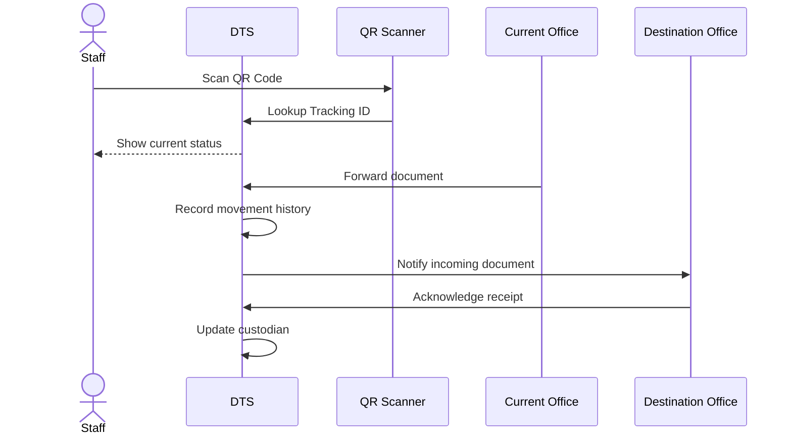

# Document Tracking (DTS Core)

```mermaid
sequenceDiagram
    actor User as Staff
    participant DTS as DTS
    participant QR as QR Scanner
    participant OfficeA as Current Office
    participant OfficeB as Destination Office

    User->>QR: Scan QR Code
    QR->>DTS: Lookup Tracking ID

    DTS-->>User: Show current status

    OfficeA->>DTS: Forward document
    DTS->>DTS: Record movement history

    DTS->>OfficeB: Notify incoming document

    OfficeB->>DTS: Acknowledge receipt

    DTS->>DTS: Update custodian
```