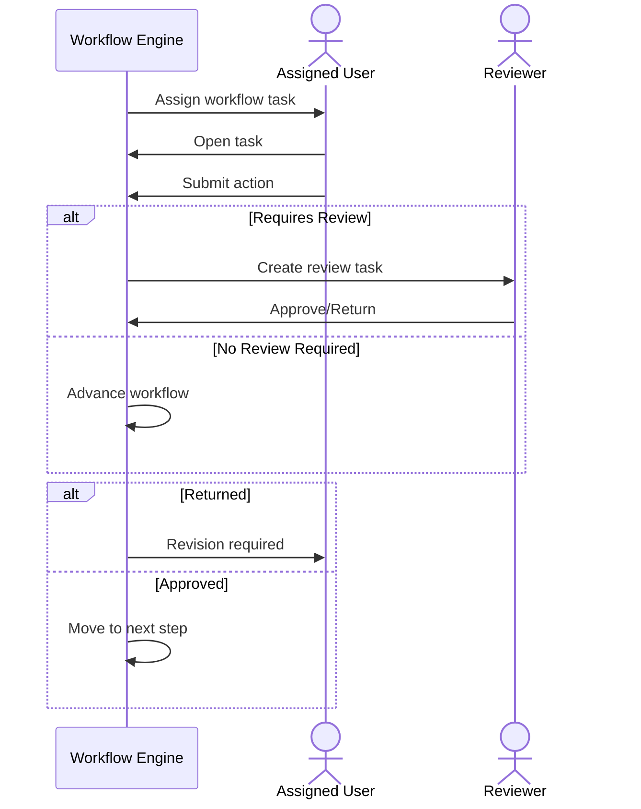

# Workflow Task Execution

```mermaid
sequenceDiagram
    participant WMS as Workflow Engine
    actor Assignee as Assigned User
    actor Supervisor as Reviewer

    WMS->>Assignee: Assign workflow task

    Assignee->>WMS: Open task
    Assignee->>WMS: Submit action

    alt Requires Review
        WMS->>Supervisor: Create review task
        Supervisor->>WMS: Approve/Return
    else No Review Required
        WMS->>WMS: Advance workflow
    end

    alt Returned
        WMS->>Assignee: Revision required
    else Approved
        WMS->>WMS: Move to next step
    end
```