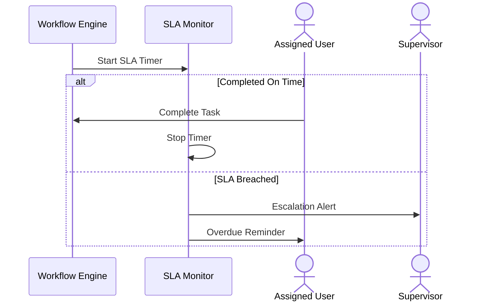

# Workflow SLA Monitoring

```mermaid
sequenceDiagram
    participant WMS as Workflow Engine
    participant SLA as SLA Monitor
    actor Assignee as Assigned User
    actor Supervisor as Supervisor

    WMS->>SLA: Start SLA Timer

    alt Completed On Time
        Assignee->>WMS: Complete Task
        SLA->>SLA: Stop Timer
    else SLA Breached
        SLA->>Supervisor: Escalation Alert
        SLA->>Assignee: Overdue Reminder
    end
```