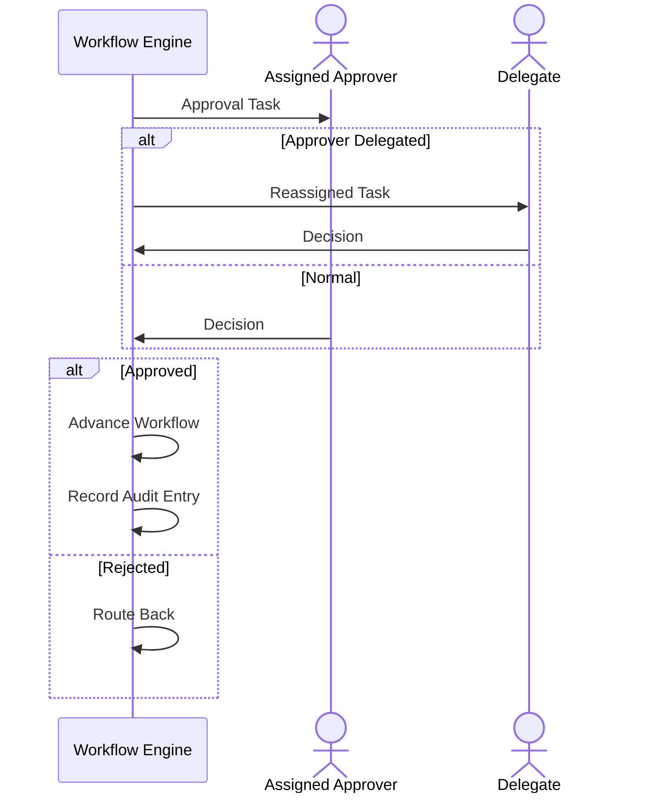

# Approval Workflow

```mermaid
sequenceDiagram
    participant WMS as Workflow Engine
    actor Approver as Assigned Approver
    actor Delegate as Delegate

    WMS->>Approver: Approval Task

    alt Approver Delegated
        WMS->>Delegate: Reassigned Task
        Delegate->>WMS: Decision
    else Normal
        Approver->>WMS: Decision
    end

    alt Approved
        WMS->>WMS: Advance Workflow
        WMS->>WMS: Record Audit Entry
    else Rejected
        WMS->>WMS: Route Back
    end
```