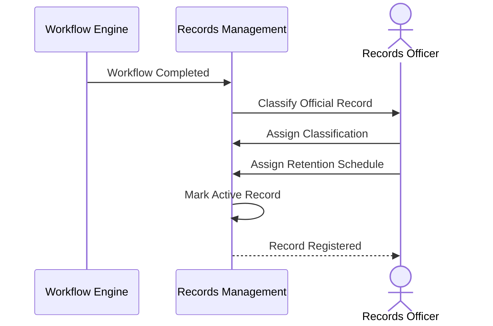

# Record Finalization and Classification

```mermaid
sequenceDiagram
    participant WMS as Workflow Engine
    participant RMS as Records Management
    actor Records as Records Officer

    WMS->>RMS: Workflow Completed

    RMS->>Records: Classify Official Record

    Records->>RMS: Assign Classification
    Records->>RMS: Assign Retention Schedule

    RMS->>RMS: Mark Active Record

    RMS-->>Records: Record Registered
```