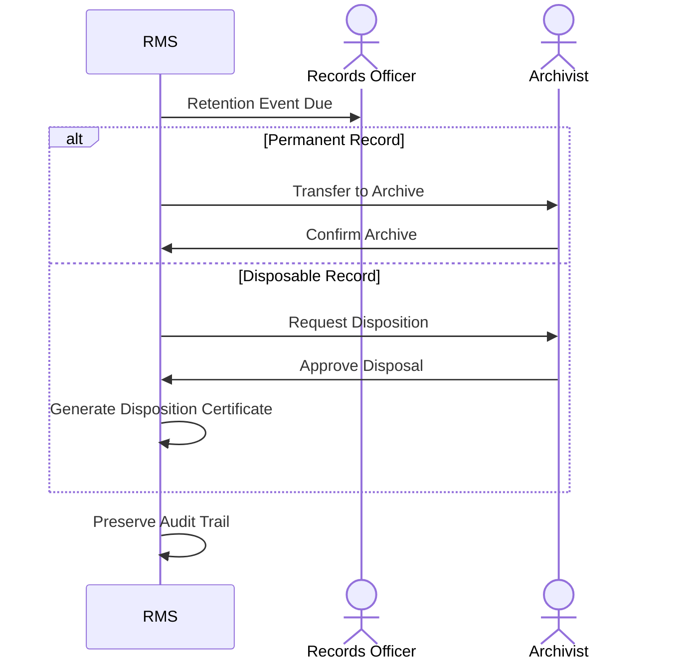

# Filing, Archiving, and Retention

```mermaid
sequenceDiagram
    participant RMS as RMS
    actor Records as Records Officer
    actor Archivist as Archivist

    RMS->>Records: Retention Event Due

    alt Permanent Record
        RMS->>Archivist: Transfer to Archive
        Archivist->>RMS: Confirm Archive
    else Disposable Record
        RMS->>Archivist: Request Disposition

        Archivist->>RMS: Approve Disposal

        RMS->>RMS: Generate Disposition Certificate
    end

    RMS->>RMS: Preserve Audit Trail
```