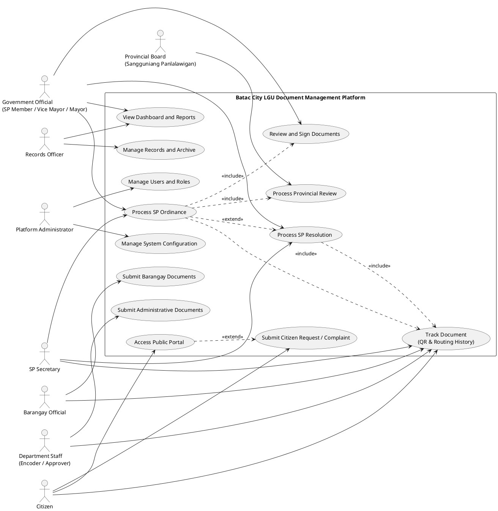

![[use-case-diagram-full.png]]

**Notation**:

```plantuml
@startuml
left to right direction

actor "SP Secretary" as SPS
actor "Government Official\n(SP Member / Vice Mayor / Mayor)" as GOV
actor "Department Staff\n(Encoder / Approver)" as DEPT
actor "Records Officer" as RO
actor "Platform Administrator" as PA
actor "Barangay Official" as BO
actor "Citizen" as C
actor "Provincial Board\n(Sangguniang Panlalawigan)" as PB

rectangle "Batac City LGU Document Management Platform" {

  usecase "Process SP Resolution" as UC01
  usecase "Process SP Ordinance" as UC02
  usecase "Track Document\n(QR & Routing History)" as UC03
  usecase "Review and Sign Documents" as UC04
  usecase "Submit Barangay Documents" as UC05
  usecase "Submit Administrative Documents" as UC06
  usecase "Manage Records and Archive" as UC07
  usecase "Access Public Portal" as UC08
  usecase "Submit Citizen Request / Complaint" as UC09
  usecase "Manage System Configuration" as UC10
  usecase "View Dashboard and Reports" as UC11
  usecase "Manage Users and Roles" as UC12
  usecase "Process Provincial Review" as UC13
}

' ================= ASSOCIATIONS =================
SPS --> UC01
SPS --> UC02
SPS --> UC03

GOV --> UC01
GOV --> UC02
GOV --> UC04
GOV --> UC11

DEPT --> UC06
DEPT --> UC03

RO --> UC07
RO --> UC11

PA --> UC10
PA --> UC12

BO --> UC05
BO --> UC03

C --> UC08
C --> UC09
C --> UC03

PB --> UC13

' ================= INCLUDE =================
UC01 ..> UC03 : <<include>>
UC02 ..> UC03 : <<include>>
UC02 ..> UC04 : <<include>>
UC02 ..> UC13 : <<include>>

' ================= EXTEND =================
UC08 ..> UC09 : <<extend>>
UC02 ..> UC01 : <<extend>>

@enduml
```