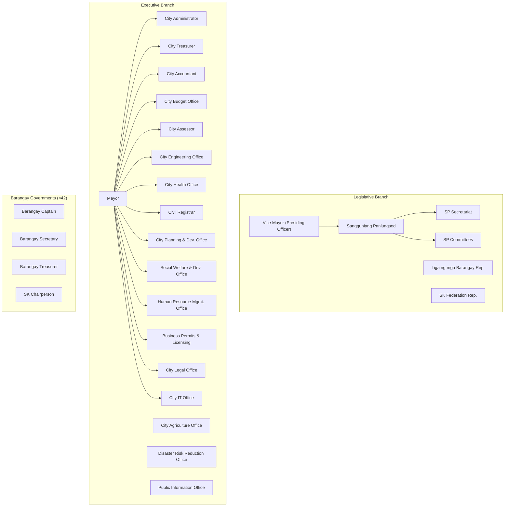

# Batac City LGU Platform — Architecture Review & Discovery

> **Label convention used throughout:**
> 
> - `[Inference]` — logically reasoned from known facts, not confirmed
> - `[Speculation]` — plausible but unverified possibility
> - `[Unverified]` — no reliable source; verify before acting on it
> 
> All LGU organizational details are `[Inference]` based on RA 7160, DILG-prescribed structures, and the uploaded reference material. Verify against Batac City's actual org chart before finalizing.

---

## Part 1 — Assumption Review: Aggressive Challenges

### 1.1 Challenged or Incorrect Assumptions

**"100–250 LGU employees initially"** This figure is probably significantly underestimated. Once you add 42 barangay officials + their secretaries, SK chairpersons, job-order workers with system access, and eventually citizens, your addressable user base is closer to 500–1,000 accounts from the beginning. Design for it.

**"Username/password authentication initially"** This directly contradicts your stated requirement for non-repudiation. Non-repudiation requires strong identity binding. A shared password on a shared workstation (common in government offices) is not a verified identity. You will be asked to add MFA much earlier than you expect, and retrofitting MFA into a system not designed for it is painful. Design the authentication flow to accommodate a second factor from day one, even if TOTP is not enabled initially.

**"Upload of scanned signatures initially"** `[Inference: based on general e-signature law principles; verify against RA 8792 Electronic Commerce Act and its IRR]`

A scanned signature image is a bitmap. Anyone with image editing software can copy it from one document and paste it onto another. This is not a technical safeguard and provides no meaningful non-repudiation. You have stated that non-repudiation is important, and then proposed an implementation that cannot deliver it. This contradiction must be surfaced explicitly to the LGU and formally accepted or resolved before architecture is finalized.

**"Potential migration to LGU-owned infrastructure later"** This is not a potential scenario. For a system with a stated 10+ year lifespan, LGU data ownership requirements, and a government mandate to avoid vendor dependency, on-premise deployment is a near-certainty at some point. Every cloud-specific service you adopt today is migration debt. Your architecture must be cloud-agnostic from day one, not retroactively made portable.

**"Workflow definitions must be configurable by authorized administrators without developer involvement"** You have accepted this as a given without fully scoping its complexity. This is widely acknowledged — including in your uploaded reference material — as the single most technically complex requirement in the entire system. Admin-configurable workflows with branching, merging, looping, versioning, and in-flight migration are equivalent in scope to building a subset of a BPMN 2.0 execution engine. It requires at minimum 25–30% of Phase 1 engineering time and deserves its own architectural design document before any code is written.

**"Workflows may branch, merge, loop back, be revised, and be versioned"** This description is consistent with BPMN-level process orchestration, not a simple state machine. These capabilities interact with each other in complex ways: what happens to an in-flight loop instance when its definition is deprecated? What constitutes a valid merge when one parallel branch has rejected? These are unsolved problems in many enterprise systems. Surface them before committing to building from scratch.

**"4 developers with heavy AI assistance"** AI-assisted development accelerates code production but introduces architectural inconsistency at module boundaries. A 4-person team using AI heavily will produce more lines of code in less time, but also more code that drifts from the intended architecture without strict governance. You need more architectural governance than a larger team, not less. Architecture Decision Records (ADRs), module boundary enforcement, and automated coupling tests are not optional for a 10-year codebase.

**"Record deletion should be avoided; archiving and retention policies preferred"** This is the correct direction for government records, but it conflicts with RA 10173 (Data Privacy Act), which grants data subjects the right to erasure under certain conditions. Citizen personal data stored in complaints and requests is PII. You must resolve how your no-deletion policy interacts with the right to erasure before going live with citizen-facing features. `[Inference: based on RA 10173 Sec. 16(d); verify with a DPA-qualified legal counsel]`

---

### 1.2 Blind Spots

**RA 10173 — Data Privacy Act of 2012** Your system stores citizen personal data. `[Inference: based on RA 10173]` Legal obligations include: Privacy Impact Assessment (PIA) before launch, Data Protection Officer designation, Privacy Notice at point of data collection, data subject rights handling (access, correction, erasure), and breach notification procedures within 72 hours of discovery. This has architectural implications at the field level: data classification, consent tracking, and the right-to-erasure vs. no-deletion conflict described above.

**RA 11032 — Ease of Doing Business / Anti-Red Tape Act** `[Inference: based on RA 11032 and its IRR]` Government agencies are legally required to act on simple transactions within 3 working days, complex transactions within 7 working days, and highly technical transactions within 20 working days. SLA tracking and ARTA compliance reporting are a legal requirement, not a nice-to-have feature. Your DTS and workflow engine must enforce these timelines from day one.

**RA 9184 — Government Procurement Reform Act** `[Inference]` Procurement documents (Purchase Requests, Purchase Orders, Abstract of Bids) have specific legal requirements for transparency, publication, and record-keeping that the system must enforce rather than merely facilitate.

**COA Circular requirements** `[Unverified: specific COA circulars applicable to Batac City's digital records were not confirmed]` The Commission on Audit has specific requirements for government records. Financial and procurement documents likely have COA-mandated retention periods and format requirements. Engage COA early, not after the system is built.

**Election-cycle staff turnover** Philippine local government positions change every 3 years with elections. The Mayor, Vice Mayor, all Councilors, and many department heads may be entirely different people after the 2028 election. Your system must handle: bulk role reassignment, document continuity across administrations, preservation of outgoing officials' signed actions as immutable records, and onboarding of entirely new leadership. If the system has no formal "administration transition" procedure, the post-election period will cause chaos in the data.

**Offline and intermittent connectivity** Barangays and some city hall departments in Batac may have unreliable internet. `[Unverified: specific connectivity conditions at Batac City Hall were not confirmed]` If the system is cloud-hosted with no offline capability, internet outages halt government operations. Under ARTA, "the system is down" is not a valid excuse for failing to process citizen transactions within mandated timeframes. The system must have a defined behavior during connectivity loss.

**Document number sequencing** Official government documents require centrally managed, gapless, sequential numbering within a series (e.g., Resolution No. 2026-001). This is a deceptively complex distributed systems problem. If two users attempt to create resolutions simultaneously, you must guarantee unique sequential numbers with no gaps. A naive auto-increment in the database is insufficient if documents can be created, then cancelled before numbering, or if draft documents hold a number before final approval. Number assignment policy must be defined upfront.

**Physical-to-digital correspondence** When a digital document is printed, signed with wet ink, and scanned back into the system, how is the scanned copy linked to the original digital record? How do you know the printed document was not altered between printing and signing? This is not a hypothetical edge case — it will happen frequently in a government that still uses physical documents as the legal source of truth.

**Multi-LGU scope** There is no mention of whether this platform is intended only for Batac City or could eventually be licensed or deployed to other LGUs. This is the single most impactful architectural question not addressed in your requirements. If multi-LGU deployment is even a remote possibility, tenant isolation must be designed into the data model now. Retrofitting multi-tenancy later is effectively a full rewrite.

**Barangay IT capacity** Barangay offices often have minimal IT infrastructure, limited staff technical literacy, and possibly shared devices. `[Inference]` Designing for barangay users requires a much simpler, more forgiving interface than for city hall employees, possibly a mobile-first approach. This is a fundamentally different user experience problem.

**Audit log tamper-proofing** You have stated that auditability and non-repudiation are important. An audit log stored as rows in the same PostgreSQL database as the application — writable by the same application user — is not tamper-evident. A database administrator can modify or delete rows. Government audit requirements demand a more robust guarantee.

**Disaster recovery and business continuity** Government operations cannot stop. You have not defined an RTO (Recovery Time Objective) or RPO (Recovery Point Objective). A cloud outage with no fallback means no approvals, no document routing, no citizen services. Define the RTO/RPO targets and design the architecture to meet them before deployment.

**Delegation and acting capacity** When the Mayor is on leave or traveling, an authorized officer acts as Mayor. Your workflow engine must handle delegated approval authority: who can act for whom, under what authorization, for what document types, and for what time period. This will arise in the first week of real use.

---

### 1.3 Missing Requirements

- Formal document numbering policy (who assigns, what series, what happens to gaps)
- Retention schedules per document type (legally mandated; COA and DILG may prescribe these)
- Bulk operations for records officers (bulk archive, bulk search, bulk export)
- Migration strategy for historical documents (what data exists today and in what form)
- Session management policy (timeout duration, concurrent login restrictions, forced logout)
- Delegation and acting-capacity management
- SLA thresholds per document type (required for ARTA compliance)
- Print output and QR/barcode cover sheet generation
- Email as a document intake channel (many government communications arrive via email)
- Mobile access requirements (what devices do users actually have)
- Data export and portability (LGU must be able to export all data in a standard format at any time)
- System administrator data separation (IT admin must not have read access to confidential documents even if they have server access)
- Citizen identity verification approach for portal access
- Document classification and sensitivity levels (not all documents are equally accessible)

---

### 1.4 Hidden Complexity

**Admin-configurable workflow versioning + in-flight migration** The hardest unsolved problem in workflow systems. When a workflow definition is revised, in-flight instances are already partially completed under the old version. Do they continue under the old version (safest, most auditable)? Migrate automatically (dangerous, may invalidate prior approvals)? Require manual migration by an administrator (operationally complex)? You must define this policy before building the engine, because the data model is fundamentally different for each choice.

**Parallel workflow steps** You stated workflows may branch and merge. A parallel split (document goes to Committee A and Committee B simultaneously, must merge before proceeding) requires tracking multiple active step instances per workflow instance simultaneously. Your tracking, notification, and SLA logic all become significantly more complex.

**Non-repudiation with scanned images** Addressed above. If the LGU formally accepts that scanned signatures do not provide cryptographic non-repudiation, that acceptance must be documented. If they do not accept it, you need PKI-based digital signatures, which is a substantial additional system.

**Concurrent modification and optimistic locking** Multiple users can act on documents simultaneously. A secretary and a department head may both attempt to move the same document forward at the same time. Optimistic locking resolves this but produces user-visible conflicts. Government users typically have low tolerance for "someone else modified this document" error messages. Pessimistic locking prevents conflicts but creates bottlenecks. This must be designed deliberately.

**Data Privacy Act vs. no-deletion policy** Described in 1.1. A citizen whose complaint contains sensitive personal information has a legal right to erasure under RA 10173. Your no-deletion policy is the correct archival stance for government records but must have a defined exception process for DPA-mandated erasure requests, with legal review.

---

## Part 2 — Risk Register

### Architectural Risks

|Risk|Severity|Likelihood|
|---|---|---|
|Custom workflow engine becomes unmaintainable|High|Medium|
|Module coupling grows without enforcement|High|High|
|Premature microservices if team overreaches|High|Low|
|Audit log integrity not tamper-evident|High|Medium|
|Cloud-specific dependencies block on-premise migration|High|High|

### Organizational Risks

|Risk|Severity|Likelihood|
|---|---|---|
|Post-election champion loss (2028)|High|Medium|
|Staff adoption resistance|High|High|
|Scope creep from each stakeholder group|Medium|High|
|Ownership ambiguity after delivery|High|Medium|
|Budget discontinuity between fiscal years|High|Medium|

### Security Risks

|Risk|Severity|Likelihood|
|---|---|---|
|Scanned signature forgery|High|Medium|
|Password-only auth for high-authority accounts|High|High|
|Audit log modified by DB admin|High|Low|
|Privilege escalation through misconfigured roles|High|Medium|
|Citizen portal as attack surface|Medium|High|

### Data Governance Risks

|Risk|Severity|Likelihood|
|---|---|---|
|No RA 10173 compliance process|High|High|
|No COA-compliant retention schedules|Medium|High|
|Backup keys held by developer, not LGU|High|Medium|
|No defined data handover process at contract end|High|Medium|

### Deployment and Operations Risks

|Risk|Severity|Likelihood|
|---|---|---|
|No offline fallback for internet outages|High|High|
|No infrastructure-as-code, manual setup|High|High|
|No defined RTO/RPO|High|High|
|LGU infrastructure unready for on-premise migration|Medium|High|

---

## Part A — Clarifying Questions

These must be answered before architecture is finalized.

1. **Multi-LGU scope** — Is this intended only for Batac City, or is there any intention to deploy or license to other LGUs? This is the highest-impact unanswered architectural question.
    
2. **Existing systems** — What software does the LGU currently use? (Payroll? HRIS? Treasury? BPLO?) Do those systems continue alongside this platform, or will this replace them?
    
3. **Internet reliability** — Can critical city hall operations tolerate 30+ minute internet outages? What is the typical connectivity experience at Batac City Hall locations?
    
4. **Offline requirement** — Must the system remain at least partially operable during internet outages (e.g., read-only mode), or is full cloud dependency acceptable?
    
5. **Post-delivery ownership** — Who maintains the system after delivery? Is the development team contracted for long-term maintenance, or will an internal IT team take over?
    
6. **Workflow walkthrough status** — Has anyone sat down with the SP Secretary and Records Officer to walk through a real document lifecycle end-to-end? Or is all current workflow knowledge assumption-based?
    
7. **DPA compliance readiness** — Has a Data Protection Officer been designated by the LGU? Is a Privacy Impact Assessment planned?
    
8. **Budget continuity** — Is funding confirmed beyond the initial development phase, across fiscal years?
    
9. **Barangay device access** — Do barangays have dedicated computers and reliable internet? Or are you planning mobile-first for barangay access?
    
10. **COA engagement** — Has anyone consulted the Commission on Audit on digital records requirements for this LGU?
    
11. **Document numbering authority** — Who currently controls the official numbering series for resolutions, ordinances, and executive orders? Is this currently manual?
    
12. **Delegation policy** — When the Mayor or a key approver is unavailable, who acts and under what formal authorization?
    
13. **Physical document retention policy** — After a document is processed digitally, is the physical original still legally required? For which document types?
    
14. **Citizen identity approach** — How will citizen identity be verified for portal access? PhilSys integration is possible but architecturally significant.
    

---

## Part B — Requirements Discovery Checklist (General Stakeholder Interviews)

### Process Discovery

- Walk me through the complete lifecycle of one document — from the moment it is created or received to the moment it is filed — for each major document type.
- Who initiates each type of document? Where does it physically come from?
- Who is the first person to touch it? What do they do to it?
- What happens when the assigned person is absent, on leave, or unavailable?
- Can a document be returned for revision? By whom? To whom?
- Can a document be cancelled after it has started routing? Who has authority to cancel?
- How long should each step ideally take? What happens when a step exceeds that time?
- Are there documents that can skip steps under certain conditions?

### Current Pain Points

- What is the single biggest problem with the current paper-based process?
- What documents are most frequently lost, misplaced, or significantly delayed?
- How do citizens currently check the status of their requests or complaints?
- What is the realistic current processing time for [specific document type]?
- What information do you most frequently need but cannot locate quickly?
- What tasks consume the most manual effort that should not require manual effort?

### Access and Security

- Who should be able to see each type of document?
- Are there documents that must remain confidential even from other departments?
- Should citizens be able to track their own documents in progress?
- What specifically should citizens not be able to see?
- Are there documents that are confidential even from some internal employees?

### Integration and Data Migration

- What existing software systems does the LGU currently use?
- Are there historical documents that need to be migrated into the new system? In what format do they currently exist?
- Are there reports currently produced manually in Excel that should be automated?
- Does any existing system hold data that the new platform needs?

### Legal and Compliance

- What are the legal mandated retention periods for each document type?
- Are there DILG, COA, CSC, or other regulatory requirements that affect how documents are managed or retained?
- Has the LGU designated a Data Protection Officer under RA 10173?
- Has a Privacy Impact Assessment been conducted for the new system?
- What are the ARTA-mandated processing timeframes for each service the LGU provides?

### Technical Environment

- What devices do employees use? Desktop, laptop, or mobile?
- How reliable and fast is the internet connection at each office location?
- Is there a local area network (LAN) at city hall?
- Is there backup power (UPS, generator) at critical locations?
- Who will maintain the system after it is deployed?

### Success Criteria

- How will you know the system is a success after 6 months of use?
- What would constitute a failure of this project?
- Which single feature would most immediately reduce your daily workload?

---

## Part C — Stakeholder-Specific Discovery Checklists

### Mayor

- What document-based decisions do you make on a typical working day?
- How many documents do you sign in an average week?
- What information do you require before signing a document?
- Does your staff prepare documents for your signature, or do you review them yourself from the start?
- What operational information do you wish you could see at any moment without asking staff?
- When you are traveling or unavailable, how are urgent approvals handled? Who acts?
- What is the biggest inefficiency in how government operations are currently run?
- What public-facing information should citizens be able to access through an online portal?
- Are there documents or decisions you currently cannot delegate but should be able to?

### Vice Mayor and SP Presiding Officer

- How is an SP session called and formally documented?
- What is the exact workflow of a resolution from first draft to final release?
- What differs between a resolution workflow and an ordinance workflow?
- How are committee assignments made? Is there a formal rule or is it discretionary?
- Which documents must be read aloud during session? All? Selected sections?
- How are SP session minutes prepared, reviewed, approved, and archived?
- Who has authority to release approved resolutions and ordinances?
- How are amendments and interpellations during session captured and recorded?
- What information do you need to see before calling a document for a vote?

### SP Secretary

- Describe your daily document processing routine from receiving the first document to end of day.
- How are incoming documents currently logged? Is there a logbook? An existing system?
- What is the current numbering system for resolutions and ordinances? Who controls it?
- Who is authorized to prepare the session agenda? What is the process?
- How are documents distributed to Councilors before a session? Physical copies? Email?
- What happens to documents referred to committee? How is that tracked?
- How many active documents are typically in your queue on any given day?
- What documents do you prepare repeatedly that could use a template?
- What monthly reports do you currently produce? What manual effort does that require?
- How are returned or rejected documents tracked against the original submission?

### Councilors

- How do you currently receive documents for review prior to session?
- How do you provide feedback, corrections, or proposed amendments?
- Do you access documents remotely, from home or outside city hall?
- What information do you need before voting on a document?
- How do you submit committee reports? What is the current process?
- What is the typical time window you are given to review documents before a session?

### Department Heads

- What document types does your department originate and submit to other offices?
- What document types does your department receive from other offices for action?
- Who within your department is authorized to approve documents at various levels?
- How do you currently monitor the status of documents your department has submitted?
- How do you handle incoming documents that must be distributed to multiple sub-units within your department?
- What reports are you required to submit, and how frequently?
- What is the biggest time waste in your current document and administrative process?
- What information would help you better manage your department's workload?

### Records Officers

- What is the current filing and indexing system for physical records?
- How are documents currently searched and retrieved when needed?
- What is the current retention policy for each major document type?
- Where are physical records currently stored? Are there capacity concerns?
- How are confidential records currently physically protected?
- How do you handle requests to retrieve archived documents? How long does it take on average?
- Are there COA audit requirements you currently find difficult to meet?
- How are documents disposed of when their retention period expires? Is there a formal process?
- Are there document categories that are not currently archived at all?

### Barangay Officials

- What types of documents does your barangay regularly send to city hall?
- What types of documents do you receive from city hall?
- Do you have a computer and reliable internet connection at your barangay hall?
- How do you currently track whether submitted documents have been received and acted upon?
- What is the most frustrating aspect of dealing with city hall on document matters?
- Would you access a system via a computer, a mobile phone, or both?
- Do you have staff who would manage system interactions on your behalf, or would you do it personally?

### General Employees

- What documents do you create, process, or receive on a regular basis?
- What is the most repetitive document-related task you perform?
- How do you currently know which documents are waiting for your action?
- How do you notify a colleague that a document requires their attention?
- Do you work from a single device, or do you need access from different locations or devices?
- What one change would make your daily work significantly faster?

### Citizens

- Have you ever submitted a request or complaint to city hall? Describe that experience.
- Were you able to find out the status of your submission without visiting in person?
- How did you receive the response or outcome?
- What city hall information would you want to be able to access online?
- Do you use a smartphone? Are you comfortable using a government website?
- What language would you prefer for interacting with an online city hall portal? (Filipino, English, Ilocano)
- Would you trust a city hall online portal with your personal information?

### IT Personnel

- What is the current server and network infrastructure at city hall locations?
- What is the internet connection type and measured speed at each location?
- Is there a backup power supply — UPS or generator — at critical locations?
- Who currently manages IT systems at the LGU? Is there dedicated IT staff?
- What is the IT budget allocation and approval cycle?
- Have you managed cloud deployments or containerized systems before?
- What are the biggest day-to-day IT pain points at the LGU?
- Is there a disaster recovery plan for any existing systems?
- What is the plan for supporting the system after the development team delivers it?

---

## Part D — LGU Organizational Structure and Document Flow

> `[Inference: based on RA 7160, DILG-prescribed structure, and uploaded reference material. Verify against Batac City's official organizational chart.]`



### Typical Document Flow Patterns

**Pattern 1 — Citizen Request to Mayor's Office**

```
Citizen
  → Receiving Desk (log, assign tracking number, QR label)
  → Mayor's Office (assess, route)
  → Concerned Department (action)
  → Mayor's Office (confirm completion)
  → Citizen (response)
```

**Pattern 2 — SP Resolution (Legislative)**

```
Councilor / SP Secretary (draft)
  → SP Secretary (log, assign series number)
  → Committee Assignment
  → Committee Review and Report
  → 1st Reading (SP Session)
  → Amendment phase (if any)
  → 2nd Reading (SP Session)
  → Session Vote
  → VP / Presiding Officer (certify)
  → SP Secretary (official copy, release)
  → Mayor's Office (transmit, reference copy)
  → Records (archive)
  → Public (publish if applicable)
```

**Pattern 3 — SP Ordinance (longer than Resolution)**

```
Draft
  → SP Secretary (log)
  → Committee (review, public hearing)
  → 1st Reading
  → 2nd Reading
  → 3rd Reading (final vote)
  → Vice Mayor (certify)
  → Mayor (10-day review; may veto)
  → If not vetoed: effective after publication
  → SP Secretary (archive official copy)
  → Public (mandatory publication)
```

**Pattern 4 — Executive Document (e.g., Travel Order)**

```
Employee (request)
  → Immediate Supervisor (endorse)
  → Department Head (approve)
  → Mayor's Office (approve — if required)
  → HR (record)
  → Finance (if with funding implications)
```

**Pattern 5 — Procurement / Purchase Request**

```
Requesting Office
  → Department Head (endorse)
  → Budget Office (availability of funds)
  → Accounting (pre-obligation)
  → BAC Secretariat (procurement process)
  → Award → Supplier → Delivery
  → Inspection (acceptance)
  → Accounting (disbursement)
  → COA (audit trail)
```

**Pattern 6 — Barangay to City Hall**

```
Barangay Council (passes resolution)
  → Barangay Secretary (certifies, transmits)
  → City Hall Receiving
  → SP Secretariat or Mayor's Office (depending on subject)
  → Committee or Department (action)
  → Response to Barangay
```

---

## Part E — Educated-Guess Master Lists

> All items below are `[Inference]` unless otherwise noted.

### Offices

**Executive:** Office of the Mayor, Office of the City Administrator, City Treasurer's Office, City Accountant's Office, City Budget Office, City Assessor's Office, City Engineering Office, City Health Office, City Civil Registrar's Office, City Planning and Development Office (CPDO), City Social Welfare and Development Office (CSWDO), Human Resource Management Office (HRMO), Business Permits and Licensing Office (BPLO), City Agriculture Office, Disaster Risk Reduction and Management Office (DRRMO), City Tourism Office, Public Information Office (PIO), City IT Office, City Legal Office

**Legislative:** Office of the Vice Mayor, SP Secretariat, SP Committees (Finance, Public Works, Health, Education, Peace and Order, Women and Family, Environment, Tourism, Barangay Affairs — exact composition varies)

**Barangay-level (×42):** Each Barangay Office, SK Office

**Public-facing:** Central Receiving Office, Public Assistance Desk

---

### Roles (System Roles, not Organizational Positions)

|System Role|Description|
|---|---|
|System Administrator|Full system access; no access to confidential document content|
|Platform Administrator|Workflow configuration, user management, master data|
|Records Officer|Archive management, retention, disposition|
|Department Encoder|Create and submit documents for their department|
|Department Approver|Approve documents within their office and scope|
|SP Secretary|Manage SP legislative workflow and document registry|
|SP Member|Review, comment, and vote on legislative documents|
|SP Presiding Officer|Manage sessions, certify legislative output|
|Mayor|Final executive approval authority|
|Barangay Encoder|Submit barangay documents to city hall|
|Barangay Captain|Approve and sign barangay documents|
|Citizen|Limited read-only access to public portal and own submissions|
|Auditor|Read-only access to audit logs and finalized documents|
|System Auditor|Read-only access to technical audit and security logs|

---

### Document Types (with Classification)

|Category|Document Type|Routing|Approval|Signature|Official Record|
|---|---|---|---|---|---|
|Legislative|SP Resolution|Yes|Yes|Yes|Yes|
|Legislative|SP Ordinance|Yes|Yes|Yes|Yes|
|Legislative|Committee Report|Yes|Yes|Yes|Yes|
|Legislative|Session Minutes|No|Yes|Yes|Yes|
|Legislative|Barangay Resolution|Yes|Yes|Yes|Yes|
|Executive|Executive Order|Yes|Yes|Yes|Yes|
|Executive|Memorandum Order|Yes|Yes|Yes|Yes|
|Executive|Memorandum Circular|Yes|No|Yes|Yes|
|Administrative|Internal Memorandum|Sometimes|No|Yes|No|
|Administrative|Travel Order|Yes|Yes|Yes|Yes|
|Administrative|Leave Application|Yes|Yes|No|No|
|Administrative|Job Order / Contract|Yes|Yes|Yes|Yes|
|Financial|Purchase Request|Yes|Yes|Yes|Yes|
|Financial|Purchase Order|Yes|Yes|Yes|Yes|
|Financial|Disbursement Voucher|Yes|Yes|Yes|Yes|
|Financial|Budget Request|Yes|Yes|Yes|Yes|
|Financial|Liquidation Report|Yes|Yes|Yes|Yes|
|Procurement|Request for Quotation|Yes|Yes|Yes|Yes|
|Procurement|Abstract of Bids|Yes|Yes|Yes|Yes|
|Citizen|Citizen Request|Yes|Sometimes|No|No|
|Citizen|Citizen Complaint|Yes|No|No|Sometimes|
|Citizen|Permit Application|Yes|Yes|No|Yes|
|Project|Project Proposal|Yes|Yes|Yes|Yes|
|Project|Inspection Report|No|Yes|Yes|Yes|
|Project|Accomplishment Report|No|Yes|Yes|Yes|
|Meeting|Session Agenda|No|Yes|Yes|No|
|Meeting|Attendance Sheet|No|No|Yes|Yes|

---

### Core Workflows (`[Inference]`)

1. **SP Resolution:** Draft → Secretary Review → Committee Assignment → Committee Report → 1st Reading → Amendment → 2nd Reading → Vote → VP Certify → Secretary Release → Archive
2. **SP Ordinance:** Draft → Secretary Review → Committee → 1st Reading → Public Hearing → 2nd Reading → 3rd Reading → Vote → VP Certify → Mayor Review (10-day) → Sign/Veto → Publication → Implementation → Archive
3. **Executive Order:** Draft (Mayor's Office) → Legal Review → Mayor Approve and Sign → Release → Archive
4. **Travel Order:** Employee → Supervisor Endorse → Department Head Approve → Mayor Approve → HR Record → Travel
5. **Purchase Request:** Requesting Office → Department Head → Budget Officer → Accounting → BAC Secretariat → Procurement
6. **Citizen Request:** Submit → Receive and Log → Mayor's Office → Department Assignment → Action → Response → Close
7. **Complaint:** Submit → Receive and Log → Appropriate Office → Investigation → Findings → Resolution → Notify Complainant → Archive
8. **Barangay Resolution:** Barangay submit → City Hall Receive → Route to SP or Mayor → Action → Response

---

### Approvals Matrix (`[Inference]`)

|Document|Step 1|Step 2|Step 3|Final Authority|
|---|---|---|---|---|
|SP Resolution|Committee|SP Session Vote|VP Certify|SP Secretary Release|
|SP Ordinance|Committee|SP Vote|VP Certify|Mayor Review/Sign|
|Travel Order|Supervisor|Department Head|Mayor|—|
|Purchase Request|Department Head|Budget Office|Accounting|Mayor (above threshold)|
|Leave Application|Supervisor|Department Head|HRMO|—|
|Executive Order|Legal Office|Mayor|—|—|
|Citizen Request|Receiving|Department|Mayor (if required)|—|
|Citizen Complaint|Receiving|Investigator|Office Head|—|

---

### Reports

**Operational:** Documents pending by office, documents pending by employee, overdue documents by SLA breach age, daily received count, average processing time per document type, average processing time per office

**Legislative:** Resolutions approved by period, ordinances approved by period, SP session summary, committee activity by period

**Citizen Services:** Requests received / resolved / pending, complaint resolution rate, average complaint resolution time, ARTA compliance rate per service type

**Management:** City-wide document throughput, office performance comparison, document backlog trend, SLA compliance rate

**Records Management:** Documents approaching retention expiry, archived document count by category, storage utilization

---

### KPIs (`[Inference]` — validate with LGU before finalizing)

|KPI|Indicative Target|Owner|
|---|---|---|
|Simple transaction processing time|≤ 3 working days (ARTA)|All Offices|
|Complex transaction processing time|≤ 7 working days (ARTA)|All Offices|
|SLA breach rate|< 5% of active documents|City Administrator|
|Citizen request resolution rate|> 90%|All Departments|
|Document backlog (pending > 7 days)|< 10% of active|Department Heads|
|System uptime|> 99.5%|IT|
|Workflow completion rate|> 95%|Records Officer|

---

### Dashboards

**Mayor's Dashboard:** Items requiring signature today, documents overdue across all departments, citizen request summary (submitted / resolved / pending), department workload overview

**SP Secretary's Dashboard:** Session calendar, documents scheduled for next session, documents currently in committee, recent approvals log, monthly legislative output summary

**Department Head Dashboard:** Department inbox (items awaiting action), overdue items, team workload by person

**Records Officer Dashboard:** Archive queue, retention expiry alerts (next 30 / 60 / 90 days), storage utilization

**Citizen Portal Dashboard:** My submitted requests (with status), my complaint status, public document library, announcements

**System Administrator Dashboard:** User activity log, failed login attempts, storage utilization, system health indicators

---

## Part F — Architecture Recommendation

### Recommended Pattern: Modular Monolith with Internal Event Bus

**Rationale:**

Microservices at 100–250 users is an operational anti-pattern for a 4-person team. The distributed systems overhead — service discovery, inter-service authentication, distributed tracing, independent deployment pipelines — provides no benefit at this scale and introduces failure modes that a small team cannot manage reliably.

A modular monolith gives you clean domain separation, independent module evolution, and a clear extraction path to services if the system grows beyond what a monolith can serve. The internal event bus decouples modules without distributed systems overhead.

```
┌──────────────────────────────────────────────────────────────────┐
│                     Batac LGU Platform                           │
│                                                                  │
│  ┌──────────────┐  ┌──────────────┐  ┌──────────────────────┐   │
│  │  Identity &  │  │ Organization │  │    Document Core     │   │
│  │    Access    │  │  & Org Chart │  │    (DMS + Storage)   │   │
│  └──────────────┘  └──────────────┘  └──────────────────────┘   │
│  ┌──────────────┐  ┌──────────────┐  ┌──────────────────────┐   │
│  │   Workflow   │  │  Document    │  │      Records         │   │
│  │   Engine     │  │  Tracking    │  │   Management (RMS)   │   │
│  └──────────────┘  └──────────────┘  └──────────────────────┘   │
│  ┌──────────────┐  ┌──────────────┐  ┌──────────────────────┐   │
│  │ Notifications│  │    Search    │  │      Reporting       │   │
│  └──────────────┘  └──────────────┘  └──────────────────────┘   │
│  ┌──────────────┐  ┌─────────────────────────────────────────┐  │
│  │ Audit Log    │  │     Government Portal (Public API)      │  │
│  │ (append-only)│  └─────────────────────────────────────────┘  │
│  └──────────────┘                                                │
│                                                                  │
│                   Internal Event Bus (in-process)                │
└──────────────────────────────────────────────────────────────────┘
         │                    │                    │
   PostgreSQL           S3-compatible         Meilisearch
   (schema-per-module)  Object Storage        (Search)
```

**Architectural laws for this system:**

1. Each module owns its own PostgreSQL schema. No module reads another module's schema directly. Cross-module data access goes through published APIs or events.
2. Modules communicate through the internal event bus, not direct method calls across module boundaries.
3. No shared mutable state between modules.
4. The audit log schema is append-only. The application database user for the audit log has INSERT permission only.
5. All file references in the database are storage keys (UUIDs), never file paths or original filenames.
6. All infrastructure is defined in code. No manual cloud resource creation.

---

## Part G — Stack Recommendations

### Frontend

**Recommendation: React (TypeScript) + Vite + TanStack Query + Radix UI / shadcn-ui**

React has the widest developer talent pool in the Philippines and the longest likely community support horizon. TypeScript is non-negotiable for a 10-year codebase. Avoid Next.js for the internal authenticated application — SSR complexity is not justified for a role-specific SPA. Use Vite + React SPA for the internal app. Next.js is acceptable for the public portal where SEO matters.

**State management:** TanStack Query for server state. Zustand for minimal UI state. No Redux — it adds indirection without benefit for this use case.

**Do not use:** Vue, Angular, or Svelte. Not because they are inferior, but because the Philippine developer talent pool for long-term maintenance is significantly smaller.

---

### Backend

**Recommendation: TypeScript + Node.js + Fastify**

Primary rationale: single language across frontend and backend reduces context switching for a small team. Fastify is significantly more production-appropriate than Express (faster, better plugin architecture, built-in schema validation). TypeScript gives the type safety required for a 10-year codebase with module boundaries.

**Alternative if the team has Go experience: Go (Golang).** Go produces self-contained binaries, has superior concurrency, and has a lower operational footprint. If any team member has Go experience, this is worth serious consideration. The language enforces explicitness in a way that is good for long-term maintainability.

**Avoid:** PHP (workflow logic becomes painful at scale), Django/Python (not wrong, but adds a language context switch for a likely JS-heavy team), Java/Spring Boot (heavyweight operational model for a 4-person team).

---

### Database

**Recommendation: PostgreSQL 16+**

No competing alternative for this use case. PostgreSQL provides ACID compliance, JSONB for flexible metadata, row-level security (RLS) for data isolation, excellent support for audit patterns, advanced full-text search capabilities as a fallback, no vendor lock-in, and runs identically on any cloud provider or on-premise server.

**Schema strategy:**

```sql
schema: iam          -- identity and access
schema: organization -- offices, positions, assignments
schema: documents    -- core document entities
schema: workflow     -- definitions and instances
schema: tracking     -- routing history, QR
schema: records      -- retention, archive, classification
schema: notifications
schema: search_meta  -- search index metadata
schema: portal       -- public-facing data
schema: reporting    -- materialized views, report definitions
schema: audit        -- append-only, restricted write access
```

**Do not use:** MongoDB. The phrase "document management" makes a document store seem intuitive, but the query patterns of this system — join-heavy, workflow-state-aware, time-series audit queries — are fundamentally relational. MongoDB would produce significantly worse results for this domain.

---

### Search Engine

**Recommendation: Meilisearch (self-hosted) for Phase 1; OpenSearch as the upgrade path**

Meilisearch is easy to operate, fast for full-text search, self-hosted (no lock-in), and handles multi-language text reasonably well. OpenSearch (the open-source AWS OpenSearch fork) is the upgrade path for larger scale. Avoid Elasticsearch directly due to licensing history.

---

### Object Storage

**Recommendation: Cloudflare R2 (cloud Phase 1) → MinIO (on-premise readiness)**

Use the S3-compatible API exclusively. Never use provider-specific SDKs. Cloudflare R2 has no egress fees, which matters significantly for a document-heavy system where bandwidth costs can accumulate. MinIO is self-hostable and fully S3-compatible — the on-premise migration requires changing an endpoint URL, not rewriting application code.

**File naming rule:** All files stored using UUID keys. Original filenames are stored as metadata in PostgreSQL only. Never use original filenames as storage paths.

---

### Queue and Event System

**Recommendation: pgboss (PostgreSQL-backed job queue) for Phase 1**

Adding Redis, RabbitMQ, or Kafka on day one introduces operational overhead that a 4-person team cannot absorb without sacrificing delivery. pgboss uses PostgreSQL as the queue backend, which gives you transactional job enqueueing: a document save and its associated notification enqueue happen in the same database transaction, eliminating message loss on failure. Migrate to a dedicated queue when scale demands it, without changing application code, if you abstract the queue interface from the start.

---

### Workflow Engine

**Recommendation: Build a domain-specific workflow engine; do not adopt a general-purpose BPMN engine**

General-purpose BPMN engines (Camunda, Temporal, Flowable, Activiti) are powerful but have steep learning curves, complex operational requirements, and produce systems that are difficult for a 4-person team to understand, debug, and maintain. Your workflow requirements are well-defined enough to build a focused engine that will be more understandable, testable, and maintainable than a generic one.

**Core engine data model:**

```
WorkflowDefinition
  id, name, description
  version (integer, increments on each publish)
  status: draft | active | deprecated
  created_by, published_at

WorkflowStep
  id, definition_id
  name, description
  type: action | approval | parallel_split | parallel_join | decision | notification | termination
  assignee_rule: role | specific_user | office | dynamic_expression
  sla_hours (nullable)
  on_complete → next_step_id
  on_reject → next_step_id (may loop back)
  on_timeout → escalation_step_id or next_step_id

WorkflowInstance
  id
  definition_id + definition_version (pinned at instance creation)
  document_id
  current_step_id
  status: active | completed | cancelled | suspended
  started_at, completed_at

WorkflowStepInstance
  id, instance_id, step_id
  assignee_user_id (resolved at runtime from rule)
  status: pending | in_progress | completed | rejected | skipped | timed_out
  assigned_at, completed_at, action_by, action_comment

WorkflowEvent (append-only)
  id, instance_id, step_instance_id
  event_type, actor_user_id, timestamp, payload
```

**Critical rules:**

- A workflow instance is always pinned to the definition version active at the time it was created.
- Workflow definitions are never modified. A new version is created and published. The old version is deprecated.
- In-flight instances under a deprecated version complete under their original version unless an administrator explicitly migrates with a full audit record.
- Never allow a step to be assigned to a user who does not exist in the organization module.

---

### Authentication Strategy

**Recommendation: Username + bcrypt password initially; OAuth 2.0 with PKCE architecture from day one**

- JWT access tokens (short-lived, 15–60 minutes) + refresh tokens (long-lived, stored server-side in database)
- Tokens stored in HTTP-only, Secure, SameSite=Strict cookies only. Never in localStorage or sessionStorage.
- Refresh token registry maintained in the database for server-side session invalidation.
- Design the authentication module to accept a second-factor challenge response from day one, even if TOTP is not enabled initially.
- Password policy: minimum 12 characters, complexity requirements, no reuse (last 5 passwords), forced rotation on first login and for privileged accounts. `[Inference: aligned with government security best practices; verify against DICT NIST-aligned guidelines]`
- Plan MFA (TOTP) as the highest-priority post-launch security enhancement.

---

### Authorization Model

**Recommendation: ABAC (Attribute-Based Access Control) with RBAC as the simplified entry point**

Pure RBAC cannot express "a Department Head may approve only documents submitted by their own department" without creating exponential role combinations. ABAC policies can express this naturally:

```
ALLOW approve WHERE
  user.role = 'department_head'
  AND document.owning_office_id = user.office_id
  AND workflow_step.required_action = 'approve'
```

Start with RBAC-style role assignments, evaluate ABAC policies at request time, and enforce PostgreSQL Row-Level Security as a second data-isolation layer at the database level. All authorization decisions are written to the audit log.

---

### Reporting Architecture

**Two-tier approach:**

- **Tier 1 — Operational (real-time):** Built from the primary PostgreSQL database using read replicas. Handles pending counts, SLA status, inbox summaries. Used for dashboards and operational reports.
- **Tier 2 — Analytical (batch):** A separate PostgreSQL reporting schema populated by scheduled ETL. Used for trend analysis, historical performance, and executive summaries.

Database views and materialized views own the reporting query logic. Application code queries views, not raw tables. This keeps reporting logic maintainable at the database layer. All reports are exportable as PDF (server-rendered via a PDF library) and CSV.

---

### Audit Architecture

**Recommendation: Append-only audit schema with checksum-chained records and periodic cold storage export**

```sql
-- Schema: audit
-- Application DB user: INSERT only on this schema

CREATE TABLE audit.events (
  id            UUID    DEFAULT gen_random_uuid() PRIMARY KEY,
  event_time    TIMESTAMPTZ NOT NULL DEFAULT now(),
  actor_user_id UUID    NOT NULL,
  actor_ip      INET,
  actor_session UUID,
  entity_type   TEXT    NOT NULL,
  entity_id     UUID    NOT NULL,
  action        TEXT    NOT NULL,
  payload       JSONB,
  prev_hash     TEXT,   -- hash of the previous record
  row_hash      TEXT    -- hash of this record's content for tamper detection
);
```

**Rules:**

- The application DB user for audit writes has INSERT-only permission. No UPDATE or DELETE.
- Hash chaining: each record includes a hash of the previous record, making any tampering detectable by recomputing the chain.
- Periodic export (weekly or monthly) to immutable cold storage (S3 Glacier or equivalent), encrypted with keys held by the LGU.
- The audit module is the only consumer that writes to the audit schema; no other module writes directly.

---

### Deployment Architecture

**Recommendation: Docker containers + Docker Compose (Phase 1); Terraform IaC; Kubernetes readiness for Phase 3+**

```
Cloud Provider (provider-agnostic via Terraform)
├── Application Container (Node.js/Fastify)
├── PostgreSQL (managed PaaS or self-hosted container)
├── Meilisearch (container)
├── MinIO or R2 (object storage)
├── pgboss (runs within application process)
└── Nginx or Caddy (reverse proxy + TLS termination)
```

All infrastructure defined in Terraform or Pulumi from day one. No manual resource creation. This is the primary technical enabler of the eventual on-premise migration.

---

### Backup Architecture

- **PostgreSQL:** Daily automated `pg_dump` to S3-compatible storage + WAL-based continuous archiving (PITR) with at least 24-hour recovery window.
- **File storage:** S3 versioning enabled + cross-region replication.
- **Backup encryption:** Keys held by the LGU IT office, not the development team.
- **Retention:** 30 days online hot backup; 1 year cold storage.
- **Restoration test:** Monthly restoration test from backup (automated or manual); results logged.
- **Target RTO:** 4 hours. **Target RPO:** 1 hour. `[Inference: these should be negotiated with and agreed to by the LGU.]`

---

## Part H — Module and Domain Boundaries

```
┌──────────────────────────────────────────────────────────────────┐
│ IAM — Identity & Access Management                               │
│   User, UserCredential, Session, RefreshToken, Role, Permission  │
│   Owns: authentication, authorization primitives, MFA            │
│   Events out: UserCreated, UserRoleChanged, SessionStarted       │
└──────────────────────────────────────────────────────────────────┘
┌──────────────────────────────────────────────────────────────────┐
│ ORGANIZATION                                                     │
│   Office, Position, Employee, Assignment, OfficeDelegation       │
│   Owns: org chart, position hierarchy, acting capacity           │
│   Events out: OfficeCreated, EmployeeAssigned, DelegationGranted │
└──────────────────────────────────────────────────────────────────┘
┌──────────────────────────────────────────────────────────────────┐
│ DOCUMENT CORE (DMS)                                              │
│   DocumentType, Document, Attachment, Version, DocumentNumber,   │
│   SignatureRecord, DocumentMetadata                              │
│   Owns: storage refs, classification, versioning, numbering      │
│   Events out: DocumentCreated, DocumentSubmitted, NumberAssigned │
└──────────────────────────────────────────────────────────────────┘
┌──────────────────────────────────────────────────────────────────┐
│ WORKFLOW ENGINE                                                  │
│   WorkflowDefinition, WorkflowVersion, WorkflowStep,            │
│   WorkflowInstance, StepInstance, WorkflowEvent                  │
│   Owns: process definitions, instance execution, SLA tracking    │
│   Events out: StepAssigned, StepCompleted, StepOverdue,          │
│              InstanceCompleted, InstanceCancelled                │
└──────────────────────────────────────────────────────────────────┘
┌──────────────────────────────────────────────────────────────────┐
│ DOCUMENT TRACKING (DTS)                                          │
│   TrackingRecord, RoutingEntry, QRCode, PhysicalCustody          │
│   Owns: movement audit trail, QR generation and lookup           │
│   Events out: DocumentReceived, DocumentForwarded, QRScanned     │
└──────────────────────────────────────────────────────────────────┘
┌──────────────────────────────────────────────────────────────────┐
│ RECORDS MANAGEMENT (RMS)                                         │
│   Record, RetentionSchedule, ArchiveEntry, Classification        │
│   Owns: long-term preservation rules, COA compliance             │
│   Events out: DocumentArchived, RetentionExpired                 │
└──────────────────────────────────────────────────────────────────┘
┌──────────────────────────────────────────────────────────────────┐
│ NOTIFICATIONS                                                    │
│   NotificationTemplate, NotificationEvent, DeliveryLog          │
│   Owns: notification routing, template rendering, delivery       │
│   Events in: all domain events that trigger notifications        │
└──────────────────────────────────────────────────────────────────┘
┌──────────────────────────────────────────────────────────────────┐
│ AUDIT LOG (separate from application data)                       │
│   AuditEvent (append-only, hash-chained)                         │
│   Owns: tamper-evident record of all system actions              │
│   Events in: all modules write via audit service only            │
└──────────────────────────────────────────────────────────────────┘
┌──────────────────────────────────────────────────────────────────┐
│ SEARCH                                                           │
│   SearchIndex, SearchQuery                                       │
│   Owns: search index management, query routing                   │
└──────────────────────────────────────────────────────────────────┘
┌──────────────────────────────────────────────────────────────────┐
│ PORTAL (Government Portal + Public API)                          │
│   PublicDocument, CitizenRequest, CitizenComplaint,              │
│   TrackingLookup, PublicAnnouncement                             │
│   Owns: public-facing interface, citizen interactions            │
└──────────────────────────────────────────────────────────────────┘
┌──────────────────────────────────────────────────────────────────┐
│ REPORTING                                                        │
│   ReportDefinition, ReportSchedule, ReportOutput                │
│   Owns: report configuration, generation, scheduling, export     │
└──────────────────────────────────────────────────────────────────┘
```

**Cross-cutting concerns** (infrastructure, not bounded contexts):

- ABAC policy enforcement (called by all modules, owned by IAM)
- Audit write service (called by all modules, writes to audit schema)
- Internal event bus (in-process, no network hop)
- File storage abstraction (S3 interface, implementation swappable)

---

## Part I — Roadmap

### Phase 1 — Foundation (Months 1–6)

**Goal:** Core platform that is demonstrably useful for the SP Secretariat and Mayor's Office. Prove value with the highest-priority stakeholders before expanding.

**Deliverables:**

- IAM module (users, roles, login, session management, refresh token rotation)
- Organization master data (offices, positions, assignments)
- Document Core (upload, classify, version, basic metadata, document numbering for SP series)
- Workflow Engine (admin-configurable; linear workflows with simple branching and rejection paths)
- Document Tracking (QR generation, cover sheet printing, scan-to-lookup, routing history)
- In-app notifications
- SP Resolution and SP Ordinance workflows (highest-priority per stakeholder analysis)
- Dashboards: Mayor, SP Secretary, Department Head
- Audit log foundation
- PostgreSQL with schema isolation
- S3-compatible file storage
- Docker-based deployment with Terraform IaC
- Automated database backup

**Not in Phase 1:** Citizen portal, records management, email notifications, advanced reporting, barangay access, procurement workflows.

---

### Phase 2 — Executive Branch Expansion (Months 7–12)

**Goal:** All executive branch departments using the system for inter-office routing.

**Deliverables:**

- Full Department Head and Employee workflow access
- Travel Order, Purchase Request, Memorandum, and Leave workflows
- Email notification integration
- Meilisearch integration (full-text search across documents)
- Records Management module (retention schedules, archive, disposition)
- ARTA SLA tracking and compliance reports
- Enhanced ABAC policies (office-scoped document access)
- MFA (TOTP) for Mayor, Department Heads, SP Secretary
- Operational reporting (pending, overdue, processing time)

---

### Phase 3 — Citizen Portal (Months 13–18)

**Goal:** Public access. Citizen service digitization. Transparency compliance.

**Deliverables:**

- Public portal (document status lookup by tracking number, public resolutions and ordinances library)
- Citizen request submission and tracking
- Citizen complaint submission and tracking
- SMS notification channel for citizen status updates
- ARTA compliance dashboard and reporting
- Barangay official portal access (submit documents, track submissions)
- Advanced reporting and executive dashboards
- Data Privacy Act compliance features (consent capture, data subject request handling)

---

### Phase 4 — Intelligence and Optimization (Months 19–30)

**Goal:** The system becomes operationally indispensable. Analytical capability.

**Deliverables:**

- Advanced KPI dashboards and trend analytics
- Workflow bottleneck detection and performance analytics
- Document template engine
- Bulk records operations for Records Officers
- OCR integration for scanned document content search
- Configurable report builder (admin-configurable report definitions)
- Electronic signature infrastructure (signing ceremony abstraction, certificate placeholder)
- Delegation and acting-capacity management in workflow engine
- Configurable SLA thresholds and escalation rules

---

### Phase 5 — Platform and Integration (Months 31+)

**Goal:** Integration hub. Future-proofing for 10-year horizon.

**Deliverables:**

- Public REST API layer (for integration with external systems)
- HRIS and Payroll integration interface
- Procurement system integration interface
- Electronic signature implementation (if legally enabled and PKI infrastructure is available)
- PhilSys citizen identity integration (if nationally available and stable)
- Multi-LGU capability (if decision is made to expand beyond Batac)
- On-premise deployment documentation and migration tooling

---

## Part J — Core Entities, Aggregates, Events, Permissions

### Aggregate Roots

|Bounded Context|Aggregate Root|Key Child Entities|
|---|---|---|
|IAM|User|UserCredential, Session, MFARecord|
|Organization|Office|Position, OfficeMember|
|Organization|Employee|Assignment, DelegationRecord|
|Document Core|Document|Attachment, Version, SignatureRecord, DocumentNumber|
|Document Core|DocumentType|MetadataFieldDefinition|
|Workflow|WorkflowDefinition|WorkflowVersion, WorkflowStep, TransitionRule|
|Workflow|WorkflowInstance|StepInstance, WorkflowTimer, WorkflowEvent|
|Tracking|TrackingRecord|RoutingEntry, QRCode|
|Records|Record|RetentionSchedule, ArchiveEntry|
|Portal|CitizenRequest|RequestDocument, RequestStatusEntry|

---

### Domain Events (selected)

**Document:** `DocumentCreated`, `DocumentSubmitted`, `DocumentVersionUploaded`, `DocumentNumberAssigned`, `DocumentRetracted`

**Workflow:** `WorkflowInstanceStarted`, `WorkflowStepAssigned`, `WorkflowStepCompleted`, `WorkflowStepRejected`, `WorkflowStepReturnedForRevision`, `WorkflowStepOverdue`, `WorkflowStepEscalated`, `WorkflowInstanceCompleted`, `WorkflowInstanceCancelled`, `WorkflowDefinitionPublished`, `WorkflowDefinitionDeprecated`

**Tracking:** `DocumentReceivedAtOffice`, `DocumentForwardedToOffice`, `DocumentQRScanned`, `DocumentPhysicalCustodyTransferred`

**Records:** `DocumentArchivedAsRecord`, `RetentionScheduleAssigned`, `RecordRetentionExpired`, `RecordDispositionAuthorized`

**IAM:** `UserCreated`, `PasswordChanged`, `RoleAssigned`, `RoleRevoked`, `SessionStarted`, `SessionTerminated`, `LoginFailed`, `AccountLocked`, `MFAEnrolled`

**Portal:** `CitizenRequestSubmitted`, `CitizenRequestStatusUpdated`, `PublicDocumentPublished`, `CitizenComplaintSubmitted`

---

### Permission Model (Three Tiers)

**Tier 1 — System-level (hardcoded, developer-only change)**

- Audit log read access
- Backup and restore operations
- Schema migrations
- Encryption key management

**Tier 2 — Platform-level (Platform Administrator, no developer required)**

- Role definitions and permission assignments
- Workflow definitions (create, version, publish, deprecate)
- Document type definitions and metadata schemas
- Office hierarchy management
- Notification template management
- Retention schedule management
- SLA threshold configuration
- Document numbering series configuration
- Report definition configuration

**Tier 3 — Instance-level (resolved at runtime per document/workflow state)**

- Based on current workflow step assignee (only the current step actor may act)
- Based on document owning office (office members may view their own office's documents)
- Based on document classification (confidential documents: restricted to explicit allowlist)
- Based on explicit document share grants (future)

**ABAC policy examples:**

```
Policy: ApproveWorkflowStep
  ALLOW IF:
    user.is_active = true
    AND current_step.required_role IN user.roles
    AND current_step.instance_id = workflow_instance.id
    AND (step.office_restricted = false OR user.office_id = document.owning_office_id)

Policy: ViewDocument
  ALLOW IF:
    document.classification = 'public'
    OR user.office_id = document.owning_office_id
    OR 'records_officer' IN user.roles
    OR 'auditor' IN user.roles
    OR user.id IN document.explicit_share_list
    OR user.id IN workflow_instance.all_step_assignees
```

---

## Part K — Extensibility Tiers

### User-Configurable (no admin approval required)

- Notification preferences (which events trigger in-app vs. email vs. SMS)
- Dashboard layout and widget arrangement
- Saved search filters and personal document views
- Display preferences (date format, items per page, timezone)

### Administrator-Configurable (no developer involvement required)

- All workflow definitions and their step configurations
- Document type definitions and their JSONB metadata schemas
- Office hierarchy: add, modify, deactivate offices and positions
- Role definitions and permission assignments
- Notification templates (message text for each event type and channel)
- Retention schedules per document type
- SLA thresholds per document type and workflow step
- Escalation targets for overdue steps
- Report definitions (columns, filters, visibility by office)
- Document numbering series (format, prefix, starting sequence)
- Which document types and which fields are publicly visible
- System-wide announcements

### Developer-Only (code change + deployment required)

- New bounded context modules
- New domain event types
- Changes to the audit log schema
- New authentication provider integration
- New file storage provider
- ABAC policy engine changes
- Database schema migrations
- New notification delivery channels (code integration with SMS provider, etc.)
- External API gateway creation
- Infrastructure changes

---

## Part L — Configurable vs. Hardcoded

### Must Be Configurable

All workflow definitions and step types, document types and their metadata schemas (JSONB), office hierarchy and position assignments, role definitions and permission assignments, SLA thresholds and escalation rules, notification templates and routing rules, retention schedules, document numbering series format, public visibility of document types and fields.

### Must Be Hardcoded (by architectural design)

- The audit log is append-only. This is not a setting. It is enforced at the database permission level.
- Documents cannot be permanently deleted by any user or administrator. Only disposition via authorized records management process is permitted.
- The hash-chaining mechanism for audit log integrity is not configurable.
- The module boundary definitions (which data belongs to which bounded context) are architectural decisions, not configuration.
- The fact that a workflow instance pins to its definition version at creation time is not configurable.

### Start Hardcoded — Design for Future Configurability

- Notification delivery channels: start with in-app only; design the `NotificationChannel` interface so SMS and email providers can be added without core changes
- Report output formats: start with PDF and CSV; design the `ReportRenderer` interface for extensibility
- Search ranking and relevance tuning: start with Meilisearch defaults; expose tuning parameters later

---

## Part M — Design Now vs. Postpone

### Design and Build Now (foundations that cannot be retrofitted)

**Module schema boundaries.** If modules share tables from the start, you cannot enforce boundaries later without a full database migration.

**Audit log architecture.** You cannot retrofit tamper-evident, non-repudiation-grade audit logging into an existing system. The schema, the database permission model, and the checksum-chaining must exist from day one.

**Workflow versioning and instance pinning.** In-flight documents will exist from your first day of real use. If you haven't designed how version pinning works before the first workflow is deployed, your first version change will corrupt in-flight instances.

**File storage abstraction.** Once you have thousands of documents stored using a provider-specific API, migrating to MinIO for on-premise deployment means migrating every file. If you use the S3-compatible interface exclusively from day one, the migration is a configuration change.

**Soft-delete and archive everywhere.** Retrofitting no-deletion across an existing schema requires touching every table in the database. Do it in the initial migration.

**Infrastructure as code.** Every manual infrastructure action is a dependency you cannot reproduce during the on-premise migration.

**Document number sequence management.** Once resolutions are issued with ad hoc numbers, correcting the sequence requires manual data correction of official government records.

### Design the Interface Now, Implement Later

**Electronic signatures:** Define the `SignatureRecord` entity and the `SigningCeremony` abstraction now. Implement the PKI backend later. The interface does not change; only the implementation behind it does.

**Multi-tenancy:** Design at the schema level for tenant isolation now (even if only one tenant exists). Add tenant routing and provisioning in Phase 5 if needed.

**MFA:** Design the authentication flow to accept a second-factor response from day one. Implement TOTP in Phase 2.

**Public portal data boundary:** Design all internal APIs with a `visibility: internal | public` distinction from day one. Build the portal frontend in Phase 3.

**External API gateway:** Design all module APIs as if they could eventually be exposed externally. Implement the API gateway in Phase 5.

### Consciously Postpone

- Full BPMN visual workflow editor (drag-and-drop): start with form-based step configuration
- OCR for scanned document content search: Phase 4
- SMS notifications: design the channel abstraction in Phase 1; implement the provider in Phase 3
- Advanced analytical data warehouse: Phase 4
- PhilSys integration: Phase 5
- Multi-LGU deployment: Phase 5
- Native mobile app: after the web application is stable and adopted

---

## Final Challenges

These are the highest-probability project failure modes, not theoretical risks.

**The workflow engine will consume more time than you have budgeted.** Admin-configurable workflows with branching, merging, looping, versioning, in-flight migration, and SLA tracking are the core technical problem of this entire system. If you do not budget at least 25–30% of Phase 1 engineering time for the workflow engine alone, you will either under-build it (and regret it in Phase 2) or over-run your timeline. Plan explicitly for it.

**Scanned signature images are not non-repudiation.** This contradiction between your stated requirement and your stated implementation approach must be formally resolved with the LGU before architecture is finalized. If the LGU formally accepts the limitation in writing, proceed. If they do not, you need a PKI roadmap.

**Election-cycle turnover in 2028 is a system requirement, not an edge case.** The system must have a formal administration transition procedure that preserves all outgoing officials' signed documents as immutable records and allows clean role reassignment to incoming officials. Design this into Phase 1, not Phase 4.

**AI-assisted development on a 4-person team increases architectural governance requirements, not decreases them.** You will produce more code, faster. That is an advantage. It is also a risk: faster code production without stricter architectural enforcement produces faster architectural drift. Architecture Decision Records, automated coupling tests between modules, and weekly architectural review are not bureaucratic overhead. They are the minimum governance for a 10-year system built by a small AI-assisted team.

**On-premise migration is not optional, eventual planning.** Design for it now. Every cloud-specific dependency you add is a migration liability.

**RA 10173 and RA 11032 are legal requirements.** Data Privacy Act compliance and ARTA SLA tracking are not optional features. They have legal and administrative consequences if unmet. Treat them as Phase 1 requirements, not Phase 3 additions.

---

Which of these areas do you want developed in detail next? I can produce: the workflow engine data model and state machine specification, the ABAC policy schema and enforcement architecture, the database schema for any specific module, the event model specification, the Terraform deployment architecture, or the stakeholder interview guide formatted for field use.

# GAPS RESOLUTION: Batac City DTS — Architectural Decisions & Requirements

## UPDATED WITH TEAM RESPONSES

---

## Part 1: RESOLVED DECISIONS

### 1.1 Authentication & Non-Repudiation

**Digital Signature Approach**

- **Decision**: Accept scanned signature limitation with explicit organizational acceptance
- **Implementation**:
    - Scanned signature images stored with audit trail
    - Physical originals retained as legal source of truth
    - LGU documents, in writing, that scanned signatures provide authentication but not cryptographic non-repudiation
    - Signature contests cannot be cryptographically refuted
    - Digital copy is operational truth; physical original is legal truth
- **QR Code Integration**: Printed documents include QR codes pointing to digital records
- **Timeline**: Phase 1 deployment; post-Phase-1 upgrade path kept open
- **LGU Sign-Off**: Both IT Director and Mayor sign the written acceptance (before Phase 1 start)

**Authentication Flow**

- **Decision**: Implement MFA from day one
- **Status**: Design accommodates second factor (TOTP) even if not enabled initially
- **Rationale**: Retrofitting MFA into legacy system is painful; must be designed in upfront
- **Note**: Scanned signature uploads require elevated authentication (MFA preferred)

---

### 1.2 Infrastructure & Cloud Agnosticism

**Cloud-Agnostic Architecture**

- **Decision**: All architecture is cloud-agnostic from day one
- **Rationale**: LGU migration to on-premise infrastructure is near-certainty within 10+ year lifespan
- **Scope**: Avoid cloud-specific services; design for portability
- **Implication**: Migration debt is unacceptable; containerization and vendor-neutral APIs required
- **Codebase Focus**: Batac-specific (not templated for other LGUs)
- **Configuration Files**: Documented for potential future adaptation (if another LGU adopts)
- **Database Schema**: Batac-specific; no generalized LGU-agnostic fields required

---

### 1.3 Admin-Configurable Workflows

**Workflow Versioning & In-Flight Migration**

- **Decision**: Admin chooses between two migration strategies for each version change
    - **Option A (Safer)**: Continue under old version (safest, most auditable)
    - **Option B (Operational)**: Manual migration by administrator (operationally complex)
- **Constraint**: Parallel workflow steps **NOT** included (simplification)
- **Note**: This is the single most complex requirement (25–30% of Phase 1 engineering time)
- **Implementation**: Flexible, modular design to accommodate requirements gathered next week

**Workflow Capabilities**

- Branching and merging (but NOT parallel steps)
- Loop-back capability
- Versioning with controlled migration
- Configuration by authorized administrators without developer involvement

**Architectural Governance**

- Architecture Decision Records (ADRs) required
- Module boundary enforcement mandatory
- Automated coupling tests required
- Governance stricter than team size due to heavy AI assistance (4 developers)

---

### 1.4 Data Handling & Record Management

**Deletion vs. Archiving vs. Data Privacy Act**

**Policy**: No deletion; archiving and retention policies preferred

**Legal Exception Process**:

- Defined exception for RA 10173 (Data Privacy Act) erasure requests
- Requires legal review before erasure
- Erasure is separate from archiving—not a simple state change

**Implementation**:

```
┌─────────────────────────────────┐
│ Citizen Erasure Request Received │
└────────────┬────────────────────┘
             ↓
┌─────────────────────────────────┐
│ Legal Review (DPA Officer)       │
│ - Validate request legitimacy    │
│ - Check retention requirements   │
│ - Verify no legal hold           │
└────────────┬────────────────────┘
             ↓
    ┌────────┴────────┐
    ↓                 ↓
┌────────────┐  ┌────────────────┐
│ APPROVED   │  │ REJECTED       │
│ Erasure    │  │ Notify citizen │
│ (PII only) │  │ with reason    │
└────────────┘  └────────────────┘
```

**Scope**: Sensitive PII in complaints and requests only; administrative/workflow records archived

---

### 1.5 Concurrent Modification

**Locking Strategy**: Pessimistic locking

- **Rationale**: Government users have low tolerance for "document modified" conflicts
- **UX Requirement**: Informational notice required when document is locked by another user
- **Benefit**: Prevents conflicts rather than surfacing them after the fact

---

### 1.6 Compliance Frameworks (Legal)

**RA 11032 — Ease of Doing Business (ARTA)**

- Simple transactions: 3 working days
- Complex transactions: 7 working days
- Highly technical: 20 working days
- **Implication**: SLA tracking and compliance reporting built into system (legal requirement, not optional)

**RA 9184 — Government Procurement Reform Act**

- Procurement documents have legal transparency, publication, and record-keeping requirements
- **System enforcement required** (not just facilitation)

**RA 10173 — Data Privacy Act of 2012**

- Privacy Impact Assessment (PIA) before launch
- Data Protection Officer designation required
- Privacy Notice at point of data collection
- Data subject rights handling (access, correction, erasure)
- Breach notification within 72 hours
- **Phase**: Include in scope; implement in later development phases (not Phase 1)

**COA Circular Requirements**

- [Unverified: Specific COA circulars applicable to Batac City were not confirmed]
- **Action**: Engage COA early for financial/procurement document requirements

---

### 1.7 Special Scenarios

**Election-Cycle Staff Turnover (every 3 years)**

**System capabilities required**:

- Bulk role reassignment
- Document continuity across administrations
- Preservation of outgoing officials' signed actions as immutable records
- Onboarding procedures for entirely new leadership
- **Formal "administration transition" procedure** to prevent post-election chaos

**Offline & Intermittent Connectivity**

**Connectivity Profile — RESOLVED**:

- **Typical Condition**: Always-on (city hall has internet with backup generator)
- **Outage Tolerance**: Can tolerate 30+ minute outages
- **Barangay Locations**: Some have reliable internet, some do not
- **Offline Behavior**: Hybrid mode with graceful degradation (as designed below)

**Defined Behavior During Loss of Connectivity**:

- **Principle**: ARTA compliance cannot depend on internet availability
- **Approach**: Hybrid mode with graceful degradation
    
    ```
    ONLINE MODE (Normal)├─ Full workflow execution├─ Real-time SLA tracking└─ Immediate notificationsOFFLINE MODE (Connectivity Lost)├─ Local queue for document submissions├─ SLA clock continues (legal requirement)├─ Critical approvals cached locally with fallback auth└─ Sync on reconnection with conflict resolutionRECONNECTION├─ Local queue auto-submits├─ Conflicts flagged for manual review└─ Audit trail marks offline period
    ```
    
- **Barangay Focus**: Offline-capable for barangays with intermittent connectivity

**Document Number Sequencing — RESOLVED**

**Approach**: Centrally managed gapless sequential numbering per document series

**Implementation**:

- Each document series has a central sequence lock
- Numbers assigned only at final approval (not at draft or creation)
- Cancelled documents mark a gap with cancellation reason (logged)
- Database constraint prevents duplicate numbers within same series + year
- Distributed lock mechanism ensures no simultaneous duplicates
- **Audit Trail**: Every gap recorded with cancellation reason

**Year Prefix Strategy — RESOLVED**:

- **Decision**: Implement both options; make selectable per document series
    - **Option A**: Per-year numbering (Resolution 2026-001, 2027-001, etc.)
    - **Option B**: Continuous numbering (Resolution 1, 2, 3, ... across all years)
- **Reason**: Flexibility; allows different series to use different schemes

**Example**:

```
Resolution 2026-001 → Approved → Numbered
Resolution 2026-002 → Draft (no number yet)
Resolution 2026-003 → Cancelled (gap recorded with reason)
Resolution 2026-004 → Approved → Numbered
```

**Physical-to-Digital Correspondence — RESOLVED**

**Feature**: Scanned-Back Document Anomaly Flagging

- When a physical document is printed, signed with wet ink, and scanned back:
    - System flags scanned image for manual verification
    - Anomaly detection checks for signs of alteration between print and scan
    - Records officer manually verifies authenticity
    - Verification status attached to digital record
    - Unverified physical copies cannot be accepted as official

**Workflow**:

```
Digital Doc → Print → Wet-Ink Sign → Scan Back
                                        ↓
                            Flag for Manual Review
                                        ↓
                            Records Officer Verifies:
                            - Visual integrity
                            - Signature authenticity
                            - No alterations detected
                                        ↓
                            ✓ Verified → Accepted
                            ✗ Anomaly → Returned for clarification
```

---

### 1.8 Mobile Access — RESOLVED

**Decision**: Mobile-first approach prioritized

- **Rationale**: Most users access via personal mobile phones
- **OS Support**: Both iOS and Android
- **Offline Capability**: Provide offline capability where feasible
- **Device Types**: Windows 11 at Batac City Hall; personal phones for barangay staff
- **Implication**: Responsive design, mobile-native where possible, simplified workflows for small screens
- **Session Refresh**: On app open, refresh session (not during active use)

---

### 1.9 Document Management Features — RESOLVED

**Print Output & QR/Barcode Cover Sheet Generation**

- **QR Code Content**: Encodes unique document ID (independent, not full URL)
- **Metadata on Cover Sheet**: Author, date, approvers, retention schedule
- **Layout**: Separate cover page (not overlaid)
- **Customization**: Customizable metadata fields per document type
- **Implementation**: Generate automatically on print

**Bulk Operations for Records Officers — RESOLVED**

- **Approved Operations**: Bulk archive, bulk search, bulk export
- **Safety Guards**:
    - Confirmation dialog before bulk action (required)
    - Dry-run preview (required)
    - Undo feature (defer to post-Phase-1)
- **Sensitivity Level Filtering**: Bulk exports limited by sensitivity level (not all PII exportable)
- **Audit Trail**: Log each item individually (not batch-level)
- **Restriction**: No bulk-delete operations allowed (archive only)

**Email as Document Intake Channel — PARTIALLY RESOLVED**

- **Approach**: For now, forgo automatic email monitoring
- **Submission Method**: Document must be submitted via official page/route/feature (manual upload by records officer)
- **Future Phase**: Email intake automated in future phases
- **Email Attachments**: Virus scanning policy to be determined (design placeholder)
- **Citizen Complaints**: Not via email initially; dedicated complaint page for Phase 1
- **Email Metadata**: To be determined

**Data Export & Portability — RESOLVED**

- **Format Support**: All formats if possible; phased implementation if necessary
    - CSV, JSON, XML (priority)
    - SQL dump, PDF (secondary)
- **Audit Trails**: Included as optional export field
- **Document Formats**: Exportable in original format (PDF) or converted format (user choice)
- **Selection**: Admin defines which document types are exportable vs. confidential
- **Sensitivity Level Control**: Follows document classification levels; confidential docs non-exportable
- **Security**: Audit log records who exported, when, and what (for compliance)

---

### 1.10 Document Classification & Sensitivity — RESOLVED

**Decision**: Implement document classification system

- **Classification Levels**: [To be defined with LGU legal/security guidance]
- **Likely Categories**:
    - Public (printed council resolutions, agendas)
    - Internal (inter-department memos, drafts)
    - Confidential (citizen complaints with PII, performance reviews)
    - Restricted (fiscal records, legal opinions)
- **Access Control**: Classification drives visibility rules and export permissions
- **Default Classification**: Per document type (configurable)

---

### 1.11 System Administrator Data Separation — RESOLVED

**Decision**: IT admin must NOT have read access to confidential documents

**Implementation Approach**:

```
DATABASE LAYER
├─ Role-based access control (RBAC) at query level
├─ Encryption at rest for confidential documents
├─ Field-level encryption for PII
└─ Separate admin-audit schema (admin changes logged, not readable by IT)

APPLICATION LAYER
├─ IT admin role excluded from all data read operations
├─ IT admin can manage users, roles, schema—not data
├─ All admin activities logged to tamper-evident audit trail
└─ Separate privilege escalation approval required

CREDENTIAL SEPARATION
├─ Database credentials for app runtime ≠ database credentials for IT admin
├─ IT admin accesses via separate privileged account with limited schema access
├─ No shared passwords between app and admin roles
└─ MFA required for admin database access
```

**Security Note**: This assumes IT admin is trusted to not execute arbitrary SQL; if not trusted, add database activity monitoring (DAM) layer.

---

### 1.12 Session Management Policy — RESOLVED

**Decision**: Hardened session management with role-based variations

- **Standard Timeout Duration**: 30 minutes of inactivity
    - Warning at 25 minutes
    - Automatic logout + return to login screen at 30 minutes
- **High-Level Admin Timeout**: Longer duration (determined by architect based on best practices)
- **Concurrent Login Restrictions**: One active session per user
    - New login from different IP/device logs out previous session
    - Notification sent to user: "Your session was ended (logged in from X device)"
- **Forced Logout**: Manual session termination by user or admin
    - IT/security admin can force logout for security incident response
    - Logs recorded with reason
- **Mobile App Behavior**: Session refreshed on app open (not during active use)
- **Service Accounts**: Exempt from timeout with approval + monitoring

---

### 1.13 SLA Thresholds per Document Type — RESOLVED

**Decision**: Implement ARTA-aligned SLA tracking with educated defaults

**Thresholds**:

```
SIMPLE TRANSACTIONS (3 working days)
├─ Routine requests (ID renewal, permit inquiry)
├─ Status updates on public records
└─ Simple approvals (single-step)

COMPLEX TRANSACTIONS (7 working days)
├─ Multi-step approvals (2–3 approvers)
├─ Requires external coordination (other departments)
├─ Needs public notice/consultation
└─ Financial transactions < threshold

HIGHLY TECHNICAL (20 working days)
├─ Engineering evaluations
├─ Procurement evaluations (COA-required)
├─ Environmental impact assessments
└─ Legal review items
```

**System Enforcement**:

- SLA clock starts at workflow initiation
- Escalation warnings at 80% of SLA time
- Automatic escalation at SLA breach (notify supervisor + records officer)
- SLA data included in compliance reports
- [Unverified: Specific SLA thresholds per Batac City document type require LGU confirmation during Phase 1]

---

### 1.14 Retention Schedules per Document Type — RESOLVED (Educated Defaults)

**Policy Framework**: Implemented with educated defaults; to be refined with COA/DILG/LGU guidance

**General Approach**:

```
PERMANENT RETENTION
├─ Council resolutions
├─ Signed contracts
├─ Financial records (per COA requirements)
└─ Audit/investigation files

10–15 YEARS
├─ Personnel records
├─ Correspondence with citizens
└─ Permit/license files

5 YEARS
├─ Internal memos
├─ Meeting minutes (non-critical)
└─ Administrative notices

1 YEAR
├─ Routine workflow logs (not audit logs)
├─ Draft versions (final approved kept)
└─ Temporary administrative notes
```

**Implementation**:

- Each document type tagged with retention schedule at creation
- Automated archival review triggered at 80% of retention period
- Automatic archival at 100% (with PIA compliance check)
- No automatic deletion (archival is separate)
- [Note: Specific retention periods will be confirmed with COA/DILG and LGU sign-off during Phase 1]

---

### 1.15 Delegation & Acting Authority — RESOLVED

**Decision**: System handles delegated approval authority

**Scope Tracked**:

- **Who**: Specific user can delegate to specific user(s)
- **What**: Specific document types only (not all approvals)
- **When**: Time period (start date–end date) with auto-expiration
- **How**: Approval authority level (basic approve, with modifications, full authority)

**Implementation**:

```
┌─────────────────────────┐
│ Mayor on Leave          │
│ Delegates to: VP Mayor  │
│ Document Types: All     │
│ Period: 2026-06-10 to   │
│         2026-06-20      │
│ Authority: Full         │
└────────────┬────────────┘
             ↓
┌─────────────────────────────────────┐
│ When VP Mayor approves during       │
│ period, approval chain shows:       │
│ "Approved by VP Mayor (acting for   │
│ Mayor, delegated authority)"        │
└────────────┬────────────────────────┘
             ↓
┌─────────────────────────────────────┐
│ Audit trail records:                │
│ - Original delegating authority     │
│ - Acting person + time period       │
│ - Authority scope (what documents)  │
│ - Expiration automatic at end date  │
└─────────────────────────────────────┘
```

**Constraints**:

- Delegation must be formally initiated (not assumed)
- Duration must be explicit (no open-ended delegations)
- Authority lapses automatically at expiration (no manual cleanup)
- Can be revoked early by delegating person
- Audit trail is immutable

**Chain of Delegation — DEFERRED**:

- Department head delegation chain details (can a section chief act for director?) → Phase 1 requirements gathering

---

### 1.16 Audit Log Tamper-Proofing — RESOLVED

**Decision**: Cryptographic hash chain with external timestamp authority

**Implementation**:

```
AUDIT LOG ENTRY
├─ EventID: 12345
├─ User: mayor@batac.local
├─ Action: Approved Resolution 2026-042
├─ Timestamp: 2026-06-04T09:15:30Z
├─ Hash(previous_entry)
└─ HMAC(payload, secret_key)
     ↓
APPEND TO IMMUTABLE LOG
├─ Stored in append-only table (database constraint prevents UPDATE/DELETE)
├─ Separate from application data schema
├─ Readable only by audit function, not application user
└─ Hash chained: each entry includes hash of previous entry
     ↓
EXTERNAL TIMESTAMP (Monthly)
├─ Periodic export of log range
├─ Hashed and timestamped by external authority (e.g., RFC 3161 TSA)
├─ Proof stored outside database (filesystem or external service)
└─ Proves logs were unmodified before timestamp
     ↓
DATABASE ADMIN SAFEGUARD
├─ Database credentials for IT admin exclude audit table
├─ DDL locks prevent schema changes to audit table
├─ Separate audit database user (read-only app role)
└─ Any attempt to modify audit table triggers alert
```

**Verification**:

- Audit integrity checked at retrieval time
- Hash chain validated: each entry's previous-hash must match prior entry
- External timestamp validates no tampering occurred before timestamp
- If hash chain breaks, tampering is detected and flagged

---

### 1.17 Disaster Recovery & Business Continuity — RESOLVED

**RTO & RPO Targets**:

- **RTO (Recovery Time Objective)**: 4 hours maximum
    - Rationale: ARTA 3–20 day compliance requires system back online within working day
- **RPO (Recovery Point Objective)**: 1 hour maximum
    - Rationale: No more than 1 hour of transaction loss acceptable

**Architecture**:

```
PRIMARY REGION (Cloud or On-Premise)
├─ Active database (PostgreSQL with WAL)
├─ Real-time backup (continuous archival)
└─ Hourly snapshots

STANDBY REGION (Secondary Cloud or On-Premise)
├─ Hot-standby database (streaming replication lag < 60s)
├─ Automated failover trigger (primary heartbeat loss)
└─ Read-only access during standby (for audit purposes)

BACKUP STORAGE (Geographically Separate)
├─ Encrypted database dumps (encrypted with LGU key)
├─ Stored in 3+ geographies
├─ Tested monthly (restore from backup, verify)
└─ Retention per legal requirements

FAILOVER PROCEDURE
1. Detect primary failure (no heartbeat for 60s)
2. Promote standby to primary (DNS switch)
3. Notify all users (visual notice: "System recovered from outage")
4. Begin transaction catch-up (RPO ≤ 1 hour)
5. Investigate primary failure + restore if possible
6. Failback to primary when restored
```

**Testing**: Quarterly disaster recovery drills (unpublished, to test real response)

---

### 1.18 Citizen Identity Verification (Portal Access) — RESOLVED

**Decision**: Multi-factor verification approach with flexible ID acceptance

**Implementation**:

```
STEP 1: INITIAL REGISTRATION
├─ Citizen provides: Name, birthdate, phone, email
├─ System cross-references with:
│  ├─ City Hall database (voters, IDs issued)
│  ├─ PhilSys if available (develop with flags, assume none)
│  └─ Barangay records (residency)
└─ If match found → Proceed to Step 2

STEP 2: OUT-OF-BAND VERIFICATION
├─ OTP sent to registered phone number
├─ OTP sent to registered email
├─ Citizen must verify both
└─ Phone + email ownership proven

STEP 3: ACCOUNT ACTIVATION
├─ Account marked verified
├─ Password set (strong requirements)
├─ Optional: Security questions added
└─ First login requires review of data sharing notice
```

**Ongoing**:

- Each portal login requires password + phone OTP
- Re-verification required annually
- Account lockout policy after failed verification attempts: [Architect to determine best practice]

**Accepted ID Types**:

- Government-issued ID (Voter ID, Driver's License)
- Birth certificate
- Barangay residency certificate

**PhilSys Integration**:

- Develop with flag-based implementation
- Assume PhilSys unavailable initially
- Enable if integration becomes available

**Privacy Notice**: Displayed during registration; citizen must acknowledge consent

---

### 1.19 Device Infrastructure — RESOLVED

**Batac City Hall**:

- OS: Windows 11
- Internet: Always-on with backup generator
- Outage Tolerance: Can tolerate 30+ minute outages

**Barangays**:

- OS: Windows 11 (dedicated computers)
- Internet: Some reliable, some unreliable
- Device Ownership: Personal phones
- Offline Strategy: Provide offline capability for intermittent-connectivity barangays

---

### 1.20 Post-Delivery Ownership & Maintenance — RESOLVED

**Decision**: Internal IT team takes over; development team remains in contact

**Maintenance Strategy**:

- **Phase 1 Development**: Current team (4 developers)
- **Post-Delivery**: Internal IT team assumes maintenance
- **Ongoing Support**: Development team available for consultation
- **Code Transferability**: Architecture designed for non-expert maintainers to pick up (strict ADRs, clear module boundaries)
- **SLA for Bug Fixes**: [Architect to construct best-practice SLA]
- **Feature Requests**: Handled by internal IT with development team consultation

---

### 1.21 System Scope & Phase 1 Focus — RESOLVED

**Phase 1 Deliverables**:

- All necessary foundation infrastructure
- Initial Document Management System (DMS) for SP documents
- Focus on **Council Resolutions** (immediately usable after Phase 1)
- Framework extensible for additional document types (subsequent phases)

**Feature Prioritization**:

- Resolutions workflow completely functional
- Other document types follow in Phase 2+

**Requirements Gathering**:

- Requirements walkthrough with SP Secretary and Records Officer scheduled for next week
- Implementation flexible and modular to accommodate findings
- Educated guesses used for initial architecture; refined during Phase 1

---

## Part 2: UNANSWERED QUESTIONS — GROUPED BY PHASE

### Section A: MUST ANSWER BEFORE CODING STARTS

_(Questions blocking Phase 1 implementation)_

#### A1. **Document Numbering Authority & Current Process** [PARTIALLY ANSWERED]

- ✓ Centrally managed, gapless sequential numbering confirmed
- ✓ Numbers assigned only at approval (not draft)
- ✓ Cancellations logged with gap recorded
- ✓ Year prefix or continuous—implement both, selectable per series
- **STILL NEEDED**:
    - ❓ Who currently controls official numbering series? (Secretary? Records Officer? Mayor?)
	    - **Treat numbering-series ownership as configurable and owned by an office, not a specific person.** Until requirements gathering confirms the actual practice, assume that each document type has a designated "Series Authority" responsible for issuing and maintaining its numbering sequence. In many cases this may be the SP Secretary for resolutions and ordinances, the Mayor's Office for executive issuances, or another office for departmental documents. The system should therefore support office-owned numbering series with delegated operators, rather than hardcoding control to a specific position. This accommodates future changes in policy, staffing, organizational structure, and document types without requiring schema or workflow redesign.
    - ❓ Is numbering currently manual (hand-written) or system-based?
	    - **Assume numbering may currently be manual, semi-manual, or system-assisted, and design for all three.** The discovery objective is not simply whether numbers are handwritten or generated by software, but how numbering authority is exercised, how uniqueness is enforced, and who is responsible when errors occur. For the prototype, model numbering as a configurable service that can support manual entry, assisted assignment (system suggests, user confirms), or fully automatic generation. This allows the system to accommodate current paper-based practices while providing a migration path toward controlled, automated numbering without architectural changes.
    - ❓ What document series exist? (Resolution, Ordinance, Executive Order, Memorandum, Others?)
	    - **Assume document series are configurable and extensible rather than fixed.** Initial default series may include Resolutions, Ordinances, Executive Orders, Memorandum Orders, Memoranda, Endorsements, Travel Orders, Purchase Requests, Purchase Orders, Disbursement Vouchers, Citizen Requests, and Barangay Resolutions, but the system should not hardcode this list. Instead, model a configurable **Document Type** and **Numbering Series** relationship where each document type may have its own numbering rules, issuing authority, format, reset policy (e.g., yearly), and workflow. This allows new document series to be added later without database redesign, code changes, or workflow engine modifications, accommodating both currently known and future document categories discovered during requirements gathering.
    - ❓ Are there separate series for different document types, or one central sequence?
	    - **Assume separate numbering series per document type, with support for shared or centralized series if required.** In most organizations, different document categories naturally require independent sequences because they have different legal meanings, issuing authorities, retention requirements, and workflows. However, requirements gathering may reveal a centralized numbering practice for some or all documents. Therefore, the system should model numbering as a configurable series entity where a series can be assigned to one document type, multiple document types, an office, or the entire organization. This makes separate-series and central-sequence models configuration choices rather than architectural constraints, allowing the prototype to adapt to current practices and future policy changes without redesign.
- **Impact**: Medium — affects workflow step assignment and authority matrices
- **Timeline**: Resolve during requirements gathering next week

#### A2. **Existing Systems & Data Sources** [PARTIALLY ANSWERED]

- ✓ System will replace existing systems
- ❓ What software does the LGU currently use? (Payroll? HRIS? Treasury? BPLO?)
    - **Assume the LGU may have existing systems, but design the platform to operate independently while remaining integration-ready.** Whether the LGU currently uses payroll, HRIS, treasury, accounting, BPLO, permits, or other systems is an important discovery topic, but should not block Phase 1. The architecture should treat external systems as optional integrations behind well-defined interfaces rather than core dependencies. Initially, the platform can maintain its own organizational, user, and workflow data while providing extension points for future synchronization, API integration, data import/export, SSO, or event-based communication. This allows the prototype to deliver value immediately while avoiding architectural lock-in if existing systems are later identified and need to be connected.
- ❓ Is there an existing document management system to migrate from?
    - **Assume an existing document management system exists and that migration will eventually be required, but treat the source system as unknown and potentially inconsistent.** The prototype should be designed with migration capabilities from the beginning, including stable document identifiers, import pipelines, metadata mapping, attachment ingestion, audit preservation, and reconciliation mechanisms. However, Phase 1 should not depend on knowledge of the legacy system's technology, database structure, or data quality. Instead, define a generic migration framework that can support imports from spreadsheets, CSV exports, file shares, databases, or APIs once the source system is identified. This allows development to proceed immediately while minimizing future migration risk and avoiding assumptions that could constrain integration with the actual legacy system.
- **Impact**: High — affects integration points, data import, and scope of Phase 1
- **Timeline**: Resolve during requirements gathering next week

#### A3. **Historical Document Migration Scope** [PARTIALLY ANSWERED]

- ✓ Physical documents + scanned PDFs exist
- ✓ All documents the officials want migrated will be migrated
- ✓ Records officer owns the migration project
- ✓ Baseline cleaning will be done (some cleaning, not complete)
- **STILL NEEDED**:
    - ❓ How many documents total? (100? 10,000? 100,000+?)
	    - most likely around 50,000
    - ❓ Which years should migrate to the new system? (All? Last 10 years? Last 5?)
	    - **Assume migration scope is configurable and governed by business value, legal requirements, and migration cost rather than an arbitrary date range.** Until requirements gathering determines the actual need, the system should support both selective and full historical migration. A sensible default is to prioritize active and frequently accessed records first while allowing older archives to be migrated later or accessed through a separate archive process. The architecture should therefore support phased migration, where recent operational records may be imported immediately and older records can be imported incrementally without affecting system design. This avoids forcing an all-or-nothing migration decision before the LGU understands the condition, volume, legal retention requirements, and practical value of its historical records.
    - ❓ What is the exact data quality baseline? (Metadata consistency? OCR requirements?)
	    - **Assume data quality is unknown and potentially inconsistent, and design migration and storage processes to accommodate varying levels of quality.** The discovery objective is to determine the condition of existing records, including metadata completeness, naming conventions, duplicate records, missing fields, document classification consistency, scan quality, and OCR readiness. For the prototype, treat metadata validation, OCR extraction, document classification, and data cleansing as configurable capabilities rather than prerequisites. The system should support documents with minimal metadata, allow progressive enrichment over time, store OCR text separately from original files, and maintain confidence indicators for extracted data. This allows migration and onboarding to proceed even when historical records are incomplete or inconsistently maintained, while providing a path toward higher-quality searchable records as data governance matures.
    - ❓ What is the timeline for historical migration? (Parallel with Phase 1, or after?)
	    - after
- **Impact**: High — affects Phase 1 scope, timeline, and budget
- **Timeline**: Resolve during requirements gathering next week

#### A4. **Email Intake Workflow Specifics** [PARTIALLY ANSWERED]

- ✓ Manual upload by records officer (not automatic email monitoring) for Phase 1
- ✓ Document submitted via official page/route
- ✓ Citizen complaints via dedicated complaint page (not email) for Phase 1
- **STILL NEEDED**:
    - ❓ What is the virus scanning policy for attachments?
	    - **Assume all uploaded files are untrusted and must pass through a configurable security pipeline before becoming available to users.** Since the current virus scanning policy has not yet been identified, the system should be designed to support multiple scanning strategies, including no scanning, single-engine scanning, multi-engine scanning, quarantine-based workflows, and future integration with enterprise security tools. A sensible default is that uploaded files are stored in a temporary quarantine state, scanned asynchronously, and only marked as available after passing validation. The architecture should separate file storage from scanning implementation through a pluggable scanning interface, allowing solutions such as ClamAV, commercial antivirus products, or government-mandated security tools to be introduced later without changing the document management workflow. The system should also maintain audit records of scan results, timestamps, scanner versions, and any actions taken on suspicious files.
    - ❓ What happens to email metadata (from, subject, date) when manually uploaded?
	    - **Assume email metadata is valuable business context and should be preserved separately from the uploaded file whenever available.** Since current practices are unknown, the system should support both simple file uploads and email-aware document ingestion. When a user manually uploads an email file (e.g., EML, MSG, PDF printout, or forwarded correspondence), the system should provide optional metadata fields such as sender, recipients, subject, sent date, received date, and message identifier. These fields should be stored as structured metadata rather than embedded only within the document content. If metadata cannot be extracted automatically, users should be able to enter or correct it manually. The architecture should also support future direct email integration, where metadata is captured automatically. This preserves traceability, improves searchability, and avoids losing important communication context while remaining compatible with organizations that currently treat emails as ordinary document attachments.
    - ❓ How long are raw emails retained? (If applicable)
	    - **Assume raw email retention is governed by document value and records policy rather than by the email medium itself.** Until retention requirements are identified, the system should support retaining both the original email artifact (e.g., EML or MSG file) and any derived document records independently. A sensible default is to preserve the original email whenever it forms part of an official government record, legal correspondence, approval trail, or evidentiary record. Retention periods should be configurable by document type, classification, and records schedule rather than hardcoded for all emails. The architecture should therefore distinguish between the original email, extracted metadata, attachments, and the resulting business document, allowing future records-management policies to determine whether raw emails are retained permanently, archived for a fixed period, or disposed of after authorized retention expiration.
    - ❓ Automated email intake roadmap for Phase 2+?
	    - **Assume automated email intake is a future capability and design Phase 1 to be email-ready without depending on email integration.** The architecture should treat email as one of several document ingestion channels alongside manual upload, scanning, migration, and API imports. Phase 1 should store document provenance, communication metadata, and original source artifacts in a way that allows email ingestion to be added later without schema changes. For Phase 2+, a typical roadmap would include monitored mailboxes, automatic metadata extraction, attachment ingestion, document classification, workflow routing, duplicate detection, and correspondence tracking. Email connectors (IMAP, Microsoft 365, Google Workspace, or government mail servers) should be implemented behind a pluggable ingestion framework so that future email systems can be supported without affecting the core document management platform. This approach enables immediate development while preserving a clear path toward fully automated email-driven document intake and records management.
- **Impact**: Medium — affects intake workflow design
- **Timeline**: Resolve during Phase 1 architecture refinement

#### A5. **Workflow Walkthrough with Actual Users** [PARTIALLY ANSWERED]

- ✓ Requirements gathering scheduled next week
- ✓ Implementation flexible and modular
- ✓ Using educated guesses for now
- **STILL NEEDED**:
    - ❓ Real workflow walkthrough with SP Secretary and Records Officer
	    - **Assume the actual workflow is unique to the LGU, but the workflow engine should be capable of modeling whatever the SP Secretary and Records Officer ultimately describe.** Rather than hardcoding a specific process, conduct a walkthrough to identify real-world stages, decisions, handoffs, exceptions, approvals, routing rules, numbering events, and record-management actions. For Phase 1, a sensible default workflow is: Draft → Submit → Records Validation → Routing/Review → Approval → Number Assignment → Release/Publication → Archive. However, these should be configurable workflow stages, not fixed code. The workflow engine should support configurable states, transitions, roles, approval chains, delegation, notifications, SLA timers, escalation rules, and document-type-specific variants. This allows the prototype to function immediately while remaining adaptable when the SP Secretary and Records Officer reveal actual practices, exceptions, and special cases during discovery. Dynamic workflow definitions, role-based routing, approval matrices, substitutions/delegations, and event-driven transitions should be treated as first-class capabilities rather than custom features.
    - ❓ Actual document lifecycle demonstration (Resolution draft → publication)
	    - A Resolution begins as a draft prepared by a Councilor or the SP Secretary and is entered into the system as a Draft document. Upon submission, it receives a temporary tracking record and enters the legislative workflow. The SP Secretary reviews the submission, validates metadata, and assigns or reserves the appropriate resolution number. The document may then be referred to one or more committees for review and recommendation. After committee action, it is scheduled for SP session reading and deliberation, where amendments may be proposed and tracked as document versions. Once the Resolution receives the required vote, the Vice Mayor/Presiding Officer certifies the approved version. The SP Secretary then generates the official released copy, marks it as Released, transmits reference copies to relevant offices (including the Mayor's Office when applicable), archives the official record, and, if designated as publicly releasable, publishes it to the public portal. Throughout the lifecycle, all actions, approvals, revisions, routing events, timestamps, and custodians are recorded in the audit trail and tracking history, allowing the workflow to be modified later through configuration rather than code changes.
    - ❓ Step-by-step user interaction flows

			Resolution Draft → Publication (Step-by-Step User Interaction Flow)
			1. Councilor / SP Secretary Creates Draft
			
			   * User clicks "Create Resolution".
			   * Selects document type: Resolution.
			   * Enters title, subject, sponsors, and description.
			   * Uploads draft attachment (DOCX/PDF).
			   * Saves as Draft.
			1. Submit Resolution
			
			   * User reviews draft.
			   * Clicks "Submit for Processing".
			   * System creates tracking number.
			   * System starts Resolution workflow.
			   * Status changes to Submitted.
			1. SP Secretary Review
			
			   * SP Secretary receives notification.
			   * Opens document inbox.
			   * Reviews completeness and metadata.
			   * Either:
			
			     * Return for Revision, or
			     * Accept and Continue.
			1. Resolution Number Assignment
			
			   * SP Secretary assigns or confirms Resolution Number.
			   * System records numbering series.
			   * Status becomes Under Review.
			1. Committee Referral
			
			   * SP Secretary selects committee.
			   * Committee members receive notifications.
			   * Document appears in committee work queue.
			1. Committee Review
			
			   * Committee members open document.
			   * Add comments, recommendations, and attachments.
			   * Committee Chair submits committee report.
			   * Status becomes Ready for Session.
			1. Session Agenda Preparation
			
			   * SP Secretary adds resolution to session agenda.
			   * Councilors receive agenda access.
			   * Resolution becomes visible in session documents list.
			1. Session Deliberation
			
			   * During session, councilors view resolution.
			   * Amendments may be proposed.
			   * Revised versions are uploaded if necessary.
			   * System preserves version history.
			1. Voting
			
			   * Presiding Officer calls for vote.
			   * Vote result is recorded.
			   * If rejected:
			
			     * Status becomes Rejected or Returned.
			   * If approved:
			
			     * Status becomes Approved.
			1. Vice Mayor Certification
			
			    * Vice Mayor opens approved resolution.
			    * Reviews final version.
			    * Applies certification action.
			    * Status becomes Certified.
			2. Official Release
			
			    * SP Secretary generates official copy.
			    * Release date recorded.
			    * Certified copy stored as official version.
			    * Status becomes Released.
			3. Distribution
			
			    * Copies transmitted to relevant offices.
			    * Mayor's Office receives reference copy if applicable.
			    * Recipients are logged automatically.
			4. Records Archiving
			
			    * Records Officer receives archive task.
			    * Classification and retention schedule assigned.
			    * Status becomes Archived.
			5. Public Publication
			
			    * Authorized user selects "Publish".
			    * Resolution appears in public portal.
			    * Citizens can search and view public copy.
			    * Status becomes Published.
			6. Audit and Tracking
			
			    * Every action, comment, version upload, approval, vote, certification, release, archive action, and publication event is recorded automatically.
			    * Full lifecycle history remains searchable and immutable.


- **Impact**: High — missing this reveals false assumptions (most likely outcome)
- **Timeline**: Complete during requirements gathering next week

#### A6. **Procurement Workflow Specifics** [NOT ANSWERED]

- **NEEDED**:
    - ❓ Has anyone walked through Purchase Request/Purchase Order end-to-end?
	    - Purchase Request and Purchase Order workflows have not yet been fully validated through stakeholder walkthroughs with the Budget Office, Accounting Office, BAC Secretariat, Supply Office, City Treasurer, and end-user departments. For Phase 1, the system should implement a configurable procurement workflow based on common Philippine LGU procurement patterns and COA-compliant approval chains, while assuming that actual routing, approval thresholds, required documents, parallel reviews, and exception handling will be refined during requirements discovery. The workflow engine should therefore support configurable steps, approval rules, conditional branching, office assignments, delegation, document requirements, SLA timers, returns for correction, cancellations, and workflow versioning without requiring code changes. An educated default lifecycle is: Requesting Office creates Purchase Request → Department Head endorsement → Budget Office fund availability certification → Accounting pre-obligation review → BAC Secretariat procurement processing → Purchase Order preparation → Approval by authorized signatories based on threshold rules → Supplier issuance → Delivery and inspection → Acceptance → Accounting and disbursement processing → Records archiving. All routing paths, approval authorities, monetary thresholds, and supporting document requirements should be treated as workflow configuration rather than hardcoded business logic.
    - ❓ Where do budget checks happen? (Finance? Accounting? COA pre-audit?)

			The exact location of budget verification, accounting review, and any pre-audit activities has not yet been validated with the City's Budget Office, Accounting Office, Treasurer's Office, BAC Secretariat, and COA representatives. For the prototype, the recommended default workflow is:
			1. Requesting Office prepares the Purchase Request.
			2. Department Head endorses the request.
			3. Budget Office performs fund availability verification and budget certification.
			4. Accounting Office performs pre-obligation or accounting review to confirm compliance with accounting and financial requirements.
			5. BAC Secretariat manages the procurement process in accordance with applicable procurement rules.
			6. Purchase Order is generated and routed to the required approving authorities.
			7. Delivery, inspection, acceptance, and payment processing follow.
			
			The workflow engine should not hardcode Budget Office, Accounting Office, or COA review positions. Instead, these should be configurable workflow steps with configurable conditions, approval thresholds, required attachments, and routing rules. As an educated default, fund availability checks belong to the Budget Office, accounting compliance checks belong to the Accounting Office, and COA should generally be treated as an external audit authority rather than a routine workflow participant unless the LGU specifically requires internal pre-audit-style controls. The discovery phase should validate the actual practice, legal requirements, approval limits, and exceptions used by Batac City.

    - ❓ What are the approval signatures required? (How many, in what order?)

			The exact number of approval signatures, their order, and which positions are authorized to sign have not yet been validated with the Mayor's Office, SP Secretariat, Budget Office, Accounting Office, BAC Secretariat, and Department Heads. For the prototype, the system should treat signatures as configurable workflow requirements rather than fixed business rules.
			
			An educated default for procurement-related documents is:
			
			Purchase Request (PR)
			1. Requesting Employee or Unit prepares the request.
			2. Department Head endorses and signs.
			3. Budget Officer certifies fund availability and signs.
			4. Accounting Officer reviews and signs if required by local procedure.
			5. Mayor or authorized approving authority signs if approval threshold requires executive approval.
			
			Purchase Order (PO)
			6. BAC Secretariat or Procurement Office prepares the Purchase Order.
			7. Department Head confirms procurement request.
			8. Accounting or Budget review signs if required.
			9. Mayor or authorized approving authority signs the Purchase Order.
			10. Supplier acknowledges receipt (optional external signature).
			
			The workflow engine should support:
			
			* Sequential approvals
			* Parallel approvals
			* Optional signatures
			* Conditional signatures based on amount thresholds
			* Delegated or acting signatories
			* Multi-level approval matrices
			* Workflow versioning
			
			The actual signatory matrix, approval thresholds, and signature order should be maintained as administrator-configurable workflow definitions rather than application code.


    - ❓ Is there interaction with external systems? (Budget system? Treasury?)

```
For your architecture and prototype-first approach, the best educated default is:

> **Assume no live integrations in Phase 1, but design integration points from day one because Budget, Accounting, Treasury, HR, Procurement, and future national systems are highly probable integration targets.**

A strong answer would be:

The existence of external system integrations has not yet been validated with the LGU's IT Office, Budget Office, Accounting Office, Treasury Office, HRMO, and other stakeholders. For the prototype, the system should assume that all required data can be managed internally while being architected for future integrations.

Educated default assumptions include:

- Budget Office may currently maintain budget data in spreadsheets or a separate budgeting system.
    
- Accounting Office may maintain accounting records in a dedicated accounting application or standalone databases.
    
- Treasury Office may use separate revenue collection and cashiering systems.
    
- HRMO may use a separate employee and payroll system.
    
- Procurement and BAC operations may use spreadsheets and document-based processes.
    
- National government systems may become future integration targets.
    

For Phase 1, procurement and workflow approvals should operate independently of external systems. Budget balances, accounting certifications, and treasury confirmations should be represented as workflow actions performed by authorized users rather than automated system validations.

The architecture should expose integration boundaries through APIs, event publishing, import/export capabilities, and synchronization services. Future integrations should be capable of:

- Reading budget availability
    
- Reading organizational and employee data
    
- Synchronizing suppliers and vendors
    
- Synchronizing procurement records
    
- Publishing approved transactions to accounting systems
    
- Exchanging data with government reporting systems
    

No external system dependency should be required for the prototype to function, but all core modules should be designed so that integrations can be added later without modifying workflow definitions or core domain models.

From an architecture perspective, I would explicitly model integration readiness even if no integrations exist yet:

Budget Office
    ↓
Budget Certification Step
    ↓
[Future: Budget System API]

Accounting Office
    ↓
Accounting Review Step
    ↓
[Future: Accounting System API]

Treasury Office
    ↓
Treasury Confirmation Step
    ↓
[Future: Treasury System API]

And I would add an **Integration Module** as a future bounded context:

Integration Hub
├─ REST Connectors
├─ File Import/Export
├─ Scheduled Synchronization
├─ Event Subscribers
├─ Event Publishers
└─ API Gateway

This allows the prototype to work entirely with human approvals today while preserving a clean path to later integrations with budgeting, accounting, treasury, HRIS, payroll, procurement, or national government systems.
```

    - ❓ Is procurement included in Phase 1, or Phase 2+?
	    - Phase 2+
- **Impact**: Medium–High — procurement workflow is legally complex
- **Timeline**: Resolve during Phase 1 requirements refinement (if in Phase 1 scope)

---

### Section B: SHOULD ANSWER BEFORE PHASE 1 DEVELOPMENT STARTS

_(De-risks implementation, but can be refined during Phase 1 if needed)_

#### B1. **Data Protection Officer & DPA Compliance** [NOT ANSWERED]

- **NEEDED**:
    - ❓ Has a Data Protection Officer been formally designated by the LGU?
    - ❓ If not, who will handle DPA compliance (RA 10173) implementation?
```
Potential candidates may include the City Administrator, City Legal Office, HRMO, Records Officer, IT Office, or another designated compliance officer, depending on the LGU's organizational structure and existing practices.

Until confirmed, the system should be designed under the assumption that a future DPO or privacy compliance authority will exist and may require authority over:

- Privacy Impact Assessments (PIA)
- Personal data processing policies
- Access control and data classification policies
- Data retention and disposal rules
- Data subject request handling
- Personal data breach management
- Data sharing agreements
- Privacy notices and consent mechanisms
- Audit and compliance reporting

No workflow, permission model, or compliance process should be hardcoded to a specific person or office. Instead, privacy governance responsibilities should be assignable through configurable roles so that a future DPO designation or organizational change does not require software modifications.
```
    - ❓ Is a Privacy Impact Assessment (PIA) planned before Phase 1 launch?
	    - Formal PIA: defer to Phase 2. Privacy-by-design architecture: mandatory from Day 1.
    - ❓ Timeline for DPA compliance implementation?
	    - A formal timeline for Data Privacy Act (RA 10173) compliance implementation has not yet been established and should be finalized during requirements discovery. As an educated default, Phase 1 should incorporate foundational privacy-by-design controls, including role-based access, audit logging, authentication and authorization mechanisms, document classification, retention policy support, and secure data handling practices. Phase 2 should address formal compliance activities such as Data Protection Officer designation or confirmation, Privacy Impact Assessment completion, privacy policy development, data flow mapping, data subject rights procedures, breach response processes, records retention validation, staff awareness and training, and any required governance documentation. Full DPA compliance review and sign-off should be completed before production-wide deployment, public-facing citizen services, or large-scale processing of personal and sensitive personal information.
- **Impact**: High — legal obligation; missing this creates compliance risk
- **Timeline**: Confirm by end of requirements gathering (next week)

#### B2. **COA Engagement on Digital Records** [NOT ANSWERED]

- **NEEDED**:
    - ❓ Has the Commission on Audit been consulted on digital records requirements?
	    - The Commission on Audit (COA) has not yet been formally consulted regarding digital records, document retention, audit trail requirements, electronic approvals, or records management practices. For Phase 1, the platform should proceed using generally accepted government records management, accountability, and auditability principles while ensuring that all relevant areas remain configurable and adaptable for future COA alignment. Educated default assumptions include immutable audit logging, complete document version history, retention policy support, records classification, approval traceability, user accountability, timestamped activity tracking, controlled records disposition, and long-term archival capabilities. No COA-specific business rules should be hardcoded into the system at this stage. Instead, records retention schedules, approval requirements, reporting formats, audit controls, and document preservation policies should be implemented through configurable settings and workflow definitions so that any future guidance, recommendations, or compliance requirements arising from COA consultation can be incorporated without major architectural changes or system redesign.
    - ❓ Does COA accept digital records without wet-ink originals, or is physical retention mandatory?
			**Do not assume you can throw away paper originals.**
			
			- **COA generally accepts electronic documents and digital signatures** when they comply with applicable rules.
			- **Physical retention is not universally mandatory**, but it is also **not universally eliminated**.
			- Whether paper can be discarded depends on the **specific document type**, **COA issuances**, **records management rules**, and whether the process is fully electronic.
			
			For an LGU system being designed today:
			
			```
			Assume hybrid operation:Digital records + physical records
			```
			
			until the LGU's Records Officer, Accountant, and COA Auditor confirm which document categories may be retained exclusively in electronic form.
			
			Architecturally, build for **electronic-first**, but expect **some paper retention requirements**.
    - ❓ Are there specific COA circulars governing Batac City's document management?
	    - Our system can become the system of record for some document types, while certain documents may still require physical retention depending on COA, National Archives, and other regulatory requirements.
    - ❓ Formal letter of understanding with COA?
	    - No formal letter of understanding, memorandum of agreement, consultation, or similar arrangement with the Commission on Audit (COA) is currently planned or required for Phase 1. The immediate objective is to deliver a functional prototype/phase1 and establish the platform's foundational architecture, while preserving flexibility for future regulatory alignment. As an educated default, the system should implement generally accepted principles of accountability, auditability, records preservation, approval traceability, version control, and immutable audit logging without assuming any specific COA-mandated procedures beyond those already known. All compliance-sensitive areas—including retention schedules, approval matrices, audit reporting, records disposition rules, financial document controls, and workflow requirements—should remain configurable rather than hardcoded. This approach allows Phase 1 development to proceed without dependency on formal COA engagement while ensuring that future COA recommendations, requirements, or policy clarifications can be incorporate
- **Impact**: High — affects signature approach, retention policy, and audit trail requirements
- **Timeline**: Engage COA early (coordinate with DPA officer)

#### B3. **Physical Document Retention Policy Post-Digitization** [NOT ANSWERED]

- **NEEDED**:
    - ❓ After digital processing, is physical original still legally required?
	    - Yes
    - ❓ For which document types? (Resolutions? Contracts? Permits?)
		    The system should assume a hybrid records-management model. As an initial assumption, physical originals will likely continue to be retained for high-value legal, contractual, financial, and audit-sensitive documents (e.g., contracts, procurement records, disbursement vouchers, and certain personnel records), while operational and administrative documents may progressively transition to electronic-only workflows where permitted by applicable regulations. The exact retention requirements for each document category will be validated during requirements gathering with the Records Officer, Legal Office, and COA representatives.
    - ❓ What is the retention period for physical originals?
	    - Retention periods vary by document type and are governed by applicable records disposition schedules, archival regulations, COA requirements, and other legal mandates. As an initial assumption, the system should not hard-code retention periods. Instead, retention policies should be configurable per document category, with support for active retention, archival retention, disposal review, and legal holds. Exact retention schedules will be validated with the Records Officer, National Archives requirements, and COA during requirements gathering.
    - ❓ Can physical originals be destroyed after digital verification, or must both be kept?
	    - Physical originals should not be assumed destroyable after digitization unless a formal records disposition authority explicitly allows it for that document class. The system should support a hybrid model where digital copies may serve operational and audit purposes, but physical originals are retained for legally sensitive, financial, contractual, and COA-audited records until officially approved for disposal or transfer to archives under applicable records management rules. Final determination should follow National Archives disposition schedules and COA audit requirements.
- **Impact**: Medium — affects records office workflow, storage costs, and document lifecycle
- **Timeline**: Resolve after COA engagement; confirm during Phase 1 planning

#### B4. **Delegation & Acting Capacity Formal Policy** [PARTIALLY ANSWERED]

- ✓ System handles delegated approval with scope tracking
- **STILL NEEDED**:
    - ❓ What is the formal written policy? (SP ordinance? Mayor's executive order?)
	    - The formal policy framework is expected to be a combination of a Sangguniang Panlungsod ordinance and a Mayor’s Executive Order. The ordinance would provide the institutional mandate for electronic records management and system-wide adoption, while the Executive Order would handle operational implementation, role designation, and transition procedures. Supporting administrative issuances will define department-level workflows and operational details. Final policy structure will be confirmed during coordination with the SP, Mayor’s Office, Legal Office, and Records Officer.
    - ❓ When Mayor unavailable, who acts and by what mechanism?
	    - When the Mayor is unavailable, the key question is **who is legally authorized to exercise the Mayor's powers and how that authority is established**. This could occur through an acting designation made in advance, an automatic succession rule defined by law, or a temporary delegation documented through an official order. For discovery purposes, the goal is to identify the specific acting authority (e.g., Vice Mayor, City Administrator, or another official), the triggering conditions, the required documentation, the duration of the authority, and any powers that remain non-delegable. The system should therefore record both the person acting in the Mayor's capacity and the legal mechanism that grants that authority.
    - ❓ Can Mayor pre-delegate (planned absence) or only emergency?
	    - A prudent answer is that **both scenarios should be considered until the governing rules are confirmed**. The Mayor may be able to formally delegate certain authorities in advance during planned absences (such as official travel or leave), while separate provisions may exist for temporary authority during emergencies or unexpected unavailability. The key requirement is to determine which powers are delegable, who may receive the delegation, what formal documentation is required, how long the delegation remains effective, and whether any actions must always remain with the Mayor. For discovery purposes, the safest assumption is that the system should support both planned and emergency delegation, subject to configurable policy rules.
    - ❓ For department heads—delegation chain details
	    - Approval authority should follow the official organizational hierarchy and any applicable designations issued by the Mayor. As a default assumption, approvals route to the designated Department Head, then to an officially appointed Officer-in-Charge (OIC) or Acting Head when the position holder is unavailable. The system should support configurable delegation chains, temporary authority assignments, effective dates, and audit trails recording the legal basis (e.g., Executive Order, Office Order, Memorandum, or Designation). Exact delegation chains will be validated during requirements gathering with each department.
- **Impact**: Medium — affects approval authority matrix and role design
- **Timeline**: Resolve during requirements gathering or early Phase 1

#### B5. **Document Export Format & Security Controls** [PARTIALLY ANSWERED]

- ✓ Multiple formats supported (CSV, JSON, XML, phased if necessary)
- ✓ Export includes audit trails (optional)
- ✓ User choice on document format (PDF or converted)
- ✓ Admin defines exportable vs. confidential documents
- **STILL NEEDED**:
    - ❓ Specific export format priority order?
	    - Export format priorities will be determined during requirements gathering with end-user offices and regulatory stakeholders. The system should support multiple export formats and be designed with extensibility in mind. Initial support is expected to include PDF for official documents, Excel-compatible formats (XLSX/CSV) for reporting and data analysis, and machine-readable formats (e.g., JSON) for system integration. Final prioritization will be based on operational usage patterns and compliance requirements.
    - ❓ Export performance requirements (time to complete large exports)?
	    - Export performance requirements will be validated during requirements gathering and capacity planning. The system should support asynchronous processing for large exports, provide progress/status feedback to users, and remain responsive during export generation. Performance targets should be established based on expected dataset sizes, user concurrency, and infrastructure constraints.
    - ❓ Schedule-based vs. on-demand exports?
	    - Implement both.
- **Impact**: Low–Medium — affects data portability
- **Timeline**: Can refine during Phase 1; Phase 2 for advanced export features

---

### Section C: CAN ANSWER DURING PHASE 1

_(Refinements; not blocking architecture)_

#### C1. **Budget Continuity Across Fiscal Years** [NOT ANSWERED]

- **NEEDED**:
    - ❓ Is funding confirmed beyond initial development?
    - ❓ Are hosting costs, support, and Phase 2 features budgeted?
    - ❓ Total cost of ownership for 5 years?
- **Impact**: Medium — affects cloud vs. on-premise, feature prioritization
- **Timeline**: Clarify during Phase 1 planning; adjust roadmap as needed

#### C2. **IT Admin Access Controls & Organization Structure** [PARTIALLY ANSWERED]

- ✓ IT admin must not read confidential documents (resolved)
- **STILL NEEDED**:
    - ❓ What is the organization structure? Separate IT security function?
    - ❓ Vendor access requirements? (SaaS provider, cloud support staff?)
    - ❓ Privileged access review process? (Annual? Ad hoc?)
  As an educated default, the platform should assume a centralized City IT Office responsible for system administration, user provisioning, and operational support, without requiring a separate dedicated IT security function at launch. Vendor or contractor access should be disabled by default and enabled only through explicitly approved, role-based, time-limited accounts with full audit logging when external support becomes necessary. Privileged access management should support administrative roles, segregation of duties, approval-based privilege assignment, activity auditing, and emergency access procedures from the outset. Formal privileged access reviews may initially be performed on an ad hoc basis by authorized administrators, with the architecture designed to support future periodic reviews (e.g., annual, semi-annual, or quarterly) through configurable governance policies. The RBAC and ABAC models should therefore be sufficiently granular to accommodate future security organizational changes, dedicated security personnel, external vendors, managed service providers, and evolving compliance requirements without requiring architectural redesign  `
- **Impact**: Medium — affects RBAC granularity
- **Timeline**: Can be refined during Phase 1 IAM design

#### C3. **Session Management & Service Account Exemptions** [PARTIALLY ANSWERED]

- ✓ 30-minute timeout, one concurrent session, role-based admin timeout resolved
- ✓ Mobile app refreshes session on app open
- **STILL NEEDED**:
    - ❓ Specific service account monitoring approach?
	    - Service accounts will be centrally managed, assigned only the minimum privileges required, and tied to a responsible office or system owner. All service-account activity will be recorded in audit logs, including authentication events, data access, configuration changes, and automated transactions. Monitoring and alerting requirements will be finalized during technical design, but the architecture will support anomalous activity detection, credential rotation, periodic access reviews, and full audit traceability.
    - ❓ Exact timeout duration for high-level admins? (Architect to determine)
	    - High-privilege administrative sessions should have shorter inactivity timeouts than standard users. The exact duration will be determined during security design in consultation with stakeholders, considering operational requirements, DPA compliance, and risk exposure. The system should support configurable session timeout policies by role, allowing different timeout values for administrators, department heads, and standard users.
- **Impact**: Low–Medium — affects UX and security
- **Timeline**: Can be finalized during Phase 1 IAM implementation

#### C4. **Citizen ID Verification Re-Verification Frequency** [RESOLVED]

- ✓ Annual re-verification required
- ✓ Account lockout after failed attempts (architect to determine specifics)
- ✓ PhilSys optional; develop with flags, assume unavailable
- **Timeline**: Implement during Phase 1

#### C5. **Bulk Operations Undo Feature** [PARTIALLY ANSWERED]

- ✓ Confirmation dialog (required)
- ✓ Dry-run preview (required)
- ✓ Undo (defer to Phase 2 — too complex for Phase 1)
- **Timeline**: Phase 2+

#### C6. **Print Cover Sheet Customization** [RESOLVED]

- ✓ Customizable metadata fields per document type
- ✓ Separate page layout
- ✓ Metadata: Author, date, approvers, retention schedule
- **Timeline**: Phase 1 implementation

#### C7. **SLA Thresholds per Document Type** [PARTIALLY ANSWERED]

- ✓ ARTA-aligned defaults implemented
- **STILL NEEDED**:
    - ❓ Specific thresholds per Batac City document type (Resolution vs. Ordinance vs. etc.)?
	    - For Phase 1, the system should use educated default workflows based on common LGU practices while treating all thresholds, approval chains, document numbering schemes, publication requirements, retention schedules, committee referrals, voting requirements, and signatory matrices as configurable metadata rather than hardcoded logic. As a default assumption, legislative documents such as Resolutions and Ordinances follow distinct SP workflows involving committee review, deliberation, voting, certification, release, and publication, while administrative and financial documents follow department, budget, accounting, procurement, and executive approval workflows as applicable. The architecture should support document-type-specific workflow definitions, conditional routing rules, approval matrices, publication requirements, numbering formats, and authority thresholds so that Batac City's actual procedures can be incorporated progressively during requirements discovery without requiring redesign or code modifications.
- **Impact**: Low — can use defaults during Phase 1, refine with LGU feedback
- **Timeline**: Phase 1 with LGU feedback loop

---

## Summary: What Needs Answering & When

|Question|Status|Phase 1 Blocker?|Timeline|
|---|---|---|---|
|Document numbering authority|⚠ Partial|YES|Next week (requirements gathering)|
|Existing systems inventory|⚠ Partial|YES|Next week (requirements gathering)|
|Historical document migration scope|⚠ Partial|YES|Next week (requirements gathering)|
|Email intake workflow details|✓ Mostly|NO|Phase 1 refinement|
|Real workflow walkthrough|✓ Scheduled|YES|Next week (requirements gathering)|
|Procurement workflow|❌ Missing|DEPENDS|Phase 1 if in scope|
|DPA officer designation|❌ Missing|YES|By end of next week|
|COA engagement|❌ Missing|YES|Early Phase 1|
|Physical retention policy|❌ Missing|YES|After COA engagement|
|Delegation formal policy|⚠ Partial|NO|During Phase 1 planning|
|Export formats & controls|✓ Mostly|NO|Phase 1 with refinement|
|Budget continuity|❌ Missing|NO|Phase 1 planning|
|IT admin structure|⚠ Partial|NO|Phase 1 IAM design|
|Session/service accounts|✓ Mostly|NO|Phase 1 implementation|
|Citizen ID re-verification|✓ Resolved|NO|Phase 1 implementation|
|Bulk ops undo|✓ Deferred|NO|Phase 2+|
|Cover sheet customization|✓ Resolved|NO|Phase 1 implementation|
|SLA thresholds|✓ Defaults|NO|Phase 1 with feedback loop|