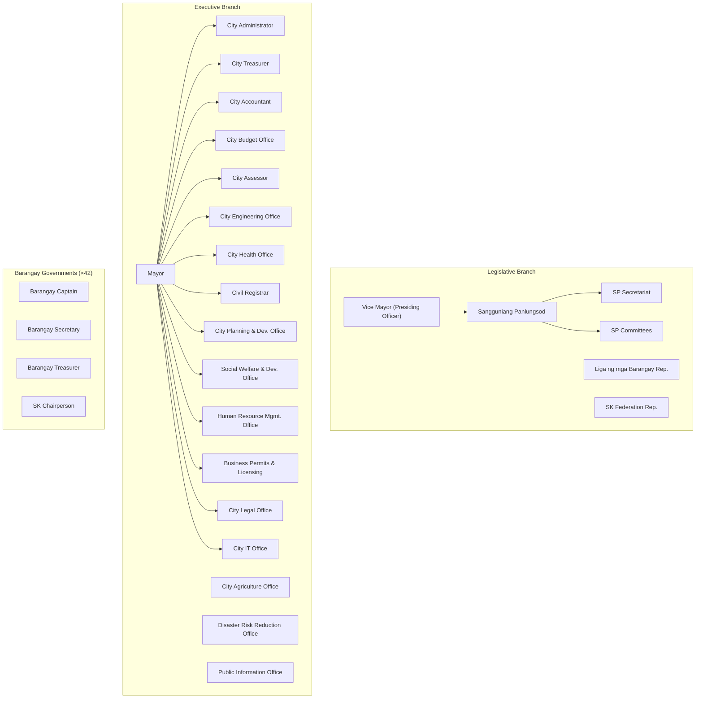

# Batac City LGU Platform — Architecture Review & Discovery

> **Label convention used throughout:**
> 
> - `[Inference]` — logically reasoned from known facts, not confirmed
> - `[Speculation]` — plausible but unverified possibility
> - `[Unverified]` — no reliable source; verify before acting on it
> 
> All LGU organizational details are `[Inference]` based on RA 7160, DILG-prescribed structures, and the uploaded reference material. Verify against Batac City's actual org chart before finalizing.

---

## Part 1 — Assumption Review: Aggressive Challenges

### 1.1 Challenged or Incorrect Assumptions

**"100–250 LGU employees initially"** This figure is probably significantly underestimated. Once you add 42 barangay officials + their secretaries, SK chairpersons, job-order workers with system access, and eventually citizens, your addressable user base is closer to 500–1,000 accounts from the beginning. Design for it.

**"Username/password authentication initially"** This directly contradicts your stated requirement for non-repudiation. Non-repudiation requires strong identity binding. A shared password on a shared workstation (common in government offices) is not a verified identity. You will be asked to add MFA much earlier than you expect, and retrofitting MFA into a system not designed for it is painful. Design the authentication flow to accommodate a second factor from day one, even if TOTP is not enabled initially.

**"Upload of scanned signatures initially"** `[Inference: based on general e-signature law principles; verify against RA 8792 Electronic Commerce Act and its IRR]`

A scanned signature image is a bitmap. Anyone with image editing software can copy it from one document and paste it onto another. This is not a technical safeguard and provides no meaningful non-repudiation. You have stated that non-repudiation is important, and then proposed an implementation that cannot deliver it. This contradiction must be surfaced explicitly to the LGU and formally accepted or resolved before architecture is finalized.

**"Potential migration to LGU-owned infrastructure later"** This is not a potential scenario. For a system with a stated 10+ year lifespan, LGU data ownership requirements, and a government mandate to avoid vendor dependency, on-premise deployment is a near-certainty at some point. Every cloud-specific service you adopt today is migration debt. Your architecture must be cloud-agnostic from day one, not retroactively made portable.

**"Workflow definitions must be configurable by authorized administrators without developer involvement"** You have accepted this as a given without fully scoping its complexity. This is widely acknowledged — including in your uploaded reference material — as the single most technically complex requirement in the entire system. Admin-configurable workflows with branching, merging, looping, versioning, and in-flight migration are equivalent in scope to building a subset of a BPMN 2.0 execution engine. It requires at minimum 25–30% of Phase 1 engineering time and deserves its own architectural design document before any code is written.

**"Workflows may branch, merge, loop back, be revised, and be versioned"** This description is consistent with BPMN-level process orchestration, not a simple state machine. These capabilities interact with each other in complex ways: what happens to an in-flight loop instance when its definition is deprecated? What constitutes a valid merge when one parallel branch has rejected? These are unsolved problems in many enterprise systems. Surface them before committing to building from scratch.

**"4 developers with heavy AI assistance"** AI-assisted development accelerates code production but introduces architectural inconsistency at module boundaries. A 4-person team using AI heavily will produce more lines of code in less time, but also more code that drifts from the intended architecture without strict governance. You need more architectural governance than a larger team, not less. Architecture Decision Records (ADRs), module boundary enforcement, and automated coupling tests are not optional for a 10-year codebase.

**"Record deletion should be avoided; archiving and retention policies preferred"** This is the correct direction for government records, but it conflicts with RA 10173 (Data Privacy Act), which grants data subjects the right to erasure under certain conditions. Citizen personal data stored in complaints and requests is PII. You must resolve how your no-deletion policy interacts with the right to erasure before going live with citizen-facing features. `[Inference: based on RA 10173 Sec. 16(d); verify with a DPA-qualified legal counsel]`

---

### 1.2 Blind Spots

**RA 10173 — Data Privacy Act of 2012** Your system stores citizen personal data. `[Inference: based on RA 10173]` Legal obligations include: Privacy Impact Assessment (PIA) before launch, Data Protection Officer designation, Privacy Notice at point of data collection, data subject rights handling (access, correction, erasure), and breach notification procedures within 72 hours of discovery. This has architectural implications at the field level: data classification, consent tracking, and the right-to-erasure vs. no-deletion conflict described above.

**RA 11032 — Ease of Doing Business / Anti-Red Tape Act** `[Inference: based on RA 11032 and its IRR]` Government agencies are legally required to act on simple transactions within 3 working days, complex transactions within 7 working days, and highly technical transactions within 20 working days. SLA tracking and ARTA compliance reporting are a legal requirement, not a nice-to-have feature. Your DTS and workflow engine must enforce these timelines from day one.

**RA 9184 — Government Procurement Reform Act** `[Inference]` Procurement documents (Purchase Requests, Purchase Orders, Abstract of Bids) have specific legal requirements for transparency, publication, and record-keeping that the system must enforce rather than merely facilitate.

**COA Circular requirements** `[Unverified: specific COA circulars applicable to Batac City's digital records were not confirmed]` The Commission on Audit has specific requirements for government records. Financial and procurement documents likely have COA-mandated retention periods and format requirements. Engage COA early, not after the system is built.

**Election-cycle staff turnover** Philippine local government positions change every 3 years with elections. The Mayor, Vice Mayor, all Councilors, and many department heads may be entirely different people after the 2028 election. Your system must handle: bulk role reassignment, document continuity across administrations, preservation of outgoing officials' signed actions as immutable records, and onboarding of entirely new leadership. If the system has no formal "administration transition" procedure, the post-election period will cause chaos in the data.

**Offline and intermittent connectivity** Barangays and some city hall departments in Batac may have unreliable internet. `[Unverified: specific connectivity conditions at Batac City Hall were not confirmed]` If the system is cloud-hosted with no offline capability, internet outages halt government operations. Under ARTA, "the system is down" is not a valid excuse for failing to process citizen transactions within mandated timeframes. The system must have a defined behavior during connectivity loss.

**Document number sequencing** Official government documents require centrally managed, gapless, sequential numbering within a series (e.g., Resolution No. 2026-001). This is a deceptively complex distributed systems problem. If two users attempt to create resolutions simultaneously, you must guarantee unique sequential numbers with no gaps. A naive auto-increment in the database is insufficient if documents can be created, then cancelled before numbering, or if draft documents hold a number before final approval. Number assignment policy must be defined upfront.

**Physical-to-digital correspondence** When a digital document is printed, signed with wet ink, and scanned back into the system, how is the scanned copy linked to the original digital record? How do you know the printed document was not altered between printing and signing? This is not a hypothetical edge case — it will happen frequently in a government that still uses physical documents as the legal source of truth.

**Multi-LGU scope** There is no mention of whether this platform is intended only for Batac City or could eventually be licensed or deployed to other LGUs. This is the single most impactful architectural question not addressed in your requirements. If multi-LGU deployment is even a remote possibility, tenant isolation must be designed into the data model now. Retrofitting multi-tenancy later is effectively a full rewrite.

**Barangay IT capacity** Barangay offices often have minimal IT infrastructure, limited staff technical literacy, and possibly shared devices. `[Inference]` Designing for barangay users requires a much simpler, more forgiving interface than for city hall employees, possibly a mobile-first approach. This is a fundamentally different user experience problem.

**Audit log tamper-proofing** You have stated that auditability and non-repudiation are important. An audit log stored as rows in the same PostgreSQL database as the application — writable by the same application user — is not tamper-evident. A database administrator can modify or delete rows. Government audit requirements demand a more robust guarantee.

**Disaster recovery and business continuity** Government operations cannot stop. You have not defined an RTO (Recovery Time Objective) or RPO (Recovery Point Objective). A cloud outage with no fallback means no approvals, no document routing, no citizen services. Define the RTO/RPO targets and design the architecture to meet them before deployment.

**Delegation and acting capacity** When the Mayor is on leave or traveling, an authorized officer acts as Mayor. Your workflow engine must handle delegated approval authority: who can act for whom, under what authorization, for what document types, and for what time period. This will arise in the first week of real use.

---

### 1.3 Missing Requirements

- Formal document numbering policy (who assigns, what series, what happens to gaps)
- Retention schedules per document type (legally mandated; COA and DILG may prescribe these)
- Bulk operations for records officers (bulk archive, bulk search, bulk export)
- Migration strategy for historical documents (what data exists today and in what form)
- Session management policy (timeout duration, concurrent login restrictions, forced logout)
- Delegation and acting-capacity management
- SLA thresholds per document type (required for ARTA compliance)
- Print output and QR/barcode cover sheet generation
- Email as a document intake channel (many government communications arrive via email)
- Mobile access requirements (what devices do users actually have)
- Data export and portability (LGU must be able to export all data in a standard format at any time)
- System administrator data separation (IT admin must not have read access to confidential documents even if they have server access)
- Citizen identity verification approach for portal access
- Document classification and sensitivity levels (not all documents are equally accessible)

---

### 1.4 Hidden Complexity

**Admin-configurable workflow versioning + in-flight migration** The hardest unsolved problem in workflow systems. When a workflow definition is revised, in-flight instances are already partially completed under the old version. Do they continue under the old version (safest, most auditable)? Migrate automatically (dangerous, may invalidate prior approvals)? Require manual migration by an administrator (operationally complex)? You must define this policy before building the engine, because the data model is fundamentally different for each choice.

**Parallel workflow steps** You stated workflows may branch and merge. A parallel split (document goes to Committee A and Committee B simultaneously, must merge before proceeding) requires tracking multiple active step instances per workflow instance simultaneously. Your tracking, notification, and SLA logic all become significantly more complex.

**Non-repudiation with scanned images** Addressed above. If the LGU formally accepts that scanned signatures do not provide cryptographic non-repudiation, that acceptance must be documented. If they do not accept it, you need PKI-based digital signatures, which is a substantial additional system.

**Concurrent modification and optimistic locking** Multiple users can act on documents simultaneously. A secretary and a department head may both attempt to move the same document forward at the same time. Optimistic locking resolves this but produces user-visible conflicts. Government users typically have low tolerance for "someone else modified this document" error messages. Pessimistic locking prevents conflicts but creates bottlenecks. This must be designed deliberately.

**Data Privacy Act vs. no-deletion policy** Described in 1.1. A citizen whose complaint contains sensitive personal information has a legal right to erasure under RA 10173. Your no-deletion policy is the correct archival stance for government records but must have a defined exception process for DPA-mandated erasure requests, with legal review.

---

## Part 2 — Risk Register

### Architectural Risks

|Risk|Severity|Likelihood|
|---|---|---|
|Custom workflow engine becomes unmaintainable|High|Medium|
|Module coupling grows without enforcement|High|High|
|Premature microservices if team overreaches|High|Low|
|Audit log integrity not tamper-evident|High|Medium|
|Cloud-specific dependencies block on-premise migration|High|High|

### Organizational Risks

|Risk|Severity|Likelihood|
|---|---|---|
|Post-election champion loss (2028)|High|Medium|
|Staff adoption resistance|High|High|
|Scope creep from each stakeholder group|Medium|High|
|Ownership ambiguity after delivery|High|Medium|
|Budget discontinuity between fiscal years|High|Medium|

### Security Risks

|Risk|Severity|Likelihood|
|---|---|---|
|Scanned signature forgery|High|Medium|
|Password-only auth for high-authority accounts|High|High|
|Audit log modified by DB admin|High|Low|
|Privilege escalation through misconfigured roles|High|Medium|
|Citizen portal as attack surface|Medium|High|

### Data Governance Risks

|Risk|Severity|Likelihood|
|---|---|---|
|No RA 10173 compliance process|High|High|
|No COA-compliant retention schedules|Medium|High|
|Backup keys held by developer, not LGU|High|Medium|
|No defined data handover process at contract end|High|Medium|

### Deployment and Operations Risks

|Risk|Severity|Likelihood|
|---|---|---|
|No offline fallback for internet outages|High|High|
|No infrastructure-as-code, manual setup|High|High|
|No defined RTO/RPO|High|High|
|LGU infrastructure unready for on-premise migration|Medium|High|

---

## Part A — Clarifying Questions

These must be answered before architecture is finalized.

1. **Multi-LGU scope** — Is this intended only for Batac City, or is there any intention to deploy or license to other LGUs? This is the highest-impact unanswered architectural question.
    
2. **Existing systems** — What software does the LGU currently use? (Payroll? HRIS? Treasury? BPLO?) Do those systems continue alongside this platform, or will this replace them?
    
3. **Internet reliability** — Can critical city hall operations tolerate 30+ minute internet outages? What is the typical connectivity experience at Batac City Hall locations?
    
4. **Offline requirement** — Must the system remain at least partially operable during internet outages (e.g., read-only mode), or is full cloud dependency acceptable?
    
5. **Post-delivery ownership** — Who maintains the system after delivery? Is the development team contracted for long-term maintenance, or will an internal IT team take over?
    
6. **Workflow walkthrough status** — Has anyone sat down with the SP Secretary and Records Officer to walk through a real document lifecycle end-to-end? Or is all current workflow knowledge assumption-based?
    
7. **DPA compliance readiness** — Has a Data Protection Officer been designated by the LGU? Is a Privacy Impact Assessment planned?
    
8. **Budget continuity** — Is funding confirmed beyond the initial development phase, across fiscal years?
    
9. **Barangay device access** — Do barangays have dedicated computers and reliable internet? Or are you planning mobile-first for barangay access?
    
10. **COA engagement** — Has anyone consulted the Commission on Audit on digital records requirements for this LGU?
    
11. **Document numbering authority** — Who currently controls the official numbering series for resolutions, ordinances, and executive orders? Is this currently manual?
    
12. **Delegation policy** — When the Mayor or a key approver is unavailable, who acts and under what formal authorization?
    
13. **Physical document retention policy** — After a document is processed digitally, is the physical original still legally required? For which document types?
    
14. **Citizen identity approach** — How will citizen identity be verified for portal access? PhilSys integration is possible but architecturally significant.
    

---

## Part B — Requirements Discovery Checklist (General Stakeholder Interviews)

### Process Discovery

- Walk me through the complete lifecycle of one document — from the moment it is created or received to the moment it is filed — for each major document type.
- Who initiates each type of document? Where does it physically come from?
- Who is the first person to touch it? What do they do to it?
- What happens when the assigned person is absent, on leave, or unavailable?
- Can a document be returned for revision? By whom? To whom?
- Can a document be cancelled after it has started routing? Who has authority to cancel?
- How long should each step ideally take? What happens when a step exceeds that time?
- Are there documents that can skip steps under certain conditions?

### Current Pain Points

- What is the single biggest problem with the current paper-based process?
- What documents are most frequently lost, misplaced, or significantly delayed?
- How do citizens currently check the status of their requests or complaints?
- What is the realistic current processing time for [specific document type]?
- What information do you most frequently need but cannot locate quickly?
- What tasks consume the most manual effort that should not require manual effort?

### Access and Security

- Who should be able to see each type of document?
- Are there documents that must remain confidential even from other departments?
- Should citizens be able to track their own documents in progress?
- What specifically should citizens not be able to see?
- Are there documents that are confidential even from some internal employees?

### Integration and Data Migration

- What existing software systems does the LGU currently use?
- Are there historical documents that need to be migrated into the new system? In what format do they currently exist?
- Are there reports currently produced manually in Excel that should be automated?
- Does any existing system hold data that the new platform needs?

### Legal and Compliance

- What are the legal mandated retention periods for each document type?
- Are there DILG, COA, CSC, or other regulatory requirements that affect how documents are managed or retained?
- Has the LGU designated a Data Protection Officer under RA 10173?
- Has a Privacy Impact Assessment been conducted for the new system?
- What are the ARTA-mandated processing timeframes for each service the LGU provides?

### Technical Environment

- What devices do employees use? Desktop, laptop, or mobile?
- How reliable and fast is the internet connection at each office location?
- Is there a local area network (LAN) at city hall?
- Is there backup power (UPS, generator) at critical locations?
- Who will maintain the system after it is deployed?

### Success Criteria

- How will you know the system is a success after 6 months of use?
- What would constitute a failure of this project?
- Which single feature would most immediately reduce your daily workload?

---

## Part C — Stakeholder-Specific Discovery Checklists

### Mayor

- What document-based decisions do you make on a typical working day?
- How many documents do you sign in an average week?
- What information do you require before signing a document?
- Does your staff prepare documents for your signature, or do you review them yourself from the start?
- What operational information do you wish you could see at any moment without asking staff?
- When you are traveling or unavailable, how are urgent approvals handled? Who acts?
- What is the biggest inefficiency in how government operations are currently run?
- What public-facing information should citizens be able to access through an online portal?
- Are there documents or decisions you currently cannot delegate but should be able to?

### Vice Mayor and SP Presiding Officer

- How is an SP session called and formally documented?
- What is the exact workflow of a resolution from first draft to final release?
- What differs between a resolution workflow and an ordinance workflow?
- How are committee assignments made? Is there a formal rule or is it discretionary?
- Which documents must be read aloud during session? All? Selected sections?
- How are SP session minutes prepared, reviewed, approved, and archived?
- Who has authority to release approved resolutions and ordinances?
- How are amendments and interpellations during session captured and recorded?
- What information do you need to see before calling a document for a vote?

### SP Secretary

- Describe your daily document processing routine from receiving the first document to end of day.
- How are incoming documents currently logged? Is there a logbook? An existing system?
- What is the current numbering system for resolutions and ordinances? Who controls it?
- Who is authorized to prepare the session agenda? What is the process?
- How are documents distributed to Councilors before a session? Physical copies? Email?
- What happens to documents referred to committee? How is that tracked?
- How many active documents are typically in your queue on any given day?
- What documents do you prepare repeatedly that could use a template?
- What monthly reports do you currently produce? What manual effort does that require?
- How are returned or rejected documents tracked against the original submission?

### Councilors

- How do you currently receive documents for review prior to session?
- How do you provide feedback, corrections, or proposed amendments?
- Do you access documents remotely, from home or outside city hall?
- What information do you need before voting on a document?
- How do you submit committee reports? What is the current process?
- What is the typical time window you are given to review documents before a session?

### Department Heads

- What document types does your department originate and submit to other offices?
- What document types does your department receive from other offices for action?
- Who within your department is authorized to approve documents at various levels?
- How do you currently monitor the status of documents your department has submitted?
- How do you handle incoming documents that must be distributed to multiple sub-units within your department?
- What reports are you required to submit, and how frequently?
- What is the biggest time waste in your current document and administrative process?
- What information would help you better manage your department's workload?

### Records Officers

- What is the current filing and indexing system for physical records?
- How are documents currently searched and retrieved when needed?
- What is the current retention policy for each major document type?
- Where are physical records currently stored? Are there capacity concerns?
- How are confidential records currently physically protected?
- How do you handle requests to retrieve archived documents? How long does it take on average?
- Are there COA audit requirements you currently find difficult to meet?
- How are documents disposed of when their retention period expires? Is there a formal process?
- Are there document categories that are not currently archived at all?

### Barangay Officials

- What types of documents does your barangay regularly send to city hall?
- What types of documents do you receive from city hall?
- Do you have a computer and reliable internet connection at your barangay hall?
- How do you currently track whether submitted documents have been received and acted upon?
- What is the most frustrating aspect of dealing with city hall on document matters?
- Would you access a system via a computer, a mobile phone, or both?
- Do you have staff who would manage system interactions on your behalf, or would you do it personally?

### General Employees

- What documents do you create, process, or receive on a regular basis?
- What is the most repetitive document-related task you perform?
- How do you currently know which documents are waiting for your action?
- How do you notify a colleague that a document requires their attention?
- Do you work from a single device, or do you need access from different locations or devices?
- What one change would make your daily work significantly faster?

### Citizens

- Have you ever submitted a request or complaint to city hall? Describe that experience.
- Were you able to find out the status of your submission without visiting in person?
- How did you receive the response or outcome?
- What city hall information would you want to be able to access online?
- Do you use a smartphone? Are you comfortable using a government website?
- What language would you prefer for interacting with an online city hall portal? (Filipino, English, Ilocano)
- Would you trust a city hall online portal with your personal information?

### IT Personnel

- What is the current server and network infrastructure at city hall locations?
- What is the internet connection type and measured speed at each location?
- Is there a backup power supply — UPS or generator — at critical locations?
- Who currently manages IT systems at the LGU? Is there dedicated IT staff?
- What is the IT budget allocation and approval cycle?
- Have you managed cloud deployments or containerized systems before?
- What are the biggest day-to-day IT pain points at the LGU?
- Is there a disaster recovery plan for any existing systems?
- What is the plan for supporting the system after the development team delivers it?

---

## Part D — LGU Organizational Structure and Document Flow

> `[Inference: based on RA 7160, DILG-prescribed structure, and uploaded reference material. Verify against Batac City's official organizational chart.]`



### Typical Document Flow Patterns

**Pattern 1 — Citizen Request to Mayor's Office**

```
Citizen
  → Receiving Desk (log, assign tracking number, QR label)
  → Mayor's Office (assess, route)
  → Concerned Department (action)
  → Mayor's Office (confirm completion)
  → Citizen (response)
```

**Pattern 2 — SP Resolution (Legislative)**

```
Councilor / SP Secretary (draft)
  → SP Secretary (log, assign series number)
  → Committee Assignment
  → Committee Review and Report
  → 1st Reading (SP Session)
  → Amendment phase (if any)
  → 2nd Reading (SP Session)
  → Session Vote
  → VP / Presiding Officer (certify)
  → SP Secretary (official copy, release)
  → Mayor's Office (transmit, reference copy)
  → Records (archive)
  → Public (publish if applicable)
```

**Pattern 3 — SP Ordinance (longer than Resolution)**

```
Draft
  → SP Secretary (log)
  → Committee (review, public hearing)
  → 1st Reading
  → 2nd Reading
  → 3rd Reading (final vote)
  → Vice Mayor (certify)
  → Mayor (10-day review; may veto)
  → If not vetoed: effective after publication
  → SP Secretary (archive official copy)
  → Public (mandatory publication)
```

**Pattern 4 — Executive Document (e.g., Travel Order)**

```
Employee (request)
  → Immediate Supervisor (endorse)
  → Department Head (approve)
  → Mayor's Office (approve — if required)
  → HR (record)
  → Finance (if with funding implications)
```

**Pattern 5 — Procurement / Purchase Request**

```
Requesting Office
  → Department Head (endorse)
  → Budget Office (availability of funds)
  → Accounting (pre-obligation)
  → BAC Secretariat (procurement process)
  → Award → Supplier → Delivery
  → Inspection (acceptance)
  → Accounting (disbursement)
  → COA (audit trail)
```

**Pattern 6 — Barangay to City Hall**

```
Barangay Council (passes resolution)
  → Barangay Secretary (certifies, transmits)
  → City Hall Receiving
  → SP Secretariat or Mayor's Office (depending on subject)
  → Committee or Department (action)
  → Response to Barangay
```

---

## Part E — Educated-Guess Master Lists

> All items below are `[Inference]` unless otherwise noted.

### Offices

**Executive:** Office of the Mayor, Office of the City Administrator, City Treasurer's Office, City Accountant's Office, City Budget Office, City Assessor's Office, City Engineering Office, City Health Office, City Civil Registrar's Office, City Planning and Development Office (CPDO), City Social Welfare and Development Office (CSWDO), Human Resource Management Office (HRMO), Business Permits and Licensing Office (BPLO), City Agriculture Office, Disaster Risk Reduction and Management Office (DRRMO), City Tourism Office, Public Information Office (PIO), City IT Office, City Legal Office

**Legislative:** Office of the Vice Mayor, SP Secretariat, SP Committees (Finance, Public Works, Health, Education, Peace and Order, Women and Family, Environment, Tourism, Barangay Affairs — exact composition varies)

**Barangay-level (×42):** Each Barangay Office, SK Office

**Public-facing:** Central Receiving Office, Public Assistance Desk

---

### Roles (System Roles, not Organizational Positions)

|System Role|Description|
|---|---|
|System Administrator|Full system access; no access to confidential document content|
|Platform Administrator|Workflow configuration, user management, master data|
|Records Officer|Archive management, retention, disposition|
|Department Encoder|Create and submit documents for their department|
|Department Approver|Approve documents within their office and scope|
|SP Secretary|Manage SP legislative workflow and document registry|
|SP Member|Review, comment, and vote on legislative documents|
|SP Presiding Officer|Manage sessions, certify legislative output|
|Mayor|Final executive approval authority|
|Barangay Encoder|Submit barangay documents to city hall|
|Barangay Captain|Approve and sign barangay documents|
|Citizen|Limited read-only access to public portal and own submissions|
|Auditor|Read-only access to audit logs and finalized documents|
|System Auditor|Read-only access to technical audit and security logs|

---

### Document Types (with Classification)

|Category|Document Type|Routing|Approval|Signature|Official Record|
|---|---|---|---|---|---|
|Legislative|SP Resolution|Yes|Yes|Yes|Yes|
|Legislative|SP Ordinance|Yes|Yes|Yes|Yes|
|Legislative|Committee Report|Yes|Yes|Yes|Yes|
|Legislative|Session Minutes|No|Yes|Yes|Yes|
|Legislative|Barangay Resolution|Yes|Yes|Yes|Yes|
|Executive|Executive Order|Yes|Yes|Yes|Yes|
|Executive|Memorandum Order|Yes|Yes|Yes|Yes|
|Executive|Memorandum Circular|Yes|No|Yes|Yes|
|Administrative|Internal Memorandum|Sometimes|No|Yes|No|
|Administrative|Travel Order|Yes|Yes|Yes|Yes|
|Administrative|Leave Application|Yes|Yes|No|No|
|Administrative|Job Order / Contract|Yes|Yes|Yes|Yes|
|Financial|Purchase Request|Yes|Yes|Yes|Yes|
|Financial|Purchase Order|Yes|Yes|Yes|Yes|
|Financial|Disbursement Voucher|Yes|Yes|Yes|Yes|
|Financial|Budget Request|Yes|Yes|Yes|Yes|
|Financial|Liquidation Report|Yes|Yes|Yes|Yes|
|Procurement|Request for Quotation|Yes|Yes|Yes|Yes|
|Procurement|Abstract of Bids|Yes|Yes|Yes|Yes|
|Citizen|Citizen Request|Yes|Sometimes|No|No|
|Citizen|Citizen Complaint|Yes|No|No|Sometimes|
|Citizen|Permit Application|Yes|Yes|No|Yes|
|Project|Project Proposal|Yes|Yes|Yes|Yes|
|Project|Inspection Report|No|Yes|Yes|Yes|
|Project|Accomplishment Report|No|Yes|Yes|Yes|
|Meeting|Session Agenda|No|Yes|Yes|No|
|Meeting|Attendance Sheet|No|No|Yes|Yes|

---

### Core Workflows (`[Inference]`)

1. **SP Resolution:** Draft → Secretary Review → Committee Assignment → Committee Report → 1st Reading → Amendment → 2nd Reading → Vote → VP Certify → Secretary Release → Archive
2. **SP Ordinance:** Draft → Secretary Review → Committee → 1st Reading → Public Hearing → 2nd Reading → 3rd Reading → Vote → VP Certify → Mayor Review (10-day) → Sign/Veto → Publication → Implementation → Archive
3. **Executive Order:** Draft (Mayor's Office) → Legal Review → Mayor Approve and Sign → Release → Archive
4. **Travel Order:** Employee → Supervisor Endorse → Department Head Approve → Mayor Approve → HR Record → Travel
5. **Purchase Request:** Requesting Office → Department Head → Budget Officer → Accounting → BAC Secretariat → Procurement
6. **Citizen Request:** Submit → Receive and Log → Mayor's Office → Department Assignment → Action → Response → Close
7. **Complaint:** Submit → Receive and Log → Appropriate Office → Investigation → Findings → Resolution → Notify Complainant → Archive
8. **Barangay Resolution:** Barangay submit → City Hall Receive → Route to SP or Mayor → Action → Response

---

### Approvals Matrix (`[Inference]`)

|Document|Step 1|Step 2|Step 3|Final Authority|
|---|---|---|---|---|
|SP Resolution|Committee|SP Session Vote|VP Certify|SP Secretary Release|
|SP Ordinance|Committee|SP Vote|VP Certify|Mayor Review/Sign|
|Travel Order|Supervisor|Department Head|Mayor|—|
|Purchase Request|Department Head|Budget Office|Accounting|Mayor (above threshold)|
|Leave Application|Supervisor|Department Head|HRMO|—|
|Executive Order|Legal Office|Mayor|—|—|
|Citizen Request|Receiving|Department|Mayor (if required)|—|
|Citizen Complaint|Receiving|Investigator|Office Head|—|

---

### Reports

**Operational:** Documents pending by office, documents pending by employee, overdue documents by SLA breach age, daily received count, average processing time per document type, average processing time per office

**Legislative:** Resolutions approved by period, ordinances approved by period, SP session summary, committee activity by period

**Citizen Services:** Requests received / resolved / pending, complaint resolution rate, average complaint resolution time, ARTA compliance rate per service type

**Management:** City-wide document throughput, office performance comparison, document backlog trend, SLA compliance rate

**Records Management:** Documents approaching retention expiry, archived document count by category, storage utilization

---

### KPIs (`[Inference]` — validate with LGU before finalizing)

|KPI|Indicative Target|Owner|
|---|---|---|
|Simple transaction processing time|≤ 3 working days (ARTA)|All Offices|
|Complex transaction processing time|≤ 7 working days (ARTA)|All Offices|
|SLA breach rate|< 5% of active documents|City Administrator|
|Citizen request resolution rate|> 90%|All Departments|
|Document backlog (pending > 7 days)|< 10% of active|Department Heads|
|System uptime|> 99.5%|IT|
|Workflow completion rate|> 95%|Records Officer|

---

### Dashboards

**Mayor's Dashboard:** Items requiring signature today, documents overdue across all departments, citizen request summary (submitted / resolved / pending), department workload overview

**SP Secretary's Dashboard:** Session calendar, documents scheduled for next session, documents currently in committee, recent approvals log, monthly legislative output summary

**Department Head Dashboard:** Department inbox (items awaiting action), overdue items, team workload by person

**Records Officer Dashboard:** Archive queue, retention expiry alerts (next 30 / 60 / 90 days), storage utilization

**Citizen Portal Dashboard:** My submitted requests (with status), my complaint status, public document library, announcements

**System Administrator Dashboard:** User activity log, failed login attempts, storage utilization, system health indicators

---

## Part F — Architecture Recommendation

### Recommended Pattern: Modular Monolith with Internal Event Bus

**Rationale:**

Microservices at 100–250 users is an operational anti-pattern for a 4-person team. The distributed systems overhead — service discovery, inter-service authentication, distributed tracing, independent deployment pipelines — provides no benefit at this scale and introduces failure modes that a small team cannot manage reliably.

A modular monolith gives you clean domain separation, independent module evolution, and a clear extraction path to services if the system grows beyond what a monolith can serve. The internal event bus decouples modules without distributed systems overhead.

```
┌──────────────────────────────────────────────────────────────────┐
│                     Batac LGU Platform                           │
│                                                                  │
│  ┌──────────────┐  ┌──────────────┐  ┌──────────────────────┐   │
│  │  Identity &  │  │ Organization │  │    Document Core     │   │
│  │    Access    │  │  & Org Chart │  │    (DMS + Storage)   │   │
│  └──────────────┘  └──────────────┘  └──────────────────────┘   │
│  ┌──────────────┐  ┌──────────────┐  ┌──────────────────────┐   │
│  │   Workflow   │  │  Document    │  │      Records         │   │
│  │   Engine     │  │  Tracking    │  │   Management (RMS)   │   │
│  └──────────────┘  └──────────────┘  └──────────────────────┘   │
│  ┌──────────────┐  ┌──────────────┐  ┌──────────────────────┐   │
│  │ Notifications│  │    Search    │  │      Reporting       │   │
│  └──────────────┘  └──────────────┘  └──────────────────────┘   │
│  ┌──────────────┐  ┌─────────────────────────────────────────┐  │
│  │ Audit Log    │  │     Government Portal (Public API)      │  │
│  │ (append-only)│  └─────────────────────────────────────────┘  │
│  └──────────────┘                                                │
│                                                                  │
│                   Internal Event Bus (in-process)                │
└──────────────────────────────────────────────────────────────────┘
         │                    │                    │
   PostgreSQL           S3-compatible         Meilisearch
   (schema-per-module)  Object Storage        (Search)
```

**Architectural laws for this system:**

1. Each module owns its own PostgreSQL schema. No module reads another module's schema directly. Cross-module data access goes through published APIs or events.
2. Modules communicate through the internal event bus, not direct method calls across module boundaries.
3. No shared mutable state between modules.
4. The audit log schema is append-only. The application database user for the audit log has INSERT permission only.
5. All file references in the database are storage keys (UUIDs), never file paths or original filenames.
6. All infrastructure is defined in code. No manual cloud resource creation.

---

## Part G — Stack Recommendations

### Frontend

**Recommendation: React (TypeScript) + Vite + TanStack Query + Radix UI / shadcn-ui**

React has the widest developer talent pool in the Philippines and the longest likely community support horizon. TypeScript is non-negotiable for a 10-year codebase. Avoid Next.js for the internal authenticated application — SSR complexity is not justified for a role-specific SPA. Use Vite + React SPA for the internal app. Next.js is acceptable for the public portal where SEO matters.

**State management:** TanStack Query for server state. Zustand for minimal UI state. No Redux — it adds indirection without benefit for this use case.

**Do not use:** Vue, Angular, or Svelte. Not because they are inferior, but because the Philippine developer talent pool for long-term maintenance is significantly smaller.

---

### Backend

**Recommendation: TypeScript + Node.js + Fastify**

Primary rationale: single language across frontend and backend reduces context switching for a small team. Fastify is significantly more production-appropriate than Express (faster, better plugin architecture, built-in schema validation). TypeScript gives the type safety required for a 10-year codebase with module boundaries.

**Alternative if the team has Go experience: Go (Golang).** Go produces self-contained binaries, has superior concurrency, and has a lower operational footprint. If any team member has Go experience, this is worth serious consideration. The language enforces explicitness in a way that is good for long-term maintainability.

**Avoid:** PHP (workflow logic becomes painful at scale), Django/Python (not wrong, but adds a language context switch for a likely JS-heavy team), Java/Spring Boot (heavyweight operational model for a 4-person team).

---

### Database

**Recommendation: PostgreSQL 16+**

No competing alternative for this use case. PostgreSQL provides ACID compliance, JSONB for flexible metadata, row-level security (RLS) for data isolation, excellent support for audit patterns, advanced full-text search capabilities as a fallback, no vendor lock-in, and runs identically on any cloud provider or on-premise server.

**Schema strategy:**

```sql
schema: iam          -- identity and access
schema: organization -- offices, positions, assignments
schema: documents    -- core document entities
schema: workflow     -- definitions and instances
schema: tracking     -- routing history, QR
schema: records      -- retention, archive, classification
schema: notifications
schema: search_meta  -- search index metadata
schema: portal       -- public-facing data
schema: reporting    -- materialized views, report definitions
schema: audit        -- append-only, restricted write access
```

**Do not use:** MongoDB. The phrase "document management" makes a document store seem intuitive, but the query patterns of this system — join-heavy, workflow-state-aware, time-series audit queries — are fundamentally relational. MongoDB would produce significantly worse results for this domain.

---

### Search Engine

**Recommendation: Meilisearch (self-hosted) for Phase 1; OpenSearch as the upgrade path**

Meilisearch is easy to operate, fast for full-text search, self-hosted (no lock-in), and handles multi-language text reasonably well. OpenSearch (the open-source AWS OpenSearch fork) is the upgrade path for larger scale. Avoid Elasticsearch directly due to licensing history.

---

### Object Storage

**Recommendation: Cloudflare R2 (cloud Phase 1) → MinIO (on-premise readiness)**

Use the S3-compatible API exclusively. Never use provider-specific SDKs. Cloudflare R2 has no egress fees, which matters significantly for a document-heavy system where bandwidth costs can accumulate. MinIO is self-hostable and fully S3-compatible — the on-premise migration requires changing an endpoint URL, not rewriting application code.

**File naming rule:** All files stored using UUID keys. Original filenames are stored as metadata in PostgreSQL only. Never use original filenames as storage paths.

---

### Queue and Event System

**Recommendation: pgboss (PostgreSQL-backed job queue) for Phase 1**

Adding Redis, RabbitMQ, or Kafka on day one introduces operational overhead that a 4-person team cannot absorb without sacrificing delivery. pgboss uses PostgreSQL as the queue backend, which gives you transactional job enqueueing: a document save and its associated notification enqueue happen in the same database transaction, eliminating message loss on failure. Migrate to a dedicated queue when scale demands it, without changing application code, if you abstract the queue interface from the start.

---

### Workflow Engine

**Recommendation: Build a domain-specific workflow engine; do not adopt a general-purpose BPMN engine**

General-purpose BPMN engines (Camunda, Temporal, Flowable, Activiti) are powerful but have steep learning curves, complex operational requirements, and produce systems that are difficult for a 4-person team to understand, debug, and maintain. Your workflow requirements are well-defined enough to build a focused engine that will be more understandable, testable, and maintainable than a generic one.

**Core engine data model:**

```
WorkflowDefinition
  id, name, description
  version (integer, increments on each publish)
  status: draft | active | deprecated
  created_by, published_at

WorkflowStep
  id, definition_id
  name, description
  type: action | approval | parallel_split | parallel_join | decision | notification | termination
  assignee_rule: role | specific_user | office | dynamic_expression
  sla_hours (nullable)
  on_complete → next_step_id
  on_reject → next_step_id (may loop back)
  on_timeout → escalation_step_id or next_step_id

WorkflowInstance
  id
  definition_id + definition_version (pinned at instance creation)
  document_id
  current_step_id
  status: active | completed | cancelled | suspended
  started_at, completed_at

WorkflowStepInstance
  id, instance_id, step_id
  assignee_user_id (resolved at runtime from rule)
  status: pending | in_progress | completed | rejected | skipped | timed_out
  assigned_at, completed_at, action_by, action_comment

WorkflowEvent (append-only)
  id, instance_id, step_instance_id
  event_type, actor_user_id, timestamp, payload
```

**Critical rules:**

- A workflow instance is always pinned to the definition version active at the time it was created.
- Workflow definitions are never modified. A new version is created and published. The old version is deprecated.
- In-flight instances under a deprecated version complete under their original version unless an administrator explicitly migrates with a full audit record.
- Never allow a step to be assigned to a user who does not exist in the organization module.

---

### Authentication Strategy

**Recommendation: Username + bcrypt password initially; OAuth 2.0 with PKCE architecture from day one**

- JWT access tokens (short-lived, 15–60 minutes) + refresh tokens (long-lived, stored server-side in database)
- Tokens stored in HTTP-only, Secure, SameSite=Strict cookies only. Never in localStorage or sessionStorage.
- Refresh token registry maintained in the database for server-side session invalidation.
- Design the authentication module to accept a second-factor challenge response from day one, even if TOTP is not enabled initially.
- Password policy: minimum 12 characters, complexity requirements, no reuse (last 5 passwords), forced rotation on first login and for privileged accounts. `[Inference: aligned with government security best practices; verify against DICT NIST-aligned guidelines]`
- Plan MFA (TOTP) as the highest-priority post-launch security enhancement.

---

### Authorization Model

**Recommendation: ABAC (Attribute-Based Access Control) with RBAC as the simplified entry point**

Pure RBAC cannot express "a Department Head may approve only documents submitted by their own department" without creating exponential role combinations. ABAC policies can express this naturally:

```
ALLOW approve WHERE
  user.role = 'department_head'
  AND document.owning_office_id = user.office_id
  AND workflow_step.required_action = 'approve'
```

Start with RBAC-style role assignments, evaluate ABAC policies at request time, and enforce PostgreSQL Row-Level Security as a second data-isolation layer at the database level. All authorization decisions are written to the audit log.

---

### Reporting Architecture

**Two-tier approach:**

- **Tier 1 — Operational (real-time):** Built from the primary PostgreSQL database using read replicas. Handles pending counts, SLA status, inbox summaries. Used for dashboards and operational reports.
- **Tier 2 — Analytical (batch):** A separate PostgreSQL reporting schema populated by scheduled ETL. Used for trend analysis, historical performance, and executive summaries.

Database views and materialized views own the reporting query logic. Application code queries views, not raw tables. This keeps reporting logic maintainable at the database layer. All reports are exportable as PDF (server-rendered via a PDF library) and CSV.

---

### Audit Architecture

**Recommendation: Append-only audit schema with checksum-chained records and periodic cold storage export**

```sql
-- Schema: audit
-- Application DB user: INSERT only on this schema

CREATE TABLE audit.events (
  id            UUID    DEFAULT gen_random_uuid() PRIMARY KEY,
  event_time    TIMESTAMPTZ NOT NULL DEFAULT now(),
  actor_user_id UUID    NOT NULL,
  actor_ip      INET,
  actor_session UUID,
  entity_type   TEXT    NOT NULL,
  entity_id     UUID    NOT NULL,
  action        TEXT    NOT NULL,
  payload       JSONB,
  prev_hash     TEXT,   -- hash of the previous record
  row_hash      TEXT    -- hash of this record's content for tamper detection
);
```

**Rules:**

- The application DB user for audit writes has INSERT-only permission. No UPDATE or DELETE.
- Hash chaining: each record includes a hash of the previous record, making any tampering detectable by recomputing the chain.
- Periodic export (weekly or monthly) to immutable cold storage (S3 Glacier or equivalent), encrypted with keys held by the LGU.
- The audit module is the only consumer that writes to the audit schema; no other module writes directly.

---

### Deployment Architecture

**Recommendation: Docker containers + Docker Compose (Phase 1); Terraform IaC; Kubernetes readiness for Phase 3+**

```
Cloud Provider (provider-agnostic via Terraform)
├── Application Container (Node.js/Fastify)
├── PostgreSQL (managed PaaS or self-hosted container)
├── Meilisearch (container)
├── MinIO or R2 (object storage)
├── pgboss (runs within application process)
└── Nginx or Caddy (reverse proxy + TLS termination)
```

All infrastructure defined in Terraform or Pulumi from day one. No manual resource creation. This is the primary technical enabler of the eventual on-premise migration.

---

### Backup Architecture

- **PostgreSQL:** Daily automated `pg_dump` to S3-compatible storage + WAL-based continuous archiving (PITR) with at least 24-hour recovery window.
- **File storage:** S3 versioning enabled + cross-region replication.
- **Backup encryption:** Keys held by the LGU IT office, not the development team.
- **Retention:** 30 days online hot backup; 1 year cold storage.
- **Restoration test:** Monthly restoration test from backup (automated or manual); results logged.
- **Target RTO:** 4 hours. **Target RPO:** 1 hour. `[Inference: these should be negotiated with and agreed to by the LGU.]`

---

## Part H — Module and Domain Boundaries

```
┌──────────────────────────────────────────────────────────────────┐
│ IAM — Identity & Access Management                               │
│   User, UserCredential, Session, RefreshToken, Role, Permission  │
│   Owns: authentication, authorization primitives, MFA            │
│   Events out: UserCreated, UserRoleChanged, SessionStarted       │
└──────────────────────────────────────────────────────────────────┘
┌──────────────────────────────────────────────────────────────────┐
│ ORGANIZATION                                                     │
│   Office, Position, Employee, Assignment, OfficeDelegation       │
│   Owns: org chart, position hierarchy, acting capacity           │
│   Events out: OfficeCreated, EmployeeAssigned, DelegationGranted │
└──────────────────────────────────────────────────────────────────┘
┌──────────────────────────────────────────────────────────────────┐
│ DOCUMENT CORE (DMS)                                              │
│   DocumentType, Document, Attachment, Version, DocumentNumber,   │
│   SignatureRecord, DocumentMetadata                              │
│   Owns: storage refs, classification, versioning, numbering      │
│   Events out: DocumentCreated, DocumentSubmitted, NumberAssigned │
└──────────────────────────────────────────────────────────────────┘
┌──────────────────────────────────────────────────────────────────┐
│ WORKFLOW ENGINE                                                  │
│   WorkflowDefinition, WorkflowVersion, WorkflowStep,            │
│   WorkflowInstance, StepInstance, WorkflowEvent                  │
│   Owns: process definitions, instance execution, SLA tracking    │
│   Events out: StepAssigned, StepCompleted, StepOverdue,          │
│              InstanceCompleted, InstanceCancelled                │
└──────────────────────────────────────────────────────────────────┘
┌──────────────────────────────────────────────────────────────────┐
│ DOCUMENT TRACKING (DTS)                                          │
│   TrackingRecord, RoutingEntry, QRCode, PhysicalCustody          │
│   Owns: movement audit trail, QR generation and lookup           │
│   Events out: DocumentReceived, DocumentForwarded, QRScanned     │
└──────────────────────────────────────────────────────────────────┘
┌──────────────────────────────────────────────────────────────────┐
│ RECORDS MANAGEMENT (RMS)                                         │
│   Record, RetentionSchedule, ArchiveEntry, Classification        │
│   Owns: long-term preservation rules, COA compliance             │
│   Events out: DocumentArchived, RetentionExpired                 │
└──────────────────────────────────────────────────────────────────┘
┌──────────────────────────────────────────────────────────────────┐
│ NOTIFICATIONS                                                    │
│   NotificationTemplate, NotificationEvent, DeliveryLog          │
│   Owns: notification routing, template rendering, delivery       │
│   Events in: all domain events that trigger notifications        │
└──────────────────────────────────────────────────────────────────┘
┌──────────────────────────────────────────────────────────────────┐
│ AUDIT LOG (separate from application data)                       │
│   AuditEvent (append-only, hash-chained)                         │
│   Owns: tamper-evident record of all system actions              │
│   Events in: all modules write via audit service only            │
└──────────────────────────────────────────────────────────────────┘
┌──────────────────────────────────────────────────────────────────┐
│ SEARCH                                                           │
│   SearchIndex, SearchQuery                                       │
│   Owns: search index management, query routing                   │
└──────────────────────────────────────────────────────────────────┘
┌──────────────────────────────────────────────────────────────────┐
│ PORTAL (Government Portal + Public API)                          │
│   PublicDocument, CitizenRequest, CitizenComplaint,              │
│   TrackingLookup, PublicAnnouncement                             │
│   Owns: public-facing interface, citizen interactions            │
└──────────────────────────────────────────────────────────────────┘
┌──────────────────────────────────────────────────────────────────┐
│ REPORTING                                                        │
│   ReportDefinition, ReportSchedule, ReportOutput                │
│   Owns: report configuration, generation, scheduling, export     │
└──────────────────────────────────────────────────────────────────┘
```

**Cross-cutting concerns** (infrastructure, not bounded contexts):

- ABAC policy enforcement (called by all modules, owned by IAM)
- Audit write service (called by all modules, writes to audit schema)
- Internal event bus (in-process, no network hop)
- File storage abstraction (S3 interface, implementation swappable)

---

## Part I — Roadmap

### Phase 1 — Foundation (Months 1–6)

**Goal:** Core platform that is demonstrably useful for the SP Secretariat and Mayor's Office. Prove value with the highest-priority stakeholders before expanding.

**Deliverables:**

- IAM module (users, roles, login, session management, refresh token rotation)
- Organization master data (offices, positions, assignments)
- Document Core (upload, classify, version, basic metadata, document numbering for SP series)
- Workflow Engine (admin-configurable; linear workflows with simple branching and rejection paths)
- Document Tracking (QR generation, cover sheet printing, scan-to-lookup, routing history)
- In-app notifications
- SP Resolution and SP Ordinance workflows (highest-priority per stakeholder analysis)
- Dashboards: Mayor, SP Secretary, Department Head
- Audit log foundation
- PostgreSQL with schema isolation
- S3-compatible file storage
- Docker-based deployment with Terraform IaC
- Automated database backup

**Not in Phase 1:** Citizen portal, records management, email notifications, advanced reporting, barangay access, procurement workflows.

---

### Phase 2 — Executive Branch Expansion (Months 7–12)

**Goal:** All executive branch departments using the system for inter-office routing.

**Deliverables:**

- Full Department Head and Employee workflow access
- Travel Order, Purchase Request, Memorandum, and Leave workflows
- Email notification integration
- Meilisearch integration (full-text search across documents)
- Records Management module (retention schedules, archive, disposition)
- ARTA SLA tracking and compliance reports
- Enhanced ABAC policies (office-scoped document access)
- MFA (TOTP) for Mayor, Department Heads, SP Secretary
- Operational reporting (pending, overdue, processing time)

---

### Phase 3 — Citizen Portal (Months 13–18)

**Goal:** Public access. Citizen service digitization. Transparency compliance.

**Deliverables:**

- Public portal (document status lookup by tracking number, public resolutions and ordinances library)
- Citizen request submission and tracking
- Citizen complaint submission and tracking
- SMS notification channel for citizen status updates
- ARTA compliance dashboard and reporting
- Barangay official portal access (submit documents, track submissions)
- Advanced reporting and executive dashboards
- Data Privacy Act compliance features (consent capture, data subject request handling)

---

### Phase 4 — Intelligence and Optimization (Months 19–30)

**Goal:** The system becomes operationally indispensable. Analytical capability.

**Deliverables:**

- Advanced KPI dashboards and trend analytics
- Workflow bottleneck detection and performance analytics
- Document template engine
- Bulk records operations for Records Officers
- OCR integration for scanned document content search
- Configurable report builder (admin-configurable report definitions)
- Electronic signature infrastructure (signing ceremony abstraction, certificate placeholder)
- Delegation and acting-capacity management in workflow engine
- Configurable SLA thresholds and escalation rules

---

### Phase 5 — Platform and Integration (Months 31+)

**Goal:** Integration hub. Future-proofing for 10-year horizon.

**Deliverables:**

- Public REST API layer (for integration with external systems)
- HRIS and Payroll integration interface
- Procurement system integration interface
- Electronic signature implementation (if legally enabled and PKI infrastructure is available)
- PhilSys citizen identity integration (if nationally available and stable)
- Multi-LGU capability (if decision is made to expand beyond Batac)
- On-premise deployment documentation and migration tooling

---

## Part J — Core Entities, Aggregates, Events, Permissions

### Aggregate Roots

|Bounded Context|Aggregate Root|Key Child Entities|
|---|---|---|
|IAM|User|UserCredential, Session, MFARecord|
|Organization|Office|Position, OfficeMember|
|Organization|Employee|Assignment, DelegationRecord|
|Document Core|Document|Attachment, Version, SignatureRecord, DocumentNumber|
|Document Core|DocumentType|MetadataFieldDefinition|
|Workflow|WorkflowDefinition|WorkflowVersion, WorkflowStep, TransitionRule|
|Workflow|WorkflowInstance|StepInstance, WorkflowTimer, WorkflowEvent|
|Tracking|TrackingRecord|RoutingEntry, QRCode|
|Records|Record|RetentionSchedule, ArchiveEntry|
|Portal|CitizenRequest|RequestDocument, RequestStatusEntry|

---

### Domain Events (selected)

**Document:** `DocumentCreated`, `DocumentSubmitted`, `DocumentVersionUploaded`, `DocumentNumberAssigned`, `DocumentRetracted`

**Workflow:** `WorkflowInstanceStarted`, `WorkflowStepAssigned`, `WorkflowStepCompleted`, `WorkflowStepRejected`, `WorkflowStepReturnedForRevision`, `WorkflowStepOverdue`, `WorkflowStepEscalated`, `WorkflowInstanceCompleted`, `WorkflowInstanceCancelled`, `WorkflowDefinitionPublished`, `WorkflowDefinitionDeprecated`

**Tracking:** `DocumentReceivedAtOffice`, `DocumentForwardedToOffice`, `DocumentQRScanned`, `DocumentPhysicalCustodyTransferred`

**Records:** `DocumentArchivedAsRecord`, `RetentionScheduleAssigned`, `RecordRetentionExpired`, `RecordDispositionAuthorized`

**IAM:** `UserCreated`, `PasswordChanged`, `RoleAssigned`, `RoleRevoked`, `SessionStarted`, `SessionTerminated`, `LoginFailed`, `AccountLocked`, `MFAEnrolled`

**Portal:** `CitizenRequestSubmitted`, `CitizenRequestStatusUpdated`, `PublicDocumentPublished`, `CitizenComplaintSubmitted`

---

### Permission Model (Three Tiers)

**Tier 1 — System-level (hardcoded, developer-only change)**

- Audit log read access
- Backup and restore operations
- Schema migrations
- Encryption key management

**Tier 2 — Platform-level (Platform Administrator, no developer required)**

- Role definitions and permission assignments
- Workflow definitions (create, version, publish, deprecate)
- Document type definitions and metadata schemas
- Office hierarchy management
- Notification template management
- Retention schedule management
- SLA threshold configuration
- Document numbering series configuration
- Report definition configuration

**Tier 3 — Instance-level (resolved at runtime per document/workflow state)**

- Based on current workflow step assignee (only the current step actor may act)
- Based on document owning office (office members may view their own office's documents)
- Based on document classification (confidential documents: restricted to explicit allowlist)
- Based on explicit document share grants (future)

**ABAC policy examples:**

```
Policy: ApproveWorkflowStep
  ALLOW IF:
    user.is_active = true
    AND current_step.required_role IN user.roles
    AND current_step.instance_id = workflow_instance.id
    AND (step.office_restricted = false OR user.office_id = document.owning_office_id)

Policy: ViewDocument
  ALLOW IF:
    document.classification = 'public'
    OR user.office_id = document.owning_office_id
    OR 'records_officer' IN user.roles
    OR 'auditor' IN user.roles
    OR user.id IN document.explicit_share_list
    OR user.id IN workflow_instance.all_step_assignees
```

---

## Part K — Extensibility Tiers

### User-Configurable (no admin approval required)

- Notification preferences (which events trigger in-app vs. email vs. SMS)
- Dashboard layout and widget arrangement
- Saved search filters and personal document views
- Display preferences (date format, items per page, timezone)

### Administrator-Configurable (no developer involvement required)

- All workflow definitions and their step configurations
- Document type definitions and their JSONB metadata schemas
- Office hierarchy: add, modify, deactivate offices and positions
- Role definitions and permission assignments
- Notification templates (message text for each event type and channel)
- Retention schedules per document type
- SLA thresholds per document type and workflow step
- Escalation targets for overdue steps
- Report definitions (columns, filters, visibility by office)
- Document numbering series (format, prefix, starting sequence)
- Which document types and which fields are publicly visible
- System-wide announcements

### Developer-Only (code change + deployment required)

- New bounded context modules
- New domain event types
- Changes to the audit log schema
- New authentication provider integration
- New file storage provider
- ABAC policy engine changes
- Database schema migrations
- New notification delivery channels (code integration with SMS provider, etc.)
- External API gateway creation
- Infrastructure changes

---

## Part L — Configurable vs. Hardcoded

### Must Be Configurable

All workflow definitions and step types, document types and their metadata schemas (JSONB), office hierarchy and position assignments, role definitions and permission assignments, SLA thresholds and escalation rules, notification templates and routing rules, retention schedules, document numbering series format, public visibility of document types and fields.

### Must Be Hardcoded (by architectural design)

- The audit log is append-only. This is not a setting. It is enforced at the database permission level.
- Documents cannot be permanently deleted by any user or administrator. Only disposition via authorized records management process is permitted.
- The hash-chaining mechanism for audit log integrity is not configurable.
- The module boundary definitions (which data belongs to which bounded context) are architectural decisions, not configuration.
- The fact that a workflow instance pins to its definition version at creation time is not configurable.

### Start Hardcoded — Design for Future Configurability

- Notification delivery channels: start with in-app only; design the `NotificationChannel` interface so SMS and email providers can be added without core changes
- Report output formats: start with PDF and CSV; design the `ReportRenderer` interface for extensibility
- Search ranking and relevance tuning: start with Meilisearch defaults; expose tuning parameters later

---

## Part M — Design Now vs. Postpone

### Design and Build Now (foundations that cannot be retrofitted)

**Module schema boundaries.** If modules share tables from the start, you cannot enforce boundaries later without a full database migration.

**Audit log architecture.** You cannot retrofit tamper-evident, non-repudiation-grade audit logging into an existing system. The schema, the database permission model, and the checksum-chaining must exist from day one.

**Workflow versioning and instance pinning.** In-flight documents will exist from your first day of real use. If you haven't designed how version pinning works before the first workflow is deployed, your first version change will corrupt in-flight instances.

**File storage abstraction.** Once you have thousands of documents stored using a provider-specific API, migrating to MinIO for on-premise deployment means migrating every file. If you use the S3-compatible interface exclusively from day one, the migration is a configuration change.

**Soft-delete and archive everywhere.** Retrofitting no-deletion across an existing schema requires touching every table in the database. Do it in the initial migration.

**Infrastructure as code.** Every manual infrastructure action is a dependency you cannot reproduce during the on-premise migration.

**Document number sequence management.** Once resolutions are issued with ad hoc numbers, correcting the sequence requires manual data correction of official government records.

### Design the Interface Now, Implement Later

**Electronic signatures:** Define the `SignatureRecord` entity and the `SigningCeremony` abstraction now. Implement the PKI backend later. The interface does not change; only the implementation behind it does.

**Multi-tenancy:** Design at the schema level for tenant isolation now (even if only one tenant exists). Add tenant routing and provisioning in Phase 5 if needed.

**MFA:** Design the authentication flow to accept a second-factor response from day one. Implement TOTP in Phase 2.

**Public portal data boundary:** Design all internal APIs with a `visibility: internal | public` distinction from day one. Build the portal frontend in Phase 3.

**External API gateway:** Design all module APIs as if they could eventually be exposed externally. Implement the API gateway in Phase 5.

### Consciously Postpone

- Full BPMN visual workflow editor (drag-and-drop): start with form-based step configuration
- OCR for scanned document content search: Phase 4
- SMS notifications: design the channel abstraction in Phase 1; implement the provider in Phase 3
- Advanced analytical data warehouse: Phase 4
- PhilSys integration: Phase 5
- Multi-LGU deployment: Phase 5
- Native mobile app: after the web application is stable and adopted

---

## Final Challenges

These are the highest-probability project failure modes, not theoretical risks.

**The workflow engine will consume more time than you have budgeted.** Admin-configurable workflows with branching, merging, looping, versioning, in-flight migration, and SLA tracking are the core technical problem of this entire system. If you do not budget at least 25–30% of Phase 1 engineering time for the workflow engine alone, you will either under-build it (and regret it in Phase 2) or over-run your timeline. Plan explicitly for it.

**Scanned signature images are not non-repudiation.** This contradiction between your stated requirement and your stated implementation approach must be formally resolved with the LGU before architecture is finalized. If the LGU formally accepts the limitation in writing, proceed. If they do not, you need a PKI roadmap.

**Election-cycle turnover in 2028 is a system requirement, not an edge case.** The system must have a formal administration transition procedure that preserves all outgoing officials' signed documents as immutable records and allows clean role reassignment to incoming officials. Design this into Phase 1, not Phase 4.

**AI-assisted development on a 4-person team increases architectural governance requirements, not decreases them.** You will produce more code, faster. That is an advantage. It is also a risk: faster code production without stricter architectural enforcement produces faster architectural drift. Architecture Decision Records, automated coupling tests between modules, and weekly architectural review are not bureaucratic overhead. They are the minimum governance for a 10-year system built by a small AI-assisted team.

**On-premise migration is not optional, eventual planning.** Design for it now. Every cloud-specific dependency you add is a migration liability.

**RA 10173 and RA 11032 are legal requirements.** Data Privacy Act compliance and ARTA SLA tracking are not optional features. They have legal and administrative consequences if unmet. Treat them as Phase 1 requirements, not Phase 3 additions.

---

Which of these areas do you want developed in detail next? I can produce: the workflow engine data model and state machine specification, the ABAC policy schema and enforcement architecture, the database schema for any specific module, the event model specification, the Terraform deployment architecture, or the stakeholder interview guide formatted for field use.

