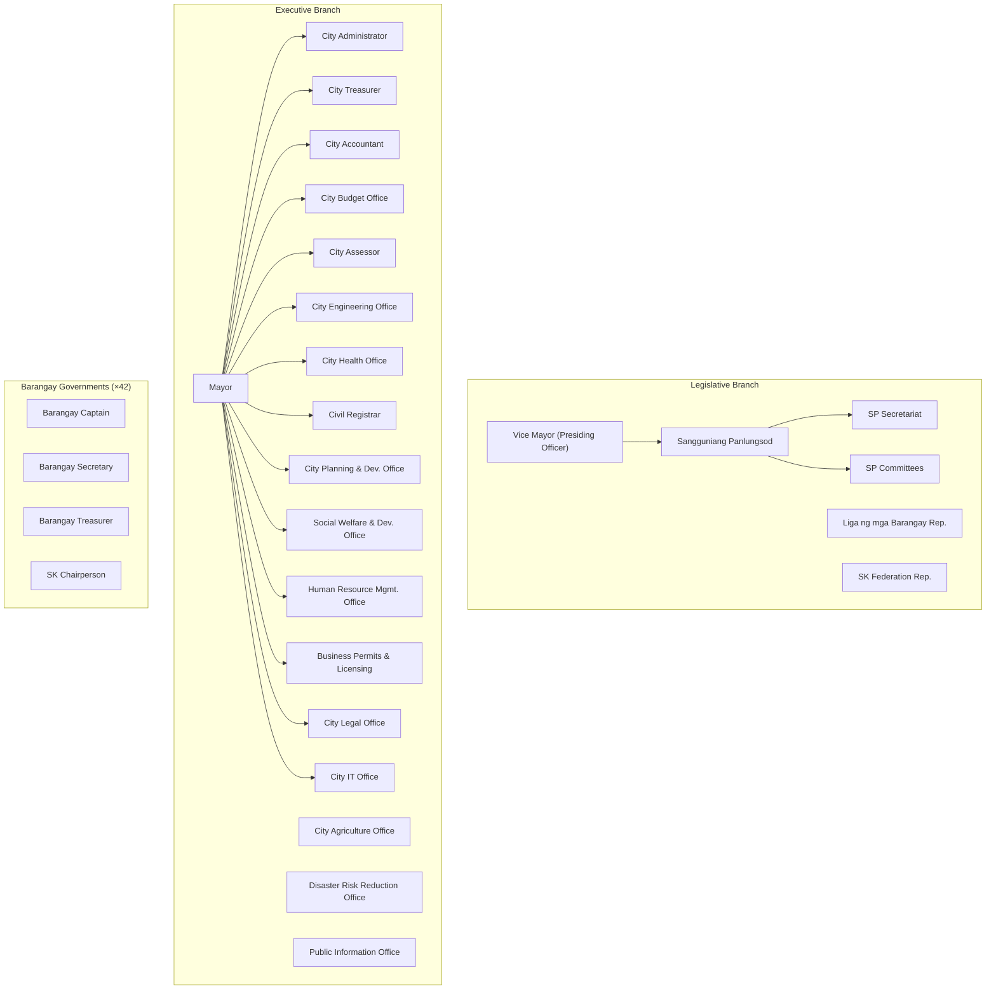

# Batac City LGU Platform — Architecture Review & Discovery

---

## Part B — Requirements Discovery Checklist (General Stakeholder Interviews)

### Process Discovery

- Walk me through the complete lifecycle of one document — from the moment it is created or received to the moment it is filed — for each major document type.
- Who initiates each type of document? Where does it physically come from?
- Who is the first person to touch it? What do they do to it?
- What happens when the assigned person is absent, on leave, or unavailable?
- Can a document be returned for revision? By whom? To whom?
- Can a document be cancelled after it has started routing? Who has authority to cancel?
- How long should each step ideally take? What happens when a step exceeds that time?
- Are there documents that can skip steps under certain conditions?

### Current Pain Points

- What is the single biggest problem with the current paper-based process?
- What documents are most frequently lost, misplaced, or significantly delayed?
- How do citizens currently check the status of their requests or complaints?
- What is the realistic current processing time for [specific document type]?
- What information do you most frequently need but cannot locate quickly?
- What tasks consume the most manual effort that should not require manual effort?

### Access and Security

- Who should be able to see each type of document?
- Are there documents that must remain confidential even from other departments?
- Should citizens be able to track their own documents in progress?
- What specifically should citizens not be able to see?
- Are there documents that are confidential even from some internal employees?

### Integration and Data Migration

- What existing software systems does the LGU currently use?
- Are there historical documents that need to be migrated into the new system? In what format do they currently exist?
- Are there reports currently produced manually in Excel that should be automated?
- Does any existing system hold data that the new platform needs?

### Legal and Compliance

- What are the legal mandated retention periods for each document type?
- Are there DILG, COA, CSC, or other regulatory requirements that affect how documents are managed or retained?
- Has the LGU designated a Data Protection Officer under RA 10173?
- Has a Privacy Impact Assessment been conducted for the new system?
- What are the ARTA-mandated processing timeframes for each service the LGU provides?

### Technical Environment

- What devices do employees use? Desktop, laptop, or mobile?
- How reliable and fast is the internet connection at each office location?
- Is there a local area network (LAN) at city hall?
- Is there backup power (UPS, generator) at critical locations?
- Who will maintain the system after it is deployed?

### Success Criteria

- How will you know the system is a success after 6 months of use?
- What would constitute a failure of this project?
- Which single feature would most immediately reduce your daily workload?

---

## Part C — Stakeholder-Specific Discovery Checklists

### Mayor

- What document-based decisions do you make on a typical working day?
- How many documents do you sign in an average week?
- What information do you require before signing a document?
- Does your staff prepare documents for your signature, or do you review them yourself from the start?
- What operational information do you wish you could see at any moment without asking staff?
- When you are traveling or unavailable, how are urgent approvals handled? Who acts?
- What is the biggest inefficiency in how government operations are currently run?
- What public-facing information should citizens be able to access through an online portal?
- Are there documents or decisions you currently cannot delegate but should be able to?

### Vice Mayor and SP Presiding Officer

- How is an SP session called and formally documented?
- What is the exact workflow of a resolution from first draft to final release?
- What differs between a resolution workflow and an ordinance workflow?
- How are committee assignments made? Is there a formal rule or is it discretionary?
- Which documents must be read aloud during session? All? Selected sections?
- How are SP session minutes prepared, reviewed, approved, and archived?
- Who has authority to release approved resolutions and ordinances?
- How are amendments and interpellations during session captured and recorded?
- What information do you need to see before calling a document for a vote?

### SP Secretary

- Describe your daily document processing routine from receiving the first document to end of day.
- How are incoming documents currently logged? Is there a logbook? An existing system?
- What is the current numbering system for resolutions and ordinances? Who controls it?
- Who is authorized to prepare the session agenda? What is the process?
- How are documents distributed to Councilors before a session? Physical copies? Email?
- What happens to documents referred to committee? How is that tracked?
- How many active documents are typically in your queue on any given day?
- What documents do you prepare repeatedly that could use a template?
- What monthly reports do you currently produce? What manual effort does that require?
- How are returned or rejected documents tracked against the original submission?

### Councilors

- How do you currently receive documents for review prior to session?
- How do you provide feedback, corrections, or proposed amendments?
- Do you access documents remotely, from home or outside city hall?
- What information do you need before voting on a document?
- How do you submit committee reports? What is the current process?
- What is the typical time window you are given to review documents before a session?

### Department Heads

- What document types does your department originate and submit to other offices?
- What document types does your department receive from other offices for action?
- Who within your department is authorized to approve documents at various levels?
- How do you currently monitor the status of documents your department has submitted?
- How do you handle incoming documents that must be distributed to multiple sub-units within your department?
- What reports are you required to submit, and how frequently?
- What is the biggest time waste in your current document and administrative process?
- What information would help you better manage your department's workload?

### Records Officers

- What is the current filing and indexing system for physical records?
- How are documents currently searched and retrieved when needed?
- What is the current retention policy for each major document type?
- Where are physical records currently stored? Are there capacity concerns?
- How are confidential records currently physically protected?
- How do you handle requests to retrieve archived documents? How long does it take on average?
- Are there COA audit requirements you currently find difficult to meet?
- How are documents disposed of when their retention period expires? Is there a formal process?
- Are there document categories that are not currently archived at all?

### Barangay Officials

- What types of documents does your barangay regularly send to city hall?
- What types of documents do you receive from city hall?
- Do you have a computer and reliable internet connection at your barangay hall?
- How do you currently track whether submitted documents have been received and acted upon?
- What is the most frustrating aspect of dealing with city hall on document matters?
- Would you access a system via a computer, a mobile phone, or both?
- Do you have staff who would manage system interactions on your behalf, or would you do it personally?

### General Employees

- What documents do you create, process, or receive on a regular basis?
- What is the most repetitive document-related task you perform?
- How do you currently know which documents are waiting for your action?
- How do you notify a colleague that a document requires their attention?
- Do you work from a single device, or do you need access from different locations or devices?
- What one change would make your daily work significantly faster?

### Citizens

- Have you ever submitted a request or complaint to city hall? Describe that experience.
- Were you able to find out the status of your submission without visiting in person?
- How did you receive the response or outcome?
- What city hall information would you want to be able to access online?
- Do you use a smartphone? Are you comfortable using a government website?
- What language would you prefer for interacting with an online city hall portal? (Filipino, English, Ilocano)
- Would you trust a city hall online portal with your personal information?

### IT Personnel

- What is the current server and network infrastructure at city hall locations?
- What is the internet connection type and measured speed at each location?
- Is there a backup power supply — UPS or generator — at critical locations?
- Who currently manages IT systems at the LGU? Is there dedicated IT staff?
- What is the IT budget allocation and approval cycle?
- Have you managed cloud deployments or containerized systems before?
- What are the biggest day-to-day IT pain points at the LGU?
- Is there a disaster recovery plan for any existing systems?
- What is the plan for supporting the system after the development team delivers it?

---

## Part D — LGU Organizational Structure and Document Flow

> `[Inference: based on RA 7160, DILG-prescribed structure, and uploaded reference material. Verify against Batac City's official organizational chart.]`



### Typical Document Flow Patterns

**Pattern 1 — Citizen Request to Mayor's Office**

```
Citizen
  → Receiving Desk (log, assign tracking number, QR label)
  → Mayor's Office (assess, route)
  → Concerned Department (action)
  → Mayor's Office (confirm completion)
  → Citizen (response)
```

**Pattern 2 — SP Resolution (Legislative)**

```
Councilor / SP Secretary (draft)
  → SP Secretary (log, assign series number)
  → Committee Assignment
  → Committee Review and Report
  → 1st Reading (SP Session)
  → Amendment phase (if any)
  → 2nd Reading (SP Session)
  → Session Vote
  → VP / Presiding Officer (certify)
  → SP Secretary (official copy, release)
  → Mayor's Office (transmit, reference copy)
  → Records (archive)
  → Public (publish if applicable)
```

**Pattern 3 — SP Ordinance (longer than Resolution)**

```
Draft
  → SP Secretary (log)
  → Committee (review, public hearing)
  → 1st Reading
  → 2nd Reading
  → 3rd Reading (final vote)
  → Vice Mayor (certify)
  → Mayor (10-day review; may veto)
  → If not vetoed: effective after publication
  → SP Secretary (archive official copy)
  → Public (mandatory publication)
```

**Pattern 4 — Executive Document (e.g., Travel Order)**

```
Employee (request)
  → Immediate Supervisor (endorse)
  → Department Head (approve)
  → Mayor's Office (approve — if required)
  → HR (record)
  → Finance (if with funding implications)
```

**Pattern 5 — Procurement / Purchase Request**

```
Requesting Office
  → Department Head (endorse)
  → Budget Office (availability of funds)
  → Accounting (pre-obligation)
  → BAC Secretariat (procurement process)
  → Award → Supplier → Delivery
  → Inspection (acceptance)
  → Accounting (disbursement)
  → COA (audit trail)
```

**Pattern 6 — Barangay to City Hall**

```
Barangay Council (passes resolution)
  → Barangay Secretary (certifies, transmits)
  → City Hall Receiving
  → SP Secretariat or Mayor's Office (depending on subject)
  → Committee or Department (action)
  → Response to Barangay
```

---

## Part E — Educated-Guess Master Lists

> All items below are `[Inference]` unless otherwise noted.

### Offices

**Executive:** Office of the Mayor, Office of the City Administrator, City Treasurer's Office, City Accountant's Office, City Budget Office, City Assessor's Office, City Engineering Office, City Health Office, City Civil Registrar's Office, City Planning and Development Office (CPDO), City Social Welfare and Development Office (CSWDO), Human Resource Management Office (HRMO), Business Permits and Licensing Office (BPLO), City Agriculture Office, Disaster Risk Reduction and Management Office (DRRMO), City Tourism Office, Public Information Office (PIO), City IT Office, City Legal Office

**Legislative:** Office of the Vice Mayor, SP Secretariat, SP Committees (Finance, Public Works, Health, Education, Peace and Order, Women and Family, Environment, Tourism, Barangay Affairs — exact composition varies)

**Barangay-level (×42):** Each Barangay Office, SK Office

**Public-facing:** Central Receiving Office, Public Assistance Desk

---

### Roles (System Roles, not Organizational Positions)

|System Role|Description|
|---|---|
|System Administrator|Full system access; no access to confidential document content|
|Platform Administrator|Workflow configuration, user management, master data|
|Records Officer|Archive management, retention, disposition|
|Department Encoder|Create and submit documents for their department|
|Department Approver|Approve documents within their office and scope|
|SP Secretary|Manage SP legislative workflow and document registry|
|SP Member|Review, comment, and vote on legislative documents|
|SP Presiding Officer|Manage sessions, certify legislative output|
|Mayor|Final executive approval authority|
|Barangay Encoder|Submit barangay documents to city hall|
|Barangay Captain|Approve and sign barangay documents|
|Citizen|Limited read-only access to public portal and own submissions|
|Auditor|Read-only access to audit logs and finalized documents|
|System Auditor|Read-only access to technical audit and security logs|

---

### Document Types (with Classification)

|Category|Document Type|Routing|Approval|Signature|Official Record|
|---|---|---|---|---|---|
|Legislative|SP Resolution|Yes|Yes|Yes|Yes|
|Legislative|SP Ordinance|Yes|Yes|Yes|Yes|
|Legislative|Committee Report|Yes|Yes|Yes|Yes|
|Legislative|Session Minutes|No|Yes|Yes|Yes|
|Legislative|Barangay Resolution|Yes|Yes|Yes|Yes|
|Executive|Executive Order|Yes|Yes|Yes|Yes|
|Executive|Memorandum Order|Yes|Yes|Yes|Yes|
|Executive|Memorandum Circular|Yes|No|Yes|Yes|
|Administrative|Internal Memorandum|Sometimes|No|Yes|No|
|Administrative|Travel Order|Yes|Yes|Yes|Yes|
|Administrative|Leave Application|Yes|Yes|No|No|
|Administrative|Job Order / Contract|Yes|Yes|Yes|Yes|
|Financial|Purchase Request|Yes|Yes|Yes|Yes|
|Financial|Purchase Order|Yes|Yes|Yes|Yes|
|Financial|Disbursement Voucher|Yes|Yes|Yes|Yes|
|Financial|Budget Request|Yes|Yes|Yes|Yes|
|Financial|Liquidation Report|Yes|Yes|Yes|Yes|
|Procurement|Request for Quotation|Yes|Yes|Yes|Yes|
|Procurement|Abstract of Bids|Yes|Yes|Yes|Yes|
|Citizen|Citizen Request|Yes|Sometimes|No|No|
|Citizen|Citizen Complaint|Yes|No|No|Sometimes|
|Citizen|Permit Application|Yes|Yes|No|Yes|
|Project|Project Proposal|Yes|Yes|Yes|Yes|
|Project|Inspection Report|No|Yes|Yes|Yes|
|Project|Accomplishment Report|No|Yes|Yes|Yes|
|Meeting|Session Agenda|No|Yes|Yes|No|
|Meeting|Attendance Sheet|No|No|Yes|Yes|

---

### Core Workflows (`[Inference]`)

1. **SP Resolution:** Draft → Secretary Review → Committee Assignment → Committee Report → 1st Reading → Amendment → 2nd Reading → Vote → VP Certify → Secretary Release → Archive
2. **SP Ordinance:** Draft → Secretary Review → Committee → 1st Reading → Public Hearing → 2nd Reading → 3rd Reading → Vote → VP Certify → Mayor Review (10-day) → Sign/Veto → Publication → Implementation → Archive
3. **Executive Order:** Draft (Mayor's Office) → Legal Review → Mayor Approve and Sign → Release → Archive
4. **Travel Order:** Employee → Supervisor Endorse → Department Head Approve → Mayor Approve → HR Record → Travel
5. **Purchase Request:** Requesting Office → Department Head → Budget Officer → Accounting → BAC Secretariat → Procurement
6. **Citizen Request:** Submit → Receive and Log → Mayor's Office → Department Assignment → Action → Response → Close
7. **Complaint:** Submit → Receive and Log → Appropriate Office → Investigation → Findings → Resolution → Notify Complainant → Archive
8. **Barangay Resolution:** Barangay submit → City Hall Receive → Route to SP or Mayor → Action → Response

---

### Approvals Matrix (`[Inference]`)

|Document|Step 1|Step 2|Step 3|Final Authority|
|---|---|---|---|---|
|SP Resolution|Committee|SP Session Vote|VP Certify|SP Secretary Release|
|SP Ordinance|Committee|SP Vote|VP Certify|Mayor Review/Sign|
|Travel Order|Supervisor|Department Head|Mayor|—|
|Purchase Request|Department Head|Budget Office|Accounting|Mayor (above threshold)|
|Leave Application|Supervisor|Department Head|HRMO|—|
|Executive Order|Legal Office|Mayor|—|—|
|Citizen Request|Receiving|Department|Mayor (if required)|—|
|Citizen Complaint|Receiving|Investigator|Office Head|—|

---

### Reports

**Operational:** Documents pending by office, documents pending by employee, overdue documents by SLA breach age, daily received count, average processing time per document type, average processing time per office

**Legislative:** Resolutions approved by period, ordinances approved by period, SP session summary, committee activity by period

**Citizen Services:** Requests received / resolved / pending, complaint resolution rate, average complaint resolution time, ARTA compliance rate per service type

**Management:** City-wide document throughput, office performance comparison, document backlog trend, SLA compliance rate

**Records Management:** Documents approaching retention expiry, archived document count by category, storage utilization

---

### KPIs (`[Inference]` — validate with LGU before finalizing)

|KPI|Indicative Target|Owner|
|---|---|---|
|Simple transaction processing time|≤ 3 working days (ARTA)|All Offices|
|Complex transaction processing time|≤ 7 working days (ARTA)|All Offices|
|SLA breach rate|< 5% of active documents|City Administrator|
|Citizen request resolution rate|> 90%|All Departments|
|Document backlog (pending > 7 days)|< 10% of active|Department Heads|
|System uptime|> 99.5%|IT|
|Workflow completion rate|> 95%|Records Officer|

---

### Dashboards

**Mayor's Dashboard:** Items requiring signature today, documents overdue across all departments, citizen request summary (submitted / resolved / pending), department workload overview

**SP Secretary's Dashboard:** Session calendar, documents scheduled for next session, documents currently in committee, recent approvals log, monthly legislative output summary

**Department Head Dashboard:** Department inbox (items awaiting action), overdue items, team workload by person

**Records Officer Dashboard:** Archive queue, retention expiry alerts (next 30 / 60 / 90 days), storage utilization

**Citizen Portal Dashboard:** My submitted requests (with status), my complaint status, public document library, announcements

**System Administrator Dashboard:** User activity log, failed login attempts, storage utilization, system health indicators

---

## Part F — Architecture Recommendation

### Recommended Pattern: Modular Monolith with Internal Event Bus

**Rationale:**

Microservices at 100–250 users is an operational anti-pattern for a 4-person team. The distributed systems overhead — service discovery, inter-service authentication, distributed tracing, independent deployment pipelines — provides no benefit at this scale and introduces failure modes that a small team cannot manage reliably.

A modular monolith gives you clean domain separation, independent module evolution, and a clear extraction path to services if the system grows beyond what a monolith can serve. The internal event bus decouples modules without distributed systems overhead.

```
┌──────────────────────────────────────────────────────────────────┐
│                     Batac LGU Platform                           │
│                                                                  │
│  ┌──────────────┐  ┌──────────────┐  ┌──────────────────────┐   │
│  │  Identity &  │  │ Organization │  │    Document Core     │   │
│  │    Access    │  │  & Org Chart │  │    (DMS + Storage)   │   │
│  └──────────────┘  └──────────────┘  └──────────────────────┘   │
│  ┌──────────────┐  ┌──────────────┐  ┌──────────────────────┐   │
│  │   Workflow   │  │  Document    │  │      Records         │   │
│  │   Engine     │  │  Tracking    │  │   Management (RMS)   │   │
│  └──────────────┘  └──────────────┘  └──────────────────────┘   │
│  ┌──────────────┐  ┌──────────────┐  ┌──────────────────────┐   │
│  │ Notifications│  │    Search    │  │      Reporting       │   │
│  └──────────────┘  └──────────────┘  └──────────────────────┘   │
│  ┌──────────────┐  ┌─────────────────────────────────────────┐  │
│  │ Audit Log    │  │     Government Portal (Public API)      │  │
│  │ (append-only)│  └─────────────────────────────────────────┘  │
│  └──────────────┘                                                │
│                                                                  │
│                   Internal Event Bus (in-process)                │
└──────────────────────────────────────────────────────────────────┘
         │                    │                    │
   PostgreSQL           S3-compatible         Meilisearch
   (schema-per-module)  Object Storage        (Search)
```

**Architectural laws for this system:**

1. Each module owns its own PostgreSQL schema. No module reads another module's schema directly. Cross-module data access goes through published APIs or events.
2. Modules communicate through the internal event bus, not direct method calls across module boundaries.
3. No shared mutable state between modules.
4. The audit log schema is append-only. The application database user for the audit log has INSERT permission only.
5. All file references in the database are storage keys (UUIDs), never file paths or original filenames.
6. All infrastructure is defined in code. No manual cloud resource creation.

---

## Part H — Module and Domain Boundaries

```
┌──────────────────────────────────────────────────────────────────┐
│ IAM — Identity & Access Management                               │
│   User, UserCredential, Session, RefreshToken, Role, Permission  │
│   Owns: authentication, authorization primitives, MFA            │
│   Events out: UserCreated, UserRoleChanged, SessionStarted       │
└──────────────────────────────────────────────────────────────────┘
┌──────────────────────────────────────────────────────────────────┐
│ ORGANIZATION                                                     │
│   Office, Position, Employee, Assignment, OfficeDelegation       │
│   Owns: org chart, position hierarchy, acting capacity           │
│   Events out: OfficeCreated, EmployeeAssigned, DelegationGranted │
└──────────────────────────────────────────────────────────────────┘
┌──────────────────────────────────────────────────────────────────┐
│ DOCUMENT CORE (DMS)                                              │
│   DocumentType, Document, Attachment, Version, DocumentNumber,   │
│   SignatureRecord, DocumentMetadata                              │
│   Owns: storage refs, classification, versioning, numbering      │
│   Events out: DocumentCreated, DocumentSubmitted, NumberAssigned │
└──────────────────────────────────────────────────────────────────┘
┌──────────────────────────────────────────────────────────────────┐
│ WORKFLOW ENGINE                                                  │
│   WorkflowDefinition, WorkflowVersion, WorkflowStep,            │
│   WorkflowInstance, StepInstance, WorkflowEvent                  │
│   Owns: process definitions, instance execution, SLA tracking    │
│   Events out: StepAssigned, StepCompleted, StepOverdue,          │
│              InstanceCompleted, InstanceCancelled                │
└──────────────────────────────────────────────────────────────────┘
┌──────────────────────────────────────────────────────────────────┐
│ DOCUMENT TRACKING (DTS)                                          │
│   TrackingRecord, RoutingEntry, QRCode, PhysicalCustody          │
│   Owns: movement audit trail, QR generation and lookup           │
│   Events out: DocumentReceived, DocumentForwarded, QRScanned     │
└──────────────────────────────────────────────────────────────────┘
┌──────────────────────────────────────────────────────────────────┐
│ RECORDS MANAGEMENT (RMS)                                         │
│   Record, RetentionSchedule, ArchiveEntry, Classification        │
│   Owns: long-term preservation rules, COA compliance             │
│   Events out: DocumentArchived, RetentionExpired                 │
└──────────────────────────────────────────────────────────────────┘
┌──────────────────────────────────────────────────────────────────┐
│ NOTIFICATIONS                                                    │
│   NotificationTemplate, NotificationEvent, DeliveryLog          │
│   Owns: notification routing, template rendering, delivery       │
│   Events in: all domain events that trigger notifications        │
└──────────────────────────────────────────────────────────────────┘
┌──────────────────────────────────────────────────────────────────┐
│ AUDIT LOG (separate from application data)                       │
│   AuditEvent (append-only, hash-chained)                         │
│   Owns: tamper-evident record of all system actions              │
│   Events in: all modules write via audit service only            │
└──────────────────────────────────────────────────────────────────┘
┌──────────────────────────────────────────────────────────────────┐
│ SEARCH                                                           │
│   SearchIndex, SearchQuery                                       │
│   Owns: search index management, query routing                   │
└──────────────────────────────────────────────────────────────────┘
┌──────────────────────────────────────────────────────────────────┐
│ PORTAL (Government Portal + Public API)                          │
│   PublicDocument, CitizenRequest, CitizenComplaint,              │
│   TrackingLookup, PublicAnnouncement                             │
│   Owns: public-facing interface, citizen interactions            │
└──────────────────────────────────────────────────────────────────┘
┌──────────────────────────────────────────────────────────────────┐
│ REPORTING                                                        │
│   ReportDefinition, ReportSchedule, ReportOutput                │
│   Owns: report configuration, generation, scheduling, export     │
└──────────────────────────────────────────────────────────────────┘
```

**Cross-cutting concerns** (infrastructure, not bounded contexts):

- ABAC policy enforcement (called by all modules, owned by IAM)
- Audit write service (called by all modules, writes to audit schema)
- Internal event bus (in-process, no network hop)
- File storage abstraction (S3 interface, implementation swappable)

---

## Part I — Roadmap

### Phase 1 — Foundation (Months 1–6)

**Goal:** Core platform that is demonstrably useful for the SP Secretariat and Mayor's Office. Prove value with the highest-priority stakeholders before expanding.

**Deliverables:**

- IAM module (users, roles, login, session management, refresh token rotation)
- Organization master data (offices, positions, assignments)
- Document Core (upload, classify, version, basic metadata, document numbering for SP series)
- Workflow Engine (admin-configurable; linear workflows with simple branching and rejection paths)
- Document Tracking (QR generation, cover sheet printing, scan-to-lookup, routing history)
- In-app notifications
- SP Resolution and SP Ordinance workflows (highest-priority per stakeholder analysis)
- Dashboards: Mayor, SP Secretary, Department Head
- Audit log foundation
- PostgreSQL with schema isolation
- S3-compatible file storage
- Docker-based deployment with Terraform IaC
- Automated database backup

**Not in Phase 1:** Citizen portal, records management, email notifications, advanced reporting, barangay access, procurement workflows.

---

### Phase 2 — Executive Branch Expansion (Months 7–12)

**Goal:** All executive branch departments using the system for inter-office routing.

**Deliverables:**

- Full Department Head and Employee workflow access
- Travel Order, Purchase Request, Memorandum, and Leave workflows
- Email notification integration
- Meilisearch integration (full-text search across documents)
- Records Management module (retention schedules, archive, disposition)
- ARTA SLA tracking and compliance reports
- Enhanced ABAC policies (office-scoped document access)
- MFA (TOTP) for Mayor, Department Heads, SP Secretary
- Operational reporting (pending, overdue, processing time)

---

### Phase 3 — Citizen Portal (Months 13–18)

**Goal:** Public access. Citizen service digitization. Transparency compliance.

**Deliverables:**

- Public portal (document status lookup by tracking number, public resolutions and ordinances library)
- Citizen request submission and tracking
- Citizen complaint submission and tracking
- SMS notification channel for citizen status updates
- ARTA compliance dashboard and reporting
- Barangay official portal access (submit documents, track submissions)
- Advanced reporting and executive dashboards
- Data Privacy Act compliance features (consent capture, data subject request handling)

---

### Phase 4 — Intelligence and Optimization (Months 19–30)

**Goal:** The system becomes operationally indispensable. Analytical capability.

**Deliverables:**

- Advanced KPI dashboards and trend analytics
- Workflow bottleneck detection and performance analytics
- Document template engine
- Bulk records operations for Records Officers
- OCR integration for scanned document content search
- Configurable report builder (admin-configurable report definitions)
- Electronic signature infrastructure (signing ceremony abstraction, certificate placeholder)
- Delegation and acting-capacity management in workflow engine
- Configurable SLA thresholds and escalation rules

---

### Phase 5 — Platform and Integration (Months 31+)

**Goal:** Integration hub. Future-proofing for 10-year horizon.

**Deliverables:**

- Public REST API layer (for integration with external systems)
- HRIS and Payroll integration interface
- Procurement system integration interface
- Electronic signature implementation (if legally enabled and PKI infrastructure is available)
- PhilSys citizen identity integration (if nationally available and stable)
- Multi-LGU capability (if decision is made to expand beyond Batac)
- On-premise deployment documentation and migration tooling

---

## Part J — Core Entities, Aggregates, Events, Permissions

### Aggregate Roots

|Bounded Context|Aggregate Root|Key Child Entities|
|---|---|---|
|IAM|User|UserCredential, Session, MFARecord|
|Organization|Office|Position, OfficeMember|
|Organization|Employee|Assignment, DelegationRecord|
|Document Core|Document|Attachment, Version, SignatureRecord, DocumentNumber|
|Document Core|DocumentType|MetadataFieldDefinition|
|Workflow|WorkflowDefinition|WorkflowVersion, WorkflowStep, TransitionRule|
|Workflow|WorkflowInstance|StepInstance, WorkflowTimer, WorkflowEvent|
|Tracking|TrackingRecord|RoutingEntry, QRCode|
|Records|Record|RetentionSchedule, ArchiveEntry|
|Portal|CitizenRequest|RequestDocument, RequestStatusEntry|

---

### Domain Events (selected)

**Document:** `DocumentCreated`, `DocumentSubmitted`, `DocumentVersionUploaded`, `DocumentNumberAssigned`, `DocumentRetracted`

**Workflow:** `WorkflowInstanceStarted`, `WorkflowStepAssigned`, `WorkflowStepCompleted`, `WorkflowStepRejected`, `WorkflowStepReturnedForRevision`, `WorkflowStepOverdue`, `WorkflowStepEscalated`, `WorkflowInstanceCompleted`, `WorkflowInstanceCancelled`, `WorkflowDefinitionPublished`, `WorkflowDefinitionDeprecated`

**Tracking:** `DocumentReceivedAtOffice`, `DocumentForwardedToOffice`, `DocumentQRScanned`, `DocumentPhysicalCustodyTransferred`

**Records:** `DocumentArchivedAsRecord`, `RetentionScheduleAssigned`, `RecordRetentionExpired`, `RecordDispositionAuthorized`

**IAM:** `UserCreated`, `PasswordChanged`, `RoleAssigned`, `RoleRevoked`, `SessionStarted`, `SessionTerminated`, `LoginFailed`, `AccountLocked`, `MFAEnrolled`

**Portal:** `CitizenRequestSubmitted`, `CitizenRequestStatusUpdated`, `PublicDocumentPublished`, `CitizenComplaintSubmitted`

---

### Permission Model (Three Tiers)

**Tier 1 — System-level (hardcoded, developer-only change)**

- Audit log read access
- Backup and restore operations
- Schema migrations
- Encryption key management

**Tier 2 — Platform-level (Platform Administrator, no developer required)**

- Role definitions and permission assignments
- Workflow definitions (create, version, publish, deprecate)
- Document type definitions and metadata schemas
- Office hierarchy management
- Notification template management
- Retention schedule management
- SLA threshold configuration
- Document numbering series configuration
- Report definition configuration

**Tier 3 — Instance-level (resolved at runtime per document/workflow state)**

- Based on current workflow step assignee (only the current step actor may act)
- Based on document owning office (office members may view their own office's documents)
- Based on document classification (confidential documents: restricted to explicit allowlist)
- Based on explicit document share grants (future)

**ABAC policy examples:**

```
Policy: ApproveWorkflowStep
  ALLOW IF:
    user.is_active = true
    AND current_step.required_role IN user.roles
    AND current_step.instance_id = workflow_instance.id
    AND (step.office_restricted = false OR user.office_id = document.owning_office_id)

Policy: ViewDocument
  ALLOW IF:
    document.classification = 'public'
    OR user.office_id = document.owning_office_id
    OR 'records_officer' IN user.roles
    OR 'auditor' IN user.roles
    OR user.id IN document.explicit_share_list
    OR user.id IN workflow_instance.all_step_assignees
```

---

## Part K — Extensibility Tiers

### User-Configurable (no admin approval required)

- Notification preferences (which events trigger in-app vs. email vs. SMS)
- Dashboard layout and widget arrangement
- Saved search filters and personal document views
- Display preferences (date format, items per page, timezone)

### Administrator-Configurable (no developer involvement required)

- All workflow definitions and their step configurations
- Document type definitions and their JSONB metadata schemas
- Office hierarchy: add, modify, deactivate offices and positions
- Role definitions and permission assignments
- Notification templates (message text for each event type and channel)
- Retention schedules per document type
- SLA thresholds per document type and workflow step
- Escalation targets for overdue steps
- Report definitions (columns, filters, visibility by office)
- Document numbering series (format, prefix, starting sequence)
- Which document types and which fields are publicly visible
- System-wide announcements

### Developer-Only (code change + deployment required)

- New bounded context modules
- New domain event types
- Changes to the audit log schema
- New authentication provider integration
- New file storage provider
- ABAC policy engine changes
- Database schema migrations
- New notification delivery channels (code integration with SMS provider, etc.)
- External API gateway creation
- Infrastructure changes

---

## Part L — Configurable vs. Hardcoded

### Must Be Configurable

All workflow definitions and step types, document types and their metadata schemas (JSONB), office hierarchy and position assignments, role definitions and permission assignments, SLA thresholds and escalation rules, notification templates and routing rules, retention schedules, document numbering series format, public visibility of document types and fields.

### Must Be Hardcoded (by architectural design)

- The audit log is append-only. This is not a setting. It is enforced at the database permission level.
- Documents cannot be permanently deleted by any user or administrator. Only disposition via authorized records management process is permitted.
- The hash-chaining mechanism for audit log integrity is not configurable.
- The module boundary definitions (which data belongs to which bounded context) are architectural decisions, not configuration.
- The fact that a workflow instance pins to its definition version at creation time is not configurable.

### Start Hardcoded — Design for Future Configurability

- Notification delivery channels: start with in-app only; design the `NotificationChannel` interface so SMS and email providers can be added without core changes
- Report output formats: start with PDF and CSV; design the `ReportRenderer` interface for extensibility
- Search ranking and relevance tuning: start with Meilisearch defaults; expose tuning parameters later

---

## Part M — Design Now vs. Postpone

### Design and Build Now (foundations that cannot be retrofitted)

**Module schema boundaries.** If modules share tables from the start, you cannot enforce boundaries later without a full database migration.

**Audit log architecture.** You cannot retrofit tamper-evident, non-repudiation-grade audit logging into an existing system. The schema, the database permission model, and the checksum-chaining must exist from day one.

**Workflow versioning and instance pinning.** In-flight documents will exist from your first day of real use. If you haven't designed how version pinning works before the first workflow is deployed, your first version change will corrupt in-flight instances.

**File storage abstraction.** Once you have thousands of documents stored using a provider-specific API, migrating to MinIO for on-premise deployment means migrating every file. If you use the S3-compatible interface exclusively from day one, the migration is a configuration change.

**Soft-delete and archive everywhere.** Retrofitting no-deletion across an existing schema requires touching every table in the database. Do it in the initial migration.

**Infrastructure as code.** Every manual infrastructure action is a dependency you cannot reproduce during the on-premise migration.

**Document number sequence management.** Once resolutions are issued with ad hoc numbers, correcting the sequence requires manual data correction of official government records.

### Design the Interface Now, Implement Later

**Electronic signatures:** Define the `SignatureRecord` entity and the `SigningCeremony` abstraction now. Implement the PKI backend later. The interface does not change; only the implementation behind it does.

**Multi-tenancy:** Design at the schema level for tenant isolation now (even if only one tenant exists). Add tenant routing and provisioning in Phase 5 if needed.

**MFA:** Design the authentication flow to accept a second-factor response from day one. Implement TOTP in Phase 2.

**Public portal data boundary:** Design all internal APIs with a `visibility: internal | public` distinction from day one. Build the portal frontend in Phase 3.

**External API gateway:** Design all module APIs as if they could eventually be exposed externally. Implement the API gateway in Phase 5.

### Consciously Postpone

- Full BPMN visual workflow editor (drag-and-drop): start with form-based step configuration
- OCR for scanned document content search: Phase 4
- SMS notifications: design the channel abstraction in Phase 1; implement the provider in Phase 3
- Advanced analytical data warehouse: Phase 4
- PhilSys integration: Phase 5
- Multi-LGU deployment: Phase 5
- Native mobile app: after the web application is stable and adopted

---

# RESOLVED DECISIONS

### 1.1 Authentication & Non-Repudiation

**Digital Signature Approach**

- **Decision**: Accept scanned signature limitation with explicit organizational acceptance
- **Implementation**:
    - Scanned signature images stored with audit trail
    - Physical originals retained as legal source of truth
    - LGU documents, in writing, that scanned signatures provide authentication but not cryptographic non-repudiation
    - Signature contests cannot be cryptographically refuted
    - Digital copy is operational truth; physical original is legal truth
- **QR Code Integration**: Printed documents include QR codes pointing to digital records
- **Timeline**: Phase 1 deployment; post-Phase-1 upgrade path kept open
- **LGU Sign-Off**: Both IT Director and Mayor sign the written acceptance (before Phase 1 start)

**Authentication Flow**

- **Decision**: Implement MFA from day one
- **Status**: Design accommodates second factor (TOTP) even if not enabled initially
- **Rationale**: Retrofitting MFA into legacy system is painful; must be designed in upfront
- **Note**: Scanned signature uploads require elevated authentication (MFA preferred)

---

### 1.2 Infrastructure & Cloud Agnosticism

**Cloud-Agnostic Architecture**

- **Decision**: All architecture is cloud-agnostic from day one
- **Rationale**: LGU migration to on-premise infrastructure is near-certainty within 10+ year lifespan
- **Scope**: Avoid cloud-specific services; design for portability
- **Implication**: Migration debt is unacceptable; containerization and vendor-neutral APIs required
- **Codebase Focus**: Batac-specific (not templated for other LGUs)
- **Configuration Files**: Documented for potential future adaptation (if another LGU adopts)
- **Database Schema**: Batac-specific; no generalized LGU-agnostic fields required

---

### 1.3 Admin-Configurable Workflows

**Workflow Versioning & In-Flight Migration**

- **Decision**: Admin chooses between two migration strategies for each version change
    - **Option A (Safer)**: Continue under old version (safest, most auditable)
    - **Option B (Operational)**: Manual migration by administrator (operationally complex)
- **Constraint**: Parallel workflow steps **NOT** included (simplification)
- **Note**: This is the single most complex requirement (25–30% of Phase 1 engineering time)
- **Implementation**: Flexible, modular design to accommodate requirements gathered next week

**Workflow Capabilities**

- Branching and merging (but NOT parallel steps)
- Loop-back capability
- Versioning with controlled migration
- Configuration by authorized administrators without developer involvement

**Architectural Governance**

- Architecture Decision Records (ADRs) required
- Module boundary enforcement mandatory
- Automated coupling tests required
- Governance stricter than team size due to heavy AI assistance (4 developers)

---

### 1.4 Data Handling & Record Management

**Deletion vs. Archiving vs. Data Privacy Act**

**Policy**: No deletion; archiving and retention policies preferred

**Legal Exception Process**:

- Defined exception for RA 10173 (Data Privacy Act) erasure requests
- Requires legal review before erasure
- Erasure is separate from archiving—not a simple state change

**Implementation**:

```
┌─────────────────────────────────┐
│ Citizen Erasure Request Received │
└────────────┬────────────────────┘
             ↓
┌─────────────────────────────────┐
│ Legal Review (DPA Officer)       │
│ - Validate request legitimacy    │
│ - Check retention requirements   │
│ - Verify no legal hold           │
└────────────┬────────────────────┘
             ↓
    ┌────────┴────────┐
    ↓                 ↓
┌────────────┐  ┌────────────────┐
│ APPROVED   │  │ REJECTED       │
│ Erasure    │  │ Notify citizen │
│ (PII only) │  │ with reason    │
└────────────┘  └────────────────┘
```

**Scope**: Sensitive PII in complaints and requests only; administrative/workflow records archived

---

### 1.5 Concurrent Modification

**Locking Strategy**: Pessimistic locking

- **Rationale**: Government users have low tolerance for "document modified" conflicts
- **UX Requirement**: Informational notice required when document is locked by another user
- **Benefit**: Prevents conflicts rather than surfacing them after the fact

---

### 1.6 Compliance Frameworks (Legal)

**RA 11032 — Ease of Doing Business (ARTA)**

- Simple transactions: 3 working days
- Complex transactions: 7 working days
- Highly technical: 20 working days
- **Implication**: SLA tracking and compliance reporting built into system (legal requirement, not optional)

**RA 9184 — Government Procurement Reform Act**

- Procurement documents have legal transparency, publication, and record-keeping requirements
- **System enforcement required** (not just facilitation)

**RA 10173 — Data Privacy Act of 2012**

- Privacy Impact Assessment (PIA) before launch
- Data Protection Officer designation required
- Privacy Notice at point of data collection
- Data subject rights handling (access, correction, erasure)
- Breach notification within 72 hours
- **Phase**: Include in scope; implement in later development phases (not Phase 1)

**COA Circular Requirements**

- [Unverified: Specific COA circulars applicable to Batac City were not confirmed]
- **Action**: Engage COA early for financial/procurement document requirements

---

### 1.7 Special Scenarios

**Election-Cycle Staff Turnover (every 3 years)**

**System capabilities required**:

- Bulk role reassignment
- Document continuity across administrations
- Preservation of outgoing officials' signed actions as immutable records
- Onboarding procedures for entirely new leadership
- **Formal "administration transition" procedure** to prevent post-election chaos

**Offline & Intermittent Connectivity**

**Connectivity Profile — RESOLVED**:

- **Typical Condition**: Always-on (city hall has internet with backup generator)
- **Outage Tolerance**: Can tolerate 30+ minute outages
- **Barangay Locations**: Some have reliable internet, some do not
- **Offline Behavior**: Hybrid mode with graceful degradation (as designed below)

**Defined Behavior During Loss of Connectivity**:

- **Principle**: ARTA compliance cannot depend on internet availability
- **Approach**: Hybrid mode with graceful degradation
    
    ```
    ONLINE MODE (Normal)├─ Full workflow execution├─ Real-time SLA tracking└─ Immediate notificationsOFFLINE MODE (Connectivity Lost)├─ Local queue for document submissions├─ SLA clock continues (legal requirement)├─ Critical approvals cached locally with fallback auth└─ Sync on reconnection with conflict resolutionRECONNECTION├─ Local queue auto-submits├─ Conflicts flagged for manual review└─ Audit trail marks offline period
    ```
    
- **Barangay Focus**: Offline-capable for barangays with intermittent connectivity

**Document Number Sequencing — RESOLVED**

**Approach**: Centrally managed gapless sequential numbering per document series

**Implementation**:

- Each document series has a central sequence lock
- Numbers assigned only at final approval (not at draft or creation)
- Cancelled documents mark a gap with cancellation reason (logged)
- Database constraint prevents duplicate numbers within same series + year
- Distributed lock mechanism ensures no simultaneous duplicates
- **Audit Trail**: Every gap recorded with cancellation reason

**Year Prefix Strategy — RESOLVED**:

- **Decision**: Implement both options; make selectable per document series
    - **Option A**: Per-year numbering (Resolution 2026-001, 2027-001, etc.)
    - **Option B**: Continuous numbering (Resolution 1, 2, 3, ... across all years)
- **Reason**: Flexibility; allows different series to use different schemes

**Example**:

```
Resolution 2026-001 → Approved → Numbered
Resolution 2026-002 → Draft (no number yet)
Resolution 2026-003 → Cancelled (gap recorded with reason)
Resolution 2026-004 → Approved → Numbered
```

**Physical-to-Digital Correspondence — RESOLVED**

**Feature**: Scanned-Back Document Anomaly Flagging

- When a physical document is printed, signed with wet ink, and scanned back:
    - System flags scanned image for manual verification
    - Anomaly detection checks for signs of alteration between print and scan
    - Records officer manually verifies authenticity
    - Verification status attached to digital record
    - Unverified physical copies cannot be accepted as official

**Workflow**:

```
Digital Doc → Print → Wet-Ink Sign → Scan Back
                                        ↓
                            Flag for Manual Review
                                        ↓
                            Records Officer Verifies:
                            - Visual integrity
                            - Signature authenticity
                            - No alterations detected
                                        ↓
                            ✓ Verified → Accepted
                            ✗ Anomaly → Returned for clarification
```

---

### 1.8 Mobile Access — RESOLVED

**Decision**: Mobile-first approach prioritized

- **Rationale**: Most users access via personal mobile phones
- **OS Support**: Both iOS and Android
- **Offline Capability**: Provide offline capability where feasible
- **Device Types**: Windows 11 at Batac City Hall; personal phones for barangay staff
- **Implication**: Responsive design, mobile-native where possible, simplified workflows for small screens
- **Session Refresh**: On app open, refresh session (not during active use)

---

### 1.9 Document Management Features — RESOLVED

**Print Output & QR/Barcode Cover Sheet Generation**

- **QR Code Content**: Encodes unique document ID (independent, not full URL)
- **Metadata on Cover Sheet**: Author, date, approvers, retention schedule
- **Layout**: Separate cover page (not overlaid)
- **Customization**: Customizable metadata fields per document type
- **Implementation**: Generate automatically on print

**Bulk Operations for Records Officers — RESOLVED**

- **Approved Operations**: Bulk archive, bulk search, bulk export
- **Safety Guards**:
    - Confirmation dialog before bulk action (required)
    - Dry-run preview (required)
    - Undo feature (defer to post-Phase-1)
- **Sensitivity Level Filtering**: Bulk exports limited by sensitivity level (not all PII exportable)
- **Audit Trail**: Log each item individually (not batch-level)
- **Restriction**: No bulk-delete operations allowed (archive only)

**Email as Document Intake Channel — PARTIALLY RESOLVED**

- **Approach**: For now, forgo automatic email monitoring
- **Submission Method**: Document must be submitted via official page/route/feature (manual upload by records officer)
- **Future Phase**: Email intake automated in future phases
- **Email Attachments**: Virus scanning policy to be determined (design placeholder)
- **Citizen Complaints**: Not via email initially; dedicated complaint page for Phase 1
- **Email Metadata**: To be determined

**Data Export & Portability — RESOLVED**

- **Format Support**: All formats if possible; phased implementation if necessary
    - CSV, JSON, XML (priority)
    - SQL dump, PDF (secondary)
- **Audit Trails**: Included as optional export field
- **Document Formats**: Exportable in original format (PDF) or converted format (user choice)
- **Selection**: Admin defines which document types are exportable vs. confidential
- **Sensitivity Level Control**: Follows document classification levels; confidential docs non-exportable
- **Security**: Audit log records who exported, when, and what (for compliance)

---

### 1.10 Document Classification & Sensitivity — RESOLVED

**Decision**: Implement document classification system

- **Classification Levels**: [To be defined with LGU legal/security guidance]
- **Likely Categories**:
    - Public (printed council resolutions, agendas)
    - Internal (inter-department memos, drafts)
    - Confidential (citizen complaints with PII, performance reviews)
    - Restricted (fiscal records, legal opinions)
- **Access Control**: Classification drives visibility rules and export permissions
- **Default Classification**: Per document type (configurable)

---

### 1.11 System Administrator Data Separation — RESOLVED

**Decision**: IT admin must NOT have read access to confidential documents

**Implementation Approach**:

```
DATABASE LAYER
├─ Role-based access control (RBAC) at query level
├─ Encryption at rest for confidential documents
├─ Field-level encryption for PII
└─ Separate admin-audit schema (admin changes logged, not readable by IT)

APPLICATION LAYER
├─ IT admin role excluded from all data read operations
├─ IT admin can manage users, roles, schema—not data
├─ All admin activities logged to tamper-evident audit trail
└─ Separate privilege escalation approval required

CREDENTIAL SEPARATION
├─ Database credentials for app runtime ≠ database credentials for IT admin
├─ IT admin accesses via separate privileged account with limited schema access
├─ No shared passwords between app and admin roles
└─ MFA required for admin database access
```

**Security Note**: This assumes IT admin is trusted to not execute arbitrary SQL; if not trusted, add database activity monitoring (DAM) layer.

---

### 1.12 Session Management Policy — RESOLVED

**Decision**: Hardened session management with role-based variations

- **Standard Timeout Duration**: 30 minutes of inactivity
    - Warning at 25 minutes
    - Automatic logout + return to login screen at 30 minutes
- **High-Level Admin Timeout**: Longer duration (determined by architect based on best practices)
- **Concurrent Login Restrictions**: One active session per user
    - New login from different IP/device logs out previous session
    - Notification sent to user: "Your session was ended (logged in from X device)"
- **Forced Logout**: Manual session termination by user or admin
    - IT/security admin can force logout for security incident response
    - Logs recorded with reason
- **Mobile App Behavior**: Session refreshed on app open (not during active use)
- **Service Accounts**: Exempt from timeout with approval + monitoring

---

### 1.13 SLA Thresholds per Document Type — RESOLVED

**Decision**: Implement ARTA-aligned SLA tracking with educated defaults

**Thresholds**:

```
SIMPLE TRANSACTIONS (3 working days)
├─ Routine requests (ID renewal, permit inquiry)
├─ Status updates on public records
└─ Simple approvals (single-step)

COMPLEX TRANSACTIONS (7 working days)
├─ Multi-step approvals (2–3 approvers)
├─ Requires external coordination (other departments)
├─ Needs public notice/consultation
└─ Financial transactions < threshold

HIGHLY TECHNICAL (20 working days)
├─ Engineering evaluations
├─ Procurement evaluations (COA-required)
├─ Environmental impact assessments
└─ Legal review items
```

**System Enforcement**:

- SLA clock starts at workflow initiation
- Escalation warnings at 80% of SLA time
- Automatic escalation at SLA breach (notify supervisor + records officer)
- SLA data included in compliance reports
- [Unverified: Specific SLA thresholds per Batac City document type require LGU confirmation during Phase 1]

---

### 1.14 Retention Schedules per Document Type — RESOLVED (Educated Defaults)

**Policy Framework**: Implemented with educated defaults; to be refined with COA/DILG/LGU guidance

**General Approach**:

```
PERMANENT RETENTION
├─ Council resolutions
├─ Signed contracts
├─ Financial records (per COA requirements)
└─ Audit/investigation files

10–15 YEARS
├─ Personnel records
├─ Correspondence with citizens
└─ Permit/license files

5 YEARS
├─ Internal memos
├─ Meeting minutes (non-critical)
└─ Administrative notices

1 YEAR
├─ Routine workflow logs (not audit logs)
├─ Draft versions (final approved kept)
└─ Temporary administrative notes
```

**Implementation**:

- Each document type tagged with retention schedule at creation
- Automated archival review triggered at 80% of retention period
- Automatic archival at 100% (with PIA compliance check)
- No automatic deletion (archival is separate)
- [Note: Specific retention periods will be confirmed with COA/DILG and LGU sign-off during Phase 1]

---

### 1.15 Delegation & Acting Authority — RESOLVED

**Decision**: System handles delegated approval authority

**Scope Tracked**:

- **Who**: Specific user can delegate to specific user(s)
- **What**: Specific document types only (not all approvals)
- **When**: Time period (start date–end date) with auto-expiration
- **How**: Approval authority level (basic approve, with modifications, full authority)

**Implementation**:

```
┌─────────────────────────┐
│ Mayor on Leave          │
│ Delegates to: VP Mayor  │
│ Document Types: All     │
│ Period: 2026-06-10 to   │
│         2026-06-20      │
│ Authority: Full         │
└────────────┬────────────┘
             ↓
┌─────────────────────────────────────┐
│ When VP Mayor approves during       │
│ period, approval chain shows:       │
│ "Approved by VP Mayor (acting for   │
│ Mayor, delegated authority)"        │
└────────────┬────────────────────────┘
             ↓
┌─────────────────────────────────────┐
│ Audit trail records:                │
│ - Original delegating authority     │
│ - Acting person + time period       │
│ - Authority scope (what documents)  │
│ - Expiration automatic at end date  │
└─────────────────────────────────────┘
```

**Constraints**:

- Delegation must be formally initiated (not assumed)
- Duration must be explicit (no open-ended delegations)
- Authority lapses automatically at expiration (no manual cleanup)
- Can be revoked early by delegating person
- Audit trail is immutable

**Chain of Delegation — DEFERRED**:

- Department head delegation chain details (can a section chief act for director?) → Phase 1 requirements gathering

---

### 1.16 Audit Log Tamper-Proofing — RESOLVED

**Decision**: Cryptographic hash chain with external timestamp authority

**Implementation**:

```
AUDIT LOG ENTRY
├─ EventID: 12345
├─ User: mayor@batac.local
├─ Action: Approved Resolution 2026-042
├─ Timestamp: 2026-06-04T09:15:30Z
├─ Hash(previous_entry)
└─ HMAC(payload, secret_key)
     ↓
APPEND TO IMMUTABLE LOG
├─ Stored in append-only table (database constraint prevents UPDATE/DELETE)
├─ Separate from application data schema
├─ Readable only by audit function, not application user
└─ Hash chained: each entry includes hash of previous entry
     ↓
EXTERNAL TIMESTAMP (Monthly)
├─ Periodic export of log range
├─ Hashed and timestamped by external authority (e.g., RFC 3161 TSA)
├─ Proof stored outside database (filesystem or external service)
└─ Proves logs were unmodified before timestamp
     ↓
DATABASE ADMIN SAFEGUARD
├─ Database credentials for IT admin exclude audit table
├─ DDL locks prevent schema changes to audit table
├─ Separate audit database user (read-only app role)
└─ Any attempt to modify audit table triggers alert
```

**Verification**:

- Audit integrity checked at retrieval time
- Hash chain validated: each entry's previous-hash must match prior entry
- External timestamp validates no tampering occurred before timestamp
- If hash chain breaks, tampering is detected and flagged

---

### 1.17 Disaster Recovery & Business Continuity — RESOLVED

**RTO & RPO Targets**:

- **RTO (Recovery Time Objective)**: 4 hours maximum
    - Rationale: ARTA 3–20 day compliance requires system back online within working day
- **RPO (Recovery Point Objective)**: 1 hour maximum
    - Rationale: No more than 1 hour of transaction loss acceptable

**Architecture**:

```
PRIMARY REGION (Cloud or On-Premise)
├─ Active database (PostgreSQL with WAL)
├─ Real-time backup (continuous archival)
└─ Hourly snapshots

STANDBY REGION (Secondary Cloud or On-Premise)
├─ Hot-standby database (streaming replication lag < 60s)
├─ Automated failover trigger (primary heartbeat loss)
└─ Read-only access during standby (for audit purposes)

BACKUP STORAGE (Geographically Separate)
├─ Encrypted database dumps (encrypted with LGU key)
├─ Stored in 3+ geographies
├─ Tested monthly (restore from backup, verify)
└─ Retention per legal requirements

FAILOVER PROCEDURE
1. Detect primary failure (no heartbeat for 60s)
2. Promote standby to primary (DNS switch)
3. Notify all users (visual notice: "System recovered from outage")
4. Begin transaction catch-up (RPO ≤ 1 hour)
5. Investigate primary failure + restore if possible
6. Failback to primary when restored
```

**Testing**: Quarterly disaster recovery drills (unpublished, to test real response)

---

### 1.18 Citizen Identity Verification (Portal Access) — RESOLVED

**Decision**: Multi-factor verification approach with flexible ID acceptance

**Implementation**:

```
STEP 1: INITIAL REGISTRATION
├─ Citizen provides: Name, birthdate, phone, email
├─ System cross-references with:
│  ├─ City Hall database (voters, IDs issued)
│  ├─ PhilSys if available (develop with flags, assume none)
│  └─ Barangay records (residency)
└─ If match found → Proceed to Step 2

STEP 2: OUT-OF-BAND VERIFICATION
├─ OTP sent to registered phone number
├─ OTP sent to registered email
├─ Citizen must verify both
└─ Phone + email ownership proven

STEP 3: ACCOUNT ACTIVATION
├─ Account marked verified
├─ Password set (strong requirements)
├─ Optional: Security questions added
└─ First login requires review of data sharing notice
```

**Ongoing**:

- Each portal login requires password + phone OTP
- Re-verification required annually
- Account lockout policy after failed verification attempts: [Architect to determine best practice]

**Accepted ID Types**:

- Government-issued ID (Voter ID, Driver's License)
- Birth certificate
- Barangay residency certificate

**PhilSys Integration**:

- Develop with flag-based implementation
- Assume PhilSys unavailable initially
- Enable if integration becomes available

**Privacy Notice**: Displayed during registration; citizen must acknowledge consent

---

### 1.19 Device Infrastructure — RESOLVED

**Batac City Hall**:

- OS: Windows 11
- Internet: Always-on with backup generator
- Outage Tolerance: Can tolerate 30+ minute outages

**Barangays**:

- OS: Windows 11 (dedicated computers)
- Internet: Some reliable, some unreliable
- Device Ownership: Personal phones
- Offline Strategy: Provide offline capability for intermittent-connectivity barangays

---

### 1.20 Post-Delivery Ownership & Maintenance — RESOLVED

**Decision**: Internal IT team takes over; development team remains in contact

**Maintenance Strategy**:

- **Phase 1 Development**: Current team (4 developers)
- **Post-Delivery**: Internal IT team assumes maintenance
- **Ongoing Support**: Development team available for consultation
- **Code Transferability**: Architecture designed for non-expert maintainers to pick up (strict ADRs, clear module boundaries)
- **SLA for Bug Fixes**: [Architect to construct best-practice SLA]
- **Feature Requests**: Handled by internal IT with development team consultation

---

### 1.21 System Scope & Phase 1 Focus — RESOLVED

**Phase 1 Deliverables**:

- All necessary foundation infrastructure
- Initial Document Management System (DMS) for SP documents
- Focus on **Council Resolutions** (immediately usable after Phase 1)
- Framework extensible for additional document types (subsequent phases)

**Feature Prioritization**:

- Resolutions workflow completely functional
- Other document types follow in Phase 2+

**Requirements Gathering**:

- Requirements walkthrough with SP Secretary and Records Officer scheduled for next week
- Implementation flexible and modular to accommodate findings
- Educated guesses used for initial architecture; refined during Phase 1

---
