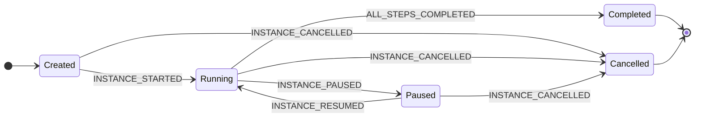
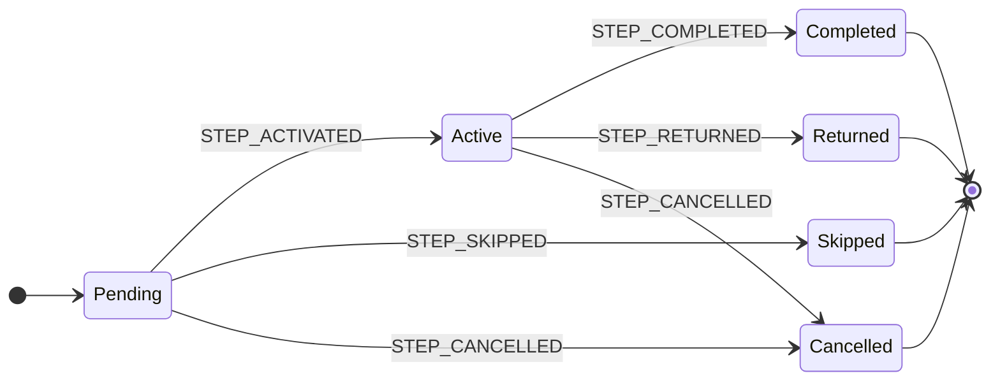

# D3. State Machine Diagrams — Blocking (H1-Filtered)

**Document ID:** D3 **Status:** Pre-Development Baseline — Pending Team Review **Platform:** Batac City LGU Platform **Last Updated:** June 2026 **Audience:** Backend development team **Source Documents:** `consolidated-architecture-and-requirements-reference-iteration-3.md` (Parts 4, 5, 8, 11, 12); `b4-workflow-engine-specification.md` (Sections 2, 3, 4, 6)

**Blocking reason:** The three state enums defined here become PostgreSQL column types, Drizzle schema values, audit event codes, and workflow engine constants. B4 currently defines conflicting enum values. Both D3 and B4 must be reconciled before the first migration file is written. See Appendix B.

> **H1 filter note:** Section 1 (Document Lifecycle State Machine) has been removed — it governs `documents.documents.lifecycle_status`, which is outside the scope of `workflow.definitions` seed records. Sections 2 and 3 (Workflow Instance and Workflow Step Instance) are retained in full. Appendix C retains only open items that bear directly on step/instance schema decisions needed for H1. Appendix D retains only the workflow instance and step instance enum stubs.

---

## Overview

Three state machines govern the core domain objects. The table below is retained for context; only Machines 2 and 3 are in scope for H1.

|#|Machine|DB Location|Cardinality per document|
|---|---|---|---|
|1|Document Lifecycle|`documents.documents.lifecycle_status`|_(out of scope for H1)_|
|2|Workflow Instance|`workflow.instances.status`|Zero or one active instance|
|3|Workflow Step Instance|`workflow.step_instances.status`|Zero or more; at most one in `Active` in Phase 1|

**Epistemic conventions:**

- State names and their set membership are derived from the consolidated reference (Part 11.4) and the stated requirements for this document. They are **the authoritative definitions** that B4 and the Drizzle schema must conform to.
- Specific triggering event names (e.g., `DOCUMENT_SUBMITTED`) are architectural naming decisions made here; they become domain event constants.
- Guard conditions and transition semantics derived from domain knowledge rather than verbatim stakeholder statements are labeled `[Inference]`.
- Items confirmed in stakeholder interviews are labeled `[CONFIRMED]`.

---

## 2. Workflow Instance State Machine

Represents the execution state of a workflow instance (`workflow.instances`). One instance exists per document per workflow execution. The instance is the running process that advances through step instances.

**State set:** `Created`, `Running`, `Paused`, `Completed`, `Cancelled`. Derived from consolidated reference Parts 11.3 and 11.13 and confirmed B4 behavior semantics.

**Terminal states:** `Completed`, `Cancelled`.

> **B4 conflict:** B4 currently defines the `workflow_instance_status_enum` with values `active`, `suspended`, `stuck`, `completed`, `cancelled`. The names `active` and `suspended` must be renamed to `Running` and `Paused` respectively to match D3. `Created` must be added. `stuck` is not in D3's state set and requires a team decision. See Appendix B.

### 2.1 Diagram



### 2.2 State Definitions

|State|Description|Terminal|
|---|---|---|
|`Created`|Instance record committed to the database. Workflow definition version pinned (`definition_version_id` set — immutable except via Option B migration). First step instance not yet activated. SLA deadline computed and stored. Corresponds to the moment of the `WORKFLOW_INITIATED` event on the document lifecycle. `[Inference: Created is a very brief transient state; in B4 Section 3.2, the start step is activated in the same transaction as instance creation]`|No|
|`Running`|Workflow is progressing. At least one step instance exists in a non-terminal state. The engine is actively evaluating steps, resolving assignees, and processing transitions. Corresponds to B4's `active` status.|No|
|`Paused`|Workflow is temporarily suspended. No step instances are `Active`. SLA clock behavior during `Paused` is a pending policy decision (see Appendix C, O-3). Known trigger: administration transition — when the next step requires Mayor action and no active Mayor account exists, the instance auto-pauses until the new Mayor's account is activated. Source: consolidated reference Part 11.13. `[Inference: auto-pause mechanism; CONFIRMED: administration transition auto-wait behavior]` Corresponds to B4's `suspended` status.|No|
|`Completed`|The workflow's `termination` step has been reached and executed. All step instances are in terminal states. The engine emits the appropriate terminal document lifecycle event (`DOCUMENT_RELEASED`, `DOCUMENT_ARCHIVED`, etc.) depending on the termination outcome code.|Yes|
|`Cancelled`|Cancelled by an authorized actor before reaching a `termination` step. All `Active` and `Pending` step instances receive `STEP_CANCELLED` in the same transaction. The associated document lifecycle transitions to `Cancelled`. Mandatory cancellation reason required.|Yes|

### 2.3 Transition Table

`[Inference]` applies to all events and guard conditions unless noted.

|From|To|Event|Guard Conditions|Notes|
|---|---|---|---|---|
|`Created`|`Running`|`INSTANCE_STARTED`|Workflow definition version is published, active, and current; document is in `In-Workflow` lifecycle state; the start step's assignee is resolvable from current organization state|First step instance is created with status `Active` and `started_at = NOW()`. In B4, this transition occurs within the same database transaction as instance creation (B4 Section 3.2). `Created` may be a transient state of sub-millisecond duration in practice.|
|`Created`|`Cancelled`|`INSTANCE_CANCELLED`|Authorized actor; mandatory cancellation reason|Rare — normally `Created → Running` is immediate. Could occur if instance creation is partially rolled back and retried, or if an immediate administrative cancellation is needed.|
|`Running`|`Paused`|`INSTANCE_PAUSED`|Admin or system-level trigger; pause reason logged|Known triggers: (1) Platform Administrator explicitly pauses for error correction. (2) System auto-pauses when a Mayor review step becomes the next step to activate and no active Mayor account is present (administration transition). Source: consolidated reference Part 11.13.|
|`Running`|`Completed`|`ALL_STEPS_COMPLETED`|The `termination` step type has been activated and executed; all step instances are in terminal states|Triggers a document lifecycle event based on the termination step's `outcome_code` (e.g., `APPROVED_AND_RELEASED`, `REJECTED_AT_VOTE`, `ARCHIVED_NO_ACTION`). Source: B4 Section 4.6.|
|`Running`|`Cancelled`|`INSTANCE_CANCELLED`|Authorized actor; mandatory cancellation reason|All `Active` and `Pending` step instances cancelled in the same transaction. Document lifecycle transitions to `Cancelled`. Step instances already in terminal states retain their terminal state — they are not modified.|
|`Paused`|`Running`|`INSTANCE_RESUMED`|Pause condition is resolved; admin authorization to resume|Known trigger: new Mayor account is activated and the pending Mayor-review step becomes assignable. The paused step instance is re-examined for assignee resolution and notification. Source: consolidated reference Part 11.13.|
|`Paused`|`Cancelled`|`INSTANCE_CANCELLED`|Authorized actor; mandatory cancellation reason|Valid during a pause period; e.g., document administratively withdrawn while awaiting the new Mayor.|

### 2.4 Notes

**Version pinning is immutable.** At `INSTANCE_STARTED`, `instances.definition_version_id` is set to the current published version. This pin never changes except via the explicit Option B in-flight migration (requires City Administrator approval, 2nd-level authorization, 24-hour reversal window, dedicated audit events). All step resolution, transition evaluation, and condition expression evaluation uses exclusively the pinned version's snapshot. Source: B4 Section 7.1. `[CONFIRMED — consolidated ref Part 11.3]`

**ARTA SLA clock is not suspended by system outages.** "ARTA compliance obligations do not pause during system outages." The SLA clock runs continuously regardless of system availability. The deadline is recorded at instance creation as a concrete `TIMESTAMPTZ`. Breach detection that runs on restart retroactively sets `sla_breached_at = sla_deadline` (not the detection time). Source: B4 Section 8.2. `[CONFIRMED — consolidated ref Part 11.15]`

**SLA clock behavior during `Paused` is an open policy decision.** Whether `Paused` suspends the ARTA SLA clock is not confirmed by stakeholders. This must be decided before the `Paused` state is implemented. See Appendix C, item O-3.

**`REPASSED` termination does not set `Completed`.** When a Panlalawigan RETURNED outcome results in the document being repassed, B4 defines the termination step's `outcome_code = REPASSED` as a special case: the instance status is _not_ set to `Completed`. The instance emits `workflow.instance.repassed` and the documents module creates a new document version with a new workflow instance. The original instance's status remains `Running` (or a dedicated `Repassed` status — pending team decision). This is not currently modeled in the D3 diagram. See Appendix C, item O-7.

**`Stuck` state in B4.** B4 defines a `stuck` status for when transition evaluation finds no matching rule. This state is absent from D3's specified set. Team must decide: add `Stuck` to D3 and this diagram, or remove it from B4. See Appendix B.

---

## 3. Workflow Step Instance State Machine

Represents the execution state of a single step within a workflow instance (`workflow.step_instances`). One step instance is created per step execution attempt. Step instances are **not reused** across attempts: if a step is returned and the workflow later re-enters that step position (revision loop), a new step instance is created for the next attempt. This keeps the audit trail clean and immutable.

**State set:** `Pending`, `Active`, `Completed`, `Skipped`, `Returned`, `Cancelled`.

**Terminal states:** `Completed`, `Skipped`, `Returned`, `Cancelled`. None of these have outgoing transitions.

> **B4 conflict:** B4 currently defines `workflow_step_status_enum` with values `pending`, `active`, `completed`, `bypassed`, `cancelled`, `failed`. `bypassed` must be renamed `Skipped`; `Returned` must be added; `failed` is absent from D3 and requires a team decision. See Appendix B.

### 3.1 Diagram



### 3.2 State Definitions

|State|Description|Terminal|
|---|---|---|
|`Pending`|Step instance created. Preceding step(s) have not yet reached a terminal state. Assignee may or may not be resolvable yet. The step is queued but not yet the engine's active focus.|No|
|`Active`|Step is the current step being executed. Assignee resolved and stored in `assigned_to`. Assignee notified. For `action` and `approval` step types: waiting for actor input. For `decision` and `notification` step types: system processes and completes the step immediately on activation (no waiting).|No|
|`Completed`|The step's required action has been performed and recorded. `outcome`, `completed_at`, and `actor_id` are set. Transition evaluation runs against the step's outcome code to determine the next step to activate.|Yes|
|`Skipped`|Step bypassed without execution. No actor action taken. `bypassed_at`, `bypass_reason`, and optionally `bypassed_by` are set. Used for: (1) decision routing — steps on the branch not taken are Skipped. (2) Certified Urgent path — the `multi_referral` committee referral step is Skipped entirely. (3) SP Secretary manual bypass via `bypassStep`. Source: consolidated reference Part 11.3, Part 4.17. `[CONFIRMED]` Corresponds to B4's `bypassed` status.|Yes|
|`Returned`|Step explicitly returned by the assigned actor. Applies to `approval` step type only. The actor has determined the document needs revision at a prior step. The workflow engine activates the designated prior step (as a new step instance). The current step instance remains `Returned` permanently — it is the historical record of this return action. `outcome_comment` is mandatory. `[Inference: Returned as a distinct state; B4 currently models this as Completed with RETURNED_FOR_REVISION outcome; see Appendix B]`|Yes|
|`Cancelled`|Step cancelled. Either the parent workflow instance was cancelled while this step was `Active` or `Pending`, or an admin explicitly cancelled an active step. At most one step can be `Active` in Phase 1 at any time; all `Pending` steps are bulk-cancelled when the instance is cancelled.|Yes|

### 3.3 Transition Table

`[Inference]` applies to all events and guard conditions unless noted.

|From|To|Event|Guard Conditions|Applies To|Notes|
|---|---|---|---|---|---|
|`Pending`|`Active`|`STEP_ACTIVATED`|All preceding step(s) in terminal state (Completed or Skipped); workflow transition rules evaluated and a matching rule points to this step; assignee resolvable from current organization state|All step types|Hearing date for committee referral steps can begin as "assigned; date TBD" — the step becomes Active before the date is known. Source: consolidated ref Part 4.10. `[CONFIRMED]` For `decision` and `notification` step types: the engine executes and completes the step immediately in the same call chain after activation.|
|`Pending`|`Skipped`|`STEP_SKIPPED`|A `decision` step upstream evaluated a routing condition that bypasses this step; OR the Certified Urgent flag is active (`context.certified_urgent = true`) and this step is a `multi_referral` committee referral step; OR admin invokes `bypassStep` with a mandatory non-empty reason|All step types|Certified Urgent: "Certified Urgent Resolutions and Ordinances skip committee review and report entirely." Source: consolidated ref Part 11.3. `[CONFIRMED]` When a decision step routes to branch A, all steps on branch B transition `Pending → Skipped`.|
|`Pending`|`Cancelled`|`STEP_CANCELLED`|Parent workflow instance has received `INSTANCE_CANCELLED`|All step types|Bulk transition: all `Pending` step instances are cancelled in the same transaction as the instance cancellation.|
|`Active`|`Completed`|`STEP_COMPLETED`|(a) For `action`: actor in `assigned_to` performs the required action; `require_comment = true` satisfied if configured. (b) For `approval`: actor records an explicit outcome from the `allowed_outcomes` list. (c) For `multi_referral`: all assigned committees have submitted contributions AND SP Secretary has accepted the unified report; OR SP Secretary invokes manual override with a mandatory non-empty comment. (d) For `decision`: system evaluates condition expression — no actor required. (e) For `notification`: notification enqueued — no actor required. (f) For `termination`: step auto-completes on activation.|All step types|Outcome code stored in `outcome` column; drives transition evaluation. SP Secretary manual override of `multi_referral` always audit-logged with a dedicated event. Source: B4 Section 4.3. `[CONFIRMED — consolidated ref Part 8.3]` Secretariat UI logging actions — "Approve," "Reject," "Amended" — are `STEP_COMPLETED` events with corresponding outcome codes, not distinct events. Source: consolidated ref Part 11.4. `[CONFIRMED]`|
|`Active`|`Returned`|`STEP_RETURNED`|Step type is `approval`; actor in `assigned_to` explicitly returns the document for revision; mandatory non-empty `outcome_comment` required; workflow definition specifies a designated prior step to re-activate|`approval` only|The actor submits `outcome = RETURNED_FOR_REVISION`. The step transitions to `Returned`. The engine creates a new step instance for the designated prior step, which transitions `Pending → Active`. **Distinct from a failed vote.** A vote cast "against" (e.g., ordinance voted down at Third Reading) is `Active → Completed` with `outcome = REJECTED`, and transition rules route to archive — that step _completes_. `Returned` is specifically "send back for revision by a prior actor," not "voted down." `[Inference: Returned as distinct state; B4 uses outcome code on Completed; team must reconcile — see Appendix B]`|
|`Active`|`Cancelled`|`STEP_CANCELLED`|Parent workflow instance receives `INSTANCE_CANCELLED` while this step is `Active`; OR admin explicitly cancels an active step via `bypassStep` with a mandatory reason|All step types|The single `Active` step and all `Pending` steps are cancelled together in one transaction. Data accumulated during the `Active` period (partial `multi_referral` submissions, metadata writes) is retained in the row for audit purposes.|

### 3.4 Step Type Interaction Notes

The following table summarizes how each Phase 1 step type interacts with the state machine. It is not a substitute for the full behavior contracts in B4 Section 4.

|Step Type|Activation Behavior|Who Triggers `Completed`|Can Transition to `Returned`?|Phase|
|---|---|---|---|---|
|`action`|Assignee notified; awaits actor input|Actor|No|1|
|`approval`|Assignee notified; awaits explicit decision|Actor (or scheduler for `LAPSED`/`DEEMED_APPROVED`)|**Yes**|1|
|`multi_referral`|All assigned committees notified; each contributes to unified report; Thursday cutoff tracked|SP Secretary (after all submissions received, or via manual override)|No|1|
|`decision`|System evaluates condition immediately on activation|System (no actor)|No|1|
|`notification`|System enqueues notification immediately on activation|System (no actor)|No|1|
|`termination`|Auto-completes on activation; triggers `ALL_STEPS_COMPLETED` on instance|System (no actor)|No|1|
|`parallel_split`|Reserved|—|No|2 (schema reserved)|
|`parallel_join`|Reserved|—|No|2 (schema reserved)|

**`multi_referral` red-flag is not a state transition.** When assigned committees have not submitted their contributions before the Thursday 23:59:59 PHT cutoff, the step instance **remains in `Active` state** — it does not transition to any other state. The red-flag indicator in the Order of Business is a derived UI property: `status = 'Active' AND missing_committee_count > 0 AND current_timestamp > thursday_cutoff`. The step transitions to `Completed` only when all contributions are received and accepted by the SP Secretary, or the SP Secretary manually overrides. Source: B4 Section 6.2 and consolidated ref Part 8.3. `[CONFIRMED]`

**Scheduler-set outcomes.** The outcomes `LAPSED` (10-day Mayor lapse, RA 7160 Section 47) and `DEEMED_APPROVED` (30-day Panlalawigan lapse, RA 7160 Section 56(d)) are set by scheduled jobs, not by human actors. The engine validates that these outcome codes can only be submitted with `actor_type = system`. A human actor submitting either code receives `FORBIDDEN`. Source: B4 Sections 6.3, 6.4. `[CONFIRMED — consolidated ref Parts 4.1, 4.2, 4.3]`

**Outcome codes for `approval` steps.** The full set of valid outcome codes is defined in B4 Section 4.2. Key codes relevant to transition routing: `APPROVED`, `REJECTED`, `RETURNED_FOR_REVISION`, `SIGNED`, `VETOED`, `LAPSED`, `OVERRIDE_SUCCEEDED`, `OVERRIDE_FAILED`, `VALID`, `VALID_IN_PART`, `RETURNED` (Panlalawigan), `OPERATIVE_IN_ITS_ENTIRETY`, `DEEMED_APPROVED`, `REPORT_ACCEPTED`. Each outcome must have a corresponding outgoing transition rule on the workflow definition; definitions missing coverage are rejected at publish time. Source: B4 Section 4.2.

---

## Appendix A: Terminal State Summary (Workflow Machines Only)

|Machine|Terminal States|Non-Terminal States|
|---|---|---|
|Workflow Instance|`Completed`, `Cancelled`|`Created`, `Running`, `Paused`|
|Workflow Step Instance|`Completed`, `Skipped`, `Returned`, `Cancelled`|`Pending`, `Active`|

**No document data is deleted in any terminal state.** Soft-delete (`deleted_at` timestamp) is the only permitted deletion mechanism, and it is not triggered by lifecycle state transitions. Physical document records are retained permanently in all states including `Cancelled`. Source: consolidated reference Parts 11.7, 12 (Invariant 2). `[CONFIRMED]`

---

## Appendix B: B4 Reconciliation — Required Changes

B4 (`b4-workflow-engine-specification.md`, Section 2.8) defines enum values that conflict with D3. D3 is authoritative. B4 must be updated before the first migration is written.

### Workflow Instance Status Enum

|D3 State (authoritative)|B4 Current Value|Action Required|
|---|---|---|
|`Created`|_(not defined)_|**Add to B4 enum.** B4 Section 3.2 creates and starts an instance in one transaction; `Created` may need to be modeled as a pre-`Running` transient state or collapsed into `Running` with an explicit team decision.|
|`Running`|`active`|**Rename** `active` → `Running` in B4 enum, all column references, and event payload references.|
|`Paused`|`suspended`|**Rename** `suspended` → `Paused` in B4 enum and all references.|
|`Completed`|`completed`|No change needed.|
|`Cancelled`|`cancelled`|No change needed.|
|_(not in D3)_|`stuck`|**Team decision required.** B4 defines `stuck` for when transition evaluation finds no matching rule. Options: (a) Add `Stuck` to D3 and update this diagram. (b) Remove from B4 and replace with an error event that keeps the instance in `Running` and notifies the Platform Administrator. Decision needed before first workflow module migration.|

### Workflow Step Instance Status Enum

|D3 State (authoritative)|B4 Current Value|Action Required|
|---|---|---|
|`Pending`|`pending`|No change needed.|
|`Active`|`active`|No change needed.|
|`Completed`|`completed`|No change needed.|
|`Skipped`|`bypassed`|**Rename** `bypassed` → `Skipped` in B4 enum and all references (column values, event payloads `workflow.step.bypassed`, B4 Section 4.3 metadata field `missed`, B4 Section 6.1 bypass logic).|
|`Returned`|_(not defined)_|**Add to B4 enum.** B4 currently models "returned for revision" as `Active → Completed` with `outcome = RETURNED_FOR_REVISION`, then routes to a prior step. D3 specifies `Returned` as a distinct terminal state for the step instance. B4 Section 4.2 must be updated: when `outcome = RETURNED_FOR_REVISION`, the step transitions to `Returned` (not `Completed`). The prior step is then re-activated. This preserves cleaner semantics: `Completed` means "the step's intended action was finished"; `Returned` means "an actor rejected this attempt and sent it back."|
|`Cancelled`|`cancelled`|No change needed.|
|_(not in D3)_|`failed`|**Team decision required.** B4 defines `failed` for internal engine errors (B4 Section 2.8: "Internal engine error during step execution; triggers immediate alerting"). Options: (a) Add `Failed` to D3 and this diagram. (b) Remove from B4 and handle engine errors via the instance `Stuck` state or external alerting. Decision affects error handling design and monitoring.|

---

## Appendix C: Open Items (H1-Relevant)

The following items are unresolved and block specific step/instance schema implementations. Items O-1, O-2, and O-7 from the original D3 are omitted here as they pertain exclusively to document lifecycle modeling and Panlalawigan repass routing, which are outside the scope of `workflow.definitions` seed records.

|#|Item|Blocks|Resolution Needed Before|
|---|---|---|---|
|O-3|Does the ARTA SLA clock pause when a workflow instance is in `Paused` state? Legal precedent unclear. `[Unverified]`|SLA clock implementation; ARTA compliance reporting accuracy|Before `Paused` state is implemented|
|O-4|Team decision on `Stuck` instance state: add to D3 or remove from B4?|Workflow engine error handling design; `workflow_instance_status_enum` migration|Before first workflow module migration|
|O-5|Team decision on `Failed` step state: add to D3 or remove from B4?|Workflow engine error handling; `workflow_step_status_enum` migration|Before first workflow module migration|
|O-6|Team decision on `Created` instance state: keep as a discrete state (requires explicit `INSTANCE_STARTED` event to transition to `Running`) or collapse into `Running` (instance is `Running` from the moment it is committed)? Affects migration design and event sequencing.|`workflow_instance_status_enum` migration; `engine.createInstance` implementation|Before first workflow module migration|
|O-7|How is the `REPASSED` termination outcome modeled in the instance lifecycle? B4 Section 4.6 specifies the instance status does NOT become `Completed` on `REPASSED`. Should `Repassed` be a terminal instance state, or does the instance return to `Running` pending team action?|Panlalawigan RETURNED workflow design; `workflow_instance_status_enum`|Panlalawigan integration sprint|

---

## Appendix D: PostgreSQL Enum Stubs (Workflow Machines Only)

These are the D3-authoritative enum definitions for the workflow module. B4 must align to these values. These stubs are for reference; the actual migration SQL is produced from the Drizzle schema.

```sql
-- Machine 2: Workflow instance
-- Column: workflow.instances.status
-- NOTE: Add 'Stuck' if team decides to retain it from B4.
-- NOTE: Add 'Repassed' if team decides it is a discrete terminal state (see O-7).
CREATE TYPE workflow_instance_status AS ENUM (
    'Created',
    'Running',
    'Paused',
    'Completed',
    'Cancelled'
);

-- Machine 3: Workflow step instance
-- Column: workflow.step_instances.status
-- NOTE: Add 'Failed' if team decides to retain it from B4.
CREATE TYPE workflow_step_status AS ENUM (
    'Pending',
    'Active',
    'Completed',
    'Skipped',
    'Returned',
    'Cancelled'
);
```

**Check constraint pattern (state transition enforcement at DB level).** The application workflow engine is the primary enforcement layer. PostgreSQL check constraints serve as a secondary defense. For each table, a check constraint should validate that the `(previous_status, new_status)` pair is in the valid transition set. Because PostgreSQL check constraints cannot reference previous row values directly, this is implemented either via a trigger (on the step instance table) or by validating transitions exclusively in the application layer with the DB constraint enforcing only enum membership. Team to decide which approach is used for each table.

---

_This document supersedes any conflicting state definitions in B4 for the workflow module. Changes to enum values, state names, or transition semantics require an explicit revision entry dated and attributed, plus notification to all active implementers._