# Batac City LGU Platform

## System Architecture — C4 Model (Levels 1–3)

**Document ID:** B1 **Type:** System Architecture **Status:** Pre-Development Baseline **Version:** 1.0 **Date:** June 2026 **Based on:** Consolidated Architecture and Requirements Reference (Iteration 3); Stack Context **Audience:** Development team — internal reference

---

## Table of Contents

- [L32–L61] Notation and Conventions — C4 level mappings, source fidelity labels (e.g. Inference, Phase N), and Phase 1-4+ delivery scope mappings.
- [L62–L103] Level 1 — System Context — C4 context diagram defining platform boundaries, user roles (Citizen, Secretariat, Mayor), and integrations with external LGU systems.
- [L104–L158] Level 2 — Container Diagram — C4 container diagram and constraints including static SPA, Fastify server, direct S3 uploads, and PostgreSQL-backed job queues.
- [L159–L628] Level 3 — Component Diagrams — C4 component diagrams for cross-cutting infrastructure and the 11 domain modules governing application server internals.
  - [L165–L174] Cross-Cutting Infrastructure (referenced throughout) — Architectural details on the in-process event bus, Drizzle ORM usage rules, and pgboss job queue integrations.
  - [L175–L215] Module 1 — IAM — Components for Argon2id hashing, session limits, JWT issuance, ABAC engine, and Phase 2 MFA enforcement rules.
  - [L216–L254] Module 2 — Organization — Components for office hierarchies, employee positions, and automatic delegation scaling with no admin activation step required.
  - [L255–L307] Module 3 — Documents — Two-stage numbering rules, direct S3 uploads, OCR integration, version tracking, soft-deletes, and tracking QR generation.
  - [L308–L354] Module 4 — Workflow — Workflow engine logic, multi-committee rules with Thursday cutoffs, urgent path bypassing, lapse timers, and ARTA SLA escalations.
  - [L355–L392] Module 5 — Tracking — Immutable QR assignment order, physical custody vs. digital status tracking, and public lookup page blurring rules.
  - [L393–L432] Module 6 — Records — Archive rules, permanent retention lists, four-tier classification logic, and restricted Records Officer bulk operation schemas.
  - [L433–L469] Module 7 — Notifications — SSE in-app pushes, SMTP/Nodemailer email routing, Phase 3 SMS placeholders, and configurable notification template mechanics.
  - [L470–L507] Module 8 — Audit — HMAC and hash-chained tamper-evident design, Postgres insert-only constraints, and monthly RFC 3161 TSA export triggers.
  - [L508–L544] Module 9 — Search Meta [Phase 2] — Search abstraction details, Phase 1 PostgreSQL FTS, Phase 2 Meilisearch sync queue, and typo-tolerant search rules.
  - [L545–L592] Module 10 — Portal [Phase 3] — Next.js portal REST endpoints, citizen OTP authentication, document blurring logic, and complaint intake access channels.
  - [L593–L628] Module 11 — Reporting [Phase 2] — Configurable templates, React-PDF/SheetJS generation engines, and automated ARTA compliance reporting using live SLA details.
- [L629–L659] Appendix A — Cross-Module Event Reference [Inference] — Tabulated catalog of in-process event contracts defining publishers, subscribers, and side-effects across all 11 modules.
- [L660–L677] Appendix B — Architectural Invariants Affecting This Document — Twelve rigid architectural rules mapping system-wide invariants to specific diagram implementations and database constraints.

---

## Notation and Conventions

### C4 Levels Covered

| Level | Diagram Type   | Describes                                                              |
| ----- | -------------- | ---------------------------------------------------------------------- |
| 1     | System Context | Platform as one box; all external actors and systems it interacts with |
| 2     | Container      | Every deployable unit and how they communicate                         |
| 3     | Component      | Internal structure of the Application Server, one diagram per module   |

### Source Fidelity

|Label|Meaning|
|---|---|
|_(unlabelled)_|Confirmed in source documents (Consolidated Reference or Stack Context)|
|`[Inference]`|Logically derived from confirmed elements; not explicitly stated. All internal component names and decompositions within modules are proposed design — not confirmed implementation.|
|`[Phase N]`|Scoped to that delivery phase. Schema may be reserved in Phase 1 even if the module is Phase 2 or 3.|

### Phase Summary

|Phase|Primary Scope|
|---|---|
|1|SP Resolutions, Ordinances, Appropriation Ordinances, Citizen Complaints, core IAM and infrastructure|
|1B|Administrative documents: Letters (SPR/SPS), Memos (MI/MO), NCH, NOSP, Designations, Barangay Resolutions|
|2|Executive branch, MFA enforcement, Meilisearch, Records Management, email notifications, parallel workflow engine (Barangay Budget)|
|3|Full Next.js citizen portal, Barangay offline access, SMS gateway|
|4+|Advanced OCR, configurable report builder, electronic signature PKI|

---

## Level 1 — System Context

Batac City LGU Platform shown as a single system with all external actors, organisations, and legacy systems it interacts with.

**Note on Panlalawigan and Ilocos Times:** These are not electronic integrations. The platform logs the outcomes of those physical interactions when Secretariat staff enters them manually.

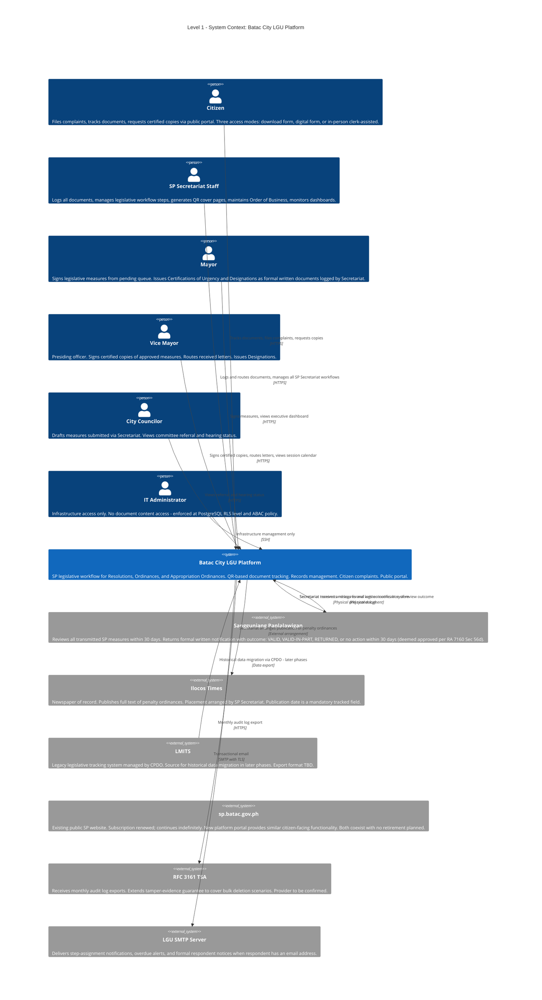

---

## Level 2 — Container Diagram

All deployable units within the platform and how they communicate.

**Key architectural constraints:**

- The Internal Web App is a static bundle served by Nginx or Caddy — no Node.js process required for frontend serving.
- The Application Server is a single Fastify process serving both tRPC (for the internal app) and REST/OpenAPI (for portal and external clients), separated by plugin scope.
- Files never touch the application server disk — streamed directly between client and S3-compatible storage via presigned URLs.
- No provider-specific SDK imports anywhere in the codebase. Only the S3-compatible API (`@aws-sdk/client-s3` pointed at the configured endpoint) is permitted.

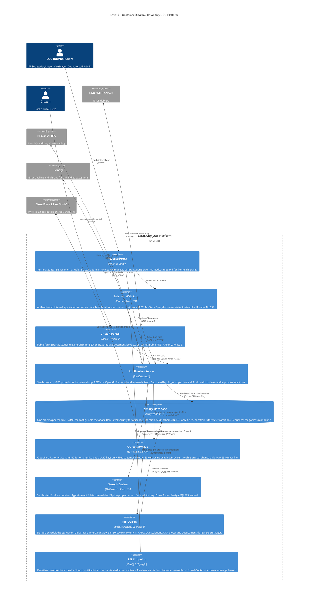

---

## Level 3 — Component Diagrams

Internal structure of the Application Server container, organized by the 11 domain modules defined in Part 10.2 of the Consolidated Reference.

> **[Inference]** All internal component names, service boundaries, and decompositions within each module are architectural proposals. The source documents confirm module schemas and boundaries; the specific component decompositions shown here are pre-development design decisions subject to refinement during implementation.

### Cross-Cutting Infrastructure (referenced throughout)

|Element|Description|
|---|---|
|**Internal Event Bus**|In-process. Decouples modules without distributed messaging overhead. Publishers emit typed domain events; subscribers in other modules consume them. Modules must never access another module's schema directly — only via the event bus or a published module API.|
|**Drizzle ORM**|Each module has its own Repository component wrapping Drizzle queries for that module's schema only. No cross-schema foreign key constraints permitted anywhere.|
|**pgboss client**|Available to any module requiring durable delayed or scheduled background jobs. Job state persisted in PostgreSQL in the pgboss schema.|

---

### Module 1 — IAM

**Schema:** `iam` **Tables:** `users`, `credentials`, `sessions`, `refresh_tokens`, `roles`, `permissions`, `role_assignments`, `mfa_records` **Responsibility:** Authentication, session control, JWT issuance, role and permission resolution, ABAC policy evaluation.

MFA is architected and schema-reserved in Phase 1 but not enforced. Phase 2 enforces TOTP for Mayor, SP Secretary, Department Heads, Platform Admin, and IT Admin.

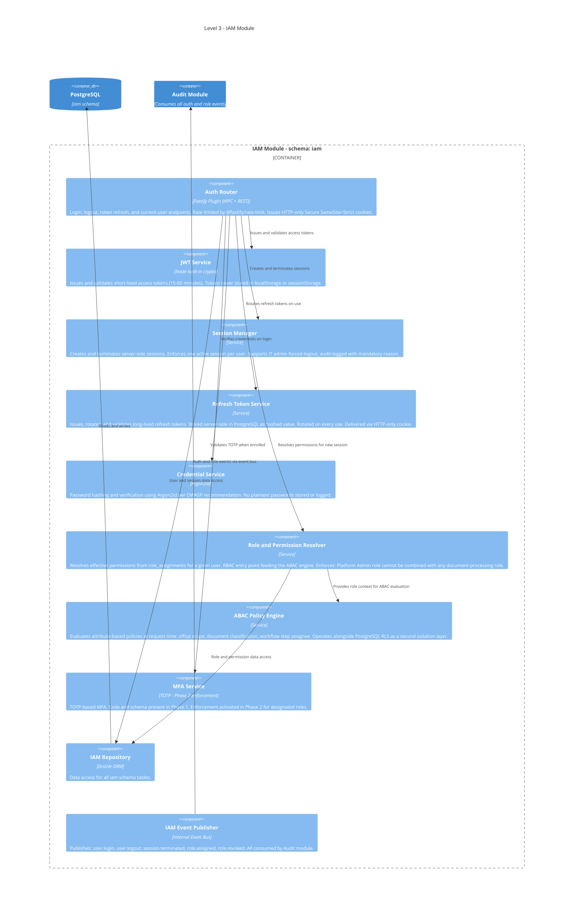

---

### Module 2 — Organization

**Schema:** `organization` **Tables:** `offices`, `positions`, `employees`, `assignments`, `delegations` **Responsibility:** Office hierarchy, employee records, position assignments, and delegation management.

Delegation is a confirmed high-frequency first-class operation (10+ Acting Mayor designations per year). One active delegation per person is enforced at both the DB level (partial unique index on active `delegation_grants` per user) and the application level. No Platform Admin confirmation step is required — Secretariat logs the Designation and it takes immediate effect.

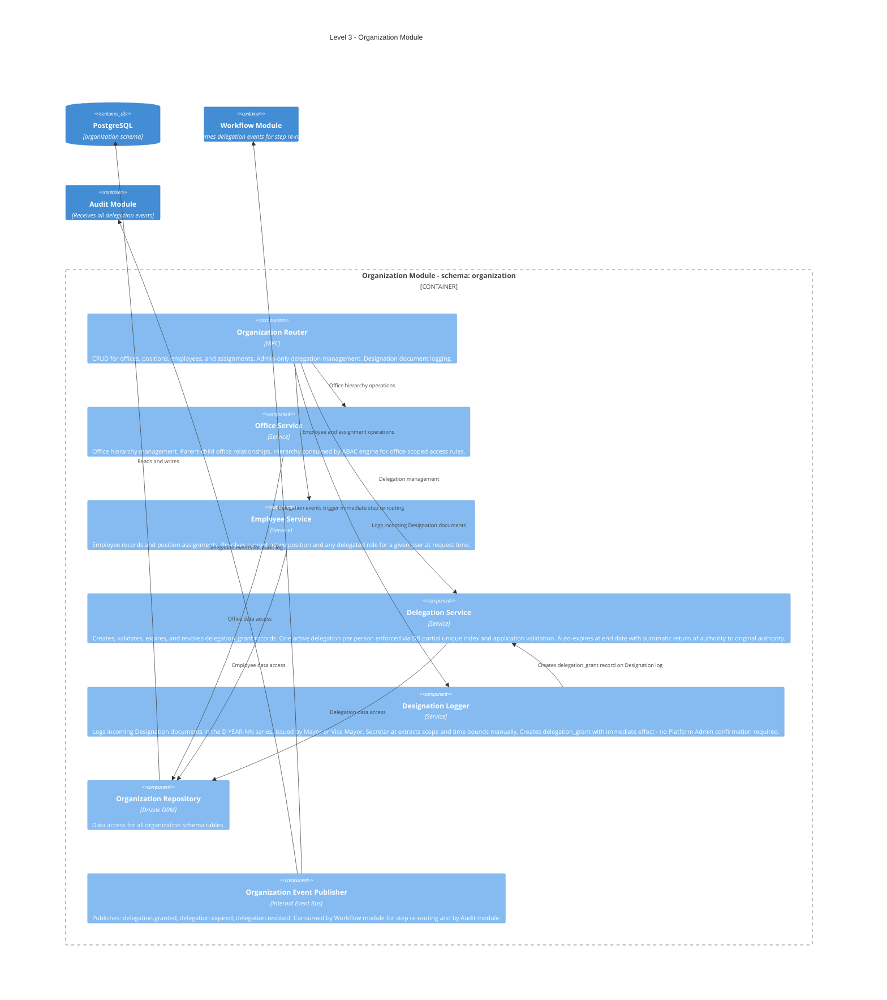

---

### Module 3 — Documents

**Schema:** `documents` **Tables:** `document_types`, `documents`, `versions`, `attachments`, `numbers`, `number_series`, `signatures` **Responsibility:** Document lifecycle management, immutable versioning, two-stage numbering, OCR on upload, file streaming to S3, QR cover sheet generation.

**Numbering summary:**

- Preliminary: `Draft 7SP YEAR-NN` — assigned at secretariat logging, before QR even (QR is first)
- Final: `7SP YEAR-NN` — assigned by Secretariat after last reading vote (Second Reading for Resolutions; Third Reading for Ordinances), before VP signs
- Space delimiter throughout all document type formats
- Final numbers are immutable once Draft prefix is removed
- Separate PostgreSQL sequence per document type per year; no shared counters

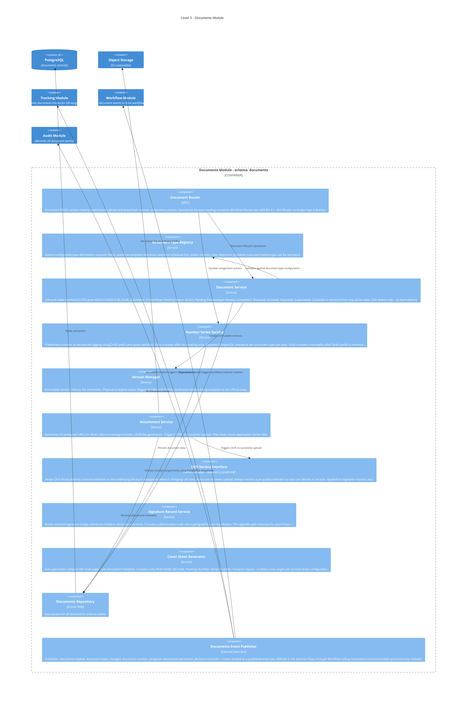

---

### Module 4 — Workflow

**Schema:** `workflow` **Tables:** `definitions`, `definition_versions`, `steps`, `transition_rules`, `instances`, `step_instances`, `workflow_events` **Responsibility:** Custom domain-specific workflow engine, admin-configurable without developer involvement. Workflow instances pin to definition version active at creation. Certified Urgent path is Phase 1. Multi-committee referral with all-committees-must-sign rule is Phase 1. Mayor 10-day lapse and Panlalawigan 30-day review timers run via pgboss.

**Phase 1 step types:** `action`, `approval`, `multi_referral`, `decision`, `notification`, `termination` **Phase 2 reserved (schema present in Phase 1):** `parallel_split`, `parallel_join`

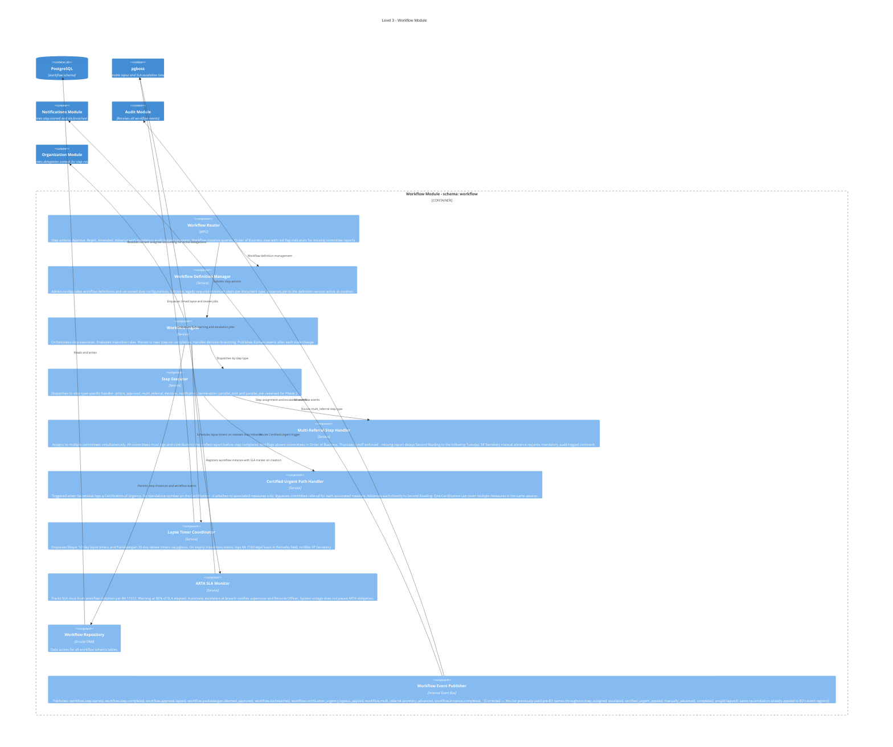

---

### Module 5 — Tracking

**Schema:** `tracking` **Tables:** `tracking_records`, `routing_entries`, `qr_codes` **Responsibility:** QR code generation at secretariat logging (before preliminary number is assigned). Append-only routing history for every document movement. Physical custody tracking separate from digital workflow status. Public scan-result view.

**Confirmed QR assignment sequence:** Councilor submits draft → Secretariat logs → **QR tracking number assigned** → Preliminary Draft number assigned → workflow instance created.

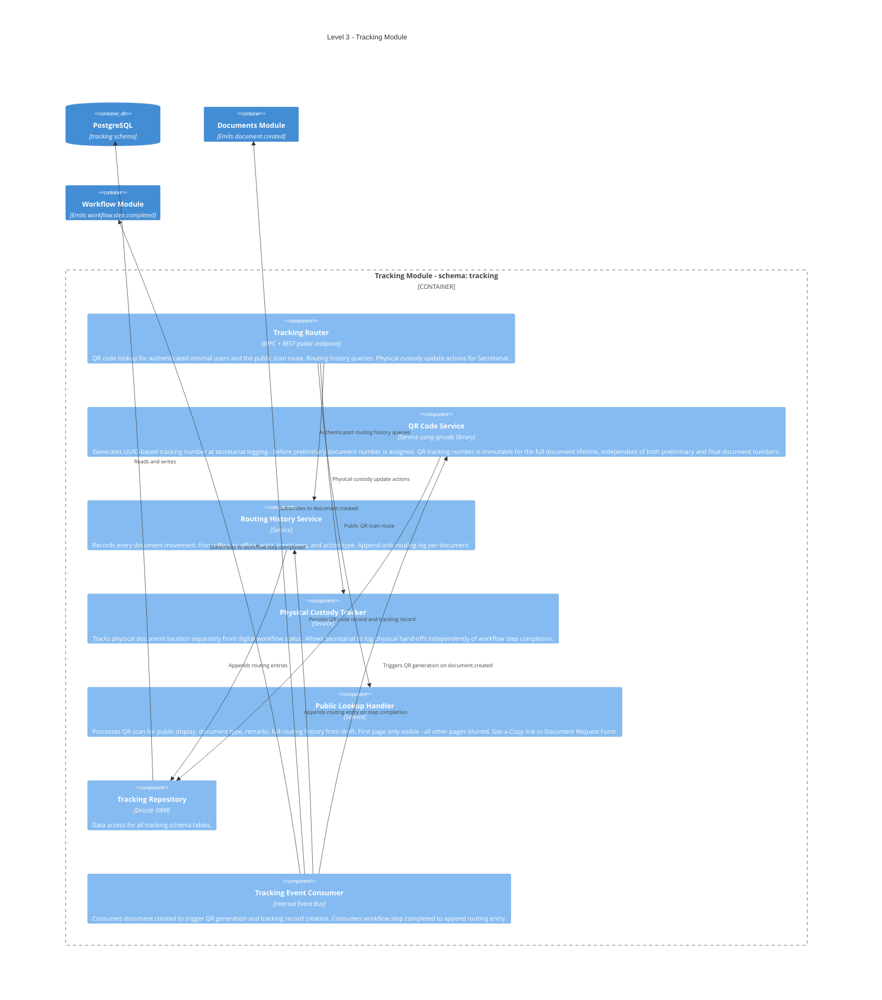

---

### Module 6 — Records

**Schema:** `records` **Tables:** `records`, `retention_schedules`, `archive_entries`, `classification_rules`, `dispositions` **Responsibility:** Records lifecycle after workflow completion. Retention schedule enforcement. Classification level enforcement. Bulk operations restricted to Records Officers. Disposition with mandatory comment and legal hold check. No hard deletes by any user or role at any level.

**Confirmed retention policy:** SP Resolutions and Ordinances have permanent retention. Currently no documents disposed of at Batac SP Secretariat.

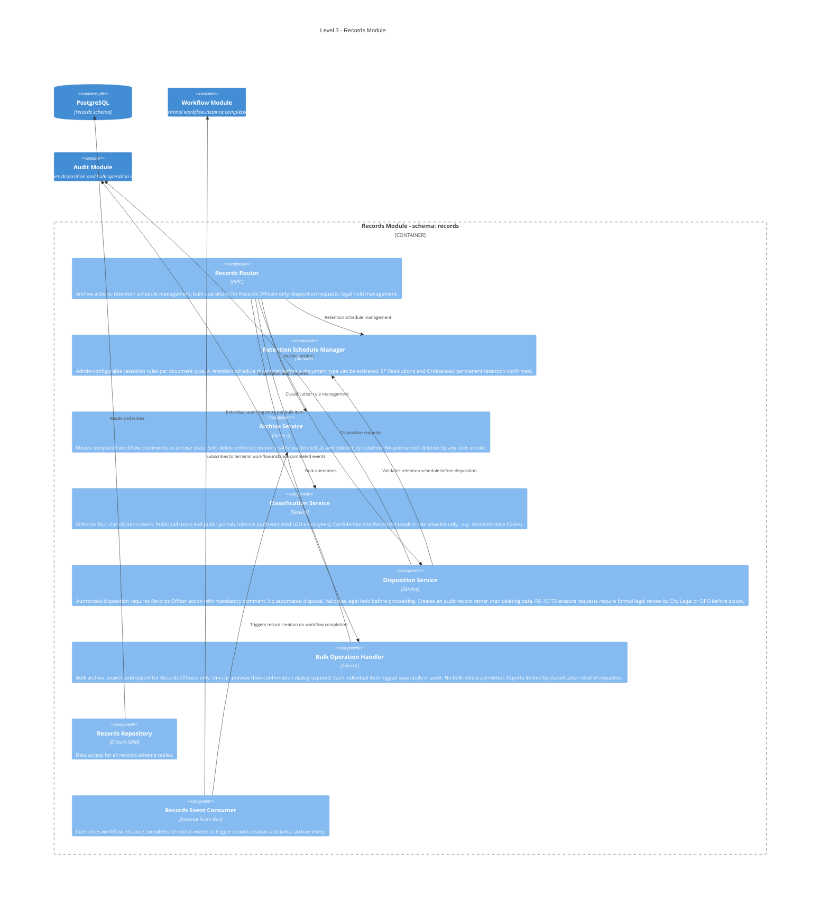

---

### Module 7 — Notifications

**Schema:** `notifications` **Tables:** `templates`, `notification_events`, `delivery_log` **Responsibility:** Multi-channel notification delivery. In-app via SSE. Email via Nodemailer. SMS via gateway (Phase 3 only). Admin-configurable templates requiring no developer involvement for changes. Formal respondent notices delivered by email if available; physical in-person pickup otherwise in Phase 1 and Phase 2.

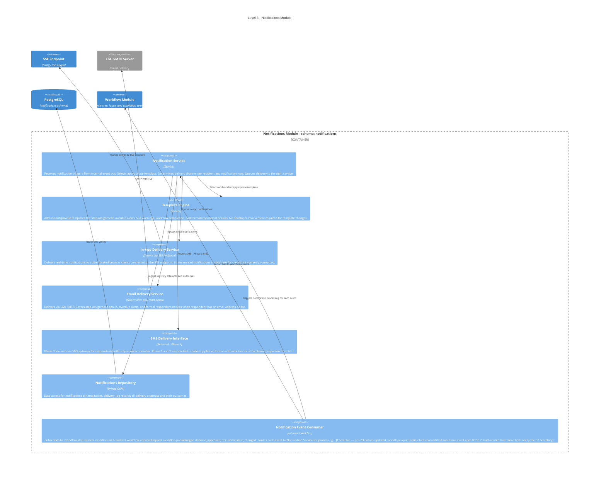

---

### Module 8 — Audit

**Schema:** `audit` **Tables:** `events` (append-only; INSERT-only at PostgreSQL DB role level) **Responsibility:** Tamper-evident audit log for all system activity. Hash chaining and HMAC using Node built-in `crypto` only — no external library. Monthly RFC 3161 TSA export. `UPDATE` and `DELETE` are revoked from the application DB user on the audit schema at the PostgreSQL role level.

**Claim boundary (required in ADR):** The audit log is tamper-evident, not tamper-proof. A sufficiently privileged attacker holding both DB write access and the HMAC secret key could insert records that pass validation. This distinction is documented in the ADR for the audit log design.

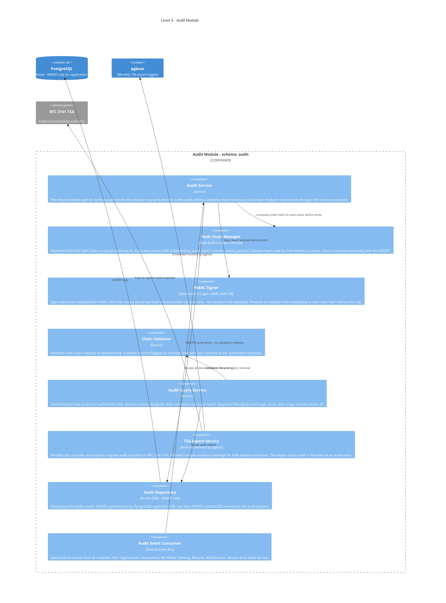

---

### Module 9 — Search Meta [Phase 2]

**Schema:** `search_meta` **Tables:** `index_metadata`, `index_jobs` **Responsibility:** Provider-agnostic search abstraction layer. Phase 1 uses PostgreSQL FTS (`tsvector`/`tsquery`). Phase 2 adds Meilisearch. All call sites across the codebase reference only the abstraction interface — never the underlying provider. Provider swap requires no call site changes. Typo tolerance is required for Filipino proper names.

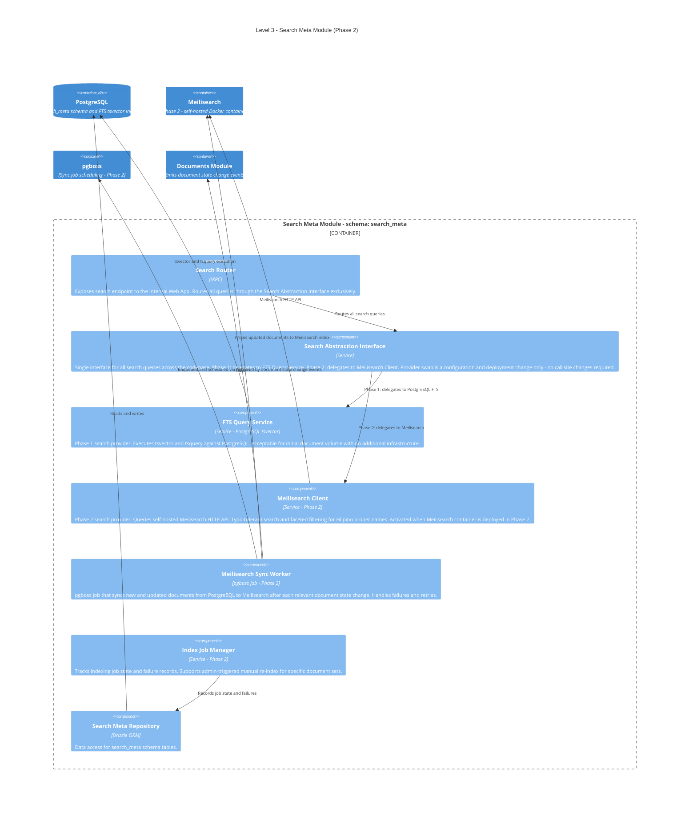

---

### Module 10 — Portal [Phase 3]

**Schema:** `portal` **Tables:** `public_documents`, `citizen_requests`, `complaints`, `announcements` **Responsibility:** Public-facing REST API consumed by the Next.js citizen portal. Citizen OTP-based authentication. Public document lookup (first page visible; body blurred). Citizen complaint submission. Document Request Form. Phase 3.

**Three confirmed access modes for both Document Requests and Complaints:**

1. Citizen downloads template from sp.batac.gov.ph and submits physical document with wet-ink signature
2. Citizen inputs on digital form → system generates printable form → citizen prints, signs, and submits
3. Citizen visits Secretariat in person → clerk inputs on digital form → prints on-site → citizen signs on the spot

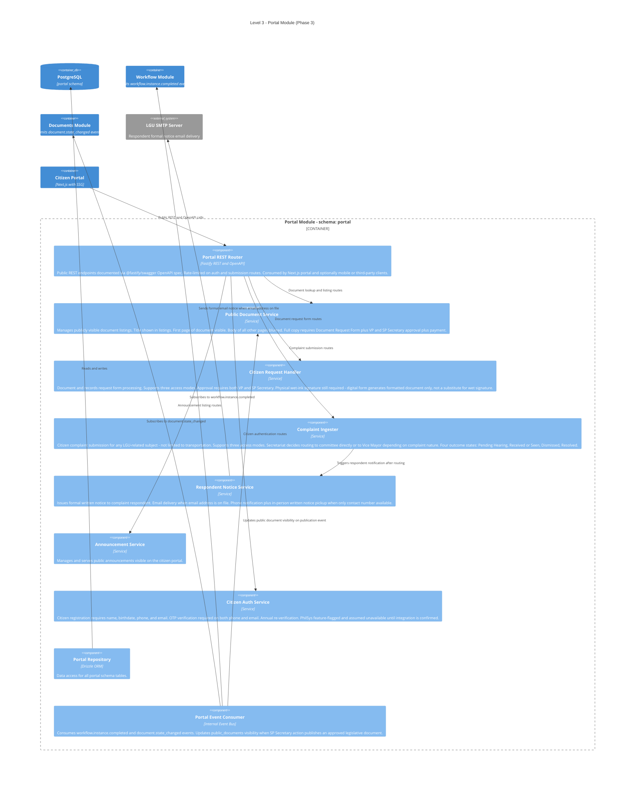

---

### Module 11 — Reporting [Phase 2]

**Schema:** `reporting` **Tables:** `report_definitions`, `schedules`, `outputs` **Responsibility:** Admin-configurable report generation requiring no developer involvement for new report types. RA 11032 ARTA compliance reports generated from live workflow SLA data. Scheduled and on-demand. PDF via `@react-pdf/renderer`. Spreadsheet via SheetJS.

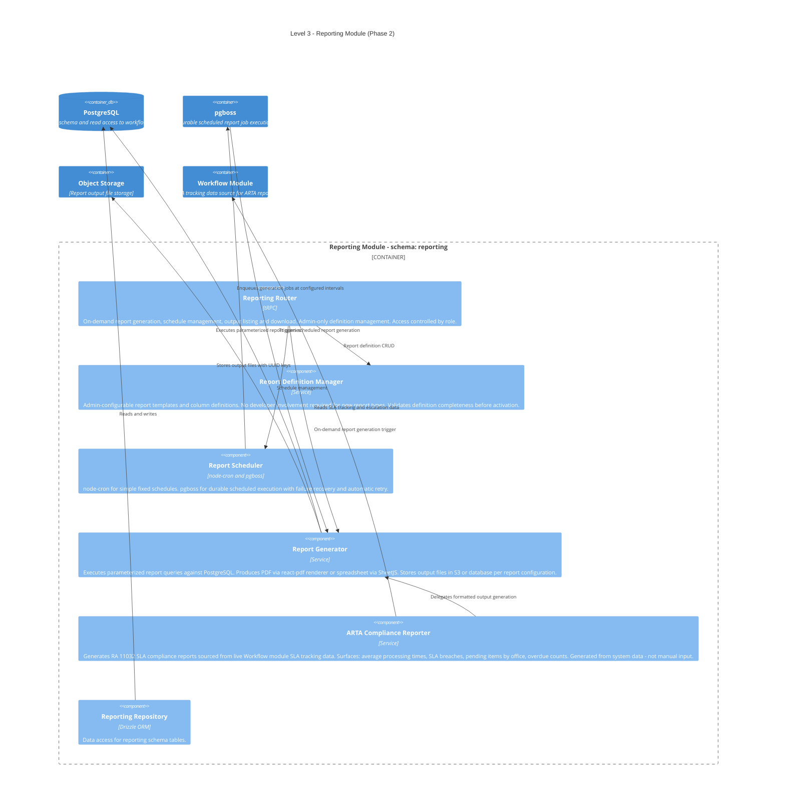

---

## Appendix A — Cross-Module Event Reference [Inference]

All events travel via the in-process event bus. Event names and subscriptions listed here are proposed design and subject to refinement during implementation.

|Event|Emitting Module|Consuming Modules|Notes|
|---|---|---|---|
|`user.login`|IAM|Audit||
|`user.logout`|IAM|Audit||
|`session.terminated`|IAM|Audit|Includes forced-logout by IT admin|
|`role.assigned`|IAM|Audit||
|`role.revoked`|IAM|Audit||
|`delegation.granted`|Organization|Workflow, Audit|Triggers immediate step re-routing to designated person|
|`delegation.expired`|Organization|Workflow, Audit|Auto-return of authority at end date|
|`delegation.revoked`|Organization|Workflow, Audit|Early revocation by delegating authority|
|`document.created`|Documents|Tracking, Workflow, Audit|QR generation and workflow instance creation|
|`document.state_changed`|Documents|Tracking, Notifications, Search Meta, Portal, Audit||
|`document.number_assigned`|Documents|Audit|Both preliminary and final assignment events|
|`document.certification_urgency.logged`|Documents|Workflow, Audit|`[Added]` Was absent from this list entirely; see B2 Master Event Bus Registry fix|
|`workflow.step.started`|Workflow|Notifications, Audit|Triggers notification to new assignee|
|`workflow.step.completed`|Workflow|Tracking, Audit|Appends routing entry to routing history. `[UPDATED — ADR-B2-3]` Also now carries Approve/Reject/Amended Secretariat decision outcomes in its `outcome` field — `document.secretariat_decision` never existed as a published event; this row previously listed it a third time in this same document (see the Document Router and Documents Event Publisher fixes elsewhere in this file)|
|`workflow.approval.lapsed`|Workflow|Notifications, Audit|Mayor 10-day timer expired, RA 7160 §47|
|`workflow.panlalawigan.deemed_approved`|Workflow|Notifications, Audit|Panlalawigan 30-day timer expired, RA 7160 §56(d)|
|`workflow.sla.breached`|Workflow|Notifications, Audit|ARTA SLA breach escalation|
|`workflow.sla.warning`|Workflow|Notifications, Audit|`[Added]` Was absent from this list entirely; SLA warning tier at 80% elapsed|
|`workflow.sla.critical`|Workflow|Notifications, Audit|`[Added]` Was absent from this list entirely; second SLA escalation tier|
|`workflow.certification_urgency.bypass_applied`|Workflow|Audit|Committee step bypassed on associated measures|
|`workflow.multi_referral.secretary_advanced`|Workflow|Audit|SP Secretary override — mandatory comment logged|
|`workflow.instance.completed`|Workflow|Records, Portal, Audit|Triggers record creation and public visibility update|

---

## Appendix B — Architectural Invariants Affecting This Document

Invariants from Part 12 of the Consolidated Reference that directly constrain the component boundaries shown above.

|#|Invariant|How It Appears in the Diagrams|
|---|---|---|
|1|Schema-per-module; no cross-schema FK constraints|Each module has its own Repository; no Drizzle query reaches into another module's schema|
|2|Modules communicate only via event bus or published APIs|All cross-module arrows are event bus subscriptions or explicit API calls — never direct schema access|
|3|Audit log INSERT-only at PostgreSQL DB role level|Audit Repository shown as INSERT-only; all writes route through Audit Service exclusively — no module has a direct DB arrow to audit schema|
|4|Workflow instance pins to definition version at creation|Workflow Definition Manager stores `definition_version_id` on instance at creation; all resolution uses the pinned version|
|5|S3-compatible API only; UUID file keys; no provider SDK imports|Attachment Service calls only the S3-compatible API; UUID key generation is in the service layer before the S3 call|
|6|No hard deletes by any user or role|Archive Service and all Repository components enforce soft-delete (deleted_at and deleted_by columns)|
|7|IT Admin has no document content access|Enforced by ABAC Policy Engine in IAM module and by PostgreSQL RLS — both layers required|
|8|Platform Admin cannot combine with operational roles|Role and Permission Resolver in IAM enforces this invariant at role assignment time|
|9|One active delegation per person at any time|Delegation Service enforces via DB partial unique index on active delegation_grants per user and application-level validation|
|10|Final document numbers immutable after Draft prefix removed|Number Series Service applies immutability check; DB constraint as second enforcement layer|
|11|Audit writes through Audit Service only|No module diagram has a direct DB arrow to the audit schema — all route through the Audit Service component|
|12|Audit log is tamper-evident, not tamper-proof|Hash Chain Manager and HMAC Signer combined provide evidence of tampering, not prevention; this distinction must be documented in the ADR|
