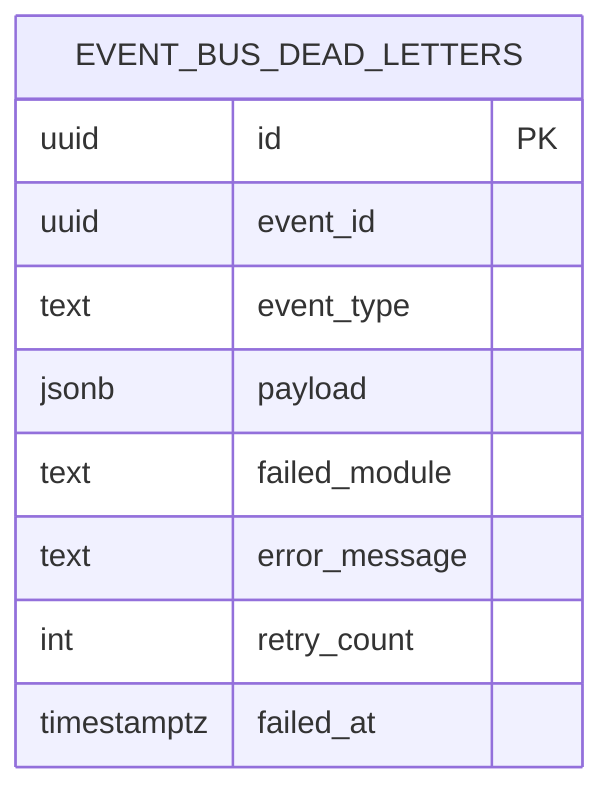
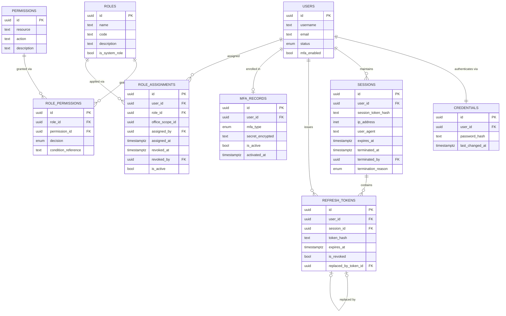
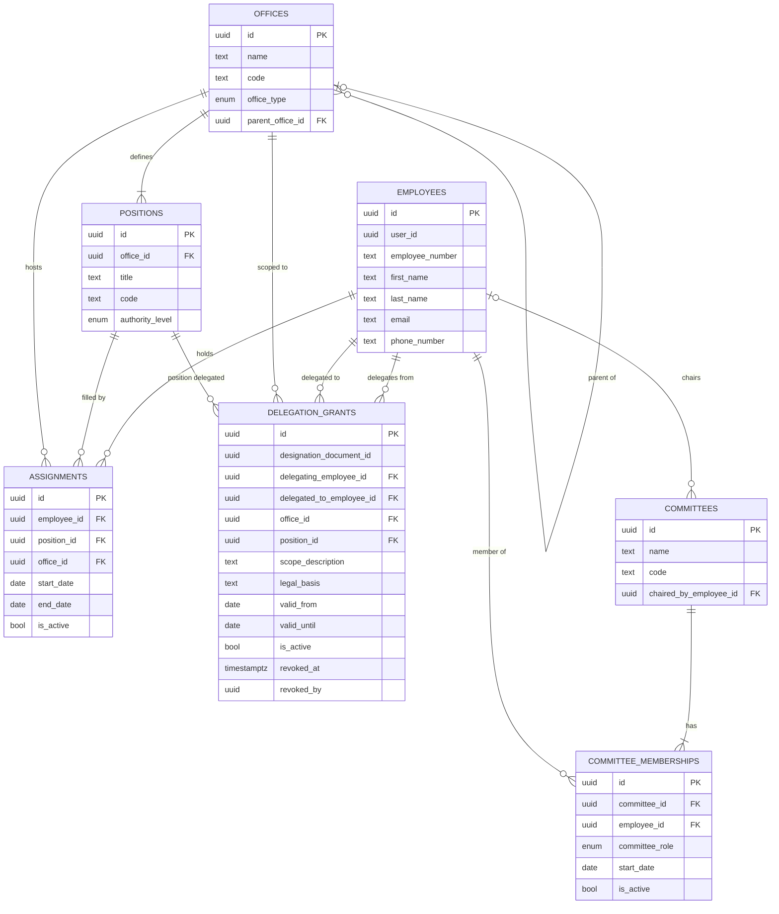
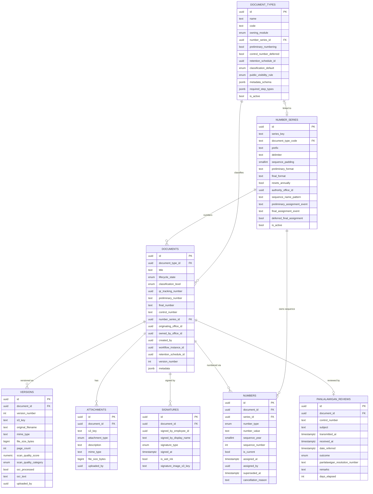
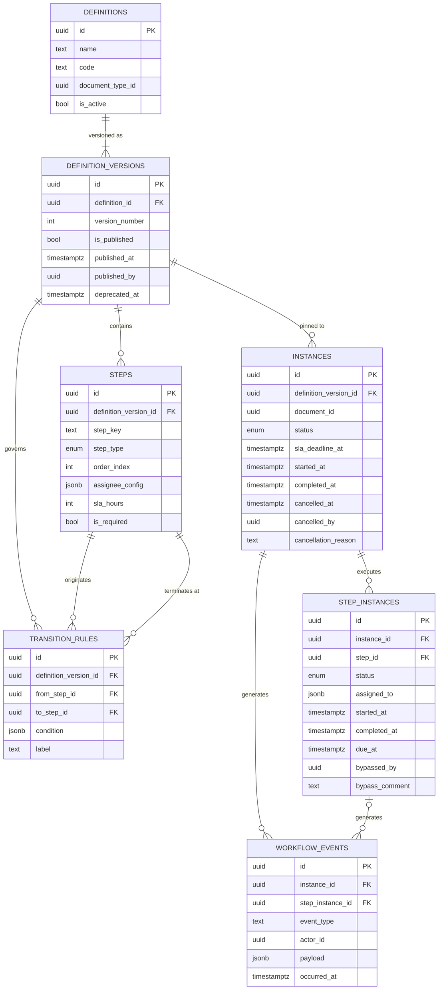
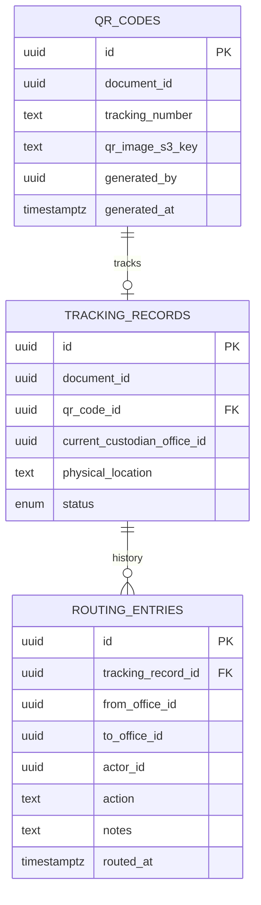
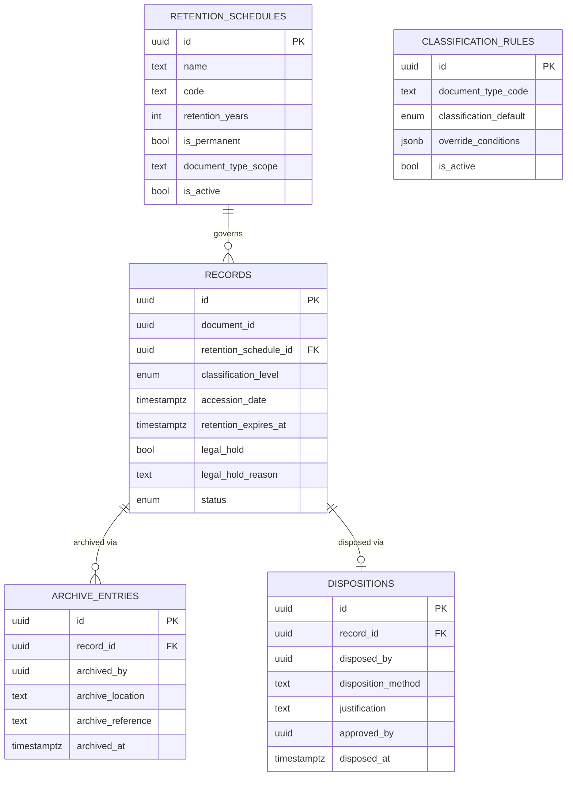
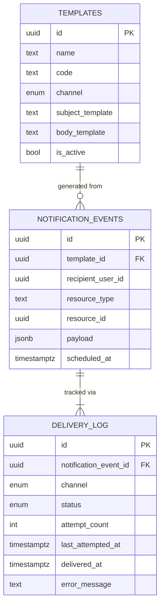
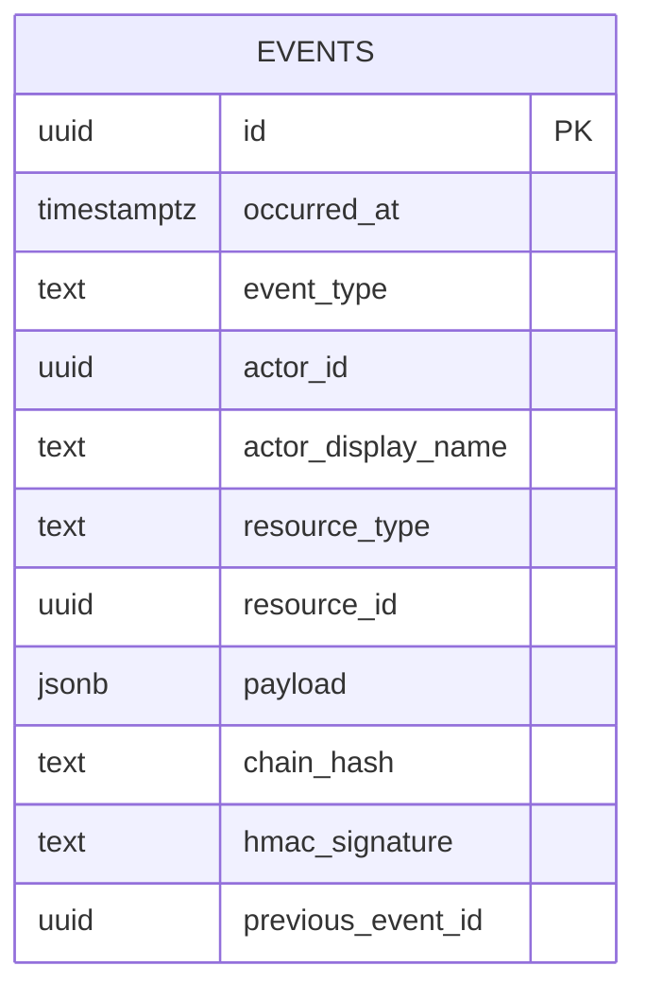

# C2. Entity-Relationship Diagrams — Per Schema

**Document:** C2 **Platform:** Batac City LGU Platform **Status:** Pre-development baseline **Last Updated:** June 2026 **Audience:** Backend development team; LGU IT Office (DBA reviewers) **Prerequisite:** C1 Full Database Schema DDL

---

## Source Coverage and Confidence

The C1 DDL provided covers **three of eight** Phase 1 schemas in full. ERD fidelity varies by schema:

|Schema|Tables|ERD Basis|Confidence|
|---|---|---|---|
|`public`|1|C1 DDL §0.5|Confirmed|
|`iam`|9|C1 DDL Part 2|Confirmed|
|`organization`|7|C1 DDL Part 3|Confirmed|
|`documents`|8|C1 DDL Part 4|Confirmed|
|`workflow`|7|Architecture ref Part 11.3; C1 §1.7, §1.9; B4 spec (cited in C1)|[Inference]|
|`tracking`|3|Architecture ref Parts 11.6, 4.5; C1 §1.6|[Inference]|
|`records`|5|Architecture ref Parts 11.7, 10.2|[Inference]|
|`notifications`|3|Architecture ref Parts 10.2, 11.3|[Inference]|
|`audit`|1|Architecture ref Part 11.11; C1 §1.5, §0.2|[Inference]|

Every column, relationship, and cardinality claim in `workflow`, `tracking`, `records`, `notifications`, and `audit` is labeled **[Inference]** and must be validated against confirmed DDL before implementation. The `[Inference]` label on a section heading covers all content within that section; individual claims are not re-tagged line-by-line.

---

## Notation and Conventions

### Relationship Cardinality

|Symbol|Reads as|
|---|---|
|`\|`|Exactly one|
|`o\|`|Zero or one|
|`o{`|Zero or many|
|`\|{`|One or many|

Combined on a line: `A \|\|--o{ B` = "one A has zero or many B."

### Column Key Tags

|Tag|Meaning|
|---|---|
|`PK`|Primary key (`id UUID DEFAULT gen_random_uuid()` on every table)|
|`FK`|Real, named `FOREIGN KEY` constraint exists (same-schema only, per Architectural Invariant #1)|
|_(no tag)_|Plain data column — **or** a logical cross-schema reference (no DB constraint). Logical FKs are identified in the Logical FK Index table below each diagram.|

### Columns Omitted from Every Entity Box

These columns are present on all 49 tables (per C1 Conventions §1.3–1.5) and are not repeated in individual entity boxes to keep diagrams readable:

- `uuid city_id` — tenant isolation anchor; no FK constraint (multi-tenant sentinel, not a row in this schema)
- `timestamptz created_at DEFAULT now()`
- `timestamptz updated_at DEFAULT now()` — managed by `public.fn_set_updated_at()` trigger; **omitted on append-only tables**: `tracking.routing_entries`, `workflow.workflow_events`, `notifications.delivery_log`, `audit.events`
- `timestamptz deleted_at NULL`
- `uuid deleted_by NULL` — logical FK to `iam.users.id` (blanket rule per C1 §1.6)

### Cross-Schema Logical FKs

Columns referencing rows in a different schema carry no `REFERENCES` clause (Architectural Invariant #1). They are plain `UUID` columns and appear without an `FK` tag in the entity box. Each schema section includes a **Logical FK Index** listing them. Cross-schema relationship lines are **not drawn** in the Mermaid diagrams; they appear only in the Logical FK Index tables and in the Cross-Schema Reference Summary at the end of this document.

### Standard Primary Key

Every table: `id UUID PRIMARY KEY DEFAULT gen_random_uuid()`. Shown as `uuid id PK` in every entity box.

---

## Infrastructure: Schema `public`

One shared table, not owned by any module. Stores failed event handler invocations for operator review and retry. Source: C1 §0.5 (ADR-B2-1).

No relationships — this table is written to by any module whose event handler fails and is read only by platform operators. It intentionally has no FK constraints to any module's tables (those tables may not exist at the point of failure).

---

## Schema: `iam`

**Source: C1 DDL Part 2 — Confirmed. 9 tables.**

**Module responsibility:** User identity, Argon2id credential management, single-active-session enforcement, JWT/refresh-token rotation, role and permission resolution, MFA enrollment (Phase 1 wired, Phase 2 enforced).

**Enums defined in this schema:** `user_status_enum` (`active`, `inactive`, `suspended`, `deactivated`), `mfa_type_enum` (`totp`), `session_termination_reason_enum` (`user_logout`, `forced`, `timeout`), `permission_decision_enum` (`allow`, `deny`, `conditional`).

**Outbound logical FKs (cross-schema):** `role_assignments.office_scope_id` → `organization.offices.id`. All other references go the other direction — every other module references _into_ `iam.users`, not out of it.

### Logical FK Index — `iam`

|Column|Table|Target (cross-schema)|Notes|
|---|---|---|---|
|`office_scope_id`|`role_assignments`|`organization.offices.id`|NULL = city-wide, unscoped assignment; NULL is coalesced to a sentinel UUID in the partial unique index|

### Join Table Annotations — `iam`

**`iam.role_permissions`** — Annotated columns:

|Column|Type|Semantics|
|---|---|---|
|`decision`|`permission_decision_enum`|`allow` or `deny` are straightforward. `conditional` requires `condition_reference` to be non-NULL (enforced by `ck_role_permissions_condition_required`).|
|`condition_reference`|`TEXT NULL`|Key into the I1 ABAC policy table. Only present when `decision = 'conditional'`. References a named policy expression that the ABAC engine evaluates at request time.|

**`iam.role_assignments`** — Annotated columns:

|Column|Type|Semantics|
|---|---|---|
|`office_scope_id`|`UUID NULL`|Scopes a role to a specific office. NULL = city-wide assignment. Partial unique index: `(user_id, role_id, COALESCE(office_scope_id, '00000000...'))` WHERE `is_active = true AND deleted_at IS NULL`. The NULL-to-sentinel coalesce prevents two unscoped assignments of the same role to the same user from slipping past Postgres's "NULLs are always distinct" unique-index behaviour.|
|`assigned_by`|`UUID NULL FK`|Nullable to accommodate bootstrap seed assignments (no human assigner exists yet). Real FK to `iam.users`.|
|`is_active`|`BOOLEAN`|`false` + `revoked_at IS NOT NULL` = revoked assignment. CHECK constraint `ck_role_assignments_revocation_consistency` enforces this pair. No `updated_at` — the revocation fields are themselves the timestamped record of the only state change this row undergoes.|

**`iam.sessions`** — Dual-FK note: `user_id` (owner) and `terminated_by` both reference `iam.users.id`. Only the ownership line is drawn in the diagram above; `terminated_by` is a same-schema real FK used specifically when `termination_reason = 'forced'` (IT/security admin force-terminates). The CHECK constraint `ck_sessions_termination_consistency` enforces `terminated_at IS NULL ↔ termination_reason IS NULL`.

**`iam.refresh_tokens`** — `replaced_by_token_id` is a self-referential FK within the same table, forming a singly-linked chain of rotated tokens. `session_id` is nullable: a refresh token may exist independently of a session row (e.g., issued before session tracking was introduced, or in a recovery flow). The diagram shows the `SESSIONS ||--o{` line with the understanding that session_id is nullable on refresh_tokens.

---

## Schema: `organization`

**Source: C1 DDL Part 3 — Confirmed. 7 tables.**

**Module responsibility:** Office hierarchy, employee identity records, position assignments, standing committee structure, and delegation management (Designation documents). First-class module — `delegation_grants` is written 10+ times per year (routine Acting Mayor designations).

**Enums defined in this schema:** `office_type_enum` (`sp_office`, `mayors_office`, `city_department`, `barangay`, `other`) [Unverified values — C1 §3.1 placeholder pending B1/B5 confirmation], `authority_level_enum` (`executive`, `managerial`, `staff`, `support`) [Unverified values], `committee_role_enum` (`chairman`, `vice_chairman`, `member`) [Confirmed — D4].

**Inbound logical FKs from other schemas:** `iam.role_assignments.office_scope_id`, `documents.documents.originating_office_id`, `documents.documents.owned_by_office_id`, `documents.number_series.authority_office_id`, `workflow.instances.owning_office_id` [Inference], `tracking.routing_entries.from_office_id` [Inference], `tracking.routing_entries.to_office_id` [Inference].

### Logical FK Index — `organization`

|Column|Table|Target (cross-schema)|Notes|
|---|---|---|---|
|`user_id`|`employees`|`iam.users.id`|NULL for Barangay officials (no system access in Phase 1, architecture ref Part 4.4). UNIQUE constraint prevents one `iam.users` row from mapping to two `employees` rows.|
|`designation_document_id`|`delegation_grants`|`documents.documents.id`|The `D {YEAR}-{NN}` document evidencing this grant. Cross-schema; no DB constraint.|
|`revoked_by`|`delegation_grants`|`iam.users.id`|The user (IT admin or delegating authority) who revoked the grant early.|

### Join Table Annotations — `organization`

**`organization.delegation_grants`** — Annotated columns:

|Column|Type|Semantics|
|---|---|---|
|`delegating_employee_id`|`UUID NOT NULL FK`|The authority who issued the Designation (Mayor or Vice Mayor, depending on scope). Real FK to `organization.employees`. D4 models parties as `Employee`, not `User`; this document follows D4 since `employees` is the table in this schema.|
|`delegated_to_employee_id`|`UUID NOT NULL FK`|The person receiving the designation. Cannot equal `delegating_employee_id` (`ck_delegation_grants_distinct_parties`).|
|`valid_until`|`DATE NOT NULL`|`NOT NULL` by design — open-ended delegations are prohibited (architecture ref Part 11.13). Workflow routing returns to the original authority automatically at midnight on `valid_until`.|
|`is_active`|`BOOLEAN`|**Partial unique index:** `(delegated_to_employee_id)` WHERE `is_active = true AND deleted_at IS NULL`. This directly implements Architectural Invariant #16: at most one active delegation per person at any time.|
|`revoked_at`|`TIMESTAMPTZ NULL`|Populated by early revocation only. Normal expiry is handled by the scheduler checking `valid_until`; `revoked_at` is only set when a delegation is cancelled mid-period by the delegating authority.|

**`organization.committee_memberships`** — Annotated columns:

|Column|Type|Semantics|
|---|---|---|
|`committee_role`|`committee_role_enum`|`chairman`, `vice_chairman`, or `member`. A person's role on a committee can change over time (e.g., Member → Vice Chairman) — each change produces a new row (`is_active` on the old row set to false, new row inserted).|
|`is_active`|`BOOLEAN`|**Partial unique index:** `(committee_id, employee_id)` WHERE `is_active = true AND deleted_at IS NULL`. Exactly one active membership row per person per committee at any time.|

**`organization.assignments`** — Singular positions (Mayor, Vice Mayor, SP Secretary) have no "only one active holder" DB constraint. `positions` has no `is_singular` flag, and a blanket unique index would incorrectly block the 12 simultaneous Councilor assignments. The "exactly one active holder" invariant for singular positions is an application-level concern enforced by `Organization.resolveCurrentHolder()` (B2 Published API), not a DB constraint. `[Inference — C1 §3.5 note]`

---

## Schema: `documents`

**Source: C1 DDL Part 4 — Confirmed. 8 tables.**

**Module responsibility:** Document lifecycle state machine, immutable version storage, two-stage series numbering (preliminary `Draft` → final), OCR-on-upload, QR cover sheet generation, Panlalawigan review log, scanned signature tracking.

**Enums defined in this schema:** `lifecycle_state_enum` (`draft`, `submitted`, `in_workflow`, `pending_approval`, `completed`, `released`, `archived`, `disposed`, `cancelled`), `classification_level_enum` (`public`, `internal`, `confidential`, `restricted`), `public_visibility_rule_enum` (`title_and_first_page_public`, `not_public`, `complainant_restricted`, `requester_restricted`), `owning_module_enum` (all 11 module names), `number_type_enum` (`preliminary`, `final`), `attachment_type_enum` (`certification_of_urgency`, `committee_report`, `transmittal_letter`, `scan`, `other`), `signature_type_enum` (`presiding_officer`, `mayor`, `sp_secretary`, `vice_mayor`, `committee_chair`), `panlalawigan_outcome_enum` (`valid`, `valid_in_part`, `returned`, `operative_in_its_entirety`, `deemed_approved`), `scan_quality_category_enum` (`good`, `fair`, `poor`).

**State-transition enforcement:** `documents.lifecycle_state` transitions are enforced by a `BEFORE UPDATE` trigger (`fn_enforce_document_lifecycle_transition`), not a plain `CHECK` constraint (plain CHECK cannot see `OLD` values). The same trigger enforces `final_number` immutability — once non-NULL, any attempt to change it raises an exception.

### Logical FK Index — `documents`

|Column|Table|Target (cross-schema)|Notes|
|---|---|---|---|
|`retention_schedule_id`|`document_types`|`records.retention_schedules.id`|NULL until activation (Architectural Invariant #11). Application enforces non-NULL before `is_active = true`.|
|`authority_office_id`|`number_series`|`organization.offices.id`|SP Secretariat for all 11 Phase 1 series (H3 Global Field Values).|
|`originating_office_id`|`documents`|`organization.offices.id`|SP Secretariat for SP workflow docs; sender's office for SPR letters received. NOT NULL.|
|`owned_by_office_id`|`documents`|`organization.offices.id`|Office currently responsible for the document. NOT NULL.|
|`created_by`|`documents`|`iam.users.id`|NOT NULL.|
|`workflow_instance_id`|`documents`|`workflow.instances.id`|NULL for document types with no associated workflow.|
|`retention_schedule_id`|`documents`|`records.retention_schedules.id`|NOT NULL — every document is governed by a schedule from creation.|
|`uploaded_by`|`versions`|`iam.users.id`|NOT NULL.|
|`uploaded_by`|`attachments`|`iam.users.id`|NOT NULL.|
|`assigned_by`|`numbers`|`iam.users.id`|NOT NULL — Secretariat actor who triggered number assignment.|
|`signed_by_employee_id`|`signatures`|`organization.employees.id`|NOT NULL. Follows D4's `Employee` (not `User`) reference, since employees may sign without having a platform login (e.g., Mayor who exists as employee before account activation).|

### Bidirectional Optional Link: `document_types` ↔ `number_series`

This relationship deserves a full note. Two nullable FKs point at each other:

- `document_types.number_series_id` → `number_series.id` (nullable; document types without numbering, e.g., `CERTIFICATION_OF_URGENCY`, set this to NULL)
- `number_series.(city_id, document_type_code)` → `document_types.(city_id, code)` (nullable composite FK; the `panlalawigan_review_log` series has no `document_types` row)

The FK for `document_types.number_series_id` is added via `ALTER TABLE` **after** `number_series` is created, breaking the circular DDL dependency. The diagram shows this as `o|--o|` (zero or one on both sides). The UNIQUE constraint on `number_series.document_type_code` ensures the link is 1:1 when present.

### Join Table Annotations — `documents`

**`documents.numbers`** — Number history log (append-with-one-flag-flip semantics):

|Column|Type|Semantics|
|---|---|---|
|`number_type`|`number_type_enum`|`preliminary` or `final`. A document cycles through `preliminary` rows first, then exactly one `final` row.|
|`number_value`|`TEXT`|Rendered format string, e.g., `Draft 7SP 2026-02` or `7SP 2026-01`.|
|`sequence_year`|`SMALLINT`|The calendar year component, used as part of the uniqueness constraint.|
|`sequence_number`|`INTEGER`|The raw integer from the PostgreSQL sequence. UNIQUE constraint scoped to `(series_id, sequence_year, sequence_number)` — not to `number_value` alone, since two series can legitimately render the same text.|
|`is_current`|`BOOLEAN`|**Partial unique index:** `(document_id, number_type)` WHERE `is_current = true AND deleted_at IS NULL`. At most one current preliminary and one current final per document. Superseded preliminary numbers have `is_current = false` and `superseded_at` set.|
|`cancellation_reason`|`TEXT NULL`|Non-NULL only for cancelled numbers. Gaps in sequences are permitted only for cancelled documents; the reason is mandatory and logged here.|

No `updated_at` — rows are written once and transition `is_current = true → false` via `superseded_at` (itself the timestamped record of that change). Treated as append-only-with-one-flag-flip.

**`documents.panlalawigan_reviews`** — One row per document (UNIQUE on `document_id`):

|Column|Type|Semantics|
|---|---|---|
|`control_number`|`TEXT NULL`|**Not unique** — the Panlalawigan frequently acts on multiple SP documents under one shared batch reference (architecture ref Part 4.3). Nullable: assigned by SP Secretariat when the document is transmitted, not at document creation.|
|`outcome`|`panlalawigan_outcome_enum NULL`|NULL until the Panlalawigan acts or 30 days elapse. The scheduler sets this to `deemed_approved` at day 30 with no response; SP Secretary confirms.|
|`days_elapsed`|`INTEGER NULL`|Computed by application on outcome receipt. Used for reporting and for the 30-day timer display on the SP Secretary dashboard.|

**`documents.document_types`** — `required_step_types JSONB NULL` is a `[Gap-fill]` addition: B2's `DocumentTypeSummary.requiredStepTypes` is returned by the Published API, and B4's "legally mandated minimum steps" (Architectural Invariant #14) needs concrete storage. This column gives the workflow-editor validation logic somewhere to read from. The eight Phase 1 document types and their values are defined in H2.

**`documents.versions`** — `scan_quality_score NUMERIC(4,3)` is a 0.0–1.0 confidence value from the OCR engine. The `scan_quality_category` enum (`good`, `fair`, `poor`) is derived by application logic at OCR-completion time against the `OCR_QUALITY_THRESHOLD` environment variable — not a DB generated column (a `GENERATED ALWAYS` column cannot read an env var). Both are stored: the numeric score for threshold re-evaluation if the threshold changes; the category for immediate UI display.

---

## Schema: `workflow` [Inference]

**Source: Architecture reference Part 11.3; C1 DDL §1.7 (composite FK on `transition_rules`), §1.9 (tables with state-transition triggers), §1.6 (JSONB `assigned_to` on `step_instances`); B4 workflow engine spec (cited in C1 as the authoritative data model). 7 tables.**

**Every claim in this section is [Inference]. Validate against confirmed DDL before implementation.**

**Module responsibility:** Workflow definition versioning, branching step configuration, per-document workflow instance lifecycle, step-instance execution and assignment, SLA tracking, event log.

**Phase 1 step types (confirmed from architecture ref Part 11.3):** `action`, `approval`, `multi_referral`, `decision`, `notification`, `termination`. `parallel_split` and `parallel_join` are reserved in the data model for Phase 2 and are values in the step type enum but not exercised in Phase 1.

**State-transition enforcement:** `workflow.instances.status` and `workflow.step_instances.status` both have `BEFORE UPDATE` trigger functions for state-transition validation (named explicitly in C1 §1.9). The specific allowed transitions are [Inference] pending B4 confirmation.

**Composite FK on `transition_rules`:** C1 §1.7 explicitly states that `transition_rules.from_step_id` and `to_step_id` use a **composite FK** against `workflow.steps (definition_version_id, id)` rather than a simple FK against `workflow.steps(id)`. This converts B4 Engine Invariant #12 ("no transition may point to a step from a different definition version") from an application check into a DB-enforced constraint. The diagram represents these as FK-tagged columns; the composite nature is noted here.

### Logical FK Index — `workflow`

|Column|Table|Target (cross-schema)|Notes|
|---|---|---|---|
|`document_type_id`|`definitions`|`documents.document_types.id`|Links a workflow definition to the document type it governs.|
|`document_id`|`instances`|`documents.documents.id`|Confirmed cross-schema reference: `documents.documents.workflow_instance_id` is the inverse logical FK. NOT NULL — every instance is attached to a document.|
|`cancelled_by`|`instances`|`iam.users.id`|NULL unless cancelled.|
|`actor_id`|`workflow_events`|`iam.users.id`|The user whose action generated the event. NULL for system-generated events (timer expiry, SLA breach).|
|`bypassed_by`|`step_instances`|`iam.users.id`|SP Secretary override — NULL unless the step was manually advanced past a missing committee report. When non-NULL, `bypass_comment` must also be non-NULL.|

### Step Type Annotations — `workflow`

**`workflow.steps.assignee_config JSONB`** — Configuration varies by `step_type`. Confirmed structural implications:

|`step_type`|Expected `assignee_config` shape|
|---|---|
|`action` / `approval`|`{ "role_code": "sp_secretary" }` or similar|
|`multi_referral`|`{ "committee_ids": ["uuid", "uuid", ...], "all_must_contribute": true }` — all assigned committees must sign the unified report before the step completes (architecture ref Part 8.3)|
|`decision`|`{ "condition_key": "mayor_10_day_lapse" }` or similar|
|`notification`|`{ "template_code": "step_assigned", "recipient_role": "..." }`|

**`workflow.step_instances.assigned_to JSONB`** — Confirmed as a JSONB array by C1 §1.6 (`assigned_to[].user_id`). For `multi_referral` steps, each element tracks both a committee and whether that committee has contributed to the unified report. Shape [Inference]: `[{ "committee_id": "uuid", "user_id": "uuid", "contributed": false, "contributed_at": null }]`.

**`workflow.instances`** — Version pinning: `definition_version_id` is a real same-schema FK. An instance is pinned to the definition version active at the moment it was created (architecture ref Part 11.3). In-flight migration (Option A / Option B) is an application-layer operation, not handled by a DB constraint.

**`workflow.workflow_events`** — Append-only. No `updated_at`. `step_instance_id` is nullable: instance-level events (e.g., `instance.cancelled`, SLA breach notification) are not tied to any single step and have NULL `step_instance_id`.

---

## Schema: `tracking` [Inference]

**Source: Architecture reference Parts 11.6, 4.5; C1 §1.6 (QR code tracking number on `documents.documents`). 3 tables.**

**Every claim in this section is [Inference]. Validate against confirmed DDL before implementation.**

**Module responsibility:** QR code generation at secretariat logging, physical routing history, scan-to-lookup, document tracking status. The `qr_tracking_number` UUID column on `documents.documents` is the cross-schema anchor; it uniquely identifies a document for scanning without exposing its series number.

### Logical FK Index — `tracking`

|Column|Table|Target (cross-schema)|Notes|
|---|---|---|---|
|`document_id`|`qr_codes`|`documents.documents.id`|Cross-schema anchor. `documents.documents.qr_tracking_number` (UUID, UNIQUE) contains the QR payload; `qr_codes.tracking_number` (TEXT, formatted `DTS-{YEAR}-{SEQUENCE}`) is the display reference. These are distinct: one is the UUID in the QR image, the other is the human-readable label.|
|`document_id`|`tracking_records`|`documents.documents.id`|One tracking record per document (UNIQUE on `document_id`).|
|`current_custodian_office_id`|`tracking_records`|`organization.offices.id`|Updated on every routing event. NULL if document is with an external party.|
|`generated_by`|`qr_codes`|`iam.users.id`|Secretariat staff member who triggered QR generation at logging.|
|`from_office_id`|`routing_entries`|`organization.offices.id`|Origin of this routing step. NULL at the first entry (initial receipt).|
|`to_office_id`|`routing_entries`|`organization.offices.id`|Destination. NULL when document leaves to an external party.|
|`actor_id`|`routing_entries`|`iam.users.id`|Staff member who performed the routing action.|

### Annotations — `tracking`

**`tracking.routing_entries`** — Append-only. No `updated_at`. Every physical movement of a document creates a new row; rows are never updated or soft-deleted in normal operation (the no-hard-delete invariant still applies, but `deleted_at` is structurally inert for this table in practice — deleting a routing entry would break the chain).

**`tracking.qr_codes`** — QR assignment occurs at secretariat logging, **before** the preliminary number is assigned (architecture ref Part 11.6: "QR code assigned → Preliminary Draft number assigned" in the sequence). The QR tracking number (UUID content of the QR image) is immutable for the document's life; the display `tracking_number` string (`DTS-{YEAR}-{SEQUENCE}`) is assigned from its own sequence at the same moment.

**Scan result fields** — When a QR is scanned, the application joins `qr_codes → tracking_records → routing_entries` and `qr_codes.document_id → documents → versions` (for first-page preview) to produce the scan result: document type, remarks, routing history, and first page visible (all other pages blurred).

---

## Schema: `records` [Inference]

**Source: Architecture reference Parts 11.7, 10.2. 5 tables.**

**Every claim in this section is [Inference]. Validate against confirmed DDL before implementation.**

**Module responsibility:** Retention schedule definitions, records accession, archive management, classification rules, and disposition records. Phase 2 in full, but `retention_schedules` is a Phase 1 dependency (both `documents.document_types.retention_schedule_id` and `documents.documents.retention_schedule_id` are logical FKs into this schema, and Architectural Invariant #11 requires a retention schedule before a document type can be activated).

### Logical FK Index — `records`

|Column|Table|Target (cross-schema)|Notes|
|---|---|---|---|
|`document_id`|`records`|`documents.documents.id`|The digital record corresponding to a document. One record per document (UNIQUE on `document_id`).|
|`archived_by`|`archive_entries`|`iam.users.id`|Records Officer who performed the archival action.|
|`disposed_by`|`dispositions`|`iam.users.id`|Records Officer who initiated the disposition. Explicit Records Officer action required; no automated disposal.|
|`approved_by`|`dispositions`|`iam.users.id`|Supervisor who approved the disposition. May equal `disposed_by` depending on role configuration.|

### Annotations — `records`

**`records.retention_schedules`** — Phase 1 dependency. This table must be seeded before Phase 1 document types can be activated (Architectural Invariant #11). SP Resolutions and Ordinances are `is_permanent = true` (architecture ref Part 11.7: "Permanent [CONFIRMED]"). No automated disposal is permitted — every disposition requires an explicit Records Officer action with mandatory justification.

**`records.records.legal_hold`** — A document under legal hold cannot have its retention schedule shortened. This column is set by the Records Officer (or City Legal, depending on role configuration) and checked by the disposition workflow before permitting a `DISPOSITIONS` row to be created.

**`records.classification_rules`** — Administrator-configurable (Tier 2, architecture ref Part 11.21). The `override_conditions` JSONB encodes conditions under which a document receives a classification level different from the default for its type (e.g., an Ordinance that also contains PII is escalated to `confidential`). The evaluation of these conditions is an application-layer concern.

---

## Schema: `notifications` [Inference]

**Source: Architecture reference Parts 10.2, 11.3 (in-app notifications, email, SSE). 3 tables.**

**Every claim in this section is [Inference]. Validate against confirmed DDL before implementation.**

**Module responsibility:** Notification template management, event-triggered notification dispatch, delivery tracking across channels (in-app SSE, email, SMS — SMS Phase 3). The real-time push channel is Server-Sent Events (SSE); no WebSocket infrastructure (architecture ref, stack context).

### Logical FK Index — `notifications`

|Column|Table|Target (cross-schema)|Notes|
|---|---|---|---|
|`recipient_user_id`|`notification_events`|`iam.users.id`|The platform user who should receive this notification. NULL for system broadcast events.|
|`resource_id`|`notification_events`|Varies by `resource_type`|Polymorphic reference — e.g., `resource_type = 'document'` means `resource_id` references `documents.documents.id`. No DB constraint possible; resolved by application.|

### Annotations — `notifications`

**`notifications.delivery_log`** — Append-only. No `updated_at`. Each delivery attempt creates a new row. `attempt_count` on the log row represents attempts for _that_ delivery event, not the total across retries (a failed event creates a new `NOTIFICATION_EVENTS` row for retry, not a new `DELIVERY_LOG` row against the old one).

**`notifications.templates.channel`** enum — Phase 1 values: `in_app`, `email`. Phase 3 addition: `sms`. The column type should be administrator-extensible (text-based, not a native ENUM) per architecture ref Part 11.21 (new notification channels are a developer-tier change, but making this a native enum locks that behind a migration — the tension is worth resolving explicitly in DDL).

---

## Schema: `audit` [Inference]

**Source: Architecture reference Part 11.11; C1 DDL §0.2 (role permissions), §1.5 (structurally inert `deleted_at`/`deleted_by`). 1 table.**

**Every claim in this section is [Inference] except the role-level enforcement described below, which is confirmed from C1 §0.2 and §1.5. Validate column-level DDL before implementation.**

**Module responsibility:** Append-only, hash-chained, HMAC-signed audit event log. INSERT-only at the database role level (`audit_user` has INSERT and SELECT only on this schema; UPDATE and DELETE are explicitly revoked even though they are not granted by default — as a documentation-level statement of intent, per C1 §0.2 and §9).

**Tamper-evidence guarantee:** The audit log is tamper-_evident_, not tamper-_proof_ (architecture ref Part 11.11). A broken hash chain is detectable at retrieval time. An attacker with both DB write access and the HMAC secret key could in principle forge a valid entry — this is acknowledged and documented as out of scope for the implementation.

No relationships are drawn — `audit.events` intentionally has no FK constraints to any other schema (Architectural Invariant #1 applies; additionally, an audit event must be writable even if the referenced resource has been soft-deleted or otherwise made inaccessible).

### Logical FK Index — `audit`

|Column|Table|Target (cross-schema)|Notes|
|---|---|---|---|
|`actor_id`|`events`|`iam.users.id`|NULL for system-generated events (scheduler actions, automated timer expiry).|
|`resource_id`|`events`|Varies by `resource_type`|Polymorphic. No DB constraint.|
|`previous_event_id`|`events`|`audit.events.id` (self)|The UUID of the preceding event in the chain. NULL for the genesis record. Stored alongside `chain_hash` for chain traversal — `chain_hash` itself encodes `SHA-256(previous_chain_hash + current_payload)`, so the UUID is a convenience pointer, not the integrity mechanism itself.|

### Annotations — `audit`

**Column `deleted_at` / `deleted_by`** — Present on `audit.events` for schema-wide tooling consistency (C1 §1.5: "structurally inert"). `audit_user` holds INSERT-only rights; no role capable of executing `UPDATE` on this table in normal operation exists. These columns should never be populated. Their presence is explicitly flagged as inert in the DDL and documented here to prevent confusion.

**`actor_display_name TEXT NOT NULL`** — Denormalized at write time (C1's blanket convention for actor display names, per H2 Implementation Note 5). The `iam.users` record for `actor_id` may be renamed or deactivated after the event is recorded; the display name in the audit log is the immutable record of who acted at the moment of action.

**Always-audited events** (cannot be disabled, per architecture ref Part 11.11): all authentication events; all document state changes; all approval actions; all delegation grants/revocations; all role assignments/revocations; all bulk operations; all exports; all session terminations; all workflow definition publishes/deprecations; all Option B migration executions; all RA 10173 erasure actions; all Secretariat Approve/Reject/Amended logging actions.

**Monthly external timestamp** — A monthly export to an RFC 3161 Timestamp Authority (TSA) extends the tamper-evidence guarantee to cover bulk deletion of recent records. Provider TBD. This is an application-layer operation (a scheduled job), not a DB-layer concern.

---

## Cross-Schema Reference Summary

All logical FK columns across all eight schemas, consolidated. Grouped by target schema. Every cell here represents a `UUID` column with no DB constraint (Architectural Invariant #1).

### Targeting `iam.users`

|Column|Source Table|Notes|
|---|---|---|
|`assigned_by`|`iam.role_assignments`|Nullable (bootstrap seed)|
|`revoked_by`|`iam.role_assignments`|Nullable|
|`created_by`|`documents.documents`|NOT NULL|
|`uploaded_by`|`documents.versions`|NOT NULL|
|`uploaded_by`|`documents.attachments`|NOT NULL|
|`assigned_by`|`documents.numbers`|NOT NULL|
|`revoked_by`|`organization.delegation_grants`|Nullable|
|`published_by`|`workflow.definition_versions`|[Inference]|
|`cancelled_by`|`workflow.instances`|[Inference], nullable|
|`actor_id`|`workflow.workflow_events`|[Inference], nullable (system events)|
|`bypassed_by`|`workflow.step_instances`|[Inference], nullable|
|`generated_by`|`tracking.qr_codes`|[Inference]|
|`actor_id`|`tracking.routing_entries`|[Inference]|
|`archived_by`|`records.archive_entries`|[Inference]|
|`disposed_by`|`records.dispositions`|[Inference]|
|`approved_by`|`records.dispositions`|[Inference]|
|`recipient_user_id`|`notifications.notification_events`|[Inference], nullable|
|`actor_id`|`audit.events`|[Inference], nullable|
|`deleted_by`|all 49 tables|Blanket convention per C1 §1.6|

### Targeting `organization.offices`

|Column|Source Table|Notes|
|---|---|---|
|`office_scope_id`|`iam.role_assignments`|Nullable; NULL = city-wide|
|`originating_office_id`|`documents.documents`|NOT NULL|
|`owned_by_office_id`|`documents.documents`|NOT NULL|
|`authority_office_id`|`documents.number_series`|NOT NULL|
|`current_custodian_office_id`|`tracking.tracking_records`|[Inference], nullable|
|`from_office_id`|`tracking.routing_entries`|[Inference], nullable|
|`to_office_id`|`tracking.routing_entries`|[Inference], nullable|

### Targeting `organization.employees`

|Column|Source Table|Notes|
|---|---|---|
|`signed_by_employee_id`|`documents.signatures`|NOT NULL|

### Targeting `documents.documents`

|Column|Source Table|Notes|
|---|---|---|
|`designation_document_id`|`organization.delegation_grants`|NOT NULL — the evidencing Designation document|
|`workflow_instance_id`|`documents.documents`|Nullable — NULL for doc types with no workflow|
|`document_id`|`tracking.qr_codes`|[Inference]|
|`document_id`|`tracking.tracking_records`|[Inference]|
|`document_id`|`records.records`|[Inference]|

### Targeting `documents.document_types`

|Column|Source Table|Notes|
|---|---|---|
|`document_type_id`|`workflow.definitions`|[Inference]|

### Targeting `records.retention_schedules`

|Column|Source Table|Notes|
|---|---|---|
|`retention_schedule_id`|`documents.document_types`|Nullable until activation; Invariant #11|
|`retention_schedule_id`|`documents.documents`|NOT NULL|

### Targeting `workflow.instances`

|Column|Source Table|Notes|
|---|---|---|
|`workflow_instance_id`|`documents.documents`|Nullable; the inverse logical FK|

---

_This document is the C2 deliverable. It lists C1 as its prerequisite and is itself a prerequisite for C3 (RLS Policy Specifications) and C4 (Index Strategy Document). The five [Inference] schemas must be updated to [Confirmed] status once their DDL sections are added to C1 and reviewed._