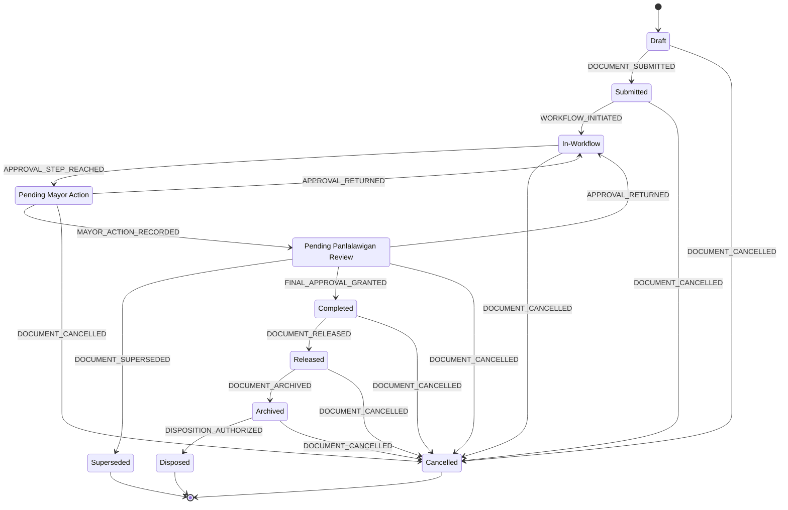
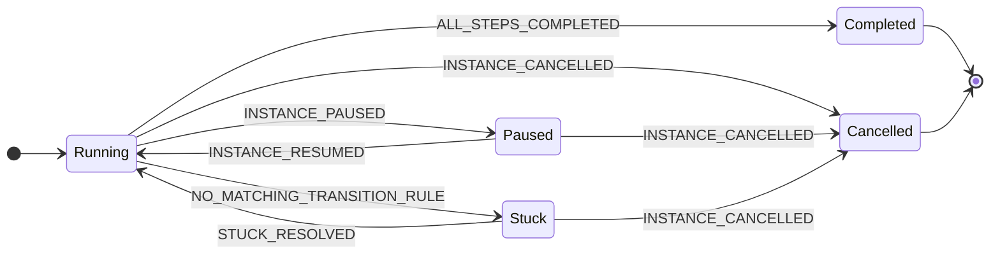
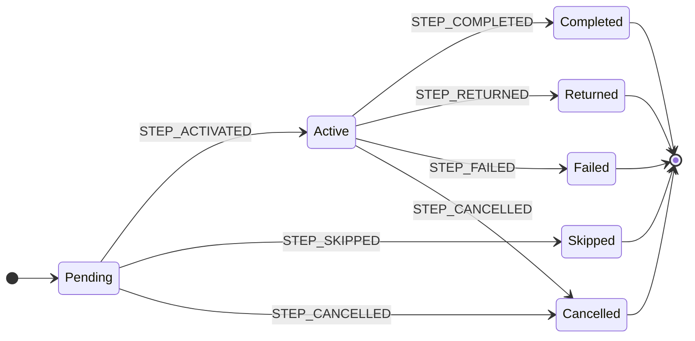

# D3. State Machine Diagrams — Iteration 2 (Post-Triage)

**Document ID:** D3 **Status:** All Appendix C items resolved — Ready for migration authoring, pending human engineering-lead sign-off on ADR-016 **Platform:** Batac City LGU Platform **Last Updated:** June 2026 **Audience:** Backend development team **Source Documents:** `consolidated-architecture-and-requirements-reference-iteration-3.md` (Parts 4, 5, 8, 11, 12); `b4-workflow-engine-specification.md` (Sections 2, 3, 4, 6); ADR-013, ADR-014, ADR-015, ADR-016 (this revision implements all four)

**Status change from Iteration 1:** All seven items in the prior Appendix C ("Open Items") are now resolved via ADR-013 through ADR-016. This document is no longer blocking on open questions. It remains subject to the same B4 reconciliation requirement described in Appendix B — B4 must still be physically updated to match these enum values before the first migration is written; that work is tracked separately and is not itself blocked by anything in this document.


## Table of Contents

- [L27–L46] Overview — Introduces the three state machines, database columns, cardinality, and epistemic status conventions for transitions and guards.
- [L47–L160] 1. Document Lifecycle State Machine — Overall milestone status definitions and reachability rules for document records of all types.
  - [L61–L106] 1.1 Diagram — Mermaid state diagram visualising all lifecycle states and transitions.
  - [L107–L122] 1.2 State Definitions — Detailed definition of all lifecycle states, including newly added Pending Panlalawigan Review and Superseded states.
  - [L123–L148] 1.3 Transition Table — Events, guard conditions, and rationale for all lifecycle transitions, revised for post-triage updates.
  - [L149–L160] 1.4 Notes — Key system invariants including directionality constraints, QR code immutability, and document numbering checkpoints.
- [L161–L237] 2. Workflow Instance State Machine — State machine governing the execution, pause, stuck, and SLA tracking behavior of running workflow instances.
- [L238–L330] 3. Workflow Step Instance State Machine — State machine for individual step execution, defining step states, routing bypasses, returns, and engine failure handling.
- [L331–L342] Appendix A: Terminal State Summary — Summary of terminal states for all machines and the soft-delete invariant rule.
- [L343–L373] Appendix B: B4 Reconciliation — Required Changes — Required enum name, casing, and schema changes to align the B4 specification with D3 authority.
- [L374–L391] Appendix C: Open Items — Resolution Record — Historical resolution record of the seven open architecture items settled by ADR-013 through ADR-016.
- [L392–L455] Appendix D: Proposed PostgreSQL Enum Stubs — PostgreSQL DDL enum stubs and new column definitions required on the documents table.

---

---

## Overview

Three state machines govern the core domain objects. They operate at distinct levels of abstraction and must be kept conceptually separate.

|#|Machine|DB Location|Cardinality per document|
|---|---|---|---|
|1|Document Lifecycle|`documents.documents.lifecycle_status`|Exactly one state at all times|
|2|Workflow Instance|`workflow.instances.status`|Zero or one active instance|
|3|Workflow Step Instance|`workflow.step_instances.status`|Zero or more; at most one in `Active` in Phase 1|

**Epistemic conventions:**

- State names and their set membership are derived from the consolidated reference (Part 11.4) and the stated requirements for this document. They are **the authoritative definitions** that B4 and the Drizzle schema must conform to.
- Specific triggering event names (e.g., `DOCUMENT_SUBMITTED`) are architectural naming decisions made here; they become domain event constants.
- Guard conditions and transition semantics derived from domain knowledge rather than verbatim stakeholder statements are labeled `[Inference]`.
- Items confirmed in stakeholder interviews are labeled `[CONFIRMED]`.
- Items decided by the development team during this triage round (not stakeholder-confirmed) are labeled `[Decision — ADR-XXX]` and cite the relevant ADR.

---

## 1. Document Lifecycle State Machine

Represents the overall milestone status of a document record. Applies generically to all document types: SP Resolutions, Ordinances, Appropriation Ordinances, Letters, Memos, Designations, Notices, Complaints, and all others. Workflow step granularity is tracked in the workflow engine, not here.

**State set, revised per ADR-013 and ADR-014:** `Draft`, `Submitted`, `In-Workflow`, `Pending Mayor Action`, `Pending Panlalawigan Review`, `Completed`, `Released`, `Archived`, `Disposed`, `Cancelled`, `Superseded`.

This replaces the Iteration 1 state set, which had a single `Pending Approval` state and no `Superseded` state. `[Decision — ADR-013, ADR-014]`

**Terminal states:** `Disposed`, `Cancelled`, `Superseded`. All others are non-terminal.

**Cancelled reachability confirmed:** "Cancelled is a terminal state reachable from any active state by an authorized actor." Source: consolidated reference Part 11.4. `[CONFIRMED]`

**Superseded reachability:** `Superseded` is reachable only from `Pending Panlalawigan Review`, and only via the specific `DOCUMENT_SUPERSEDED` event described in ADR-014. It is not a general-purpose terminal state reachable from arbitrary states the way `Cancelled` is. `[Decision — ADR-014]`

### 1.1 Diagram



### 1.2 State Definitions

|State|Description|Terminal|
|---|---|---|
|`Draft`|Document authored by initiating party (Councilor, SP staff, Vice Mayor, citizen) but not yet formally submitted to the SP Secretariat. May exist only as a physical draft or an unsubmitted digital form entry.|No|
|`Submitted`|Document physically or digitally received by the SP Secretariat. Not yet formally logged: no QR code, no preliminary number, no workflow instance. Secretariat has acknowledged receipt but has not completed intake.|No|
|`In-Workflow`|Formally logged by the Secretariat. QR code assigned. Preliminary Draft number assigned (for document types that use preliminary numbering). Workflow instance created (see Part 2 below for instance-creation modeling). Document is actively progressing through internal workflow steps (committee referral, readings, VP certification, transmittal). `[CONFIRMED — consolidated ref Part 11.6]`|No|
|`Pending Mayor Action`|All internal workflow steps completed. VP has signed the certified copy and the Transmittal Letter to Mayor has been generated. Document awaiting the Mayor's 10-day review window (RA 7160 §47/§54): sign, veto, or lapse. Final series number already assigned at this point (assigned post-last-reading vote, before VP and Mayor sign). `[Decision — ADR-013, resolving the prior` [Inference] `exact-step-mapping question]`|No|
|`Pending Panlalawigan Review`|Mayor has acted (signed, lapsed, or veto-override succeeded). Document has been transmitted to the Sangguniang Panlalawigan and is within its 30-day review window (RA 7160 §56(d)). Sequence confirmed: "Transmission occurs AFTER Mayor action." Source: consolidated reference Part 4.3. `[CONFIRMED — Part 4.3; state split decided in ADR-013]`|No|
|`Completed`|All required external approvals obtained or statutory lapses recorded. For SP Resolutions and Ordinances: Mayor has signed (or 10-day lapse per RA 7160 §47 recorded, or veto override succeeded), and Panlalawigan has returned VALID, VALID-IN-PART (resolved per Part 4.3's VALID-IN-PART handling), OPERATIVE-IN-ITS-ENTIRETY, or DEEMED APPROVED (30-day lapse per RA 7160 §56(d)). `[Inference: that Panlalawigan outcome is a precondition for this state for Resolutions and Ordinances — unchanged from Iteration 1]`|No|
|`Released`|Docketed by Secretariat. Published to public portal (title and first page visible). Formally disseminated to relevant parties. For penalty ordinances: newspaper publication date recorded (mandatory field). `[CONFIRMED — consolidated ref Parts 4.2, 5.3]`|No|
|`Archived`|Permanently stored by Records Officer. Retention schedule set and confirmed. Searchable and retrievable but not modifiable via normal workflow operations.|No|
|`Disposed`|Authorized disposition executed after retention period elapsed. Disposition creates an audit record; no data is deleted. Document record permanently retained. `[CONFIRMED — consolidated ref Part 11.7]` Not applicable to documents with permanent retention (SP Resolutions, Ordinances).|Yes|
|`Cancelled`|Cancelled by an authorized actor. Document record permanently retained; no deletion. Numbers already assigned are flagged as cancelled with a gap record; they are never reused **except in the single Panlalawigan-RETURNED-and-repassed scenario governed by `Superseded` below, which is a different terminal state from `Cancelled` and is reached by a different event.** Cancellation reason is mandatory. `[CONFIRMED — consolidated ref Part 11.7, Part 5.2; exception scoped by ADR-014]`|Yes|
|`Superseded`|Reached only from `Pending Panlalawigan Review`, when the Panlalawigan returns a RETURNED outcome and the SP Secretary initiates repass. The document's final number is **reserved** (not released back to the live sequence, and not immediately reused) for the new document created in its place. `superseded_by`, `closure_reason`, and `superseded_at` are set. This is distinct from `Cancelled`: the document was not withdrawn or rejected outright — it is administratively closed because a successor document now carries its legislative intent forward. See ADR-014 for the full mechanism, including the formal amendment to the "final numbers never reused" invariant that this state's existence requires. `[Decision — ADR-014]`|Yes|

### 1.3 Transition Table

All triggering event names and guard conditions are `[Inference]` derived from domain knowledge in the consolidated reference unless noted otherwise. Rows unchanged from Iteration 1 are marked accordingly; rows new or modified by this revision are marked per their governing ADR.

|From|To|Event|Guard Conditions|Notes|
|---|---|---|---|---|
|`Draft`|`Submitted`|`DOCUMENT_SUBMITTED`|Submitting actor is authorized to submit this document type; minimum required fields present|Unchanged from Iteration 1. Physical submission to Secretariat is standard. Digital submission via system form is also valid (three access modes for complaints and document requests). `[CONFIRMED — Part 4.15]`|
|`Submitted`|`In-Workflow`|`WORKFLOW_INITIATED`|Secretariat staff completes formal intake action; a published and active workflow definition version exists for this document type|Unchanged from Iteration 1. QR code assigned first (before any number). Preliminary Draft number assigned in same action for Resolutions and Ordinances. Source: consolidated ref Part 11.6, Part 5.2. `[CONFIRMED]`|
|`In-Workflow`|`Pending Mayor Action`|`APPROVAL_STEP_REACHED`|All preceding internal workflow steps have reached a terminal state (Completed, Skipped, or Returned per the step-instance machine in Part 3); VP has signed certified copy; Transmittal Letter generated|**Renamed and rescoped from Iteration 1's `In-Workflow → Pending Approval` edge.** `[Decision — ADR-013]` Final series number already exists at this point.|
|`Pending Mayor Action`|`In-Workflow`|`APPROVAL_RETURNED`|Mayor vetoes; override vote step activates|**Rescoped from Iteration 1's `Pending Approval → In-Workflow` edge** to apply specifically to the Mayor leg. `[Decision — ADR-013]` If override fails, the document transitions to `Cancelled` via workflow termination, not back to `Pending Mayor Action`.|
|`Pending Mayor Action`|`Pending Panlalawigan Review`|`MAYOR_ACTION_RECORDED`|Mayor has signed, OR 10-day lapse recorded (RA 7160 §47), OR veto override succeeded (8/12 vote)|**New transition, not present in Iteration 1.** `[Decision — ADR-013]` Document is transmitted to Panlalawigan as part of the same step that fires this event (Part 4.3).|
|`Pending Mayor Action`|`Cancelled`|`DOCUMENT_CANCELLED`|Elevated authorization required; mandatory detailed reason; dedicated audit entry|Covers terminal veto override failure and administrative withdrawal during the Mayor wait. **Rescoped from Iteration 1's single `Pending Approval → Cancelled` row.** `[Decision — ADR-013]`|
|`Pending Panlalawigan Review`|`In-Workflow`|`APPROVAL_RETURNED`|Panlalawigan RETURNED outcome, where the team has decided to handle this specific instance via direct repass-without-supersession (rare; the standard path is the `Superseded` transition below) — OR VALID-IN-PART outcomes routed to Legal Office or concerned Committee for revision (Part 4.3) that do not require a new document record|`[Decision — ADR-013 establishes this edge exists; the specific guard distinguishing "repass via supersession" from "repass via simple loop-back" is an open implementation detail not fully specified by ADR-014, which assumes supersession is the standard path for RETURNED outcomes. VALID-IN-PART's "implement revisions directly without repassing" path (Part 4.3) plausibly uses this edge rather than supersession, since no new document is created in that case — but this was not separately confirmed and should be checked during workflow definition authoring.]`|
|`Pending Panlalawigan Review`|`Superseded`|`DOCUMENT_SUPERSEDED`|Panlalawigan outcome is RETURNED; SP Secretary initiates repass via the supersession mechanism (ADR-014); new document record created and linked|**New transition, not present in Iteration 1; this is the standard path for a RETURNED outcome leading to repass.** `[Decision — ADR-014]` The document's final number is reserved per ADR-014, not released to the live sequence.|
|`Pending Panlalawigan Review`|`Completed`|`FINAL_APPROVAL_GRANTED`|Panlalawigan returns VALID, VALID-IN-PART (resolved), OPERATIVE-IN-ITS-ENTIRETY, or DEEMED APPROVED (30-day lapse, RA 7160 §56(d))|**Rescoped from Iteration 1's `Pending Approval → Completed` edge.** `[Decision — ADR-013]` Legal bases unchanged: Mayor lapse = RA 7160 §47; Panlalawigan 30-day lapse = RA 7160 §56(d). `[CONFIRMED — consolidated ref Parts 4.1, 4.2, 4.3]`|
|`Pending Panlalawigan Review`|`Cancelled`|`DOCUMENT_CANCELLED`|Elevated authorization required; mandatory reason|Administrative withdrawal during the Panlalawigan wait. **Rescoped from Iteration 1's single `Pending Approval → Cancelled` row.** `[Decision — ADR-013]`|
|`Completed`|`Released`|`DOCUMENT_RELEASED`|Secretariat docketing step complete; portal publication configured; for penalty ordinances: newspaper publication date is recorded (mandatory field)|Unchanged from Iteration 1. SP Secretariat arranges newspaper placement for penalty ordinances (Ilocos Times). `[CONFIRMED — consolidated ref Part 4.2, Part 5.3]`|
|`Released`|`Archived`|`DOCUMENT_ARCHIVED`|Records Officer performs archiving action; retention schedule set and confirmed|Unchanged from Iteration 1. SP Resolutions and Ordinances: permanent retention. `[CONFIRMED — consolidated ref Part 11.7]`|
|`Archived`|`Disposed`|`DISPOSITION_AUTHORIZED`|Retention period elapsed per schedule; document not under legal hold; Records Officer has recorded a mandatory non-empty comment; no automated disposal — explicit authorized action required|Unchanged from Iteration 1. `[CONFIRMED — consolidated ref Part 11.7]` Not reachable for SP Resolutions and Ordinances (permanent retention).|
|`Draft`|`Cancelled`|`DOCUMENT_CANCELLED`|Actor has cancellation authority for this document type; mandatory cancellation reason recorded|Unchanged from Iteration 1. No preliminary number assigned yet; no gap record needed.|
|`Submitted`|`Cancelled`|`DOCUMENT_CANCELLED`|Actor has cancellation authority; mandatory reason|Unchanged from Iteration 1. No gap record needed.|
|`In-Workflow`|`Cancelled`|`DOCUMENT_CANCELLED`|Actor has cancellation authority; mandatory reason|Unchanged from Iteration 1. Preliminary Draft number gap logged if applicable. Associated workflow instance also receives `INSTANCE_CANCELLED`.|
|`Completed`|`Cancelled`|`DOCUMENT_CANCELLED`|Elevated authorization required; mandatory detailed reason; dedicated audit entry|Unchanged from Iteration 1. Unusual case. Final series number retained with cancellation flag.|
|`Released`|`Cancelled`|`DOCUMENT_CANCELLED`|Elevated authorization required; mandatory reason; portal publication must be retracted|Unchanged from Iteration 1. Extremely rare.|
|`Archived`|`Cancelled`|`DOCUMENT_CANCELLED`|Records Officer authorization; highest authority required; mandatory detailed comment|Unchanged from Iteration 1. Effectively a reclassification, not a deletion.|

### 1.4 Notes

**No transition backwards through the main chain**, with one narrow exception introduced by ADR-013/014. The lifecycle states are milestones. There is no `Released → Completed`, `Archived → Released`, or similar reversal. When a Panlalawigan outcome requires internal rework, the workflow engine routes back through `In-Workflow` via the `APPROVAL_RETURNED` edges defined above — or, for the standard RETURNED-and-repass case, through the new `Superseded` terminal state and a fresh document record, rather than reverting the original record's own lifecycle state to `Draft`. `[Decision — ADR-013, ADR-014, closing the O-1/O-2 ambiguity that Iteration 1 left as` [Inference — unresolved]`]`

**`Disposed` is permanently unreachable for SP Resolutions and Ordinances** under current retention policy (permanent retention confirmed in consolidated reference Part 11.7). Unchanged from Iteration 1.

**QR code survives all lifecycle states**, including the new `Superseded` state. The QR tracking number assigned during `WORKFLOW_INITIATED` persists through every subsequent state. It is immutable. Source: consolidated reference Part 11.6. `[CONFIRMED]` Note that the **superseding** document receives its own, separate, newly-assigned QR tracking number at its own `WORKFLOW_INITIATED` event — QR numbers are never shared across the two document records in a supersession chain, only the reserved final series number is shared (per ADR-014). `[Decision — ADR-014; this clarification was not explicit in the original ADR text and is added here for schema-design clarity, consistent with Part 11.6's "QR tracking number completely independent of preliminary number, final number, and control number."]`

**Numbering checkpoint within the lifecycle.** The preliminary Draft number is assigned during `WORKFLOW_INITIATED` (start of `In-Workflow`). The final series number is assigned after the last reading vote — which occurs _while_ the document is in `In-Workflow` state, before `APPROVAL_STEP_REACHED` fires. The document enters `Pending Mayor Action` with the final series number already set. The "Draft" prefix is removed at this assignment. Source: consolidated reference Parts 5.1, 5.2, 11.5. `[CONFIRMED]` **Exception per ADR-014:** if the document later reaches `Superseded`, its final number is reserved rather than gap-logged in the ordinary cancellation sense, and is assigned to a successor document upon that successor's own approval — see ADR-014 for the full mechanism and the explicit amendment to Part 5.2/11.5's "never reused" rule that this requires.

---

## 2. Workflow Instance State Machine

Represents the execution state of a workflow instance (`workflow.instances`). One instance exists per document per workflow execution. The instance is the running process that advances through step instances.

**State set, revised per ADR-015 and ADR-016:** `Running`, `Paused`, `Stuck`, `Completed`, `Cancelled`.

This replaces the Iteration 1 state set, which included a discrete `Created` state and did not include `Stuck`. `Created` is removed (ADR-016); `Stuck` is added (ADR-016). No `Repassed` state is added (ADR-015) — see §2.4 below for how repass is represented at this layer.

**Terminal states:** `Completed`, `Cancelled`. `Stuck` and `Paused` are both non-terminal and recoverable.

> **B4 reconciliation status:** B4 currently defines `active`, `suspended`, `stuck`, `completed`, `cancelled`. Per ADR-016, B4's existing `stuck` value is retained as-is (renamed casing only, to `Stuck`) rather than removed — this is a change from Iteration 1's framing, which had treated `stuck`'s fate as still open. `active` and `suspended` are renamed `Running` and `Paused` per the unchanged Iteration 1 reconciliation requirement. `Created` is **not** added to B4 — per ADR-016, the engine's existing same-transaction creation-and-activation behavior (B4 Section 3.2) is retained unmodified; only the conceptual/documentation framing changes, since B4 never actually persisted a discrete `created` value mid-transaction in the first place.

### 2.1 Diagram



### 2.2 State Definitions

|State|Description|Terminal|
|---|---|---|
|`Running`|**Initial state, per ADR-016.** The instance record is committed to the database, its workflow definition version is pinned (`definition_version_id` set, immutable except via Option B migration), its SLA deadline is computed and stored, and its first step instance is activated, all within the same transaction. There is no separate pre-`Running` state; `Created` (as drafted in Iteration 1) is removed because nothing in the engine's actual transactional design ever produces an observable row in that state. `[Decision — ADR-016]` Corresponds to B4's `active` status, renamed.|No|
|`Paused`|Workflow is temporarily suspended. No step instances are `Active`. **The ARTA SLA clock continues running, unmodified, during `Paused` — it does not pause.** This was previously an open policy question (Iteration 1 Appendix C, O-3); it is now resolved: `Paused` is treated identically to a system outage for SLA purposes, consistent with consolidated reference Part 11.15 ("ARTA compliance obligations do not pause during system outages"). `[Decision — team policy choice; see ADR-013's "Related, separately-decided item" section for the full reasoning and the legal-review caveat.` [Inference] `— not a verified legal conclusion.]` Known trigger: administration transition — when the next step requires Mayor action and no active Mayor account exists, the instance auto-pauses until the new Mayor's account is activated. Source: consolidated reference Part 11.13. Corresponds to B4's `suspended` status, renamed.|No|
|`Stuck`|**New state, per ADR-016.** Transition evaluation found no matching rule for the most recently completed step's outcome code. The instance is not progressing and is not paused by any deliberate action — it is broken. SLA clock continues running (same rule as `Paused`, and as system outages generally). Requires Platform Administrator intervention: either a corrected workflow definition is published and the instance re-evaluates, or the administrator manually routes the step, with a mandatory audit-logged comment either way. `[Decision — ADR-016]` Corresponds to B4's existing `stuck` status.|No|
|`Completed`|The workflow's `termination` step has been reached and executed. All step instances are in terminal states. The engine emits the appropriate terminal document lifecycle event (`DOCUMENT_RELEASED`, `DOCUMENT_ARCHIVED`, etc.) depending on the termination outcome code. Unchanged from Iteration 1.|Yes|
|`Cancelled`|Cancelled by an authorized actor before reaching a `termination` step. All `Active` and `Pending` step instances receive `STEP_CANCELLED` in the same transaction. The associated document lifecycle transitions to `Cancelled`. Mandatory cancellation reason required. Unchanged from Iteration 1.|Yes|

### 2.3 Transition Table

`[Inference]` applies to all events and guard conditions unless noted.

|From|To|Event|Guard Conditions|Notes|
|---|---|---|---|---|
|_(creation)_|`Running`|_(instance creation, no separate event)_|Workflow definition version is published, active, and current; document is in `In-Workflow` lifecycle state; the start step's assignee is resolvable from current organization state|**Replaces Iteration 1's `Created → Running` / `INSTANCE_STARTED` pair.** `[Decision — ADR-016]` First step instance is created with status `Active` and `started_at = NOW()`, in the same transaction as the instance row itself.|
|`Running`|`Paused`|`INSTANCE_PAUSED`|Admin or system-level trigger; pause reason logged|Unchanged from Iteration 1. Known triggers: (1) Platform Administrator explicitly pauses for error correction. (2) System auto-pauses when a Mayor review step becomes the next step to activate and no active Mayor account is present.|
|`Running`|`Stuck`|`NO_MATCHING_TRANSITION_RULE`|A step transitions to `Completed`, `Skipped`, or `Returned` with an outcome code for which the published workflow definition has no corresponding transition rule|**New transition, per ADR-016.** Distinct from `Paused`: nobody chose to pause this instance, the engine simply has nowhere to route it.|
|`Running`|`Completed`|`ALL_STEPS_COMPLETED`|The `termination` step type has been activated and executed; all step instances are in terminal states|Unchanged from Iteration 1. Triggers a document lifecycle event based on the termination step's `outcome_code`.|
|`Running`|`Cancelled`|`INSTANCE_CANCELLED`|Authorized actor; mandatory cancellation reason|Unchanged from Iteration 1.|
|`Paused`|`Running`|`INSTANCE_RESUMED`|Pause condition is resolved; admin authorization to resume|Unchanged from Iteration 1.|
|`Paused`|`Cancelled`|`INSTANCE_CANCELLED`|Authorized actor; mandatory cancellation reason|Unchanged from Iteration 1.|
|`Stuck`|`Running`|`STUCK_RESOLVED`|Platform Administrator publishes a corrected workflow definition version covering the missing outcome code, OR manually routes the step to a specific next step, with a mandatory non-empty comment either way|**New transition, per ADR-016.**|
|`Stuck`|`Cancelled`|`INSTANCE_CANCELLED`|Authorized actor; mandatory cancellation reason|**New transition, per ADR-016.** Covers the case where a stuck instance is abandoned rather than repaired.|

### 2.4 Notes

**Version pinning is immutable.** Unchanged from Iteration 1. At instance creation, `instances.definition_version_id` is set to the current published version. This pin never changes except via the explicit Option B in-flight migration. Source: B4 Section 7.1. `[CONFIRMED — consolidated ref Part 11.3]`

**ARTA SLA clock is not suspended by system outages, `Paused`, or `Stuck`.** Unchanged in spirit from Iteration 1's outage statement, now explicitly extended to cover the two non-terminal recoverable states added or retained by ADR-016: "ARTA compliance obligations do not pause during system outages." The SLA clock runs continuously regardless of system availability or instance health. `[CONFIRMED for outages — consolidated ref Part 11.15; Decision for Paused/Stuck — ADR-013's SLA note, ADR-016]`

**Repass is represented entirely at the document layer, not here.** When a Panlalawigan RETURNED outcome leads to repass via supersession (ADR-014), the **original** instance's status is left completely unchanged — it remains `Running` indefinitely, with no event fired against it as a consequence of the repass. A **new** instance is created for the new document, starting at `Running` per the normal creation path above. The only place "this instance's document is dead" is recorded is `documents.superseded_by`, joined against this instance's `document_id`. `[Decision — ADR-015]` This is a deliberate choice to avoid growing this enum with a sixth, repass-specific value; see ADR-015 for the full reasoning and its acknowledged downside (a `Running` instance whose document has been superseded is misleading if read without the join).

---

## 3. Workflow Step Instance State Machine

Represents the execution state of a single step within a workflow instance (`workflow.step_instances`). One step instance is created per step execution attempt. Step instances are **not reused** across attempts: if a step is returned and the workflow later re-enters that step position (revision loop), a new step instance is created for the next attempt. This keeps the audit trail clean and immutable. Unchanged from Iteration 1.

**State set, revised per ADR-016:** `Pending`, `Active`, `Completed`, `Skipped`, `Returned`, `Failed`, `Cancelled`.

This adds `Failed` to the Iteration 1 set (`Pending`, `Active`, `Completed`, `Skipped`, `Returned`, `Cancelled`). `[Decision — ADR-016]`

**Terminal states:** `Completed`, `Skipped`, `Returned`, `Failed`, `Cancelled`. None of these have outgoing transitions.

> **B4 reconciliation status:** B4 currently defines `pending`, `active`, `completed`, `bypassed`, `cancelled`, `failed`. `bypassed` must still be renamed `Skipped`; `Returned` must still be added — both unchanged requirements from Iteration 1. `failed` is **retained** (renamed casing only, to `Failed`) rather than removed, per ADR-016 — this is a change from Iteration 1's framing, which had left `failed`'s fate open.

### 3.1 Diagram



### 3.2 State Definitions

|State|Description|Terminal|
|---|---|---|
|`Pending`|Step instance created. Preceding step(s) have not yet reached a terminal state. Assignee may or may not be resolvable yet. The step is queued but not yet the engine's active focus. Unchanged from Iteration 1.|No|
|`Active`|Step is the current step being executed. Assignee resolved and stored in `assigned_to`. Assignee notified. For `action` and `approval` step types: waiting for actor input. For `decision` and `notification` step types: system processes and completes the step immediately on activation. Unchanged from Iteration 1.|No|
|`Completed`|The step's required action has been performed and recorded. `outcome`, `completed_at`, and `actor_id` are set. Transition evaluation runs against the step's outcome code to determine the next step to activate. If transition evaluation finds no matching rule, the **instance** (not this step) transitions to `Stuck` per Part 2 of this document — the step itself remains `Completed`; the absence of a matching rule is an instance-level condition, not a defect in the step's own record. Unchanged from Iteration 1, with this `Stuck`-interaction clarification added per ADR-016.|Yes|
|`Skipped`|Step bypassed without execution. No actor action taken. `bypassed_at`, `bypass_reason`, and optionally `bypassed_by` are set. Used for: (1) decision routing — steps on the branch not taken are Skipped. (2) Certified Urgent path — the `multi_referral` committee referral step is Skipped entirely. (3) SP Secretary manual bypass via `bypassStep`. Source: consolidated reference Part 11.3, Part 4.17. `[CONFIRMED]` Corresponds to B4's `bypassed` status. Unchanged from Iteration 1.|Yes|
|`Returned`|Step explicitly returned by the assigned actor. Applies to `approval` step type only. The actor has determined the document needs revision at a prior step. The workflow engine activates the designated prior step (as a new step instance). The current step instance remains `Returned` permanently — it is the historical record of this return action. `outcome_comment` is mandatory. Unchanged from Iteration 1. `[Inference: Returned as a distinct state; B4 currently models this as Completed with RETURNED_FOR_REVISION outcome; see Appendix B]`|Yes|
|`Failed`|**New state, per ADR-016.** An internal engine error occurred during step execution — not an actor decision, not a routing outcome, but a defect in the engine's own processing of the step (e.g., an unhandled exception while resolving the assignee, evaluating a condition expression, or writing required side effects). `failed_at` and an internal error reference are recorded. Triggers immediate alerting per B4 Section 2.8's original definition. The parent instance transitions to `Stuck` as a direct consequence, since a `Failed` step produces no valid outcome code for the instance's transition evaluation to act on. `[Decision — ADR-016]` Corresponds to B4's existing `failed` status.|Yes|
|`Cancelled`|Step cancelled. Either the parent workflow instance was cancelled while this step was `Active` or `Pending`, or an admin explicitly cancelled an active step. At most one step can be `Active` in Phase 1 at any time; all `Pending` steps are bulk-cancelled when the instance is cancelled. Unchanged from Iteration 1.|Yes|

### 3.3 Transition Table

`[Inference]` applies to all events and guard conditions unless noted. All rows below are unchanged from Iteration 1 except the new `Active → Failed` row.

|From|To|Event|Guard Conditions|Applies To|Notes|
|---|---|---|---|---|---|
|`Pending`|`Active`|`STEP_ACTIVATED`|All preceding step(s) in terminal state (Completed, Skipped, Returned, or Failed); workflow transition rules evaluated and a matching rule points to this step; assignee resolvable from current organization state|All step types|Unchanged from Iteration 1, with `Failed` added to the preceding-terminal-state check per ADR-016. Hearing date for committee referral steps can begin as "assigned; date TBD." Source: consolidated ref Part 4.10. `[CONFIRMED]`|
|`Pending`|`Skipped`|`STEP_SKIPPED`|A `decision` step upstream evaluated a routing condition that bypasses this step; OR the Certified Urgent flag is active and this step is a `multi_referral` committee referral step; OR admin invokes `bypassStep` with a mandatory non-empty reason|All step types|Unchanged from Iteration 1.|
|`Pending`|`Cancelled`|`STEP_CANCELLED`|Parent workflow instance has received `INSTANCE_CANCELLED`|All step types|Unchanged from Iteration 1.|
|`Active`|`Completed`|`STEP_COMPLETED`|(a) For `action`: actor in `assigned_to` performs the required action. (b) For `approval`: actor records an explicit outcome from `allowed_outcomes`. (c) For `multi_referral`: all assigned committees have submitted contributions AND SP Secretary has accepted the unified report, OR manual override. (d) For `decision`: system evaluates condition expression. (e) For `notification`: notification enqueued. (f) For `termination`: step auto-completes on activation.|All step types|Unchanged from Iteration 1.|
|`Active`|`Returned`|`STEP_RETURNED`|Step type is `approval`; actor in `assigned_to` explicitly returns the document for revision; mandatory non-empty `outcome_comment`; workflow definition specifies a designated prior step to re-activate|`approval` only|Unchanged from Iteration 1.|
|`Active`|`Failed`|`STEP_FAILED`|An unhandled internal engine error occurs during step processing (assignee resolution, condition evaluation, side-effect writes, etc.) — not an actor-submitted outcome and not a routing decision|All step types|**New row, per ADR-016.** Distinct from `STEP_RETURNED` (an actor's deliberate choice) and from a vote outcome like `REJECTED` (a valid, expected outcome that still completes the step normally) — `Failed` represents the engine itself breaking, not a legitimate result the workflow anticipated.|
|`Active`|`Cancelled`|`STEP_CANCELLED`|Parent workflow instance receives `INSTANCE_CANCELLED` while this step is `Active`; OR admin explicitly cancels via `bypassStep` with a mandatory reason|All step types|Unchanged from Iteration 1.|

### 3.4 Step Type Interaction Notes

Unchanged from Iteration 1, except that every step type can now also transition `Active → Failed` per the new row above (not separately tabulated per type, since an internal engine error is not specific to any one step type's business logic).

|Step Type|Activation Behavior|Who Triggers `Completed`|Can Transition to `Returned`?|Phase|
|---|---|---|---|---|
|`action`|Assignee notified; awaits actor input|Actor|No|1|
|`approval`|Assignee notified; awaits explicit decision|Actor (or scheduler for `LAPSED`/`DEEMED_APPROVED`)|**Yes**|1|
|`multi_referral`|All assigned committees notified; each contributes to unified report; Thursday cutoff tracked|SP Secretary (after all submissions received, or via manual override)|No|1|
|`decision`|System evaluates condition immediately on activation|System (no actor)|No|1|
|`notification`|System enqueues notification immediately on activation|System (no actor)|No|1|
|`termination`|Auto-completes on activation; triggers `ALL_STEPS_COMPLETED` on instance|System (no actor)|No|1|
|`parallel_split`|Reserved|—|No|2 (schema reserved)|
|`parallel_join`|Reserved|—|No|2 (schema reserved)|

**`multi_referral` red-flag is not a state transition.** Unchanged from Iteration 1. Source: B4 Section 6.2 and consolidated ref Part 8.3. `[CONFIRMED]`

**Scheduler-set outcomes.** Unchanged from Iteration 1. Source: B4 Sections 6.3, 6.4. `[CONFIRMED — consolidated ref Parts 4.1, 4.2, 4.3]`

**Outcome codes for `approval` steps.** Unchanged from Iteration 1. Source: B4 Section 4.2.

---

## Appendix A: Terminal State Summary

|Machine|Terminal States|Non-Terminal States|
|---|---|---|
|Document Lifecycle|`Disposed`, `Cancelled`, `Superseded`|`Draft`, `Submitted`, `In-Workflow`, `Pending Mayor Action`, `Pending Panlalawigan Review`, `Completed`, `Released`, `Archived`|
|Workflow Instance|`Completed`, `Cancelled`|`Running`, `Paused`, `Stuck`|
|Workflow Step Instance|`Completed`, `Skipped`, `Returned`, `Failed`, `Cancelled`|`Pending`, `Active`|

**No document data is deleted in any terminal state.** Unchanged from Iteration 1. Soft-delete (`deleted_at` timestamp) is the only permitted deletion mechanism. Source: consolidated reference Parts 11.7, 12 (Invariant 2). `[CONFIRMED]`

---

## Appendix B: B4 Reconciliation — Required Changes

B4 (`b4-workflow-engine-specification.md`, Section 2.8) defines enum values that conflict with D3. D3 is authoritative. B4 must be updated before the first migration is written. This appendix reflects the resolution of every item that Iteration 1 had marked "team decision required."

### Workflow Instance Status Enum

|D3 State (authoritative)|B4 Current Value|Action Required|
|---|---|---|
|_(removed)_|_(not defined)_|`Created` is **not** added to B4. Per ADR-016, B4's existing same-transaction create-and-activate behavior (Section 3.2) is correct as-is and needs no schema change on this point — only this document's framing changes.|
|`Running`|`active`|**Rename** `active` → `Running` in B4 enum, all column references, and event payload references. Unchanged requirement from Iteration 1.|
|`Paused`|`suspended`|**Rename** `suspended` → `Paused` in B4 enum and all references. Unchanged requirement from Iteration 1.|
|`Completed`|`completed`|No change needed.|
|`Cancelled`|`cancelled`|No change needed.|
|`Stuck`|`stuck`|**Rename casing only** (`stuck` → `Stuck`). Resolved per ADR-016: retained, not removed. This closes the "team decision required" item from Iteration 1.|

### Workflow Step Instance Status Enum

|D3 State (authoritative)|B4 Current Value|Action Required|
|---|---|---|
|`Pending`|`pending`|No change needed.|
|`Active`|`active`|No change needed.|
|`Completed`|`completed`|No change needed.|
|`Skipped`|`bypassed`|**Rename** `bypassed` → `Skipped` in B4 enum and all references (column values, event payloads `workflow.step.bypassed`, B4 Section 4.3 metadata field `missed`, B4 Section 6.1 bypass logic). Unchanged requirement from Iteration 1.|
|`Returned`|_(not defined)_|**Add to B4 enum.** B4 currently models "returned for revision" as `Active → Completed` with `outcome = RETURNED_FOR_REVISION`, then routes to a prior step. D3 specifies `Returned` as a distinct terminal state. B4 Section 4.2 must be updated: when `outcome = RETURNED_FOR_REVISION`, the step transitions to `Returned` (not `Completed`). Unchanged requirement from Iteration 1.|
|`Failed`|`failed`|**Rename casing only** (`failed` → `Failed`). Resolved per ADR-016: retained, not removed. This closes the "team decision required" item from Iteration 1.|
|`Cancelled`|`cancelled`|No change needed.|

**All Iteration 1 "team decision required" markers in this appendix are now closed.** Remaining work is mechanical (renaming, adding the `Returned` value) and was already specified in Iteration 1 — none of it was blocked by Appendix C.

---

## Appendix C: Open Items — Resolution Record

**All seven items from Iteration 1 are now resolved.** This appendix is retained as a historical record of what was open and how each item was closed, consistent with the project's existing convention (see consolidated reference Part 14) of keeping a record of resolved questions rather than deleting them.

| #   | Item (as originally stated)                                                                                                                                                       | Resolution                                                                                                                                                                                                                                                                                                                                                                                                                 | Governing ADR      | Decided By                                 |
| --- | --------------------------------------------------------------------------------------------------------------------------------------------------------------------------------- | -------------------------------------------------------------------------------------------------------------------------------------------------------------------------------------------------------------------------------------------------------------------------------------------------------------------------------------------------------------------------------------------------------------------------- | ------------------ | ------------------------------------------ |
| O-1 | Exact mapping of `Pending Approval` to specific workflow steps per document type; specifically whether Panlalawigan review is tracked within `Pending Approval` or `In-Workflow`. | Split into two distinct states: `Pending Mayor Action` and `Pending Panlalawigan Review`, sequential, non-skippable.                                                                                                                                                                                                                                                                                                       | ADR-013            | Stakeholder                                |
| O-2 | How a Panlalawigan RETURNED → repass case is modeled in the document lifecycle (Option A: revert original; Option B: independent new document; Option C: hybrid).                 | Option C adopted: original document superseded (`superseded_by`, `closure_reason`); new document created, inherits content; **new document reuses the original's final number upon its own eventual approval** — this last point required a formal, explicitly-scoped amendment to the previously-stated "final numbers never reused" invariant (consolidated reference Part 5.2, 11.5, Part 12).                          | ADR-014            | Stakeholder                                |
| O-3 | Whether the ARTA SLA clock pauses when a workflow instance is `Paused`.                                                                                                           | Clock does **not** pause; treated identically to the existing system-outage rule (Part 11.15). `[Inference — team policy decision on a legal-interpretation question, not a verified legal conclusion; recommended for Legal/DPO review before Production Rollout per Part 11.19's general COA/Legal engagement requirement.]`                                                                                             | ADR-013 (SLA note) | Stakeholder                                |
| O-4 | Whether to add `Stuck` (instance) to D3 or remove it from B4.                                                                                                                     | Retained — added to D3, kept in B4 (renamed casing only). Decided jointly with O-5 as a coupled error-state pair, on the reasoning that an invisible error state would let broken instances masquerade as healthy in SLA/ARTA reporting.                                                                                                                                                                                   | ADR-016            | Claude, by explicit stakeholder delegation |
| O-5 | Whether to add `Failed` (step) to D3 or remove it from B4.                                                                                                                        | Retained — added to D3, kept in B4 (renamed casing only). See O-4.                                                                                                                                                                                                                                                                                                                                                         | ADR-016            | Claude, by explicit stakeholder delegation |
| O-6 | Whether `Created` (instance) should be a discrete state or collapse into `Running`.                                                                                               | Collapsed into `Running`. D3's own Iteration 1 text already established that B4's actual same-transaction implementation makes `Created` unobservable in practice; a state with no reachable database row was removed.                                                                                                                                                                                                     | ADR-016            | Claude, by explicit stakeholder delegation |
| O-7 | Whether `REPASSED` should produce a distinct terminal `Repassed` instance status, or leave the instance `Running`.                                                                | No `Repassed` status added. The original instance remains `Running` indefinitely; `documents.superseded_by` (from ADR-014) is the sole source of truth for "this instance's document is dead." Acknowledged downside: a `Running` instance whose document has been superseded is misleading if queried without joining to the document's `superseded_by` field — this is an accepted tradeoff, not a fully eliminated one. | ADR-015            | Stakeholder                                |

**Process note on attribution:** O-1, O-2, O-3, and O-7 were decided by the project stakeholder after this document's options were presented in conversation. O-4, O-5, and O-6 were decided by Claude under explicit delegated discretion ("for the items that you can decide what is the best according to your discretion do them"), with the reasoning presented back to the stakeholder and an explicit confirmation obtained before being finalized. None of the seven items were resolved by reference to any stakeholder interview (Interview 1, Interview 2) or prior developer-decision round — all are new team architecture decisions made during this triage session, and none should be mistaken for a confirmed stakeholder requirement from the underlying consolidated reference document.

---

## Appendix D: Proposed PostgreSQL Enum Stubs

These are the D3-authoritative enum definitions, revised to reflect ADR-013 through ADR-016. B4 must align to these values. These stubs are for reference; the actual migration SQL is produced from the Drizzle schema.

```sql
-- Machine 1: Document lifecycle
-- Column: documents.documents.lifecycle_status
-- Revised per ADR-013 (Pending Approval split) and ADR-014 (Superseded added)
CREATE TYPE document_lifecycle_status AS ENUM (
    'Draft',
    'Submitted',
    'In-Workflow',
    'Pending Mayor Action',
    'Pending Panlalawigan Review',
    'Completed',
    'Released',
    'Archived',
    'Disposed',
    'Cancelled',
    'Superseded'
);

-- Machine 2: Workflow instance
-- Column: workflow.instances.status
-- Revised per ADR-016 ('Created' removed, 'Stuck' added). No 'Repassed' value, per ADR-015.
CREATE TYPE workflow_instance_status AS ENUM (
    'Running',
    'Paused',
    'Stuck',
    'Completed',
    'Cancelled'
);

-- Machine 3: Workflow step instance
-- Column: workflow.step_instances.status
-- Revised per ADR-016 ('Failed' added).
CREATE TYPE workflow_step_status AS ENUM (
    'Pending',
    'Active',
    'Completed',
    'Skipped',
    'Returned',
    'Failed',
    'Cancelled'
);
```

**New columns required on `documents.documents`, per ADR-014 (not part of any enum, listed here for migration-planning visibility since they are introduced by the same triage round):**

```sql
ALTER TABLE documents.documents
    ADD COLUMN superseded_by UUID NULL REFERENCES documents.documents(id),
    ADD COLUMN previous_document_id UUID NULL REFERENCES documents.documents(id),
    ADD COLUMN closure_reason TEXT NULL,
    ADD COLUMN superseded_at TIMESTAMPTZ NULL;
```

`[Decision — ADR-014. The exact column set, nullability, and indexing strategy here are a reasonable first-pass translation of ADR-014's narrative description into DDL, but have not been independently reviewed against the rest of the` documents`schema (Part 10.2, Part 11.9) for naming consistency or additional constraints (e.g., should`superseded_by`and`previous_document_id `be mutually exclusive with any other state-tracking column already on the table?). Team should review before this migration is finalized.]`

**Check constraint pattern (state transition enforcement at DB level).** Unchanged from Iteration 1. The application workflow engine is the primary enforcement layer; PostgreSQL check constraints serve as a secondary defense, implemented via trigger or application-layer-only transition validation. Team to decide which approach is used for each table — this was not addressed by the present triage round and remains open as ordinary implementation work, not as a blocking item.

---

_This document supersedes D3 Iteration 1 and any conflicting state definitions in B4. It implements ADR-013, ADR-014, ADR-015, and ADR-016 in full. Changes to enum values, state names, or transition semantics beyond what these four ADRs specify require a new ADR and a corresponding revision entry here, dated and attributed, plus notification to all active implementers._
