# D4. Domain Class Diagram — Pre-Dev

**Scope:** All bounded contexts · 62 entities  
**Format:** Mermaid `classDiagram` · Domain model (not DB schema)  
**Status:** Pre-development baseline — Post-Interview 2 + Developer Decisions  
**Reference:** Consolidated Architecture & Requirements Reference, Iteration 3

## Table of Contents

- [L19–L33] Overview — Scope, guidelines for domain-level modeling, Phase 2/3 entity inclusion, and instructions for navigating the diagram.
- [L34–L43] Diagram Legend — Visual representation key explaining class diagram symbols for composition, association, and inheritance relationships.
- [L44–L547] Class Diagram — Single Mermaid class diagram containing 62 entities across 12 modules, representing the complete pre-development domain model.
- [L548–L617] Entity Index — Reference table mapping all 62 domain entities to their respective modules, database schemas, and implementation phases.
- [L618–L679] Key Enum Types — Tables of domain enum values categorized by document lifecycle, workflow engine, legislative, organization, complaints, notifications, and records.
- [L680–L713] Relationship Notes — Detailed architectural rules, invariants, and implementation notes for fifteen key entity relationships and domain behaviors.

---

## Overview

This document presents the core domain model for the Batac City LGU Platform as a single UML class diagram. It covers all domain entities drawn from the module schema map in Part 9 of the consolidated reference, supplemented by entities identified through stakeholder interviews (June 9 and June 15) and post-interview developer decisions.

This is a **domain model**, not a database schema diagram.

- Attribute types are domain types (`String`, `Date`, `DateTime`, `Boolean`, enums). No PostgreSQL-specific types appear.
- Multiplicities reflect confirmed business rules, not database constraint syntax.
- Phase 2 and Phase 3 entities are included and labeled in diagram section comments and the entity index. Their attributes are minimal — detailed domain modeling is deferred to their respective development phases.
- `MultiReferralStepInstance` is shown as a subtype of `WorkflowStepInstance`. The database implementation may use a discriminator column or a joined table; the domain model does not prescribe either.

For comfortable navigation of the diagram, paste the `mermaid` block into [Mermaid Live Editor](https://mermaid.live/).

---

## Diagram Legend

| Notation                  | Meaning                                                        |
| ------------------------- | -------------------------------------------------------------- |
| `A "1" *-- "*" B`         | Composition — B's lifecycle depends on A (filled diamond on A) |
| `A "*" --> "1" B : label` | Association — A holds a reference to B                         |
| `Parent <\|-- Child`      | Inheritance — Child is a specialisation of Parent              |

---

## Class Diagram

```mermaid
classDiagram

%% ============================================================
%% IAM — Identity and Access Management
%% Schema: iam
%% ============================================================

    class User {
        +String username
        +String email
        +UserStatus status
        +Boolean mfaEnabled
    }
    class Credential {
        +String passwordHash
        +DateTime lastChangedAt
    }
    class Role {
        +String name
        +String code
    }
    class Permission {
        +String resource
        +String action
    }
    class Session {
        +String sessionToken
        +DateTime expiresAt
        +String ipAddress
    }
    class RefreshToken {
        +String tokenHash
        +DateTime expiresAt
        +Boolean isRevoked
    }
    class MfaRecord {
        +MfaType type
        +Boolean isActive
    }

    User "1" *-- "1" Credential
    User "1" *-- "*" Session
    User "1" *-- "*" RefreshToken
    User "1" *-- "0..1" MfaRecord
    User "*" --> "*" Role : assigned
    Role "*" --> "*" Permission : grants

%% ============================================================
%% ORGANIZATION
%% Schema: organization
%% ============================================================

    class Office {
        +String name
        +String code
        +OfficeType type
    }
    class Position {
        +String title
        +String code
        +AuthorityLevel level
    }
    class Employee {
        +String employeeId
        +String firstName
        +String lastName
        +String email
        +String phoneNumber
    }
    class Assignment {
        +Date startDate
        +Date endDate
        +Boolean isActive
    }
    class DelegationGrant {
        +String scope
        +Date startDate
        +Date endDate
        +Boolean isActive
        +String legalBasis
    }
    class Committee {
        +String name
        +String code
    }
    class CommitteeMembership {
        +CommitteeRole role
        +Date startDate
        +Boolean isActive
    }

    Office "*" --> "0..1" Office : parentOf
    Office "1" *-- "*" Position
    Employee "1" --> "0..1" User : hasAccount
    Employee "1" *-- "*" Assignment
    Assignment "*" --> "1" Position : atPosition
    Assignment "*" --> "1" Office : inOffice
    DelegationGrant "*" --> "1" Employee : delegatedBy
    DelegationGrant "*" --> "1" Employee : delegatedTo
    DelegationGrant "*" --> "0..1" Document : evidencedBy
    Committee "1" *-- "*" CommitteeMembership
    CommitteeMembership "*" --> "1" Employee : member
    Committee "*" --> "1" Employee : chairedBy

%% ============================================================
%% DOCUMENTS
%% Schema: documents
%% ============================================================

    class DocumentType {
        +String name
        +String code
        +String prefix
        +Boolean hasWorkflow
        +Boolean requiresPublication
        +String retentionCategory
    }
    class NumberSeries {
        +String prefix
        +String formatPattern
        +Integer year
        +Integer currentSequence
        +SeriesType seriesType
    }
    class DocumentNumber {
        +String numberValue
        +NumberType type
        +DateTime assignedAt
        +Boolean isCurrent
    }
    class Document {
        +UUID trackingId
        +String title
        +DocumentStatus status
        +ClassificationLevel classificationLevel
    }
    class DocumentVersion {
        +Integer versionNumber
        +String fileKey
        +String mimeType
        +Integer pageCount
        +ScanQuality scanQuality
        +Boolean ocrProcessed
        +String ocrText
    }
    class QrCode {
        +UUID trackingId
        +DateTime assignedAt
    }
    class Attachment {
        +String fileKey
        +AttachmentType attachmentType
        +String description
    }
    class Signature {
        +SignatureType signatureType
        +DateTime signedAt
        +Boolean isWetInk
    }
    class DocumentSponsorship {
        +SponsorshipType sponsorshipType
        +Integer orderOfPriority
    }
    class CertificationOfUrgency {
        +DateTime issuedAt
        +String remarks
    }
    class PanlalawiganReview {
        +String controlNo
        +DateTime transmittedAt
        +DateTime receivedAt
        +DateTime dateReferred
        +PanlalawiganOutcome outcome
        +String panlalawiganResolutionNo
        +String remarks
        +Integer daysElapsed
    }
    class PublicationRecord {
        +String newspaper
        +Date publicationDate
    }
    class TransmittalLetter {
        +Date transmittedAt
        +String subject
    }

    DocumentType "1" --> "*" Document : classifies
    DocumentType "1" *-- "*" NumberSeries : owns
    Document "1" *-- "*" DocumentNumber
    DocumentNumber "*" --> "1" NumberSeries : fromSeries
    Document "1" *-- "*" DocumentVersion
    Document "1" *-- "1" QrCode
    Document "1" *-- "*" Attachment
    Document "1" *-- "*" Signature
    Document "1" *-- "*" DocumentSponsorship
    Document "*" --> "1" Office : originatesFrom
    Document "*" --> "0..1" Employee : draftedBy
    Signature "*" --> "1" Employee : signedBy
    DocumentSponsorship "*" --> "1" Employee : sponsor
    CertificationOfUrgency "*" --> "1" Employee : issuedBy
    CertificationOfUrgency "*" --> "*" Document : certifies
    CertificationOfUrgency "*" --> "1" SpSession : forSession
    Document "1" --> "0..1" PanlalawiganReview
    Document "1" --> "0..1" PublicationRecord
    Document "1" --> "0..1" TransmittalLetter

%% ============================================================
%% WORKFLOW ENGINE
%% Schema: workflow
%% Includes: SP Session and Committee Report — workflow-adjacent
%% ============================================================

    class WorkflowDefinition {
        +String name
        +Boolean isActive
    }
    class WorkflowDefinitionVersion {
        +Integer versionNumber
        +DateTime publishedAt
        +DefinitionStatus status
    }
    class WorkflowStep {
        +String name
        +StepType stepType
        +Integer sequenceOrder
        +String deadlineRule
        +String assigneeRole
    }
    class TransitionRule {
        +String condition
        +String action
        +Boolean isDefault
    }
    class WorkflowInstance {
        +WorkflowStatus status
        +DateTime startedAt
        +DateTime completedAt
        +DateTime slaDeadline
        +Boolean slaBreached
    }
    class WorkflowStepInstance {
        +StepType stepType
        +StepInstanceStatus status
        +DateTime startedAt
        +DateTime completedAt
        +DateTime dueDate
        +String completionComment
    }
    class MultiReferralStepInstance {
        +DateTime thursdayCutoff
        +Boolean unifiedReportSubmitted
        +Boolean isDelayingSecondReading
    }
    class WorkflowEvent {
        +String eventType
        +String payload
        +DateTime occurredAt
    }
    class CommitteeReport {
        +DateTime submittedAt
        +Boolean isUnified
        +Boolean isAccepted
        +String content
    }
    class SpSession {
        +Integer sessionNumber
        +Date sessionDate
        +SpSessionType type
        +Integer presentCount
        +Boolean quorumAchieved
    }
    class SessionAttendance {
        +Boolean isPresent
        +AbsenceReason absenceReason
    }
    class OrderOfBusiness {
        +DateTime generatedAt
        +Date cutoffDate
    }
    class OrderOfBusinessItem {
        +Integer itemOrder
        +OrderOfBusinessItemType itemType
        +Boolean isRedFlagged
    }

    WorkflowDefinition "1" *-- "*" WorkflowDefinitionVersion
    WorkflowDefinitionVersion "1" *-- "*" WorkflowStep
    WorkflowStep "1" *-- "*" TransitionRule
    WorkflowDefinition "*" --> "1" DocumentType : appliesTo
    Document "1" --> "0..1" WorkflowInstance : drives
    WorkflowInstance "*" --> "1" WorkflowDefinitionVersion : pinnedTo
    WorkflowInstance "1" *-- "*" WorkflowStepInstance
    WorkflowInstance "1" *-- "*" WorkflowEvent
    WorkflowInstance "*" --> "0..1" SpSession : scheduledFor
    WorkflowStepInstance "*" --> "0..1" Employee : assignedTo
    WorkflowStepInstance <|-- MultiReferralStepInstance
    MultiReferralStepInstance "*" --> "*" Committee : referredTo
    CommitteeReport "*" --> "*" Committee : signedBy
    CommitteeReport "1" --> "1" WorkflowStepInstance : submittedFor
    SpSession "1" *-- "*" SessionAttendance
    SessionAttendance "*" --> "1" Employee : for
    SpSession "*" --> "1" Employee : presidedBy
    SpSession "1" *-- "1" OrderOfBusiness
    OrderOfBusiness "1" *-- "*" OrderOfBusinessItem
    OrderOfBusinessItem "*" --> "1" Document : references

%% ============================================================
%% TRACKING
%% Schema: tracking
%% ============================================================

    class TrackingRecord {
        +String currentStatus
        +String currentLocation
        +DateTime lastMovedAt
    }
    class RoutingEntry {
        +String fromLocation
        +String toLocation
        +String action
        +DateTime timestamp
    }

    Document "1" *-- "1" TrackingRecord
    TrackingRecord "1" *-- "*" RoutingEntry
    RoutingEntry "*" --> "0..1" Employee : movedBy

%% ============================================================
%% RECORDS MANAGEMENT
%% Schema: records
%% ============================================================

    class Record {
        +String recordNumber
        +RecordType recordType
        +String physicalLocation
        +DateTime formalizedAt
    }
    class RetentionSchedule {
        +String retentionPeriod
        +String dispositionRule
        +Boolean isPermanent
    }
    class ClassificationRule {
        +String condition
        +ClassificationLevel targetLevel
        +Integer priority
    }
    class ArchiveEntry {
        +DateTime archivedAt
        +String archiveLocation
    }
    class Disposition {
        +DateTime disposedAt
        +String reason
        +String legalBasis
    }

    DocumentType "1" --> "1" RetentionSchedule : governs
    RetentionSchedule "1" *-- "*" ClassificationRule
    Document "1" --> "0..1" Record : formalizedAs
    Document "1" --> "0..1" ArchiveEntry
    Document "1" --> "0..1" Disposition
    ArchiveEntry "*" --> "1" Employee : archivedBy
    Disposition "*" --> "1" Employee : authorizedBy

%% ============================================================
%% CITIZEN / PORTAL
%% Schema: portal
%% ============================================================

    class Citizen {
        +String name
        +String email
        +String phoneNumber
        +VerificationStatus verificationStatus
        +Date lastVerifiedAt
    }
    class CitizenComplaint {
        +String complaintType
        +String description
        +ComplaintStatus status
        +String respondentContact
        +String notificationChannel
    }
    class DocumentRequest {
        +String purposeStatement
        +DocumentRequestStatus status
        +String orNumber
        +Boolean paymentReceived
    }
    class PublicDocument {
        +DateTime publishedAt
        +Boolean isFirstPageOnly
    }
    class Announcement {
        +String title
        +String body
        +DateTime publishedAt
        +Boolean isActive
    }

    Citizen "1" --> "*" CitizenComplaint : files
    Citizen "1" --> "*" DocumentRequest : submits
    DocumentRequest "*" --> "1" Document : for
    CitizenComplaint "1" --> "0..1" CommitteeReport : resolvedBy
    CitizenComplaint "*" --> "0..1" Employee : routedBy
    Document "1" --> "0..1" PublicDocument : publishedAs

%% ============================================================
%% NOTIFICATIONS
%% Schema: notifications
%% ============================================================

    class NotificationTemplate {
        +String name
        +NotificationChannel channel
        +String subjectTemplate
        +String bodyTemplate
    }
    class NotificationEvent {
        +NotificationChannel channel
        +DateTime triggeredAt
        +NotificationStatus status
    }
    class DeliveryLog {
        +DateTime deliveredAt
        +DeliveryStatus status
        +String errorMessage
        +Integer attemptCount
    }

    NotificationTemplate "1" --> "*" NotificationEvent : generates
    NotificationEvent "1" *-- "*" DeliveryLog
    NotificationEvent "*" --> "0..1" Employee : sentTo
    NotificationEvent "*" --> "0..1" Citizen : sentTo

%% ============================================================
%% AUDIT
%% Schema: audit  |  INSERT-only at DB level
%% ============================================================

    class AuditEvent {
        +String eventType
        +String targetEntityType
        +String targetEntityId
        +String payload
        +String chainHash
        +String hmac
        +DateTime occurredAt
    }

    AuditEvent "*" --> "0..1" User : actor

%% ============================================================
%% PHASE 2 — SEARCH
%% Schema: search_meta
%% ============================================================

    class IndexMetadata {
        +String entityType
        +DateTime lastIndexedAt
        +IndexStatus status
    }
    class IndexJob {
        +IndexJobType jobType
        +DateTime scheduledAt
        +IndexJobStatus status
        +String errorMessage
    }

    IndexMetadata "1" *-- "*" IndexJob
    IndexMetadata "*" --> "1" DocumentType : indexes

%% ============================================================
%% PHASE 2 — REPORTING
%% Schema: reporting
%% ============================================================

    class ReportDefinition {
        +String name
        +String queryTemplate
        +Boolean isActive
    }
    class ReportSchedule {
        +String cronExpression
        +Boolean isActive
        +DateTime nextRunAt
    }
    class ReportOutput {
        +String fileKey
        +DateTime generatedAt
        +String format
    }

    ReportDefinition "1" *-- "*" ReportSchedule
    ReportDefinition "1" --> "*" ReportOutput : produces
```

---

## Entity Index

62 entities across 12 modules. Entities marked Phase 2 or Phase 3 are modeled at a placeholder level; detailed domain modeling deferred to those phases.

| Entity                    | Module        | DB Schema     | Phase |
| ------------------------- | ------------- | ------------- | ----- |
| User                      | IAM           | iam           | 1     |
| Credential                | IAM           | iam           | 1     |
| Role                      | IAM           | iam           | 1     |
| Permission                | IAM           | iam           | 1     |
| Session                   | IAM           | iam           | 1     |
| RefreshToken              | IAM           | iam           | 1     |
| MfaRecord                 | IAM           | iam           | 2     |
| Office                    | Organization  | organization  | 1     |
| Position                  | Organization  | organization  | 1     |
| Employee                  | Organization  | organization  | 1     |
| Assignment                | Organization  | organization  | 1     |
| DelegationGrant           | Organization  | organization  | 1     |
| Committee                 | Organization  | organization  | 1     |
| CommitteeMembership       | Organization  | organization  | 1     |
| DocumentType              | Documents     | documents     | 1     |
| NumberSeries              | Documents     | documents     | 1     |
| DocumentNumber            | Documents     | documents     | 1     |
| Document                  | Documents     | documents     | 1     |
| DocumentVersion           | Documents     | documents     | 1     |
| QrCode                    | Tracking      | tracking      | 1     |
| Attachment                | Documents     | documents     | 1     |
| Signature                 | Documents     | documents     | 1     |
| DocumentSponsorship       | Documents     | documents     | 1     |
| CertificationOfUrgency    | Documents     | documents     | 1     |
| PanlalawiganReview        | Documents     | documents     | 1     |
| PublicationRecord         | Documents     | documents     | 1     |
| TransmittalLetter         | Documents     | documents     | 1     |
| WorkflowDefinition        | Workflow      | workflow      | 1     |
| WorkflowDefinitionVersion | Workflow      | workflow      | 1     |
| WorkflowStep              | Workflow      | workflow      | 1     |
| TransitionRule            | Workflow      | workflow      | 1     |
| WorkflowInstance          | Workflow      | workflow      | 1     |
| WorkflowStepInstance      | Workflow      | workflow      | 1     |
| MultiReferralStepInstance | Workflow      | workflow      | 1     |
| WorkflowEvent             | Workflow      | workflow      | 1     |
| CommitteeReport           | Workflow      | workflow      | 1     |
| SpSession                 | Workflow      | workflow      | 1     |
| SessionAttendance         | Workflow      | workflow      | 1     |
| OrderOfBusiness           | Workflow      | workflow      | 1     |
| OrderOfBusinessItem       | Workflow      | workflow      | 1     |
| TrackingRecord            | Tracking      | tracking      | 1     |
| RoutingEntry              | Tracking      | tracking      | 1     |
| Record                    | Records       | records       | 1     |
| RetentionSchedule         | Records       | records       | 1     |
| ClassificationRule        | Records       | records       | 1     |
| ArchiveEntry              | Records       | records       | 1     |
| Disposition               | Records       | records       | 1     |
| Citizen                   | Portal        | portal        | 1     |
| CitizenComplaint          | Portal        | portal        | 1     |
| DocumentRequest           | Portal        | portal        | 1     |
| PublicDocument            | Portal        | portal        | 3     |
| Announcement              | Portal        | portal        | 3     |
| NotificationTemplate      | Notifications | notifications | 1     |
| NotificationEvent         | Notifications | notifications | 1     |
| DeliveryLog               | Notifications | notifications | 1     |
| AuditEvent                | Audit         | audit         | 1     |
| IndexMetadata             | Search        | search_meta   | 2     |
| IndexJob                  | Search        | search_meta   | 2     |
| ReportDefinition          | Reporting     | reporting     | 2     |
| ReportSchedule            | Reporting     | reporting     | 2     |
| ReportOutput              | Reporting     | reporting     | 2     |

---

## Key Enum Types

### Document Lifecycle

| Enum                  | Values                                                                                                                      |
| --------------------- | --------------------------------------------------------------------------------------------------------------------------- |
| `DocumentStatus`      | `Draft` · `Submitted` · `InWorkflow` · `PendingApproval` · `Completed` · `Released` · `Archived` · `Disposed` · `Cancelled` |
| `ClassificationLevel` | `Public` · `Internal` · `Confidential` · `Restricted`                                                                       |
| `NumberType`          | `PRELIMINARY` · `FINAL`                                                                                                     |
| `SeriesType`          | `LEGISLATIVE` (two-stage: preliminary → final) · `ADMINISTRATIVE` (direct assignment)                                       |
| `ScanQuality`         | `GOOD` · `FAIR` · `POOR`                                                                                                    |
| `SponsorshipType`     | `PRINCIPAL_AUTHOR` · `CO_AUTHOR` · `INTRODUCER` · `CO_INTRODUCER`                                                           |
| `SignatureType`       | `PRESIDING_OFFICER` · `MAYOR` · `SP_SECRETARY` · `VICE_MAYOR` · `COMMITTEE_CHAIR`                                           |
| `AttachmentType`      | `CERTIFICATION_OF_URGENCY` · `COMMITTEE_REPORT` · `TRANSMITTAL_LETTER` · `SCAN` · `OTHER`                                   |

### Workflow Engine

| Enum                 | Values                                                                                                                        |
| -------------------- | ----------------------------------------------------------------------------------------------------------------------------- |
| `StepType`           | `action` · `approval` · `multi_referral` · `decision` · `notification` · `termination` · `parallel_split`_ · `parallel_join`_ |
| `WorkflowStatus`     | `Active` · `Completed` · `Cancelled` · `Suspended`                                                                            |
| `StepInstanceStatus` | `Pending` · `InProgress` · `Completed` · `Skipped` · `Overdue` · `ManuallyAdvanced`                                           |
| `DefinitionStatus`   | `Draft` · `Published` · `Deprecated`                                                                                          |

- `parallel_split` and `parallel_join` are Phase 2 step types (Barangay Budget workflow). Reserved in the data model from Phase 1.

### Legislative

| Enum                  | Values                                                                                   |
| --------------------- | ---------------------------------------------------------------------------------------- |
| `PanlalawiganOutcome` | `VALID` · `VALID_IN_PART` · `RETURNED` · `OPERATIVE_IN_ITS_ENTIRETY` · `DEEMED_APPROVED` |
| `SpSessionType`       | `REGULAR` · `SPECIAL`                                                                    |
| `AbsenceReason`       | `OB` · `SICK_LEAVE` · `VACATION_LEAVE` · `ABSENT`                                        |

### Organization and Complaints

| Enum                    | Values                                                                |
| ----------------------- | --------------------------------------------------------------------- |
| `CommitteeRole`         | `CHAIRMAN` · `VICE_CHAIRMAN` · `MEMBER`                               |
| `ComplaintStatus`       | `PENDING_HEARING` · `RECEIVED_SEEN` · `DISMISSED` · `RESOLVED`        |
| `DocumentRequestStatus` | `Pending` · `AwaitingApproval` · `Approved` · `Released` · `Rejected` |
| `VerificationStatus`    | `UNVERIFIED` · `VERIFIED` · `EXPIRED` · `REVOKED`                     |
| `UserStatus`            | `ACTIVE` · `INACTIVE` · `SUSPENDED` · `DEACTIVATED`                   |

### Notifications

| Enum                  | Values                                      |
| --------------------- | ------------------------------------------- |
| `NotificationChannel` | `IN_APP` · `EMAIL` · `SMS`                  |
| `NotificationStatus`  | `Pending` · `Sent` · `Failed` · `Cancelled` |
| `DeliveryStatus`      | `Delivered` · `Bounced` · `Failed`          |

### Records

| Enum         | Values                                                                                             |
| ------------ | -------------------------------------------------------------------------------------------------- |
| `RecordType` | `LEGISLATIVE_PERMANENT` · `FINANCIAL` · `PERSONNEL` · `CORRESPONDENCE` · `INTERNAL_MEMO` · `DRAFT` |

Defined in [ADR-WFL-005](d4-domain-class-diagram-adrs/ADR-WFL-005-recordtype-enum.md), ratifying the six categories from the Consolidated Architecture & Requirements Reference, Part 11.7. Retention periods behind each category remain unverified pending NAP/COA/DILG confirmation — this enum fixes category names and the `document_type` → `RecordType` mapping only.

---

## Relationship Notes

**1 — Assignment event sequence for numbers and QR code.** At Secretariat logging, the `QrCode` is assigned first. The first `DocumentNumber` (type `PRELIMINARY`) is assigned second in the same logging event. The `DocumentNumber` of type `FINAL` is assigned after the last reading vote (Second Reading for Resolutions; Third Reading for Ordinances), before the Vice Mayor signs. These are distinct events separated in time. Ref: Part 11.6, Part 5.2.

**2 — DocumentNumber mutability.** `PRELIMINARY` numbers can change between readings — they are replaced (new record, `isCurrent = true`; old record, `isCurrent = false`), never edited in place. `FINAL` numbers are immutable from the moment of assignment. No user or role may edit a final number. Ref: Part 5.2, Architectural Invariant 10.

**3 — WorkflowInstance version pinning.** The `WorkflowInstance` pins to the `WorkflowDefinitionVersion` active at the time the instance is created. In-flight instances do not automatically migrate to newer definition versions. The Platform Administrator may perform a manual migration (Option B) subject to a mandatory comment, second-level approval, and a 24-hour reversible window. Ref: Part 11.3.

**4 — DelegationGrant uniqueness invariant.** Only one `DelegationGrant` with `isActive = true` may exist per delegatee at any point in time. Enforced by a DB partial unique index on `(delegatee_id) WHERE is_active = true`. This is Architectural Invariant 16. Ref: Part 11.13, Part 12.

**5 — MultiReferralStepInstance subtype.** Inherits all `WorkflowStepInstance` attributes. The `thursdayCutoff` is the cutoff before the following Tuesday session; if `unifiedReportSubmitted` is false after that cutoff, `isDelayingSecondReading` is set to true and the measure is red-flagged in the Order of Business. The SP Secretary may manually advance the step with a mandatory audit-logged comment. Ref: Part 8.3, Part 11.3.

**6 — CertificationOfUrgency has no standalone series number.** `CertificationOfUrgency` is always attached to the `Document`(s) it certifies as an `Attachment` record with `attachmentType = CERTIFICATION_OF_URGENCY`. The entity in this diagram models the domain concept; in the system it is stored as a typed attachment, not as an independent numbered document. A single Certification may `certify` multiple Documents in the same session. Ref: Part 4.17, Q-B01.

**7 — TransmittalLetter domain status.** Modeled as a domain entity representing the cover letter that accompanies a legislative measure to the Mayor's Office. In the system, a Transmittal Letter is realized as an SPS (`Letters Sent`) `Document` with `DocumentType.code = "SPS"`. The `Document "1" --> "0..1" TransmittalLetter` relationship links the legislative measure to its specific transmittal cover letter document. Ref: Part 4.9, Part 4.1.

**8 — Committee and CommitteeMembership placement.** Though placed in the Organization module here (committees are part of the SP's permanent standing structure), they are not generic `Office` entities — they have term-bound membership and produce `CommitteeReport` entities that interact with the Workflow module. The DB implementation will use the `organization` schema or a dedicated sub-namespace. Ref: Part 6.

**9 — Document.trackingId and QrCode.trackingId.** Both hold the same UUID value. `QrCode.trackingId` is the UUID encoded into the physical QR code; `Document.trackingId` is the lookup key used when the code is scanned. The UUID is immutable from the moment of QR assignment through the entire document lifecycle, independent of preliminary and final series numbers. Ref: Part 11.6.

**10 — PanlalawiganReview.controlNo.** This is the SP Secretariat's own sequential log number for Panlalawigan correspondence (e.g., `2026-01`), distinct from the legislative document's series number (e.g., `7SP 2026-04`). Multiple documents may appear in one Panlalawigan batch and share a control log entry, but each `Document` has its own `PanlalawiganReview` record in this model for independent outcome tracking. Ref: Part 4.3.

**11 — AuditEvent is INSERT-only.** No `UPDATE` or `DELETE` operations exist on `AuditEvent` at any application layer or privilege level. This is enforced at the PostgreSQL permission level (INSERT-only grant on the `audit` schema from the application database user). The entity is included in the domain model for completeness; it is tamper-evident, not tamper-proof. Ref: Part 11.11, Architectural Invariant 3.

**12 — SpSession vs Session.** `SpSession` (Workflow module) models Tuesday Sangguniang Panlungsod legislative sessions with quorum tracking and an Order of Business. `Session` (IAM module) models authenticated user login sessions with JWT-backed tokens. These are entirely separate domain concepts with no relationship between them.

**13 — Record vs Document.** `Document` is the operational entity active throughout the workflow lifecycle. `Record` (Records module) is the formally catalogued entry created when a document transitions into records management — it may carry a physical archive reference, box number, or retention classification not relevant during the active workflow phase. Not all Documents will have a corresponding Record in Phase 1. Ref: Part 9 (records schema), Part 11.7.

**14 — NotificationEvent recipient polymorphism.** A `NotificationEvent` is sent either to an `Employee` (internal staff) or to a `Citizen` (external). Exactly one of the two associations will be non-null on any given event record. This is a domain-level union; the DB implementation may use a nullable foreign key pair or a polymorphic reference column.

**15 — DocumentSponsorship.** Tracks all co-authors and introducers of a legislative measure, including their order of priority. Sponsorship is distinct from the drafter (`Document.draftedBy`); a document drafted by Secretariat staff may have multiple councilor sponsors. Required for the Index of Ordinances tracked fields. Ref: Part 4.1, Part 5.3.

**16 — RecordType mapping.** `Record.recordType` values map from `document_type` as follows: SP_RESOLUTION, SP_ORDINANCE, SP_APPROPRIATION_ORDINANCE → LEGISLATIVE_PERMANENT; MEMO_OUTGOING, MEMO_INCOMING → INTERNAL_MEMO; LETTER_RECEIVED, LETTER_SENT → CORRESPONDENCE; NOTICE_COMMITTEE_HEARING, NOTICE_SPECIAL_SESSION, DESIGNATION → LEGISLATIVE_PERMANENT [Inference — proposed, not directly stated in source]. PANLALAWIGAN_REVIEW_LOG has no RecordType mapping — per [ADR-DB-001](../C-database/c1-full-database-schema-ddl-adrs/ADR-DB-001-panlalawigan-review-log-entity-classification.md), it is not modeled as a document_types row at all. See ADR-WFL-005 (`d4-domain-class-diagram-adrs/ADR-WFL-005-recordtype-enum-value-list`) for full rationale and the retention-period caveat.
