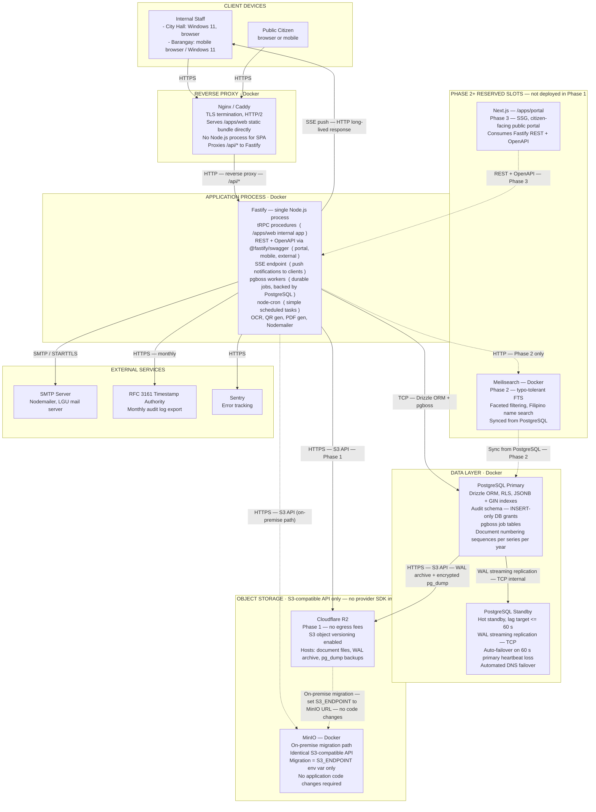

# D5 — Deployment Diagram · Pre-Development Reference

**Status:** Pre-development baseline **Last updated:** June 2026 **Audience:** Development team (internal reference)

## Table of Contents

- [L19–L30] Overview — Phase 1 containerization, static SPA bundle serving, and the co-location of tRPC, REST, and pgboss in Fastify.
- [L31–L115] Deployment Topology — Mermaid diagram visualizing container boundaries, active Phase 1 connections, on-premise migration path, and future phase integrations.
- [L116–L142] Traffic and Protocol Reference — Protocol and direction mapping for all interfaces, detailing Nginx static SPA serving, API proxying, and SSE connections.
- [L143–L160] On-Premise Migration Path — Steps and environmental configuration to migrate database backups and document storage from Cloudflare R2 to on-premise MinIO.
- [L161–L173] Phase 2+ Reserved Slots — Integration details for Meilisearch and Next.js portal, including the Phase 1 PostgreSQL FTS search fallback.
- [L174–L193] Deployment Constraints — Mandatory infrastructure rules including direct file streaming, database failover targets, backup retention, and RLS admin isolation.

---

---

## Overview

This document defines the Phase 1 deployment topology. All Phase 1 components are containerized and run under Docker Compose on a single host. Solid lines represent active Phase 1 connections. Dotted lines mark the on-premise migration path or slots reserved for Phase 2 and later.

Three architectural points worth stating before reading the diagram:

- The `/apps/web` SPA bundle is a **static build artifact** served directly by Nginx or Caddy — no Node.js process is required to deliver it to the browser.
- **tRPC** (for the internal `/apps/web` app) and **REST + OpenAPI** (for the public portal, mobile, and external clients) both run inside the same single Fastify process, separated by plugin scope.
- **pgboss workers** run inside that same Fastify process, using PostgreSQL as their job backing store. No separate queue container. [Inference: pgboss is listed in the stack as an application-layer scheduling package, not as a separate service. Co-location with the Fastify process is the standard pgboss deployment pattern; the architecture documents do not explicitly confirm the process boundary.]

---

## Deployment Topology

**Diagram key**

| Line style                        | Meaning                                                |
| --------------------------------- | ------------------------------------------------------ |
| Solid arrow                       | Phase 1 active connection                              |
| Dotted arrow                      | On-premise migration path — or Phase 2/3 reserved path |
| Subgraph: PHASE 2+ RESERVED SLOTS | Components defined but not deployed in Phase 1         |

---

## Traffic and Protocol Reference

| From                     | To                       | Protocol             | Direction | Notes                                                                                           |
| ------------------------ | ------------------------ | -------------------- | --------- | ----------------------------------------------------------------------------------------------- |
| Internal Staff (browser) | Nginx / Caddy            | HTTPS                | →         | All traffic: initial SPA load, tRPC API calls, SSE connection open                              |
| Public Citizen (browser) | Nginx / Caddy            | HTTPS                | →         | Phase 1: public portal subset served via existing SPA; Phase 3: dedicated Next.js portal        |
| Nginx / Caddy            | Fastify                  | HTTP (reverse proxy) | →         | Only `/api/*` forwarded; static SPA files served directly by Nginx — no proxy step              |
| Fastify                  | Internal Staff (browser) | SSE over HTTP        | →         | Server push; browser opens the long-lived HTTP connection; data flows server → browser          |
| Fastify                  | PostgreSQL Primary       | TCP                  | →         | Drizzle ORM queries; pgboss job reads and writes                                                |
| PostgreSQL Primary       | PostgreSQL Standby       | TCP — WAL streaming  | →         | Continuous WAL streaming; lag target ≤ 60 s; standby ready for immediate promotion              |
| PostgreSQL Primary       | Cloudflare R2            | HTTPS — S3 API       | →         | WAL archiving (PITR) + daily encrypted `pg_dump`; 30-day hot retention, 1-year cold retention   |
| Fastify                  | Cloudflare R2            | HTTPS — S3 API       | →         | Document file reads and writes; UUID file keys only; S3 versioning on                           |
| Fastify                  | MinIO                    | HTTPS — S3 API       | →         | On-premise path only; API identical to Cloudflare R2; activate via `S3_ENDPOINT` env var        |
| Fastify                  | Meilisearch              | HTTP                 | →         | Phase 2 only; container-internal network                                                        |
| Fastify                  | SMTP server              | SMTP / STARTTLS      | →         | Nodemailer; LGU mail server                                                                     |
| Fastify                  | RFC 3161 TSA             | HTTPS                | →         | Monthly audit log batch export                                                                  |
| Fastify                  | Sentry                   | HTTPS                | →         | Unhandled exception and error reporting                                                         |
| Next.js portal           | Fastify                  | REST — OpenAPI       | →         | Phase 3 only; `/apps/portal` (SSG) consumes the same public REST routes Fastify already exposes |

### Note on SPA Bundle Serving

When an internal staff browser first contacts Nginx, Nginx serves the `/apps/web` static build output (HTML, JS, CSS) directly from disk — no Node.js process is involved at this point. Once the SPA loads in the browser, it makes tRPC calls over HTTPS, which Nginx proxies inward to the Fastify process under `/api/*`. The SSE connection for real-time push notifications follows the same path: the browser opens an HTTP connection to Nginx, which is forwarded to Fastify, and the Fastify process streams events back down it.

The browser has a single network destination (Nginx) for all traffic — static file fetch, API calls, and SSE — even though static serving and API proxying are handled differently behind Nginx.

---

## On-Premise Migration Path

The object storage layer is cloud-agnostic by design. No provider-specific SDK is imported anywhere in the codebase; only an S3-compatible client (`@aws-sdk/client-s3` pointed at the configured `S3_ENDPOINT`) is permitted. The same constraint applies to the database backup path.

**Migration sequence — Cloudflare R2 to self-hosted MinIO:**

1. Deploy MinIO as a Docker container on the target on-premise server.
2. Create a bucket with the same name; enable S3 object versioning.
3. Mirror existing objects from Cloudflare R2 to MinIO using `mc mirror` (MinIO CLI) or any S3-to-S3 copy utility.
4. Update `S3_ENDPOINT`, `S3_ACCESS_KEY`, and `S3_SECRET_KEY` in the application environment to point at the MinIO instance.
5. Restart the Fastify process. All document file operations and all database backup writes now target MinIO.

No application code changes are required at any step. The WAL archiving path and the `pg_dump` backup path share the same `S3_ENDPOINT` variable and migrate automatically with step 4.

The on-premise migration path is shown as a dotted arrow from the Cloudflare R2 node to the MinIO node in the topology diagram.

---

## Phase 2+ Reserved Slots

The following components are shown in the topology diagram with dotted lines and a reserved-slot subgraph but are not deployed in Phase 1.

| Component                       | Target Phase | Role                                                                                  | Activation notes                                                                                                                                                                                                                       |
| ------------------------------- | ------------ | ------------------------------------------------------------------------------------- | -------------------------------------------------------------------------------------------------------------------------------------------------------------------------------------------------------------------------------------- |
| Meilisearch (Docker container)  | Phase 2      | Typo-tolerant full-text search; faceted filtering; Filipino and Ilocano name handling | Phase 2 start; requires a sync pipeline from PostgreSQL `tsvector` data. The search interface is abstracted as a service boundary in `/apps/server` so the provider swap from PostgreSQL FTS to Meilisearch does not touch call sites. |
| Next.js portal (`/apps/portal`) | Phase 3      | SSG-based citizen-facing public portal; SEO-optimized document lookups                | Phase 3 start; consumes the existing public REST + OpenAPI routes already exposed by Fastify. No new Fastify changes required to activate it.                                                                                          |

**Phase 1 search fallback:** PostgreSQL FTS (`tsvector` / `tsquery`) handles all search in Phase 1. Zero additional infrastructure. Sufficient for the initial document volume at launch.

---

## Deployment Constraints

| Constraint                         | Detail                                                                                                                                                                                                                                                         |
| ---------------------------------- | -------------------------------------------------------------------------------------------------------------------------------------------------------------------------------------------------------------------------------------------------------------- |
| Containerization                   | All Phase 1 components run in Docker containers orchestrated by Docker Compose. Infrastructure defined as code (Terraform or Pulumi) from day one.                                                                                                             |
| Static bundle serving              | `/apps/web` is a static build artifact. Nginx / Caddy serves it directly from disk. No Node.js process is required for the SPA.                                                                                                                                |
| Single Fastify process             | tRPC and REST + OpenAPI run in the same Fastify Node.js process, separated by plugin scope. No split deployments or separate API servers.                                                                                                                      |
| pgboss co-location                 | pgboss workers run inside the Fastify process. PostgreSQL is the job backing store (pgboss job tables live in the application database). No separate queue container or broker. [Inference — see Overview.]                                                    |
| S3 provider lock-in prevention     | No provider-specific SDK imports anywhere in the codebase. Only `@aws-sdk/client-s3` pointed at `S3_ENDPOINT`. Switching providers requires only an environment variable change.                                                                               |
| Files never touch application disk | Uploaded files are streamed directly between the client and S3-compatible storage. The Fastify process never writes files to local disk. The application server remains stateless.                                                                             |
| TLS termination point              | TLS is terminated at Nginx / Caddy. Traffic between Nginx and Fastify is plain HTTP on a private container network.                                                                                                                                            |
| Stateless application process      | Sessions live in PostgreSQL. Job queues live in PostgreSQL (pgboss). Files live in S3-compatible storage. The Fastify container can be stopped, replaced, or restarted without data migration.                                                                 |
| On-premise deployable              | No cloud-vendor-specific services are used. The full stack can be deployed to a VPS or on-premise server running Docker. The only Phase 1 external dependency is Cloudflare R2 for object storage, replaced by self-hosted MinIO via the migration path above. |
| Failover                           | PostgreSQL standby promotes automatically after 60 s primary heartbeat loss; DNS failover is automated. RTO: 4 hours maximum. RPO: 1 hour maximum.                                                                                                             |
| Backup retention                   | WAL archive + daily encrypted `pg_dump`: 30-day hot retention. At least one cold copy in write-once (object lock) storage: 1-year retention. Backup encryption keys held exclusively by LGU IT Office.                                                         |
| IT admin data isolation            | IT admin accounts have no read access to confidential or restricted document content. Enforced at the PostgreSQL RLS + ABAC policy level, not only in application middleware. Separate DB credentials for application runtime versus IT admin access.          |

---

_This document is part of the D-series pre-development reference set. Update after each infrastructure decision that changes the topology._
