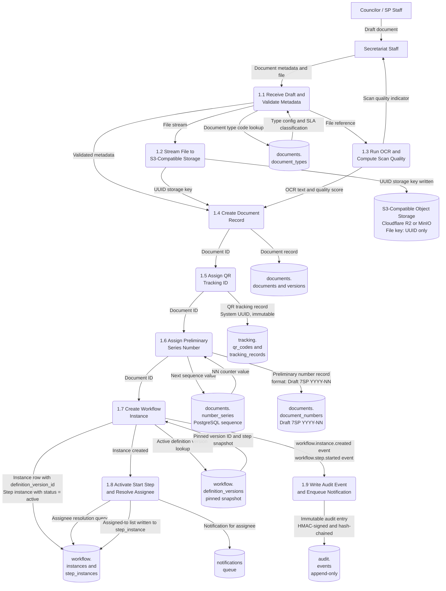
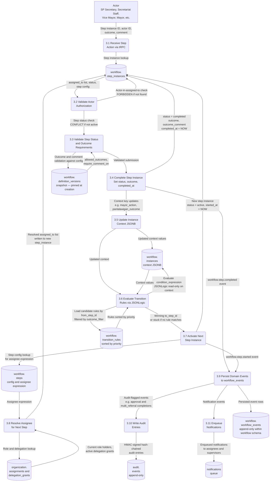
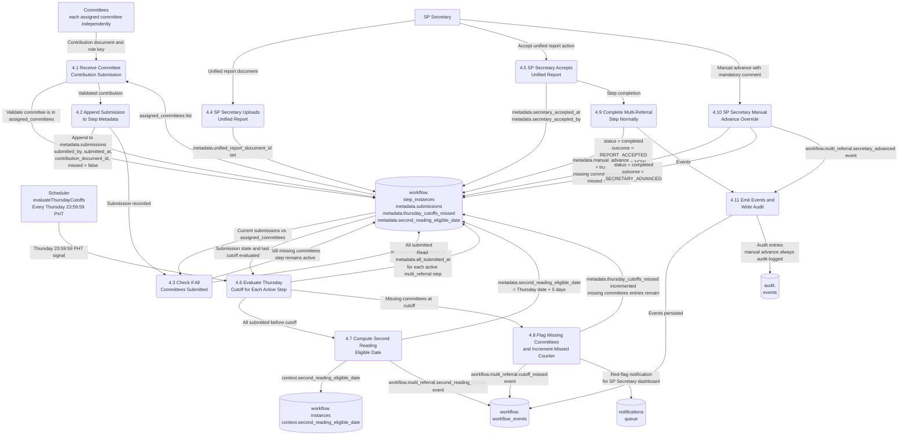
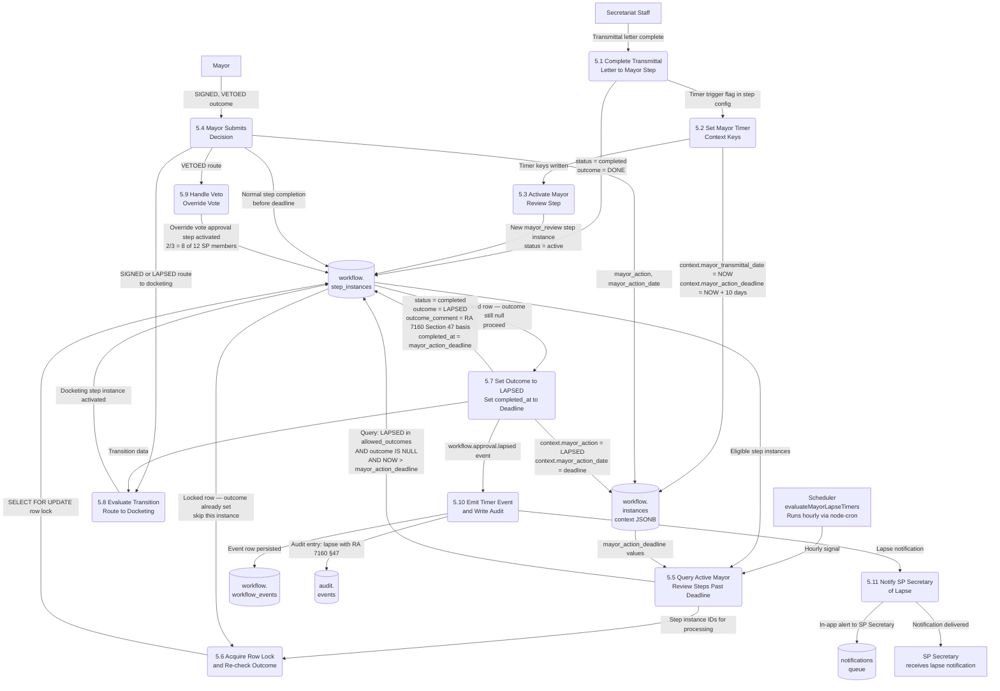
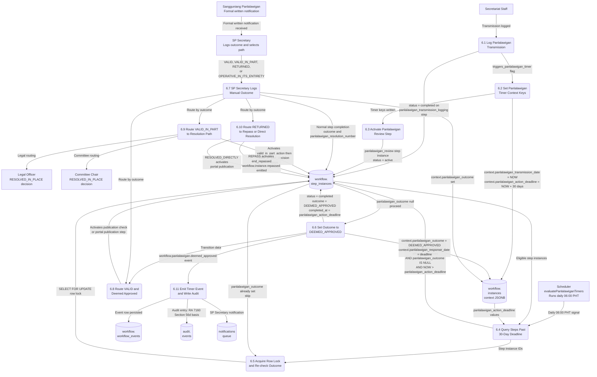
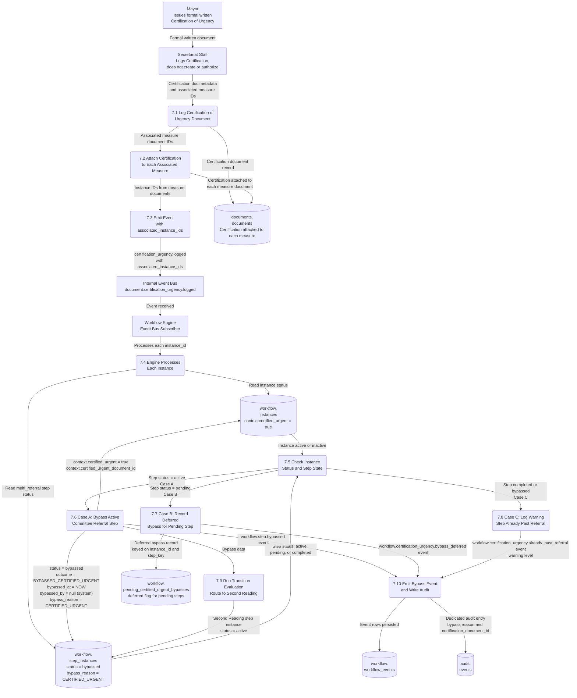

# Data Flow Diagrams — Key Operations
## Batac City LGU Platform — Phase 1

**Document type:** Technical Reference — Data Flow Diagrams
**Audience:** Backend development team
**Source documents:**
- `2-stack-context.md`
- `consolidated-architecture-and-requirements-reference-iteration-3.md` (Post-Interview 2, developer decisions incorporated)
- `b4-workflow-engine-specification.md` (B4)
- `h1-phase-1-workflow-definitions-structured-data.md` (H1)

---

## 1. Introduction

This document presents Data Flow Diagrams (DFDs) for the key operations of the Batac City LGU Platform. All content is derived exclusively from the four source documents listed above. No assumptions are made beyond what the sources confirm.

DFDs follow these notation conventions throughout:

| Shape | Mermaid Syntax | Meaning |
|---|---|---|
| Rectangle | `["Label"]` | **External entity** — actor or system outside the platform boundary |
| Rounded rectangle | `("Label")` | **Process** — an operation that transforms, validates, or routes data |
| Cylinder | `[("Label")]` | **Data store** — a persistent storage location |
| Labeled arrow | `-->|"label"|` | **Data flow** — data or a signal moving between components |

---

## 2. Purpose and Scope

**Purpose:** To give the backend development team a structured, visual view of how data moves through the platform's most critical Phase 1 operations — identifying what data enters each process, where it comes from, what each process does to it, and where it is persisted or sent.

**Scope — Phase 1 key operations covered:**

| # | Operation | Primary Source Reference |
|---|---|---|
| 1 | Context Diagram — system boundary and all external actors | All source docs |
| 2 | Document Intake and Initialization | Consolidated Ref Parts 4.1, 5.1–5.2, 11.4, 11.6; B4 §3.2 |
| 3 | Workflow Step Execution (generic engine loop) | B4 §§3.1–3.6, 9 |
| 4 | Multi-Committee Referral with Thursday Cutoff | B4 §§4.3, 6.2; Consolidated Ref Parts 8.3, 7.2; H1 §§2.3, 5.2–5.3 |
| 5 | Mayor Review with 10-Day Lapse Timer | B4 §6.3; Consolidated Ref Part 4.1; RA 7160 §47 |
| 6 | Panlalawigan Review with 30-Day Timer | B4 §6.4; Consolidated Ref Part 4.3; RA 7160 §56(d) |
| 7 | Certified Urgent Bypass | B4 §6.1; Consolidated Ref Part 4.17; H1 §2.4 |

**Out of scope:** Phase 1B document types (Letters, Memos, Notices, Designations), Phase 2 parallel split/join workflows, Meilisearch, Phase 3 citizen portal full registration, and all post-Phase 1 features.

---

## 3. Overview of Key Operations

The platform's Phase 1 legislative lifecycle begins when Secretariat Staff logs a draft document submitted by a Councilor or SP Staff member. The workflow engine drives the document through legally mandated steps: **First Reading → Committee Referral → Second/Third Reading → VP Certification → Mayor Review → Docketing → Panlalawigan Review → Publication → Archive.**

Several automated operations run on schedule via `node-cron` and `pgboss`:

- The **10-day Mayor lapse timer** (`evaluateMayorLapseTimers`, runs hourly) — sets outcome `LAPSED` when the Mayor takes no action within 10 calendar days of transmittal. Legal basis: RA 7160 §47. (Source: B4 §6.3)
- The **30-day Panlalawigan deemed-approval timer** (`evaluatePanlalawiganTimers`, runs daily at 06:00 PHT) — sets outcome `DEEMED_APPROVED` when no Panlalawigan action is received in 30 calendar days. Legal basis: RA 7160 §56(d). (Source: B4 §6.4)
- The **Thursday cutoff evaluator** (`evaluateThursdayCutoffs`, runs every Thursday at 23:59:59 PHT) — computes the `second_reading_eligible_date` for committee referral steps. (Source: B4 §6.2)
- The **SLA breach monitor** (`evaluateSlaBreaches`, runs every 15 minutes and on startup) — enforces RA 11032 (ARTA) SLA obligations, which continue regardless of system outages. (Source: B4 §8.2)

An event-driven path handles **Certified Urgent** measures: when the Mayor's formal written Certification of Urgency is logged by Secretariat Staff, the engine subscribes to the `document.certification_urgency.logged` internal event bus message and immediately bypasses the `committee_referral` step on each associated workflow instance. (Source: B4 §6.1; Consolidated Ref Part 4.17)

Every state change produces an immutable entry in the append-only `audit.events` schema. Each entry is HMAC-SHA-256 signed and SHA-256 hash-chained to the previous entry. The application DB user holds only `INSERT` on the audit schema — no `UPDATE` or `DELETE`. (Source: Consolidated Ref Part 11.11; B4 §9 Invariant 13)

---

## 4. Data Flow Diagrams

---

### DFD 1 — Context Diagram (Level 0)

The context diagram represents the entire platform as a single process and shows all external entities with their primary data flows. Data stores are not shown at this level.

**Source:** All four source documents.

```mermaid
flowchart TD
    subgraph SP_Sec["SP Secretariat"]
        E1["Councilor / SP Staff"]
        E2["Secretariat Staff"]
        E3["SP Secretary"]
        E4["Vice Mayor"]
        E5["Committees"]
    end

    subgraph ExecOffice["Executive Office"]
        E6["Mayor"]
    end

    subgraph ExtBodies["External Bodies"]
        E7["Sangguniang Panlalawigan"]
        E8["Legal Officer"]
    end

    subgraph RecordsTeam["Records"]
        E9["Records Officer"]
    end

    subgraph PublicSide["Public"]
        E10["Citizen"]
    end

    subgraph AutoSys["System Automation"]
        E11["Scheduler\nnode-cron and pgboss"]
    end

    SYS(["Batac City LGU Platform"])

    E1 -->|"Draft document"| SYS
    E2 -->|"Log entry, file upload, form data"| SYS
    E3 -->|"Workflow decisions, OB scheduling,\nnumber assignments"| SYS
    E4 -->|"Signature, committee referral"| SYS
    E5 -->|"Committee report"| SYS
    E6 -->|"Sign, veto, or issue Certification of Urgency"| SYS
    E7 -->|"Review outcome"| SYS
    E8 -->|"VALID-IN-PART legal recommendation"| SYS
    E9 -->|"Archive confirmation"| SYS
    E10 -->|"Complaint or document request"| SYS
    E11 -->|"Timer evaluation signals"| SYS

    SYS -->|"Step assignments and notifications"| E3
    SYS -->|"Step assignments and notifications"| E2
    SYS -->|"Signature requests and notifications"| E4
    SYS -->|"Pending review alerts"| E6
    SYS -->|"Referral assignments and cutoff alerts"| E5
    SYS -->|"Document transmission package"| E7
    SYS -->|"VALID-IN-PART routing task"| E8
    SYS -->|"Archive tasks and SLA alerts"| E9
    SYS -->|"Public documents and complaint status"| E10
```

#### Entity and Flow Descriptions

| Entity | Role |
|---|---|
| Councilor / SP Staff | Drafts legislative measures; submits physical or digital draft to Secretariat Staff |
| Secretariat Staff | Logs documents, uploads files, enters committee hearing dates communicated by committees |
| SP Secretary | Assigns final series numbers, manages Order of Business, accepts committee reports, records Panlalawigan outcomes |
| Vice Mayor | Signs certified copies of resolutions and ordinances; refers measures to committees at First Reading; `delegation_aware` resolution applies |
| Committees | Conduct joint hearings; submit unified committee reports before Thursday cutoff |
| Mayor | Signs, vetoes, or allows measures to lapse; issues formal Certification of Urgency documents; `delegation_aware` resolution applies |
| Sangguniang Panlalawigan | Returns formal written review outcomes (VALID, VALID_IN_PART, RETURNED) within 30 calendar days |
| Legal Officer | Receives VALID-IN-PART routing; logs `RESOLVED_IN_PLACE` recommendation |
| Records Officer | Performs permanent archive action; receives SLA breach alerts |
| Citizen | Submits complaints (three access modes); requests document copies |
| Scheduler | `node-cron` and `pgboss` fire timer evaluation signals for Mayor lapse, Panlalawigan timer, Thursday cutoff, and SLA monitoring |

---

### DFD 2 — Document Intake and Initialization

This diagram shows the data flow when Secretariat Staff logs a new legislative document. It covers file upload to S3-compatible storage, automatic OCR, QR tracking ID assignment, preliminary series number assignment, and workflow instance creation.

**Key sequencing rule (Source: Consolidated Ref Part 11.6; H1 §5.5 step 1):** QR tracking ID is assigned before the preliminary series number. Both are assigned at secretariat logging, before the measure appears on the Order of Business.

**S3 constraint (Source: Stack Context):** Files are streamed directly to S3-compatible storage (Cloudflare R2 or MinIO). They never touch the application server's local disk. The S3-compatible API is used exclusively — no provider-specific SDKs.

#### Process Descriptions

| Process | Description |
|---|---|
| 1.1 Receive Draft and Validate Metadata | Secretariat Staff submits document type, title, sponsors, and file. Document type code is looked up in `documents.document_types` to retrieve the SLA classification and other type configuration. |
| 1.2 Stream File to S3-Compatible Storage | File is streamed directly to the configured S3-compatible bucket. The storage key is a UUID — never the original filename. The original filename is stored as metadata in PostgreSQL only. S3 object versioning is enabled. |
| 1.3 Run OCR and Compute Scan Quality | OCR runs automatically on every upload. A scan quality indicator is always shown to Secretariat Staff so they can decide whether to request a re-scan before the document is formally logged. |
| 1.4 Create Document Record | A `documents.documents` row is created, recording the document type, title, sponsors, the UUID storage key, the OCR text, and the quality score. |
| 1.5 Assign QR Tracking ID | A UUID-based tracking ID is generated and written to `tracking.qr_codes`. This ID is assigned before the preliminary series number and is immutable for the document's entire lifecycle. |
| 1.6 Assign Preliminary Series Number | The next value is drawn from the PostgreSQL sequence for this document type and year. The preliminary number is formatted as `Draft 7SP YYYY-NN`. The "Draft" prefix is removed when the final number is assigned after the last reading vote. |
| 1.7 Create Workflow Instance | The engine resolves the currently active, published `definition_version` for the document type. `instances.definition_version_id` is set to this version and is never changed except via Option B migration. |
| 1.8 Activate Start Step and Resolve Assignee | The start step (`intake_logging`) is created with `status = active`. The assignee expression is evaluated against the current organization state, including active delegation grants. |
| 1.9 Write Audit Event and Enqueue Notification | `workflow.instance.created` and `workflow.step.started` events are persisted to `workflow.workflow_events` within the same database transaction. The audit service writes the corresponding entries. The notification service enqueues an in-app notification to the resolved assignee. |

---

### DFD 3 — Workflow Step Execution

This diagram shows the generic data flow when any actor completes a workflow step — for example, when the SP Secretary records a Second Reading vote, the Vice Mayor signs a certified copy, or the Mayor submits a veto decision. This is the core engine loop that drives all workflow progress.

**Source:** B4 §§3.1–3.6, 9.

**All operations execute within a single PostgreSQL transaction.** If any write fails, the entire operation is rolled back. Events are persisted in the same transaction; downstream consumers receive them only after commit. (Source: B4 §3.1)

#### Process Descriptions

| Process | Description |
|---|---|
| 3.1 Receive Step Action via tRPC | The actor submits step instance ID, their actor ID, an outcome code, and an optional or required comment. This is the sole entry point for all human actor interactions with the workflow engine. |
| 3.2 Validate Actor Authorization | Engine confirms that `actor_id` is present in `step_instances.assigned_to`. If not, returns `FORBIDDEN`. Also checks that `step_instances.status = active`; if not, returns `CONFLICT`. |
| 3.3 Validate Step Status and Outcome Requirements | The outcome code is checked against `config.allowed_outcomes` from the pinned definition version snapshot. If `require_comment_on` includes the submitted outcome and no comment is provided, returns `VALIDATION_FAILED`. Scheduler-only outcomes (`LAPSED`, `DEEMED_APPROVED`) are rejected from human actors with `FORBIDDEN`. |
| 3.4 Complete Step Instance | Sets `status = completed`, `outcome`, `outcome_comment`, and `completed_at = NOW()` on the step instance row. |
| 3.5 Update Instance Context JSONB | Writes outcome-specific context keys to `instances.context`. For example, completing a `mayor_review` step writes `mayor_action` and `mayor_action_date`. For timer-triggering steps (`transmittal_letter_to_mayor`), also writes `mayor_transmittal_date` and `mayor_action_deadline = NOW() + 10 days`. |
| 3.6 Evaluate Transition Rules via JSONLogic | Loads all transition rules where `from_step_id` matches the completed step and `definition_version_id` matches the pinned version. Filters by `outcome_filter` if set. Sorts by `priority` ascending. Evaluates each rule's `condition_expression` (JSONLogic, read-only on context) in order; the first matching rule fires. If no rule matches, instance enters `stuck` status. |
| 3.7 Activate Next Step Instance | Creates a new `step_instances` row for the winning `to_step_id` with `status = active`. For `decision` and `notification` step types, execution continues immediately within the same call chain without waiting for actor input. For `termination` steps, instance completion logic runs. |
| 3.8 Resolve Assignee for Next Step | Evaluates the new step's `config.assignee` expression against the current organization state. `delegation_aware:` expressions check for active `delegation_grants`; if found, routes to the designated person instead of the original role holder. Resolved assignees are written to `assigned_to` on the new step instance. |
| 3.9 Persist Domain Events | `workflow.workflow_events` rows are written within the same database transaction. After commit, events are published to the in-process event bus for downstream subscribers (audit service, notification service). |
| 3.10 Write Audit Entries | The audit service subscribes to flagged event types (all approval completions, multi-referral completions, bypasses, cancellations, Option B migrations). Each audit entry is HMAC-SHA-256 signed using the application's secret key and includes a SHA-256 hash of the previous entry. |
| 3.11 Enqueue Notifications | The notification service enqueues in-app notifications to the newly assigned step actors, supervisors if an SLA warning threshold has been passed, and any recipients specified in `notification` step configs. |

---

### DFD 4 — Multi-Committee Referral with Thursday Cutoff

This diagram shows the data flow for the `multi_referral` step type, which is the standard referral mechanism for all SP Resolutions and Ordinances. Most measures are referred to two committees simultaneously: the relevant subject-matter committee and the Committee on Laws. All assigned committees must contribute to a single unified report before the step can complete normally.

**Key rules (Source: Consolidated Ref Parts 8.3, 7.2; B4 §§4.3, 6.2; H1 §5.3):**

- All committees must sign and contribute to the unified report (`require_all_committee_signatures = true`).
- The Thursday cutoff is 23:59:59 PHT. If all committees submit before the cutoff, the measure is eligible for Second Reading on the following Tuesday (`eligible_date = Thursday + 5 days`).
- If any committee misses the Thursday cutoff, `second_reading_eligible_date` is not set for that week, the measure is marked red in the Order of Business, and it is delayed to the Tuesday after the week in which all committees submit.
- The SP Secretary can manually advance the step with a mandatory non-empty comment; this is always audit-logged.

#### Process Descriptions

| Process | Description |
|---|---|
| 4.1–4.2 Receive and Record Committee Contribution | Each committee submits independently via a tRPC call. The engine validates that the submitting committee is in `metadata.assigned_committees`. The submission is appended to `metadata.submissions` with `missed = false`. |
| 4.3 Check If All Committees Submitted | After each submission, the engine checks whether all committees in `assigned_committees` now have a submission entry. If yes, `metadata.all_submitted_at` is set and `workflow.multi_referral.all_submitted` is emitted. |
| 4.4–4.5 SP Secretary Accepts Unified Report | The SP Secretary uploads the consolidated report document, then accepts it. The `report_acceptor_role` config field identifies the SP Secretary as the only authorized acceptor. |
| 4.6 Evaluate Thursday Cutoff | The `evaluateThursdayCutoffs` job is idempotent: re-running it for the same cutoff window has no additional effect if `metadata.last_cutoff_evaluated_at` already equals or exceeds the current cutoff timestamp. |
| 4.7 Compute Second Reading Eligible Date | If all committees submitted before Thursday 23:59:59 PHT, `second_reading_eligible_date = DATE(cutoff_ts AT TIME ZONE Asia/Manila) + 5 days`. This date is written to both `step_instances.metadata` and `instances.context` so the Order of Business view can filter which Tuesday a measure appears on. |
| 4.8 Flag Missing Committees | Committees without a submission entry (or with `missed = true`) are displayed in red in the Order of Business view. The workflow engine maintains this state in `metadata.submissions`; the dashboard reads it as a query. |
| 4.10 SP Secretary Manual Advance | Permitted when `allow_secretary_advance = true` in step config. A non-empty `outcome_comment` is mandatory — the engine rejects with `COMMENT_REQUIRED` otherwise. Missing committees are flagged with `missed = true` in metadata. The outcome is `SECRETARY_ADVANCED`. Always produces a dedicated audit entry. |

---

### DFD 5 — Mayor Review with 10-Day Lapse Timer

This diagram shows the data flow for the Mayor's 10-day review window. The timer starts when the Secretariat Staff completes the `transmittal_letter_to_mayor` step. The hourly scheduler job detects expiry and sets the outcome to `LAPSED` automatically.

**Source:** B4 §6.3; Consolidated Ref Parts 4.1, 4.2; RA 7160 §47.

**Race condition guard (Source: B4 §6.3):** The scheduler acquires a `SELECT FOR UPDATE` row lock before setting the lapse outcome. If the Mayor submits their action between the scheduler's initial check and the lock acquisition, the locked row will already have an outcome set; the scheduler detects this and skips. `completed_at` is set to `mayor_action_deadline` — the actual lapse time — not to the scheduler's detection time.

#### Process Descriptions

| Process | Description |
|---|---|
| 5.1–5.2 Complete Transmittal Letter and Set Timer | When Secretariat Staff completes the `transmittal_letter_to_mayor` step, the engine reads `triggers_mayor_lapse_timer: true` from the step config and writes `mayor_transmittal_date = NOW()` and `mayor_action_deadline = NOW() + INTERVAL '10 days'` to `instances.context`. No adjustment is made for weekends or public holidays. |
| 5.4 Mayor Submits Decision | If the Mayor acts before the deadline, they submit `SIGNED` or `VETOED` through a normal step completion (DFD 3). `SIGNED` and `LAPSED` both route to the Docketing step. `VETOED` routes to the Veto Override Vote approval step, where the SP Secretary records whether 8 of 12 SP members voted to override (2/3 majority). |
| 5.5–5.6 Identify and Lock Expired Steps | The scheduler queries all active `mayor_review` step instances where `LAPSED` is in `allowed_outcomes`, the outcome is null, and `NOW() > mayor_action_deadline`. It acquires a row lock before acting to prevent race conditions with a simultaneous Mayor submission. |
| 5.7 Set Outcome to LAPSED | Sets `completed_at` to `mayor_action_deadline` — the actual deadline time, not the scheduler's detection time. The outcome comment records the RA 7160 §47 legal basis. `actor_type = system` is set; the `LAPSED` outcome cannot be submitted by a human actor. |
| 5.8 Route to Docketing | Transition evaluation fires with `outcome = LAPSED`. The transition rule with `outcome_filter = LAPSED` routes to the `docketing` step, following the same path as `SIGNED`. |

---

### DFD 6 — Panlalawigan Review with 30-Day Timer

This diagram shows the data flow for the Sangguniang Panlalawigan 30-day review. The timer starts when Secretariat Staff logs the document's transmission to the Panlalawigan. The daily scheduler job detects expiry and sets the outcome to `DEEMED_APPROVED` automatically. Manual responses are also handled.

**Source:** B4 §6.4; Consolidated Ref Parts 4.3, 11.3; RA 7160 §56(d).

**Outcome routing (Source: Consolidated Ref Part 4.3; B4 §6.4):**

| Panlalawigan Outcome | Next Step |
|---|---|
| `VALID` / `DEEMED_APPROVED` / `OPERATIVE_IN_ITS_ENTIRETY` | Publication check (Ordinance) or portal publication (Resolution) |
| `VALID_IN_PART` | SP Secretary selects resolution path: Resolved In Place, Routed to Legal, Routed to Committee, or Revised Directly |
| `RETURNED` | SP Secretary selects Repass (document returns to drafting) or Resolved Directly with mandatory comment |

#### Process Descriptions

| Process | Description |
|---|---|
| 6.1–6.2 Log Transmission and Set Timer | Secretariat Staff completes the `panlalawigan_transmission_logging` step. The engine reads `triggers_panlalawigan_timer: true` from step config and writes `panlalawigan_transmission_date = NOW()` and `panlalawigan_action_deadline = NOW() + INTERVAL '30 days'` to `instances.context`. No weekend or holiday adjustment. |
| 6.4–6.6 Deemed-Approval Timer | The scheduler queries active `panlalawigan_review` steps where `panlalawigan_outcome` in context is null and the 30-day deadline has passed. Acquires a row lock to prevent race conditions with a manual SP Secretary submission. `completed_at` is set to `panlalawigan_action_deadline`, not to the scheduler's detection time. |
| 6.7 SP Secretary Logs Manual Outcome | When a formal Panlalawigan resolution is received, the SP Secretary submits it through the normal step completion path. `DEEMED_APPROVED` is blocked from human submission by the engine's scheduler-only outcome guard (B4 §4.2). `panlalawigan_resolution_number` is recorded from the form. |
| 6.9 Route VALID_IN_PART | Four resolution paths are available: (1) `RESOLVED_IN_PLACE` — SP Secretary resolves with mandatory comment; (2) `ROUTED_TO_LEGAL` — Legal Officer logs `RESOLVED_IN_PLACE` recommendation; (3) `ROUTED_TO_COMMITTEE` — Committee Chair logs `RESOLVED_IN_PLACE` recommendation; (4) `REVISED_DIRECTLY` — Secretariat implements changes with mandatory comment. All choices are audit-logged. |
| 6.10 Route RETURNED | The Secretariat decides between `REPASS` — document returns to drafting, `workflow.instance.repassed` is emitted, documents module creates a superseding document — or `RESOLVED_DIRECTLY` with a mandatory comment, continuing to publication. |

---

### DFD 7 — Certified Urgent Bypass

This diagram shows the event-driven data flow when the Mayor issues a formal Certification of Urgency. A single Certification can cover multiple measures in the same session. When Secretariat Staff logs it, the `document.certification_urgency.logged` event fires on the internal event bus, and the workflow engine immediately bypasses the `committee_referral` step on each associated instance.

**Source:** B4 §6.1; Consolidated Ref Part 4.17; H1 §2.4.

**Three cases handled (Source: B4 §6.1):**
- **Case A** — `multi_referral` step is currently active: bypass executes immediately.
- **Case B** — `multi_referral` step is pending (not yet activated): a deferred bypass flag is set; the bypass executes when the step would normally activate.
- **Case C** — `multi_referral` step already completed or bypassed: no action; a warning event is emitted.

#### Process Descriptions

| Process | Description |
|---|---|
| 7.1–7.2 Log and Attach Certification | Secretariat Staff logs the Mayor's formal written Certification of Urgency. The Certification document has no standalone numbering series — it is always attached to the associated legislative measure documents. A single Certification can cover multiple measures in the same session. |
| 7.3 Emit Event | The documents module emits `document.certification_urgency.logged` on the internal in-process event bus with the list of all `associated_instance_ids` covered by this Certification. |
| 7.5–7.6 Case A: Bypass Active Step | If the `multi_referral` step instance is currently active, the engine sets `status = bypassed`, `outcome = BYPASSED_CERTIFIED_URGENT`, and `bypass_reason = CERTIFIED_URGENT` within a single database transaction. `bypassed_by` is null because this is a system-triggered action, not a human actor action. Transition evaluation then fires; the workflow definition is required to have a transition rule with `outcome_filter = BYPASSED_CERTIFIED_URGENT` pointing to the Second Reading step. |
| 7.7 Case B: Deferred Bypass | If the `multi_referral` step is pending (not yet activated), a record is written to `pending_certified_urgent_bypasses`. When the step would normally be activated, the engine checks for this flag and executes the Case A bypass logic instead. |
| 7.8 Case C: Already Past Referral | If the workflow has already moved past the committee referral stage, the engine emits `workflow.certification_urgency.already_past_referral` at warning level and makes no workflow changes. |
| 7.10 Audit | `workflow.step.bypassed` is consumed by the audit service, which writes a dedicated audit entry noting the bypass reason and the certification document reference. |

---

## 5. Summary

The table below maps each DFD to the primary data stores it reads from and writes to, and identifies the external actors that initiate or receive data.

| DFD | Operation | Primary Initiating Actor | Data Stores Written |
|---|---|---|---|
| DFD 1 | Context Diagram | All external actors | — |
| DFD 2 | Document Intake and Initialization | Secretariat Staff | `documents.*`, `tracking.qr_codes`, `documents.number_series`, `documents.document_numbers`, `workflow.instances`, `workflow.step_instances`, S3 storage, `audit.events` |
| DFD 3 | Workflow Step Execution | Any assigned actor | `workflow.step_instances`, `workflow.instances` (context), `workflow.workflow_events`, `audit.events`, notifications queue |
| DFD 4 | Multi-Committee Referral and Thursday Cutoff | Committees, SP Secretary, Scheduler | `workflow.step_instances` (metadata), `workflow.instances` (context), `workflow.workflow_events`, `audit.events` |
| DFD 5 | Mayor Review with 10-Day Lapse | Mayor, Secretariat Staff, Scheduler | `workflow.step_instances`, `workflow.instances` (context), `workflow.workflow_events`, `audit.events` |
| DFD 6 | Panlalawigan Review with 30-Day Timer | SP Secretary, Scheduler | `workflow.step_instances`, `workflow.instances` (context), `workflow.workflow_events`, `audit.events` |
| DFD 7 | Certified Urgent Bypass | Secretariat Staff, Workflow Engine | `documents.documents`, `workflow.instances` (context), `workflow.step_instances`, `workflow.workflow_events`, `audit.events` |

**Cross-cutting architectural invariants visible across all DFDs:**

| Invariant | Enforcement |
|---|---|
| Audit log is append-only; no `UPDATE` or `DELETE` | PostgreSQL role: `REVOKE UPDATE, DELETE ON audit.events FROM application_user` |
| `workflow.workflow_events` is append-only within the workflow schema | PostgreSQL role: same grant restriction |
| Files never touch application disk | S3 streaming only; UUID keys; no provider-specific SDK |
| `instances.definition_version_id` is set once at creation | No SQL update path outside `engine.migrateInstance` |
| LAPSED and DEEMED_APPROVED outcomes are scheduler-only | Engine rejects human submissions of these outcomes with `FORBIDDEN` |
| Row locks (`SELECT FOR UPDATE`) prevent race conditions on timer operations | Applied in `evaluateMayorLapseTimers` and `evaluatePanlalawiganTimers` before any write |
| Audit entries include HMAC-SHA-256 signature and SHA-256 hash chain | Implemented in audit service using Node built-in `crypto`; no external library |

---

*This document is based solely on the four source files listed in the header. It does not contain inferences beyond what those sources confirm. Any data flow or process not traceable to a source reference should be verified against the consolidated requirements reference before implementation.*
