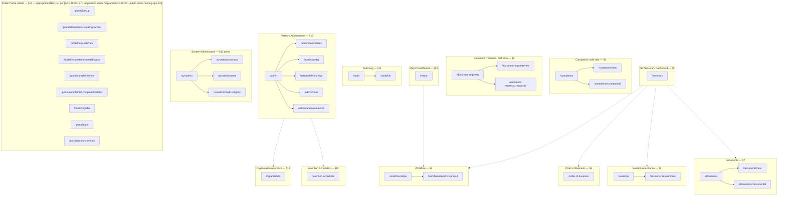

# F1. Application Route Map — Pre-dev

**Document ID:** F1
**Type:** Frontend route map — `/apps/web`, Phase 1, `/apps/portal` (Phase 1 — see [ADR-UI-001](./f1-application-route-map-adrs/ADR-UI-001-public-portal-hosting-app.md)), and System Administrator views
**Status:** DRAFT — pre-development proposal, reflects ten resolved gaps; not yet reviewed or approved
**Date:** June 19, 2026
**Based on:**

- F1-Context — `f1-context-application-route-map.md`
- I2 — `i2-application-route-map-role-permissions.md`
- E1 — `e1-trpc-router-and-procedure-catalog.md`
- [ADR-001 through ADR-010](./f1-application-route-map-adrs/ADR-INDEX.md) (see `ADR-INDEX.md`)

**Audience:** Frontend development team; cross-referenced by backend team for role/procedure alignment

> **[Unverified — applies to this entire document]** Route paths, component names, and frontend information architecture are not defined anywhere in the original source material. Every path, component name, page-composition choice, and navigation/nesting decision below is this document's own proposed synthesis — not a confirmed fact — even in rows that are not individually re-tagged `[Inference]`. Ten items that were open gaps in an earlier pass over this same material are now resolved by formal ADRs; those resolutions are reflected throughout this document and are marked `[Resolved — ADR-00x]` at each affected point, rather than left as `[Unverified]`/`[Speculation]`/`[Deferred]`. Read this whole document as a draft for development-team review, not as approved architecture.

## Table of Contents

- [L41–L59] 1. Notation and how to read this document — Definitions of status tags, inference rules, prohibited absolute terms, and correction protocols for unverified claims.
- [L60–L112] 2. Cross-cutting notes (apply to every route below) — App boundaries, role codes, tRPC/REST protocol boundaries, excluded scopes, and additions to the nine named views.
- [L113–L206] 3. Route hierarchy — Mermaid flowchart visualizing nested and cross-linked route hierarchy for internal apps and public portal.
- [L207–L254] 4. Master route table (by path) — Tabular index of all internal and public routes, mapping paths to components, roles, and procedures.
- [L255–L274] 5. SP Secretary dashboard — Widget data dependencies for the SP Secretary landing page and rationale for non-nested Order of Business routing.
- [L275–L290] 6. Order of Business view — Role permissions and data dependencies for managing, scheduling, and overriding legislative session orders of business.
- [L291–L330] 7. Document intake form (and the document list / document detail routes it depends on) — Path structure, roles, and procedure groups for document listing, single-file intake, and multi-faceted detail pages.
- [L331–L392] 8. Workflow step action views (and staff-side complaint / document request management) — Task inbox routing, conditional step-type panels, staff-side complaint/request management, and committee picker procedures.
- [L393–L405] 9. Session attendance tracking — Attendance overview and detail page routing, including role gates and Designation-document integration for substitute officers.
- [L406–L415] 10. Mayor dashboard — Proposed data dependencies and filtering logic for the Mayor's dashboard widgets.
- [L416–L429] 11. Audit log viewer — User-specific audit log pages versus the Auditor-restricted full log with hash chain validation rules.
- [L430–L479] 12. Platform Administrator views — Platform Admin landing page, committee/role assignment, Tier-2 configuration panels, and retention/organization views.
- [L480–L509] 13. System Administrator views ([ADR-UI-008](./f1-application-route-map-adrs/ADR-UI-008-system-administrator-views.md)) — Session termination, user account CRUD, hash chain validation routes, and outstanding infrastructure gaps for sysadmins.
- [L510–L545] 14. Phase 1 public portal subset — Next.js public portal route definitions, no-login intake options, and public announcement display page.
- [L546–L571] 15. Resolved gaps register — Summary table of resolved pre-development gaps (ADRs 1–10) and unresolved follow-up questions.
- [L572–L582] 16. Items considered and not given a dedicated route — List of features, views, and documents deliberately excluded from having dedicated route definitions.
- [L583–L587] Correction check — Quality assurance verification process and mandatory correction statement for unverified claims.

---

---

## 1. Notation and how to read this document

| Tag                    | Meaning                                                                                                                                                                    |
| ---------------------- | -------------------------------------------------------------------------------------------------------------------------------------------------------------------------- |
| `[Confirmed — source]` | Directly traceable to a named section of F1-Context, I2, or E1                                                                                                             |
| `[Resolved — ADR-00x]` | Previously an open gap or open question in this material; now settled by the named ADR. Carries the ADR's decision, not a new inference.                                   |
| `[Inference]`          | A reasonable conclusion drawn from confirmed facts — logically reasoned, not itself confirmed                                                                              |
| `[Speculation]`        | An unconfirmed possibility raised because the source material is silent or ambiguous; offered for the team to resolve, not asserted as likely                              |
| `[Unverified]`         | No reliable source exists either way                                                                                                                                       |
| `[Deferred]`           | E1 itself marks the underlying procedure as deferred to a follow-up addendum; carried forward from E1's own notation. No items in this document remain deferred — see §15. |

Inferences are not chained: each judgment call is labeled individually at the point it is made rather than folded into a single compound conclusion.

This document avoids describing route or system behavior with the words "prevent," "guarantee," "will never," "fixes," "eliminates," or "ensures that," other than inside a direct citation.

If any statement below is later found to assert an unverified claim as fact, the correction note at the end of this document applies: _"Correction: I made an unverified claim. That was incorrect."_

---

## 2. Cross-cutting notes (apply to every route below)

### 2.1 App boundary

`[Confirmed — F1-Context §1.1–1.2, §10]` Sections 5–13 belong to `/apps/web` (the Vite + React SPA, tRPC-backed), with the exception of the new System Administrator section (§13), which also lives in `/apps/web` since System Administrator is an internal-staff role.

`[Resolved — [ADR-UI-001](./f1-application-route-map-adrs/ADR-UI-001-public-portal-hosting-app.md)]` Section 14's public-portal routes are served from `/apps/portal` (Next.js), built now rather than deferred to its originally planned Phase 3 slot. F1-Context §10 had raised this as an open question without settling it — specifically, whether these routes would be served from unauthenticated paths inside `/apps/web` or from the separately documented `/apps/portal` stack — and that question is now closed by [ADR-UI-001](./f1-application-route-map-adrs/ADR-UI-001-public-portal-hosting-app.md).

### 2.2 Role reference

`[Confirmed — I2 §2; role codes confirmed — E1, Shared Fragment Schemas, roleCodeEnum]`

| #   | Role                   | E1 role code           |
| --- | ---------------------- | ---------------------- |
| 1   | System Administrator   | `sys_admin`            |
| 2   | Platform Administrator | `plat_admin`           |
| 3   | Records Officer        | `records_officer`      |
| 4   | Department Encoder     | `dept_encoder`         |
| 5   | Department Approver    | `dept_approver`        |
| 6   | SP Secretary           | `sp_secretary`         |
| 7   | SP Member              | `sp_member`            |
| 8   | SP Presiding Officer   | `sp_presiding_officer` |
| 9   | Mayor                  | `mayor`                |
| 10  | Barangay Encoder       | `brgy_encoder`         |
| 11  | Barangay Captain       | `brgy_captain`         |
| 12  | Auditor                | `auditor`              |
| 13  | Citizen                | `citizen`              |

"Required role(s)" below uses the readable names from this table. Most roles are further narrowed by office- or classification-level ABAC scoping on top of the base role gate (per I1, as cited inside I2 and E1). This document notes that narrowing in prose where it changes who effectively sees what, without re-deriving the full ABAC cascade for every route.

### 2.3 tRPC vs. REST boundary

`[Confirmed — E1, "Note on Scope"]` tRPC procedures cover `/web` only. Citizen self-service — complaint submission, document request submission, public tracking lookup, public document browsing, and public announcement viewing — is explicitly out of E1's scope and is REST, served by the portal module, consumed by `/apps/portal` per [ADR-UI-001](./f1-application-route-map-adrs/ADR-UI-001-public-portal-hosting-app.md) rather than by unauthenticated `/apps/web` routes.

### 2.4 Scope inherited from prior curation

`[Confirmed — F1-Context §12; I2 §13]` Carried forward as out of scope for this route map: Barangay Resolution/Budget workflows (Phase 1B), Letters/Memos/NCH/NOSP document types (Phase 1B), generic account-settings/profile screens (no named F1 view covers them), and Phase 2 items (`parallel_split`/`parallel_join` step types, the Reporting module, the Search-meta module, RMS bulk operations).

`[Resolved — [ADR-UI-007](./f1-application-route-map-adrs/ADR-UI-007-designation-document-type-phase1.md)]` The Designation document type, previously treated as Phase 1B in the underlying source material, is **pulled into Phase 1 scope** and is therefore **no longer** an exclusion. It is removed from this list and is now addressed directly in §9.

### 2.5 Two routes this document adds beyond the nine named areas

`[Inference]` Two small staff-side resources — Complaint Management and Document Request Management — are included as companions to Workflow Step Action Views (Section 8) rather than as their own top-level area, because F1-Context's own Section 5 already discusses citizen-complaint resolution as an example of a non-legislative, step-driven workflow, and both resources are backed by confirmed Phase-1 tRPC routers (`complaints`, `documentRequests`) that have no other obvious home among the nine named views.

### 2.6 Two further additions, resolved by ADR

`[Resolved — [ADR-UI-006](./f1-application-route-map-adrs/ADR-UI-006-public-portal-announcements.md), [ADR-UI-008](./f1-application-route-map-adrs/ADR-UI-008-system-administrator-views.md)]` Two additions beyond the nine named areas, both decided via ADR rather than silently introduced:

- **System Administrator views** (§13) — previously a named gap with no built section in earlier drafts of this material; now built per [ADR-UI-008](./f1-application-route-map-adrs/ADR-UI-008-system-administrator-views.md).
- **Public Portal Announcements** (§14.4) — previously an orphaned permission with no backing procedure or page; now built per [ADR-UI-006](./f1-application-route-map-adrs/ADR-UI-006-public-portal-announcements.md).

---

## 3. Route hierarchy

`[Inference]` Solid arrows are true nested (parent/child) routes. Dotted arrows are navigational cross-links between independently-routed siblings — not nesting.

`[Resolved — [ADR-UI-008](./f1-application-route-map-adrs/ADR-UI-008-system-administrator-views.md)]` New subgraph `SYSADM` added: `/sysadmin`, `/sysadmin/sessions`, `/sysadmin/users`, `/sysadmin/audit-integrity`.
`[Resolved — [ADR-UI-006](./f1-application-route-map-adrs/ADR-UI-006-public-portal-announcements.md)]` `/admin/announcements` added as a fourth child of `/admin`.
`[Resolved — [ADR-UI-001](./f1-application-route-map-adrs/ADR-UI-001-public-portal-hosting-app.md)]` `POR` subgraph annotated as living in `/apps/portal`, not `/apps/web`; `/portal/announcements` added as a ninth portal route.

---

## 4. Master route table (by path)

`[Inference — table format reflects all resolutions described in this document]`

| Path                                     | App            | Component                                | Required role(s)                                                                                                                                            | Primary data dependency                                                                                                                                                                                                                                           |
| ---------------------------------------- | -------------- | ---------------------------------------- | ----------------------------------------------------------------------------------------------------------------------------------------------------------- | ----------------------------------------------------------------------------------------------------------------------------------------------------------------------------------------------------------------------------------------------------------------- |
| `/admin`                                 | `/apps/web`    | `PlatformAdminHomePage`                  | Platform Administrator                                                                                                                                      | — (landing shell)                                                                                                                                                                                                                                                 |
| `/admin/announcements`                   | `/apps/web`    | `AnnouncementManagementPage`             | Platform Administrator, SP Secretary                                                                                                                        | `[Resolved — [ADR-UI-006](./f1-application-route-map-adrs/ADR-UI-006-public-portal-announcements.md)]` new announcements procedures (see §14.4)                                                                                                                   |
| `/admin/committees`                      | `/apps/web`    | `CommitteeManagementPage`                | Platform Administrator                                                                                                                                      | `organization.listCommittees` `[Resolved — [ADR-UI-004](./f1-application-route-map-adrs/ADR-UI-004-committee-list-procedure.md)]`, `organization.createCommittee`, `updateCommittee`, `assignCommitteeMembership`                                                 |
| `/admin/config`                          | `/apps/web`    | `PlatformConfigPage`                     | Platform Administrator                                                                                                                                      | `[Resolved — [ADR-UI-002](./f1-application-route-map-adrs/ADR-UI-002-tier2-config-crud-scope.md)]` six Tier-2 config CRUD surfaces (see §12.4)                                                                                                                    |
| `/admin/delivery-logs`                   | `/apps/web`    | `DeliveryLogsPage`                       | Platform Administrator (System Administrator also reads, per I2)                                                                                            | `notifications.listDeliveryLogs`                                                                                                                                                                                                                                  |
| `/admin/roles`                           | `/apps/web`    | `RoleAssignmentPage`                     | Platform Administrator                                                                                                                                      | `iam.listUserDirectory`, `iam.assignRole`, `iam.revokeRole`, `iam.editUserAccount`                                                                                                                                                                                |
| `/audit`                                 | `/apps/web`    | `AuditLogPage`                           | All 12 internal roles (own actions); office-scope tab for a named subset                                                                                    | `audit.listOwnActions`, `audit.listOwnOfficeDocumentActions`                                                                                                                                                                                                      |
| `/audit/full`                            | `/apps/web`    | `AuditFullLogPage`                       | Auditor only                                                                                                                                                | `audit.listFullLog`, `audit.validateChainIntegrity`, `audit.exportEvents`                                                                                                                                                                                         |
| `/complaints`                            | `/apps/web`    | `ComplaintsListPage`                     | SP Secretary, SP Presiding Officer, Auditor; SP Member (committee-scoped)                                                                                   | `complaints.listAll`                                                                                                                                                                                                                                              |
| `/complaints/new`                        | `/apps/web`    | `ComplaintIntakeClerkAssistedPage`       | SP Secretary                                                                                                                                                | `complaints.createClerkAssisted`                                                                                                                                                                                                                                  |
| `/complaints/:complaintId`               | `/apps/web`    | `ComplaintDetailPage`                    | SP Secretary, SP Member (committee-scoped), SP Presiding Officer/Auditor (read)                                                                             | `complaints.get` `[Resolved — [ADR-UI-005](./f1-application-route-map-adrs/ADR-UI-005-single-record-read-procedures.md)]`, `complaints.logAndAssign`, `enterCommitteeReport`, `setOutcome`                                                                        |
| `/document-requests`                     | `/apps/web`    | `DocumentRequestsListPage`               | SP Secretary, SP Presiding Officer, Auditor                                                                                                                 | `documentRequests.listAll`                                                                                                                                                                                                                                        |
| `/document-requests/new`                 | `/apps/web`    | `DocumentRequestIntakeClerkAssistedPage` | SP Secretary                                                                                                                                                | `documentRequests.createClerkAssisted`, `generatePrintableForm`                                                                                                                                                                                                   |
| `/document-requests/:requestId`          | `/apps/web`    | `DocumentRequestDetailPage`              | SP Presiding Officer, SP Secretary                                                                                                                          | `documentRequests.get` `[Resolved — [ADR-UI-005](./f1-application-route-map-adrs/ADR-UI-005-single-record-read-procedures.md)]`, `approveAsPresidingOfficer`, `approveAsSecretary`, `releaseCopy`, `generatePrintableForm`                                        |
| `/documents`                             | `/apps/web`    | `DocumentListPage`                       | Records Officer, Department Encoder, Department Approver, SP Secretary, SP Member, SP Presiding Officer, Mayor, Barangay Encoder, Barangay Captain, Auditor | `documents.list`, `documents.search`                                                                                                                                                                                                                              |
| `/documents/new`                         | `/apps/web`    | `DocumentIntakeFormPage`                 | Department Encoder, Department Approver, SP Secretary, SP Member, SP Presiding Officer, Mayor, Barangay Encoder, Barangay Captain                           | `documents.create`, `documents.requestUploadUrl`, `documents.confirmUpload`, `documents.getScanQualityIndicator`                                                                                                                                                  |
| `/documents/:documentId`                 | `/apps/web`    | `DocumentDetailPage`                     | Same 10 roles as `/documents`, ABAC-scoped                                                                                                                  | `documents.get` plus full lifecycle/portal/file/tracking/workflow/records procedure groups (see §7.3)                                                                                                                                                             |
| `/mayor`                                 | `/apps/web`    | `MayorDashboardPage`                     | Mayor only                                                                                                                                                  | `workflow.listMyAssignedSteps` (filtered), `workflow.getSlaComplianceData`                                                                                                                                                                                        |
| `/order-of-business`                     | `/apps/web`    | `OrderOfBusinessPage`                    | SP Secretary (manage); SP Member/SP Presiding Officer/Mayor/Auditor (view)                                                                                  | `session.getOrderOfBusiness`, `session.scheduleDocumentForFirstReading`, `session.enterCommitteeHearingDate`, `workflow.manuallyAdvanceMultiReferralStep`                                                                                                         |
| `/organization`                          | `/apps/web`    | `OrganizationPage`                       | View: most internal roles; Manage: Platform Administrator only                                                                                              | `organization.getOfficeHierarchy` (read); create/update/deactivate/assign procedures (manage)                                                                                                                                                                     |
| `/retention-schedules`                   | `/apps/web`    | `RetentionSchedulesPage`                 | View: Platform Administrator, Records Officer, SP Secretary, Auditor; Propose: Records Officer; Activate: Platform Administrator                            | `records.getRetentionSchedule`; `[Resolved — [ADR-UI-003](./f1-application-route-map-adrs/ADR-UI-003-retention-schedule-crud-scope.md)]` new propose/activate procedures (see §12.6)                                                                              |
| `/secretary`                             | `/apps/web`    | `SecretaryDashboardPage`                 | SP Secretary only                                                                                                                                           | `workflow.listMyAssignedSteps`, `documents.list` (filtered), `session.getOrderOfBusiness`, `workflow.getSlaComplianceData`                                                                                                                                        |
| `/sessions`                              | `/apps/web`    | `SessionAttendanceOverviewPage`          | SP Secretary, SP Member, SP Presiding Officer, Mayor, Auditor                                                                                               | `session.getAttendanceStatistics`                                                                                                                                                                                                                                 |
| `/sessions/:sessionDate`                 | `/apps/web`    | `SessionAttendanceDetailPage`            | Same view roles; recording is SP Secretary only                                                                                                             | `session.getAttendanceRecord`, `session.recordAttendance`; `[Resolved — [ADR-UI-007](./f1-application-route-map-adrs/ADR-UI-007-designation-document-type-phase1.md)]` Designation document linkage now in scope                                                  |
| `/sysadmin`                              | `/apps/web`    | `SystemAdminHomePage`                    | System Administrator only                                                                                                                                   | — (landing shell) `[Resolved — [ADR-UI-008](./f1-application-route-map-adrs/ADR-UI-008-system-administrator-views.md)]`                                                                                                                                           |
| `/sysadmin/audit-integrity`              | `/apps/web`    | `AuditIntegrityStatusPage`               | System Administrator only                                                                                                                                   | `audit.validateChainIntegrity` `[Resolved — [ADR-UI-008](./f1-application-route-map-adrs/ADR-UI-008-system-administrator-views.md)]`                                                                                                                              |
| `/sysadmin/sessions`                     | `/apps/web`    | `ActiveSessionsPage`                     | System Administrator only                                                                                                                                   | `iam.listAllActiveSessions`, `iam.forceTerminateSession` `[Resolved — [ADR-UI-008](./f1-application-route-map-adrs/ADR-UI-008-system-administrator-views.md)]`                                                                                                    |
| `/sysadmin/users`                        | `/apps/web`    | `UserAccountManagementPage`              | System Administrator only                                                                                                                                   | `iam.createUserAccount`, `editUserAccount`, `deactivateUserAccount`, `reactivateUserAccount` `[Resolved — [ADR-UI-008](./f1-application-route-map-adrs/ADR-UI-008-system-administrator-views.md)]`                                                                |
| `/workflow/steps`                        | `/apps/web`    | `MyAssignedStepsPage`                    | Records Officer, Department Encoder, Department Approver, SP Secretary, SP Member, SP Presiding Officer, Mayor, Barangay Encoder, Barangay Captain          | `workflow.listMyAssignedSteps`                                                                                                                                                                                                                                    |
| `/workflow/steps/:instanceId`            | `/apps/web`    | `WorkflowStepActionPage`                 | Varies by panel — see §8.2                                                                                                                                  | `workflow.getInstance` plus the panel-specific procedure set in §8.2; `[Resolved — [ADR-UI-010](./f1-application-route-map-adrs/ADR-UI-010-workflow-step-route-key.md)]` keyed on `instanceId`, confirmed against `workflow.getInstance`'s actual input signature |
| `/portal/announcements`                  | `/apps/portal` | `PortalAnnouncementsPage`                | Public, no authentication required                                                                                                                          | `[Resolved — [ADR-UI-006](./f1-application-route-map-adrs/ADR-UI-006-public-portal-announcements.md)]` new public-read announcements procedure                                                                                                                    |
| `/portal/complaints/new`                 | `/apps/portal` | `PortalComplaintFormPage`                | Public, no authentication required                                                                                                                          | `[Resolved — [ADR-UI-009](./f1-application-route-map-adrs/ADR-UI-009-portal-form-no-login.md)]` REST, not catalogued in any tRPC source                                                                                                                           |
| `/portal/complaints/:complaintId/status` | `/apps/portal` | `PortalComplaintStatusPage`              | Citizen, authenticated                                                                                                                                      | REST, not catalogued                                                                                                                                                                                                                                              |
| `/portal/documents/:trackingNumber`      | `/apps/portal` | `PortalDocumentViewPage`                 | Public, no authentication required                                                                                                                          | REST, not catalogued                                                                                                                                                                                                                                              |
| `/portal/login`                          | `/apps/portal` | `PortalCitizenLoginPage`                 | Public (unauthenticated, by definition)                                                                                                                     | REST, not catalogued                                                                                                                                                                                                                                              |
| `/portal/lookup`                         | `/apps/portal` | `PortalTrackingLookupPage`               | Public, no authentication required                                                                                                                          | REST, not catalogued                                                                                                                                                                                                                                              |
| `/portal/register`                       | `/apps/portal` | `PortalCitizenRegisterPage`              | Public (unauthenticated, by definition)                                                                                                                     | REST, not catalogued                                                                                                                                                                                                                                              |
| `/portal/requests/new`                   | `/apps/portal` | `PortalDocumentRequestFormPage`          | Public, no authentication required                                                                                                                          | `[Resolved — [ADR-UI-009](./f1-application-route-map-adrs/ADR-UI-009-portal-form-no-login.md)]` REST, not catalogued                                                                                                                                              |
| `/portal/requests/:requestId/status`     | `/apps/portal` | `PortalDocumentRequestStatusPage`        | Citizen, authenticated                                                                                                                                      | REST, not catalogued                                                                                                                                                                                                                                              |

---

## 5. SP Secretary dashboard

**Path:** `/secretary` · **Component:** `SecretaryDashboardPage` · **Role:** SP Secretary only `[Confirmed — I2 §4: "View SP Secretary dashboard (queue, pending, session calendar)" is checked only for SP Secretary]`

F1-Context's Phase 1 deliverables list names four widgets for this dashboard: queue, pending items, session calendar, and an Order of Business view `[Confirmed — F1-Context §2]`. Neither source states which literal procedure backs each widget, so the mapping below is this document's own synthesis using the closest-matching confirmed procedures, not a source-stated mapping:

| Widget                                                | Proposed data dependency                              | Status                                                                                                                                                                          |
| ----------------------------------------------------- | ----------------------------------------------------- | ------------------------------------------------------------------------------------------------------------------------------------------------------------------------------- |
| Queue (assigned/pending steps)                        | `workflow.listMyAssignedSteps`                        | `[Inference]`                                                                                                                                                                   |
| Pending items (documents awaiting Secretariat action) | `documents.list` filtered to SP Secretariat scope     | `[Inference]`                                                                                                                                                                   |
| Session calendar preview                              | `session.getOrderOfBusiness`                          | `[Inference]`                                                                                                                                                                   |
| Order of Business summary / link-out                  | same call as above, or a link to `/order-of-business` | `[Inference]`                                                                                                                                                                   |
| SLA / ARTA compliance indicator (optional)            | `workflow.getSlaComplianceData`                       | `[Inference]` — SP Secretary's read access to this procedure is confirmed in I2 §16, but its presence on this specific dashboard is this document's proposal, not source-stated |

**Children:** None nested. The dashboard cross-links to three independently-routed siblings: `/order-of-business`, `/workflow/steps`, and `/sessions`.

`[Inference]` F1-Context Part 4.18 describes Order of Business as something the SP Secretary dashboard "must include," which would suggest nesting it as `/secretary/order-of-business`. This document instead routes it as the independent top-level page `/order-of-business`, because I2 confirms four other roles (SP Member, SP Presiding Officer, Mayor, Auditor) need direct view access to it; nesting it under a Secretary-exclusive path segment would require those roles to pass through a URL segment gated to a role they do not hold. This is a frontend information-architecture judgment call, not a source-stated requirement, and the team may reasonably decide otherwise.

---

## 6. Order of Business view

**Path:** `/order-of-business` · **Component:** `OrderOfBusinessPage`

**Required role(s):** View — SP Secretary, SP Member, SP Presiding Officer, Mayor, Auditor `[Confirmed — I2 §3]`. Manage (schedule a document for first reading, enter a committee hearing date, override a multi-referral step) — SP Secretary only `[Confirmed — I2 §3, §6]`.

**Primary data dependencies:**

- `session.getOrderOfBusiness` — primary read
- `session.scheduleDocumentForFirstReading` — SP Secretary action
- `session.enterCommitteeHearingDate` — SP Secretary action
- `workflow.manuallyAdvanceMultiReferralStep` — SP Secretary override action, included here because I2 and F1-Context both tie multi-referral red-flagging to this view

**Children:** None proposed. A document quick-view may be implemented as a modal/drawer rather than a separate route — `[Speculation]`, not stated in either source.

---

## 7. Document intake form (and the document list / document detail routes it depends on)

The task names "document intake form" as a single view, but a usable intake flow needs a place to land after creation and a place to browse existing documents. The three routes below are presented together because they share the `/documents` path prefix and the same underlying procedures.

### 7.1 `/documents` — document list

**Component:** `DocumentListPage` · **Role:** Records Officer, Department Encoder, Department Approver, SP Secretary, SP Member, SP Presiding Officer, Mayor, Barangay Encoder, Barangay Captain, Auditor `[Confirmed — I2 §5, same role set as documents.get/list]`

**Data:** `documents.list`, `documents.search`. `[Inference]` A "scan to find" shortcut using `tracking.scanQrCodeAuthenticated` could reasonably live here as a search shortcut for staff with a physical document in hand; this is this document's own proposed addition, not a named requirement in either source.

### 7.2 `/documents/new` — document intake form

**Component:** `DocumentIntakeFormPage` · **Role:** Department Encoder, Department Approver, SP Secretary, SP Member, SP Presiding Officer, Mayor, Barangay Encoder, Barangay Captain `[Confirmed — E1 §3.1, documents.create callable-by list]`

**Data:** `documents.create`, `documents.requestUploadUrl`, `documents.confirmUpload`, `documents.getScanQualityIndicator`.

`[Inference]` This document proposes that the intake form handles initial creation and the first file attachment only, then redirects to `/documents/:documentId` for everything that follows (continued editing while in draft, formal submission, additional attachments). This keeps the creation screen simple, but it is a proposed flow, not a source-stated one — the team could equally choose a single-page flow that never navigates away.

### 7.3 `/documents/:documentId` — document detail

**Component:** `DocumentDetailPage` · **Role:** same 10 roles as `/documents`, each additionally scoped by office/classification ABAC `[Confirmed — E1 §3.1, documents.get callable-by list]`. System Administrator has a separate, narrower `documents.getMetadataForAdmin` procedure — `[Resolved — [ADR-UI-008](./f1-application-route-map-adrs/ADR-UI-008-system-administrator-views.md)]` this is now reachable from System Administrator's own section (§13), not as a conditional branch on this page, consistent with §13 being a dedicated System Administrator area rather than a shared shell.

This is the richest page in the route map — nearly every document lifecycle action funnels through it. Grouped by purpose:

| Group             | Procedures                                                                                                                                                                                                                                         |
| ----------------- | -------------------------------------------------------------------------------------------------------------------------------------------------------------------------------------------------------------------------------------------------- |
| Read              | `documents.get`, `documents.getVersionHistory`, `documents.downloadVersion`, `documents.getOcrText`                                                                                                                                                |
| Lifecycle         | `documents.update`, `documents.submit`, `documents.assignPreliminaryNumber`, `documents.assignFinalNumber`, `documents.cancel`, `documents.delete`, `documents.archive`, `documents.logCertificationOfUrgency`, `documents.logSecretariatDecision` |
| Portal visibility | `documents.publishToPortal`, `documents.unpublishFromPortal` — the action that makes a document appear at `/portal/documents/:trackingNumber` (§14)                                                                                                |
| File & OCR        | `documents.requestUploadUrl`, `documents.confirmUpload`, `documents.getScanQualityIndicator`, `documents.triggerManualReOcr`, `documents.flagScannedBackForVerification`, `documents.acceptScannedBackAsOfficial`                                  |
| Tracking          | `tracking.getTrackingRecord`, `tracking.printQrCoverSheet`, `tracking.getRoutingHistory`, `tracking.logRoutingEntry`                                                                                                                               |
| Workflow link-out | `workflow.getActiveInstanceForDocument` — links to `/workflow/steps/:instanceId`                                                                                                                                                                   |
| Records           | `records.applyClassification`, `records.isUnderLegalHold`, `records.placeLegalHold`, `records.removeLegalHold`, `records.applyRetentionSchedule`                                                                                                   |

Each action above is gated to a narrower subset of the 10 page-level roles (e.g., `documents.archive` is Records Officer/SP Secretary only); per §2.2, this document does not re-derive every individual gate here, since the page-level table above already names the broadest group and the procedure list lets the dev team cross-reference E1 directly for each one's specific callable-by set.

**Children:** None.

---

## 8. Workflow step action views (and staff-side complaint / document request management)

I2 itself flags that this is "very likely not one route but a family of routes/components, each gated to a different role and a different step type," and notes that whether these become separate paths or one parameterized route "is a frontend architecture decision not addressed in either source file." This document resolves that open question by proposing one parameterized route with conditional internal panels — flagged here as a design choice, not a confirmed requirement.

### 8.1 `/workflow/steps` — task inbox

**Component:** `MyAssignedStepsPage` · **Role:** Records Officer, Department Encoder, Department Approver, SP Secretary, SP Member, SP Presiding Officer, Mayor, Barangay Encoder, Barangay Captain, Auditor `[Confirmed — workflow.router.ts listMyAssignedSteps role check]`

**Data:** `workflow.listMyAssignedSteps`. Each returned row carries both a `stepInstanceId` and the parent `instanceId` — relevant to the routing decision in §8.2.

### 8.2 `/workflow/steps/:instanceId` — step action detail

**Component:** `WorkflowStepActionPage`

`[Resolved — [ADR-UI-010](./f1-application-route-map-adrs/ADR-UI-010-workflow-step-route-key.md)]` The dynamic segment is named `:instanceId`, not `:stepInstanceId`. This is confirmed, not merely proposed: `workflow.getInstance` — the procedure that loads this page — takes `instanceId` as its input and returns `currentStepInstanceId` and `currentStepType` in its output. The various write actions (below) take `stepInstanceId` directly. Routing by `instanceId` lets the page load with one read call and then pass the resulting `currentStepInstanceId` straight into whichever action mutation applies, without a second lookup.

The page renders one of the following panels conditionally, based on `currentStepType` and `step.stepKey` from the loaded instance, and on the caller's role:

| Panel                          | Applies when                                                                                                      | Role(s)                                                                                                                                              | Key procedures                                                                                                                                                                                                                                                                                                                                                                                                                                                                                                                                                   |
| ------------------------------ | ----------------------------------------------------------------------------------------------------------------- | ---------------------------------------------------------------------------------------------------------------------------------------------------- | ---------------------------------------------------------------------------------------------------------------------------------------------------------------------------------------------------------------------------------------------------------------------------------------------------------------------------------------------------------------------------------------------------------------------------------------------------------------------------------------------------------------------------------------------------------------- |
| Generic Action Panel           | `step_type = 'action'` (default)                                                                                  | Department Encoder/Approver (own/assigned scope), SP Secretary, SP Presiding Officer, Mayor, Barangay Encoder (own/assigned scope), Barangay Captain | `workflow.completeActionStep`                                                                                                                                                                                                                                                                                                                                                                                                                                                                                                                                    |
| Generic Approval Panel         | `step_type = 'approval'` (excluding the two named panels below)                                                   | Department Approver, SP Secretary, Mayor, Barangay Captain                                                                                           | `workflow.approveStep`, `workflow.rejectStep`, `workflow.returnStepForRevision`                                                                                                                                                                                                                                                                                                                                                                                                                                                                                  |
| Secretariat Decision Panel     | `step_type` is `action` or `approval` AND the assignee office is the SP Secretariat                               | SP Secretary                                                                                                                                         | `documents.logSecretariatDecision` [Routing superseded by ADR-B2-3] (routes through the Workflow Router's step-completion mechanism per [ADR-B2-3](file:///home/lukexodus/projects/batac-dms/docs/pre-development/B-architecture-documents/b2-module-boundary-and-internal-api-contracts-adrs/ADR-API-003-secretariat-decision-entry-point.md) instead of the deprecated Documents-Router mutation; ABAC rule: [I1 §6.8](file:///home/lukexodus/projects/batac-dms/docs/pre-development/I-security-and-authorization/i1-abac-policy-specification.md#L866-L879)) |
| VP Certification Panel         | `step.stepKey = 'vp_certification'`                                                                               | SP Presiding Officer                                                                                                                                 | `workflow.certifyAsPresidingOfficer`                                                                                                                                                                                                                                                                                                                                                                                                                                                                                                                             |
| Mayor Decision Panel           | `step.stepKey` is `mayor_review` or `mayor_signature`                                                             | Mayor                                                                                                                                                | `workflow.mayorSign`, `workflow.mayorVeto`                                                                                                                                                                                                                                                                                                                                                                                                                                                                                                                       |
| Mayor Lapse Confirmation Panel | system-triggered 10-day lapse, pending confirmation                                                               | SP Secretary                                                                                                                                         | `workflow.logMayorLapseConfirmation`                                                                                                                                                                                                                                                                                                                                                                                                                                                                                                                             |
| Veto Override Recording Panel  | post-veto-override-vote step                                                                                      | SP Secretary                                                                                                                                         | `workflow.recordVetoOverrideVote`                                                                                                                                                                                                                                                                                                                                                                                                                                                                                                                                |
| Multi-Referral Panel           | `step_type = 'multi_referral'`                                                                                    | SP Secretary; SP Member (committee-scoped)                                                                                                           | `workflow.submitCommitteeReport`, `workflow.manuallyAdvanceMultiReferralStep` (SP Secretary only), `session.enterCommitteeHearingDate` (SP Secretary only), `organization.listCommittees` (read, `[Resolved — [ADR-UI-004](./f1-application-route-map-adrs/ADR-UI-004-committee-list-procedure.md)]`)                                                                                                                                                                                                                                                            |
| Docketing Panel                | `step.stepKey = 'docketing'` `[Confirmed — packages/database/src/seeds/workflow/phase1-legislative.ts, line 145]` | SP Secretary                                                                                                                                         | `workflow.logDocketingCompletion`                                                                                                                                                                                                                                                                                                                                                                                                                                                                                                                                |
| Panlalawigan Outcome Panel     | `step.stepKey = 'panlalawigan_review'`                                                                            | SP Secretary                                                                                                                                         | `workflow.recordPanlalawiganOutcome`, `workflow.resolveValidInPart` (when outcome is valid-in-part), `workflow.confirmPanlalawiganDeemedApproved` (after the 30-day window)                                                                                                                                                                                                                                                                                                                                                                                      |
| Publication Date Panel         | penalty ordinance pending newspaper publication                                                                   | SP Secretary                                                                                                                                         | `workflow.recordNewspaperPublicationDate`                                                                                                                                                                                                                                                                                                                                                                                                                                                                                                                        |

Every panel also reads from the same `workflow.getInstance` call that loaded the page. `step_type` values `parallel_split` and `parallel_join` are Phase 2 per §2.4 and have no panel here.

**Children:** None — a single dynamic route with conditional rendering, not a route per step type.

### 8.3 `/complaints`, `/complaints/new`, `/complaints/:complaintId` — staff-side complaint management

These are placed here, not under §14, because they are internal-staff, tRPC-backed, and Phase 1 per E1's `complaints` router, which is explicitly marked "Internal Staff Side Only" — distinct from the citizen-facing complaint submission in §14, which is REST.

- **`/complaints` (`ComplaintsListPage`):** Role — SP Secretary, SP Presiding Officer, Auditor (unconditional), SP Member (committee-scoped). Data — `complaints.listAll`.
- **`/complaints/new` (`ComplaintIntakeClerkAssistedPage`):** Role — SP Secretary only. Data — `complaints.createClerkAssisted`, used for the in-person, clerk-assisted intake mode described in F1-Context §10.
- **`/complaints/:complaintId` (`ComplaintDetailPage`):** Role — SP Secretary (log and assign, set outcome), SP Member (committee-scoped report entry), SP Presiding Officer/Auditor (read). Data — `complaints.get` `[Resolved — [ADR-UI-005](./f1-application-route-map-adrs/ADR-UI-005-single-record-read-procedures.md)]`, `complaints.logAndAssign`, `complaints.enterCommitteeReport`, `complaints.setOutcome`.

`[Resolved — [ADR-UI-005](./f1-application-route-map-adrs/ADR-UI-005-single-record-read-procedures.md)]` The detail page fetches the single record directly via `complaints.get` rather than filtering the already-loaded `complaints.listAll` result client-side. This closes a gap in the underlying source material: E1's `complaints` router previously had no single-record read procedure.

### 8.4 `/document-requests`, `/document-requests/new`, `/document-requests/:requestId` — staff-side document request management

Same placement reasoning as §8.3: E1's `documentRequests` router is marked "Internal Staff Side Only" and is distinct from the citizen-facing submission flow in §14.

- **`/document-requests` (`DocumentRequestsListPage`):** Role — SP Secretary, SP Presiding Officer, Auditor. Data — `documentRequests.listAll`.
- **`/document-requests/new` (`DocumentRequestIntakeClerkAssistedPage`):** Role — SP Secretary only. Data — `documentRequests.createClerkAssisted`, `documentRequests.generatePrintableForm`.
- **`/document-requests/:requestId` (`DocumentRequestDetailPage`):** Role — SP Presiding Officer (first approval), SP Secretary (second approval, then release). Data — `documentRequests.get` `[Resolved — [ADR-UI-005](./f1-application-route-map-adrs/ADR-UI-005-single-record-read-procedures.md)]`, `documentRequests.approveAsPresidingOfficer`, `documentRequests.approveAsSecretary`, `documentRequests.releaseCopy`, `documentRequests.generatePrintableForm`.

`[Resolved — [ADR-UI-005](./f1-application-route-map-adrs/ADR-UI-005-single-record-read-procedures.md)]` Same fix as §8.3: `documentRequests.get` was added, closing the matching single-record-read gap for this router.

### 8.5 Committee picker — resolved

`[Resolved — [ADR-UI-004](./f1-application-route-map-adrs/ADR-UI-004-committee-list-procedure.md)]` The Multi-Referral Panel in §8.2 needs to know which committees exist in order to let SP Secretary assign or reassign a referral. E1's `organization` router previously had no list/read procedure for committees — only `createCommittee`, `updateCommittee`, and `assignCommitteeMembership` existed. `organization.listCommittees` has been added (see also §12.2, where the same gap affected `/admin/committees`).

---

## 9. Session attendance tracking

**Path:** `/sessions` (overview) and `/sessions/:sessionDate` (detail)

- **`/sessions` (`SessionAttendanceOverviewPage`):** Role — SP Secretary, SP Member, SP Presiding Officer, Mayor, Auditor `[Confirmed — I2 §3]`. Data — `session.getAttendanceStatistics`.
- **`/sessions/:sessionDate` (`SessionAttendanceDetailPage`):** Role — same view roles; recording attendance is SP Secretary only. Data — `session.getAttendanceRecord`, `session.recordAttendance`.

`[Resolved — [ADR-UI-007](./f1-application-route-map-adrs/ADR-UI-007-designation-document-type-phase1.md)]` The underlying source material flagged a direct tension here: the "designated substitute" field (used when the Vice Mayor/SP Presiding Officer is absent) textually depends on a Designation document, but the Designation document type itself was treated as Phase 1B — a Phase 1 view depending on a not-yet-built Phase 1B entity. This is resolved by pulling the Designation document type into Phase 1 scope (rather than working around its absence with an unlinked field or a hidden field). The substitute-officer field on `/sessions/:sessionDate` now has a genuine Designation-document linkage rather than a placeholder.

`[Inference — carried from [ADR-UI-007](./f1-application-route-map-adrs/ADR-UI-007-designation-document-type-phase1.md)]` This requires the Designation document type's own schema, intake/lifecycle handling, and the SP-Secretary-only "Log Designation document" action (`[Confirmed — I2 §4]`, permission already existed; only its phase placement changed) to be built as part of this same Phase 1 push. See [ADR-UI-007](./f1-application-route-map-adrs/ADR-UI-007-designation-document-type-phase1.md) for full consequences, including the open follow-up question on whether "Designation scope confirmation by Platform Admin — not required" still holds once Designation is a Phase 1, not Phase 1B, entity.

---

## 10. Mayor dashboard

**Path:** `/mayor` · **Component:** `MayorDashboardPage` · **Role:** Mayor only `[Confirmed — I2 §4]`

`[Inference]` F1-Context does not describe this dashboard's contents beyond "pending signatures, overdue items," and no procedure named `workflow.getMayorPendingSignatures` or similar exists in E1. The data dependency proposed here is `workflow.listMyAssignedSteps`, filtered (client-side or via a future server-side parameter) to step types/names matching the Mayor Decision Panel in §8.2, plus `workflow.getSlaComplianceData` for an overdue-items indicator. Both the filter logic and the choice to surface SLA data here are this document's proposal, not a source-stated requirement.

**Children:** None nested — action happens by navigating to `/workflow/steps/:instanceId` for the specific item.

---

## 11. Audit log viewer

### 11.1 `/audit` — own actions

**Component:** `AuditLogPage` · **Role:** all 12 internal roles, for their own actions; an office-scope tab is additionally available to Records Officer, Department Approver, SP Secretary, SP Presiding Officer, Mayor, Barangay Captain, and Auditor `[Confirmed — I2 §15]`. **Data:** `audit.listOwnActions`, `audit.listOwnOfficeDocumentActions`.

### 11.2 `/audit/full` — full log

**Component:** `AuditFullLogPage` · **Role:** Auditor only. **Data:** `audit.listFullLog`, `audit.validateChainIntegrity`, `audit.exportEvents`.

`[Confirmed — I2 §15]` I2's permission matrix shows "View audit log — all entries (full log)" checked only for Auditor, with System Administrator explicitly unchecked on that row — even though System Administrator separately holds "Validate audit log hash chain integrity." `[Resolved — [ADR-UI-008](./f1-application-route-map-adrs/ADR-UI-008-system-administrator-views.md)]` This asymmetry is no longer an unplaced gap: System Administrator's narrow chain-validation-only need is now served by `/sysadmin/audit-integrity` (§13.4), which exposes `audit.validateChainIntegrity` without granting System Administrator access to the full log itself. `/audit/full` here remains Auditor-only, preserving the distinction I2's matrix draws between the two capabilities.

---

## 12. Platform Administrator views

### 12.1 `/admin` — landing shell

**Component:** `PlatformAdminHomePage` · **Role:** Platform Administrator. No data of its own; links to its five nested children — `/admin/committees`, `/admin/config`, `/admin/delivery-logs`, `/admin/roles`, and `/admin/announcements` (new — see §12.5 below) — plus the two top-level cross-linked siblings (`/organization`, `/retention-schedules`).

### 12.2 `/admin/committees`

**Role:** Platform Administrator. **Data:** `organization.listCommittees` `[Resolved — [ADR-UI-004](./f1-application-route-map-adrs/ADR-UI-004-committee-list-procedure.md)]` (read), `organization.createCommittee`, `updateCommittee`, `assignCommitteeMembership` (write). This route is no longer write-only against an unverifiable read state: until ADR-004, E1's `organization` router had no list/read procedure for committees at all, only the three write procedures above, leaving this page with write actions but no way to display existing committees. That gap is now closed (see also §8.5, where the same gap affected the Multi-Referral Panel's committee picker).

### 12.3 `/admin/roles`

**Role:** Platform Administrator. **Data:** `iam.listUserDirectory` (to find a user), `iam.assignRole`, `iam.revokeRole`, `iam.editUserAccount`.

`[Unverified — not in scope of the ten resolved gaps]` I2's matrix lists "Create / edit role definitions and permissions" as a Platform Administrator Tier-2 capability, but E1 catalogues no procedure for defining new roles or permission sets — only assignment of the 13 already-fixed roles. This route, as designed, covers assignment only. This was not one of the ten items resolved by ADR in this pass and remains open.

### 12.4 `/admin/config`

`[Resolved — [ADR-UI-002](./f1-application-route-map-adrs/ADR-UI-002-tier2-config-crud-scope.md)]` **Role:** Platform Administrator. **Data:** procedures for all six Tier-2 config entities — document types, workflow definitions, notification templates, SLA thresholds, numbering series, and public visibility rules — pulled into Phase 1 scope. This was previously `[Deferred]` per E1's own follow-up item E1-F1; it is no longer deferred.

`[Inference — carried from [ADR-UI-002](./f1-application-route-map-adrs/ADR-UI-002-tier2-config-crud-scope.md)]` A config-screen spec detailed enough to design these six procedure sets against must be produced before backend work on this route can proceed; this document does not supply that spec. Likely UI shape: six sub-sections or tabs within `/admin/config`, one per entity, following the same list/create/edit/deactivate pattern already used by `/admin/committees`.

### 12.5 `/admin/announcements`

`[Resolved — [ADR-UI-006](./f1-application-route-map-adrs/ADR-UI-006-public-portal-announcements.md)]` **Component:** `AnnouncementManagementPage` · **Role:** Platform Administrator, SP Secretary `[Confirmed — I2 §14, "Post announcement on public portal" row]`. **Data:** a new write procedure (e.g. `portal.createAnnouncement` or equivalent — exact name not yet finalized) plus the public-read procedure that backs `/portal/announcements` (§14.4).

This closes a gap in the underlying source material: I2's permission matrix already granted this action to Platform Administrator and SP Secretary, but no procedure or page existed anywhere to back it. The `announcements` entity sits under the `portal` module per F1-Context's module-boundary list, consistent with `/apps/portal` (§14) being pulled into Phase 1 by [ADR-UI-001](./f1-application-route-map-adrs/ADR-UI-001-public-portal-hosting-app.md).

### 12.6 `/admin/delivery-logs`

**Role:** Platform Administrator (System Administrator also reads, per I2 — `[Speculation]` whether the two share this exact page or System Administrator reaches the same data through a separate operations view remains open and was not one of the ten resolved gaps). **Data:** `notifications.listDeliveryLogs`.

### 12.7 `/retention-schedules` (top-level, cross-linked from `/admin`)

`[Resolved — [ADR-UI-003](./f1-application-route-map-adrs/ADR-UI-003-retention-schedule-crud-scope.md)]` **Role:** View — Platform Administrator, Records Officer, SP Secretary, Auditor `[Confirmed — I2, retention-schedule-list row]`. Propose — Records Officer (new). Activate — Platform Administrator (new). **Data:** `records.getRetentionSchedule` (read, unchanged); new propose/activate procedures, pulled into Phase 1 scope, replacing what was previously an unbacked gap (only `getRetentionSchedule` and `applyRetentionSchedule`-to-an-existing-record existed in the underlying source material).

`[Inference — carried from [ADR-UI-003](./f1-application-route-map-adrs/ADR-UI-003-retention-schedule-crud-scope.md)]` Whether "propose" and "activate" are two calls against one mutable draft row, or two separate procedures against a status field, is an implementation detail not resolved by the ADR or by this document.

#### 12.8 `/organization` (top-level, cross-linked from `/admin`)

**Role:** View — System Administrator, Platform Administrator, Records Officer, SP Secretary, SP Member, SP Presiding Officer, Mayor, Auditor, plus read-only access for Department Encoder/Approver `[Confirmed — I2, organization-chart row and its conditional note]`. Manage (create/edit/deactivate offices, positions, employees; assign employees to positions) — Platform Administrator only. **Data:** `organization.getOfficeHierarchy` (read); `organization.createOffice`, `updateOffice`, `deactivateOffice`, `createPosition`, `updatePosition`, `createEmployee`, `updateEmployee`, `assignEmployeeToPosition` (manage, Platform Administrator only).

`[Inference]` Read and manage are proposed as one page with conditionally-rendered edit controls, rather than a public read-only route plus a separate admin-only edit route, because the underlying data (the office hierarchy) is a single small reference dataset rather than something that benefits from two different page layouts. This is a design choice, not a source requirement.

### 12.9 System Administrator — no longer a named gap

`[Resolved — [ADR-UI-008](./f1-application-route-map-adrs/ADR-UI-008-system-administrator-views.md)]` This was previously named as a gap — System Administrator was identified as needing dedicated views distinct from Platform Administrator's, but no route section had been built for them — rather than a built section. It is now built — see §13 below.

---

## 13. System Administrator views ([ADR-UI-008](./f1-application-route-map-adrs/ADR-UI-008-system-administrator-views.md))

`[Resolved — [ADR-UI-008](./f1-application-route-map-adrs/ADR-UI-008-system-administrator-views.md)]` Previously, several Tier-1 procedures existed for System-Administrator-level actions with no Platform-Administrator overlap (`iam.listAllActiveSessions`, `iam.forceTerminateSession`, `iam.createUserAccount`/`editUserAccount`/`deactivateUserAccount`/`reactivateUserAccount`, `audit.validateChainIntegrity`), but no route section had been built for them, since the original task scope named only "Platform Administrator views." This is now resolved: a minimal, dedicated System Administrator section is built.

### 13.1 `/sysadmin` — landing shell

**Component:** `SystemAdminHomePage` · **Role:** System Administrator only. No data of its own; links to its three children below.

### 13.2 `/sysadmin/sessions`

**Component:** `ActiveSessionsPage` · **Role:** System Administrator only. **Data:** `iam.listAllActiveSessions` (read), `iam.forceTerminateSession` (write).

### 13.3 `/sysadmin/users`

**Component:** `UserAccountManagementPage` · **Role:** System Administrator only. **Data:** `iam.createUserAccount`, `iam.editUserAccount`, `iam.deactivateUserAccount`, `iam.reactivateUserAccount`.

### 13.4 `/sysadmin/audit-integrity`

**Component:** `AuditIntegrityStatusPage` · **Role:** System Administrator only. **Data:** `audit.validateChainIntegrity`.

`[Confirmed — I2 §15]` This route grants chain-validation status only. It does **not** grant System Administrator the full audit log — I2's matrix explicitly denies System Administrator on "View audit log — all entries (full log)," a distinction this route preserves. `/audit/full` (§11.2) remains Auditor-only.

### 13.5 Remaining System Administrator gap — not built in this pass

`[Unverified — carried from [ADR-UI-008](./f1-application-route-map-adrs/ADR-UI-008-system-administrator-views.md), not resolved]` Four further Tier-1 System Administrator capabilities are confirmed in F1-Context §1.4 — system health/infrastructure metrics, encryption key management, schema migrations, and backup/restore — but no corresponding tRPC procedures exist anywhere in E1's catalog for any of the four. This document does not invent procedure names for them and does not build routes for them in this pass. `[Speculation]` These may be intended to live in an operations console outside this web app's scope entirely. This remains a distinct, separately-trackable gap, not closed by [ADR-UI-008](./f1-application-route-map-adrs/ADR-UI-008-system-administrator-views.md).

**Children:** None nested beyond the three listed above.

---

## 14. Phase 1 public portal subset

### 14.1 Hosting app — resolved

`[Resolved — [ADR-UI-001](./f1-application-route-map-adrs/ADR-UI-001-public-portal-hosting-app.md)]` All routes below are served from `/apps/portal` (Next.js), built now rather than deferred to Phase 3. This closes an open question from the underlying source material — specifically, F1-Context §10 raised but did not settle which app would host these routes — and is the same resolution noted in §2.1 above.

### 14.2 Routes

| Route path                               | Component                         | Role                                                                                                                               | Notes                                                                                                                                 |
| ---------------------------------------- | --------------------------------- | ---------------------------------------------------------------------------------------------------------------------------------- | ------------------------------------------------------------------------------------------------------------------------------------- |
| `/portal/lookup`                         | `PortalTrackingLookupPage`        | Public, no authentication required                                                                                                 | Tracking-number / QR-scan entry point                                                                                                 |
| `/portal/documents/:trackingNumber`      | `PortalDocumentViewPage`          | Public, no authentication required                                                                                                 | Shows a document only after `documents.publishToPortal` has been called from `/documents/:documentId`                                 |
| `/portal/register`                       | `PortalCitizenRegisterPage`       | Public (unauthenticated, by definition)                                                                                            | Citizen registration/OTP-verification flow                                                                                            |
| `/portal/login`                          | `PortalCitizenLoginPage`          | Public (unauthenticated, by definition)                                                                                            | Password + phone OTP                                                                                                                  |
| `/portal/requests/new`                   | `PortalDocumentRequestFormPage`   | Public, no authentication required `[Resolved — [ADR-UI-009](./f1-application-route-map-adrs/ADR-UI-009-portal-form-no-login.md)]` | Digital-form intake mode (mode 2 of three access modes); no citizen account required                                                  |
| `/portal/requests/:requestId/status`     | `PortalDocumentRequestStatusPage` | Citizen, authenticated citizen session `[Confirmed — I2]`                                                                          | Status-tracking remains authenticated, unaffected by [ADR-UI-009](./f1-application-route-map-adrs/ADR-UI-009-portal-form-no-login.md) |
| `/portal/complaints/new`                 | `PortalComplaintFormPage`         | Public, no authentication required `[Resolved — [ADR-UI-009](./f1-application-route-map-adrs/ADR-UI-009-portal-form-no-login.md)]` | Same no-login basis as document requests                                                                                              |
| `/portal/complaints/:complaintId/status` | `PortalComplaintStatusPage`       | Citizen, authenticated citizen session `[Confirmed — I2]`                                                                          | Status-tracking remains authenticated, unaffected by [ADR-UI-009](./f1-application-route-map-adrs/ADR-UI-009-portal-form-no-login.md) |
| `/portal/announcements`                  | `PortalAnnouncementsPage`         | Public, no authentication required                                                                                                 | `[Resolved — [ADR-UI-006](./f1-application-route-map-adrs/ADR-UI-006-public-portal-announcements.md)]`                                |

**Primary data dependencies for every row above:** REST, not catalogued in any tRPC source — E1 explicitly scopes citizen self-service out of its tRPC catalogue; no REST endpoint catalogue exists to cross-reference, so no endpoint names are stated here. This is unchanged by [ADR-UI-001](./f1-application-route-map-adrs/ADR-UI-001-public-portal-hosting-app.md) (the REST/tRPC boundary is about which protocol the backend exposes, not which frontend app consumes it).

### 14.3 Citizen account requirement — resolved

`[Resolved — [ADR-UI-009](./f1-application-route-map-adrs/ADR-UI-009-portal-form-no-login.md)]` `/portal/requests/new` and `/portal/complaints/new` are no-login, public forms. This matches the two confirmed offline/clerk-assisted access modes (which never require an account) and reflects that the physical signature, not the digital account, is what is legally operative for both document requests and complaints.

`[Inference — carried from [ADR-UI-009](./f1-application-route-map-adrs/ADR-UI-009-portal-form-no-login.md)]` Since no account exists at submission time, a tracking-number mechanism (the same one already used by `/portal/lookup`) is the natural way to let a citizen later check status without an account, or to retroactively associate a submission with an account if they register afterward. `[Speculation — carried from [ADR-UI-009](./f1-application-route-map-adrs/ADR-UI-009-portal-form-no-login.md)]` Whether retroactive linking is actually supported is not addressed by any source document and remains open.

### 14.4 Public-portal announcements

`[Resolved — [ADR-UI-006](./f1-application-route-map-adrs/ADR-UI-006-public-portal-announcements.md)]` `/portal/announcements` is a new public, no-login route displaying announcements posted via `/admin/announcements` (§12.5). This closes a gap in the underlying source material, where I2's matrix already granted a "Post announcement on public portal" permission to Platform Administrator and SP Secretary with no backing procedure or named page anywhere.

**Children:** None nested for any portal route in this draft.

---

## 15. Resolved gaps register

`[Resolved — [ADR-001 through ADR-010](./f1-application-route-map-adrs/ADR-INDEX.md)]` An earlier pass over this same source material identified ten outstanding gaps and open questions. All ten are now resolved by the ADRs below. This section is a closure record, not an open-items list.

| #   | Gap (as originally identified)                                                  | Resolution                                                         | ADR                                                                                          |
| --- | ------------------------------------------------------------------------------- | ------------------------------------------------------------------ | -------------------------------------------------------------------------------------------- |
| 1   | Which app hosts the Phase 1 public portal                                       | `/apps/portal` (Next.js), built now                                | [ADR-UI-001](./f1-application-route-map-adrs/ADR-UI-001-public-portal-hosting-app.md)        |
| 2   | Platform Admin Tier-2 config CRUD has no confirmed procedure                    | Pulled into Phase 1 scope; procedures to be designed and built     | [ADR-UI-002](./f1-application-route-map-adrs/ADR-UI-002-tier2-config-crud-scope.md)          |
| 3   | Retention schedule creation/activation has no confirmed procedure               | Pulled into Phase 1 scope; propose/activate procedures to be built | [ADR-UI-003](./f1-application-route-map-adrs/ADR-UI-003-retention-schedule-crud-scope.md)    |
| 4   | Committee list/read has no confirmed procedure                                  | `organization.listCommittees` added                                | [ADR-UI-004](./f1-application-route-map-adrs/ADR-UI-004-committee-list-procedure.md)         |
| 5   | `complaints`/`documentRequests` have no single-record read                      | `complaints.get`, `documentRequests.get` added                     | [ADR-UI-005](./f1-application-route-map-adrs/ADR-UI-005-single-record-read-procedures.md)    |
| 6   | Public-portal announcement posting has no backing procedure or page             | Built now — `/admin/announcements` + `/portal/announcements`       | [ADR-UI-006](./f1-application-route-map-adrs/ADR-UI-006-public-portal-announcements.md)      |
| 7   | Session Attendance substitute field depends on Phase 1B Designation document    | Designation pulled into Phase 1                                    | [ADR-UI-007](./f1-application-route-map-adrs/ADR-UI-007-designation-document-type-phase1.md) |
| 8   | Whether System Administrator needs dedicated views                              | Yes — minimal section built (§13)                                  | [ADR-UI-008](./f1-application-route-map-adrs/ADR-UI-008-system-administrator-views.md)       |
| 9   | Whether portal request/complaint forms require a citizen account                | No — no-login, public forms                                        | [ADR-UI-009](./f1-application-route-map-adrs/ADR-UI-009-portal-form-no-login.md)             |
| 10  | Whether the workflow step detail route keys on `instanceId` or `stepInstanceId` | `instanceId`, confirmed against `workflow.getInstance`             | [ADR-UI-010](./f1-application-route-map-adrs/ADR-UI-010-workflow-step-route-key.md)          |

**Items each ADR leaves open as a named follow-up** (not closed by this resolution pass; tracked here so they are not lost):

- Whether "Designation scope confirmation by Platform Admin — not required" still holds once Designation is Phase 1, not Phase 1B ([ADR-UI-007](./f1-application-route-map-adrs/ADR-UI-007-designation-document-type-phase1.md)).
- Four Tier-1 System Administrator capabilities (system health, encryption keys, schema migrations, backup/restore) with no catalogued procedure ([ADR-UI-008](./f1-application-route-map-adrs/ADR-UI-008-system-administrator-views.md)).
- Whether a citizen can retroactively link a no-login submission to an account registered afterward ([ADR-UI-009](./f1-application-route-map-adrs/ADR-UI-009-portal-form-no-login.md)).
- Whether Phase 1 timeline/resourcing can absorb the six items pulled forward across [ADR-UI-001](./f1-application-route-map-adrs/ADR-UI-001-public-portal-hosting-app.md), 002, 003, 006, 007, and 008 — `[Unverified]`, not assessable from the documents reviewed.

---

## 16. Items considered and not given a dedicated route

Consistent with the exclusions already established in F1-Context §12 and I2 §13 (see §2.4 above), the following are deliberately excluded from a dedicated route:

- **Generic account settings / profile management** (`iam.getCurrentUser`, `iam.updateOwnProfile`, `iam.changeOwnPassword`) — no named F1 view covers this; `iam.getCurrentUser` is treated as cross-cutting app-shell plumbing (auth/role gating) rather than a page's primary data dependency.
- **A dedicated notifications inbox/preferences page** — `notifications.listMine`, `markAsRead`, `getOwnPreferences`, `updateOwnPreferences` are assumed to back a header dropdown widget shared across authenticated pages, not a standalone route, since no named F1 view calls for one. `[Speculation]`
- **Barangay Resolution/Budget, Letters/Memos/NCH/NOSP** — Phase 1B per §2.4. _(Designation removed from this list — see §2.4 and [ADR-UI-007](./f1-application-route-map-adrs/ADR-UI-007-designation-document-type-phase1.md).)_
- **Phase 2 reporting/dashboard-builder pages** — `report_definitions` CRUD and the broader Reporting module are out of Phase 1 per E1's own scope notes.

---

## Correction check

This document was built by cross-referencing all ten ADR decisions against F1-Context, I2, and E1 before writing each section — no role name, procedure name, or route path above was carried over or introduced without checking it against E1's callable-by lists, I2's permission matrix, or the relevant ADR's decision text first. Every route path, component name, and information-architecture decision in this document (including the `/sysadmin/*` section, `/admin/announcements`, `/portal/announcements`, and the placement of `/portal/*` under `/apps/portal`) is this document's own proposed synthesis of the corresponding ADR's decision, not independently confirmed fact beyond what each ADR itself establishes. Four items remain genuinely open even after this resolution pass (listed in §15) rather than silently closed. No claim above uses "prevent," "guarantee," "will never," "fixes," "eliminates," or "ensures that" to describe behavior.

If a reviewer finds a place above where an unverified claim was stated as settled fact, the applicable note is: _Correction: I made an unverified claim. That was incorrect._
