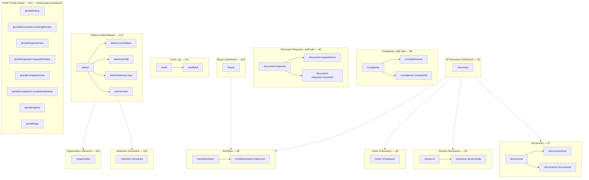

# F1. Application Route Map — Pre-dev

**Document ID:** F1
**Type:** Frontend route map — `/apps/web`, Phase 1, plus the Phase 1 Public Portal Subset
**Status:** DRAFT — pre-development proposal, not yet reviewed or approved
**Date:** June 18, 2026
**Based on:**
- F1-Context — `f1-context-application-route-map.md`
- I2 — `i2-application-route-map-role-permissions.md`
- E1 — `e1-trpc-router-and-procedure-catalog.md`

**Audience:** Frontend development team; cross-referenced by backend team for role/procedure alignment

> **[Unverified — applies to this entire document]** Both source documents state directly that route paths, component names, and frontend information architecture are not defined anywhere in the material reviewed before this document. I2's closing line is explicit that producing F1 "still requires inventing route paths, component names, and tRPC procedure names not present in any source file reviewed so far." Every path, component name, page-composition choice, and navigation/nesting decision below is therefore this document's own proposed synthesis — not a confirmed fact — even in rows that are not individually re-tagged `[Inference]`. Required role(s) and primary data dependencies are different in kind: those are grounded directly in I2 and E1 wherever a matching permission row or tRPC procedure exists, and are individually flagged below wherever no such match exists. Read this whole document as a draft for development-team review, not as approved architecture.

## Table of Contents

- [L40–L57] 1. Notation and how to read this document — Definitions of truth/inference status tags and general phrasing rules used throughout the document.
- [L58–L99] 2. Cross-cutting notes (apply to every route below) — App boundaries, internal role definitions, tRPC/REST division, excluded out-of-scope phases, and added staff-side routes.
- [L100–L181] 3. Route hierarchy — Mermaid flowchart showing route nesting structure and navigational cross-links for the frontend web app.
- [L182–L223] 4. Master route table (by path) — Alphabetical table mapping route paths to React components, required roles, tRPC procedures, and nested children.
- [L224–L243] 5. SP Secretary dashboard — Dashboard widget definitions, data mappings, and navigation logic for the SP Secretary role.
- [L244–L259] 6. Order of Business view — Permissions, data requirements, and override procedures for scheduling and managing the legislative session's agenda.
- [L260–L299] 7. Document intake form (and the document list / document detail routes it depends on) — Routes, roles, and tRPC procedures for document intake, listing, and lifecycle detail views.
- [L300–L361] 8. Workflow step action views (and staff-side complaint / document request management) — Task inbox, dynamic step-action views with conditional rendering panels, and staff-side complaint and document request management.
- [L362–L372] 9. Session attendance tracking — Attendance tracking routes, role rules, and the Phase 1B substitute-officer document tension.
- [L373–L382] 10. Mayor dashboard — Dashboard setup, proposed signature queues, and SLA tracking details for the Mayor role.
- [L383–L396] 11. Audit log viewer — Routes, roles, and tRPC dependencies for user-specific logs and auditor-only full logs.
- [L397–L438] 12. Platform Administrator views — Administrative routes, role management, platform configurations, retention schedules, organizational charts, and System Admin gaps.
- [L439–L467] 13. Phase 1 public portal subset — Citizen-facing routes, public access gates, and unresolved hosting-app and authentication questions.
- [L468–L484] 14. Known gaps and open questions — Consolidated table tracking the ten outstanding gaps, unverified procedures, and design open questions.
- [L485–L496] 15. Items considered and not given a dedicated route — List of features and documents excluded from dedicated routing, and their design rationales.
- [L497–L501] Correction check — Verification checklist and correction protocol statement for any unverified assertions in this document.

---

---

## 1. Notation and how to read this document

| Tag | Meaning |
|---|---|
| `[Confirmed — source]` | Directly traceable to a named section of F1-Context, I2, or E1 |
| `[Inference]` | A reasonable conclusion drawn from confirmed facts — logically reasoned, not itself confirmed |
| `[Speculation]` | An unconfirmed possibility raised because the source material is silent or ambiguous; offered for the team to resolve, not asserted as likely |
| `[Unverified]` | No reliable source exists either way — most often used here where a route's natural data dependency has no matching tRPC procedure in E1, or where a REST endpoint is referenced but not catalogued anywhere reviewed |
| `[Deferred]` | E1 itself marks the underlying procedure as deferred to a follow-up addendum; carried forward from E1's own notation |

Inferences are not chained: each judgment call is labeled individually at the point it is made rather than folded into a single compound conclusion. Where a row rests on more than one uncertain step, each step gets its own tag rather than one tag covering the whole row.

This document avoids describing route or system behavior with the words "prevent," "guarantee," "will never," "fixes," "eliminates," or "ensures that," other than inside a direct citation.

If any statement below is later found to assert an unverified claim as fact, the correction note at the end of this document applies: *"Correction: I made an unverified claim. That was incorrect."*

---

## 2. Cross-cutting notes (apply to every route below)

### 2.1 App boundary

`[Confirmed — F1-Context §1.1–1.2, §10]` Every route in Sections 5–12 belongs to `/apps/web` (the Vite + React SPA, tRPC-backed). `[Unverified — F1-Context §10 raises this directly and does not resolve it]` Whether Section 13's public-portal routes are served from unauthenticated routes inside `/apps/web` or from the separately stack-documented `/apps/portal` (Next.js, described elsewhere as Phase 3) is not settled by either source file reviewed for this document. Section 13 proposes `/portal/...` paths regardless of hosting app and repeats the open question in Section 14 rather than resolving it here.

### 2.2 Role reference

`[Confirmed — I2 §2; role codes confirmed — E1, Shared Fragment Schemas, roleCodeEnum]`

| # | Role | E1 role code |
|---|---|---|
| 1 | System Administrator | `sys_admin` |
| 2 | Platform Administrator | `plat_admin` |
| 3 | Records Officer | `records_officer` |
| 4 | Department Encoder | `dept_encoder` |
| 5 | Department Approver | `dept_approver` |
| 6 | SP Secretary | `sp_secretary` |
| 7 | SP Member | `sp_member` |
| 8 | SP Presiding Officer | `sp_presiding_officer` |
| 9 | Mayor | `mayor` |
| 10 | Barangay Encoder | `brgy_encoder` |
| 11 | Barangay Captain | `brgy_captain` |
| 12 | Auditor | `auditor` |
| 13 | Citizen | `citizen` |

"Required role(s)" below uses the readable names from this table. Most roles are further narrowed by office- or classification-level ABAC scoping on top of the base role gate (per I1, as cited inside I2 and E1). This document notes that narrowing in prose where it changes who effectively sees what, without re-deriving the full ABAC cascade for every route.

### 2.3 tRPC vs. REST boundary

`[Confirmed — E1, "Note on Scope"]` tRPC procedures cover `/web` only. Citizen self-service — complaint submission, document request submission, public tracking lookup, public document browsing — is explicitly out of E1's scope and is REST, served by the portal module. Wherever a route below is citizen-facing self-service, its data-dependency cell reads `[Unverified] — REST, not catalogued in any source reviewed`, rather than a guessed endpoint name.

### 2.4 Scope inherited from prior curation

`[Confirmed — F1-Context §12; I2 §13]` Carried forward as out of scope for this route map: the Designation document type as a Phase 1 entity (Phase 1B), Barangay Resolution/Budget workflows (Phase 1B), Letters/Memos/NCH/NOSP document types (Phase 1B), generic account-settings/profile screens (no named F1 view covers them), and Phase 2 items (`parallel_split`/`parallel_join` step types, the Reporting module, the Search-meta module, RMS bulk operations). One related item is carried into Section 9 as a flagged tension rather than a silent exclusion: Session Attendance Tracking's "designated substitute" field textually depends on a Designation document even though the Designation document type itself is Phase 1B.

### 2.5 Two routes this document adds beyond the nine named areas

`[Inference]` Two small staff-side resources — Complaint Management and Document Request Management — are included as companions to Workflow Step Action Views (Section 8) rather than as their own top-level area, because F1-Context's own Section 5 already discusses citizen-complaint resolution as an example of a non-legislative, step-driven workflow, and both resources are backed by confirmed Phase-1 tRPC routers (`complaints`, `documentRequests`) that have no other obvious home among the nine named views. These are flagged here so the addition is visible rather than silently folded in.

---

## 3. Route hierarchy

`[Inference]` Solid arrows are true nested (parent/child) routes. Dotted arrows are navigational cross-links between independently-routed siblings — not nesting. Two reference pages (`/organization`, `/retention-schedules`) are placed at top level rather than nested under `/admin` specifically because I2 shows several non-Platform-Administrator roles also need direct view access to them; nesting them under an admin-only path segment would force those roles through a path they are not gated to enter. This reasoning is explained again at each affected route in Sections 8 and 12.

---

## 4. Master route table (by path)

Sorted alphabetically by path. "Primary data dependencies" lists tRPC procedures by their literal `router.procedure` name; entries marked `[Unverified]` or `[Deferred]` have no confirmed procedure and are explained in the linked section. "Children" lists only true nested routes, not cross-links.

| Route path | Component | Required role(s) | Primary data dependencies | Children |
|---|---|---|---|---|
| `/admin` | `PlatformAdminHomePage` | Platform Administrator | None of its own (navigation shell) | Yes — `/admin/committees`, `/admin/config`, `/admin/delivery-logs`, `/admin/roles` |
| `/admin/committees` | `CommitteeManagementPage` | Platform Administrator | `organization.createCommittee`, `organization.updateCommittee`, `organization.assignCommitteeMembership` — **no list/read procedure exists; see §8.4 and §14** | No |
| `/admin/config` | `PlatformConfigPage` | Platform Administrator (intended) | `[Deferred]` — no confirmed procedures; see §12.4 and E1 follow-up item E1-F1 | No |
| `/admin/delivery-logs` | `NotificationDeliveryLogsPage` | Platform Administrator (System Administrator may also reach this — see §12.5) | `notifications.listDeliveryLogs` | No |
| `/admin/roles` | `RoleAssignmentPage` | Platform Administrator | `iam.listUserDirectory`, `iam.assignRole`, `iam.revokeRole`, `iam.editUserAccount` — **role *assignment* only, not role/permission *definition*; see §12.3** | No |
| `/audit` | `AuditLogPage` | All 12 internal roles (own actions); office-scope tab additionally for Records Officer, Department Approver, SP Secretary, SP Presiding Officer, Mayor, Barangay Captain, Auditor | `audit.listOwnActions`, `audit.listOwnOfficeDocumentActions` | Yes — `/audit/full` |
| `/audit/full` | `AuditFullLogPage` | Auditor only (System Administrator is excluded from full-log view despite holding chain-validation rights — see §11.2) | `audit.listFullLog`, `audit.validateChainIntegrity`, `audit.exportEvents` | No |
| `/complaints` | `ComplaintsListPage` | SP Secretary, SP Presiding Officer, Auditor (unconditional); SP Member (committee-scoped) | `complaints.listAll` | Yes — `/complaints/new`, `/complaints/:complaintId` |
| `/complaints/:complaintId` | `ComplaintDetailPage` | SP Secretary (full); SP Member (committee-scoped report entry); SP Presiding Officer, Auditor (read) | `complaints.logAndAssign`, `complaints.enterCommitteeReport`, `complaints.setOutcome` — **single-record read has no confirmed procedure; see §8.5** | No |
| `/complaints/new` | `ComplaintIntakeClerkAssistedPage` | SP Secretary only | `complaints.createClerkAssisted` | No |
| `/document-requests` | `DocumentRequestsListPage` | SP Secretary, SP Presiding Officer, Auditor | `documentRequests.listAll` | Yes — `/document-requests/new`, `/document-requests/:requestId` |
| `/document-requests/:requestId` | `DocumentRequestDetailPage` | SP Presiding Officer (first approval); SP Secretary (second approval, release) | `documentRequests.approveAsPresidingOfficer`, `documentRequests.approveAsSecretary`, `documentRequests.releaseCopy`, `documentRequests.generatePrintableForm` — **single-record read has no confirmed procedure; see §8.5** | No |
| `/document-requests/new` | `DocumentRequestIntakeClerkAssistedPage` | SP Secretary only | `documentRequests.createClerkAssisted`, `documentRequests.generatePrintableForm` | No |
| `/documents` | `DocumentListPage` | Records Officer, Department Encoder, Department Approver, SP Secretary, SP Member, SP Presiding Officer, Mayor, Barangay Encoder, Barangay Captain, Auditor | `documents.list`, `documents.search` | Yes — `/documents/new`, `/documents/:documentId` |
| `/documents/:documentId` | `DocumentDetailPage` | Same 10 roles as `/documents`, each further scoped by office/classification ABAC | `documents.get` plus ~20 related procedures grouped in §7.3 | No |
| `/documents/new` | `DocumentIntakeFormPage` | Department Encoder, Department Approver, SP Secretary, SP Member, SP Presiding Officer, Mayor, Barangay Encoder, Barangay Captain | `documents.create`, `documents.requestUploadUrl`, `documents.confirmUpload`, `documents.getScanQualityIndicator` | No |
| `/mayor` | `MayorDashboardPage` | Mayor only | `workflow.listMyAssignedSteps` (filtered), `workflow.getSlaComplianceData` — **filter logic is this document's proposal, not a named procedure; see §10** | No |
| `/order-of-business` | `OrderOfBusinessPage` | View: SP Secretary, SP Member, SP Presiding Officer, Mayor, Auditor. Manage: SP Secretary only | `session.getOrderOfBusiness`, `session.scheduleDocumentForFirstReading`, `session.enterCommitteeHearingDate`, `workflow.manuallyAdvanceMultiReferralStep` | No |
| `/organization` | `OrganizationManagementPage` | View: System Administrator, Platform Administrator, Records Officer, SP Secretary, SP Member, SP Presiding Officer, Mayor, Auditor, plus read-only for Department Encoder/Approver. Manage: Platform Administrator only | `organization.getOfficeHierarchy`; manage actions `organization.createOffice`/`updateOffice`/`deactivateOffice`, `createPosition`/`updatePosition`, `createEmployee`/`updateEmployee`, `assignEmployeeToPosition` | No |
| `/portal/complaints/:complaintId/status` | `PortalComplaintStatusPage` | Citizen (authenticated citizen session) | `[Unverified]` — REST, not catalogued in any source reviewed | No |
| `/portal/complaints/new` | `PortalComplaintFormPage` | Public / Citizen — see §13.2 on whether login is required | `[Unverified]` — REST, not catalogued in any source reviewed | No |
| `/portal/documents/:trackingNumber` | `PortalDocumentViewPage` | Public, no authentication required | `[Unverified]` — REST, not catalogued in any source reviewed | No |
| `/portal/login` | `PortalCitizenLoginPage` | Public (unauthenticated, by definition) | `[Unverified]` — REST, not catalogued in any source reviewed | No |
| `/portal/lookup` | `PortalTrackingLookupPage` | Public, no authentication required | `[Unverified]` — REST, not catalogued in any source reviewed | No |
| `/portal/register` | `PortalCitizenRegisterPage` | Public (unauthenticated, by definition) | `[Unverified]` — REST, not catalogued in any source reviewed | No |
| `/portal/requests/:requestId/status` | `PortalDocumentRequestStatusPage` | Citizen (authenticated citizen session) | `[Unverified]` — REST, not catalogued in any source reviewed | No |
| `/portal/requests/new` | `PortalDocumentRequestFormPage` | Public / Citizen — see §13.2 on whether login is required | `[Unverified]` — REST, not catalogued in any source reviewed | No |
| `/retention-schedules` | `RetentionSchedulesPage` | View: Platform Administrator, Records Officer, SP Secretary, Auditor. Propose/activate: see §12.6, no confirmed procedure | `records.getRetentionSchedule` | No |
| `/secretary` | `SecretaryDashboardPage` | SP Secretary only | `workflow.listMyAssignedSteps`, `documents.list` (filtered), `session.getOrderOfBusiness`, `workflow.getSlaComplianceData` | No (cross-links to sibling routes — see §5) |
| `/sessions` | `SessionAttendanceOverviewPage` | View: SP Secretary, SP Member, SP Presiding Officer, Mayor, Auditor | `session.getAttendanceStatistics` | Yes — `/sessions/:sessionDate` |
| `/sessions/:sessionDate` | `SessionAttendanceDetailPage` | View: same as above. Record attendance: SP Secretary only | `session.getAttendanceRecord`, `session.recordAttendance` | No |
| `/workflow/steps` | `MyAssignedStepsPage` | Records Officer, Department Encoder, Department Approver, SP Secretary, SP Member, SP Presiding Officer, Mayor, Barangay Encoder, Barangay Captain | `workflow.listMyAssignedSteps` | Yes — `/workflow/steps/:instanceId` |
| `/workflow/steps/:instanceId` | `WorkflowStepActionPage` | Varies by step type/name — see §8.2 | `workflow.getInstance` plus a step-specific mutation — see §8.2 | No (single dynamic route; renders different action panels conditionally — see §8.2) |

## 5. SP Secretary dashboard

**Path:** `/secretary` · **Component:** `SecretaryDashboardPage` · **Role:** SP Secretary only `[Confirmed — I2 §4: "View SP Secretary dashboard (queue, pending, session calendar)" is checked only for SP Secretary]`

F1-Context's Phase 1 deliverables list names four widgets for this dashboard: queue, pending items, session calendar, and an Order of Business view `[Confirmed — F1-Context §2]`. Neither source states which literal procedure backs each widget, so the mapping below is this document's own synthesis using the closest-matching confirmed procedures, not a source-stated mapping:

| Widget | Proposed data dependency | Status |
|---|---|---|
| Queue (assigned/pending steps) | `workflow.listMyAssignedSteps` | `[Inference]` |
| Pending items (documents awaiting Secretariat action) | `documents.list` filtered to SP Secretariat scope | `[Inference]` |
| Session calendar preview | `session.getOrderOfBusiness` | `[Inference]` |
| Order of Business summary / link-out | same call as above, or a link to `/order-of-business` | `[Inference]` |
| SLA / ARTA compliance indicator (optional) | `workflow.getSlaComplianceData` | `[Inference]` — SP Secretary's read access to this procedure is confirmed in I2 §16, but its presence on this specific dashboard is this document's proposal, not source-stated |

**Children:** None nested. The dashboard cross-links to three independently-routed siblings: `/order-of-business`, `/workflow/steps`, and `/sessions`.

`[Inference]` F1-Context Part 4.18 describes Order of Business as something the SP Secretary dashboard "must include," which would suggest nesting it as `/secretary/order-of-business`. This document instead routes it as the independent top-level page `/order-of-business`, because I2 confirms four other roles (SP Member, SP Presiding Officer, Mayor, Auditor) need direct view access to it; nesting it under a Secretary-exclusive path segment would require those roles to pass through a URL segment gated to a role they do not hold. This is a frontend information-architecture judgment call, not a source-stated requirement, and the team may reasonably decide otherwise.

---

## 6. Order of Business view

**Path:** `/order-of-business` · **Component:** `OrderOfBusinessPage`

**Required role(s):** View — SP Secretary, SP Member, SP Presiding Officer, Mayor, Auditor `[Confirmed — I2 §3]`. Manage (schedule a document for first reading, enter a committee hearing date, override a multi-referral step) — SP Secretary only `[Confirmed — I2 §3, §6]`.

**Primary data dependencies:**
- `session.getOrderOfBusiness` — primary read
- `session.scheduleDocumentForFirstReading` — SP Secretary action
- `session.enterCommitteeHearingDate` — SP Secretary action
- `workflow.manuallyAdvanceMultiReferralStep` — SP Secretary override action, included here because I2 and F1-Context both tie multi-referral red-flagging to this view

**Children:** None proposed. A document quick-view may be implemented as a modal/drawer rather than a separate route — `[Speculation]`, not stated in either source.

---

## 7. Document intake form (and the document list / document detail routes it depends on)

The task names "document intake form" as a single view, but a usable intake flow needs a place to land after creation and a place to browse existing documents. The three routes below are presented together because they share the `/documents` path prefix and the same underlying procedures.

### 7.1 `/documents` — document list

**Component:** `DocumentListPage` · **Role:** Records Officer, Department Encoder, Department Approver, SP Secretary, SP Member, SP Presiding Officer, Mayor, Barangay Encoder, Barangay Captain, Auditor `[Confirmed — I2 §5, same role set as documents.get/list]`

**Data:** `documents.list`, `documents.search`. `[Inference]` A "scan to find" shortcut using `tracking.scanQrCodeAuthenticated` could reasonably live here as a search shortcut for staff with a physical document in hand; this is this document's own proposed addition, not a named requirement in either source.

### 7.2 `/documents/new` — document intake form

**Component:** `DocumentIntakeFormPage` · **Role:** Department Encoder, Department Approver, SP Secretary, SP Member, SP Presiding Officer, Mayor, Barangay Encoder, Barangay Captain `[Confirmed — E1 §3.1, documents.create callable-by list]`

**Data:** `documents.create`, `documents.requestUploadUrl`, `documents.confirmUpload`, `documents.getScanQualityIndicator`.

`[Inference]` This document proposes that the intake form handles initial creation and the first file attachment only, then redirects to `/documents/:documentId` for everything that follows (continued editing while in draft, formal submission, additional attachments). This keeps the creation screen simple, but it is a proposed flow, not a source-stated one — the team could equally choose a single-page flow that never navigates away.

### 7.3 `/documents/:documentId` — document detail

**Component:** `DocumentDetailPage` · **Role:** same 10 roles as `/documents`, each additionally scoped by office/classification ABAC `[Confirmed — E1 §3.1, documents.get callable-by list]`. System Administrator has a separate, narrower `documents.getMetadataForAdmin` procedure; `[Speculation]` this may need a conditional branch within the same component rather than a dedicated route, since System Administrator is not one of the nine named F1 views.

This is the richest page in the route map — nearly every document lifecycle action funnels through it. Grouped by purpose:

| Group | Procedures |
|---|---|
| Read | `documents.get`, `documents.getVersionHistory`, `documents.downloadVersion`, `documents.getOcrText` |
| Lifecycle | `documents.update`, `documents.submit`, `documents.assignPreliminaryNumber`, `documents.assignFinalNumber`, `documents.cancel`, `documents.delete`, `documents.archive`, `documents.logCertificationOfUrgency`, `documents.logSecretariatDecision` |
| Portal visibility | `documents.publishToPortal`, `documents.unpublishFromPortal` — the action that makes a document appear at `/portal/documents/:trackingNumber` (§13) |
| File & OCR | `documents.requestUploadUrl`, `documents.confirmUpload`, `documents.getScanQualityIndicator`, `documents.triggerManualReOcr`, `documents.flagScannedBackForVerification`, `documents.acceptScannedBackAsOfficial` |
| Tracking | `tracking.getTrackingRecord`, `tracking.printQrCoverSheet`, `tracking.getRoutingHistory`, `tracking.logRoutingEntry` |
| Workflow link-out | `workflow.getActiveInstanceForDocument` — links to `/workflow/steps/:instanceId` |
| Records | `records.applyClassification`, `records.isUnderLegalHold`, `records.placeLegalHold`, `records.removeLegalHold`, `records.applyRetentionSchedule` |

Each action above is gated to a narrower subset of the 10 page-level roles (e.g., `documents.archive` is Records Officer/SP Secretary only); per §2.2, this document does not re-derive every individual gate here, since the page-level table above already names the broadest group and the procedure list lets the dev team cross-reference E1 directly for each one's specific callable-by set.

**Children:** None.

---

## 8. Workflow step action views (and staff-side complaint / document request management)

I2 itself flags that this is "very likely not one route but a family of routes/components, each gated to a different role and a different step type," and notes that whether these become separate paths or one parameterized route "is a frontend architecture decision not addressed in either source file." This document resolves that open question by proposing one parameterized route with conditional internal panels — flagged here as a design choice, not a confirmed requirement.

### 8.1 `/workflow/steps` — task inbox

**Component:** `MyAssignedStepsPage` · **Role:** Records Officer, Department Encoder, Department Approver, SP Secretary, SP Member, SP Presiding Officer, Mayor, Barangay Encoder, Barangay Captain `[Confirmed — E1, workflow.listMyAssignedSteps callable-by list]`

**Data:** `workflow.listMyAssignedSteps`. Each returned row carries both a `stepInstanceId` and the parent `instanceId` — relevant to the routing decision in §8.2.

### 8.2 `/workflow/steps/:instanceId` — step action detail

**Component:** `WorkflowStepActionPage`

`[Inference]` The dynamic segment is named `:instanceId`, not `:stepInstanceId`, for a specific reason: `workflow.getInstance` — the natural read procedure for this page — takes `instanceId` as its input and returns `currentStepInstanceId` and `currentStepType` in its output. The various write actions (below) take `stepInstanceId` directly. Routing by `instanceId` lets the page load with one read call and then pass the resulting `currentStepInstanceId` straight into whichever action mutation applies, without a second lookup. This is a proposed resolution to a real mismatch between the read and write procedures' input shapes — it is this document's own design choice, not stated in either source.

The page renders one of the following panels conditionally, based on `currentStepType` and `step.name` from the loaded instance, and on the caller's role:

| Panel | Applies when | Role(s) | Key procedures |
|---|---|---|---|
| Generic Action Panel | `step_type = 'action'` (default) | Department Encoder/Approver (own/assigned scope), SP Secretary, SP Presiding Officer, Mayor, Barangay Encoder (own/assigned scope), Barangay Captain | `workflow.completeActionStep` |
| Generic Approval Panel | `step_type = 'approval'` (excluding the two named panels below) | Department Approver, SP Secretary, Mayor, Barangay Captain | `workflow.approveStep`, `workflow.rejectStep`, `workflow.returnStepForRevision` |
| Secretariat Decision Panel | `step_type` is `action` or `approval` AND the assignee office is the SP Secretariat | SP Secretary | `documents.logSecretariatDecision` |
| VP Certification Panel | `step.name = 'vp_certification'` | SP Presiding Officer | `workflow.certifyAsPresidingOfficer` |
| Mayor Decision Panel | `step.name` is `mayor_review` or `mayor_signature` | Mayor | `workflow.mayorSign`, `workflow.mayorVeto` |
| Mayor Lapse Confirmation Panel | system-triggered 10-day lapse, pending confirmation | SP Secretary | `workflow.logMayorLapseConfirmation` |
| Veto Override Recording Panel | post-veto-override-vote step | SP Secretary | `workflow.recordVetoOverrideVote` |
| Multi-Referral Panel | `step_type = 'multi_referral'` | SP Secretary; SP Member (committee-scoped) | `workflow.submitCommitteeReport`, `workflow.manuallyAdvanceMultiReferralStep` (SP Secretary only), `session.enterCommitteeHearingDate` (SP Secretary only) |
| Docketing Panel | `step.name = 'docketing'` `[Inference — the literal step-name value is not confirmed in source, only the existence of the action]` | SP Secretary | `workflow.logDocketingCompletion` |
| Panlalawigan Outcome Panel | `step.name = 'panlalawigan_review'` | SP Secretary | `workflow.recordPanlalawiganOutcome`, `workflow.resolveValidInPart` (when outcome is valid-in-part), `workflow.confirmPanlalawiganDeemedApproved` (after the 30-day window) |
| Publication Date Panel | penalty ordinance pending newspaper publication | SP Secretary | `workflow.recordNewspaperPublicationDate` |

Every panel also reads from the same `workflow.getInstance` call that loaded the page. `step_type` values `parallel_split` and `parallel_join` are Phase 2 per §2.4 and have no panel here.

**Children:** None — a single dynamic route with conditional rendering, not a route per step type.

### 8.3 `/complaints`, `/complaints/new`, `/complaints/:complaintId` — staff-side complaint management

These are placed here, not under §13, because they are internal-staff, tRPC-backed, and Phase 1 per E1's `complaints` router, which is explicitly marked "Internal Staff Side Only" — distinct from the citizen-facing complaint submission in §13, which is REST.

- **`/complaints` (`ComplaintsListPage`):** Role — SP Secretary, SP Presiding Officer, Auditor (unconditional), SP Member (committee-scoped). Data — `complaints.listAll`.
- **`/complaints/new` (`ComplaintIntakeClerkAssistedPage`):** Role — SP Secretary only. Data — `complaints.createClerkAssisted`, used for the in-person, clerk-assisted intake mode described in F1-Context §10.
- **`/complaints/:complaintId` (`ComplaintDetailPage`):** Role — SP Secretary (log and assign, set outcome), SP Member (committee-scoped report entry), SP Presiding Officer/Auditor (read). Data — `complaints.logAndAssign`, `complaints.enterCommitteeReport`, `complaints.setOutcome`.

`[Unverified]` E1's `complaints` router has no single-record read procedure (no `complaints.get`). A detail page would need to either filter the already-loaded `complaints.listAll` result client-side, or the backend team would need to add a missing procedure. This is flagged again in §14.

### 8.4 `/document-requests`, `/document-requests/new`, `/document-requests/:requestId` — staff-side document request management

Same placement reasoning as §8.3: E1's `documentRequests` router is marked "Internal Staff Side Only" and is distinct from the citizen-facing submission flow in §13.

- **`/document-requests` (`DocumentRequestsListPage`):** Role — SP Secretary, SP Presiding Officer, Auditor. Data — `documentRequests.listAll`.
- **`/document-requests/new` (`DocumentRequestIntakeClerkAssistedPage`):** Role — SP Secretary only. Data — `documentRequests.createClerkAssisted`, `documentRequests.generatePrintableForm`.
- **`/document-requests/:requestId` (`DocumentRequestDetailPage`):** Role — SP Presiding Officer (first approval), SP Secretary (second approval, then release). Data — `documentRequests.approveAsPresidingOfficer`, `documentRequests.approveAsSecretary`, `documentRequests.releaseCopy`, `documentRequests.generatePrintableForm`.

`[Unverified]` Same gap as §8.3: E1's `documentRequests` router has no single-record read procedure either.

### 8.5 Committee picker gap

`[Unverified]` The Multi-Referral Panel in §8.2 needs to know which committees exist in order to let SP Secretary assign or reassign a referral, but E1's `organization` router has no list/read procedure for committees — only `createCommittee`, `updateCommittee`, and `assignCommitteeMembership` exist. This gap is more consequential than a missing single-record read, since it affects a control that multiple panels depend on, and is repeated in §14.

---

## 9. Session attendance tracking

**Path:** `/sessions` (overview) and `/sessions/:sessionDate` (detail)

- **`/sessions` (`SessionAttendanceOverviewPage`):** Role — SP Secretary, SP Member, SP Presiding Officer, Mayor, Auditor `[Confirmed — I2 §3]`. Data — `session.getAttendanceStatistics`.
- **`/sessions/:sessionDate` (`SessionAttendanceDetailPage`):** Role — same view roles; recording attendance is SP Secretary only. Data — `session.getAttendanceRecord`, `session.recordAttendance`.

`[Confirmed — F1-Context §6]` F1-Context lists a "designated substitute" field for when the SP Presiding Officer is absent, describing it as requiring a Designation document. `[Unverified]` This creates a direct tension with §2.4: the Designation document type itself is Phase 1B per both source files' own exclusion lists, yet this Phase 1 view appears to depend on it. Neither source resolves whether Session Attendance should (a) display a plain read-only substitute-officer name with no Designation-document linkage in Phase 1, (b) be blocked from showing this field until the Designation document type ships, or (c) something else. This document does not pick one of those options and flags it instead.

---

## 10. Mayor dashboard

**Path:** `/mayor` · **Component:** `MayorDashboardPage` · **Role:** Mayor only `[Confirmed — I2 §4]`

`[Inference]` F1-Context does not describe this dashboard's contents beyond "pending signatures, overdue items," and no procedure named `workflow.getMayorPendingSignatures` or similar exists in E1. The data dependency proposed here is `workflow.listMyAssignedSteps`, filtered (client-side or via a future server-side parameter) to step types/names matching the Mayor Decision Panel in §8.2, plus `workflow.getSlaComplianceData` for an overdue-items indicator. Both the filter logic and the choice to surface SLA data here are this document's proposal, not a source-stated requirement.

**Children:** None nested — action happens by navigating to `/workflow/steps/:instanceId` for the specific item.

---

## 11. Audit log viewer

### 11.1 `/audit` — own actions

**Component:** `AuditLogPage` · **Role:** all 12 internal roles, for their own actions; an office-scope tab is additionally available to Records Officer, Department Approver, SP Secretary, SP Presiding Officer, Mayor, Barangay Captain, and Auditor `[Confirmed — I2 §15]`. **Data:** `audit.listOwnActions`, `audit.listOwnOfficeDocumentActions`.

### 11.2 `/audit/full` — full log

**Component:** `AuditFullLogPage` · **Role:** Auditor only. **Data:** `audit.listFullLog`, `audit.validateChainIntegrity`, `audit.exportEvents`.

`[Confirmed — I2 §15]` I2's permission matrix shows "View audit log — all entries (full log)" checked only for Auditor, with System Administrator explicitly unchecked on that row — even though System Administrator separately holds "Validate audit log hash chain integrity." `[Speculation]` This document does not place a chain-validation-only control for System Administrator anywhere, since System Administrator is not one of the nine named F1 views; it is possible System Administrator reaches a narrower integrity-status indicator through an operations console outside this route map's scope, but that is not stated in either source.

---

## 12. Platform Administrator views

### 12.1 `/admin` — landing shell

**Component:** `PlatformAdminHomePage` · **Role:** Platform Administrator. No data of its own; links to its four nested children plus the two top-level cross-linked siblings described below.

### 12.2 `/admin/committees`

**Role:** Platform Administrator. **Data:** `organization.createCommittee`, `organization.updateCommittee`, `organization.assignCommitteeMembership`. As noted in §8.5, there is no confirmed read/list procedure for committees at all, so this page is currently write-only against an unverifiable read state — flagged again in §14.

### 12.3 `/admin/roles`

**Role:** Platform Administrator. **Data:** `iam.listUserDirectory` (to find a user), `iam.assignRole`, `iam.revokeRole`, `iam.editUserAccount`.

`[Unverified]` I2's permission matrix lists "Create / edit role definitions and permissions" as a Platform Administrator Tier-2 capability, but E1 catalogues no procedure for defining new roles or permission sets — only `iam.assignRole`/`revokeRole`, which assign or remove one of the 13 *already-fixed* roles (`roleCodeEnum` is a closed enum in E1's schema) to or from a user. This route, as designed, covers assignment only. Whether Phase 1 needs a true role/permission *definition* builder, or whether I2's matrix row describes a Phase-2-or-later capability, is not resolved by either source.

### 12.4 `/admin/config`

**Role:** Platform Administrator (intended). **Data:** `[Deferred]` — E1's own "Required Follow-Up Before Full Sign-Off" section (item E1-F1) states that document-type, numbering-series, workflow-definition, notification-template, SLA-threshold, and public-visibility-rule CRUD procedures are deferred from its detailed treatment. No confirmed tRPC procedure exists for any of these six configuration entities. This document does not invent procedure names for them.

### 12.5 `/admin/delivery-logs`

**Role:** Platform Administrator. `[Confirmed — I2]` System Administrator also has read access to delivery logs per I2's matrix. `[Speculation]` Whether the two roles share this exact page or System Administrator reaches the same data through a separate operations view is not stated in either source. **Data:** `notifications.listDeliveryLogs`.

### 12.6 `/retention-schedules` (top-level, cross-linked from `/admin`)

**Role:** View — Platform Administrator, Records Officer, SP Secretary, Auditor `[Confirmed — I2, retention-schedule-list row]`. **Data:** `records.getRetentionSchedule`.

`[Inference]` This route is placed at top level rather than nested under `/admin`, for the same reason as `/organization` in §12.7: multiple non-Platform-Administrator roles need direct view access. `[Unverified]` I2's conditional notes describe Records Officer "proposing" a new schedule and Platform Administrator giving "final activation," but E1's `records` router contains no creation or activation procedure for retention schedules at all — only `getRetentionSchedule` (read) and `applyRetentionSchedule` (apply an *existing* schedule to a specific record, Records Officer only, surfaced on `/documents/:documentId` per §7.3, not here). Schedule creation and activation therefore have no confirmed procedure to build against.

### 12.7 `/organization` (top-level, cross-linked from `/admin`)

**Role:** View — System Administrator, Platform Administrator, Records Officer, SP Secretary, SP Member, SP Presiding Officer, Mayor, Auditor, plus read-only access for Department Encoder/Approver `[Confirmed — I2, organization-chart row and its conditional note]`. Manage (create/edit/deactivate offices, positions, employees; assign employees to positions) — Platform Administrator only. **Data:** `organization.getOfficeHierarchy` (read); `organization.createOffice`, `updateOffice`, `deactivateOffice`, `createPosition`, `updatePosition`, `createEmployee`, `updateEmployee`, `assignEmployeeToPosition` (manage, Platform Administrator only).

`[Inference]` Read and manage are proposed as one page with conditionally-rendered edit controls, rather than a public read-only route plus a separate admin-only edit route, because the underlying data (the office hierarchy) is a single small reference dataset rather than something that benefits from two different page layouts. This is a design choice, not a source requirement.

### 12.8 System Administrator — a named gap, not a built section

`[Confirmed — I2]` Several Tier-1 procedures exist for System-Administrator-level actions with no Platform-Administrator overlap: `iam.listAllActiveSessions`, `iam.forceTerminateSession`, `iam.createUserAccount`/`editUserAccount`/`deactivateUserAccount`/`reactivateUserAccount`, and the chain-validation capability noted in §11.2. The task scope for this document names "Platform Administrator views," not "System Administrator views," and I2 itself raises as an open question whether System Administrator needs distinct views at all. `[Speculation]` This document does not build a System Administrator section with confident paths and component names, since doing so would extend beyond what was asked; it instead names the relevant procedures here so a future addendum can route them.

---

## 13. Phase 1 public portal subset

### 13.1 Hosting app — open question, not resolved here

`[Unverified — F1-Context §10 raises this directly]` All routes below are written with a `/portal` prefix purely for readability in this document. Whether they will physically live inside `/apps/web` (as unauthenticated routes) or inside the separately-documented `/apps/portal` is not settled by either source file. This is restated as the first item in §14.

### 13.2 Routes

| Route path | Component | Role | Notes |
|---|---|---|---|
| `/portal/lookup` | `PortalTrackingLookupPage` | Public, no authentication required | Tracking-number / QR-scan entry point |
| `/portal/documents/:trackingNumber` | `PortalDocumentViewPage` | Public, no authentication required | Shows a document only after `documents.publishToPortal` has been called from `/documents/:documentId` (§7.3) |
| `/portal/register` | `PortalCitizenRegisterPage` | Public (unauthenticated, by definition) | Backs the citizen registration/OTP-verification flow described in F1-Context §10 |
| `/portal/login` | `PortalCitizenLoginPage` | Public (unauthenticated, by definition) | Password + phone OTP, per F1-Context §10 |
| `/portal/requests/new` | `PortalDocumentRequestFormPage` | Public / Citizen — see note below | Digital-form intake mode (mode 2 of three access modes in F1-Context §10) |
| `/portal/requests/:requestId/status` | `PortalDocumentRequestStatusPage` | Citizen, authenticated citizen session `[Confirmed — I2: "View own document request status" is Citizen-only]` | |
| `/portal/complaints/new` | `PortalComplaintFormPage` | Public / Citizen — see note below | |
| `/portal/complaints/:complaintId/status` | `PortalComplaintStatusPage` | Citizen, authenticated citizen session `[Confirmed — I2: "View own submitted complaint and status" is Citizen-only]` | |

**Primary data dependencies for every row above:** `[Unverified]` — REST, not catalogued in any source reviewed. E1 explicitly scopes citizen self-service out of its tRPC catalogue (§2.3 above); no REST endpoint catalogue was provided to cross-reference, so no endpoint names are stated here.

`[Unverified]` Whether `/portal/requests/new` and `/portal/complaints/new` require an authenticated citizen account, or are no-login public forms that simply generate a printable artifact for physical signature, is not stated in either source. F1-Context describes the citizen registration/OTP/login system as confirmed Phase 1 scope, and separately describes a clerk-assisted, in-person intake mode that does not obviously require the citizen to hold a digital account at all (handled instead via §8.3/§8.4 on the staff side). The exact gating relationship between the two is not stated.

`[Unverified]` I2 lists a "Post announcement on public portal" write action for Platform Administrator/SP Secretary, which implies a citizen-facing announcements page should exist somewhere, but neither source names such a page among the nine areas in this task's scope, and no tRPC procedure backs the write action either. This is flagged in §14 rather than given a confident route.

**Children:** None nested for any portal route in this draft.

---

## 14. Known gaps and open questions

| # | Gap / question | Where it surfaces | Status |
|---|---|---|---|
| 1 | Which app hosts the Phase 1 public portal — unauthenticated `/apps/web` routes, or `/apps/portal` | §2.1, §13.1 | `[Unverified]` — raised in F1-Context, not resolved there or here |
| 2 | Platform Admin Tier-2 config CRUD (document types, workflow definitions, notification templates, SLA thresholds, numbering series, public visibility rules) has no confirmed tRPC procedure | §12.4 | `[Deferred]` — E1's own follow-up item E1-F1 |
| 3 | Retention schedule creation/activation has no confirmed procedure (only read and apply-to-existing-record exist) | §12.6 | `[Unverified]` |
| 4 | Committee list/read has no confirmed procedure — affects both `/admin/committees` and the Multi-Referral Panel's committee picker | §8.5, §12.2 | `[Unverified]` |
| 5 | `complaints` and `documentRequests` routers have no single-record read procedure | §8.3, §8.4 | `[Unverified]` |
| 6 | Public-portal announcement posting has a write permission in I2 but no backing procedure, and no named public-facing announcements page | §13.2 | `[Unverified]` |
| 7 | Session Attendance's "designated substitute" field depends on the Designation document type, which is Phase 1B | §9 | `[Unverified]` — direct tension between two source statements |
| 8 | Whether System Administrator needs its own dedicated views distinct from Platform Administrator views | §12.8 | `[Speculation]` — raised in I2, not resolved there or here |
| 9 | Whether `/portal/requests/new` and `/portal/complaints/new` require an authenticated citizen account | §13.2 | `[Unverified]` |
| 10 | Whether the workflow step detail route should key on `instanceId` (proposed here) or `stepInstanceId` | §8.2 | `[Inference]` — this document's own proposed resolution, open to revision |

---

## 15. Items considered and not given a dedicated route

Consistent with the exclusions already established in F1-Context §12 and I2 §13 (see §2.4 above), the following were considered while drafting this map and deliberately not given a route:

- **Generic account settings / profile management** (`iam.getCurrentUser`, `iam.updateOwnProfile`, `iam.changeOwnPassword`) — no named F1 view covers this; `iam.getCurrentUser` is treated as cross-cutting app-shell plumbing (auth/role gating) rather than a page's primary data dependency.
- **A dedicated notifications inbox/preferences page** — `notifications.listMine`, `markAsRead`, `getOwnPreferences`, `updateOwnPreferences` are assumed to back a header dropdown widget shared across authenticated pages, not a standalone route, since no named F1 view calls for one. `[Speculation]`
- **A System Administrator dashboard** — see §12.8.
- **Designation document workflow, Barangay Resolution/Budget, Letters/Memos/NCH/NOSP** — Phase 1B per §2.4.
- **Phase 2 reporting/dashboard-builder pages** — `report_definitions` CRUD and the broader Reporting module are out of Phase 1 per E1's own scope notes.

---

## Correction check

This document was built by reading F1-Context, I2, and E1 in full and cross-referencing every role and procedure claim against those three files before writing it down — no role name or procedure name above was carried over without checking it against E1's callable-by lists or I2's permission matrix first. Every route path, component name, and information-architecture decision (nesting, the `/organization` and `/retention-schedules` top-level placement, the `:instanceId` routing choice, the decision to add staff-side Complaint and Document Request management) is this document's own proposed synthesis and is presented as such, not as confirmed fact. Ten open items are consolidated in §14 rather than silently resolved. No claim above uses "prevent," "guarantee," "will never," "fixes," "eliminates," or "ensures that" to describe behavior.

If a reviewer finds a place above where an unverified claim was stated as settled fact, the applicable note is: *Correction: I made an unverified claim. That was incorrect.*
