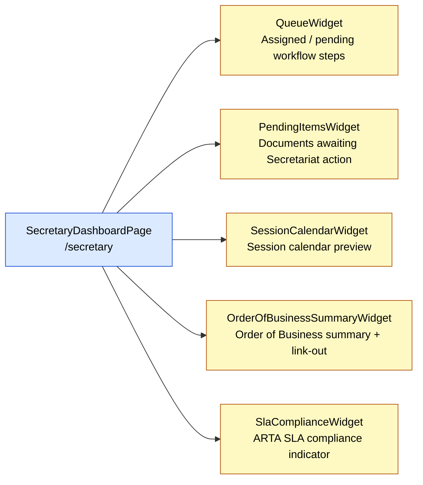

# Component Hierarchy Specification
## Batac City LGU Platform — Phase 1

**Document ID:** F2
**Type:** Component hierarchy specification — `/apps/web` Phase 1, plus Phase 1 public portal subset
**Status:** DRAFT — pre-development proposal
**Date:** June 2026
**Based on:**
- F1 — `f1-application-route-map.md`
- 2-Stack-Context — `2-stack-context.md`
- Consolidated Architecture & Requirements Reference — Iteration 3

**Audience:** Frontend development team

> **Inheritance of inference boundary from F1:** Component names, parent–child relationships derived from true route nesting, sub-component listings (panels, widgets), and required-role assignments are sourced directly from F1. Route paths, component names, and all frontend information-architecture decisions remain F1's own proposed synthesis — not approved architecture — per F1's own opening caveat. All inference-status tags below carry the same meaning as in F1 §1.


## Table of Contents

- [L44–L54] 1. Notation — Confidence tags indicating whether component hierarchy decisions are confirmed, inferred, unverified, or deferred.
- [L55–L93] 2. Overview — High-level summary of internal and public contexts, component count totals, and authorization role codes.
- [L94–L195] 3. Component Hierarchy — Visual nesting maps showing parent-child page routes and navigational cross-links for internal and portal contexts.
  - [L96–L176] 3.1 Internal Authenticated App (`/apps/web`) — Nesting outline of SP Secretary, platform admin, document management, and workflow inbox pages.
  - [L177–L195] 3.2 Public Portal Subset — Flat route sibling hierarchy for citizen registration, login, document requests, and complaint pages.
- [L196–L322] 4. Mermaid Diagrams — Flowcharts illustrating navigation maps, nested pages, conditional workflow panels, and secretary dashboard widgets.
  - [L198–L260] 4.1 Internal App — Full Page Hierarchy — Visual flowchart of internal routes, nested sub-pages, and navigational cross-links.
  - [L261–L296] 4.2 WorkflowStepActionPage — Conditional Panels — Visual diagram of the eleven workflow action and approval panels rendered dynamically.
  - [L297–L322] 4.3 SecretaryDashboardPage — Widget Composition — Visual composition of the five widgets within the SP Secretary's primary dashboard.
- [L323–L915] 5. Component Descriptions — Route properties, access roles, and specific tRPC/REST data dependencies for each frontend component.
  - [L325–L390] 5.1 Internal App — Dashboard & Scheduling Pages — Secretary and Mayor dashboard widgets, data queries, and session scheduling pages.
  - [L391–L457] 5.2 Internal App — Document Routes — Browsing, search, creation, and detail views for tracking document lifecycle actions and metadata.
  - [L458–L519] 5.3 Internal App — Workflow Routes & Conditional Panels — Inbox page and the eleven step-action panels gated by specific user roles.
  - [L520–L619] 5.4 Internal App — Staff-Side Complaint & Document Request Routes — Secretariat intake and detail views for managing in-person complaints and copy requests.
  - [L620–L655] 5.5 Internal App — Session Attendance Routes — Attendance statistics and detail entry pages, including Substitution and Designation edge cases.
  - [L656–L689] 5.6 Internal App — Audit Log Routes — User-specific actions, office-scoped document tracking, and tamper-evident chain validation pages.
  - [L690–L799] 5.7 Internal App — Platform Administration Routes — Committee, platform config, notification logs, role assignments, office hierarchy, and retention schedules.
  - [L800–L813] 5.8 Internal App — SecretaryDashboardPage Widgets — Task queue, pending items, session calendar, agenda summary, and SLA compliance sub-components.
  - [L814–L915] 5.9 Public Portal Subset — Page Components — Citizen registration, login, document lookup, complaint forms, and request tracking endpoints.
- [L916–L977] 6. Parent–Child Relationships — Tabular summary of structural route nesting, sub-component containments, and navigational cross-links.
- [L978–L997] 7. Open Items Inherited from F1 — Developer visibility tracker mapping design gaps and missing tRPC/REST backend procedures.

---

## 1. Notation

| Tag | Meaning |
|---|---|
| `[Confirmed — source]` | Directly traceable to F1, 2-Stack-Context, or the Architecture Reference |
| `[Inference]` | Reasonable conclusion drawn from confirmed facts; carried forward from F1 |
| `[Unverified]` | No reliable source exists either way; carried forward from F1 |
| `[Deferred]` | Underlying tRPC procedures are deferred per E1; carried forward from F1 §12.4 |

---

## 2. Overview

Phase 1 frontend comprises two application contexts:

| Context | Root App | Stack | Authentication |
|---|---|---|---|
| Internal Authenticated App | `/apps/web` | Vite + React SPA; tRPC-backed | All routes require authentication; role-gated via ABAC + RBAC `[Confirmed — 2-Stack-Context]` |
| Public Portal Subset | Hosting app unresolved — may be unauthenticated routes inside `/apps/web` or inside `/apps/portal` (Next.js) `[Unverified — F1 §2.1, §13.1]` | REST-backed; not tRPC `[Confirmed — F1 §2.3]` | Mixed: public (no auth required) + citizen-authenticated routes |

**Component count summary:**

| Category | Count |
|---|---|
| Internal app — page-level components | 25 |
| Internal app — `WorkflowStepActionPage` conditional panels | 11 |
| Internal app — `SecretaryDashboardPage` widgets | 5 |
| Public portal — page-level components | 8 |
| **Total** | **49** |

**Role codes referenced throughout this document** `[Confirmed — F1 §2.2]`:

| Role | Code |
|---|---|
| System Administrator | `sys_admin` |
| Platform Administrator | `plat_admin` |
| Records Officer | `records_officer` |
| Department Encoder | `dept_encoder` |
| Department Approver | `dept_approver` |
| SP Secretary | `sp_secretary` |
| SP Member | `sp_member` |
| SP Presiding Officer | `sp_presiding_officer` |
| Mayor | `mayor` |
| Barangay Encoder | `brgy_encoder` |
| Barangay Captain | `brgy_captain` |
| Auditor | `auditor` |
| Citizen | `citizen` |

---

## 3. Component Hierarchy

### 3.1 Internal Authenticated App (`/apps/web`)

Solid lines (`──`) indicate true route nesting: the parent page component renders the child via a React Router `<Outlet />`. Items listed with a `[/route]` annotation are routed children (they have their own URL). Items listed without a route annotation are sub-components rendered inside their parent's component tree (no separate URL).

```
InternalApp
│
├── SecretaryDashboardPage                                  [/secretary]
│   ├── QueueWidget
│   ├── PendingItemsWidget
│   ├── SessionCalendarWidget
│   ├── OrderOfBusinessSummaryWidget
│   └── SlaComplianceWidget
│
├── OrderOfBusinessPage                                     [/order-of-business]
│
├── OrganizationManagementPage  (a)                         [/organization]
│
├── RetentionSchedulesPage  (a)                             [/retention-schedules]
│
├── DocumentListPage                                        [/documents]
│   ├── DocumentIntakeFormPage                              [/documents/new]
│   └── DocumentDetailPage                                  [/documents/:documentId]
│
├── MyAssignedStepsPage                                     [/workflow/steps]
│   └── WorkflowStepActionPage                              [/workflow/steps/:instanceId]
│       ├── GenericActionPanel
│       ├── GenericApprovalPanel
│       ├── SecretariatDecisionPanel
│       ├── VpCertificationPanel
│       ├── MayorDecisionPanel
│       ├── MayorLapseConfirmationPanel
│       ├── VetoOverrideRecordingPanel
│       ├── MultiReferralPanel
│       ├── DocketingPanel
│       ├── PanlalawiganOutcomePanel
│       └── PublicationDatePanel
│
├── ComplaintsListPage                                      [/complaints]
│   ├── ComplaintIntakeClerkAssistedPage                    [/complaints/new]
│   └── ComplaintDetailPage                                 [/complaints/:complaintId]
│
├── DocumentRequestsListPage                                [/document-requests]
│   ├── DocumentRequestIntakeClerkAssistedPage              [/document-requests/new]
│   └── DocumentRequestDetailPage                           [/document-requests/:requestId]
│
├── SessionAttendanceOverviewPage                           [/sessions]
│   └── SessionAttendanceDetailPage                         [/sessions/:sessionDate]
│
├── MayorDashboardPage                                      [/mayor]
│
├── AuditLogPage                                            [/audit]
│   └── AuditFullLogPage                                    [/audit/full]
│
└── PlatformAdminHomePage                                   [/admin]
    ├── CommitteeManagementPage                             [/admin/committees]
    ├── PlatformConfigPage                                  [/admin/config]
    ├── NotificationDeliveryLogsPage                        [/admin/delivery-logs]
    └── RoleAssignmentPage                                  [/admin/roles]

(a) Placed at the top level of the route tree — not nested under /admin — because
    multiple non-Platform-Administrator roles need direct view access to these pages.
    Nesting under an admin-only path would require those roles to traverse a URL segment
    they are not gated to enter. [Inference — F1 §3, §12.6, §12.7]
```

#### Navigational Cross-Links

Dotted lines in the route hierarchy diagram. A cross-link is a navigation action (link, button, or widget shortcut) from one independently-routed page to another. Cross-links do not imply structural nesting and do not create parent–child route relationships.

| Source | Target | Nature |
|---|---|---|
| `SecretaryDashboardPage` | `OrderOfBusinessPage` | `OrderOfBusinessSummaryWidget` links out to `/order-of-business` |
| `SecretaryDashboardPage` | `MyAssignedStepsPage` | `QueueWidget` links out to `/workflow/steps` |
| `SecretaryDashboardPage` | `SessionAttendanceOverviewPage` | `SessionCalendarWidget` links out to `/sessions` |
| `SecretaryDashboardPage` | `DocumentListPage` | `PendingItemsWidget` links out to `/documents` |
| `MayorDashboardPage` | `MyAssignedStepsPage` | Pending-signature items navigate to `/workflow/steps` |
| `PlatformAdminHomePage` | `OrganizationManagementPage` | Navigation shell links to `/organization` |
| `PlatformAdminHomePage` | `RetentionSchedulesPage` | Navigation shell links to `/retention-schedules` |
| `DocumentDetailPage` | `WorkflowStepActionPage` | Workflow link-out via `workflow.getActiveInstanceForDocument` result |

### 3.2 Public Portal Subset

No true route nesting exists within the portal subset. All eight pages are siblings under the portal root context.

```
PublicPortalSubset  [hosting app unresolved — see §2]
│
├── PortalTrackingLookupPage                [/portal/lookup]
├── PortalDocumentViewPage                  [/portal/documents/:trackingNumber]
├── PortalCitizenRegisterPage               [/portal/register]
├── PortalCitizenLoginPage                  [/portal/login]
├── PortalDocumentRequestFormPage           [/portal/requests/new]
├── PortalDocumentRequestStatusPage         [/portal/requests/:requestId/status]
├── PortalComplaintFormPage                 [/portal/complaints/new]
└── PortalComplaintStatusPage               [/portal/complaints/:complaintId/status]
```

---

## 4. Mermaid Diagrams

### 4.1 Internal App — Full Page Hierarchy

Solid arrows (`-->`) = true route nesting (structural parent–child). Dotted arrows (`-.->`) = navigational cross-links (non-structural). Blue nodes = internal app page components. Pink nodes = public portal page components.

```mermaid
flowchart TD
    classDef page fill:#dbeafe,stroke:#1d4ed8,color:#000
    classDef portal fill:#fce7f3,stroke:#9d174d,color:#000
    classDef root fill:#f1f5f9,stroke:#475569,color:#000,font-weight:bold

    ROOT_INT["Internal Authenticated App\n/apps/web"]:::root
    ROOT_PORT["Public Portal Subset\nhosting app unresolved"]:::root

    %% Top-level internal pages
    ROOT_INT --> SEC["SecretaryDashboardPage\n/secretary"]:::page
    ROOT_INT --> OOB["OrderOfBusinessPage\n/order-of-business"]:::page
    ROOT_INT --> ORG["OrganizationManagementPage\n/organization"]:::page
    ROOT_INT --> RET["RetentionSchedulesPage\n/retention-schedules"]:::page
    ROOT_INT --> MAY["MayorDashboardPage\n/mayor"]:::page
    ROOT_INT --> DOCL["DocumentListPage\n/documents"]:::page
    ROOT_INT --> WFL["MyAssignedStepsPage\n/workflow/steps"]:::page
    ROOT_INT --> CML["ComplaintsListPage\n/complaints"]:::page
    ROOT_INT --> DRL["DocumentRequestsListPage\n/document-requests"]:::page
    ROOT_INT --> SESL["SessionAttendanceOverviewPage\n/sessions"]:::page
    ROOT_INT --> AUDL["AuditLogPage\n/audit"]:::page
    ROOT_INT --> ADMP["PlatformAdminHomePage\n/admin"]:::page

    %% True nested route children
    DOCL --> DOCN["DocumentIntakeFormPage\n/documents/new"]:::page
    DOCL --> DOCD["DocumentDetailPage\n/documents/:documentId"]:::page
    WFL --> WFD["WorkflowStepActionPage\n/workflow/steps/:instanceId"]:::page
    CML --> CMN["ComplaintIntakeClerkAssistedPage\n/complaints/new"]:::page
    CML --> CMD["ComplaintDetailPage\n/complaints/:complaintId"]:::page
    DRL --> DRN["DocumentRequestIntakeClerkAssistedPage\n/document-requests/new"]:::page
    DRL --> DRD["DocumentRequestDetailPage\n/document-requests/:requestId"]:::page
    SESL --> SESD["SessionAttendanceDetailPage\n/sessions/:sessionDate"]:::page
    AUDL --> AUDF["AuditFullLogPage\n/audit/full"]:::page
    ADMP --> ADMC["CommitteeManagementPage\n/admin/committees"]:::page
    ADMP --> ADMCFG["PlatformConfigPage\n/admin/config"]:::page
    ADMP --> ADMDL["NotificationDeliveryLogsPage\n/admin/delivery-logs"]:::page
    ADMP --> ADMR["RoleAssignmentPage\n/admin/roles"]:::page

    %% Navigational cross-links
    SEC -. "nav" .-> OOB
    SEC -. "nav" .-> WFL
    SEC -. "nav" .-> SESL
    SEC -. "nav" .-> DOCL
    MAY -. "nav" .-> WFL
    ADMP -. "nav" .-> ORG
    ADMP -. "nav" .-> RET
    DOCD -. "nav" .-> WFD

    %% Portal — flat structure
    ROOT_PORT --> PL["PortalTrackingLookupPage\n/portal/lookup"]:::portal
    ROOT_PORT --> PD["PortalDocumentViewPage\n/portal/documents/:trackingNumber"]:::portal
    ROOT_PORT --> PREG["PortalCitizenRegisterPage\n/portal/register"]:::portal
    ROOT_PORT --> PLOG["PortalCitizenLoginPage\n/portal/login"]:::portal
    ROOT_PORT --> PRN["PortalDocumentRequestFormPage\n/portal/requests/new"]:::portal
    ROOT_PORT --> PRS["PortalDocumentRequestStatusPage\n/portal/requests/:requestId/status"]:::portal
    ROOT_PORT --> PCN["PortalComplaintFormPage\n/portal/complaints/new"]:::portal
    ROOT_PORT --> PCS["PortalComplaintStatusPage\n/portal/complaints/:complaintId/status"]:::portal
```



### 4.2 WorkflowStepActionPage — Conditional Panels

A single dynamic route renders one of eleven panels conditionally, based on `currentStepType` and `step.name` values returned by `workflow.getInstance`. Only one panel is active at a time per workflow step instance.

```mermaid
flowchart TD
    classDef page fill:#dbeafe,stroke:#1d4ed8,color:#000
    classDef panel fill:#dcfce7,stroke:#15803d,color:#000

    WFD["WorkflowStepActionPage\n/workflow/steps/:instanceId"]:::page

    GAP["GenericActionPanel\nstep_type = 'action'"]:::panel
    GAPP["GenericApprovalPanel\nstep_type = 'approval'"]:::panel
    SDP["SecretariatDecisionPanel\nassignee office = SP Secretariat"]:::panel
    VCP["VpCertificationPanel\nstep.name = 'vp_certification'"]:::panel
    MDP["MayorDecisionPanel\nstep.name = 'mayor_review' or 'mayor_signature'"]:::panel
    MLCP["MayorLapseConfirmationPanel\n10-day lapse triggered by system"]:::panel
    VORP["VetoOverrideRecordingPanel\npost-veto-override-vote step"]:::panel
    MRP["MultiReferralPanel\nstep_type = 'multi_referral'"]:::panel
    DP["DocketingPanel\nstep.name = 'docketing'"]:::panel
    POP["PanlalawiganOutcomePanel\nstep.name = 'panlalawigan_review'"]:::panel
    PDP["PublicationDatePanel\npenalty ordinance — pending newspaper publication"]:::panel

    WFD --> GAP
    WFD --> GAPP
    WFD --> SDP
    WFD --> VCP
    WFD --> MDP
    WFD --> MLCP
    WFD --> VORP
    WFD --> MRP
    WFD --> DP
    WFD --> POP
    WFD --> PDP
```



### 4.3 SecretaryDashboardPage — Widget Composition

Five widgets compose the SP Secretary's primary operational hub. The `SlaComplianceWidget` is proposed as optional. `[Inference — F1 §5]`



---

## 5. Component Descriptions

### 5.1 Internal App — Dashboard & Scheduling Pages

---

#### `SecretaryDashboardPage`

| Field | Value |
|---|---|
| **Route** | `/secretary` |
| **Required role(s)** | SP Secretary only `[Confirmed — F1 §5]` |
| **Phase** | Phase 1 |
| **Children (routed)** | None — cross-links to sibling routes only |
| **Children (sub-components)** | `QueueWidget`, `PendingItemsWidget`, `SessionCalendarWidget`, `OrderOfBusinessSummaryWidget`, `SlaComplianceWidget` |

Primary operational hub for the SP Secretary. Aggregates four confirmed widgets (queue, pending items, session calendar, Order of Business summary) and one optional SLA compliance indicator. Cross-links to `/order-of-business`, `/workflow/steps`, `/sessions`, and `/documents`.

**Primary data dependencies** `[Inference — F1 §5]`:

| Widget | Procedure |
|---|---|
| Queue | `workflow.listMyAssignedSteps` |
| Pending items | `documents.list` (filtered to SP Secretariat scope) |
| Session calendar | `session.getOrderOfBusiness` |
| Order of Business summary | `session.getOrderOfBusiness` (same call, or link-out to `/order-of-business`) |
| SLA compliance | `workflow.getSlaComplianceData` |

---

#### `OrderOfBusinessPage`

| Field | Value |
|---|---|
| **Route** | `/order-of-business` |
| **Required role(s)** | View: SP Secretary, SP Member, SP Presiding Officer, Mayor, Auditor. Manage: SP Secretary only `[Confirmed — F1 §6; I2 §3, §6]` |
| **Phase** | Phase 1 |
| **Children (routed)** | None |

Session agenda management view. Displays all documents scheduled for the upcoming Tuesday session with committee report status. Items with missing or pending committee reports are marked red. SP Secretary can schedule documents for first reading, enter committee hearing dates, and manually override multi-referral steps (audit-logged with mandatory comment). `[Confirmed — Architecture Reference §4.18; F1 §6]`

**Primary data dependencies** `[Confirmed — F1 §6]`:

- `session.getOrderOfBusiness`
- `session.scheduleDocumentForFirstReading`
- `session.enterCommitteeHearingDate`
- `workflow.manuallyAdvanceMultiReferralStep`

---

#### `MayorDashboardPage`

| Field | Value |
|---|---|
| **Route** | `/mayor` |
| **Required role(s)** | Mayor only `[Confirmed — F1 §10; I2 §4]` |
| **Phase** | Phase 1 |
| **Children (routed)** | None — cross-links to `/workflow/steps` |

Mayor's operational hub for pending signature items and overdue documents. Navigates to `/workflow/steps/:instanceId` for any specific action item. No procedures named `workflow.getMayorPendingSignatures` or similar exist in E1; the Mayor dashboard is proposed to reuse `workflow.listMyAssignedSteps` filtered to mayoral-action step types, plus `workflow.getSlaComplianceData` for overdue indicators. `[Inference — F1 §10]`

**Primary data dependencies** `[Inference — F1 §10]`:

- `workflow.listMyAssignedSteps` (filtered client-side or via future server parameter to mayor-action steps)
- `workflow.getSlaComplianceData`

---

### 5.2 Internal App — Document Routes

---

#### `DocumentListPage`

| Field | Value |
|---|---|
| **Route** | `/documents` |
| **Required role(s)** | Records Officer, Department Encoder, Department Approver, SP Secretary, SP Member, SP Presiding Officer, Mayor, Barangay Encoder, Barangay Captain, Auditor `[Confirmed — F1 §7.1; I2 §5]` |
| **Phase** | Phase 1 |
| **Children (routed)** | `DocumentIntakeFormPage` (`/documents/new`), `DocumentDetailPage` (`/documents/:documentId`) |

Document browsing and search surface for all 10 internal roles. Each role's view is further scoped by office-level and classification-level ABAC on top of the base role gate.

**Primary data dependencies** `[Confirmed — F1 §7.1]`:

- `documents.list`
- `documents.search`

---

#### `DocumentIntakeFormPage`

| Field | Value |
|---|---|
| **Route** | `/documents/new` |
| **Required role(s)** | Department Encoder, Department Approver, SP Secretary, SP Member, SP Presiding Officer, Mayor, Barangay Encoder, Barangay Captain `[Confirmed — F1 §7.2; E1 §3.1]` |
| **Phase** | Phase 1 |
| **Parent (routed)** | `DocumentListPage` |

Handles initial document creation and first file attachment. On creation, redirects to `DocumentDetailPage` for all subsequent lifecycle actions. OCR runs automatically on upload; a scan quality indicator is always shown to the user so they can decide whether to re-scan before formal logging. `[Confirmed — Architecture Reference §11.4; F1 §7.2]`

**Primary data dependencies** `[Confirmed — F1 §7.2]`:

- `documents.create`
- `documents.requestUploadUrl`
- `documents.confirmUpload`
- `documents.getScanQualityIndicator`

---

#### `DocumentDetailPage`

| Field | Value |
|---|---|
| **Route** | `/documents/:documentId` |
| **Required role(s)** | Same 10 roles as `DocumentListPage`, each further scoped by office/classification ABAC `[Confirmed — F1 §7.3; E1 §3.1]` |
| **Phase** | Phase 1 |
| **Parent (routed)** | `DocumentListPage` |

The richest page in the route map. Every document lifecycle action is available here, gated individually to narrower role subsets within the 10 page-level roles. Actions are grouped by purpose:

**Primary data dependencies** `[Confirmed — F1 §7.3]`:

| Group | Procedures |
|---|---|
| Read | `documents.get`, `documents.getVersionHistory`, `documents.downloadVersion`, `documents.getOcrText` |
| Lifecycle | `documents.update`, `documents.submit`, `documents.assignPreliminaryNumber`, `documents.assignFinalNumber`, `documents.cancel`, `documents.delete`, `documents.archive`, `documents.logCertificationOfUrgency`, `documents.logSecretariatDecision` |
| Portal visibility | `documents.publishToPortal`, `documents.unpublishFromPortal` |
| File & OCR | `documents.requestUploadUrl`, `documents.confirmUpload`, `documents.getScanQualityIndicator`, `documents.triggerManualReOcr`, `documents.flagScannedBackForVerification`, `documents.acceptScannedBackAsOfficial` |
| Tracking | `tracking.getTrackingRecord`, `tracking.printQrCoverSheet`, `tracking.getRoutingHistory`, `tracking.logRoutingEntry` |
| Workflow link-out | `workflow.getActiveInstanceForDocument` (navigates to `/workflow/steps/:instanceId`) |
| Records | `records.applyClassification`, `records.isUnderLegalHold`, `records.placeLegalHold`, `records.removeLegalHold`, `records.applyRetentionSchedule` |

---

### 5.3 Internal App — Workflow Routes & Conditional Panels

---

#### `MyAssignedStepsPage`

| Field | Value |
|---|---|
| **Route** | `/workflow/steps` |
| **Required role(s)** | Records Officer, Department Encoder, Department Approver, SP Secretary, SP Member, SP Presiding Officer, Mayor, Barangay Encoder, Barangay Captain `[Confirmed — F1 §8.1; E1]` |
| **Phase** | Phase 1 |
| **Children (routed)** | `WorkflowStepActionPage` (`/workflow/steps/:instanceId`) |

Task inbox listing all workflow steps currently assigned to the authenticated user. Each row carries both a `stepInstanceId` and the parent `instanceId`, which is used as the navigation key for the detail route. `[Confirmed — F1 §8.1]`

**Primary data dependencies** `[Confirmed — F1 §8.1]`:

- `workflow.listMyAssignedSteps`

---

#### `WorkflowStepActionPage`

| Field | Value |
|---|---|
| **Route** | `/workflow/steps/:instanceId` |
| **Required role(s)** | Varies by rendered panel — see panel descriptions in §5.3.1 `[Confirmed — F1 §8.2]` |
| **Phase** | Phase 1 |
| **Parent (routed)** | `MyAssignedStepsPage` |
| **Children (sub-components)** | 11 conditional panels — see §5.3.1 |

A single dynamic route that renders one conditional panel at a time based on `currentStepType` and `step.name` returned by `workflow.getInstance`. Dynamic segment is `:instanceId` (not `:stepInstanceId`) because `workflow.getInstance` takes `instanceId` as its input and returns `currentStepInstanceId` in its output, allowing all write-action mutations to receive `currentStepInstanceId` directly without a second lookup. `[Inference — F1 §8.2]`

**Primary data dependencies** `[Confirmed — F1 §8.2]`:

- `workflow.getInstance` (always loaded; provides `currentStepType`, `currentStepInstanceId`, `step.name`)
- Step-specific write mutation (varies per panel — see §5.3.1)

---

#### 5.3.1 WorkflowStepActionPage — Conditional Panels

Each panel is a sub-component rendered inside `WorkflowStepActionPage`. Only one panel is active per rendered instance, selected by the condition column.

| Panel | Render Condition | Required Role(s) | Key Write Procedures |
|---|---|---|---|
| `GenericActionPanel` | `step_type = 'action'` (default) | Department Encoder/Approver (own/assigned scope), SP Secretary, SP Presiding Officer, Mayor, Barangay Encoder (own/assigned scope), Barangay Captain | `workflow.completeActionStep` |
| `GenericApprovalPanel` | `step_type = 'approval'`, excluding the named panels below | Department Approver, SP Secretary, Mayor, Barangay Captain | `workflow.approveStep`, `workflow.rejectStep`, `workflow.returnStepForRevision` |
| `SecretariatDecisionPanel` | `step_type` is `action` or `approval` AND assignee office is SP Secretariat | SP Secretary | `documents.logSecretariatDecision` (Approve / Reject / Amended) |
| `VpCertificationPanel` | `step.name = 'vp_certification'` | SP Presiding Officer | `workflow.certifyAsPresidingOfficer` |
| `MayorDecisionPanel` | `step.name = 'mayor_review'` or `'mayor_signature'` | Mayor | `workflow.mayorSign`, `workflow.mayorVeto` |
| `MayorLapseConfirmationPanel` | System-triggered 10-day lapse pending confirmation | SP Secretary | `workflow.logMayorLapseConfirmation` |
| `VetoOverrideRecordingPanel` | Post-veto-override-vote step | SP Secretary | `workflow.recordVetoOverrideVote` |
| `MultiReferralPanel` | `step_type = 'multi_referral'` | SP Secretary; SP Member (committee-scoped) | `workflow.submitCommitteeReport`, `workflow.manuallyAdvanceMultiReferralStep` (SP Secretary only), `session.enterCommitteeHearingDate` (SP Secretary only) |
| `DocketingPanel` | `step.name = 'docketing'` `[Inference — literal step-name value not confirmed in source]` | SP Secretary | `workflow.logDocketingCompletion` |
| `PanlalawiganOutcomePanel` | `step.name = 'panlalawigan_review'` | SP Secretary | `workflow.recordPanlalawiganOutcome`, `workflow.resolveValidInPart`, `workflow.confirmPanlalawiganDeemedApproved` |
| `PublicationDatePanel` | Penalty ordinance pending newspaper publication | SP Secretary | `workflow.recordNewspaperPublicationDate` |

`[Confirmed — F1 §8.2]` for all eleven panels. The `parallel_split` and `parallel_join` step types are Phase 2 and have no panel in Phase 1.

---

### 5.4 Internal App — Staff-Side Complaint & Document Request Routes

These routes are internal-staff, tRPC-backed, and Phase 1. They are distinct from the citizen-facing portal submission routes in §5.9. `[Confirmed — F1 §2.5, §8.3, §8.4]`

---

#### `ComplaintsListPage`

| Field | Value |
|---|---|
| **Route** | `/complaints` |
| **Required role(s)** | SP Secretary, SP Presiding Officer, Auditor (unconditional); SP Member (committee-scoped) `[Confirmed — F1 §8.3]` |
| **Phase** | Phase 1 |
| **Children (routed)** | `ComplaintIntakeClerkAssistedPage` (`/complaints/new`), `ComplaintDetailPage` (`/complaints/:complaintId`) |

Staff-side list of all citizen complaints logged by the Secretariat. `[Confirmed — F1 §8.3]`

**Primary data dependencies**: `complaints.listAll`

---

#### `ComplaintIntakeClerkAssistedPage`

| Field | Value |
|---|---|
| **Route** | `/complaints/new` |
| **Required role(s)** | SP Secretary only `[Confirmed — F1 §8.3]` |
| **Phase** | Phase 1 |
| **Parent (routed)** | `ComplaintsListPage` |

In-person, clerk-assisted complaint intake. Implements mode 3 of the three access modes for citizen complaints (citizen goes to Secretariat in person; clerk inputs details; form printed on-site; citizen signs). `[Confirmed — Architecture Reference §4.14; F1 §8.3]`

**Primary data dependencies**: `complaints.createClerkAssisted`

---

#### `ComplaintDetailPage`

| Field | Value |
|---|---|
| **Route** | `/complaints/:complaintId` |
| **Required role(s)** | SP Secretary (log, assign, set outcome); SP Member (committee-scoped report entry); SP Presiding Officer, Auditor (read) `[Confirmed — F1 §8.3]` |
| **Phase** | Phase 1 |
| **Parent (routed)** | `ComplaintsListPage` |

Complaint detail view with routing, committee report entry, and outcome-setting actions. Four outcome states: Pending Hearing, Received/Seen, Dismissed, Resolved. `[Confirmed — Architecture Reference §4.14]`

**Primary data dependencies** `[Confirmed — F1 §8.3]`: `complaints.logAndAssign`, `complaints.enterCommitteeReport`, `complaints.setOutcome`

**Gap:** No single-record read procedure (`complaints.get`) exists in E1. The detail page would need to either filter an already-loaded `complaints.listAll` result client-side, or require a new backend procedure. `[Unverified — F1 §8.3, §14 item 5]`

---

#### `DocumentRequestsListPage`

| Field | Value |
|---|---|
| **Route** | `/document-requests` |
| **Required role(s)** | SP Secretary, SP Presiding Officer, Auditor `[Confirmed — F1 §8.4]` |
| **Phase** | Phase 1 |
| **Children (routed)** | `DocumentRequestIntakeClerkAssistedPage` (`/document-requests/new`), `DocumentRequestDetailPage` (`/document-requests/:requestId`) |

Staff-side list of all document copy requests. `[Confirmed — F1 §8.4]`

**Primary data dependencies**: `documentRequests.listAll`

---

#### `DocumentRequestIntakeClerkAssistedPage`

| Field | Value |
|---|---|
| **Route** | `/document-requests/new` |
| **Required role(s)** | SP Secretary only `[Confirmed — F1 §8.4]` |
| **Phase** | Phase 1 |
| **Parent (routed)** | `DocumentRequestsListPage` |

In-person, clerk-assisted document request intake. Generates a printable form that the citizen signs on the spot. `[Confirmed — Architecture Reference §4.15; F1 §8.4]`

**Primary data dependencies**: `documentRequests.createClerkAssisted`, `documentRequests.generatePrintableForm`

---

#### `DocumentRequestDetailPage`

| Field | Value |
|---|---|
| **Route** | `/document-requests/:requestId` |
| **Required role(s)** | SP Presiding Officer (first approval); SP Secretary (second approval, copy release) `[Confirmed — F1 §8.4]` |
| **Phase** | Phase 1 |
| **Parent (routed)** | `DocumentRequestsListPage` |

Two-stage approval and release. Approval requires both the Vice Mayor (SP Presiding Officer) and SP Secretary signature per Architecture Reference §4.15. `[Confirmed — Architecture Reference §4.15; F1 §8.4]`

**Primary data dependencies** `[Confirmed — F1 §8.4]`: `documentRequests.approveAsPresidingOfficer`, `documentRequests.approveAsSecretary`, `documentRequests.releaseCopy`, `documentRequests.generatePrintableForm`

**Gap:** No single-record read procedure (`documentRequests.get`) exists in E1 — same issue as `ComplaintDetailPage`. `[Unverified — F1 §8.4, §14 item 5]`

---

### 5.5 Internal App — Session Attendance Routes

---

#### `SessionAttendanceOverviewPage`

| Field | Value |
|---|---|
| **Route** | `/sessions` |
| **Required role(s)** | SP Secretary, SP Member, SP Presiding Officer, Mayor, Auditor `[Confirmed — F1 §9; I2 §3]` |
| **Phase** | Phase 1 |
| **Children (routed)** | `SessionAttendanceDetailPage` (`/sessions/:sessionDate`) |

Overview of session attendance history with statistics — count of present/absent councilors and a graph of attendee numbers over time. `[Confirmed — Architecture Reference §7.3; F1 §9]`

**Primary data dependencies**: `session.getAttendanceStatistics`

---

#### `SessionAttendanceDetailPage`

| Field | Value |
|---|---|
| **Route** | `/sessions/:sessionDate` |
| **Required role(s)** | View: SP Secretary, SP Member, SP Presiding Officer, Mayor, Auditor. Record attendance: SP Secretary only `[Confirmed — F1 §9]` |
| **Phase** | Phase 1 |
| **Parent (routed)** | `SessionAttendanceOverviewPage` |

Per-session attendance record showing which councilors are absent and their absence reason (OB, sick leave, vacation leave, unqualified absent), plus quorum calculation (7 of 12 required). `[Confirmed — Architecture Reference §7.3; F1 §9]`

**Primary data dependencies**: `session.getAttendanceRecord`, `session.recordAttendance`

**Tension:** F1 §9 notes that the "designated substitute" field (for when the SP Presiding Officer is absent) textually depends on the Designation document type, which is Phase 1B. How this field behaves before Phase 1B ships is not resolved by either source. `[Unverified — F1 §9, §14 item 7]`

---

### 5.6 Internal App — Audit Log Routes

---

#### `AuditLogPage`

| Field | Value |
|---|---|
| **Route** | `/audit` |
| **Required role(s)** | All 12 internal roles for their own actions. An office-scope tab is additionally available to Records Officer, Department Approver, SP Secretary, SP Presiding Officer, Mayor, Barangay Captain, Auditor `[Confirmed — F1 §11.1; I2 §15]` |
| **Phase** | Phase 1 |
| **Children (routed)** | `AuditFullLogPage` (`/audit/full`) |

Audit log viewer showing the authenticated user's own actions. The office-scope tab extends the view to all document actions within the user's office for the seven roles that hold that additional access. `[Confirmed — F1 §11.1]`

**Primary data dependencies**: `audit.listOwnActions`, `audit.listOwnOfficeDocumentActions`

---

#### `AuditFullLogPage`

| Field | Value |
|---|---|
| **Route** | `/audit/full` |
| **Required role(s)** | Auditor only. System Administrator is explicitly excluded from full-log view despite holding chain-validation rights `[Confirmed — F1 §11.2; I2 §15]` |
| **Phase** | Phase 1 |
| **Parent (routed)** | `AuditLogPage` |

Full audit log access, chain integrity validation, and export. The audit log is tamper-evident (not tamper-proof) — a broken hash chain is flagged as a tamper indicator at retrieval time. `[Confirmed — 2-Stack-Context §Audit Log Integrity; F1 §11.2]`

**Primary data dependencies**: `audit.listFullLog`, `audit.validateChainIntegrity`, `audit.exportEvents`

---

### 5.7 Internal App — Platform Administration Routes

---

#### `PlatformAdminHomePage`

| Field | Value |
|---|---|
| **Route** | `/admin` |
| **Required role(s)** | Platform Administrator `[Confirmed — F1 §12.1]` |
| **Phase** | Phase 1 |
| **Children (routed)** | `CommitteeManagementPage`, `PlatformConfigPage`, `NotificationDeliveryLogsPage`, `RoleAssignmentPage` |

Navigation shell for Platform Administrator views. Holds no data of its own. Cross-links to the two top-level siblings: `/organization` and `/retention-schedules`. `[Confirmed — F1 §12.1]`

---

#### `CommitteeManagementPage`

| Field | Value |
|---|---|
| **Route** | `/admin/committees` |
| **Required role(s)** | Platform Administrator `[Confirmed — F1 §12.2]` |
| **Phase** | Phase 1 |
| **Parent (routed)** | `PlatformAdminHomePage` |

Create, update, and assign membership to SP standing committees. Currently write-only against an unverifiable read state because no list/read procedure for committees exists in E1. `[Confirmed — F1 §12.2; Unverified — F1 §8.5, §14 item 4]`

**Primary data dependencies**: `organization.createCommittee`, `organization.updateCommittee`, `organization.assignCommitteeMembership`

**Gap:** No committee list/read procedure in E1. This affects both this page and the committee picker in `MultiReferralPanel`. `[Unverified — F1 §8.5, §14 item 4]`

---

#### `PlatformConfigPage`

| Field | Value |
|---|---|
| **Route** | `/admin/config` |
| **Required role(s)** | Platform Administrator (intended) `[Inference — F1 §12.4]` |
| **Phase** | Phase 1 |
| **Parent (routed)** | `PlatformAdminHomePage` |

Configuration surface for document types, workflow definitions, notification templates, SLA thresholds, numbering series, and public visibility rules — all Tier-2 Platform Administrator capabilities per Architecture Reference §11.8. No confirmed tRPC procedures exist for any of these six configuration entities. `[Deferred — F1 §12.4; E1 follow-up item E1-F1]`

**Primary data dependencies**: `[Deferred — no confirmed procedures per E1]`

---

#### `NotificationDeliveryLogsPage`

| Field | Value |
|---|---|
| **Route** | `/admin/delivery-logs` |
| **Required role(s)** | Platform Administrator. System Administrator also has read access per I2's matrix `[Confirmed — F1 §12.5; I2]` |
| **Phase** | Phase 1 |
| **Parent (routed)** | `PlatformAdminHomePage` |

Notification delivery log viewer. Whether System Administrator and Platform Administrator share this exact page or reach it through separate routes is not stated in either source. `[Speculation — F1 §12.5]`

**Primary data dependencies**: `notifications.listDeliveryLogs`

---

#### `RoleAssignmentPage`

| Field | Value |
|---|---|
| **Route** | `/admin/roles` |
| **Required role(s)** | Platform Administrator `[Confirmed — F1 §12.3]` |
| **Phase** | Phase 1 |
| **Parent (routed)** | `PlatformAdminHomePage` |

Assign and revoke one of the 13 fixed roles (per the closed `roleCodeEnum` in E1) to or from a user. Covers role assignment only — not role definition or permission definition. Whether Phase 1 needs a true role/permission definition builder is not resolved by either source. `[Unverified — F1 §12.3, §14 item not enumerated]`

**Primary data dependencies**: `iam.listUserDirectory`, `iam.assignRole`, `iam.revokeRole`, `iam.editUserAccount`

---

#### `OrganizationManagementPage`

| Field | Value |
|---|---|
| **Route** | `/organization` (top-level, not nested under `/admin`) |
| **Required role(s)** | View: System Administrator, Platform Administrator, Records Officer, SP Secretary, SP Member, SP Presiding Officer, Mayor, Auditor, plus read-only for Department Encoder/Approver. Manage: Platform Administrator only `[Confirmed — F1 §12.7; I2]` |
| **Phase** | Phase 1 |

View and manage the office hierarchy, positions, employees, and position assignments. Read and manage actions proposed as a single page with conditionally-rendered edit controls. `[Inference — F1 §12.7]`

**Primary data dependencies** `[Confirmed — F1 §12.7]`:

- Read: `organization.getOfficeHierarchy`
- Manage (Platform Administrator only): `organization.createOffice`, `organization.updateOffice`, `organization.deactivateOffice`, `organization.createPosition`, `organization.updatePosition`, `organization.createEmployee`, `organization.updateEmployee`, `organization.assignEmployeeToPosition`

---

#### `RetentionSchedulesPage`

| Field | Value |
|---|---|
| **Route** | `/retention-schedules` (top-level, not nested under `/admin`) |
| **Required role(s)** | View: Platform Administrator, Records Officer, SP Secretary, Auditor. Propose new schedule: Records Officer. Activate: Platform Administrator `[Confirmed — F1 §12.6; I2]` |
| **Phase** | Phase 1 |

View confirmed retention schedules. Records Officer can propose new schedules; Platform Administrator gives final activation. No creation or activation procedure for retention schedules exists in E1 (only `records.getRetentionSchedule` for read and `records.applyRetentionSchedule` for applying to a specific record). `[Unverified — F1 §12.6, §14 item 3]`

**Primary data dependencies**: `records.getRetentionSchedule`

---

### 5.8 Internal App — SecretaryDashboardPage Widgets

All five widgets are sub-components of `SecretaryDashboardPage`. They are proposed from F1 §5. `[Inference]` for all widget-to-procedure mappings.

| Widget | Data Dependency | Description |
|---|---|---|
| `QueueWidget` | `workflow.listMyAssignedSteps` | Assigned and pending workflow steps awaiting SP Secretary action |
| `PendingItemsWidget` | `documents.list` (filtered to SP Secretariat scope) | Documents in the SP Secretariat's queue awaiting Secretariat action |
| `SessionCalendarWidget` | `session.getOrderOfBusiness` | Preview of upcoming session schedule and cutoff dates |
| `OrderOfBusinessSummaryWidget` | `session.getOrderOfBusiness` | Summary of the current Order of Business with a link-out to `/order-of-business` |
| `SlaComplianceWidget` | `workflow.getSlaComplianceData` | ARTA SLA compliance indicator (optional; SP Secretary has confirmed read access to this procedure per I2 §16) |

---

### 5.9 Public Portal Subset — Page Components

All portal data dependencies use REST endpoints. No tRPC procedures are used. No REST endpoint catalogue was available in the reviewed sources; data dependency cells for portal pages are `[Unverified — F1 §2.3, §13.2]`.

---

#### `PortalTrackingLookupPage`

| Field | Value |
|---|---|
| **Route** | `/portal/lookup` |
| **Required role(s)** | Public — no authentication required `[Confirmed — F1 §13.2]` |
| **Phase** | Phase 1 |

Entry point for tracking a document by number or QR scan. Public access, no login required.

---

#### `PortalDocumentViewPage`

| Field | Value |
|---|---|
| **Route** | `/portal/documents/:trackingNumber` |
| **Required role(s)** | Public — no authentication required `[Confirmed — F1 §13.2]` |
| **Phase** | Phase 1 |

Public document view. Only shown after `documents.publishToPortal` has been called from `DocumentDetailPage`. Displays document type, remarks, routing history from draft, and the first page only (all other pages blurred). A "Get a copy" button links to the document request flow. `[Confirmed — Architecture Reference §4.15, §11.4, §11.6; F1 §13.2]`

---

#### `PortalCitizenRegisterPage`

| Field | Value |
|---|---|
| **Route** | `/portal/register` |
| **Required role(s)** | Public — unauthenticated by definition `[Confirmed — F1 §13.2]` |
| **Phase** | Phase 1 |

Citizen registration with name, birthdate, phone, and email. OTP verification to both phone and email required. Annual re-verification applies after account creation. `[Confirmed — Architecture Reference §11.18; F1 §13.2]`

---

#### `PortalCitizenLoginPage`

| Field | Value |
|---|---|
| **Route** | `/portal/login` |
| **Required role(s)** | Public — unauthenticated by definition `[Confirmed — F1 §13.2]` |
| **Phase** | Phase 1 |

Citizen login with password and phone OTP. `[Confirmed — Architecture Reference §11.18; F1 §13.2]`

---

#### `PortalDocumentRequestFormPage`

| Field | Value |
|---|---|
| **Route** | `/portal/requests/new` |
| **Required role(s)** | Public / Citizen — whether login is required before submitting is unresolved `[Unverified — F1 §13.2, §14 item 9]` |
| **Phase** | Phase 1 |

Digital-form intake for document copy requests (mode 2 of three access modes). System generates a printable form from citizen-input details; citizen prints, signs, and submits physically. Physical signature is still required. `[Confirmed — Architecture Reference §4.15; F1 §13.2]`

---

#### `PortalDocumentRequestStatusPage`

| Field | Value |
|---|---|
| **Route** | `/portal/requests/:requestId/status` |
| **Required role(s)** | Citizen — authenticated citizen session required `[Confirmed — F1 §13.2; I2]` |
| **Phase** | Phase 1 |

Citizen's view of their own document request status, including whether it has been approved, is awaiting payment, or has been released. `[Confirmed — F1 §13.2]`

---

#### `PortalComplaintFormPage`

| Field | Value |
|---|---|
| **Route** | `/portal/complaints/new` |
| **Required role(s)** | Public / Citizen — whether login is required before submitting is unresolved `[Unverified — F1 §13.2, §14 item 9]` |
| **Phase** | Phase 1 |

Digital-form intake for citizen complaints (mode 2 of three access modes). Not limited to transportation complaints — any LGU-related complaint may be filed. Physical signature still required after form generation. `[Confirmed — Architecture Reference §4.14; F1 §13.2]`

---

#### `PortalComplaintStatusPage`

| Field | Value |
|---|---|
| **Route** | `/portal/complaints/:complaintId/status` |
| **Required role(s)** | Citizen — authenticated citizen session required `[Confirmed — F1 §13.2; I2]` |
| **Phase** | Phase 1 |

Citizen's view of their own complaint status across the four outcome states: Pending Hearing, Received/Seen, Dismissed, Resolved. `[Confirmed — Architecture Reference §4.14; F1 §13.2]`

---

## 6. Parent–Child Relationships

### 6.1 True Route Nesting (Structural)

These relationships represent the React Router nested route tree where the parent renders the child via `<Outlet />`.

| Parent Component | Child Component | Child Route |
|---|---|---|
| `DocumentListPage` | `DocumentIntakeFormPage` | `/documents/new` |
| `DocumentListPage` | `DocumentDetailPage` | `/documents/:documentId` |
| `MyAssignedStepsPage` | `WorkflowStepActionPage` | `/workflow/steps/:instanceId` |
| `ComplaintsListPage` | `ComplaintIntakeClerkAssistedPage` | `/complaints/new` |
| `ComplaintsListPage` | `ComplaintDetailPage` | `/complaints/:complaintId` |
| `DocumentRequestsListPage` | `DocumentRequestIntakeClerkAssistedPage` | `/document-requests/new` |
| `DocumentRequestsListPage` | `DocumentRequestDetailPage` | `/document-requests/:requestId` |
| `SessionAttendanceOverviewPage` | `SessionAttendanceDetailPage` | `/sessions/:sessionDate` |
| `AuditLogPage` | `AuditFullLogPage` | `/audit/full` |
| `PlatformAdminHomePage` | `CommitteeManagementPage` | `/admin/committees` |
| `PlatformAdminHomePage` | `PlatformConfigPage` | `/admin/config` |
| `PlatformAdminHomePage` | `NotificationDeliveryLogsPage` | `/admin/delivery-logs` |
| `PlatformAdminHomePage` | `RoleAssignmentPage` | `/admin/roles` |

### 6.2 Sub-Component Containment (Within-Page)

These relationships represent components rendered inside a parent's component tree with no separate URL. All are conditional or composable sub-components.

| Parent Component | Sub-Component | Type | Render Condition |
|---|---|---|---|
| `SecretaryDashboardPage` | `QueueWidget` | Dashboard widget | Always rendered |
| `SecretaryDashboardPage` | `PendingItemsWidget` | Dashboard widget | Always rendered |
| `SecretaryDashboardPage` | `SessionCalendarWidget` | Dashboard widget | Always rendered |
| `SecretaryDashboardPage` | `OrderOfBusinessSummaryWidget` | Dashboard widget | Always rendered |
| `SecretaryDashboardPage` | `SlaComplianceWidget` | Dashboard widget | Optional `[Inference — F1 §5]` |
| `WorkflowStepActionPage` | `GenericActionPanel` | Conditional panel | `step_type = 'action'` |
| `WorkflowStepActionPage` | `GenericApprovalPanel` | Conditional panel | `step_type = 'approval'` (not named panels) |
| `WorkflowStepActionPage` | `SecretariatDecisionPanel` | Conditional panel | `step_type = 'action'` or `'approval'` AND assignee office is SP Secretariat |
| `WorkflowStepActionPage` | `VpCertificationPanel` | Conditional panel | `step.name = 'vp_certification'` |
| `WorkflowStepActionPage` | `MayorDecisionPanel` | Conditional panel | `step.name = 'mayor_review'` or `'mayor_signature'` |
| `WorkflowStepActionPage` | `MayorLapseConfirmationPanel` | Conditional panel | System-triggered 10-day lapse |
| `WorkflowStepActionPage` | `VetoOverrideRecordingPanel` | Conditional panel | Post-veto-override-vote step |
| `WorkflowStepActionPage` | `MultiReferralPanel` | Conditional panel | `step_type = 'multi_referral'` |
| `WorkflowStepActionPage` | `DocketingPanel` | Conditional panel | `step.name = 'docketing'` `[Inference]` |
| `WorkflowStepActionPage` | `PanlalawiganOutcomePanel` | Conditional panel | `step.name = 'panlalawigan_review'` |
| `WorkflowStepActionPage` | `PublicationDatePanel` | Conditional panel | Penalty ordinance pending newspaper publication |

### 6.3 Navigational Cross-Links (Non-Structural)

Navigation actions from one independently-routed page to another. Do not imply structural nesting.

| Source Component | Target Component | Cross-Link Nature |
|---|---|---|
| `SecretaryDashboardPage` | `OrderOfBusinessPage` | `OrderOfBusinessSummaryWidget` links to `/order-of-business` |
| `SecretaryDashboardPage` | `MyAssignedStepsPage` | `QueueWidget` links to `/workflow/steps` |
| `SecretaryDashboardPage` | `SessionAttendanceOverviewPage` | `SessionCalendarWidget` links to `/sessions` |
| `SecretaryDashboardPage` | `DocumentListPage` | `PendingItemsWidget` links to `/documents` |
| `MayorDashboardPage` | `MyAssignedStepsPage` | Pending-signature items navigate to `/workflow/steps` |
| `PlatformAdminHomePage` | `OrganizationManagementPage` | Navigation shell links to `/organization` |
| `PlatformAdminHomePage` | `RetentionSchedulesPage` | Navigation shell links to `/retention-schedules` |
| `DocumentDetailPage` | `WorkflowStepActionPage` | `workflow.getActiveInstanceForDocument` result navigates to `/workflow/steps/:instanceId` |

---

## 7. Open Items Inherited from F1

The following gaps from F1 §14 directly affect component design decisions and are re-stated here for developer visibility.

| # | Gap | Affected Component(s) |
|---|---|---|
| 1 | Hosting app for the public portal subset is unresolved (`/apps/web` unauthenticated routes or `/apps/portal`) | All portal pages (§5.9) |
| 2 | Platform Admin Tier-2 config CRUD has no confirmed tRPC procedures | `PlatformConfigPage` |
| 3 | Retention schedule creation/activation has no confirmed procedure | `RetentionSchedulesPage` |
| 4 | Committee list/read procedure missing — affects the committee picker in `MultiReferralPanel` and `CommitteeManagementPage` | `CommitteeManagementPage`, `MultiReferralPanel` |
| 5 | No single-record read procedure for `complaints` or `documentRequests` routers | `ComplaintDetailPage`, `DocumentRequestDetailPage` |
| 6 | Portal announcements page write permission exists in I2 but no procedure or named page exists | Unresolved — no component built for this |
| 7 | `SessionAttendanceDetailPage` "designated substitute" field depends on the Designation document type (Phase 1B) | `SessionAttendanceDetailPage` |
| 8 | Whether System Administrator needs distinct views separate from Platform Administrator | `PlatformAdminHomePage` and its children |
| 9 | Whether `/portal/requests/new` and `/portal/complaints/new` require authenticated citizen login | `PortalDocumentRequestFormPage`, `PortalComplaintFormPage` |
| 10 | Whether `WorkflowStepActionPage` should key on `instanceId` (proposed here) or `stepInstanceId` | `WorkflowStepActionPage` |

---

*This document supersedes no prior frontend architecture document. It is a pre-development draft to be reviewed and approved by the frontend development team before implementation begins.*
