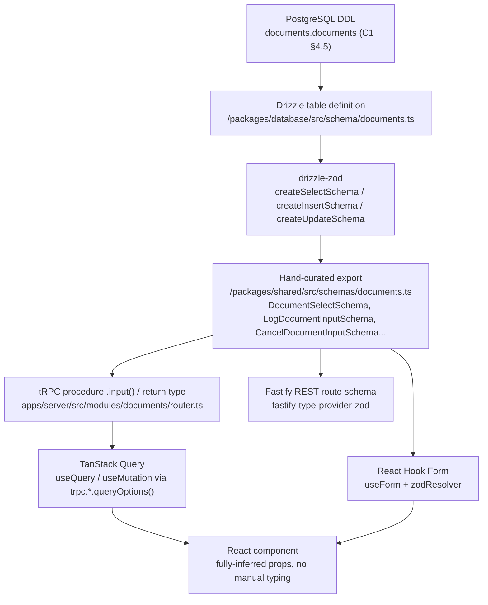
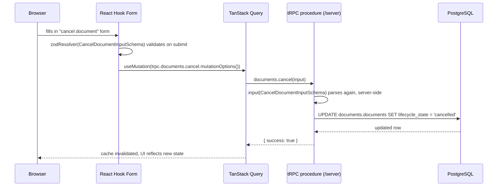

# G1. End-to-End Type Safety Chain Document

**Document:** G1
**Platform:** Batac City LGU Platform
**Status:** BLOCKING — depends on C1 (Full Database Schema DDL), E1 (tRPC Router and Procedure Catalog), and E3 (Shared Zod Schema Catalog). Is itself a prerequisite for any implementation work touching the `/packages/database` → `/packages/shared` → `/apps/server` → `/apps/web` chain.
**Supersedes:** the stack-decision draft previously circulated as `end-to-end-type-safety-chain-document.md`. That document's content is preserved below in Part 1 and expanded by everything that follows.
**Last Updated:** June 2026
**Audience:** Backend and frontend development team
**Source documents reviewed:**
- `c1-full-database-schema-ddl.md` — table/column definitions, constraints, nullability, the cross-schema logical-FK convention (Architectural Invariant #1)
- `e1-trpc-router-and-procedure-catalog.md` — procedure input/output shapes, the `protectedProcedure` middleware chain, error shape
- `e3-shared-zod-schema-catalog.md` — the canonical schema catalog, schema-type tags, layer-consumption notation, naming and enforcement rules
- `end-to-end-type-safety-chain-document.md` — the stack-decision draft this document expands

This document does not independently re-review `tech-stack.md` or the consolidated architecture reference — both are cited by C1/E1/E3, but neither was provided directly for this document, so claims sourced only through those secondary citations are attributed to the catalog that cites them, not asserted first-hand.

## Table of Contents

- [L40–L54] Notation — Defines tags for source confirmation, external verification status, and inconsistencies between source documents.
- [L55–L92] Part 1 — Stack Decisions and Structure — Technology stack choices, monorepo directory layout, and the hybrid tRPC/REST architectural boundaries.
- [L93–L118] Part 2 — The Chain at a Glance — Visual data flow from PostgreSQL DDL down to React components and shared schema enforcement rules.
- [L119–L254] Part 3 — Layer 1→2: From a DDL Column to a Drizzle Table to a Zod Schema — Authoritative DDL, Drizzle mapping examples, and generated drizzle-zod schema output for the documents table.
  - [L121–L168] 3.1 The DDL (already authoritative — C1 §4.5)
  - [L169–L237] 3.2 The Drizzle table (illustrative — `[Verified — external docs]` for the Drizzle API surface used)
  - [L238–L254] 3.3 The raw drizzle-zod output
- [L255–L336] Part 4 — Nullable Fields: Handling Them Correctly at Each Layer — Rules for handling optional/nullable fields, the drizzle-zod refinement function trap, and cross-column database constraints.
- [L337–L398] Part 5 — Extending drizzle-zod Schemas with Application-Layer Validation — Techniques for narrowing sensitive fields, widening schemas with joined fields, and applying business-rule constraints.
- [L399–L448] Part 6 — Flowing Into a tRPC Procedure — tRPC input/output schema validation patterns, specific observed schema inconsistencies, and the export-name convention.
- [L449–L492] Part 7 — REST Validation via `fastify-type-provider-zod` — Registration of Fastify Zod type providers and route validation using shared schema definitions.
- [L493–L563] Part 8 — TanStack Query via tRPC v11 in React Components — tRPC v11 TanStack Query setup, query/mutation hook integrations, and client-server validation sequence.
- [L564–L588] Part 9 — `@hookform/resolvers/zod` for Forms — React Hook Form integration using shared Zod schemas for client-side validation.
- [L589–L622] Part 10 — The One-Way Rule — The strict database-to-frontend direction for type propagation and anti-patterns to avoid.
- [L623–L636] Part 11 — Quick Reference Checklist — Pull request review checklist for verifying schema design and end-to-end compliance.
- [L637–L652] Sources Checked for This Document — References to internal architecture catalog documents and external library documentation.

---

---

## Notation

This document follows the tagging convention established in C1 §1.1 and E1's Notation section, with one addition: unlike C1/E1/E3, which describe only internal project artifacts, this document also describes the behavior of external npm packages, which can change between versions.

| Tag | Meaning |
|---|---|
| `[Confirmed — source]` | Stated directly in C1, E1, or E3 |
| `[Verified — external docs]` | Checked directly against current official documentation for the named library, because library APIs can change between releases. Sources are listed in the closing appendix. |
| `[Inference]` | Reasoned from confirmed facts in the source documents, not stated verbatim anywhere |
| `[Observed inconsistency]` | A specific, directly-checkable mismatch between two source documents, noted so it can be reconciled before `/packages/shared` is implemented |

Code in this document that does not yet exist in any reviewed source — most importantly the actual `/packages/database` Drizzle files, which C1's own Non-Scope section states are "a development task, not a documentation one" — is illustrative. It is written as a direct, mechanical translation of confirmed DDL and schema facts, not as a transcription of a file that already exists.

---

## Part 1 — Stack Decisions and Structure

*(Carried forward from the prior draft, unchanged.)*

### 1.1 Relevant Stack Decisions

| Layer | Choice | Hard constraint |
|---|---|---|
| Internal API | tRPC on Fastify | End-to-end type safety for `/web` — no REST for internal routes |
| External/public API | Fastify REST + OpenAPI (`@fastify/swagger`) | Required for portal, mobile, third-party, or non-TS clients |
| ORM | Drizzle ORM + Drizzle Kit | Full PostgreSQL feature access with TypeScript inference |
| Validation / contracts | Zod (shared package) | Single source of truth: backend validation, DB types, frontend forms |
| Server state (frontend) | TanStack Query | Cache invalidation, background refetch, optimistic updates |
| Forms | React Hook Form + `@hookform/resolvers/zod` | Validates against shared Zod schemas |
| Env config | dotenv + Zod schema | Fail fast on missing required vars at startup |

### 1.2 Monorepo Structure

```
/apps
  /web        — Vite + React SPA (internal authenticated app)
  /server     — Fastify backend (tRPC + REST routes, single process)

/packages
  /shared     — Zod schemas, TypeScript types, API contracts, constants
  /database   — Drizzle schema, migrations, query helpers, seed data
```

### 1.3 tRPC Architecture (Hybrid)

```
/web  ──tRPC──▶  /server (Fastify)  ──REST/OpenAPI──▶  /portal, mobile, third-party
```

tRPC is used exclusively for `/web` ↔ `/server`. The public portal and any external-facing interface use REST only — confirmed again in E1 §"Note on Scope": citizen self-service is REST/Portal, never tRPC.

---

## Part 2 — The Chain at a Glance



Every box after `drizzle-zod` is either the hand-curated `/packages/shared` schema itself or a layer that imports it by name. Nothing downstream of `/packages/shared` is allowed to define its own copy of an entity shape — that rule is E3's Schema Enforcement Rule 1, and Part 10 below explains mechanically why the chain breaks if it's violated.

---

## Part 3 — Layer 1→2: From a DDL Column to a Drizzle Table to a Zod Schema

### 3.1 The DDL (already authoritative — C1 §4.5)

```sql
CREATE TABLE documents.documents (
    id                          UUID PRIMARY KEY DEFAULT gen_random_uuid(),
    city_id                     UUID NOT NULL,
    document_type_id            UUID NOT NULL,
    title                       TEXT NOT NULL,
    lifecycle_state              TEXT NOT NULL DEFAULT 'draft',
    classification_level        TEXT NOT NULL,
    qr_tracking_number           UUID NOT NULL,
    preliminary_number           TEXT NULL,
    final_number                TEXT NULL,
    control_number              TEXT NULL,
    number_series_id             UUID NULL,
    originating_office_id        UUID NOT NULL,  -- logical FK, cross-schema, Invariant #1
    owned_by_office_id           UUID NOT NULL,  -- logical FK, cross-schema
    created_by                  UUID NOT NULL,  -- logical FK, cross-schema
    workflow_instance_id         UUID NULL,       -- logical FK, cross-schema
    retention_schedule_id        UUID NOT NULL,  -- logical FK, cross-schema
    version_number               INTEGER NOT NULL DEFAULT 1,
    metadata                    JSONB NOT NULL DEFAULT '{}'::jsonb,
    created_at                  TIMESTAMPTZ NOT NULL DEFAULT now(),
    updated_at                  TIMESTAMPTZ NOT NULL DEFAULT now(),
    deleted_at                  TIMESTAMPTZ NULL,
    deleted_by                  UUID NULL,
    superseded_by               UUID NULL,
    superseded_at               TIMESTAMPTZ NULL,
    closure_reason              TEXT NULL,
    CONSTRAINT documents_lifecycle_state_check CHECK (lifecycle_state IN (
        'draft','submitted','in_workflow','pending_mayor_action','pending_panlalawigan_review',
        'completed','released','archived','disposed','cancelled','superseded'
    )),
    CONSTRAINT documents_classification_level_check CHECK (classification_level IN (
        'public','internal','confidential','restricted'
    ))
);
```

`[Corrected — this block previously modeled lifecycle_state/classification_level as references to
documents.lifecycle_state_enum/classification_level_enum native Postgres types, with lifecycle_state
also carrying a fabricated 9-value set. Neither matches C1 §4.5, which this heading claims to
reproduce authoritatively: C1 declares both columns as TEXT with a table-level CHECK constraint,
not a native enum type. Fixed to TEXT + CHECK, matching C1 verbatim, real 11-value lifecycle_state
set. See Section 3.2 immediately below for why the Drizzle translation of this same DDL currently
looks different — that's not an inconsistency introduced by this fix, it reflects a real divergence
between this DDL section and the actually-deployed schema. [Confirmed — C1 §4.5 DDL lines ~830-864]`

### 3.2 The Drizzle table (illustrative — `[Verified — external docs]` for the Drizzle API surface used)

Drizzle represents a PostgreSQL schema with `pgSchema()`, and a schema-scoped enum with `.enum()` on that schema object — this is the current, documented way to keep the generated `CREATE TYPE` inside the `documents` schema rather than `public` (`orm.drizzle.team/docs/schemas`).

```typescript
// /packages/database/src/schema/documents.ts
import { uuid, text, integer, jsonb, timestamp, check } from "drizzle-orm/pg-core";
import { sql } from "drizzle-orm";
import { documentsSchema } from "./_schema"; // pgSchema("documents"), shared across this file's tables
```

`[Corrected — this section previously kept lifecycleStateEnum/classificationLevelEnum as native
Postgres ENUM declarations via documentsSchema.enum(), deliberately diverging from Section 3.1's
TEXT + CHECK to match what migration 0011_lumpy_goblin_queen.sql actually deployed, since at the
time neither C1 nor this document had a definitive answer for which strategy was correct going
forward. That is now resolved: consolidated-architecture-and-requirements-reference-iteration-3.md
Part 11.9 explicitly lists "Check constraints for state transitions" as a PostgreSQL non-negotiable
— language that only describes the TEXT + CHECK pattern, since a native ENUM type doesn't use a
CHECK constraint at all (the type itself restricts the value set). Section 3.1 and this section now
agree: TEXT + CHECK is correct. Migration 0011 is the deviation, and needs reverting — that's a
source-code change (schema migration), not a doc fix; see the accompanying standalone prompt.
[Confirmed — consolidated reference Part 11.9, non-negotiables list]`

export const documents = documentsSchema.table("documents", {
  id:                  uuid("id").primaryKey().defaultRandom(),
  cityId:              uuid("city_id").notNull(),
  documentTypeId:      uuid("document_type_id").notNull(), // same-schema FK in the real file — .references() omitted here for brevity
  title:               text("title").notNull(),
  lifecycleState:      text("lifecycle_state").notNull().default("draft"),
  classificationLevel: text("classification_level").notNull(),
  qrTrackingNumber:    uuid("qr_tracking_number").notNull(),
  preliminaryNumber:   text("preliminary_number"),
  finalNumber:         text("final_number"),
  controlNumber:       text("control_number"),
  numberSeriesId:      uuid("number_series_id"),
  originatingOfficeId: uuid("originating_office_id").notNull(), // logical FK — no .references(), Invariant #1
  ownedByOfficeId:     uuid("owned_by_office_id").notNull(),
  createdBy:           uuid("created_by").notNull(),
  workflowInstanceId:  uuid("workflow_instance_id"),
  retentionScheduleId: uuid("retention_schedule_id").notNull(),
  versionNumber:       integer("version_number").notNull().default(1),
  metadata:            jsonb("metadata").notNull().default({}),
  createdAt:           timestamp("created_at", { withTimezone: true }).notNull().defaultNow(),
  updatedAt:           timestamp("updated_at", { withTimezone: true }).notNull().defaultNow(),
  deletedAt:           timestamp("deleted_at", { withTimezone: true }),
  deletedBy:           uuid("deleted_by"),
  supersededBy:        uuid("superseded_by"),
  supersededAt:        timestamp("superseded_at", { withTimezone: true }),
  closureReason:       text("closure_reason"),
}, (table) => [
  check("documents_lifecycle_state_check", sql`${table.lifecycleState} IN (
    'draft','submitted','in_workflow','pending_mayor_action','pending_panlalawigan_review',
    'completed','released','archived','disposed','cancelled','superseded'
  )`),
  check("documents_classification_level_check", sql`${table.classificationLevel} IN (
    'public','internal','confidential','restricted'
  )`),
]);
```

`[Corrected — lifecycleState/classificationLevel columns changed from the enum column constructors
(lifecycleStateEnum(...)/classificationLevelEnum(...)) to text(...) with table-level check()
constraints, matching Section 3.1's DDL and the real check() pattern already used extensively
elsewhere in packages/database/schema/documents.schema.ts for this project's other constrained
columns. Every nullability/default annotation is unchanged — this edit only changes the storage
strategy, not the shape.]`

Every nullability decision here is a direct, mechanical reading of the DDL: a column gets no Drizzle modifier if and only if its DDL has no `NOT NULL`. There is no judgment call at this layer — that's deliberate, and it's why the next layer (drizzle-zod) can derive correct types automatically instead of requiring someone to re-decide nullability by hand.

### 3.3 The raw drizzle-zod output

```typescript
import { createSelectSchema, createInsertSchema, createUpdateSchema } from "drizzle-zod";
import { documents } from "@batac-lgu/database/schema/documents";

const rawDocumentsSelectSchema = createSelectSchema(documents);
const rawDocumentsInsertSchema = createInsertSchema(documents);
const rawDocumentsUpdateSchema = createUpdateSchema(documents);
```

`[Verified — external docs]` Without any refinement, drizzle-zod's three generators differ in one specific way: a column with `NOT NULL` and no default is **required** in all three; a column with `NOT NULL` and a default (`lifecycleState`, `versionNumber`, `metadata`, `id`) is required in the select schema but **optional** in the insert schema, since the database will supply it if omitted; every column without `NOT NULL` (`preliminaryNumber`, `finalNumber`, `controlNumber`, `numberSeriesId`, `workflowInstanceId`) is **nullable** in the select schema; and `createUpdateSchema` makes every field optional regardless of its insert/select status, because an update only needs to touch the fields it's changing.

This raw output is **not** what `/packages/shared` exports. E3's Schema Enforcement Rule 2 states select schemas must be "derived from or compositionally consistent with" the raw output, with intentional divergences documented at the point they occur — Part 5 below is that documentation.

---

## Part 4 — Nullable Fields: Handling Them Correctly at Each Layer

This is the layer where most type-safety bugs in a stack like this actually originate, because "nullable" means something slightly different at each step of the chain.

### 4.1 The three nullable-shaped states

| State | Where it shows up | Zod shape |
|---|---|---|
| Column has `NOT NULL`, no default | `title`, `classificationLevel` | Required in select, insert, and update-as-optional |
| Column has `NOT NULL` + a default | `lifecycleState`, `versionNumber`, `id` | Required in select; **optional** (not nullable) in insert — the DB fills the gap |
| Column has no `NOT NULL` | `preliminaryNumber`, `finalNumber`, `numberSeriesId` | **Nullable** in select; **nullable AND optional** in insert (you may omit it, and if present it may be `null`) |

The middle row is the one developers most often get wrong by reaching for `.nullable()` when they mean `.optional()`, or vice versa. A field that's optional-because-it-has-a-default is never actually `null` in the database — it's always one of its real values. A field that's nullable-because-the-column-allows-it can genuinely be `null` forever (`preliminaryNumber` stays `null` for the whole lifetime of a `final_number`-bearing document, per the mutual-exclusion `CHECK` constraint at C1 §4.5).

### 4.2 The refinement trap: two ways to add validation, and they behave differently around nullability

`[Verified — external docs, drizzle-zod current documentation]` drizzle-zod's refinement option accepts two shapes, and only one of them composes safely with the column's inferred nullability:

- **Function form** — `field: (col) => col.max(50)` — applies your refinement *first*, then layers the column's actual nullable/optional status on top. Nullability is preserved automatically.
- **Direct-schema form** — `field: z.string().max(50)` — *replaces* the field outright, nullability included. If the column is nullable and you supply a non-nullable schema this way, the nullability is silently lost.

Applied to `preliminaryNumber` (genuinely nullable — it's cleared once a final number is assigned):

```typescript
// Correct — function form preserves the column's real nullability
const documentsSelectSchema = createSelectSchema(documents, {
  preliminaryNumber: (col) => col.max(50),
});
// Result: z.string().max(50).nullable()  ✓

// Wrong — direct-schema form drops it
const documentsSelectSchemaBroken = createSelectSchema(documents, {
  preliminaryNumber: z.string().max(50),
});
// Result: z.string().max(50)  — no .nullable(). Every document still in
// 'draft' or 'submitted' state (preliminary_number IS NULL) now fails
// validation on read.
```

The distinction is mechanical — drizzle-zod treats the refinement as "function form" whenever a function is supplied, regardless of whether that function chains off its argument. So even when the goal is to *replace* the type entirely rather than just narrow it, the function form is still the safer default, because nullability/optionality still gets layered on afterward automatically. `metadata` (a `jsonb` column, defaulting to `z.unknown()`) is a case where the type genuinely changes — to `z.record(z.unknown())`, so callers get a plain-object guarantee rather than "could be anything JSON allows" — and the function form handles it the same way:

```typescript
const documentsSelectSchema = createSelectSchema(documents, {
  preliminaryNumber: (col) => col.max(50),
  metadata: () => z.record(z.unknown()), // function form — ignores the auto-generated
                                          // base schema and returns a new one, but
                                          // nullability layering still applies afterward
});
```

`metadata` happens to be `NOT NULL`, so there's no nullability to lose either way here, and the direct-schema form (`metadata: z.record(z.unknown())`, no wrapping function) would land on an identical result. The rule of thumb that actually matters: on any column that *is* nullable, default to the function form; if the direct-schema form is used there instead, re-state nullability explicitly (`.nullable()`) on the replacement schema, because nothing else will.

### 4.3 Constraints that span multiple columns don't propagate automatically

`iam.sessions` (C1 §2.4) has a `CHECK` constraint that couples two nullable columns:

```sql
terminated_at           TIMESTAMPTZ NULL,
termination_reason      iam.session_termination_reason_enum NULL,
...
CONSTRAINT ck_sessions_termination_consistency
    CHECK (
        (terminated_at IS NULL AND termination_reason IS NULL) OR
        (terminated_at IS NOT NULL AND termination_reason IS NOT NULL)
    )
```

drizzle-zod reads column-level type and nullability metadata; it has no mechanism for reading table-level `CHECK` expressions, because those aren't part of a column's type signature. The select schema for `iam.sessions` will correctly mark both fields `.nullable()` independently, but nothing stops a malformed object — `terminated_at` set, `termination_reason` left `null` — from passing Zod validation. The cross-field rule has to be re-implemented explicitly with `.refine()` on whichever schema actually constructs or accepts a full row:

```typescript
export const SessionSelectSchema = createSelectSchema(sessions, {
  /* per-field refinements as needed */
}).refine(
  (s) => (s.terminatedAt === null) === (s.terminationReason === null),
  { message: "terminatedAt and terminationReason must both be null or both be set" }
);
```

This is the same pattern E3 already uses for `DateRangeSchema` (`from <= to`, Part 1) and for `UpdateUserInputSchema` (`Object.keys(v).length > 0`, Part 2) — both are cross-field rules Zod can express but drizzle-zod cannot derive, because both predate or exceed what a single column's type can encode.

---

## Part 5 — Extending drizzle-zod Schemas with Application-Layer Validation

There are three distinct extension mechanisms in play across the catalog, and they solve three different problems. Keeping them distinct matters for code review — "why does this schema not match the table 1:1" should always have one of these three answers.

### 5.1 Narrowing — omitting columns the API must never expose

E3's Sensitive Field Policy (Conventions, "Sensitive Field Policy") lists columns that must never appear in an exported schema: `password_hash`, `session_token_hash`, `secret_encrypted`, `ocr_text`. `UserSelectSchema` (E3 Part 2) demonstrates the pattern — it isn't `createSelectSchema(users)` with refinements, it's a hand-listed field set that happens to be a strict subset of the table:

```typescript
export const UserSelectSchema = z.object({
  id:         UuidSchema,
  username:   z.string().min(3).max(64),
  email:      z.string().email().max(254),
  status:     UserStatusSchema,
  mfaEnabled: z.boolean(),
  createdAt:  TimestampSchema,
  updatedAt:  TimestampSchema,
});
```

Mechanically, this is `createSelectSchema(users).pick({ id: true, username: true, ... })` made explicit rather than left as a `.pick()` call — explicit listing makes it obvious at a glance, in review, that nothing sensitive slipped through, which is the actual goal (E3 Rule 4). Note `password_hash` itself lives on a *different* table (`iam.credentials`, C1 §2.3) entirely, by design — separating the credential from the identity row is itself a narrowing strategy one level up, before Zod is even involved.

### 5.2 Widening — adding fields that aren't raw columns at all

`DocumentSelectSchema` (E3 Part 4) includes `documentType` and `originatingOffice`, neither of which is a column on `documents.documents` — they're joined/hydrated objects the resolver attaches before returning a response:

```typescript
export const DocumentSelectSchema = z.object({
  id:                  UuidSchema,
  documentTypeId:      UuidSchema,
  documentType:        DocumentTypeSummarySchema,   // ← joined, not a column
  // ...
  originatingOfficeId: UuidSchema,
  originatingOffice:   OfficeSummarySchema,          // ← joined, not a column
  // ...
});
```

This is `createSelectSchema(documents).extend({ documentType: DocumentTypeSummarySchema, originatingOffice: OfficeSummarySchema })` in spirit. The extension point is real and necessary — `documents.get`'s resolver (E1) calls `Documents.getDocumentById()`, which per its output shape clearly does the join server-side — but it means `DocumentSelectSchema` is not, and should not be expected to be, a 1:1 mirror of the table. The naming convention (E3 Part 14: `{Entity}SelectSchema`) doesn't distinguish "raw row" from "row plus joins," so this divergence has to be called out wherever it occurs, exactly as E3 Rule 2 requires.

### 5.3 Constraining — cross-field and business-rule refinements

Covered in 4.3 above for cross-field nullability rules. The same mechanism handles rules that have nothing to do with nullability at all — `UpdateUserInputSchema`'s requirement that at least one field be present is a pure business rule no column-level type could express:

```typescript
export const UpdateUserInputSchema = z
  .object({
    username: z.string().min(3).max(64).trim().optional(),
    email:    z.string().email().max(254).optional(),
    status:   UserStatusSchema.optional(),
  })
  .refine((v) => Object.keys(v).length > 0, {
    message: "At least one field must be provided",
  });
```

### 5.4 A boundary worth stating plainly

Narrowing and constraining only ever make a schema *stricter* than what drizzle-zod would generate on its own. Widening adds fields, but never removes the requirement that every field which *is* a real column stay consistent with that column's actual type and nullability. E3 Rule 5 states this directly: a shared schema "must never be more permissive than the authoritative server validation." If a refinement loosens what the database would actually accept, the bug isn't caught by TypeScript — it surfaces later as a `CONFLICT` or constraint-violation error at the database layer, which is a worse place to discover it than a Zod parse failure.

---

## Part 6 — Flowing Into a tRPC Procedure

### 6.1 The pattern

```typescript
// /apps/server/src/modules/documents/router.ts
import { z } from "zod";
import {
  DocumentSelectSchema,
  CancelDocumentInputSchema,
} from "@batac-lgu/shared";
import { protectedProcedure, router } from "../../trpc";

export const documentsRouter = router({
  get: protectedProcedure
    .input(z.object({ documentId: z.string().uuid() }))
    .output(DocumentSelectSchema)
    .query(async ({ input, ctx }) => {
      return ctx.services.documents.getDocumentById(input.documentId, ctx.subject);
    }),

  cancel: protectedProcedure
    .input(CancelDocumentInputSchema)
    .output(z.object({ success: z.literal(true) }))
    .mutation(async ({ input, ctx }) => {
      await ctx.services.documents.transitionState(
        input.documentId, "cancelled", ctx.subject.userId, input.reason
      );
      return { success: true };
    }),
});
```

`.input()` runs the schema against the request body before the resolver body executes at all — this is tRPC's own parser, and it's why E1 §"Error Shape" lists `BAD_REQUEST` for Zod validation failure as automatic rather than something a resolver has to throw itself `[Confirmed — E1 §6]`. `.output()` is optional but worth keeping: without it, a resolver that drifts from its declared return shape only fails at the type level if the drift happens to be caught by TypeScript's structural typing, which a stray extra field will not trigger. With `.output()`, drift fails at runtime in development and in CI, not just silently in production.

### 6.2 `[Observed inconsistency]` — worth reconciling before this lands in code

Comparing E1's literal procedure entries against E3's catalog surfaces two concrete mismatches:

1. **`documents.cancel`'s `reason` field.** E1 specifies the input inline as `z.string().min(1)` (any non-empty string). E3's `CancelDocumentInputSchema` specifies `z.string().min(10).max(1024).trim()`. Both documents are BLOCKING-status; only one of these can be the actual rule once implemented.
2. **`LogDocumentInputSchema` has no procedure that references it.** E3 catalogs `LogDocumentInputSchema` (documentTypeId, title, classificationLevel, originatingOfficeId, ownedByOfficeId, metadata, an `uploadedFile` sub-object) and tags it `[B] [T] [F]` — meaning a tRPC consumer is expected to exist. But E1's `documents.create` input is the narrower `{ documentTypeId, title, metadata }`, and E1's own business-operation note for `documents.create` says QR/preliminary numbering happens later, at `documents.submit` — which takes only `{ documentId }`. As written, neither E1 procedure's input matches `LogDocumentInputSchema`'s shape.

Neither of these is a defect in this document — they're exactly the kind of drift the catalog system (E1 + E3 + the enforcement rules in E3 Part 16) exists to surface before `/packages/shared` is written, rather than after two developers have each implemented a different version. They're flagged here, at the point in the chain where E1 and E3 are first used together, rather than left implicit.

### 6.3 The export-name convention, applied

E1 §"Input/Output Schema Reference Convention" states schemas should be referenced "by their export name from `/packages/shared`," not reproduced as anonymous literals — yet several E1 entries (including `documents.create`, shown above) currently write the literal `z.object({...})` inline rather than naming an export. Per E3's Schema Enforcement Rule 1 ("a locally-defined entity schema... fails review"), the target state is that every procedure in §6.1's pattern imports a name from `@batac-lgu/shared`, full stop — no inline `z.object()` for anything that represents a real entity or a reusable input shape. A `paginationInput`-style fragment used only inside one document, never independently catalogued, is the one case this document does not flag — but `documents.create`'s input is exactly the entity-shaped case the rule targets.

---

## Part 7 — REST Validation via `fastify-type-provider-zod`

The same exported schema validates a REST route with no duplication, which is the entire point of having one shared package. `DocumentFilterSchema` is tagged `[B] [T]` in E3's Layer Consumption Matrix — meaning it's already expected to serve both a REST querystring and a tRPC input from one definition.

```typescript
// /apps/server/src/plugins/zod-type-provider.ts
import { serializerCompiler, validatorCompiler, type ZodTypeProvider } from "fastify-type-provider-zod";
import type { FastifyInstance } from "fastify";

export function registerZodTypeProvider(app: FastifyInstance) {
  app.setValidatorCompiler(validatorCompiler);
  app.setSerializerCompiler(serializerCompiler);
}
```

```typescript
// /apps/server/src/modules/documents/rest-routes.ts
import { DocumentFilterSchema, DocumentSelectSchema } from "@batac-lgu/shared";
import type { FastifyInstance } from "fastify";
import type { ZodTypeProvider } from "fastify-type-provider-zod";
import { z } from "zod";

export function registerDocumentRestRoutes(app: FastifyInstance) {
  app.withTypeProvider<ZodTypeProvider>().route({
    method: "GET",
    url: "/api/v1/documents",
    schema: {
      querystring: DocumentFilterSchema,
      response: { 200: z.object({ items: z.array(DocumentSelectSchema), nextCursor: z.string().uuid().nullable() }) },
    },
    handler: async (req, res) => {
      const result = await req.services.documents.list(req.query);
      return res.send(result);
    },
  });
}
```

`[Verified — external docs, fastify-type-provider-zod current README]` `withTypeProvider<ZodTypeProvider>()` is what lets `req.query` come out of the handler already typed as `DocumentFilter`, not `unknown` — the compiler enforces that `req.services.documents.list` receives the shape `DocumentFilterSchema` actually parses to, the same way `.input()` does for tRPC. `setValidatorCompiler`/`setSerializerCompiler` are registered once, globally, at app bootstrap — every route on the instance that uses `withTypeProvider<ZodTypeProvider>()` picks them up; they aren't repeated per route.

Because this is the same `DocumentFilterSchema` import the tRPC `documents.list` procedure uses for `.input()`, a change to the filter's allowed fields is a one-file edit that updates both protocols at once — this is the practical payoff of the hybrid tRPC/REST architecture in Part 1.3 rather than a coincidence.

---

## Part 8 — TanStack Query via tRPC v11 in React Components

`[Verified — external docs, trpc.io and the tRPC v11 TanStack Query announcement]` tRPC v11's current recommended client integration is the `@trpc/tanstack-react-query` package, which is meaningfully different from the older `createTRPCReact` ("Classic") proxy some existing tutorials still show. The new integration doesn't wrap `useQuery`/`useMutation` in its own hooks — it produces plain `queryOptions()`/`mutationOptions()` objects that you pass straight into `@tanstack/react-query`'s own hooks. The two are not interchangeable; this document uses the current integration throughout, since it's the one the stack-decision doc's "TanStack Query as the data layer" framing (Part 1.1) describes.

```typescript
// /apps/web/src/trpc/client.ts
import { createTRPCContext } from "@trpc/tanstack-react-query";
import type { AppRouter } from "@batac-lgu/server/router";

export const { TRPCProvider, useTRPC } = createTRPCContext<AppRouter>();
```

```tsx
// /apps/web/src/screens/DocumentDetail.tsx
import { useQuery, useMutation, useQueryClient } from "@tanstack/react-query";
import { useTRPC } from "../trpc/client";

export function DocumentDetail({ documentId }: { documentId: string }) {
  const trpc = useTRPC();
  const queryClient = useQueryClient();

  // `document` is typed as DocumentSelect — inferred all the way from the
  // Drizzle column definitions in Part 3, through zero manual annotation.
  const { data: document, isLoading } = useQuery(
    trpc.documents.get.queryOptions({ documentId })
  );

  const cancelMutation = useMutation(
    trpc.documents.cancel.mutationOptions({
      onSuccess: () => {
        queryClient.invalidateQueries({ queryKey: trpc.documents.get.queryKey({ documentId }) });
      },
    })
  );

  if (isLoading || !document) return <p>Loading…</p>;
  return (
    <article>
      <h1>{document.title}</h1>
      <p>State: {document.lifecycleState}</p>
      {/* document.lifecycleState is typed as one of the nine LifecycleState
          enum values — not `string` — so an exhaustive switch on it is
          checked by the compiler. */}
    </article>
  );
}
```

The request/response cycle below shows where validation happens twice on purpose — once client-side for fast feedback, once server-side because the client is never trusted — using the same schema instance both times rather than two schemas that have to be kept in sync by hand:



---

## Part 9 — `@hookform/resolvers/zod` for Forms

```tsx
// /apps/web/src/screens/CancelDocumentDialog.tsx
import { useForm } from "react-hook-form";
import { zodResolver } from "@hookform/resolvers/zod";
import { CancelDocumentInputSchema, type CancelDocumentInput } from "@batac-lgu/shared";

export function CancelDocumentDialog({ documentId }: { documentId: string }) {
  const form = useForm<CancelDocumentInput>({
    resolver: zodResolver(CancelDocumentInputSchema),
    defaultValues: { documentId, reason: "" },
  });

  // form.formState.errors.reason is typed; form.handleSubmit only ever
  // calls its callback with a value that has already passed
  // CancelDocumentInputSchema — the same schema the server applies again
  // in Part 6.1.
}
```

This is the same pattern already shown for `SpResolutionMetadataSchema` in E3 Part 15's import conventions — nothing form-specific changes between a flat input schema like `CancelDocumentInputSchema` and a deeply-nested metadata schema; `zodResolver` accepts either. The one thing worth calling out: `CancelDocumentInputSchema.min(10)` on `reason` (per E3; see the 6.2 discrepancy note on whether `10` or E1's `1` is the real number) means React Hook Form will block submission and show a field-level error before the network call ever fires — but per Part 5.4's boundary, that's a UX nicety, not the actual enforcement point. The server-side `.input()` parse in Part 6.1 is what the system actually relies on; a form bypassed by a direct API call still gets the same validation.

---

## Part 10 — The One-Way Rule

**Types flow from the database schema outward. Never the reverse.**

Concretely: a column is added or changed in C1's DDL → the Drizzle table definition is updated to match → `createSelectSchema`/`createInsertSchema` regenerate the raw shape → the curated `/packages/shared` export is updated (with any narrowing/widening/constraining from Part 5 re-applied) → every tRPC procedure, REST route, RHF form, and TanStack Query consumer that imports that export gets a TypeScript compile error at the exact point its existing code no longer matches. That compile error — not a runtime surprise, not a support ticket — is the mechanism. It only works in this direction.

### 10.1 What breaks if the direction is reversed

Suppose a frontend developer needs a `department` field on the document-creation form and, under deadline pressure, adds it directly to a local Zod schema inside `/apps/web` instead of starting at C1:

```typescript
// WRONG — defined in /apps/web, never touches the DB or /packages/shared
const localCreateDocumentSchema = LogDocumentInputSchema.extend({
  department: z.string(), // looks fine. Compiles fine. Goes nowhere.
});
```

This compiles. React Hook Form validates it. The mutation fires. And then either: the tRPC procedure's `.input()` schema (which still comes from `/packages/shared`, unaware of `department`) strips the field silently before the resolver ever sees it, or — worse, if someone also hand-patched the resolver to read `input.department` without a matching column — the value is held in memory for the duration of one request and then discarded, because there is no `department` column to write it into. Either way, the user believes they saved something that was never persisted, and no type ever flagged it, because the violation happened entirely on the side of the chain that consumes types rather than the side that produces them.

The correct order for the same change: add the column in a migration generated against an updated C1 → update the Drizzle table → regenerate/update the `/packages/shared` export → let the resulting compile errors in every consuming file show exactly what else needs updating.

### 10.2 The rule, restated as what NOT to do

- Do not define an entity-shaped Zod schema in `/apps/web` or `/apps/server` that doesn't correspond to an export in `/packages/shared` (E3 Rule 1).
- Do not hand-edit a generated drizzle-zod output to "fix" a type mismatch with the frontend — fix the column, the table, or the refinement, in that order.
- Do not let a form collect a field the corresponding Input schema doesn't declare, even temporarily, even behind a feature flag.
- Do not treat the three `[Observed inconsistency]` items in 6.2 as something a developer resolves locally at implementation time by picking whichever value seems more reasonable — they're a signal that C1/E1/E3 themselves need a reconciling edit, upstream of any code.

### 10.3 Why the `[Observed inconsistency]` items in Part 6.2 belong in this section too

Each of the three mismatches found while writing this document (`reason`'s minimum length; `LogDocumentInputSchema` having no calling procedure; `TimestampSchema` as a string in E3 versus `z.coerce.date()` in E1's inline `auditableEntityOutput` and `documents.assignFinalNumber`'s output) is a small-scale version of the same failure mode as 10.1 — two parts of the system asserting a type for the same conceptual value without one of them being mechanically derived from the other. The fix in every case is the same: pick the one source of truth (here, that's E3's catalog, since E1 itself says schemas should be referenced by export name from it) and make the other document's prose match it, rather than letting both stand as independently-asserted "truths" that happen to disagree.

---

## Part 11 — Quick Reference Checklist

For PR review, alongside E3 Part 16's enforcement rules:

- [ ] Does this schema have a `{Entity}{Type}Schema` export in `/packages/shared`, named per E3 Part 14? No inline `z.object()` for anything entity-shaped.
- [ ] If this is a Select schema for a table with nullable columns, were refinements added with the **function form**, not the direct-schema form — unless nullability is deliberately re-stated?
- [ ] If a `CHECK` constraint or other cross-column DB rule exists for this table, is the equivalent `.refine()`/`.superRefine()` present on the relevant Input or Select schema?
- [ ] If this schema adds fields beyond the raw table (joins, computed fields), is that divergence documented at the point it occurs, per E3 Rule 2?
- [ ] Does the tRPC procedure's `.input()`/`.output()` and the REST route's `schema.body`/`schema.response` reference the *same* `/packages/shared` export, not two schemas that happen to look similar?
- [ ] Does the RHF form's `zodResolver()` argument match the schema the server actually enforces — not a looser, locally-defined stand-in?
- [ ] Did this change originate in C1 (a migration) and propagate outward — or did it originate somewhere downstream and need to be pushed back upstream instead?

---

## Sources Checked for This Document

Internal (Batac City LGU Platform catalog):
- C1 — Full Database Schema DDL (`c1-full-database-schema-ddl.md`)
- E1 — tRPC Router and Procedure Catalog (`e1-trpc-router-and-procedure-catalog.md`)
- E3 — Shared Zod Schema Catalog (`e3-shared-zod-schema-catalog.md`)

External, checked against current official documentation rather than relied on from memory, because all three are actively-developed packages whose APIs have changed across versions:
- `drizzle-zod` — refinement behavior (function form vs. direct-schema form) and select/insert/update optionality rules: `orm.drizzle.team/docs/zod`, `drizzle-zod` README (`github.com/drizzle-team/drizzle-orm`)
- `drizzle-orm` schema/enum scoping (`pgSchema(...).enum(...)`, `pgSchema(...).table(...)`): `orm.drizzle.team/docs/schemas`
- `fastify-type-provider-zod` — `setValidatorCompiler`/`setSerializerCompiler`/`withTypeProvider<ZodTypeProvider>()`: package README (`github.com/turkerdev/fastify-type-provider-zod`)
- tRPC v11 TanStack Query integration — `createTRPCContext`, `useTRPC`, `.queryOptions()`/`.mutationOptions()`: `trpc.io/docs/client/tanstack-react-query/setup` and the tRPC blog post announcing this integration

`@hookform/resolvers/zod`'s usage (`zodResolver(schema)` passed to `useForm`) was not independently re-verified beyond what E3 Part 15 already shows directly — the catalog's own example was treated as sufficient confirmation, since it is the project's own stated convention rather than a general claim about the library.

Behavior described for any of the above reflects the current documentation at the time this was written; pin and confirm against the actual installed versions in `package.json` before treating a specific method signature as final, since none of these are version-locked by C1/E1/E3.
