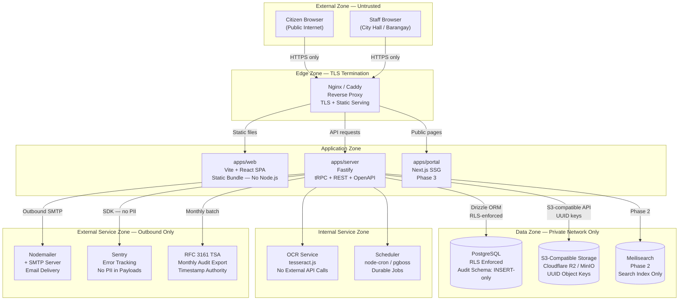
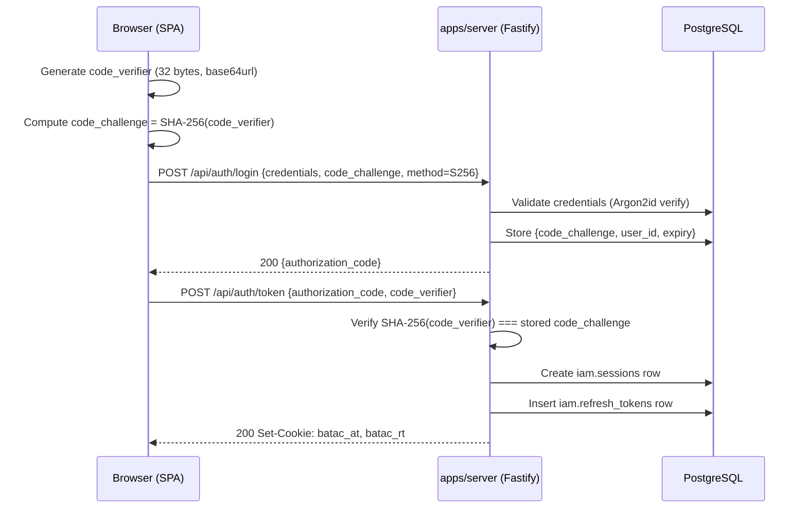
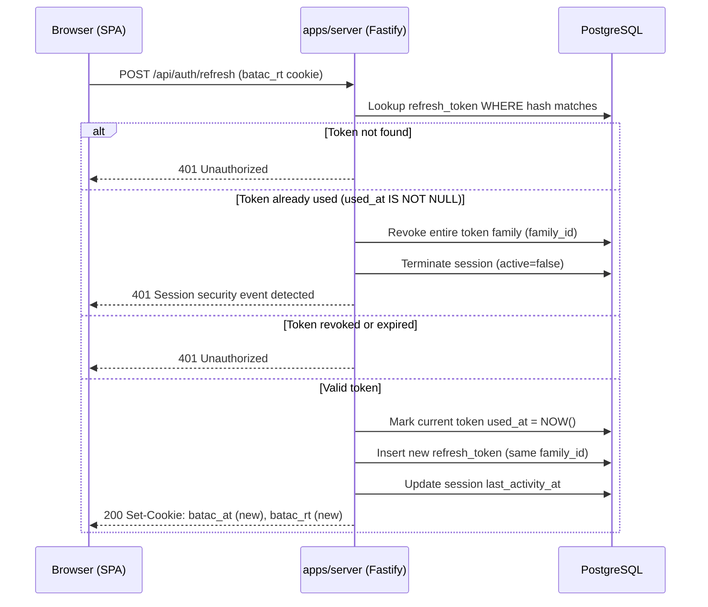
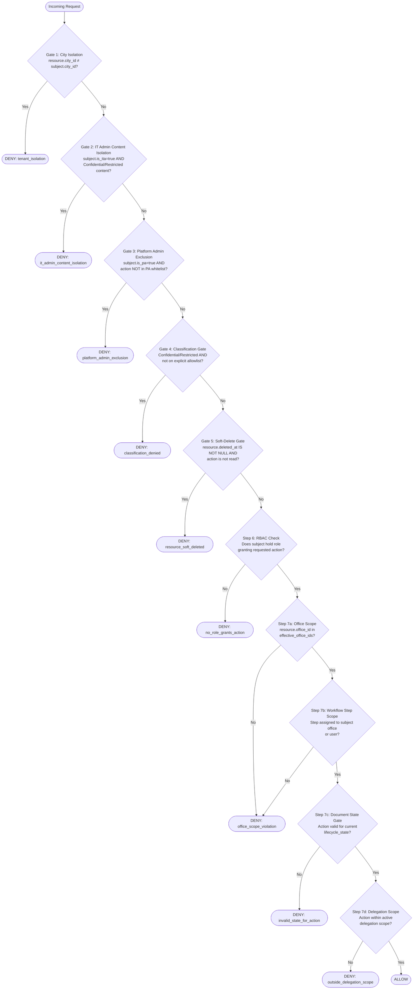
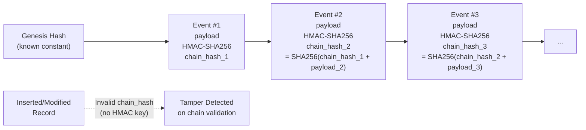

# Security Design Document (SDD)

**Platform:** Batac City LGU Platform
**Classification:** Internal — Development Team
**Status:** Pre-Development Baseline
**Last Updated:** June 2026
**Version:** 1.0

---

## 1. Document Overview

### 1.1 Purpose

This Security Design Document (SDD) defines the complete security architecture of the Batac City LGU Platform — a government operations platform serving the Sangguniang Panlungsod (SP) Office, Mayor's Office, City Hall departments, Barangays, and Citizens of Batac City, Ilocos Norte.

It translates security requirements from the architecture and requirements reference, the authentication and authorization architecture, and the ABAC policy specification into actionable security controls, threat mitigations, and implementation guidance. This document is authoritative for all security-related implementation decisions across all modules and all phases.

### 1.2 Scope

This SDD covers:

- Identity and Access Management (IAM), authentication, and session management
- Attribute-Based Access Control (ABAC) policy model and enforcement
- Data classification and information protection
- Document lifecycle security controls
- Database security design (PostgreSQL roles, Row-Level Security, audit schema protection)
- Audit logging architecture and non-repudiation
- File storage security (S3-compatible, OCR pipeline)
- API security design (tRPC, REST/OpenAPI, Zod validation)
- Infrastructure and deployment security
- Monitoring, logging, and incident response
- Privacy and regulatory compliance (RA 10173, RA 11032, RA 7160)
- Threat model and risk register
- Security invariants and enforcement mechanisms
- Architecture Decision Records (ADRs) for security decisions
- Open security decisions requiring resolution before Phase 1

**Out of scope:** MFA implementation detail (Phase 2 scope, though the hook point is Phase 1); Citizen portal authentication (Phase 3); PhilSys integration (Phase 5); electronic signature PKI (Phase 4).

### 1.3 Security Objectives

| ID | Objective | Regulatory Basis |
|---|---|---|
| SO-01 | Protect citizen document privacy and prevent unauthorized disclosure of government records | RA 10173 (Data Privacy Act) |
| SO-02 | Maintain tamper-evident audit trails for all document processing and administrative actions | RA 7160 (Local Government Code); COA requirements |
| SO-03 | Enforce office-level access isolation so no user can access documents outside their authorized scope | RA 7160; organizational security policy |
| SO-04 | Prevent document tampering, number forgery, and unauthorized lifecycle state changes | Legislative record integrity |
| SO-05 | Ensure non-repudiation of approval actions (VP certification, Mayor signature, SP Secretary decision logging) | Legal authenticity of legislative measures |
| SO-06 | Protect the platform against insider misuse through separation of duties and mandatory audit trails | Anti-corruption governance |
| SO-07 | Maintain availability under the LGU's on-premise deployment constraints and network intermittency | Operational continuity |
| SO-08 | Provide an extraction path to future SSO and national identity provider integration without re-engineering | Future-readiness |
| SO-09 | Enforce SLA compliance tracking obligations that continue regardless of system outages | RA 11032 (ARTA) |

### 1.4 Intended Audience

- Backend developers implementing IAM, ABAC, workflow, and audit modules
- Database administrators writing schema migrations
- Infrastructure engineers provisioning Docker/VPS deployments
- IT Director and LGU IT Office taking ownership after Phase 1
- Security reviewers performing pre-production audit

### 1.5 Source References

| Document | Role in This SDD |
|---|---|
| Stack Context — Government Platform | Technology stack decisions, infrastructure constraints, auth patterns |
| Consolidated Architecture & Requirements Reference (Iteration 3, June 2026) | Business requirements, workflow rules, architectural invariants, compliance obligations |
| B5 — Authentication and Authorization Architecture | JWT design, token rotation, session management, ABAC cascade, RLS design, SSO migration path |
| I1 — ABAC Policy Specification | Per-resource ABAC policies, global gates, state-action compatibility matrix, security invariants |

---

## 2. Security Architecture Overview

### 2.1 Trust Zones and Boundaries

The platform is organized into five trust zones with explicitly defined trust relationships and communication restrictions between them.



**Figure 1: Security Architecture Overview with Trust Zones**

### 2.2 Trust Boundary Definitions

| Boundary | Direction | Authentication | Encryption |
|---|---|---|---|
| External Zone → Edge Zone | Inbound | None (edge terminates TLS) | TLS 1.2+ required |
| Edge Zone → Application Zone | Inbound pass-through | None (Nginx proxies to Fastify) | Internal — encrypted at edge |
| Application Zone → Data Zone | Outbound | PostgreSQL role auth; S3 access keys | TLS + VPC/private network |
| Application Zone → Internal Service Zone | In-process or local network | None (same process / localhost) | Not applicable |
| Application Zone → External Service Zone | Outbound | SMTP credentials; Sentry DSN; TSA token | TLS required for all outbound |

### 2.3 Internal vs. External Users

**Internal users** (LGU staff) access the platform through `/apps/web` — the authenticated Vite React SPA. This application is served as a static bundle by Nginx. All dynamic requests go to `/apps/server` via tRPC. Internal users must authenticate before any resource access. [CONFIRMED — Stack Context]

**External / public users** (Citizens) access a public portal (`/apps/portal`, Phase 3). The portal is a Next.js SSG application with pre-rendered public pages. Citizens can track documents by number and submit requests without authentication. Full document copies require authenticated document request forms. [CONFIRMED — Consolidated Ref. Part 11.18]

**Barangay officials** (Phase 1) have no direct system access. SP Secretariat staff enter their submissions on their behalf. [CONFIRMED — Consolidated Ref. Part 4.4]

### 2.4 tRPC Security Model

tRPC is used **exclusively** for `/apps/web` ↔ `/apps/server` communication. It carries full TypeScript type inference end-to-end. All tRPC procedures are protected by the authentication `preHandler` hooks (Section 4.1.4). The tRPC context object (`AuthContext`) is populated from the verified JWT before any procedure executes. [CONFIRMED — Stack Context; B5 §10.2]

### 2.5 REST API Security Model

REST routes via `@fastify/swagger` serve the public portal (Phase 3), mobile clients, and third-party consumers. They are separated from tRPC routes by Fastify plugin scope. REST routes require valid access token cookies for protected endpoints. Public endpoints (QR scan lookup, published document listing) apply rate limiting without authentication. [CONFIRMED — Stack Context]

### 2.6 PostgreSQL Trust Boundary

PostgreSQL is only accessible to the application via the Drizzle ORM using scoped database roles (`batac_app`, `batac_audit`). Row-Level Security is enabled on all sensitive tables and operates independently of application-layer authorization. No direct PostgreSQL access is permitted from the public internet or from the SPA. [CONFIRMED — Stack Context; B5 §6]

### 2.7 S3-Compatible Storage Trust Boundary

File objects are stored and retrieved through the S3-compatible API exclusively. No Cloudflare-specific or MinIO-specific SDK imports are permitted. Files are streamed between the client and storage through the application server — they never touch the server's local disk. Object keys are UUIDs; original filenames are stored only as metadata in PostgreSQL. [CONFIRMED — Stack Context; Consolidated Ref. Part 11.10]

### 2.8 OCR Trust Boundary

OCR processing uses `tesseract.js` (preferred) running server-side within the application process. No external API calls are made. Citizen document content never leaves the LGU's infrastructure. This is mandated by RA 10173 (Data Privacy Act) and LGU data sovereignty requirements. [CONFIRMED — Stack Context OCR Strategy; Consolidated Ref. Q-C01]

---

## 3. Security Principles

| Principle | Application to This Platform |
|---|---|
| **Least Privilege** | Database roles have only the permissions required for their function. Application roles are scoped to their office and document type. IT Admin is explicitly denied document content access. |
| **Defense in Depth** | Authorization is enforced at three independent layers: (1) ABAC `PolicyEvaluator` in the application, (2) PostgreSQL Row-Level Security, (3) PostgreSQL role-level column/table permissions. A bug in any one layer does not result in unauthorized access. |
| **Zero Trust** | No implicit trust is granted based on network location. All requests — including those from internal LGU networks — require valid authentication tokens and pass the full ABAC evaluation cascade. |
| **Secure-by-Default** | Every table has RLS enabled. New columns default to the most restrictive access. Document types default to `internal` classification. The `COOKIE_SECURE` environment flag defaults to `true`; disabling it in production is a startup failure. |
| **Explicit Authorization** | There is no default-allow behavior. The ABAC cascade ends with `DENY` if no explicit `ALLOW` is reached. Every role's permissions are explicitly defined in the Role-Permission Matrix (I2). |
| **Data Minimization** | JWT tokens carry only the minimum claims needed for authorization. QR scan results show the first page only (other pages blurred). Public portal shows titles only; full content requires approved document requests. |
| **Auditability** | Every security-relevant action (authentication, document state changes, approval actions, delegation grants, bulk operations, exports, forced logouts) produces a tamper-evident audit record. Audit events cannot be disabled by any role. |
| **Tamper Resistance** | Audit records are protected by SHA-256 hash chaining and HMAC. The database schema enforces `INSERT`-only access. The application runtime role (`batac_app`) cannot `UPDATE` or `DELETE` audit records. |
| **Separation of Duties** | Platform Administrators cannot process documents. IT Administrators cannot read confidential document content. Encoders cannot be the final approvers of their own submissions. These are architectural invariants enforced at both application and database layers. |
| **Secure Failure** | ABAC evaluation is deny-first. The first `DENY` terminates evaluation. An incomplete or broken evaluation defaults to `DENY`. RLS returns empty result sets (not errors) when blocking queries, preventing content disclosure via error messages. |
| **Privacy-by-Design** | Citizen PII is minimized at collection. RA 10173 erasure mechanisms require formal legal review. OCR text is treated as document content with the same access controls. Sentry error payloads must not include PII. |

---

## 4. Identity and Access Management (IAM)

### 4.1 Authentication Architecture

#### 4.1.1 Token Architecture Overview

The platform uses a **short-lived JWT access token** paired with a **long-lived server-side refresh token**. Both are delivered exclusively via HTTP-only cookies. No token material is ever placed in `localStorage`, `sessionStorage`, or a response body accessible from JavaScript. [CONFIRMED — Stack Context; B5 §1]

| Token | Storage | Lifetime | Notes |
|---|---|---|---|
| Access Token (JWT) | HTTP-only cookie `batac_at` | 15–60 min (configurable via `JWT_ACCESS_TTL_SECONDS`) | Signed; carries user identity and resolved permissions |
| Refresh Token | HTTP-only cookie `batac_rt` | 14 days (configurable via `REFRESH_TOKEN_TTL_DAYS`) | Opaque; stored hashed in `iam.refresh_tokens`; one-time use; rotated on every use |

#### 4.1.2 JWT Access Token Structure

The JWT payload carries two categories of claims. [CONFIRMED — B5 §1.1]

**Registered claims:**

```json
{
  "iss": "batac-lgu-platform",
  "sub": "<user-uuid>",
  "iat": 1751234567,
  "exp": 1751238167,
  "jti": "<token-uuid>"
}
```

**Private claims** (resolved at token issue time):

| Claim | Type | Purpose |
|---|---|---|
| `uid` | UUID | Internal `iam.users.id` — authoritative identity reference |
| `oid` | UUID | Primary office from `organization.assignments` — used for office scoping |
| `rid` | string[] | Active role IDs — RBAC entry point |
| `perm` | string[] | Resolved permission codes (e.g., `documents:approve`) |
| `dg` | UUID \| null | Active delegation grant UUID; null if no active delegation |
| `city` | UUID | Tenant isolation identifier (Batac City UUID in Phase 1) |
| `sid` | UUID | Session UUID from `iam.sessions` — used for concurrent session enforcement |
| `is_ita` | boolean | System Administrator flag — triggers IT Admin content isolation gate |
| `is_pa` | boolean | Platform Administrator flag — triggers operational exclusion gate |

**Critical timing note:** `rid` and `perm` are resolved at token issue. Role changes during an active token's lifetime do not take effect until the next token refresh. Emergency revocations (e.g., terminated employees) require forced session termination via the IT Admin / Security Admin forced logout capability. [CONFIRMED — B5 §1.1]

#### 4.1.3 Refresh Token Design

Refresh tokens use a **token family** model to detect reuse attacks. [CONFIRMED — B5 §1.2]

- Generated as 32 cryptographically random bytes, base64url-encoded.
- Stored as a **SHA-256 hash with a per-token salt** in `iam.refresh_tokens`. Token entropy (32 cryptographically random bytes) makes a slow hash unnecessary; Argon2id is retained for password hashing only. [CONFIRMED — B5 ADR-AUTH-04]
- One-time use — each use issues a new token and marks the current one as `used_at`.
- All tokens in a family share a `family_id`. If a token that has already been used (`used_at IS NOT NULL`) is presented, the entire family is immediately revoked and the session is terminated. This detects stolen refresh token scenarios.
- Revocation reasons tracked: `logout | reuse_detected | forced | family_revoked | expired`.

#### 4.1.4 Cookie Configuration

[CONFIRMED — B5 §2; Stack Context]

| Cookie | Name | Path | Attributes |
|---|---|---|---|
| Access Token | `batac_at` | `/` | `HttpOnly; Secure; SameSite=Strict` |
| Refresh Token | `batac_rt` | `/api/auth/refresh` | `HttpOnly; Secure; SameSite=Strict` |

**`HttpOnly`** — Inaccessible from JavaScript, mitigating XSS-based token theft.
**`Secure`** — Transmitted only over HTTPS. Development environments may relax via `COOKIE_SECURE=false`; production and staging must always use `COOKIE_SECURE=true`, enforced at startup via Zod config validation.
**`SameSite=Strict`** — Prevents cross-site request forgery without requiring a separate CSRF token. The refresh token cookie's path scoped to `/api/auth/refresh` ensures it is never sent to other endpoints.

#### 4.1.5 PKCE Flow for the SPA

The `/apps/web` SPA is a public client and cannot hold a client secret. PKCE (RFC 7636) is used to bind the token exchange to the initiating browser session. [CONFIRMED — Stack Context; B5 §3]



**Figure 2: PKCE Login Flow**

The `code_verifier` is held in memory (JavaScript variable) for the duration of the login exchange only. It is never written to any persistent storage and is discarded after the token exchange completes. [CONFIRMED — B5 §3.3]

#### 4.1.6 Token Refresh Flow



**Figure 3: Token Refresh and Reuse Detection Flow**

#### 4.1.7 Session Management

[CONFIRMED — Consolidated Ref. Part 11.17; B5 §4]

| Rule | Value |
|---|---|
| Inactivity timeout | 30 minutes |
| Warning threshold | 25 minutes (frontend idle timer) |
| Session count | One active session per user at any time (enforced by DB partial unique index) |
| New login on different device | Existing session replaced; user notified |
| Concurrent session prevention | DB partial unique index `WHERE active = true` on `iam.sessions(user_id)` — PostgreSQL raises `UniqueViolation` if violated |
| Forced logout | IT Admin and Security Admin only; mandatory reason field; fully audit-logged |
| Shared workstation lock | Sets `locked_at` timestamp; does not terminate session; re-authentication (password only) resumes session |

**Forced logout guarantee:** The `reason` field is mandatory. A force logout attempt without a stated reason is rejected at the application layer before any database write. The reason is stored in both `iam.sessions.termination_reason` and the `forced_logout` audit event. [CONFIRMED — B5 §4.5]

#### 4.1.8 MFA Readiness (Phase 1 Design, Phase 2 Activation)

The login handler includes an MFA hook point that is dormant in Phase 1. In Phase 2, TOTP is activated for Mayor, SP Secretary, Department Heads, Platform Administrator, and IT Admin by setting environment variable `MFA_REQUIRED_ROLES`. No code changes are required. [CONFIRMED — Consolidated Ref. Part 11.1]

### 4.2 Authorization Architecture

#### 4.2.1 Model: ABAC with RBAC as Entry Point

The platform uses **Attribute-Based Access Control (ABAC)** with **Role-Based Access Control (RBAC) as the administrative entry point**. [CONFIRMED — Consolidated Ref. Part 11.8]

Pure RBAC cannot express office-scoped access rules. The rule "a user may approve a document only if the document is owned by their office and is currently at a step assigned to their office" requires evaluating resource attributes against subject attributes — this is a native ABAC concern.

RBAC defines which abstract actions a role may perform. ABAC refines those permissions using resource attributes at evaluation time. Platform Administrators configure roles and permissions; the ABAC engine enforces attribute refinements in code.

#### 4.2.2 Authorization Tiers

[CONFIRMED — Consolidated Ref. Part 11.8]

| Tier | Scope | Configured By | Example Capabilities |
|---|---|---|---|
| Tier 1 | System-level (hardcoded) | Code only; no admin override | Audit log writes; backup/restore; schema migrations; encryption key management |
| Tier 2 | Platform-level (admin UI) | Platform Administrator only | Role definitions; workflow definitions; document type definitions; office hierarchy; retention schedules; SLA thresholds; numbering series; public visibility rules |
| Tier 3 | Instance-level (runtime) | Derived from workflow state and explicit grants | Current step assignee; document owning office; classification level; explicit share grants |

#### 4.2.3 Permission Resolution

Permissions are resolved at token issue time from the user's active role assignments. The flow is:

```
iam.role_assignments (active) 
  → iam.roles 
  → iam.permissions 
  → JWT perm[] claim
```

At request time, the `PolicyEvaluator` service uses:
1. `subject.roles[]` and `subject.permissions[]` from the JWT for the RBAC check (Step 6)
2. Resource attributes fetched from the database for ABAC refinements (Steps 7a–7d)

#### 4.2.4 Delegation Support

When a user holds an active delegation grant (e.g., Vice Mayor designated as Acting Mayor), the `loadDelegationContext` hook expands their effective scope before policy evaluation. [CONFIRMED — B5 §5.7; Consolidated Ref. Part 4.12]

The expanded scope is stored in:
- `subject.effective_office_ids[]` — includes delegation-extended offices
- `subject.effective_roles[]` — includes delegation-extended roles

**Delegation constraints that cannot be overridden:**
- Cannot bypass IT Admin content isolation (Invariant #10)
- Cannot bypass Platform Admin operational exclusion (Invariant #12)
- Cannot access Confidential/Restricted documents not on the explicit allowlist
- Cannot be the final approver of a document the delegatee submitted (Invariant #13)
- One active delegation per person at any time (Invariant #16) — enforced by DB partial unique index

#### 4.2.5 Office-Based Access Control

Every document carries `office_id` pointing to its owning office. Every user has a primary office assignment. At Step 7a of the ABAC cascade, `resource.office_id` is compared against `subject.effective_office_ids`. [CONFIRMED — B5 §5.6]

Cross-office access is granted explicitly by role design:

| Role | Cross-Office Access |
|---|---|
| Records Officer | Read metadata (not content) across all offices for archival purposes |
| SP Secretary | Read and act on all workflow steps within SP Secretariat scope |
| Platform Administrator | Read organizational structure and workflow definitions only; no document content |
| IT Admin (sys_admin) | Audit log and session data only; no document content across any office |

### 4.3 Role Categories

[CONFIRMED — I1 §5; I2 (Role-Permission Matrix); Consolidated Ref. Part 3]

| Role Code | Role Name | Security Profile |
|---|---|---|
| `mayor` | Mayor | Can sign/veto legislative measures; restricted to Mayor's Office scope; cannot hold Platform Admin role |
| `sp_presiding_officer` | Vice Mayor | Presiding Officer; certifies documents; manages committee hearings; routes Letters Received |
| `sp_secretary` | SP Secretary | Broadest operational scope within SP Secretariat; assigns numbers; logs decisions; routes complaints; manages Panlalawigan review; can manually advance multi-referral steps (audit-logged) |
| `sp_member` | City Councilor | Can draft documents; access limited to documents in their committee scope; cannot read documents outside their office/committee without additional grants |
| `dept_encoder` | Department Encoder | Can create and submit documents for their office; cannot be final approver of their own submissions |
| `dept_approver` | Department Approver | Can approve documents within their office; cannot approve documents they themselves encoded |
| `brgy_encoder` | Barangay Encoder | Phase 2+ limited to their Barangay scope |
| `brgy_captain` | Barangay Captain | Limited to their Barangay scope |
| `records_officer` | Records Officer | Cross-office metadata access; bulk archive authority; disposition authority; no document content creation |
| `auditor` | Internal Auditor | Full audit log read access; read-only access to non-confidential documents; no document modification |
| `plat_admin` | Platform Administrator | Tier 2 configuration only; **cannot hold any document-processing role**; cannot read document content |
| `sys_admin` | IT Administrator / System Administrator | Schema migrations; session monitoring; forced logout; audit chain validation; **denied access to Confidential/Restricted document content** (three-layer enforcement) |
| `citizen` | Citizen Portal User | Phase 3; can submit complaints and document requests; read own requests; cannot access internal documents |

---

## 5. ABAC Security Model

### 5.1 Subject Attributes

All policies receive a `SubjectContext` object populated by the `verifyAccessToken` and `loadDelegationContext` Fastify preHandler hooks. [CONFIRMED — B5 §10.1; I1 §1]

| Attribute | Type | Description |
|---|---|---|
| `subject.user_id` | UUID | Internal `iam.users.id` |
| `subject.office_id` | UUID | Primary office from JWT `oid` claim |
| `subject.roles` | string[] | Active role codes from JWT `rid` claim |
| `subject.permissions` | string[] | Resolved permission codes from JWT `perm` claim |
| `subject.city_id` | UUID | Tenant identifier — always Batac City UUID in Phase 1 |
| `subject.session_id` | UUID | Active session identifier |
| `subject.is_ita` | boolean | IT Administrator flag — triggers Gate 2 |
| `subject.is_pa` | boolean | Platform Administrator flag — triggers Gate 3 |
| `subject.delegation_grant_id` | UUID \| null | Active delegation grant; null if none |
| `subject.effective_office_ids` | UUID[] | Primary office + delegation-extended offices |
| `subject.effective_roles` | string[] | Base roles + delegation-extended roles |

### 5.2 Resource Attributes

Resource attributes are fetched from the database at request time after the RBAC check passes (Step 6). Key attributes used by ABAC refinement steps:

| Resource Type | Key Attributes |
|---|---|
| `document` | `city_id`, `office_id`, `classification_level`, `lifecycle_state`, `document_type_code`, `created_by` |
| `document_version` / `document_attachment` | `document_id` → inherits parent classification and office |
| `workflow_instance` | `document_id` → resolves to `document.office_id`, `document.classification_level` |
| `workflow_step_instance` | `assignee_office_id`, `assignee_user_id`, `step_type`, `status` |
| `tracking_record` | `document_id` → resolves to document attributes |
| `delegation_grant` | `delegating_user_id`, `delegated_to_user_id`, `active`, `scope` |
| `audit_event` | `actor_id`, `resource_office_id` |

### 5.3 Environment Attributes

| Attribute | Source | Used By |
|---|---|---|
| `request.ip_address` | Fastify request | Rate limiting, login audit |
| `request.timestamp` | System time | SLA tracking, delegation expiry check, token expiry |
| `PostgreSQL session vars` | Set by `setDatabaseSessionVars` hook | RLS policies (`app.city_id`, `app.user_id`, `app.office_id`, `app.is_ita`, `app.is_pa`) |

### 5.4 Evaluation Cascade

Policy evaluation runs in a deny-first cascade. The first `DENY` terminates evaluation immediately. All conditions must pass for `ALLOW`. [CONFIRMED — B5 §5.5; I1 §2]



**Figure 4: ABAC Policy Evaluation Cascade**

Note: Step 7b applies specifically to `workflow_step_instance` resources. For non-workflow resources, this step passes automatically. Step 7d applies only when `subject.delegation_grant_id` is non-null.

### 5.5 Global Security Gates

Each gate is hardcoded in the `PolicyGuard` service and is **not configurable** by any role, including Platform Administrator.

#### Gate 1 — City Isolation

**Threat mitigated:** Multi-tenant data leakage. In Phase 1 there is only one city, but the gate is enforced from day one to support future multi-LGU adaptation without re-engineering.

**Enforcement:** Checks `resource.city_id === subject.city_id`. Cannot be overridden by any delegation or role. Applied to every resource type in every schema. The `city_id UUID NOT NULL` constraint on all core entity tables is Architectural Invariant #8. [CONFIRMED — I1 §2.1; Consolidated Ref. Part 12 Invariant #8]

#### Gate 2 — IT Admin Content Isolation

**Threat mitigated:** Privileged insider data disclosure. IT Administrators require schema-level access for migrations and backups but have zero operational need to read sensitive document content (e.g., Administrative Cases — "access restricted to the Legislative branch only").

**Enforcement:** Three independent layers:
1. `PolicyGuard` (application) — Deny if `subject.is_ita = true` AND resource is `document_version` or `document_attachment` AND `parent_classification_level IN ('confidential', 'restricted')` AND action is in the read/export family.
2. PostgreSQL RLS — `p_it_admin_content_block` policy blocks any SELECT where `app.is_ita = true` and the parent document is confidential/restricted. Returns empty result set (not error), preventing disclosure via error messages.
3. PostgreSQL role permissions — `batac_it_admin` DB role has `REVOKE SELECT` on `documents.versions` and `documents.attachments`. Metadata-only access is provided via a view.

[CONFIRMED — Consolidated Ref. Part 12 Invariant #10; B5 §7]

#### Gate 3 — Platform Administrator Operational Exclusion

**Threat mitigated:** Self-privilege escalation. A user who both defines authorization rules and operates within them could configure their own permissions, modify workflow definitions to bypass steps on their own documents, or create gaps in the audit trail for their own actions.

**Enforcement:** Two layers:
1. Application validation at role assignment — rejects attempts to assign Platform Admin role to a user holding document-processing roles (and vice versa). 
2. PostgreSQL trigger `trg_enforce_platform_admin_exclusion` on `iam.role_assignments` — rejects the INSERT/UPDATE at the database level if the combination is attempted.

[CONFIRMED — Consolidated Ref. Part 12 Invariant #12; B5 §8]

#### Gate 4 — Classification Gate

**Threat mitigated:** Unauthorized disclosure of sensitive government records (Administrative Cases, restricted citizen documents).

**Enforcement:** Checks that the subject appears in the explicit allowlist for the document type when classification is `confidential` or `restricted`. Allowlists are configured per document type by the Platform Administrator. The default allowlist for Administrative Cases (the only confirmed Confidential type in Phase 1) includes `sp_secretary` and `mayor` roles only. [CONFIRMED — I1 §2 Gate 4; Consolidated Ref. Part 4.13]

#### Gate 5 — Soft-Delete Gate

**Threat mitigated:** Unauthorized modification or reuse of logically deleted resources. Prevents soft-deleted documents from being resubmitted, approved, or numbered, while preserving readability for audit and investigation purposes.

**Enforcement:** Checks `resource.deleted_at IS NOT NULL`. If set, only `read`, `read_metadata`, and `view_audit_trail` actions are permitted. Hard deletion is prohibited by all roles (Invariant #2). [CONFIRMED — I1 §2 Gate 5; Consolidated Ref. Part 12 Invariant #2]

---

## 6. Data Classification and Information Protection

### 6.1 Classification Levels

[CONFIRMED — I1 §3; Consolidated Ref. Part 11.4]

| Level | Access | Default For |
|---|---|---|
| `public` | All authenticated users + unauthenticated public portal users | Published SP Resolutions, Ordinances (title and first page only) |
| `internal` | All authenticated LGU employees | Most SP workflow documents, letters, memos |
| `confidential` | Restricted to explicit role allowlist; Administrative Cases (SP Secretary and Mayor only) | Administrative Cases (complaints against officials) |
| `restricted` | Restricted to explicit role allowlist; designated per document type | Future reserved classification level |

### 6.2 Classification Enforcement

| Resource | `public` | `internal` | `confidential` / `restricted` |
|---|---|---|---|
| Document metadata (title, status, number) | All authenticated + portal users | All authenticated users | Explicit allowlist only (IT Admin: metadata readable, not content) |
| Document content (file bytes, versions) | First page only (portal); full for authenticated users with office access | Authenticated users with office scope | Explicit allowlist only; IT Admin: **DENIED** (three-layer enforcement) |
| OCR-extracted text | Not applicable (portal sees first page image only) | Authenticated users with office scope | Explicit allowlist only; IT Admin: **DENIED** |
| Routing history / tracking record | Office names only (portal); full history (authenticated) | Full history for office-scoped users | Explicit allowlist only |
| Export / bulk export | N/A | Audit-logged; restricted by classification | Explicit allowlist only |

### 6.3 Public Portal Visibility

[CONFIRMED — Consolidated Ref. Part 11.18; Part 4.15]

- **Published SP Resolutions and Ordinances:** Title and first page publicly visible. All other pages blurred.
- **QR code scan (unauthenticated):** Document type, status, first page image, offices in routing history (not individual names), "Get a copy" button.
- **Full document copy:** Requires Document Request Form (three access modes: download-submit, digital-print-sign, in-person clerk-assisted) + Vice Mayor + SP Secretary approval + payment confirmation. Physical signature still required.

### 6.4 Confidential Information Controls

**Administrative Cases** (complaints against officials): [CONFIRMED — Consolidated Ref. Part 4.13]
- Classification: `confidential`
- Enforced by Gate 4 of the ABAC cascade
- Explicit allowlist: SP Secretary, Mayor (by default)
- IT Admin: denied by Invariant #10 (three-layer enforcement)
- Audit trail: every access logged

**Sensitive citizen records** (Citizen Complaint module):
- Complainant identity protected from public view
- Respondent notification follows prescribed rules (email if available; otherwise in-person claim)
- Outcome states (Pending Hearing, Received/Seen, Dismissed, Resolved) visible only to authorized SP Secretariat staff, assigned committee, and the parties to the complaint

---

## 7. Document Security Architecture

### 7.1 Document Lifecycle Security

Security controls apply at each lifecycle state. [CONFIRMED — Consolidated Ref. Part 11.4; I1 §3]

| Lifecycle State | Security Controls Active |
|---|---|
| **Draft** | Creator and office-scoped users can read/edit; classification defaults to `internal`; no workflow instance yet |
| **Submitted** | Editing locked (only via workflow actions); preliminary number assignment window opens; QR already assigned |
| **In-Workflow** | Step-level access control — only the step assignee's office/user can act; SP Secretary has oversight access; concurrent edit lock (15-min timeout) |
| **Pending-Approval** | Approval-role-only actions; Invariant #13 (encoder ≠ final approver) enforced; final number promotion window (post-last-reading vote) |
| **Completed** | Immutable; no edits; archive-eligible; document already has final immutable number |
| **Released** | Immutable; archive-eligible; publication steps (QR scan public result, portal listing) activated for qualifying document types |
| **Archived** | Read-only; disposition-eligible (Records Officer action only with mandatory comment); legal hold possible |
| **Disposed** | Permanent read-only (audit and legal investigation); no data deletion — audit record created |
| **Cancelled** | Terminal; read-only; gap logged in numbering series with cancellation reason |

### 7.2 Version Security

[CONFIRMED — Consolidated Ref. Part 11.4; I1 §4]

- All previous document versions are retained. No overwrite. No permanent deletion by any user or role (Invariant #2).
- Each version stores the uploader's `created_by` UUID and a `TIMESTAMPTZ` timestamp.
- When a physical document is printed, wet-ink signed, and scanned back, the system flags the scanned image for manual verification by a Records Officer before it is accepted as the official copy.
- Version access inherits the parent document's classification level — no version of a `confidential` document is accessible without the appropriate clearance.

### 7.3 Document Numbering Security

[CONFIRMED — Consolidated Ref. Part 5.2; Part 12 Invariant #9; I1 §3.7–3.8]

**Two-stage numbering system:**

| Stage | Format | Assignment Event | Mutability |
|---|---|---|---|
| Preliminary | `Draft 7SP {YEAR}-{NN}` | At secretariat logging, QR already assigned | Mutable until final number assigned |
| Final | `7SP {YEAR}-{NN}` | After last reading vote, before VP and Mayor sign | **Immutable — Invariant #9** |

**Fraud prevention controls:**
- Preliminary numbers can change before finalization (preliminary number reflects when a document may be re-sequenced), preventing premature number lock-in.
- Final numbers are enforced immutable by application validation and a database check constraint. No role (including SP Secretary, IT Admin, Platform Admin) can modify a final number.
- Separate PostgreSQL sequence per document type per year — no shared counter, preventing cross-type number collision.
- Gaps are permitted only for cancelled documents; the gap is logged with a mandatory cancellation reason. Number reuse is prohibited even for cancelled documents.
- The `number_promote` action (Draft → Final) is gated on the specific workflow step state (Second Reading vote completed for Resolutions; Third Reading vote completed for Ordinances).
- Numbering actions (`number_assign`, `number_promote`) are fully audit-logged and can only be triggered by the `sp_secretary` role through the workflow step completion handler.

### 7.4 QR Code Security

[CONFIRMED — Consolidated Ref. Part 11.6; Part 5.2; I1 §7.3–7.5]

- QR codes are assigned at secretariat logging — **before** the preliminary number is assigned. The QR tracking number is an independent UUID, never derived from document content.
- QR tracking numbers are **immutable** for the document's entire lifecycle (preliminary through final, through Mayor signature, through archiving).
- QR code content is the tracking UUID only — not a URL, not document content. The UUID is meaningless without the platform's lookup service.
- **Authenticated in-app QR scan:** Returns full routing history, document type, remarks, and first page. All other pages are blurred. Requires any authenticated LGU staff role.
- **Unauthenticated public portal QR scan:** Returns document type, status, first page image, office routing history (no personal names). "Get a copy" button for Document Request Form.
- **Anti-tampering:** QR codes link to tracking records in the database. Physical alteration of a printed QR code yields either no result (UUID not found) or the legitimate tracking record — there is no mechanism for a forged QR to return false information, as the database is the sole source of truth.

---

## 8. Database Security Design

### 8.1 PostgreSQL Role Separation

[CONFIRMED — Stack Context; B5 §6.2]

| DB Role | Permissions | Purpose |
|---|---|---|
| `batac_app` | SELECT, INSERT, UPDATE (guarded by RLS) on operational tables; INSERT-only on `audit.events` | Runtime application service account |
| `batac_audit` | INSERT-only on `audit.events`; no SELECT, UPDATE, DELETE | Audit log writes via audit service |
| `batac_it_admin` | DDL via deployment tooling; SELECT on operational metadata; REVOKE on document content for confidential/restricted | IT Admin operations — no content access |
| `batac_readonly` | SELECT only; RLS applies | Read-only monitoring and reporting |
| `postgres` | Emergency superuser | Physical access only; credentials in sealed envelope in LGU IT Office safe (Consolidated Ref. Part 11.20) |

**Key restriction:** The `batac_it_admin` role has `REVOKE SELECT` on `documents.versions` and `documents.attachments`. Metadata access is provided via a dedicated view that excludes file content. [CONFIRMED — B5 §7.2]

**Key restriction:** The `batac_app` role has `REVOKE UPDATE` and `REVOKE DELETE` on the entire `audit` schema. Only `INSERT` is permitted. [CONFIRMED — Consolidated Ref. Part 11.9; Stack Context]

### 8.2 Row-Level Security

PostgreSQL Row-Level Security (RLS) is a second enforcement layer that operates independently of application-layer ABAC. If the application layer is bypassed due to a bug, a missing middleware, or direct tooling access, PostgreSQL enforces the same access rules at the data layer. [CONFIRMED — Consolidated Ref. Part 11.8; B5 §6]

**Session context variables** are set at the start of each request transaction using `SET LOCAL` (automatically cleared at transaction end):

```sql
SET LOCAL app.city_id   = '<batac-city-uuid>';
SET LOCAL app.user_id   = '<user-uuid>';
SET LOCAL app.office_id = '<office-uuid>';
SET LOCAL app.is_ita    = 'false';
SET LOCAL app.is_pa     = 'false';
```

**RLS policy coverage:**

| Schema | Tables | Primary Policy Intents |
|---|---|---|
| `documents` | `documents`, `versions`, `attachments`, `numbers` | City isolation; office scope; IT Admin content block for confidential/restricted |
| `workflow` | `instances`, `step_instances` | City isolation; office-scoped visibility; step assignee access |
| `iam` | `users`, `credentials`, `sessions`, `refresh_tokens`, `role_assignments` | Own-only session access; credentials column not selectable by `batac_app`; IT Admin sees all sessions |
| `organization` | `offices`, `assignments`, `delegation_grants` | Users see their own grants; Platform Admin sees all |
| `audit` | `events` | `batac_app` has NO SELECT; dedicated audit reader role for authorized reads |

### 8.3 Data Integrity Controls

[CONFIRMED — Stack Context; Consolidated Ref. Part 11.9]

- **State transition check constraints:** Valid workflow state transitions are enforced at the database level as a second line of defense against application-layer bypass.
- **Soft-delete pattern:** `deleted_at TIMESTAMPTZ` + `deleted_by UUID` on every table. No hard deletes permitted. Application layer enforces; DB-level trigger can be added as additional backstop.
- **Sequences for gapless document numbering:** PostgreSQL sequences with appropriate year-based configuration per document type. Gap logging enforced when a sequence value is consumed but not assigned.
- **UUID v4 primary keys everywhere:** Migration linting enforces this (Invariant #6). Prevents sequential ID enumeration attacks.
- **TIMESTAMPTZ for all timestamps:** Migration linting enforces this (Invariant #7). Prevents timezone-ambiguity exploits.
- **`city_id UUID NOT NULL` in all core entity tables:** Migration schema enforces this (Invariant #8). Prevents null-tenant cross-contamination.
- **Cross-schema foreign key prohibition:** Automated migration linting enforces module boundary isolation. No module can directly reference another module's schema tables (Invariant #1).

### 8.4 Audit Schema Protection

The audit log's integrity depends on its physical impossibility of modification through normal application channels.

[CONFIRMED — Consolidated Ref. Part 11.11; Stack Context]

**INSERT-only design:** The application audit user (`batac_audit`) has only `INSERT` permission on `audit.events`. `UPDATE` and `DELETE` are revoked at the PostgreSQL grant level and cannot be re-granted by any application-layer action.

**Attack scenarios mitigated:**

| Attack | Mitigation |
|---|---|
| Application bug deletes audit records | `batac_app` lacks DELETE grant on `audit.events`; any such query returns a PostgreSQL permissions error |
| Developer accidentally updates an audit record | No update path exists via normal application tooling |
| Malicious insider with direct DB access creates false records | Hash chain detects insertions and out-of-order records; HMAC prevents valid hash computation without the application secret key |
| Bulk deletion of recent audit records | Monthly RFC 3161 TSA timestamp export provides external anchoring; deletion creates detectable gap in the chain |

---

## 9. Audit Logging and Non-Repudiation

### 9.1 Audit Requirements

The audit log is a legally defensible record of all security-relevant actions on the platform. It is **tamper-evident** (not tamper-proof) — evidence of tampering is detectable, but prevention of tampering by a sufficiently privileged attacker with both DB write access and the HMAC secret is outside the scope of this implementation. This distinction is documented in the ADR for the audit log design. [CONFIRMED — Stack Context; Consolidated Ref. Part 11.11]

**Events that CANNOT be disabled by any role or configuration:**

- All authentication events (login success, login failure, logout, session expiry, session replacement, forced logout)
- All document state changes
- All approval actions (VP certification, Mayor signature, SP Secretary decision logging — Approve/Reject/Amended)
- All delegation grants and revocations
- All role assignments and revocations
- All bulk operations (bulk archive, bulk export)
- All exports (individual and bulk)
- All session terminations
- All workflow definition publishes and deprecations
- All Option B workflow instance migration executions
- All RA 10173 PII erasure actions
- All ABAC denial events (`abac_denial` — including routine denials)

### 9.2 Audit Integrity Architecture

[CONFIRMED — Stack Context; Consolidated Ref. Part 11.11]

**Hash chaining:** Each audit event record stores `SHA-256(previous_event_hash + current_event_payload)` as its `chain_hash`. The first record uses a known genesis hash. The chain is validated at retrieval time — a broken or missing link is flagged as a tamper indicator.

**HMAC:** Each event payload is signed with `HMAC-SHA-256` using a secret key held by the application (stored in environment variable, not in the database). This prevents an attacker with direct DB write access from inserting a record and computing a valid chain hash without the key.

**Cryptography implementation:** Node built-in `crypto` module only. No external library. Runs server-side only. [CONFIRMED — Stack Context]



**Figure 5: Audit Log Hash Chain Integrity**

**External timestamp:** Monthly export to an RFC 3161 TSA (provider selection is pending vendor/procurement research — see Section 18, D-AUTH-08) provides external anchoring of the chain state at regular intervals. This extends the tamper-evidence guarantee to cover bulk deletion of recent records — a deletion between two monthly anchors is detectable by comparing the reconstructed chain against the TSA timestamp. [CONFIRMED — Consolidated Ref. Part 11.11]

### 9.3 Audit Event Categories

| Category | Event Types |
|---|---|
| **Authentication** | `login_success`, `login_failed`, `logout`, `session_expired_inactivity`, `session_replaced`, `forced_logout`, `token_refresh`, `token_reuse_detected` |
| **Session** | `session_locked`, `session_unlocked` |
| **Authorization** | `abac_denial` (every ABAC denial, routine included) |
| **User Management** | `role_assigned`, `role_revoked`, `password_changed` |
| **Delegation** | `delegation_grant_created`, `delegation_grant_revoked` |
| **Document Lifecycle** | `document_created`, `document_submitted`, `document_number_assigned`, `document_number_promoted`, `document_cancelled`, `document_archived`, `document_disposed` |
| **Workflow** | `workflow_step_completed`, `workflow_step_advanced_manually`, `workflow_instance_migrated`, `certification_of_urgency_logged` |
| **Approval Actions** | `vp_certification_signed`, `mayor_signed`, `mayor_vetoed`, `veto_override_voted`, `panlalawigan_outcome_recorded`, `panlalawigan_deemed_approved` |
| **SP Secretary Decisions** | `secretariat_decision_approved`, `secretariat_decision_rejected`, `secretariat_decision_amended` |
| **Records Management** | `record_promoted`, `record_archived`, `record_legal_hold_applied`, `record_legal_hold_removed`, `record_disposition_initiated`, `record_pii_erased` |
| **Bulk Operations** | `bulk_archive_executed`, `bulk_export_executed` (each item individually logged) |
| **Exports** | `document_exported`, `audit_log_exported` |
| **Complaint Handling** | `complaint_logged`, `complaint_routed`, `complaint_outcome_set`, `complaint_dismissed`, `complaint_resolved` |

### 9.4 Audit Verification

Chain validation runs at retrieval time via the `audit_event:validate_chain` action, available to `sys_admin` and `auditor` roles. The validator:
1. Fetches events in `created_at` order for the requested range.
2. Recomputes `chain_hash` for each record using the HMAC key.
3. Verifies the chain continuity: `chain_hash[n] == SHA-256(chain_hash[n-1] + payload[n])`.
4. Any gap, mismatch, or HMAC validation failure is flagged as a tamper indicator and produces an alert.

[CONFIRMED — Consolidated Ref. Part 11.11]

---

## 10. File Storage Security

### 10.1 S3-Compatible Storage Architecture

[CONFIRMED — Stack Context; Consolidated Ref. Part 11.10]

| Phase | Provider | Notes |
|---|---|---|
| Phase 1 (cloud) | Cloudflare R2 | No egress fees; S3-compatible API |
| On-premise / future | MinIO | Full S3-compatible API; migration = environment variable change only |

**Migration security:** Switching providers requires only changing `S3_ENDPOINT`, `S3_BUCKET`, `S3_ACCESS_KEY`, `S3_SECRET_KEY` environment variables. No code changes. No provider-specific SDK imports are permitted anywhere in the codebase — enforced by code review policy and import linting.

### 10.2 File Upload Security

[CONFIRMED — Stack Context; Consolidated Ref. Part 11.10]

| Control | Implementation |
|---|---|
| Supported formats | PDF, DOCX, XLSX, PNG, JPG only |
| Maximum file size | 25 MB per file (configurable via env: `MAX_FILE_SIZE_BYTES`) |
| Storage key | UUID v4 only — never the original filename |
| Original filename | Stored as metadata in PostgreSQL only |
| Stream handling | Files are streamed directly between client and storage — they never touch the application server's local disk |
| S3 object versioning | Enabled on all buckets |
| MIME validation | [RECOMMENDED] Validate MIME type on the server side independent of the `Content-Type` header; inspect file magic bytes |
| Malware scanning | [RECOMMENDED] Integration point: scan uploaded file bytes via a ClamAV sidecar or equivalent before committing the S3 object key to the database record |

### 10.3 OCR Processing Security

[CONFIRMED — Stack Context OCR Strategy; Consolidated Ref. Q-C01]

- OCR runs automatically on upload (`tesseract.js`, server-side, in-process).
- No file content is sent to external APIs. Cloud OCR services that send data off-premise are excluded by the RA 10173 and data sovereignty requirement.
- OCR-extracted text is treated as document content — it inherits the parent document's classification level and office scope.
- IT Admin is denied access to OCR text for Confidential/Restricted documents (Gate 2 applies to `document_ocr_text` resource type).
- A scan quality indicator is always shown to the uploading user after OCR completes, allowing the user to decide whether to perform a manual re-scan before formal logging.

### 10.4 Object Access Control

[CONFIRMED — Stack Context; Consolidated Ref. Part 11.10]

Files are never served via direct public S3 URLs. All file access is proxied through the application server, which:
1. Performs the full ABAC evaluation before generating or streaming the file response.
2. Logs every download to the audit trail.
3. [RECOMMENDED] Generates short-lived pre-signed S3 URLs (e.g., 60-second TTL) for direct streaming to the client, avoiding storing full file bytes in the application server's memory for large documents.
4. Applies classification-based access restrictions — a Confidential document's file is not accessible to IT Admin even via S3 pre-signed URL, because the ABAC check in step 1 denies the request before a URL is generated.

### 10.5 Backup and Storage Security

[CONFIRMED — Consolidated Ref. Part 11.14]

- S3 object versioning is enabled, providing recovery from accidental overwrites.
- Daily encrypted `pg_dump` to S3-compatible storage.
- Continuous WAL-based PITR archiving.
- At least one cold copy in write-once (object lock) storage.
- Backup encryption keys held exclusively by LGU IT Office. Development team has zero access to production backup keys.
- Backup credentials are separate from production credentials (Architectural Invariant #15).

---

## 11. API Security Design

### 11.1 tRPC Security

[CONFIRMED — Stack Context; B5 §10.1–10.2]

tRPC is used exclusively between `/apps/web` and `/apps/server`. Every tRPC call passes through the following Fastify preHandler hooks before the procedure executes:

| Hook | Function |
|---|---|
| `verifyAccessToken` | Extract and verify JWT; load session; populate `AuthContext` |
| `loadDelegationContext` | Expand effective office/role scope if active delegation grant exists |
| `setDatabaseSessionVars` | Set `SET LOCAL` PostgreSQL session variables for RLS |
| `updateLastActivity` | Update `iam.sessions.last_activity_at` |

The `AuthContext` object (type-safe, propagated to every tRPC procedure) contains all subject attributes for ABAC evaluation. All tRPC procedures that touch protected resources call the `PolicyEvaluator` before any database operation. Procedures that violate ABAC return a `FORBIDDEN` error, which is audit-logged as `abac_denial`.

### 11.2 REST API Security

[CONFIRMED — Stack Context]

REST routes are defined in `/apps/server` with `@fastify/swagger` generating an OpenAPI 3.0 specification. They are used for the public portal, mobile clients, and third-party consumers. Security controls:

- Protected endpoints require valid `batac_at` cookie or (for future API consumers) a Bearer token.
- Public endpoints (QR scan lookup, published document listing) apply rate limiting but do not require authentication.
- The same `PolicyEvaluator` service is used for REST and tRPC — authorization logic is not duplicated.
- OpenAPI spec is auto-generated from route schemas; no manual spec drift possible.

### 11.3 Input Validation

[CONFIRMED — Stack Context]

All inputs are validated using Zod schemas from the `/packages/shared` package. The Zod schema is the single source of truth for validation across:
- Fastify route validation (`fastify-type-provider-zod`)
- tRPC procedure input validation
- React Hook Form validation on the frontend (`@hookform/resolvers/zod`)
- TypeScript type inference

A change to a Zod schema in `/packages/shared` propagates as a compile error to every layer that uses it, preventing schema drift. Unknown fields are stripped on ingestion. Strict type coercion prevents type confusion attacks.

### 11.4 Rate Limiting

[CONFIRMED — Stack Context (`@fastify/rate-limit`); B5 §10.4]

| Endpoint | Limit | Window | Strategy |
|---|---|---|---|
| `POST /api/auth/login` | 5 attempts | 15 min per IP | IP-based; block after limit |
| `POST /api/auth/refresh` | 20 requests | 1 min per user session | Session-based; sliding window |
| `POST /api/auth/logout` | 10 requests | 1 min per IP | IP-based |
| `POST /api/auth/password-reset-request` | 3 requests | 1 hour per IP | IP-based |
| All other auth endpoints | 30 requests | 1 min per IP | IP-based |

[Note — specific limits above are drawn from B5 §10.4 and must be tuned against observed production traffic before go-live; values are env-configurable and not a schema dependency.]

After exceeding the login limit: the account enters a **progressive per-account delay** — each subsequent failure from any IP increases the enforced wait before the next attempt is accepted. There is no hard lockout. A notification is sent to the account owner. The rate-limit event is audit-logged. IT Admin can clear the delay state manually. This supplements (not replaces) the existing per-IP limits above. [CONFIRMED — B5 §10.4.1; ADR-AUTH-07]

An administrator alert threshold for repeated account-level failures has no value yet — no production traffic data exists to calibrate a number that distinguishes normal mistyped-password volume from an attack pattern. The threshold is a comparison value configurable after launch using observed data; it is not a schema dependency. [Open — see Section 18, D-AUTH-07 follow-up]

### 11.5 CORS Security

[CONFIRMED — Stack Context (`@fastify/cors`)]

CORS is configured with a strict origin allowlist. Only explicitly permitted origins may make cross-origin requests. No wildcard origins (`*`) are permitted in production. [RECOMMENDED] The allowlist should be configured via environment variable (`CORS_ALLOWED_ORIGINS`) and validated at startup.

### 11.6 Security Headers

[CONFIRMED — Stack Context (`@fastify/helmet`)]

`@fastify/helmet` is applied to all routes. This sets security headers including:
- `X-Content-Type-Options: nosniff`
- `X-Frame-Options: DENY`
- `Strict-Transport-Security` (HSTS) with appropriate max-age
- `Content-Security-Policy` — [RECOMMENDED] CSP should be configured to prevent inline script execution and restrict resource loading to trusted origins, further reducing XSS risk even in the absence of injected scripts.
- `Referrer-Policy: no-referrer`

---

## 12. Infrastructure Security

### 12.1 Deployment Architecture

[CONFIRMED — Stack Context; Consolidated Ref. Part 11.2]

- On-premise deployable (VPS, not shared hosting). No cloud-vendor lock-in.
- Application must remain stateless — files to S3-compatible storage, sessions in PostgreSQL.
- `/apps/web` frontend is a static bundle served by Nginx/Caddy. No Node.js process required for static serving.
- Meilisearch runs as a separate Docker container with S3 snapshot support (Phase 2).
- All infrastructure is defined as code (Docker + Terraform/Pulumi) from day one. No manual cloud resource creation.

### 12.2 Container Security

[CONFIRMED — Consolidated Ref. Part 11.2; Part 11.20]

- Docker Compose or Docker Swarm for container orchestration.
- [RECOMMENDED] Containers run as non-root users. Minimal base images (e.g., `node:alpine`).
- [RECOMMENDED] Read-only container filesystems where possible; writable volumes only for temp file processing.
- [RECOMMENDED] Container images are scanned for known CVEs before deployment.
- Development team has zero access to production container credentials (Part 11.20). Credentials held exclusively by LGU IT Office.

### 12.3 TLS Requirements

- All external connections (browser → Nginx/Caddy) must use TLS 1.2 minimum; TLS 1.3 preferred.
- [RECOMMENDED] HSTS with `max-age=31536000; includeSubDomains` enforced.
- Internal connections (Fastify → PostgreSQL, Fastify → S3) should use TLS where the provider supports it; at minimum, connections must be within a private network or VPN.

### 12.4 Secret Management

[CONFIRMED — Stack Context; Consolidated Ref. Part 11.14]

| Secret | Storage | Access |
|---|---|---|
| `JWT_SECRET` / JWT signing key | Environment variable | Application runtime only |
| `HMAC_SECRET` (audit log) | Environment variable | Application runtime only |
| Database credentials | Environment variables via Terraform secrets | Application runtime only |
| S3 access keys | Environment variables | Application runtime only |
| Backup encryption keys | LGU IT Office custody only | Not accessible to development team |
| `postgres` superuser password | Physical sealed envelope in LGU IT Office safe | Break-glass only; logged on opening |

Fail-fast at startup: Zod environment schema validation rejects startup if any required secret environment variable is absent or malformed. [CONFIRMED — Stack Context]

### 12.5 Backup Security

[CONFIRMED — Consolidated Ref. Part 11.14]

| Control | Value |
|---|---|
| RTO | 4 hours maximum |
| RPO | 1 hour maximum |
| Hot standby | Streaming replication; lag < 60 seconds |
| Daily backup | Encrypted `pg_dump` to S3-compatible storage |
| Continuous backup | WAL-based PITR archiving |
| Retention (hot) | 30 days |
| Retention (cold) | 1 year |
| Immutable backup | At least one cold copy in object-lock (write-once) storage |
| Restoration test | Monthly (results logged) |
| DR drill | Quarterly |
| Backup credentials | Separate from production (Invariant #15) |

---

## 13. Monitoring and Incident Response

### 13.1 Logging Architecture

[CONFIRMED — Stack Context]

Pino (built into Fastify) + `pino-http` provide structured JSON logging. All log entries are collected by a log aggregator. Pino's structured format enables:
- Correlation of requests by session ID and user ID.
- Detection of anomalous patterns (high ABAC denial rates, repeated login failures, unusual export volumes).

**Log entry standards:** Logs must never contain plaintext passwords, JWT token values, or PII beyond what is operationally necessary (user_id and office_id are acceptable; document content is not).

### 13.2 Error Monitoring

[CONFIRMED — Stack Context]

Sentry captures all unhandled exceptions in production. Configuration requirements:
- Sentry DSN is an environment variable; not hardcoded.
- Sentry payloads must be scrubbed of PII before transmission (configure `beforeSend` hook to redact sensitive fields from breadcrumbs and exception payloads).
- Sentry integration is a backstop for operational monitoring; it does not replace the security-focused audit log.

### 13.3 Security Monitoring

[CONFIRMED — B5 §10.3 (audit events list); RECOMMENDED for monitoring guidance]

| Security Signal | Detection Method | Response |
|---|---|---|
| Repeated login failures from one IP | Rate-limit counter exceeds threshold | Block IP for 15 min; notify account owner; audit-log |
| Token reuse detected | Refresh endpoint reuse detection (family revocation) | Revoke entire token family; terminate session; audit event `token_reuse_detected`; notify user |
| ABAC denial spike | Pino log aggregation — count `abac_denial` events per user per window | [RECOMMENDED] Alert if a single user generates >N denials in a short window (potential privilege escalation probing) |
| Forced logout of another user | Audit event `forced_logout` | Immediate log review; alert to IT Office |
| Bulk export by non-Records-Officer | ABAC denial + audit event | Alert to SP Secretary or Records Officer |
| Audit chain validation failure | Hash chain validator reports broken chain | Escalate to LGU IT Director + legal counsel immediately; do not modify or delete any records |
| New admin session from unexpected IP | Login audit event with new IP for high-privilege role | [RECOMMENDED] Alert to IT Office for high-privilege roles (Mayor, SP Secretary, sys_admin, plat_admin) |

### 13.4 Incident Response Procedures

[CONFIRMED — Consolidated Ref. Part 11.20 for escalation contacts; RECOMMENDED for procedures]

| Incident Type | Initial Response | Escalation |
|---|---|---|
| Credential compromise | Force logout all sessions for affected user; reset password; audit trail review; notify user | IT Director |
| Suspected document tampering | Freeze document in current state; run audit chain validation; collect evidence | IT Director + City Legal Office |
| Audit chain integrity failure | Do not modify records; immediately escalate; engage TSA export for external anchor verification | IT Director + City Legal + COA if applicable |
| Unauthorized disclosure of Confidential document | Identify access source from audit log; revoke access; notify DPO; assess RA 10173 breach notification obligation | DPO + City Legal |
| Production access by development team | Verify against break-glass log; if unauthorized, treat as security incident | IT Director + LGU executive |

---

## 14. Privacy and Regulatory Compliance

### 14.1 RA 10173 — Data Privacy Act of 2012

[CONFIRMED — Consolidated Ref. Part 11.19]

| Requirement | Implementation |
|---|---|
| Privacy-by-design | Data minimization in JWT claims; blurred public document content; OCR text access controls |
| PII erasure | Formal legal review (City Legal / DPO) required; dedicated permanently retained audit record; `records_officer` action only with mandatory clearance reference |
| Citizen consent | Privacy notice displayed at portal registration; citizen must acknowledge consent |
| Data sovereignty | OCR and document processing are entirely on-premise; no citizen document content sent to external vendors |
| DPO designation | Formal DPO designation required before Production Rollout (Consolidated Ref. Part 11.19) |
| PIA (Privacy Impact Assessment) | Must be conducted before Production Rollout (Consolidated Ref. Part 11.19) |
| Breach notification | Monitoring and incident response procedures cover unauthorized disclosure detection; DPO is escalation contact |

**LGU data sovereignty requirement:** Cloud OCR services that send data off-premise are explicitly excluded. All citizen document processing must occur on infrastructure under LGU control. [CONFIRMED — Stack Context OCR Strategy]

### 14.2 RA 11032 — Ease of Doing Business / ARTA

[CONFIRMED — Consolidated Ref. Part 11.19; Part 11.3]

- SLA tracking is mandatory from Phase 1.
- SLA defaults: simple transactions ≤ 3 working days; complex ≤ 7 working days; highly technical ≤ 20 working days.
- Warning at 80% of SLA time; automatic escalation on breach.
- **ARTA SLA obligations do not pause during system outages.** The SLA clock continues regardless of platform availability. [CONFIRMED — Consolidated Ref. Part 11.15]
- SLA configuration is a Tier 2 Platform Administrator capability (threshold values configurable without developer involvement).

### 14.3 RA 7160 — Local Government Code

[CONFIRMED — Consolidated Ref. Part 4.1; Part 11.3]

The workflow engine enforces legally mandated minimum workflow steps per document type. These are hardcoded constraints that cannot be removed by workflow configuration:

| Document Type | Mandated Minimum Steps |
|---|---|
| SP Resolution | Committee referral OR Certified Urgent path; Second Reading vote; VP certification; Transmittal to Mayor; Mayor review (10-day); Docketing; Panlalawigan review; Release |
| SP Ordinance / Appropriation Ordinance | Committee referral OR Certified Urgent path; 3 readings; VP certification; Transmittal to Mayor; Mayor review (10-day); Docketing; Panlalawigan review; Publication (if penalty); Release |

The 10-day Mayor lapse-into-law rule (RA 7160 Section 47/Section 56d) is enforced by the workflow engine's automated timer. [CONFIRMED — Consolidated Ref. Part 4.1]

### 14.4 Records Retention (COA Requirements)

[CONFIRMED — Consolidated Ref. Part 11.7; Part 11.19]

- COA must be engaged before Production Rollout. Physical originals are retained until COA confirms acceptance of digital records per document category.
- SP Resolutions and Ordinances: permanent retention.
- No document may be permanently deleted by any user or role. Disposition creates an audit record; it does not delete data.
- Records under legal hold may not have retention periods shortened.
- Source code, schemas, IaC, ADRs, and runbooks are delivered to the LGU from Phase 1 — not only at contract end. [CONFIRMED — Consolidated Ref. Part 11.20]

---

## 15. Threat Model

### 15.1 Assets

| Asset | Security Value |
|---|---|
| Legislative documents (SP Resolutions, Ordinances) | Legal authority; public trust; legislative integrity |
| Document numbering sequences | Authenticity and uniqueness of official government documents |
| Citizen complaint records | Privacy; RA 10173 compliance |
| Audit log | Legal accountability; tamper evidence |
| Authentication credentials | Platform access control; user identity |
| Delegation grants | Authority chain for Acting Mayor / Acting Officers |
| S3 file objects | Document authenticity; original signed document content |
| PostgreSQL database | All platform state; all document records; session data |

### 15.2 Threat Actors

| Actor | Motivation | Access Level |
|---|---|---|
| External attacker (internet) | Data exfiltration; ransomware; political disruption | No platform access initially |
| Malicious insider (LGU staff) | Unauthorized document modification; suppression of records; privilege abuse | Authenticated platform user |
| Privileged insider (IT Admin / DBA) | Content disclosure; audit record manipulation; credential theft | Elevated DB/infrastructure access |
| Former employee | Account reuse after departure | Previously authenticated |
| Curious LGU employee | Unauthorized access to documents outside their office scope | Authenticated platform user |
| Physical access attacker | Device compromise; USB key insertion; physical document forgery | Physical proximity to workstations |

### 15.3 Attack Surfaces

| Surface | Exposure |
|---|---|
| Login endpoint (`/api/auth/login`) | Public; primary target for credential stuffing, brute force |
| Token refresh endpoint (`/api/auth/refresh`) | Session persistence; target for token theft |
| Document upload endpoint | File injection; malicious content; oversized files |
| QR code scan endpoint | Public; potential enumeration of document UUIDs |
| Fastify REST API (public portal) | Public; rate-limited; no content access without auth |
| PostgreSQL direct connection | Database server; protected by network isolation and role separation |
| S3-compatible storage | Object storage; protected by UUID keys and application-layer auth |
| OCR processing pipeline | Internal; no external surface |
| Admin panels (Platform Admin, IT Admin) | Internal; requires MFA in Phase 2 |
| Shared workstations (barangays, City Hall) | Physical access risk; session lock feature mitigates |

### 15.4 Threat Scenarios and Risk Register

| # | Threat | Impact | Likelihood | Controls | Residual Risk |
|---|---|---|---|---|---|
| T-01 | **Credential Theft** — Attacker obtains user password via phishing, social engineering, or data breach | High | Medium | Argon2id hashing; PKCE flow; HTTP-only cookies (no localStorage); rate limiting on login endpoint; forced session termination on emergency; MFA in Phase 2 | Low–Medium |
| T-02 | **Session Hijacking** — Attacker intercepts or steals session cookies | High | Low | HTTP-only cookies (XSS cannot read); SameSite=Strict (CSRF blocked); TLS-only transmission (`Secure` cookie flag); short access token TTL (15–60 min) | Low |
| T-03 | **Token Reuse / Refresh Token Theft** — Attacker steals a refresh token and attempts to use it | High | Low | One-time-use refresh tokens; token family reuse detection; family-wide revocation on reuse; user notification | Low |
| T-04 | **Privilege Escalation** — Authenticated user attempts to access resources beyond their authorization | High | Low | ABAC cascade (8-step deny-first); PostgreSQL RLS (independent second layer); DB role permissions (third layer); ABAC denial audit events | Low |
| T-05 | **Insider Misuse — Document Modification** — Staff member alters document content or workflow state outside authorized actions | High | Medium | All lifecycle state changes enforced by workflow engine; version history immutable; audit log for all state changes; SP Secretary manual advance requires audit-logged mandatory comment | Low–Medium |
| T-06 | **Insider Misuse — Privilege Abuse** — IT Admin reads sensitive document content | High | Medium | Gate 2 (IT Admin content isolation invariant); PostgreSQL RLS; DB role column revocations — three independent layers | Low |
| T-07 | **Document Number Forgery** — Attacker or insider assigns an illegitimate document number | High | Low | Number assignment gated on specific workflow step state; SP Secretary role required; final numbers immutable (application + DB check constraint); full audit logging of number_assign and number_promote actions | Very Low |
| T-08 | **Unauthorized Export** — User bulk-exports documents outside their classification clearance | Medium | Medium | Classification gate (Gate 4); bulk export restricted to Records Officers; all exports audit-logged; classification scope restricts export content | Low |
| T-09 | **QR Code Abuse** — Attacker scans QR codes to enumerate document UUIDs | Low–Medium | Medium | QR scan shows first page only (other pages blurred); full content requires Document Request Form + approval + payment; UUID is non-sequential and non-guessable | Low |
| T-10 | **OCR Text Leakage** — Attacker reads OCR-extracted text of confidential documents | Medium | Low | OCR text treated as document content; same ABAC access controls; IT Admin denied OCR text for Confidential/Restricted (Gate 2); OCR processing entirely on-premise | Very Low |
| T-11 | **Storage Compromise** — Attacker gains S3 bucket access | High | Low | UUID object keys (not guessable from document metadata); no direct public S3 URLs; all access proxied through application ABAC; S3 object versioning; encrypted backups | Low |
| T-12 | **Database Compromise** — Attacker gains PostgreSQL access | High | Low | RLS enforced even for DB-level queries; separate DB roles with least-privilege grants; audit schema INSERT-only; HMAC protects audit records; encrypted backups | Low–Medium |
| T-13 | **Audit Log Manipulation** — Insider or compromised DB deletes or modifies audit records | High | Low | INSERT-only DB permissions; hash chain integrity; HMAC-signed payloads; monthly TSA anchor; broken chain is flagged on validation | Low |
| T-14 | **CSRF Attack** — Attacker tricks authenticated user's browser into submitting a malicious request | Medium | Low | SameSite=Strict cookies — cross-site requests do not carry cookies; no separate CSRF token needed | Very Low |
| T-15 | **XSS Attack** — Attacker injects malicious script that reads tokens | High | Low | HTTP-only cookies — JavaScript cannot access token values; Content Security Policy (via `@fastify/helmet`) restricts script execution | Low |
| T-16 | **Administration Transition Risk** — Change of Mayor leaves in-flight documents in limbo | Medium | Medium | In-flight documents requiring prior Mayor's signature automatically wait for new Mayor; soft-delete former officials' accounts; office-level routing fallback reassigns to new officeholders automatically | Low |
| T-17 | **Former Employee Account Reuse** — Terminated employee's account still active | High | Medium | Soft-delete pattern; one active session enforcement; forced logout capability (IT Admin); role revocation immediately reflected on next token refresh; emergency revocation requires forced session termination | Low |
| T-18 | **Physical Document Forgery** — Printed document altered and re-submitted | Medium | Medium | Physical originals remain legal source of truth; scanned-back documents flagged for manual Records Officer verification before becoming official copies; QR code links to authoritative database record | Low |

### 15.5 Risk Matrix

```
     │  LOW IMPACT  │ MEDIUM IMPACT │ HIGH IMPACT
─────┼──────────────┼───────────────┼────────────
HIGH │              │    T-05*      │    T-17*
LIKE─┤              │               │
LIHOOD
─────┤              │    T-08       │    T-01*
MED  │    T-09      │    T-16       │    T-12
─────┤              │               │
LOW  │  T-03,T-10   │   T-14,T-15   │  T-02,T-04
     │    T-07      │    T-11       │  T-06,T-13
```

(*) Likelihood reduced by existing controls but inherent risk remains. T-05 and T-17 have medium residual likelihood due to human factors; all other threats have low residual likelihood given implemented controls.

---

## 16. Security Invariants

The following invariants are non-negotiable. They are protected by design and are extremely expensive or impossible to change after production data exists. Each is enforced at multiple layers. [CONFIRMED — Consolidated Ref. Part 12; B5; I1 §15]

### Invariant 1 — Schema-per-Module; No Cross-Schema Foreign Keys

**Rationale:** Enforces module boundary isolation. Prevents one module's security model from leaking into another. A compromise or bug in one module cannot directly access another module's data.
**Enforcement:** Automated migration linting (fails CI if cross-schema FK is attempted); code review policy.

### Invariant 2 — Soft-Delete Everywhere; No Hard Deletes

**Rationale:** Ensures no authorized user can destroy evidence or eliminate audit trails by deleting records. Government records require preservation. Disposition creates an audit record; it is not data deletion.
**Enforcement:** Repository layer adds `deleted_at`/`deleted_by` pattern; application validation blocks DELETE operations; code review policy; Gate 5 governs soft-deleted resource access.

### Invariant 3 — Audit Log INSERT-Only at DB Role Level

**Rationale:** Prevents any application bug, malicious code, or misconfigured permission from modifying or deleting audit records. The audit log's evidentiary value depends on its inviolability.
**Enforcement:** PostgreSQL role permissions (`REVOKE UPDATE, DELETE ON audit.events FROM batac_app`); no application path exists for UPDATE or DELETE on audit records.

### Invariant 4 — Workflow Instance Pins to Definition Version at Creation

**Rationale:** Prevents retroactive modification of in-flight document workflows by changing the workflow definition under an active instance. Instance integrity is preserved for the lifetime of the instance.
**Enforcement:** `definition_version_id` column stored on workflow instance at creation; all resolution uses the pinned version; Option B migration requires 2nd-level approval and 24-hour reversible window.

### Invariant 5 — S3-Compatible API Only; UUID File Keys

**Rationale:** Prevents vendor lock-in; prevents filename-based enumeration; ensures migration is an environment variable change only.
**Enforcement:** No provider-specific SDK imports permitted; code review and import linting; file keys are UUIDs; original filenames stored only as PostgreSQL metadata.

### Invariant 6 — UUID v4 Primary Keys Everywhere

**Rationale:** Prevents sequential ID enumeration attacks (e.g., iterating `/documents/1`, `/documents/2`).
**Enforcement:** Migration linting.

### Invariant 7 — TIMESTAMPTZ for All Timestamps

**Rationale:** Prevents timezone ambiguity exploits and ensures consistent chronological ordering for audit chain validation.
**Enforcement:** Migration linting.

### Invariant 8 — `city_id UUID NOT NULL` in All Core Entity Tables

**Rationale:** Enforces tenant isolation as a database-level constraint. Prevents null-tenant contamination in future multi-LGU deployments.
**Enforcement:** Migration schema; checked in Gate 1 of ABAC cascade.

### Invariant 9 — Final Document Numbers Are Immutable

**Rationale:** The final series number is the legal identifier of a legislative measure. Any modification after assignment would constitute document fraud and undermine the legal authenticity of the record.
**Enforcement:** Application validation (`PolicyEvaluator` denies `update` on `final_number` when already set); database check constraint on `documents.numbers`; no role (SP Secretary, IT Admin, Platform Admin) can modify a final number. [I1 §15 Invariant #9]

### Invariant 10 — IT Admin Has No Document Content Access (for Confidential/Restricted)

**Rationale:** IT Administrators have infrastructure responsibility but no operational need to read sensitive government documents. Separation of infrastructure access from information access is a fundamental security principle.
**Enforcement (three independent layers):**
1. ABAC Gate 2 (`PolicyGuard`) — denies at application layer before DB query.
2. PostgreSQL RLS (`p_it_admin_content_block`) — returns empty result set even if application layer is bypassed.
3. `batac_it_admin` DB role — has `REVOKE SELECT` on `documents.versions` and `documents.attachments`.
[I1 §15 Invariant #10; B5 §7]

### Invariant 11 — Document Type Must Have Retention Schedule Before Activation

**Rationale:** Ensures COA-compliant records management from the moment a document type is activated. Documents created without a retention schedule would be ungoverned.
**Enforcement:** Application validation constraint in document type activation handler.

### Invariant 12 — Platform Administrator Role Cannot Be Combined with Operational Roles

**Rationale:** A user who both defines authorization rules and processes documents under those rules could grant themselves arbitrary permissions, modify workflow definitions to bypass controls on their own documents, or create audit trail gaps.
**Enforcement:**
1. Application-layer validation in role assignment service — throws `ConflictError` on attempted combination.
2. PostgreSQL trigger `trg_enforce_platform_admin_exclusion` on `iam.role_assignments` — rejects at DB level even if application validation is bypassed.
[I1 §15 Invariant #12; B5 §8]

### Invariant 13 — Encoder Cannot Be the Final Approver of Their Own Document

**Rationale:** Separation of duties prevents a single person from creating and unilaterally approving official government documents, which would undermine the multi-signature legislative approval process and the audit trail's non-repudiation value.
**Enforcement:**
1. Workflow step completion handler checks `submitted_by ≠ subject.user_id` when completing a final approval step.
2. Workflow engine constraint validated at workflow definition publish time.
[I1 §15 Invariant #13]

### Invariant 14 — Legally Mandated Minimum Workflow Steps Per Document Type

**Rationale:** RA 7160 mandates specific legislative procedures. The platform must not be configurable to skip legally required steps.
**Enforcement:** Workflow editor validation (Platform Admin cannot create a workflow definition that omits minimum required steps for SP Resolution/Ordinance).

### Invariant 15 — Backup Credentials Separate from Production Credentials

**Rationale:** A compromised production credential should not allow an attacker to delete or modify backups. Backup integrity must survive production compromise.
**Enforcement:** Infrastructure policy; Terraform/Pulumi IaC uses separate credentials for backup storage.

### Invariant 16 — One Active Designation Per Person at Any Time

**Rationale:** Multiple simultaneous active delegations for one person create ambiguous authority chains and could be exploited to construct privilege escalation paths by accumulating delegated roles.
**Enforcement:**
1. Application-level validation in delegation logging handler.
2. PostgreSQL partial unique index: `CREATE UNIQUE INDEX ON organization.delegation_grants(delegated_to_user_id) WHERE active = true`.
[I1 §15 Invariant #16; B5 §5.7; Consolidated Ref. Part 12 Invariant #16]

---

## 17. Security Architecture Decisions

| # | Decision | Status | Rationale | Security Impact |
|---|---|---|---|---|
| SAD-01 | Short-lived JWT access tokens (15–60 min) + server-side refresh tokens | CONFIRMED | Limits credential exposure window; server-side storage enables revocation unlike pure JWTs | High — enables immediate session termination without waiting for JWT expiry |
| SAD-02 | HTTP-only cookie token storage exclusively; localStorage/sessionStorage prohibited | CONFIRMED | Eliminates XSS-based token theft; SameSite=Strict eliminates CSRF without separate CSRF tokens | High |
| SAD-03 | PKCE for the SPA (public client) | CONFIRMED | Prevents authorization code interception attacks for the SPA; positions for SSO migration | Medium |
| SAD-04 | One active session per user (DB partial unique index) | CONFIRMED | Prevents session multiplexing attacks; ensures forced logout is complete | Medium |
| SAD-05 | Argon2id for password hashing (OWASP recommended) | CONFIRMED | Superior to bcrypt and PBKDF2 for resistance to GPU and ASIC brute force | High |
| SAD-06 | ABAC with RBAC as entry point; PostgreSQL RLS as second layer | CONFIRMED | RBAC alone cannot express office-scoped rules; two independent layers prevent application bugs from causing unauthorized access | High |
| SAD-07 | IT Admin content isolation — three independent enforcement layers | CONFIRMED | Infrastructure admins must not be able to read sensitive legislative documents; defense in depth ensures all three layers must be bypassed simultaneously | Critical |
| SAD-08 | Platform Admin role incompatible with document-processing roles | CONFIRMED | Separation of duties; prevents rule-maker from being subject to their own rules | High |
| SAD-09 | Audit log: INSERT-only at DB role level + SHA-256 hash chain + HMAC | CONFIRMED | Provides tamper-evident audit records; hash chain detects insertion/deletion; HMAC prevents forged records without application key | Critical |
| SAD-10 | Monthly RFC 3161 TSA external timestamp for audit log | CONFIRMED | Extends tamper-evidence beyond what hash chain alone can provide; covers bulk deletion scenarios | High |
| SAD-11 | OCR processing on-premise (tesseract.js); no external APIs | CONFIRMED | RA 10173 and data sovereignty compliance; citizen document content never leaves LGU infrastructure | Critical |
| SAD-12 | S3-compatible API exclusively; UUID object keys | CONFIRMED | Prevents vendor lock-in; prevents filename enumeration; migration = env var change | Medium |
| SAD-13 | Final document numbers immutable after assignment | CONFIRMED | Prevents document number fraud; maintains legal authenticity of legislative measures | High |
| SAD-14 | No hard deletes by any role | CONFIRMED | Preserves audit integrity; ensures complete document history; government records compliance | High |
| SAD-15 | MFA hook point designed in Phase 1; TOTP activated in Phase 2 | CONFIRMED | Avoids auth flow re-engineering in Phase 2; TOTP required for high-value roles (Mayor, SP Secretary, IT Admin, Platform Admin) | High |
| SAD-16 | SSO-compatible authentication architecture (PKCE + server-side sessions) | CONFIRMED | Future migration to national identity provider or PhilSys requires no re-engineering of SPA or backend session management | Medium |
| SAD-17 | Token reuse detection via token family model | CONFIRMED | Detects stolen refresh tokens; minimizes exposure window | High |
| SAD-18 | Zero production access for development team | CONFIRMED | Development team cannot compromise production data; break-glass procedure with audit trail | Critical |
| SAD-19 | Separate DB roles per function (batac_app, batac_audit, batac_it_admin) | CONFIRMED | Least privilege at the database layer; prevents horizontal privilege escalation | High |
| SAD-20 | Delegation expiry auto-enforced; one active designation per person | CONFIRMED | Prevents delegation grants from becoming a permanent privilege escalation vector | High |

---

## 18. Security Decisions — Resolution Status

**Status as of this revision: 14 of 16 items resolved outright; 1 (D-AUTH-08) remains fully open; 3 otherwise-resolved items (D-AUTH-02, D-AUTH-05/D-ABAC-01, D-AUTH-07) carry a narrower follow-up that does not block the IAM module's first migration.** Resolutions are recorded in the relevant body sections above and in the corresponding ADRs in B5 and I1, cross-referenced below. The fully-open item and the three follow-ups are separated into Section 18.2 (Remaining Open Items) rather than left mixed with the resolved items.

### 18.1 Resolved Decisions

| # | Decision ID | Resolution | Recorded In |
|---|---|---|---|
| 1 | D-AUTH-01 | **RS256.** SSO confirmed as a near-term priority; public key distribution does not expose signing key. | B5 §1.1; B5 ADR-AUTH-01 |
| 2 | D-AUTH-02 | **`m=65536 (64 MB), t=2, p=1`**, exposed via `ARGON2_MEMORY_COST`, `ARGON2_TIME_COST`, `ARGON2_PARALLELISM` rather than hardcoded. Adopted as OWASP's published baseline. **Hardware benchmarking against target server hardware is required before production** — not optional; see Section 18.2. | B5 ADR-AUTH-02 |
| 3 | D-AUTH-03 | **14 days.** Reflected in Section 4.1 token table. | B5 §1.2; B5 ADR-AUTH-03 |
| 4 | D-AUTH-04 | **SHA-256 with per-token salt** (not Argon2id). Token entropy makes a slow hash unnecessary; Argon2id retained for password hashing only. Reflected in Section 4.1.3. | B5 §1.2; B5 ADR-AUTH-04 |
| 5 | D-AUTH-05 | **Resolved for seeding:** `dept_encoder`, `dept_approver`, `sp_secretary`, `sp_member`, `sp_presiding_officer`, `mayor`, `brgy_encoder`, `brgy_captain` seeded with `type_code = 'document_processor'`; `records_officer`, `auditor`, `sys_admin`, `citizen` seeded otherwise. "Acting Mayor" / "OIC (any)" accuracy flag not fully closed — see Section 18.2. | B5 §8.3; I1 §15 (Invariant #12) |
| 6 | D-AUTH-06 | **`JSONB`** with required shape `{ roles: [], office_ids: [], actions: [] }`. | B5 §5.7; B5 ADR-AUTH-06 |
| 7 | D-AUTH-07 | **Progressive per-account delay, no hard lockout**, alongside existing per-IP limits. Reflected in Section 11.4. Administrator alert threshold not yet set — see Section 18.2. MFA-tier escalation explicitly deferred to Phase 2. | B5 §10.4.1; B5 ADR-AUTH-07 |
| 8 | D-AUTH-09 | **`organization.cross_office_grants` table and `has_cross_office_read_grant()` function defined.** Two limitations (non-"all" office scoping; `access_level` not yet enforced) remain implementation work, not blocking. | B5 §6.5; B5 ADR-AUTH-09; I1 §3.2 |
| 9 | D-AUTH-10 | **Silent refresh on unlock** using the existing rotating refresh token, gated on existing validity checks only. Step-up authentication for high-risk actions and a "max session age" concept were both considered and not adopted in Phase 1. | B5 §4.6; B5 ADR-AUTH-10 |
| 10 | D-ABAC-01 | **Resolved for direct role assignment:** eight roles seeded with `type_code = 'document_processor'` per D-AUTH-05 above. Delegated Acting-Mayor/OIC scenarios not resolved — see Section 18.2. | I1 §15 (Invariant #12); I1 §19 |
| 11 | D-ABAC-02 | **`documents.classification_allowlists` table**, one row per (`document_type_id`, `role_code`), queried via indexed `EXISTS` from Gate 4. | I1 §2 (Gate 4) |
| 12 | D-ABAC-03 | **SQL function signature defined**, built on top of B5's `organization.cross_office_grants` table (D-AUTH-09). B5's two carried-forward limitations on the underlying table are inherited unchanged. | I1 §3.2 |
| 13 | D-ABAC-04 | **Denormalized `resource_office_id UUID NULL`** column on `audit.events`, populated by the audit service at write time (not a live join), nullable for resource types with no single owning office. | I1 §8.3 |
| 14 | D-ABAC-05 | **`is_final_approval_step BOOLEAN`** declared on `workflow.steps` by the definition author, validated at publish time rather than computed at runtime. | I1 §6.3; I1 §15 (Invariant #13) |
| 15 | D-ABAC-06 | **JWT-cached.** `subject.committee_ids` added as claim `cid`, following the same token-issue-time / refresh-gated staleness model already used for `roles` and `permissions`. | I1 §1; I1 §§3.2, 6.6, 10.6 |

---

### 18.2 Remaining Open Items

One item is entirely unresolved; three otherwise-resolved items each carry a narrower follow-up. None of the four block the IAM module's first migration — the reason is stated explicitly for each so this is not mistaken for a blanket deferral.

| Item | What's Open | Why It Doesn't Block the IAM Migration | Required Before |
|---|---|---|---|
| D-AUTH-02 follow-up | Argon2id parameters (`m=65536, t=2, p=1`) are set as a default but **have not been benchmarked on actual target server hardware**. | Parameters are env-configurable (`ARGON2_MEMORY_COST`, `ARGON2_TIME_COST`, `ARGON2_PARALLELISM`); migration can proceed with the default and values adjusted later without a schema change. | Production deployment |
| D-AUTH-05 / D-ABAC-01 follow-up | "Acting Mayor" and "OIC (any)" read as role *categories*, not confirmed literal `iam.roles.name` rows. "OIC (any)" may need to be several office-specific seeded roles rather than one literal row, or a different enforcement mechanism entirely. Additionally, delegated acting-capacity via `organization.delegation_grants` is not covered by `trg_enforce_platform_admin_exclusion` (which operates on `iam.role_assignments` only) — whether this is intentionally out of scope (relying on I1 §16.2's statement that delegation cannot grant Platform Administrator operational access) or requires a delegation-aware enforcement path has not been decided. | The trigger logic operates on `type_code`, not on specific role names — the trigger and migration can be written now. This only affects literal seed `INSERT` statements and delegation enforcement design, not the schema or trigger function. | IAM seed data; before delegation grants for Mayor-equivalent authority go live in production |
| D-AUTH-07 follow-up | The administrator alert threshold for repeated account-level login failures (Section 11.4) has no value. No production traffic data exists to calibrate a number that distinguishes normal mistyped-password volume from an attack pattern. | The counter, audit logging, and progressive-delay mechanism do not require the threshold to be set to be built — it is a comparison value addable via configuration after launch using observed data. | Should be set using real post-launch data, or provisionally set conservatively and tuned down; not a schema dependency |
| D-AUTH-08 | **Entirely unresolved.** External RFC 3161 Time-Stamping Authority (TSA) provider for the monthly audit log export. This is a vendor/procurement decision requiring current research into provider offerings, pricing, and any government-procurement constraints applicable to Batac City; it is not an architectural design choice and was not researched as part of this revision. The audit export mechanism and schedule are defined independently of which TSA is used. | The provider is a configuration/integration detail at export time, not a schema or application-logic dependency. | Pre-production |

---

## Appendix A: Regulatory Reference Summary

| Regulation | Key Security Obligation | Platform Control |
|---|---|---|
| RA 10173 (Data Privacy Act) | Citizen data privacy; erasure rights; breach notification; on-premise processing of personal data | Classification model; OCR on-premise; PII erasure workflow; DPO escalation path |
| RA 11032 (ARTA) | SLA compliance for government transactions | SLA tracking from Phase 1; timer continues during outages; escalation on breach |
| RA 7160 (Local Government Code) | Mandatory legislative workflow steps; 10-day Mayor review; Panlalawigan 30-day review; veto override procedures | Hardcoded minimum workflow steps; automated timers; workflow engine constraints |
| RA 9184 (Government Procurement) | Procurement workflows | Phase 2 scope; configurable workflow engine |
| COA Requirements | Retention of official records; audit trails; COA acceptance of digital records | Permanent retention for SP Resolutions/Ordinances; no hard deletes; audit log integrity |

---

## Appendix B: Security Controls Quick Reference

| Control Category | Control | Enforcement Point |
|---|---|---|
| Authentication | Argon2id password hashing | `iam.credentials` (application + DB) |
| Authentication | PKCE for SPA | Login flow (application) |
| Authentication | HTTP-only cookies (no localStorage) | Cookie configuration (application) |
| Authentication | SameSite=Strict (CSRF prevention) | Cookie configuration (application) |
| Authentication | Token reuse family detection | Refresh endpoint (application + DB) |
| Authentication | Single active session (concurrent session enforcement) | DB partial unique index + application |
| Authentication | Forced logout with mandatory reason | IT Admin endpoint + audit log |
| Session | 30-minute inactivity timeout | Fastify preHandler hook |
| Session | Shared workstation lock (suspend, not terminate) | Application session state |
| Authorization | ABAC 8-step deny-first cascade | `PolicyGuard` + `PolicyEvaluator` (application) |
| Authorization | PostgreSQL Row-Level Security | PostgreSQL (independent) |
| Authorization | DB role least-privilege grants | PostgreSQL role setup (migration) |
| Authorization | IT Admin content isolation (3 layers) | Application + RLS + DB role |
| Authorization | Platform Admin operational exclusion | Application validation + DB trigger |
| Authorization | Office scope enforcement | ABAC Step 7a + RLS |
| Authorization | Encoder ≠ final approver (Invariant #13) | Workflow engine + ABAC |
| Data Protection | UUID file keys (never original filenames) | S3 upload handler |
| Data Protection | Files stream through app (never to disk) | S3 streaming upload |
| Data Protection | Classification-based content blurring | Portal rendering (first page only) |
| Audit | SHA-256 hash chaining | Audit service (application) |
| Audit | HMAC-signed payloads | Audit service (application) |
| Audit | INSERT-only DB permissions | PostgreSQL role grant (migration) |
| Audit | Monthly RFC 3161 TSA export | Scheduled export (application) |
| Integrity | Final document numbers immutable | Application validation + DB check constraint |
| Integrity | No hard deletes | Repository layer + application validation |
| Integrity | Soft-delete pattern everywhere | Schema + application |
| Compliance | SLA tracking (ARTA) | Workflow engine timer |
| Compliance | On-premise OCR (RA 10173) | OCR service (tesseract.js) |
| Compliance | PII erasure with legal review gate | Records management module |
| Infrastructure | TLS for all external connections | Nginx/Caddy configuration |
| Infrastructure | Security headers (`@fastify/helmet`) | Fastify plugin |
| Infrastructure | CORS strict origin allowlist | `@fastify/cors` |
| Infrastructure | Rate limiting on auth/portal endpoints | `@fastify/rate-limit` |
| Infrastructure | Encrypted backups; backup credentials separate | Infrastructure / Terraform |
| Infrastructure | Zero dev team production access | Operational policy + LGU IT custody |

---

*This Security Design Document supersedes any earlier security notes or assumptions from prior architecture phases. It is the authoritative reference for all security-related implementation decisions. All items in Section 18.2 (Remaining Open Items) must be formally decided and recorded in ADRs before the milestone stated in the "Required Before" column. The D-AUTH-05/D-ABAC-01 delegation follow-up must be resolved and recorded in an ADR before delegation grants for Mayor-equivalent authority go live in production. This document must be updated when new resource types, roles, or compliance requirements are introduced.*
