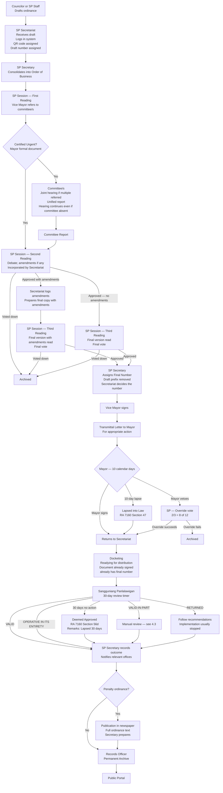

```mermaid
flowchart TD
    A[Councilor or SP Staff\nDrafts resolution\nInputs sponsors in title] --> B[SP Secretariat\nReceives draft\nLogs in system\nQR code assigned — tracking starts\nPreliminary Draft number assigned]

    B --> C[SP Secretary\nConsolidates into Order of Business\nCutoff: Thursday\nfor next Tuesday session]

    C --> D[SP Session — First Reading\nTitle and sponsors read\nVice Mayor refers to committee/s]

    D --> E{Mayor issued\nCertification of Urgency?\nFormal document — frequent}

    E -->|No| F[Committee/s\nJoint hearing if multiple referred\nUnified compiled report\nHearing continues even if a committee is absent]
    E -->|Yes| I[SP Session — Second Reading]

    F -->|Committee defers or archives| Z[Archived]
    F --> G[Committee Report\nSubmitted to Secretariat\nBefore Thursday cutoff]
    G --> I

    I -->|Voted down| Z
    I -->|Approved with amendments| J[Secretariat logs amendments\nFinalizes document\nPrepares amended final copy]
    J --> J2[Final vote on amended version]
    J2 -->|Rejected| Z
    J2 -->|Approved| K[SP Secretary\nAssigns Final Number\nDraft prefix removed\nSecretariat decides the number]

    I -->|Approved — no amendments| K

    K --> L[Presiding Officer — Vice Mayor\nSigns certified copy]

    L --> TRANS[Transmittal Letter to Mayor\nCover letter: For appropriate action]

    TRANS --> N{Mayor action\nwithin 10 calendar days}

    N -->|Mayor signs| O[Returns to SP Secretariat]
    N -->|10-day lapse — no Mayor action| LAPSE[Lapsed into Law\nLogged with RA 7160 legal basis\nSP Secretary notified]
    N -->|Mayor vetoes| P[Returned to SP with objections\nOverride vote: 2/3 = 8 of 12]

    LAPSE --> O
    P -->|Override fails| Z2[Archived]
    P -->|Override succeeds| O

    O --> DOCK[Docketing\nReadying for distribution\nDocument already signed\nalready has final number]

    DOCK --> Q[Sangguniang Panlalawigan\n30-day review timer]

    Q -->|VALID| R[SP Secretary records outcome\nNotifies relevant offices]
    Q -->|VALID-IN-PART| VIP[Manual review — see 4.3]
    Q -->|RETURNED| RET[SP follows recommendations\nModify, repass, or return to draft\nImplementation usually stopped]
    Q -->|30 days no action| DEEMED[Deemed Approved\nRA 7160 Section 56d\nRemarks: Lapsed 30 days]

    DEEMED --> R
    VIP --> R
    RET --> R

    R --> S[Publication\nTitle and first page public only\nFull copy: paid Document Request required]
    S --> T[Records Officer\nPermanent Archive]
    T --> U[Public Portal\nTitle and first page visible\nFull copy via Document Request Form]
```

# Batac City LGU Platform — Consolidated Architecture & Requirements Reference

**Status:** Post-Interview 2 (June 15) | Developer Decisions Resolved | Pre-Development Baseline **Last Updated:** June 2026 **Audience:** Development team (internal reference)

---

## Document Notes

### Source Files Merged

| File                                                                  | Role                                                                                                                                 |
| --------------------------------------------------------------------- | ------------------------------------------------------------------------------------------------------------------------------------ |
| `_architecture-review-and-discovery-focused.md`                       | Pre-interview architecture review, discovery checklists, educated guesses, resolved pre-decisions                                    |
| `key_decisions_developer_reference.md`                                | Pre-interview developer key-decisions reference                                                                                      |
| `lgu-batac-interview-first-june-9-synthesis-complete.md`              | Interview 1 synthesis (June 9) — confirmed findings and clarification questions                                                      |
| `lgu-batac-interview-second-june-15-copyread.md`                      | Interview 2 raw notes (June 15) — resolved questions, scope confirmations, additional workflow details                               |
| `consolidated-architecture-and-requirements-reference-iteration-2.md` | Iteration 2 consolidated reference — source for this document                                                                        |
| Developer decisions (Part 14 answers)                                 | All remaining open questions (Q-A01 through Q-D06) resolved by development team decisions; no further stakeholder interview required |

**Note:** `gap-analysis-assumption-review-architecture-challenges.md` was listed as an original source but was not present in the upload. Its content appears to be substantially integrated into the RESOLVED DECISIONS section of the architecture review document.

### Merge Approach

- Pre-interview `[Inference]` items superseded by interview findings are replaced with confirmed facts.
- Interview 1 findings further confirmed by Interview 2 retain their `[CONFIRMED]` marker.
- Interview 1 items superseded or corrected by Interview 2 are updated in place and labeled `[SUPERSEDES Interview 1]`.
- Previously unresolved questions answered by Interview 2 are marked `[RESOLVED — Interview 2]` and removed from Part 14.
- All remaining unresolved items that were in Part 14 are now resolved by developer decisions and marked `[RESOLVES Q-XXX]` at their respective updated locations.
- Part 14 is now a historical record only — all questions resolved; no active open items remain.

### Key Changes Introduced by Interview 2

|Topic|Change|
|---|---|
|SP Resolution: two readings, not three|SUPERSEDES Interview 1 flowchart|
|Final series number: assigned after last reading (before VP/Mayor sign), not after Mayor signs|SUPERSEDES Interview 1|
|Preliminary number: "Draft" prefix added; removed at finalization|RESOLVES Q-01|
|QR code: assigned at secretariat logging, before preliminary number|RESOLVES Q-02|
|10-day lapse rule: applies to resolutions too|RESOLVES Q-03|
|Designation: one active per person; no Platform Admin confirmation needed|RESOLVES Q-07; UPDATES design|
|Notice of Special Session: NOSP prefix confirmed; separate counter from NCH|RESOLVES Q-13|
|Document prefix updates: SPR, SPS, MO, MI (supersede bare YEAR-NN formats)|SUPERSEDES Interview 1 numbering table|
|Phase 1 includes Appropriation Ordinance|CONFIRMED|
|Franchise removed from all scope; external read-only link only|CONFIRMED|
|Certified Urgent: Mayor-issued formal document, frequent, Phase 1|PARTIALLY RESOLVES Q-05; now Phase 1 not Phase 1B|
|Citizen Complaint: Phase 1 feature|NEW|
|Certification of Urgency: new document type|NEW|
|Appropriation Ordinance: "Operative in its entirety" = synonymous with VALID|CONFIRMED|
|Joint committee hearings: absent committees do not block; unified report|CONFIRMS Part 8 Option B|
|LMITS: possibly renewed subscription; accessible data confirmed|UPDATES prior finding|
|Transmittal letter to Mayor: formal cover letter for legislative measures|NEW|

### Key Changes Introduced by Developer Decisions (Post-Interview 2)

|Topic|Change|
|---|---|
|Number format delimiter: space confirmed for all document types|RESOLVES Q-A01|
|Multi-committee referral: all committees must sign; red-flagged if missing by Thu|RESOLVES Q-A02; UPDATES Part 8.3 step completion logic|
|Certification of Urgency: no standalone number; attached to measure; covers batch|RESOLVES Q-B01; UPDATES Part 4.17|
|Cover page / QR cover sheet: same thing; 3 fields only; compact multi-per-page|RESOLVES Q-B02; UPDATES Part 11.4|
|Originating office: SP Secretariat for all SP workflow docs; sender for letters|RESOLVES Q-B03; ADDS to Part 11.4|
|Complaint: not limited to transportation; Secretariat routes; four outcome states|RESOLVES Q-B04; UPDATES Part 4.14|
|OCR: auto on upload with scan quality indicator; user decides re-scan; on migration|RESOLVES Q-C01; UPDATES Part 11.4 and roadmap|
|Panlalawigan timer: formal written notification confirmed; Secretariat decides VIP|RESOLVES Q-C02; UPDATES Part 4.3|
|LMITS migration: migrate what can be migrated; format TBD; later phases|RESOLVES Q-C03; UPDATES Part 7.5|
|Newspaper publication: SP Secretariat arranges; date is mandatory field; no pub for non-penalty|RESOLVES Q-C04; UPDATES Part 4.2|
|Committee hearing input: Secretariat staff enters; can start without date|RESOLVES Q-C05; UPDATES Part 4.10 and Part 7.2|
|RETURNED ordinance: repassed (back to drafting); no formal legal challenge|RESOLVES Q-C06; UPDATES Part 4.3|
|sp.batac.gov.ph: subscription renewed; both systems coexist; migration deferred|RESOLVES Q-C07; UPDATES Part 7.5|
|VM letter review: Secretariat decides; almost all go to VM; direct if clearly not|RESOLVES Q-D01; UPDATES Part 4.8|
|Administration transition: in-flight documents auto-wait for new Mayor; no formal procedure|RESOLVES Q-D02; UPDATES Part 11.13|
|VALID-IN-PART: depends on recommendation; Legal, committee, or Secretariat direct|RESOLVES Q-D03; UPDATES Part 4.3|
|Payment/fee structure for copy requests: deferred to later stages|RESOLVES Q-D04|
|Franchise external system link: to be decided later|RESOLVES Q-D05|
|QR system for letters/memos: assume doesn't exist; implement in batac-dms|RESOLVES Q-D06; UPDATES Part 7.5 and Part 4.6/4.7/4.8|

---

## Part 1 — Project Identity and Scope

|Decision|Detail|
|---|---|
|Platform name|Batac City LGU Platform|
|Platform type|LGU-wide government operations platform — not a narrow DMS|
|Target LGU|Batac City, Ilocos Norte, Philippines|
|LGU scope|SP Office, Mayor's Office, City Hall departments, Barangays, Citizens|
|Multi-LGU|Batac-specific for now; configuration documented for potential adaptation|
|Legal source of truth|Physical documents remain the legal source of truth|
|Operational source of truth|Digital system is the operational source of truth for tracking, workflow, reporting|

### Module Priority Order

|Priority|Module|Phase|
|---|---|---|
|1|Document Management System (DMS)|Phase 1|
|2|Document Tracking System (DTS)|Phase 1|
|3|Workflow Management System (WMS)|Phase 1 (SP Resolutions, Ordinances, Appropriation Ordinances)|
|4|Records Management System (RMS)|Phase 2|
|5|Government Portal|Phase 3|

---

## Part 2 — Phase 1 Scope Decision `[UPDATED — Interview 2]`

**Decision:** Phase 1 delivers SP Resolutions, SP Ordinances, and Appropriation Ordinances end-to-end, plus Citizen Complaints. All other document types are deferred to Phase 1B or Phase 2. Franchise Ordinances are out of scope entirely (separate jurisdiction — see Part 4.16).

**Basis:** Interview 2 confirmed: "Only Ord., Res., and Appropriation Ordinance" for Phase 1 priority features. Complaint added as a Phase 1 feature. Franchise explicitly removed from all scope.

**Phase 1 Deliverables:**

- SP Resolution workflow (full legislative lifecycle: 2 readings, Mayor signature, 10-day lapse, veto override, Panlalawigan review)
- SP Ordinance workflow (full legislative lifecycle: 3 readings, Mayor signature, 10-day lapse, veto override, Panlalawigan review)
- Appropriation Ordinance workflow (same flow as Ordinance)
- Two-stage numbering for all three: preliminary "Draft" number at secretariat logging; final number after last reading vote, before VP and Mayor sign
- QR code generation (at secretariat logging) and tracking
- Certified Urgent path (Mayor's formal document enables same-session 2nd reading; Phase 1 not Phase 1B)
- Panlalawigan review tracking with 30-day automated timer
- Public portal: approved resolutions and ordinances (title + first page public; full copy by paid Document Request)
- SP Secretary dashboard (queue, pending items, session calendar, Order of Business view)
- Mayor dashboard (pending signatures, overdue items)
- Session attendance tracking (absent councilors, reasons, quorum calculation)
- Secretariat decision logging (Approve / Reject / Amended UI actions)
- Citizen Complaint module (three access modes; see Part 4.15)
- Audit trail for all legislative steps
- RA 11032 (ARTA) SLA tracking for legislative processing

**Phase 1B Additions (deferred document types):**

Letters Received (SPR), Letters Sent (SPS), Memos Incoming (MI), Memos Outgoing (MO), Notices of Committee Hearing (NCH), Notices of Special Session (NOSP), Designations (D), Barangay Resolutions.

**Phase 1 Minimum Viable Core:**

1. IAM (users, roles, RBAC + office scoping, sessions)
2. Organization module (offices, positions, assignments — admin-managed)
3. Document Core (upload, version, classify, SP series numbering — preliminary and final)
4. Workflow Engine (linear + branching + Certified Urgent path + multi-committee referral; Resolution and Ordinance workflows)
5. Document Tracking (QR generation at logging, routing history, scan-to-lookup)
6. In-app notifications (step assignment, overdue alerts)
7. SP Secretary dashboard (including Order of Business view with session schedule and red-flagged items)
8. Mayor dashboard
9. Audit log (append-only, hash-chained, INSERT-only DB permissions)
10. Public portal (Phase 1 subset: track by number + published documents with first-page preview)
11. Citizen Complaint module
12. Infrastructure (PostgreSQL, S3-compatible, Docker, Terraform, backup)

**Franchise Ordinances: Out of Scope Entirely**

Franchise Ordinances are managed by the Franchise Section with their own external system/website. The platform will display a read-only link to that system. No Create, Update, or Delete operations on franchise data. Franchise is outside the SP Secretariat's jurisdiction. `[CONFIRMED — Interview 2]`

**Scope confirmation still needed with SP Secretary:** "We are planning Phase 1 to deliver SP Resolutions, SP Ordinances, and Appropriation Ordinances with full legislative workflow, public portal access, tracking, and a Citizen Complaint feature. Does this scope match your expectation? Are there any other document types that are blocking dependencies for your office?"

---

## Part 3 — Confirmed Stakeholders and Organizational Structure `[CONFIRMED from Interview 1]`

### 3.1 Mayor and Vice Mayor

|Role|Name|Prefix|
|---|---|---|
|Mayor (7th SP era)|Hon. Mark Christian R. Chua|MRC|
|Vice Mayor (Presiding Officer, 7th SP)|Hon. Albert D. Chua|ADC|

Note: The Vice Mayor and a previous Mayor share the surname Chua but are distinct individuals. The current Mayor's document prefix is MRC; the Vice Mayor's is ADC.

### 3.2 SP Members — 7th Sangguniang Panlungsod

| Name                                    | Role               |
| --------------------------------------- | ------------------ |
| Hon. Kichel Jomarie G. Pungtilan        | City Councilor     |
| Hon. Eleuterio A. Salamangkit Jr.       | City Councilor     |
| Hon. Martha Louise Aurora M. Borleo     | City Councilor     |
| Hon. Gwyneth S. Quidang                 | City Councilor     |
| Hon. John Gabrielle Dominique M. Daguio | City Councilor     |
| Hon. Lucky Rene G. Bunye                | City Councilor     |
| Hon. Violeta Eugenia D. Nalupta         | City Councilor     |
| Hon. Macarthur A. Aguinaldo             | City Councilor     |
| Hon. Rizal P. Castillo                  | City Councilor     |
| Hon. Juan Paulo P. Flojo                | City Councilor     |
| Hon. Gilbert O. Medina                  | ABC Representative |
| Hon. Reign Gwendia T. Mirasol           | SK Representative  |

**Voting threshold:** 12 members; half+1 required = **7 votes to pass**. No proxy voting. `[CONFIRMED]`

**Veto override threshold:** 2/3 majority = **8 of 12 members**. `[CONFIRMED]`

### 3.3 Office of the Secretary to the Sangguniang Panlungsod

| Name                        | Position                                                       |
| --------------------------- | -------------------------------------------------------------- |
| Gladys R. Lagura            | SP Secretary                                                   |
| Mia Prima M. Mesina         | Administrative Officer II — Ordinances & Resolutions Section   |
| Ronald P. Beltran           | Administrative Officer II — Franchise Section                  |
| Bonn Roger G. Rosales       | Administrative Aide VI (Clerk III) — Administrative Section    |
| Kathielyn R. Ilayat         | Administrative Aide VI (Clerk III) — Administrative Section    |
| Paul Josiah N. Chua         | Administrative Aide VI (Clerk III) — Administrative Section    |
| Joanne Marie Q. Macugay     | Administrative Aide VI (Clerk III) — Franchise Section         |
| Jeniffer S. Gaoiran         | Administrative Aide VI (Clerk III) — Franchise Section         |
| Antonia Elizabeth G. Yaplag | Administrative Aide VI (Clerk III) — Franchise Section         |
| Florentino Pablo R. Lumang  | Administrative Aide VI (Data Controller I) — Franchise Section |
| Ronell R. Purisima          | Administrative Aide III (Utility Worker II)                    |
| Ramil F. Rante              | Administrative Aide IV (Driver III)                            |
| Cherill S. Malicad          | Librarian I — City Library                                     |

### 3.4 Personal Staff of the Vice Mayor

|Name|Position|
|---|---|
|Jocelyn D. Villavicencio|Executive Assistant II|
|Tristan Melecia D. Advincula|Executive Assistant I|
|Artelyn B. Rupisan|Secretary I|
|Jay Carlo V. Ragudo|Driver II|

### 3.5 Sangguniang Panlalawigan Contact

**SP Secretary (Provincial Board):** Mildred Nirmla R. Lamoste — confirmed recipient of SP documents transmitted for provincial review.

---

## Part 4 — Confirmed Document Types, Workflows, and Numbering

### 4.1 SP Resolution `[UPDATED — Interview 2: two readings confirmed; numbering change; flowchart updated]`

**Confirmed numbering format:**

- Preliminary: `Draft 7SP {YEAR}-{NN}` (e.g., `Draft 7SP 2026-02`) — assigned at secretariat logging, before QR even (QR assigned first at logging)
- Final: `7SP {YEAR}-{NN}` (e.g., `7SP 2026-1`) — assigned by Secretariat after Second Reading vote, before VP and Mayor sign

**Critical numbering note:** Preliminary "Draft" numbers can change between readings. If Document A gets `Draft 7SP 2026-02` at First Reading but Document B (originally `Draft 7SP 2026-01`) is approved first, Document A may be renumbered when finalized. The sequence of final numbers depends on which document completes its last reading vote first. `[CONFIRMED — Interview 2, resolves Q-01]`

**Key corrections from Interview 2:**

- SP Resolutions have **TWO readings**, not three. Interview 1's official flowchart showed three readings; Interview 2 stakeholder statement supersedes. `[SUPERSEDES Interview 1]`
- Final series number is assigned **after Second Reading vote, before VP and Mayor sign** — not after Mayor's signature as previously understood. `[SUPERSEDES Interview 1]`
- Amendments at Second Reading: Secretariat logs and finalizes. No separate third reading for resolutions. `[CONFIRMED — Interview 2]`

**Updated confirmed workflow:**



**Key confirmed facts:**

- Resolutions have **two readings**: First Reading (referral to committee) and Second Reading (debate, amendments, vote). `[CONFIRMED — Interview 2]`
- Mayor's signature required. 10-day lapse rule applies to resolutions. Mayor can veto. `[CONFIRMED — Interview 2, resolves Q-03]`
- Veto override: 2/3 majority (8 of 12 members). `[CONFIRMED]`
- Certified Urgent (Mayor's formal document): First and Second Reading occur in the same session. Frequent. `[CONFIRMED — Interview 2]`
- Final number assigned by Secretariat after Second Reading vote, before VP signs. `[CONFIRMED — Interview 2]`
- Amendments at Second Reading: Secretariat logs, finalizes, produces final copy. No separate third reading. `[CONFIRMED — Interview 2]`
- Transmittal Letter (cover letter: "For appropriate action") accompanies the document when sent to the Mayor. `[CONFIRMED — Interview 2]`
- Docketing occurs after returning from Mayor (document already has final number at this point). `[CONFIRMED — Interview 2]`
- Both resolutions and ordinances transmitted to Panlalawigan after Mayor action. `[CONFIRMED]`
- Panlalawigan RETURNED → implementation usually stopped. `[CONFIRMED — Interview 2]`
- Publication: title and first page publicly visible. Full copy requires paid Document Request + VM + SP Secretary approval. `[CONFIRMED — Interview 2]`
- Sponsors: only councilors can sponsor, but VM is included/mentioned after title. `[CONFIRMED — Interview 2]`

---

### 4.2 SP Ordinance `[UPDATED — Interview 2: numbering change; docketing step added]`

**Confirmed numbering formats:**

|Ordinance Type|Preliminary Format|Final Format|Counter Scope|
|---|---|---|---|
|Regular Ordinance|`Draft 7SP {YEAR}-{NN}`|`7SP {YEAR}-{NN}`|Per year; resets|
|Appropriation Ordinance|Same as Regular|Same as Regular|Per year; resets|
|Franchise Ordinance|**OUT OF SCOPE**|—|—|

**Key change from Interview 1:** Final series number is assigned **after Third Reading vote, before VP and Mayor sign** — not at docketing after Mayor's signature. `[SUPERSEDES Interview 1]`

**Appropriation Ordinances** follow the same workflow as regular ordinances. Now included in Phase 1. `[CONFIRMED — Interview 2]` "Operative in its entirety" = Panlalawigan outcome specific to Appropriation Ordinances; synonymous with "valid; can be implemented." `[CONFIRMED — Interview 2]` Supplemental Appropriation Ordinances (allocate more to initial budget) follow the same flow.

**Updated confirmed workflow:**



**Key confirmed facts:**

- Ordinances have **three readings**: First Reading (referral), Second Reading (amendments), Third Reading (final version with amendments; final vote). `[CONFIRMED]`
- Amendments at Second Reading. Third Reading reads the final amended version. `[CONFIRMED — Interview 2]`
- Final number assigned by Secretariat after Third Reading vote, before VP signs. `[CONFIRMED — Interview 2]`
- Docketing step after Mayor action: Secretariat readies document for distribution. At this point document already has final number. `[CONFIRMED — Interview 2]`
- Mayor 10-day lapse: applies to ordinances. `[CONFIRMED]`
- Publication: only ordinances **with penalty** require full newspaper publication (Ilocos Times). Full ordinance text published. **SP Secretariat arranges placement** with Ilocos Times. Publication date is a mandatory tracked field in SP records. `[CONFIRMED — Interview 2; RESOLVES Q-C04]`
- Ordinances **without penalty**: no newspaper publication required; shown on public portal only. `[RESOLVES Q-C04]`
- Appropriation Ordinance: same flow; no special workflow. `[CONFIRMED — Interview 2]`

---

### 4.3 Sangguniang Panlalawigan Review `[UPDATED — Interview 2]`

**Scope:** Both ordinances AND resolutions are transmitted. `[CONFIRMED from Ordinance/Resolution Sent log]`

**Sequence:** Transmission occurs AFTER Mayor action (sign or lapse). `[CONFIRMED]`

**Log fields tracked by SP Secretariat:**

|Field|Detail|
|---|---|
|Control No.|SP Secretariat's own sequence number (e.g., 2026-01)|
|Date Received|When the Panlalawigan's response was received back|
|SP Reso. No.|Panlalawigan's own resolution number (e.g., R2026-0841)|
|Subject|Which SP document(s) were reviewed|
|Date Approved / Disapproved|From the Panlalawigan|
|Date Referred|Date Panlalawigan sent to their own committee|
|Remarks|Outcome and notes|

**Outcome types confirmed:**

|Outcome|Meaning|
|---|---|
|VALID|Approved by Panlalawigan|
|VALID-IN-PART|Partially approved; some provisions found invalid|
|RETURNED|Returned with objections (treated as disapproved)|
|Referred to committee|Panlalawigan committee review in progress; 30-day clock running|
|Operative-in-its-entirety|Used specifically for Appropriation Ordinances; means valid/implementable|
|_(blank — 30 days elapsed)_|Deemed approved per RA 7160 Section 56(d); Remarks: "Lapsed 30 days"|

**Outcome handling — updated from Interview 2 and developer decisions:**

When **RETURNED**:

- Secretariat follows recommendations: may change, modify, repass, or return document to draft
- Can refer to City Legal Office or concerned Committee
- Sometimes Secretariat makes changes themselves without repassing
- **Implementation is usually stopped** after RETURNED `[CONFIRMED — Interview 2]`
- If returned after implementation has already started: repassed (document goes back to drafting). No formal legal process exists to challenge the return. `[RESOLVES Q-C06]`

When **VALID-IN-PART**:

- Response depends on the specific recommendation provided by Panlalawigan
- If a provision needs to be added or amended: may be referred to the City Legal Office for appropriate review
- May be referred to the concerned Committee for further evaluation and recommendation
- In some instances, Secretariat implements the necessary revisions directly without requiring the matter to be re-passed
- Secretariat ultimately decides the path `[RESOLVES Q-D03]`

When **no action after 30 days**:

- Deemed approved — regular flow follows: publish, log, archive
- Remarks: "Lapsed 30 days" `[CONFIRMED — Interview 2]`
- When Panlalawigan acts within 30 days: SP Secretariat receives a formal written notification (Panlalawigan resolution) `[RESOLVES Q-C02]`
- When 30 days lapse with no action: SP Secretary records this; marked as "lapsed" `[RESOLVES Q-C02]`

**Multiple documents per batch:** The Panlalawigan frequently acts on multiple SP documents in one resolution. Franchise ordinances specifically are sent to Panlalawigan in batch. `[CONFIRMED]`

**Feedback loop:** When Panlalawigan acts, SP Secretariat records the action and forwards notification to relevant offices (e.g., CPDO, Budget Office, City Engineer). `[CONFIRMED]`

**System behavior decisions:**

- **30-day timer:** Automatically tracked from transmission date. At day 30 with no response, system transitions status to "Deemed Approved per RA 7160 Section 56(d)" and notifies SP Secretary, who confirms. Remarks field populated with the statutory legal basis phrase.
- **VALID-IN-PART handling:** System marks the document VALID-IN-PART, attaches the Panlalawigan's response, places step in "Awaiting SP Secretariat Action." SP Secretary chooses: (1) Resolve as-is with mandatory comment; (2) Route to Legal Office; (3) Route to concerned Committee for re-evaluation; (4) Implement revisions directly without repassing. All choices are audit-logged. `[UPDATED — developer decisions]`
- **RETURNED handling:** System flags high-priority, requires immediate review. Secretariat decides path: modify and repass (back to drafting) is the standard outcome. No formal legal challenge mechanism exists. Implementation stops.

---

### 4.4 Barangay Resolution `[CONFIRMED]`

|Step|Actor|Notes|
|---|---|---|
|1|Barangay|Submits to SP Secretariat physically|
|2|Secretariat / Records Officer|Logs; attaches QR code|
|3|SP Session|First Reading|
|4|Vice Mayor|Refers to committee|
|5|Committee|Reviews; produces committee report|
|6|Secretariat|Finalizes; assigns series number|
|7|Secretariat|Returns decision to barangay physically|
|—|System|Status notification sent to barangay|

**Phase 1 note:** Barangay officials have no system access in Phase 1. Secretariat logs their physically submitted documents on their behalf. `[CONFIRMED]`

---

### 4.5 Barangay Budget `[CONFIRMED — introduces parallel steps]`

Referred simultaneously to multiple offices for preliminary review. **This is the only confirmed workflow in Phase 1 scope requiring parallel step execution.**

|Step|Actor|Notes|
|---|---|---|
|1|Barangay|Submits to SP Secretariat|
|2|SP Session|First Reading|
|3|Local Finance Committee; Budget Office; Treasury Office; CPDO|**Parallel preliminary review** (all simultaneously)|
|4|Secretariat|Waits for all preliminary reviews to complete|
|5|Referred committee|Produces committee report|
|6|Secretariat|Assigns series number; SP votes|
|7|Secretariat|Returns decision to barangay physically|

**Note:** Confirms genuine parallel split/join requirement. While pre-development decision deferred parallel steps to Phase 2, barangay budgets are an early operational reality. The Barangay Budget parallel workflow requires Phase 2 parallel split/join engine.

---

### 4.6 Internal Memo Outgoing `[UPDATED — Interview 2: prefix confirmed as MO]`

**Confirmed numbering format:** `MO {YEAR}-{NN}` — e.g., `MO 2025-01`, `MO 2025-04` `[CONFIRMED — Interview 2]`

**Important distinction:** Memos have a **memo number** embedded in the document content itself (e.g., "VM ADC Memo No. MO 2025-01"). Letters have no number embedded in the document — only the secretariat control number exists for tracking purposes. `[CONFIRMED — Interview 2]`

|Field|Detail|
|---|---|
|Initiator|Vice Mayor or SP Secretary|
|Memo number|Assigned from originating authority; embedded in document; fixed and immutable|
|Control number|SP Secretariat's own sequential number (MO format) — assigned after finalization|
|Signatories|Vice Mayor|
|Flow|VM issues memo → SP Secretary receives → QR generated → Disseminated physically to SP Members and recipients → Archived|

**Dual number system:** Memo number (originating authority's own reference, embedded in document) + control number (secretariat's internal reference, MO format). These are distinct identifiers.

**Current state:** Existing memos have QR codes attached. **System decision: assume no existing digital QR system exists; QR generation and tracking for letters and memos will be implemented in batac-dms.** `[RESOLVES Q-D06]`

---

### 4.7 Memo Incoming `[UPDATED — Interview 2: prefix confirmed as MI]`

**Confirmed numbering format:** `MI {YEAR}-{NN}` — separate counter from MO and SPR `[CONFIRMED — Interview 2]`

**Sources:** Mayor's Office (Memorandum Circulars with prefix MRC); other internal LGU offices.

**Distinguishing rule:** Memos Incoming = formal memos from the Mayor's Office or internal LGU departments. Letters Received = all other incoming correspondence (external sources, citizens, provincial board, etc.). `[Confirmed by documentary evidence]`

**Current state:** Existing memos have QR codes attached. **System decision: assume no existing digital QR system; implement in batac-dms.** `[RESOLVES Q-D06]`

|Field|Detail|
|---|---|
|Log fields|Control No.; Date Received; Origin (including sender's own reference, e.g., "MRC Memo Circ. No. 2025-001"); Subject|

---

### 4.8 Letters Received `[UPDATED — Interview 2: prefix confirmed as SPR; routing rules added]`

**Confirmed numbering format:** `SPR {YEAR}-{NN}` — e.g., `SPR 2026-01`. **Resets to 01 each year.** Separate counter from SPS. `[CONFIRMED — Interview 2]`

**Important distinction from memos:** Letters have no number embedded in the document itself. The SPR control number is a secretariat tracking reference only, not embedded in the letter content. `[CONFIRMED — Interview 2]`

**Volume confirmed:** ~38 letters/month to SP Secretariat alone (Q1 2026 sample).

**Confirmed senders:** DILG-Batac, other city departments, barangay officials, provincial board members, universities (MMSU), private organizations, citizens.

**Routing rules `[UPDATED — developer decisions; RESOLVES Q-D01]`:**

- **Almost all letters go to the Vice Mayor** for review/routing instructions, because almost all are addressed to him or to his office
- If Secretariat determines a letter clearly does not require VM review, it routes directly — Secretariat decides
- Letters that **do not** go to the VM are usually memos addressed to SP employees; Secretariat discerns this and routes directly
- Does not have to go to the Mayor — processed at the Secretariat only
- Whether committee hearing is needed: case-by-case, decided by committee

**Control number immutability rule confirmed:** Control numbers are immutable once assigned. A mistake requires deleting the entire row and creating a new one — the number is not edited in place. `[CONFIRMED]`

**Deferred assignment:** Control numbers are not always assigned immediately at receipt. Some entries show "SPR-2026-" with no sequence number filled, then later numbered after VM review and routing decision. `[CONFIRMED from scanned logs]`

**Current state:** Existing letters have QR codes attached. **System decision: assume no existing digital QR system; implement in batac-dms.** `[RESOLVES Q-D06]`

|Field|Detail|
|---|---|
|Flow|Received → QR attached → Given to Vice Mayor (adds notes/routing instructions) → Returned to Secretariat → Action taken → Disseminated → Archived|

---

### 4.9 Letters Sent `[UPDATED — Interview 2: prefix confirmed as SPS]`

**Confirmed numbering format:** `SPS {YEAR}-{NN}` — e.g., `SPS 2026-01` through `SPS 2026-36` in Q1 2026. **Separate counter from SPR.** `[CONFIRMED — Interview 2]`

**Important distinction from memos:** Letters have no number embedded in the document itself. The SPS control number is a secretariat tracking reference only. `[CONFIRMED — Interview 2]`

**Confirmed:** The same sequence number (e.g., 07) can appear in both SPR and SPS logs without ambiguity. They are different documents in different sequences.

|Field|Detail|
|---|---|
|Initiator|Vice Mayor or SP Secretary|
|Signatories|SP Secretary and Vice Mayor|
|Flow|Secretariat creates → QR attached → Signed → Disseminated → Archived|
|Content types|Forwarding committee reports to complainants and respondents; transmitting Panlalawigan action; session invitations; forwarding ordinances/resolutions to external parties; **Transmittal Letters to Mayor for legislative measures**|

**Operational note:** Letters Sent include formal forwarding of committee reports on transportation complaints to both complainants and respondents. Also used for transmittal letters accompanying legislative measures to the Mayor's Office.

---

### 4.10 Notice of Committee Hearing (NCH) `[UPDATED — Interview 2: joint hearing rules added]`

**Confirmed numbering format:** `NCH {YEAR}-{NN}` — **separate counter from NOSP** `[CONFIRMED — Interview 2]`

|Field|Detail|
|---|---|
|Signatories|SP Secretary and Vice Mayor|
|Multiple recipients per notice|Confirmed — a single NCH can go to multiple parties|
|Multiple committees co-notified|Confirmed — some hearings involve two or more committees simultaneously|

**Joint committee hearing rules from Interview 2:**

- When multiple committees are referred: **joint hearing**; **single unified compiled report** `[CONFIRMED — Interview 2]`
- If one committee is absent, the hearing still continues `[CONFIRMED — Interview 2]`
- Even if an entire committee is absent as a whole, the hearing proceeds `[CONFIRMED — Interview 2]`
- Not all committee members are required to be present `[CONFIRMED — Interview 2]`
- System does **not** log individual committee absentees `[CONFIRMED — Interview 2]`
- In one hearing session, multiple documents can be discussed as long as the committees concerned are the same `[CONFIRMED — Interview 2]`

**Committee hearing scheduling rules `[RESOLVES Q-C05]`:**

- Sessions for resolutions/ordinances are always on **Tuesday**
- Committee hearings with concerned people and departments: committees decide themselves when to hold them; deadline is **Thursday**
- Hearing date in the system: **Secretariat staff enters what the committee communicates** — committee representatives do not input directly
- A committee referral step can begin without a scheduled date ("assigned; date TBD") `[CONFIRMED]`
- Certified Urgent Resolutions and Ordinances **skip committee review and report entirely**

---

### 4.11 Notice of Special Session `[RESOLVED — Interview 2]`

**Confirmed numbering format:** `NOSP {YEAR}-{NN}` — **separate prefix and counter from NCH** `[CONFIRMED — Interview 2, resolves Q-13]`

The `NCH` prefix was briefly used for Notices of Special Session (2023) — this was a mistake. **Always use `NOSP` for Notice of Special Session.** `[CONFIRMED — Interview 2]`

NCH and NOSP are separate sequences with separate annual counters.

|Field|Detail|
|---|---|
|Purpose|Urgent notification that a special session is happening|
|Log fields|Control No.; Date Sent; Session No. (ordinal, date, time); Subject|
|Signatories|SP Secretary and Vice Mayor|

---

### 4.12 Designation `[SIGNIFICANTLY UPDATED — Interview 2]`

**Confirmed numbering format:** `D {YEAR}-{NN}` — e.g., `D 2024-01` through `D 2024-19`

**Dual number system confirmed:** Each Designation has two numbers — the originating authority's own memo/order number AND the SP Secretariat's control number (D format).

**Confirmed constraints from Interview 2:**

|Rule|Value|
|---|---|
|Who initiates|Original authority only (Mayor or Vice Mayor per scope of designation)|
|Who else confirms|**No other confirmation required** — original authority initiates; no Platform Admin step|
|Multiple simultaneous designations per person|**NOT ALLOWED** — a person cannot hold more than one active designation at a time `[CONFIRMED — Interview 2, resolves Q-07]`|
|Expiry|Automatic at end date — authority returns to original authority automatically `[CONFIRMED — Interview 2]`|
|Designation scope confirmation by Platform Admin|**Not required** — Interview 2 supersedes the prior design that included this step `[SUPERSEDES Interview 1 design]`|

**Change from Interview 1 design:** The Post-Interview 1 design included a manual Platform Administrator confirmation step before delegation took effect. Interview 2 confirms: **no such confirmation is needed.** Original authority issues the Designation; Secretariat logs it; system updates routing immediately. `[SUPERSEDES Interview 1]`

**System behavior:**

1. Mayor or Vice Mayor issues Designation document
2. Secretariat receives and logs it (D {YEAR}-{NN} number; QR assigned)
3. Staff extracts scope and time bounds from the Designation document; enters in system manually
4. `delegation_grant` record created: **immediate effect, no Platform Admin confirmation step**
5. System routes affected workflow steps to the designated person for the duration
6. Auto-expires at end date: routing returns to original authority automatically
7. One active designation per person enforced (DB partial unique index on active delegations per user)

**High-frequency operation confirmed:** 10+ separate designations of the Vice Mayor as Acting Mayor in 2023–2024 alone. Routine, not edge case. `[CONFIRMED]`

**Confirmed examples:** Vice Mayor designated as Acting Mayor during Mayor's travel; Administrative Officer II designated as OIC of SP Secretariat; SP Member designated as Acting Vice Mayor.

|Field|Detail|
|---|---|
|Origin|Mayor's Office (Mayor-level) or Vice Mayor's Office (VP-level)|
|SP role|Intake and logging only; does not create or authorize|
|Signatories|Mayor or Vice Mayor (per scope)|

**Audit trail records:** Original authority, designated person, time period, scope, legal basis.

---

### 4.13 Administrative Cases `[CONFIRMED]`

Complaints against officials (mostly barangay officials). Processed by the SP Secretariat. **Access restricted to the Legislative branch only.** No generally confidential records in routine SP operations outside this category.

---

### 4.14 Citizen Complaint `[UPDATED — developer decisions; formerly Transportation-only]`

Complaints addressed to the Sangguniang Panlungsod. **Not limited to transportation subjects** — any LGU-related complaint can be filed. `[RESOLVES Q-B04]`

**Phase 1 note:** Complaint added as a Phase 1 feature. `[CONFIRMED — Interview 2]`

**Confirmed form fields (transportation complaint as primary type):** Violation type (overcharging, trip cutting, refused to convey, discourtesy, others), tricycle number, date and time, place, remarks, complainant name/address/contact.

**Routing:** Secretariat decides routing — to committee directly, or to Vice Mayor, depending on the nature of the complaint. No fixed routing rule. `[RESOLVES Q-B04]`

**Resolution process:**

1. Complaint received and logged by Secretariat
2. Secretariat routes to appropriate committee (Secretariat decides)
3. Committee renders report
4. Secretariat logs the report
5. Secretariat sends report to complainant (via the notification channel discussed below)
6. Secretariat marks complaint as resolved

**Respondent notification `[RESOLVES Q-B04]`:**

- Respondent (e.g., tricycle operator) receives a formal written notice
- If respondent has an **email address**: notification AND the formal written notice sent by email
- If respondent has **only a contact number**: notification sent by SMS/phone; respondent must claim the formal written notice in person from the LGU

**Outcome states `[RESOLVES Q-B04]`:**

1. **Pending Hearing** — complaint received; committee referral in progress
2. **Received/Seen** — Vice Mayor and/or Committee has received/seen the complaint (intermediate status)
3. **Dismissed** — complaint dismissed
4. **Resolved** — committee report issued; complainant notified; case closed

**Complainant access modes:** Same three access modes as Document Request Form (see Part 4.15): download-and-submit physical, digital form printed and signed, or in-person clerk-assisted.

**Scope:** Any LGU-related complaint, not limited to tricycle/transportation. Transportation complaints go to Committee on Transportation (co-referred with Committee on Laws) as a standard routing pattern.

---

### 4.15 Document and Records Request Form `[UPDATED — Interview 2: three access modes confirmed]`

Fee-based process for copies of SP documents. Approval requires both Vice Mayor AND SP Secretary signature.

**Confirmed fields:** Document type, title, number of pages, requester name/agency, date, email, ID presented, purpose, payment (Secretary's Fees under Ordinance No. 3SP 2014-05), OR number, collecting officer.

**QR code on form:** Confirmed. Website reference: sp.batac.gov.ph.

**Three access modes for both document requests and complaints `[CONFIRMED — Interview 2]`:**

1. Citizen downloads template from sp.batac.gov.ph → submits physical document with handwritten/wet-ink signature
2. Citizen inputs details on digital form in batac-dms → system generates printable form → citizen prints, signs, and submits
3. Citizen goes to Secretariat in person → clerk inputs info into digital form → prints document on-site → citizen signs on the spot

Physical submission with signature is still required (documents must be signed). The digital form enables data capture and formatted document generation — not a replacement for the physical submission. `[CONFIRMED — Interview 2]`

**Post-approval notifications:** After a copy request is approved, person notified via contact number (primary channel). Payment then required before copy is released. `[CONFIRMED — Interview 2]`

**Payment system:** Deferred to **stages later than the currently planned phases**. Not Phase 1 or Phase 1B. `[RESOLVES Q-D04]`

**Public portal behavior confirmed:** First page of uploaded documents visible publicly; body is blurred. Title only shown in public listings. Full copy by request only. `[CONFIRMED]`

---

### 4.16 Documents Removed from Scope

|Document Type|Status|
|---|---|
|Executive Orders|Removed from scope entirely (per stakeholder)|
|Purchase Requests|Not part of the system (per stakeholder)|
|Session Minutes|Not a standalone document type; treated as attachment to session record; no separate control number; assumed approved without separate certification workflow `[CONFIRMED]`|
|Franchise Ordinances|**Removed from all scope** — Franchise Section has separate jurisdiction and their own system. Platform: read-only external link to Franchise Section system. No CRUD. `[CONFIRMED — Interview 2]` URL and link type to be decided later. `[RESOLVES Q-D05]`|

---

### 4.17 Certification of Urgency `[UPDATED — developer decisions; RESOLVES Q-B01]`

A formal document issued by the Mayor to certify a pending legislative measure as urgent, enabling First and Second Reading to occur in the same session.

|Field|Detail|
|---|---|
|Issued by|Mayor (formal written document — not a verbal declaration)|
|Logged by|SP Secretariat (receives and logs; does not create or authorize)|
|Effect|Associated measure bypasses committee referral; goes directly to Second Reading in the same session|
|Frequency|**Frequent** — explicitly noted as a common occurrence `[CONFIRMED — Interview 2]`|
|Debate and vote|In the same session as First Reading (when certified urgent)|
|Number format|**No standalone number** — the Certification is always associated with and referenced by the document(s) it certifies. No independent numbering series. `[RESOLVES Q-B01]`|
|Attachment|Attached to the specific legislative measure(s) in the system — not filed as a standalone document `[RESOLVES Q-B01]`|
|Scope per certification|A single Certification of Urgency **can cover multiple measures** in the same session `[RESOLVES Q-B01]`|

**System integration:** When a Certification of Urgency is logged by Secretariat:

- The Certification document is attached to the associated measure(s)
- Each associated measure's workflow instance is updated: committee referral step is bypassed, workflow advances to Second Reading
- The Certification is archived as part of the measure's document record, not as a standalone entry
- If one Certification covers multiple measures, it is attached to each measure individually

**Phase status:** Phase 1 (not Phase 1B). Frequency and confirmed formal document nature justify Phase 1 inclusion. `[CONFIRMED — Interview 2]`

---

### 4.18 Order of Business `[NEW — Interview 2]`

A session agenda document generated and managed by the SP Secretariat.

|Field|Detail|
|---|---|
|Generated by|SP Secretariat|
|Frequency|Weekly (prior to each Tuesday session)|
|Submission cutoff|Thursday of the preceding week|
|Content|All documents scheduled for the upcoming session's First Reading|
|Visual indicator|Items with missing or pending committee reports marked red|
|Scheduling rule|Documents received by Secretariat before Thursday cutoff are included in the next Tuesday Order of Business|
|Physical use|Participants read the Order of Business as a physical document during sessions|

**System implication:** The Order of Business is a derived view generated from all documents scheduled for the upcoming session. The SP Secretary dashboard must include an Order of Business management view showing scheduled documents, their committee referral status, and red-flagging items with missing committee reports.

---

## Part 5 — Numbering System `[SIGNIFICANTLY UPDATED — Interview 2]`

### 5.1 Confirmed Number Formats

| Document Type                              | Preliminary Format      | Final Format       | Counter Scope                                                               |
| ------------------------------------------ | ----------------------- | ------------------ | --------------------------------------------------------------------------- |
| Resolution                                 | `Draft 7SP {YEAR}-{NN}` | `7SP {YEAR}-{NN}`  | Per year; resets. Final assigned after Second Reading vote, before VP sign. |
| Ordinance                                  | `Draft 7SP {YEAR}-{NN}` | `7SP {YEAR}-{NN}`  | Per year; resets. Final assigned after Third Reading vote, before VP sign.  |
| Appropriation Ordinance                    | Same as Ordinance       | Same as Ordinance  | Per year; resets                                                            |
| Franchise Ordinance                        | **OUT OF SCOPE**        | —                  | —                                                                           |
| Notice of Committee Hearing                | N/A                     | `NCH {YEAR}-{NN}`  | Per year; resets; **separate counter from NOSP**                            |
| Notice of Special Session                  | N/A                     | `NOSP {YEAR}-{NN}` | Per year; resets; **separate counter from NCH** `[CONFIRMED — Interview 2]` |
| Designation                                | N/A                     | `D {YEAR}-{NN}`    | Per year; resets                                                            |
| Letters Received                           | N/A                     | `SPR {YEAR}-{NN}`  | Per year; resets; **separate from SPS** `[CONFIRMED — Interview 2]`         |
| Letters Sent                               | N/A                     | `SPS {YEAR}-{NN}`  | Per year; resets; **separate from SPR** `[CONFIRMED — Interview 2]`         |
| Memo Outgoing                              | N/A                     | `MO {YEAR}-{NN}`   | Per year; resets; **separate from MI** `[CONFIRMED — Interview 2]`          |
| Memo Incoming                              | N/A                     | `MI {YEAR}-{NN}`   | Per year; resets; **separate from MO** `[CONFIRMED — Interview 2]`          |
| Sangguniang Panlalawigan Review (SP's log) | N/A                     | `{YEAR}-{NN}`      | Per year; resets                                                            |
| Panlalawigan's own reference               | N/A                     | `R{YEAR}-{NNNN}`   | Panlalawigan-assigned; stored as metadata                                   |
|                                            |                         |                    |                                                                             |

**`{SP_NUMBER}`** = The ordinal SP (currently 7th SP → prefix "7"). Changes with each administration.

**Changes from Interview 1:**

- Letters Received: was `{YEAR}-{NN}` → now `SPR {YEAR}-{NN}`
- Letters Sent: was `{YEAR}-{NN}` → now `SPS {YEAR}-{NN}`
- Memo Outgoing: was `{YEAR}-{NN}` → now `MO {YEAR}-{NN}`
- Memo Incoming: was `{YEAR}-{NN}` → now `MI {YEAR}-{NN}`
- Notice of Special Session: was ambiguous (NCH or NOSP) → now confirmed `NOSP {YEAR}-{NN}`, separate from NCH
- Resolution/Ordinance: preliminary number now has "Draft" prefix; final number removes "Draft"
- Final number assignment event: moved from post-Mayor signature to post-last-reading vote

**Note on exact delimiter format `[RESOLVES Q-A01]`:** The confirmed delimiter between prefix and year-number is a **space**. Assembled formats: `SPR 2026-01`, `SPS 2026-01`, `MO 2025-01`, `MI 2025-01`, `NOSP 2026-01`, `NCH 2026-01`, `D 2024-01`. The "Draft" prefix format for preliminary resolutions/ordinances is `Draft 7SP 2026-02` (space between "Draft" and the series, and space between the series and year-number). This space-delimiter applies to all document types. The `number_series.format` field stores this assembled format string.

**Note on memos vs. letters:** Memos have the MO/MI number embedded in the document itself (e.g., "Memo No. MO 2025-01"). Letters have no number embedded in the document — only the SPR/SPS control number as a secretariat tracking reference. `[CONFIRMED — Interview 2]`

**Note on Franchise Ordinance "R" suffix:** "R" means "Renewal." `[CONFIRMED — Interview 2]`

### 5.2 Numbering Architecture Decisions `[UPDATED — Interview 2]`

| Rule                          | Decision                                                                                                                                                                                            |
| ----------------------------- | --------------------------------------------------------------------------------------------------------------------------------------------------------------------------------------------------- |
| Preliminary number format     | `"Draft " + {series_prefix} + " " + {YEAR} + "-" + {NN}` — e.g., `Draft 7SP 2026-02`. Assigned at secretariat logging. Space delimiter throughout. `[CONFIRMED — Interview 2; RESOLVES Q-A01]`      |
| Preliminary number mutability | Draft numbers can change before finalization. Nullable `preliminary_number` field on `document_numbers`; replaced when finalized. `[CONFIRMED — Interview 2]`                                       |
| Final number assignment       | Resolutions: after Second Reading vote. Ordinances: after Third Reading vote. Always before VP and Mayor sign. Secretariat assigns and decides. `[CONFIRMED — Interview 2; SUPERSEDES Interview 1]` |
| "Draft" prefix                | Distinguishes preliminary from final. Removal of "Draft" = promotion to final number. `[CONFIRMED — Interview 2]`                                                                                   |
| Delimiter                     | **Space** confirmed for all document types: `SPR 2026-01`, `MO 2025-01`, `D 2024-01`, `NCH 2026-01`, `NOSP 2026-01`. `[RESOLVES Q-A01]`                                                             |
| Deferred assignment           | For letters/memos: control numbers may not be assigned immediately at receipt. Nullable `control_number` supported; assignment is a distinct recorded action.                                       |
| Immutability                  | Final numbers (after "Draft" removed) are immutable. Preliminary numbers can be replaced before finalization.                                                                                       |
| Gaps                          | Permitted only for cancelled documents; gap logged with cancellation reason                                                                                                                         |
| Reuse                         | Never, even if cancelled                                                                                                                                                                            |
| Counters                      | Separate PostgreSQL sequence per document type per year — no shared counter                                                                                                                         |
| QR tracking number            | System-generated UUID, independent of preliminary and final numbers. Assigned at secretariat logging (before preliminary number). Immutable for document's life.                                    |

### 5.3 Index of Ordinances — Tracked Fields `[CONFIRMED]`

The Index of Ordinances is an active operational record. All these fields must be tracked:

| Field                                 | Notes                                                                                                                                         |
| ------------------------------------- | --------------------------------------------------------------------------------------------------------------------------------------------- |
| Title of Ordinance                    | Full title text                                                                                                                               |
| Authored By                           | All co-authors (VM + Councilors)                                                                                                              |
| Introduced By                         | Subset of authors who formally introduced                                                                                                     |
| General Subject Matter                | Category                                                                                                                                      |
| Specific Subject Matter               | Subcategory                                                                                                                                   |
| Date Approved by SP                   | Third Reading vote date                                                                                                                       |
| Date Approved by LCE                  | Mayor's signature date                                                                                                                        |
| Date Received by Higher Sanggunian    | Date sent to Panlalawigan                                                                                                                     |
| Sangguniang Panlalawigan Action Taken | Outcome code + Panlalawigan resolution number + date                                                                                          |
| Remarks / Post Review Action of SP    | Notes on any corrections or follow-up                                                                                                         |
| Publication                           | Newspaper name + **publication date** (if required). SP Secretariat arranges placement. Date is a mandatory tracked field. `[RESOLVES Q-C04]` |

---

## Part 6 — Standing Committees — 7th SP `[CONFIRMED; joint hearing rules added]`

**22 standing committees confirmed.** Committee membership changes with each administration.

| Committee                                                      | Chairman    | Vice Chairman | Member      |
| -------------------------------------------------------------- | ----------- | ------------- | ----------- |
| Laws, Rules, Ethics & Privileges                               | Flojo       | Daguio        | Borleo      |
| Peace & Order, Public Safety & Dangerous Drugs                 | Aguinaldo   | Flojo         | Salamangkit |
| Social Welfare Development, Public Service & Calamities        | Pungtilan   | Salamangkit   | Daguio      |
| Education, Culture, Science & Technology                       | Daguio      | Pungtilan     | Mirasol     |
| Health and Sanitation & Public Welfare                         | Borleo      | Daguio        | Mirasol     |
| Appropriations & Finance, Ways and Means                       | Borleo      | Daguio        | Salamangkit |
| Human Rights & CSOs                                            | Quidang     | Bunye         | Flojo       |
| Special Projects & Corporate Affairs                           | Aguinaldo   | Borleo        | Nalupta     |
| Barangay Affairs                                               | Medina      | Salamangkit   | Castillo    |
| Transportation and Communication                               | Medina      | Aguinaldo     | Pungtilan   |
| Tourism & Public Information                                   | Daguio      | Salamangkit   | Borleo      |
| Games and Amusements                                           | Mirasol     | Flojo         | Quidang     |
| Senior Citizens & NGOs                                         | Castillo    | Pungtilan     | Aguinaldo   |
| Economic Enterprise, Market & Slaughterhouse                   | Flojo       | Aguinaldo     | Pungtilan   |
| Landed Estates & Assessments                                   | Nalupta     | Quidang       | Daguio      |
| Good Government / Public Ethics & Accountability               | Bunye       | Nalupta       | Flojo       |
| Public Works, Infrastructure, Housing & Urban Development      | Salamangkit | Medina        | Aguinaldo   |
| Agriculture, Food, Cooperatives and Livelihood                 | Salamangkit | Pungtilan     | Mirasol     |
| Environment, Natural Resources, Climate Change, Water & Energy | Salamangkit | Castillo      | Medina      |
| Trade, Commerce & Industry                                     | Aguinaldo   | Salamangkit   | Bunye       |
| Women, Children, Family Relations & Indigenous Peoples         | Pungtilan   | Borleo        | Flojo       |
| Labor, Employment & Civil Service                              | Flojo       | Mirasol       | Borleo      |
| Youth & Sports Development                                     | Mirasol     | Daguio        | Pungtilan   |

**Key architectural implications confirmed:**

- Most measures are referred to **two committees simultaneously** — subject-matter committee plus Committee on Laws. Standard practice, not a special case.
- The Committee on Laws appears on nearly every Notice of Committee Hearing — effectively a co-reviewer by default.
- Each Councilor sits on 4–6 committees. Notification and inbox logic must handle overlapping membership without duplicating workflow steps.

**Multi-committee joint hearing rules `[CONFIRMED — Interview 2]`:**

- When multiple committees are referred: joint hearing; single unified compiled report
- If one committee is absent, hearing still continues
- Even if an entire committee is absent, the hearing proceeds
- Not all committee members are required to be present
- System does not log individual committee absentees
- One session can cover multiple documents as long as the committees concerned are the same

---

## Part 7 — Confirmed Operational Context

### 7.1 Primary Stakeholder Value Statement `[CONFIRMED]`

Stakeholder framing recorded: _"Digitalization is just for convenience so that people do not have to go in person."_

This frames the system's primary stakeholder-perceived value as **public access and document status transparency**, not internal workflow automation. The public portal publishing component — even if technically secondary to the workflow engine — is the value statement the stakeholders lead with.

### 7.2 Session Patterns and Scheduling `[UPDATED — Interview 2]`

|Rule|Detail|
|---|---|
|Session day|Tuesdays|
|Cutoff for Order of Business|Thursday of the preceding week|
|Included in Order of Business|Documents received by Secretariat before the Thursday cutoff|
|First Reading scheduling|SP Secretariat schedules first readings|
|Second Reading scheduling|Committee schedules second readings|
|Hearing scheduling|Committee schedules hearings (committees and concerned parties decide); Secretariat logs (receives notices)|
|Hearing date input in system|**Secretariat staff enters what the committee communicates** — not direct committee input `[RESOLVES Q-C05]`|
|Committee referral without date|Allowed — referral step can begin as "assigned; date TBD" `[RESOLVES Q-C05]`|
|Committee report deadline|**Thursday cutoff** — if report not submitted by Thursday, Second Reading is delayed to the next Tuesday after submission `[RESOLVES Q-A02]`|
|Same-session 1st and 2nd reading|Possible when Certification of Urgency issued by Mayor — frequent|
|Certified Urgent: committee step|**Certified Urgent Resolutions and Ordinances skip committee review and report entirely** `[RESOLVES Q-C05]`|
|Multiple documents in one session|Allowed if the committees concerned are the same|
|Missing committee reports|Marked red in the Order of Business|
|Session frequency|Up to three hearings per day; average five hearings per week|
|Physical documents|Participants read physical documents during sessions; system does not displace this in Phase 1|

**Committee report timeline from Interview 2 and developer decisions `[RESOLVES Q-A02]`:**

- First Reading on Tuesday → committee referred
- Committee adds "hearing needed or not" note, schedules if needed
- Committee holds hearing; creates final report after the meeting
- Final report submitted to Secretariat **before Thursday cutoff**
- If committee report not submitted by cutoff: item marked red in Order of Business for next session
- If report still not submitted before the following Thursday: **Second Reading is delayed** — it only proceeds on the Tuesday after the week the committee submits their report
- Second Reading scheduled by the committee

### 7.3 Session Attendance Tracking `[NEW — Interview 2]`

Session attendance tracked for quorum compliance.

|Item|Detail|
|---|---|
|Absence input timing|Recorded before the session|
|Absence reasons|OB (official business), sick leave, vacation leave, absent (unqualified)|
|Designated substitute|If VM is absent, a presiding officer is designated beforehand (requires Designation document)|
|Quorum tracking|Attendance used for quorum calculation (7 of 12 required to pass)|
|UI requirement|Session detail view: who is absent and why; visible before session|
|Statistics|Count of present/absent councilors; graph of attendee numbers over time; printable summary|
|Current state|Only counts recorded; system to add count + graph functionality `[CONFIRMED — Interview 2]`|

### 7.4 Confirmed Document Volumes

|Document Type|Volume|Period|Source|
|---|---|---|---|
|Letters Received|~38/month|2026|Letters Received log (SPR 2026-01 to 2026-98, Jan–Mar 2026)|
|Letters Sent|~12/month|Q1 2026|Letters Sent log (SPS 2026-01 to 2026-36)|
|Memo Outgoing|~2/month|Jul–Sep 2025|Memo Outgoing log (MO 2025-01 to 2025-04)|
|Memo Incoming|~1/month|Jul–Sep 2025|Memo Incoming log (MI 2025-26 to 2025-28)|
|Notice of Committee Hearing|~3–4/month|2025|NCH log (NCH 2025-03 to 2025-33, Jul–Dec 2025)|
|Ordinances|~1–2/month|2025–2026|Panlalawigan sent log|
|Designations|~1–2/month|2024|Designation log (D 2024-01 to D 2024-19)|

### 7.5 Current Systems and Migration Context `[UPDATED — Interview 2]`

|Item|Status|
|---|---|
|Previous digital system|LMITS (Legislative Management and Information Tracking System)|
|LMITS managed by|CPDO (not SP Secretariat or IT Office)|
|LMITS subscription|Status not determined yet. Subscription may have been renewed (Interview 2 note). Access to data confirmed via CPDO. `[RESOLVES Q-C03]`|
|LMITS accessible data|Titles of resolutions; keyword search; title and status `[CONFIRMED — Interview 2]`|
|LMITS migration scope|**Migrate what can be migrated.** Format/export not yet identified. Migration happens at **later phases** (not Phase 1 or Phase 1B). CPDO has access for extraction. `[RESOLVES Q-C03]`|
|Current Records Officer tooling|MS Word with keyword search for records|
|Physical records|Not yet in any digital system|
|SP website sp.batac.gov.ph|**Subscription has been renewed. Usage continues indefinitely.** The batac-dms is a new system primarily for **internal use** with a public portal similar to sp.batac.gov.ph. Both systems will coexist. Formal retirement of sp.batac.gov.ph is not required. `[RESOLVES Q-C07]`|
|sp.batac.gov.ph data migration|**Deferred decision.** Migration will happen some time after the whole system is already developed and has been used for a significant amount of time. `[RESOLVES Q-C07]`|
|Existing QR codes on letters/memos|Confirmed: existing memos and letters currently have QR codes attached. **System decision: assume no existing digital QR system behind these codes; QR generation and tracking for letters and memos will be implemented entirely in batac-dms.** `[RESOLVES Q-D06]`|

---

## Part 8 — Key Architectural Finding: Multi-Committee Referral `[CONFIRMED AND UPDATED]`

### 8.1 The Finding

Most SP measures are referred to **two committees simultaneously**: the relevant subject-matter committee AND the Committee on Laws. This is standard practice confirmed by the Notice of Committee Hearing log (nearly every NCH shows two committees co-notified). It is not a special case — it is the default.

The Barangay Budget workflow (Part 4.5) also confirms a parallel step where four offices review simultaneously.

### 8.2 Conflict with Pre-Development Decision

The pre-development key decisions document specified: _"Parallel steps NOT included in Phase 1."_

The interview findings reveal that parallel referral is a **default workflow feature** — deferring it to Phase 2 means the SP Resolution and Ordinance workflows in Phase 1 cannot accurately model the actual legislative process.

### 8.3 Decision: Option B — Multi-Referral Step Type

**Option B selected:** Single "multi-committee referral" step type with multiple committee assignees. One workflow step assigns to multiple committees simultaneously; each committee contributes to a unified report; step completes when the joint report is submitted and accepted by the SP Secretary.

**Update from Interview 2:** Absent committees do not block hearings. Even if an entire committee is absent, the hearing continues. This simplifies completion logic: the step does not require attendance confirmation from each committee — it requires the unified committee report to be submitted.

**`multi_referral` step type behavior `[UPDATED — developer decisions; RESOLVES Q-A02]`:**

- Accepts a list of assigned committees
- **All assigned committees must sign and contribute to the unified report** before the step completes
- Absent committees (and those that have not yet submitted their contribution) are **marked red in the Order of Business** — they are visually flagged but do not block the hearing itself
- Committee report deadline: **Thursday cutoff** before the next Tuesday session
- If one or more committees have not submitted their contribution before the Thursday cutoff: the Second Reading for that measure does not proceed at the immediately following Tuesday — it is delayed to the **Tuesday after the week in which all committees submit**
- SP Secretary can manually advance the step (overriding a missing report) — this must be audit-logged with a mandatory comment
- Completes when the unified committee report is submitted and accepted by the SP Secretary, with all required committee signatures

The `parallel_split` and `parallel_join` step types remain reserved for Phase 2 (Barangay Budget workflow). Option B does not conflict with those types.

**This decision is finalized. The workflow engine schema must implement `multi_referral` as a distinct step type before Phase 1 development begins.**

---

## Part 9 — Technology Stack

No changes from pre-development reference. Stack decisions confirmed and unchanged.

|Layer|Choice|Constraint|
|---|---|---|
|Backend framework|Fastify|Schema-first routes; plugin scope enforces module encapsulation|
|Internal API|tRPC on Fastify|End-to-end type safety for `/web` — no REST for internal routes|
|External/public API|Fastify REST + OpenAPI (`@fastify/swagger`)|Required for portal, mobile, third-party, or non-TS clients|
|Internal frontend|Vite + React SPA|No SSR; fully authenticated — SSR adds zero value|
|Public portal|Next.js (Phase 3)|SSG for SEO on citizen-facing document lookups|
|Database|PostgreSQL|JSONB, Row-Level Security, append-only audit grants|
|ORM|Drizzle ORM + Drizzle Kit|Full PostgreSQL feature access with TypeScript inference|
|Validation / contracts|Zod (shared package)|Single source of truth: backend, DB types, frontend forms|
|Server state (frontend)|TanStack Query|Cache invalidation, background refetch, optimistic updates|
|UI state (frontend)|Zustand|Modals, sidebar, multi-step form state|
|Component library|shadcn/ui + Radix UI primitives|Owned source code; accessible by default|
|Search|PostgreSQL FTS Phase 1; Meilisearch Phase 2+|Typo tolerance for Filipino names; Phase 1: tsvector/tsquery|
|Real-time notifications|Server-Sent Events (SSE)|One-directional push|
|File storage|S3-compatible (streamed)|Files never touch disk; app stays stateless|
|Logging|Pino + pino-http|Structured JSON|
|Error tracking|Sentry|Unhandled exceptions unacceptable in production from day one|
|Testing|Vitest (unit/integration) + Playwright (E2E)||
|Email|Nodemailer + @react-email/components|Works with any SMTP including LGU mail server|
|Auth pattern|Short-lived JWT + server-side refresh tokens + HTTP-only cookies|Never localStorage|
|Password hashing|Argon2id|OWASP recommendation|
|PDF generation|@react-pdf/renderer (templates) + pdf-lib (stamping)||
|QR codes|`qrcode` (server) + `html5-qrcode` or `zxing-wasm` (frontend scanner)||
|Forms|React Hook Form + `@hookform/resolvers/zod`|Validates against shared Zod schemas|
|i18n|i18next + react-i18next|Filipino, English, Ilocano|
|Rich text|Tiptap|Comments and annotations|
|Data tables|TanStack Table||
|Charts|Recharts|Dashboard panels|
|Virtual lists|TanStack Virtual|Long document lists|
|PDF viewer|react-pdf|In-browser rendering|
|Date/time|date-fns|Never moment.js|
|Env config|dotenv + Zod schema|Fail fast on missing required vars at startup|
|Scheduling|node-cron (simple) + pgboss (durable)||
|HTTP client|native `fetch` (Node 18+) or `ky`|Only for internal service calls|
|Rate limiting|@fastify/rate-limit|Auth and portal endpoints|
|CORS|@fastify/cors|Strict origin allowlist|
|Security headers|@fastify/helmet||

**Monorepo structure:**

```
/apps
  /web        — Vite + React SPA (internal authenticated app)
  /server     — Fastify backend (tRPC + REST routes, single process)
  /portal     — Next.js (public citizen portal — Phase 3 only)

/packages
  /shared     — Zod schemas, TypeScript types, API contracts, constants
  /ui         — Shared React component library (shadcn/ui + Tailwind)
  /config     — Shared ESLint, TypeScript, Prettier, tsconfig
  /database   — Drizzle schema, migrations, query helpers, seed data

/tools
  /scripts    — Deployment, DB seeding, maintenance, migration scripts
```

**Package manager:** pnpm workspaces. **Build orchestration:** Turborepo (remote caching; only rebuilds packages whose inputs changed).

**tRPC architecture (hybrid):**

```
/web  ──tRPC──▶  /server (Fastify)  ──REST/OpenAPI──▶  /portal, mobile, third-party
```

tRPC procedures for `/web` ↔ `/server`. REST routes via `@fastify/swagger` for everything external. Both in the same Fastify process; separated by plugin scope.

---

## Part 10 — Architecture Pattern and Module Boundaries

### 10.1 Pattern: Modular Monolith with Internal Event Bus

Microservices at 100–250 users with a 4-person team is an operational anti-pattern. The modular monolith gives clean domain separation with an extraction path if needed. The internal in-process event bus decouples modules without distributed systems overhead.

### 10.2 Module Boundaries

Each module owns its own PostgreSQL schema. Modules communicate only through the internal event bus or published module API interfaces. No module reads another module's schema directly. No cross-schema foreign key constraints.

```
Modules:
  iam           → users, credentials, sessions, roles, permissions
  organization  → offices, positions, employees, assignments, delegations
  documents     → document types, documents, versions, attachments, numbers, signatures
  workflow      → definitions, versions, steps, instances, step instances, events
  tracking      → tracking records, routing entries, qr codes
  records       → records, retention schedules, archive entries, classification
  notifications → templates, events, delivery logs
  audit         → events (append-only, hash-chained)
  search_meta   → search index metadata (Phase 2)
  portal        → public documents, citizen requests, complaints, announcements (Phase 3)
  reporting     → report definitions, schedules, outputs (Phase 2)
```

### 10.3 Architectural Laws (Non-Negotiable)

1. Each module owns its own PostgreSQL schema. No cross-schema foreign key constraints.
2. Modules communicate through the event bus or published module APIs only. Never by direct schema access.
3. Audit writes go through the audit service only. No module writes directly to the audit schema.
4. All file references are UUID storage keys. Never original filenames.
5. All infrastructure is defined in code. No manual cloud resource creation.

### 10.4 Multi-Committee Referral Implication

The `workflow` module's step type for committee referral must support a list of assigned committee roles. The data model already reserves `parallel_split` and `parallel_join` step types for Phase 2. Phase 1 requires a `multi_referral` step type where: **all assigned committees must sign/contribute to the unified report** (not just one); committees that miss the Thursday cutoff cause Second Reading to be delayed; absent committees are marked red in the Order of Business but do not stop the hearing itself; and SP Secretary can manually advance with a mandatory audit-logged comment. This is a schema decision to make before the first workflow module migration.

---

## Part 11 — Key Design Decisions (Consolidated)

### 11.1 Authentication and Non-Repudiation

**Digital signatures:**

- Scanned signature images stored with audit trail
- Physical originals retained as legal source of truth
- LGU documents, in writing, that scanned signatures provide authentication but not cryptographic non-repudiation
- Both IT Director and Mayor must sign written acceptance before Phase 1 start
- PKI infrastructure upgrade path kept open for post-Phase 1

**MFA architecture:** Designed from day one; TOTP not enabled in Phase 1 but auth flow accommodates it. TOTP required in Phase 2 for Mayor, SP Secretary, Department Heads, Platform Administrator, IT Admin.

**Token architecture:**

|Decision|Value|
|---|---|
|Access token|JWT, 15–60 minutes|
|Refresh token storage|Server-side database (hashed value)|
|Cookie attributes|HTTP-only, Secure, SameSite=Strict|
|Client-side storage|Never localStorage or sessionStorage|

---

### 11.2 Infrastructure and Cloud Agnosticism

- All architecture is cloud-agnostic from day one
- LGU migration to on-premise infrastructure is a near-certainty within the 10+ year lifespan
- No cloud-provider-specific services; containerization and vendor-neutral APIs required
- Docker + Terraform (or Pulumi) IaC from day one

**Device infrastructure confirmed:**

|Location|OS|Internet|Offline Tolerance|
|---|---|---|---|
|City Hall|Windows 11|Always-on with backup generator|30+ minutes acceptable|
|Barangays|Windows 11 (dedicated) + personal phones|Some reliable, some intermittent|Offline capability needed|

---

### 11.3 Workflow Engine `[UPDATED — Interview 2]`

**Implementation:** Custom domain-specific engine. Not Camunda, Temporal, or Flowable. Admin-configurable without developer involvement.

**Phase 1 step types:**

|Type|Description|Phase|
|---|---|---|
|action|User performs an action (review, comment)|Phase 1|
|approval|User approves, rejects, or returns for revision|Phase 1|
|multi_referral|Assigns to multiple committees simultaneously; **all committees must sign/contribute to the unified report**; committees missing Thursday cutoff delay Second Reading; absent committees marked red in Order of Business; completes when all-committee unified report submitted and accepted by SP Secretary|Phase 1|
|decision|System evaluates a condition; routes accordingly|Phase 1|
|notification|System sends a notification; no user action required|Phase 1|
|termination|Ends the workflow|Phase 1|
|parallel_split|Splits into parallel branches|Phase 2 (reserved in data model)|
|parallel_join|Merges parallel branches|Phase 2 (reserved in data model)|

**Mayor's 10-day lapse-into-law:** Applies to **both SP Resolutions AND SP Ordinances**. `[CONFIRMED — Interview 2, resolves Q-03]` At day 10 with no Mayor action, system transitions to "Lapsed into Law," logs RA 7160 legal basis, and notifies SP Secretary.

**Certified Urgent path — Phase 1 (not Phase 1B) `[CONFIRMED — Interview 2; UPDATED — developer decisions]`:**

- Mayor issues a formal written Certification of Urgency document
- Secretariat logs the Certification (does not create or authorize it)
- A single Certification can cover **multiple measures in the same session**
- The Certification has **no standalone numbering** — it is attached to the associated measure(s), not filed independently
- Upon logging: each associated measure's workflow instance bypasses the committee referral step and advances directly to Second Reading
- **Certified Urgent Resolutions and Ordinances skip committee review and report entirely** `[RESOLVES Q-C05]`
- First and Second Reading occur in the same session
- Frequency: **frequent** — must be supported fully in Phase 1
- Branching logic for Certified Urgent path is Phase 1 scope

**Amendments:**

- Resolutions: at Second Reading. Secretariat logs and finalizes. No third reading. `[CONFIRMED — Interview 2]`
- Ordinances: at Second Reading. Third Reading reads the final amended version. `[CONFIRMED — Interview 2]`

**Transmittal Letter as system step:** When a resolution or ordinance reaches the Mayor's review step, the system should generate (or prompt the Secretariat to generate) a Transmittal Letter (SPS format) to the Mayor's Office. This is a formal cover letter "For appropriate action."

**Hardcoded workflow constraints (legally mandated minimum steps):**

|Document Type|Minimum Required Steps|
|---|---|
|SP Resolution|Committee referral OR Certified Urgent path; Second Reading vote; VP certification; Transmittal to Mayor; Mayor review (10-day); Docketing; Panlalawigan review; Release|
|SP Ordinance / Appropriation Ordinance|Committee referral OR Certified Urgent path; 3 readings; VP certification; Transmittal to Mayor; Mayor review (10-day); Docketing; Panlalawigan review; Publication (if penalty); Release|

**Version pinning:** Instance pins to definition version active at creation. In-flight migration requires Option A (continue under old version) or Option B (admin migrates with mandatory reason, 2nd-level approval from City Administrator required, 24-hour reversible window, dedicated audit event).

**SLA and escalation:**

- SLA clock starts at workflow initiation
- Warning at 80% of SLA time
- Automatic escalation at breach: notify supervisor + Records Officer
- ARTA defaults: simple ≤ 3 working days; complex ≤ 7 working days; highly technical ≤ 20 working days
- System outage does not suspend ARTA obligations

**Administration transitions:** In-flight documents continue under the new administration. Whoever was presiding at the document's last action still signs/approves. Office-level step assignee fallback rules reassign to new officeholders when their accounts become active.

---

### 11.4 Document Management `[UPDATED — Interview 2]`

**Lifecycle states:**

```
Draft → Submitted → In-Workflow → Pending Approval → Completed → Released → Archived → Disposed
```

Cancelled is a terminal state reachable from any active state by an authorized actor.

**Classification levels:**

|Level|Access|
|---|---|
|Public|All users + public portal|
|Internal|Authenticated LGU employees|
|Confidential|Restricted to explicit role allowlist (e.g., Administrative Cases)|
|Restricted|Restricted to explicit role allowlist|

**Versioning:** All previous versions retained. No overwrite. No permanent deletion by any user or role.

**Physical-to-digital correspondence:** When a physical document is printed, wet-ink signed, and scanned back, the system flags the scanned image for manual verification by a Records Officer before acceptance as the official copy.

**Cover sheet / QR cover page `[UPDATED — developer decisions; RESOLVES Q-B02]`:** The "cover page before printing" referenced in Interview 2 is confirmed to be **the same as the QR cover sheet** — no separate document. Auto-generated by the system from document metadata. Contains **only three fields**: QR Code, Tracking Number, Series Number. Does not need to be a full A4/letter page size — takes only the space it needs. **When printing cover pages: allow multiple cover pages (horizontal rectangle layout) to fit on one paper.** This is configurable in the system to save paper.

**Originating office rules `[NEW — developer decisions; RESOLVES Q-B03]`:**

- For documents created within the SP workflow (SP Resolutions, Ordinances, Appropriation Ordinances): the `originating_office_id` is always the **SP Secretariat**, regardless of which Councilor drafted the document
- For letters received from external offices (SPR documents): the `originating_office_id` records the **external sender** (sender's office name/organization)

**QR code scan output `[CONFIRMED — Interview 2]`:** When a QR code is scanned, the system displays:

- Document type
- Remarks
- History from draft (full routing history)
- First page only (other pages blurred)
- Link to request full copy ("Get a copy" button)

**Secretariat decision logging `[CONFIRMED — Interview 2]`:** For Ordinances, Resolutions, and Appropriation Ordinances, the Secretariat explicitly logs approval decisions via UI action buttons: "Approve," "Reject," or "Amended." The system records these as workflow step completions with actor and timestamp.

**Bulk operations (Records Officers only):** Bulk archive, bulk search, bulk export. Required safety guards: confirmation dialog + dry-run preview. Each item individually logged in audit. No bulk-delete permitted. Bulk exports limited by classification level.

**OCR `[UPDATED — developer decisions; RESOLVES Q-C01]`:**

- OCR **runs automatically on upload**
- System detects scan quality and **always shows a scan quality indicator to the user**, so the user can decide whether to perform a manual re-scan
- OCR is also applied to **historical records migrated from LMITS** — OCR on migration is required
- Poor-quality scan handling: the scan quality indicator covers this — user is informed and can act

---

### 11.5 Document Numbering `[UPDATED — Interview 2]`

|Decision|Value|
|---|---|
|Preliminary number|Assigned at secretariat logging. Uses "Draft" prefix. Format: `Draft 7SP 2026-02` (space delimiter). Can change before finalization. `[CONFIRMED — Interview 2; RESOLVES Q-A01]`|
|Final number assignment|After last reading vote (Second Reading for Resolutions; Third Reading for Ordinances), before VP and Mayor sign. Secretariat decides and assigns. `[CONFIRMED — Interview 2; SUPERSEDES Interview 1]`|
|Delimiter|**Space** throughout — `SPR 2026-01`, `MO 2025-01`, `D 2024-01`, `NCH 2026-01`, `NOSP 2026-01`. `[RESOLVES Q-A01]`|
|"Draft" prefix removal|Marks promotion from preliminary to final number|
|Uniqueness|DB unique constraint: series + year + number|
|Gaps|Permitted only for cancelled documents; gap logged with cancellation reason|
|Year prefix|Per-year counters that reset; continuous counters available per series configuration|
|Series ownership|Office-owned (configurable "Series Authority" per series)|
|Number immutability|Final numbers (Draft prefix removed) are immutable — no editing by any user or role|
|Reuse|Never, even if cancelled|
|Counters|Separate PostgreSQL sequence per document type per year — no shared counter|

---

### 11.6 Document Tracking (DTS) `[UPDATED — Interview 2]`

|Decision|Value|
|---|---|
|QR content|Unique tracking ID only (not a URL, not document content)|
|Tracking number format|Configurable; default: `DTS-{YEAR}-{SEQUENCE}`|
|QR assignment point|**At secretariat logging, before preliminary number is assigned** `[CONFIRMED — Interview 2, resolves Q-02]`|
|Assignment sequence|Councilor Draft → Secretariat Logs → QR assigned → Preliminary Draft number assigned|
|QR code survives|Throughout entire document lifecycle (preliminary through final, through Mayor signature)|
|Immutability|QR tracking number never changes after assignment|
|Independence|QR tracking number completely independent of preliminary number, final number, and control number|
|Scan result|Document type, remarks, history from draft, first page visible; other pages blurred|
|Full copy access|"Get a copy" button on scan result → requires Document Request Form, VM + SP Secretary approval, payment|
|Routing history|Every movement recorded: from, to, actor, timestamp, action|
|Physical custody|Tracked separately from digital workflow status|

---

### 11.7 Records Management

**No-deletion policy:** No document may be permanently deleted by any user or role. Only authorized disposition via the Records Management module.

**Retention defaults (configurable; to be confirmed with COA/DILG):**

|Category|Retention|
|---|---|
|SP Resolutions, Ordinances|**Permanent** `[CONFIRMED]`|
|All documents currently retained — none disposed of|`[CONFIRMED]`|
|Signed contracts, financial records|Permanent|
|Personnel records|10–15 years|
|Correspondence with citizens|10–15 years|
|Internal memos|5 years|
|Draft versions (final approved kept)|1 year|

**Disposition rules:** Explicit Records Officer action required with mandatory comment. No automated disposal. Document under legal hold cannot have retention shortened. Disposition creates audit record, not data deletion.

**RA 10173 Erasure Exception:** Citizen PII erasure requests require formal legal review (City Legal / DPO) before erasure. Each erasure creates a dedicated audit record.

---

### 11.8 Authorization Model

**ABAC with RBAC as the simplified entry point.** Pure RBAC cannot express office-scoped rules. ABAC policies evaluated at request time. PostgreSQL Row-Level Security as a second data-isolation layer.

**IT admin must NOT have read access to confidential or restricted document content.** Enforced at the database permission level. Separate DB credentials for app runtime vs. IT admin.

**Platform Administrator role cannot be combined with any document-processing role.** Enforced as an invariant.

**Authorization tiers:**

- Tier 1 (System-level, hardcoded): Audit log read access, backup/restore, schema migrations, encryption key management
- Tier 2 (Platform Administrator, no developer): Role definitions, workflow definitions, document types, office hierarchy, notification templates, retention schedules, SLA thresholds, numbering series, report definitions, public visibility rules
- Tier 3 (Instance-level, runtime): Current workflow step assignee, document owning office, document classification, explicit share grants

---

### 11.9 Database Conventions (Invariants)

|Convention|Decision|
|---|---|
|Primary keys|UUID v4 (`gen_random_uuid()`) everywhere|
|Timestamps|`TIMESTAMPTZ` on every timestamp column|
|Soft-delete|`deleted_at TIMESTAMPTZ` + `deleted_by UUID` on every table — no hard deletes|
|Tenant isolation|`city_id UUID NOT NULL` in all core entity tables (default: Batac City UUID)|
|Cross-schema FKs|Prohibited — enforced by automated migration linting|

**Schema map:**

```
schema: iam           → users, credentials, sessions, refresh_tokens, roles, permissions, mfa_records
schema: organization  → offices, positions, employees, assignments, delegations
schema: documents     → document_types, documents, versions, attachments, numbers, number_series, signatures
schema: workflow      → definitions, definition_versions, steps, transition_rules, instances, step_instances, workflow_events
schema: tracking      → tracking_records, routing_entries, qr_codes
schema: records       → records, retention_schedules, archive_entries, classification_rules, dispositions
schema: notifications → templates, notification_events, delivery_log
schema: audit         → events (append-only; INSERT-only DB permissions)
schema: search_meta   → index_metadata, index_jobs (Phase 2)
schema: portal        → public_documents, citizen_requests, complaints, announcements (Phase 3)
schema: reporting     → report_definitions, schedules, outputs (Phase 2)
```

**PostgreSQL non-negotiables:** JSONB (admin-configurable metadata), Row-Level Security (office-level data isolation), Append-only audit (REVOKE UPDATE/DELETE on audit schema from application DB user), Check constraints for state transitions, Sequences for gapless document numbering.

---

### 11.10 Object Storage

|Decision|Value|
|---|---|
|API|S3-compatible exclusively — no provider-specific SDKs|
|Phase 1 provider|Cloudflare R2 (no egress fees)|
|On-premise / future|MinIO (migration = endpoint URL change only)|
|File key format|UUID (never original filename)|
|Original filename|Stored as metadata in PostgreSQL only|
|Supported formats|PDF, DOCX, XLSX, images (PNG, JPG)|
|Max file size|25MB per file (configurable)|
|S3 versioning|Enabled|

---

### 11.11 Audit Log

|Decision|Value|
|---|---|
|Schema|Separate `audit` schema; append-only|
|DB permissions|Application audit user: INSERT-only on audit schema. No UPDATE, no DELETE|
|Hash chaining|SHA-256; each entry includes hash of previous entry|
|HMAC|Applied to each payload with a secret key|
|External timestamp|Monthly export; RFC 3161 TSA (provider to be confirmed)|
|Tamper detection|Hash chain validated at retrieval time; broken chain = tampering flagged|
|Claim|**Tamper-evident (not tamper-proof)** — this distinction is documented|

**Events always audited (cannot be disabled):** All authentication events; all document state changes; all approval actions; all delegation grants/revocations; all role assignments/revocations; all bulk operations; all exports; all session terminations; all workflow definition publishes/deprecations; all Option B migration executions; all RA 10173 erasure actions; all Secretariat "Approve/Reject/Amended" logging actions.

---

### 11.12 Concurrency and Locking

|Decision|Value|
|---|---|
|Model|Pessimistic locking|
|Lock timeout|15 minutes (configurable per document type)|
|Lock notification|User sees informational notice when document is locked by another user|

---

### 11.13 Delegation and Acting Authority `[SIGNIFICANTLY UPDATED — Interview 2]`

**High-frequency operation confirmed:** 10+ Acting Mayor designations per year in 2023–2024. Delegation is a routine, first-class workflow feature.

**Confirmed rules from Interview 2:**

|Rule|Value|
|---|---|
|Who initiates|Original authority (Mayor or Vice Mayor, per scope)|
|Who else confirms|**No one — no Platform Admin confirmation step** `[CONFIRMED — Interview 2; SUPERSEDES Interview 1]`|
|Multiple simultaneous active designations per person|**NOT ALLOWED — only one active designation per person at any time** `[CONFIRMED — Interview 2, resolves Q-07]`|
|Expiry|Automatic at end date — authority returns to original authority automatically `[CONFIRMED — Interview 2]`|
|Early revocation|Permitted by delegating person|
|Open-ended delegations|Prohibited — duration must always be explicit|

**System behavior:**

1. Mayor or Vice Mayor issues Designation document
2. Secretariat receives and logs it (D {YEAR}-{NN} number; QR assigned at logging)
3. Secretariat staff manually extracts scope and time bounds from document; enters in system
4. `delegation_grant` record created: **immediate effect, no Platform Admin confirmation**
5. System routes affected workflow steps to designated person for the duration
6. Auto-expires at end date: routing returns to original authority automatically
7. One active designation per person enforced: DB partial unique index on active delegations per user

**Audit trail records:** Original authority, designated person, time period, scope, legal basis (from Designation document).

**Administration transition interaction `[UPDATED — developer decisions; RESOLVES Q-D02]`:**

- **No formal transition procedure** exists — no handover meeting, no pending document list process
- In-flight documents at administration change: the person who presided when the document was last active still signs/approves; those designated can sign
- **In-flight documents requiring the prior Mayor's signature automatically wait for the new Mayor** — no manual reassignment required `[RESOLVES Q-D02]`
- In practice, new resolutions/ordinances are rarely submitted when an election is nearing `[CONFIRMED — Interview 2]`

---

### 11.14 Disaster Recovery and Backup

|Decision|Value|
|---|---|
|RTO|4 hours maximum|
|RPO|1 hour maximum|
|Hot standby|Streaming replication; lag < 60 seconds|
|Failover trigger|Primary heartbeat loss for 60 seconds; automated DNS failover|
|Daily backup|Encrypted `pg_dump` to S3-compatible storage|
|Continuous backup|WAL-based PITR archiving|
|Hot retention|30 days|
|Cold retention|1 year|
|Backup encryption|Keys held exclusively by LGU IT Office|
|Immutable backup|At least one cold copy in write-once (object lock) storage|
|Restoration test|Monthly (results logged)|
|DR drill|Quarterly|
|DR runbooks|Written, versioned in repository, tested by minimum two team members|

---

### 11.15 Offline and Connectivity `[CONFIRMED]`

|Location|Confirmed Connectivity|Offline Behavior|
|---|---|---|
|City Hall|Always-on; backup generator; 30+ minute outage tolerance|Hybrid mode: local queue; SLA clock continues|
|Barangays|Some reliable, some intermittent|Personal phones primary; offline capability needed|

**Note:** ARTA compliance obligations do not pause during system outages. SLA clock continues regardless of connectivity.

---

### 11.16 Mobile and Device Support `[CONFIRMED]`

|Decision|Value|
|---|---|
|Approach|Mobile-first responsive design|
|OS|iOS and Android|
|Device (City Hall)|Windows 11 workstations|
|Device (Barangays)|Personal phones (primarily) + some shared Windows 11 computers|
|Native app|Deferred — web-responsive first|
|Session behavior|Refresh on app open; not during active use|

---

### 11.17 Session Management

|Decision|Value|
|---|---|
|Standard timeout|30 minutes of inactivity|
|Timeout warning|At 25 minutes|
|Concurrent sessions|One active session per user|
|New login from different device|Logs out previous session; notification sent to user|
|Forced logout|IT/security admin can force-terminate any session (audit-logged with reason)|
|Shared workstations|"Switch User / Lock Screen" action suspends session without terminating it|

---

### 11.18 Citizen Portal and Identity

|Decision|Value|
|---|---|
|Citizen registration|Name, birthdate, phone, email + optional cross-reference with City Hall DB|
|Verification|OTP to phone + OTP to email (both required)|
|Ongoing login|Password + phone OTP|
|Re-verification|Annual|
|PhilSys|Feature-flagged; assume unavailable; enable if integration becomes available|
|Accepted IDs|Government-issued ID, birth certificate, barangay residency certificate|
|Privacy notice|Displayed at registration; citizen must acknowledge consent|

**Phase 1 public portal behavior confirmed:**

- First page of uploaded documents visible publicly; body is blurred
- Title only shown in public listings
- Full copy: Document Request Form required (three access modes) + VM + SP Secretary approval + payment
- Complaint submission: same three access modes as document requests; physical signature still required

---

### 11.19 Compliance

| Regulation                      | Decision                                                                                                                    |
| ------------------------------- | --------------------------------------------------------------------------------------------------------------------------- |
| RA 11032 (ARTA)                 | SLA tracking mandatory from Phase 1; configurable thresholds; legal requirement                                             |
| RA 10173 (DPA)                  | Privacy-by-design in Phase 1; formal PIA and DPO designation before Production Rollout                                      |
| RA 9184 (Procurement)           | Procurement as configurable workflow in Phase 2; excluded from Phase 1                                                      |
| COA                             | Engage before Production Rollout; retain physical originals until COA acceptance of digital confirmed per document category |
| RA 7160 (Local Government Code) | System must enforce mandatory SP workflow steps and procedures                                                              |

---

### 11.20 Post-Delivery and Governance

|Decision|Value|
|---|---|
|Post-delivery owner|Internal LGU IT Office|
|Development team role|Consultation and support; not primary maintainers|
|Source code escrow|LGU receives source code, schemas, IaC, ADRs, runbooks from Phase 1 — not only at contract end|
|ADRs|Mandatory for every non-obvious architectural decision|
|Automated coupling tests|Required — enforce module boundary isolation on every PR|
|Development team production access|Zero access to production data — credentials held exclusively by LGU IT Office|
|Emergency break-glass|Physical sealed envelope in LGU IT Office safe; logged on opening|

---

### 11.21 Extensibility Tiers

**User-configurable (no admin approval):** Notification preferences, dashboard layout, saved search filters, display preferences.

**Administrator-configurable (no developer):** All workflow definitions and step configurations; document type definitions and JSONB metadata schemas; office hierarchy; role definitions and permission assignments; notification templates; retention schedules; SLA thresholds; escalation targets; numbering series; report definitions; document type public visibility.

**Developer-only (code change + deployment):** New bounded context modules; new domain event types; changes to audit log schema; new auth provider integration; new file storage provider; ABAC policy engine changes; database schema migrations; new notification delivery channels; infrastructure changes.

**Must be hardcoded by design:** Audit log append-only (database permission level); no permanent deletion; hash-chaining mechanism; module boundary definitions; workflow instance version pinning at creation.

---

## Part 12 — Architectural Invariants

These decisions are protected by design and are extremely expensive or impossible to change after production data exists. Enforced from the first migration.

|#|Invariant|Enforcement Method|
|---|---|---|
|1|Schema-per-module; no cross-schema foreign keys|Automated migration linting; code review policy|
|2|Soft-delete everywhere; no hard deletes|Repository layer; code review policy|
|3|Audit log INSERT-only at DB role level|PostgreSQL role permissions set in migration|
|4|Workflow instance pins to definition version at creation|DB column `definition_version_id`; all resolution uses pinned version|
|5|S3-compatible API only; UUID file keys|No provider SDK imports allowed; code review policy|
|6|UUID v4 primary keys everywhere|Migration linting|
|7|TIMESTAMPTZ for all timestamps|Migration linting|
|8|`city_id UUID NOT NULL` in all core entity tables|Migration schema|
|9|Numbering assigned at defined lifecycle event only|Workflow engine constraint|
|10|IT admin has no document content access|PostgreSQL RLS + application ABAC policy|
|11|Document type must have retention schedule before activation|Application validation constraint|
|12|Platform Administrator role cannot be combined with operational roles|Role assignment validation|
|13|Encoder and final approver of same document cannot be the same user|Workflow engine constraint|
|14|Workflow constraints per document type (legally mandated minimum steps)|Workflow editor validation|
|15|Backup credentials separate from production credentials|Infrastructure policy; Terraform|
|16|One active designation per person at any time|Application-level validation + DB partial unique index on active delegation_grants per user `[ADDED — Interview 2]`|

---

## Part 13 — Roadmap

### Phase 1 — Foundation (Months 1–6) `[UPDATED — Interview 2]`

**Goal:** SP Secretariat and Mayor's Office as primary users. Full legislative workflow for SP Resolutions, Ordinances, and Appropriation Ordinances. Public portal for legislative documents. Citizen Complaint feature.

**Included:** IAM, Organization module, Document Core (SP Resolution/Ordinance/Appropriation Ordinance series; two-stage numbering; **space delimiter confirmed**), Workflow Engine (linear + branching + Certified Urgent path + multi-committee referral with all-committees-must-sign rule), SP Resolution workflow (full; 2 readings), SP Ordinance workflow (full; 3 readings), Appropriation Ordinance workflow (same as Ordinance), Certification of Urgency document type (attached to measures; no standalone number; can cover multiple measures), Transmittal Letter generation, DTS (QR at logging + routing history + scan-to-lookup), Session attendance tracking, Order of Business view (with red-flagged missing committee reports), Secretariat decision logging (Approve/Reject/Amended), In-app notifications, SP Secretary dashboard, Mayor dashboard, Audit log, **OCR on upload (auto-run with scan quality indicator shown to user)**, Citizen Complaint module (four outcome states; three access modes; respondent notification via email/phone per availability), Public portal (Phase 1 subset: track by number + published documents with first-page preview), Infrastructure.

**Changes from Post-Interview 1 plan:**

- Appropriation Ordinance added to Phase 1
- Citizen Complaint module moved from Phase 1B to Phase 1
- Certified Urgent workflow path moved from Phase 1B to Phase 1
- Franchise Ordinances removed entirely (no longer Phase 1 or any phase)

### Phase 1B — Administrative Documents (Months 4–6, parallel with Phase 1 polish)

**Additions:** Letters Received (SPR), Letters Sent (SPS), Memos Incoming (MI), Memos Outgoing (MO), Notices of Committee Hearing (NCH), Notices of Special Session (NOSP), Designations (D), Barangay Resolutions. All follow create/receive → log → route → action → archive pattern; reuse workflow engine templates. Low technical risk.

### Phase 2 — Executive Branch Expansion (Months 7–12)

**Additions:** All executive branch departments; MFA (TOTP) enforcement; Delegation management module; Meilisearch; Records Management module; Email notifications; ARTA compliance reports; Department workflows (Travel Order, Leave Application, Memorandum); Notice of Committee Hearing auto-generation from committee referral step; Barangay Resolutions (if not in Phase 1B); Parallel split/join engine (for Barangay Budget workflow); Election-cycle bulk reassignment; Audit log hardening.

### Phase 3 — Citizen Portal (Months 13–18)

**Additions:** Full citizen portal; Barangay official access (offline-capable); SMS gateway; DPA compliance features; Procurement workflows; Advanced executive dashboards.

### Phase 4 — Intelligence and Optimization (Months 19–30)

**Additions:** Advanced KPI dashboards; Workflow bottleneck analytics; Document template engine; OCR quality improvements and advanced text extraction for legacy scanned content; Configurable report builder; Electronic signature infrastructure. (Note: Basic OCR on upload with quality indicator is included in Phase 1. Phase 4 adds advanced OCR capabilities for historical bulk processing and quality improvement workflows.)

### Phase 5 — Platform and Integration (Months 31+)

**Additions:** Public REST API gateway; HRIS/Payroll integration; Procurement system integration; Electronic signature PKI (if approved); PhilSys integration (if available); Multi-LGU assessment; On-premise migration tooling.

---

## Part 14 — Remaining Open Questions

**All questions resolved.** No open questions remain. Part 14 is retained as a historical record of what was unresolved after Interview 2 and how each item was resolved.

---

### Questions Resolved by Interview 2

- Q-01 Preliminary vs. Final Series Number — RESOLVED: "Draft" prefix for preliminary; removed at finalization; preliminary can change between readings
- Q-02 QR Code Assignment Timing — RESOLVED: assigned at secretariat logging, before preliminary number
- Q-03 10-Day Lapse Rule for Resolutions — RESOLVED: applies to both resolutions and ordinances
- Q-06 Phase 1 Scope Confirmation — RESOLVED: Ord., Res., Appropriation Ord., and Complaints; Franchise out
- Q-07 Multiple Simultaneous Designations — RESOLVED: one per person; no Platform Admin confirmation
- Q-13 NCH vs. NOSP Prefix — RESOLVED: NOSP for special sessions; NCH for committee hearings; separate counters
- Q-15 Memo/Letter Counter Independence — RESOLVED: separate prefixes (MI, MO, SPR, SPS) confirm separate counters
- Q-16 Franchise Ordinance Scope — RESOLVED: out of all scope; external link only
- Q-05 Certified Urgent Authorization — PARTIALLY RESOLVED (Interview 2): Mayor issues formal written document; Secretariat logs; frequent. Fully resolved by developer decisions — see Q-B01 below.
- Q-11 Publication Requirements — PARTIALLY RESOLVED (Interview 2): ordinances with penalty = full newspaper publication; resolutions = title + first page public only. Fully resolved by developer decisions — see Q-C04 below.

---

### Questions Resolved by Developer Decisions (Post-Interview 2)

#### Q-A01 — Number Format Delimiter Convention `[RESOLVED]`

**Decision:** Space delimiter confirmed for all document types.

- `SPR 2026-01`, `SPS 2026-01`, `MO 2025-01`, `MI 2025-01`, `NOSP 2026-01`, `NCH 2026-01`, `D 2024-01`
- "Draft" prefix format: `Draft 7SP 2026-02` (space between "Draft" and series; space between series and year-number)
- Applies to all document types
- The `number_series.format` field stores this assembled format string

**Updated in:** Part 5.1, Part 5.2, Part 11.5

---

#### Q-A02 — Multi-Committee Referral: All Reports Required Before Proceeding? `[RESOLVED]`

**Decisions:**

1. All assigned committees must sign/contribute to the unified report before the workflow step completes. Committees that have not yet submitted are marked red in the Order of Business.
2. SP Secretary can manually advance the step, but absent/non-reporting committees are still marked red in the Order of Business. Manual advance is audit-logged with a mandatory comment.
3. If a committee has not finished their report before Thursday cutoff, the Second Reading for that measure does not proceed at the immediately following Tuesday — it is delayed to the Tuesday after the week in which the committee submits.

**Updated in:** Part 8.3, Part 10.4, Part 11.3, Part 7.2, Part 4.10

---

#### Q-B01 — Certification of Urgency: Document Details `[RESOLVED]`

**Decisions:**

1. No specific numbering format for the Certification of Urgency document itself. It is always associated with the document(s) it certifies — no standalone number assigned.
2. The Certification is **attached** to the specific legislative measure(s) in the system — not filed as a standalone document.
3. A single Certification of Urgency **can cover multiple measures** in the same session. When it does, it is attached to each measure individually.

**Updated in:** Part 4.17, Part 11.3

---

#### Q-B02 — Cover Page Format Before Printing `[RESOLVED]`

**Decisions:**

1. Cover page contains only three fields: **QR Code, Tracking Number, Series Number**.
2. The cover page and the QR cover sheet are the **same** — not separate documents.
3. Auto-generated by the system from document metadata.
4. Does not need to be a full paper size — takes only the space it needs.
5. When printing, allow **multiple cover pages (horizontal rectangle) on one paper**. Configurable in the system to save paper.

**Updated in:** Part 11.4

---

#### Q-B03 — Originating Office in SP Context `[RESOLVED]`

**Decisions:**

1. For documents created within the SP workflow (resolutions, ordinances): `originating_office_id` = **SP Secretariat**, regardless of which Councilor drafted the document.
2. For letters received from external offices (SPR documents): `originating_office_id` = the **external sender** (their office/organization name).

**Updated in:** Part 11.4

---

#### Q-B04 — Complaint Routing and Resolution Workflow `[RESOLVED]`

**Decisions:**

1. Routing after logging: **Secretariat decides** — no fixed routing path (not necessarily to committee first or VM first).
2. Resolution process: committee issues report → Secretariat logs → Secretariat sends report to complainant via appropriate channel → Secretariat marks as resolved.
3. Outcome states: **Pending Hearing**, **Received/Seen** (VM and/or Committee has seen the complaint), **Dismissed**, **Resolved**.
4. Respondent notification: formal written notice issued. If respondent has **email**: notification + formal notice sent by email. If respondent has **only a contact number**: notification sent; respondent must claim formal written notice in person from LGU.
5. Complaint scope: **not limited to tricycle/transportation** — any LGU-related complaint can be filed.

**Updated in:** Part 4.14

---

#### Q-C01 — OCR Processing Policy `[RESOLVED]`

**Decisions:**

1. OCR **runs automatically on upload**. System detects scan quality and always shows a quality indicator to the user so they can decide whether to perform a manual re-scan.
2. OCR is applied to **historical records migrated from LMITS** — OCR on migration is required.
3. Poor-quality scan handling: covered by the quality indicator shown to the user.

**Updated in:** Part 11.4, Part 13 (Phase 1 Included, Phase 4)

---

#### Q-C02 — Panlalawigan 30-Day Timer: Operational Confirmation `[RESOLVED]`

**Decisions:**

1. When the Panlalawigan acts within 30 days: SP Secretariat receives a **formal written notification** (Panlalawigan resolution).
2. When 30 days lapse with no action: SP Secretary **records this; marked as "lapsed."** Not unnoticed.
3. VALID-IN-PART historical handling: Secretariat decides. Options include: change the document themselves, repass (back to drafting), consult Legal Office, refer to concerned Committee. Depends on the recommendation provided.

**Updated in:** Part 4.3

---

#### Q-C03 — LMITS Migration: Scope and Format `[RESOLVED]`

**Decisions:**

1. Migration scope: **migrate what can be migrated**.
2. Data format/export: not yet identified. Migration happens at **later phases** (not Phase 1 or Phase 1B).
3. CPDO has access to LMITS data for extraction.
4. LMITS subscription status: not determined yet.

**Updated in:** Part 7.5

---

#### Q-C04 — Newspaper Publication: Arrangement Details `[RESOLVED]`

**Decisions:**

1. **SP Secretariat arranges** placement with Ilocos Times — not the Mayor's Office.
2. Publication date is a **mandatory tracked field** in SP records.
3. Ordinances **without penalties**: no newspaper publication required; shown on the public portal only.

**Updated in:** Part 4.2, Part 5.3

---

#### Q-C05 — Hearing Schedule: System Input Rules `[RESOLVED]`

**Decisions:**

- Sessions for resolutions/ordinances hearings: always on **Tuesday**
- Committee hearings with concerned people/departments: committees and concerned parties decide themselves
- All committees make one final report; deadline is **Thursday**
- If not done by Thursday, Second Reading is delayed
- **Certified Urgent Resolutions and Ordinances skip committee review and report entirely**
- Who inputs hearing date in system: **Secretariat staff entering what the committee communicates** — not direct committee input
- Committee referral can begin without a scheduled date ("assigned; date TBD"): **Yes**

**Updated in:** Part 4.10, Part 7.2, Part 11.3

---

#### Q-C06 — RETURNED Ordinance: Formal Procedure When Already Implemented `[RESOLVED]`

**Decisions:**

1. No formal legal process to challenge the return (no City Legal, Mayor, or SP vote mechanism).
2. If this scenario occurs (RETURNED after implementation started): it will be **repassed** — document goes back to drafting.

**Updated in:** Part 4.3

---

#### Q-C07 — sp.batac.gov.ph Data Migration `[RESOLVED]`

**Decisions:**

1. sp.batac.gov.ph data migration is **deferred** — migration decision deferred until after the new system is developed and has been used for a significant amount of time.
2. **Subscription has been renewed.** sp.batac.gov.ph continues indefinitely. The batac-dms is a new system primarily for internal use but has a public portal **similar to** sp.batac.gov.ph. Both systems will coexist. No formal retirement required.

**Updated in:** Part 7.5

---

#### Q-D01 — VM Letter Review: Formal Categorical Rules `[RESOLVED]`

**Decision:** Secretariat decides routing. **Almost all letters go to the Vice Mayor** because almost all are addressed to him or to his office. If the Secretariat determines a letter clearly does not require VM review, it routes directly without VM. No formally defined categories — Secretariat judgment.

**Updated in:** Part 4.8

---

#### Q-D02 — Administration Change: Formal Transition Procedure `[RESOLVED]`

**Decisions:**

1. **No formal transition procedure** — no handover meeting, no pending document list process performed by the SP Secretariat.
2. In-flight documents requiring the prior Mayor's signature: **automatically wait for the new Mayor** — no manual reassignment required.

**Updated in:** Part 11.13

---

#### Q-D03 — VALID-IN-PART: SP Re-Voting Practice `[RESOLVED]`

**Decision:** The action taken depends on the recommendation provided by the Panlalawigan. Options: refer to City Legal Office for review of specific provisions; refer to the concerned Committee for further evaluation and recommendation; Secretariat implements the necessary revisions directly without requiring a re-pass. No fixed rule on whether the entire document or only invalid provisions are re-voted.

**Updated in:** Part 4.3

---

#### Q-D04 — Payment and Fee Structure for Copy Requests `[RESOLVED]`

**Decision:** To be implemented at **stages later than the currently planned phases** (later than Phase 1 through Phase 5 as currently scoped). Deferred indefinitely.

**Updated in:** Part 4.15

---

#### Q-D05 — Franchise External System: Link Details `[RESOLVED]`

**Decision:** URL, link type, and visible information for the Franchise Section's external system link **to be decided later**. No further action in current development phases.

**Updated in:** Part 4.16

---

#### Q-D06 — Current QR System for Letters and Memos `[RESOLVED]`

**Decision:** **Assume no existing digital QR system** behind the existing QR codes on letters and memos. QR generation and tracking for letters and memos will be **implemented entirely in batac-dms**. No migration or integration with any existing system.

**Updated in:** Part 4.6, Part 4.7, Part 4.8, Part 7.5

_This document supersedes the Post-Interview 1 version as the primary reference for architecture and requirements. Update after each stakeholder interview session._