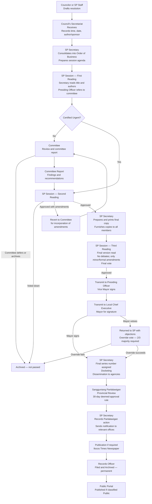
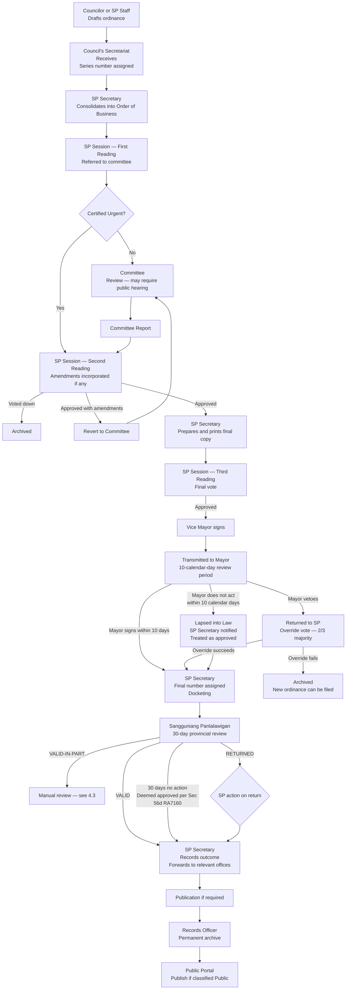

# Batac City LGU Platform — Consolidated Architecture & Requirements Reference

**Status:** Post-Interview 1 (June 9) | Pre-Development Baseline **Last Updated:** June 2026 **Audience:** Development team (internal reference)

---

## Document Notes

### Source Files Merged

|File|Role|
|---|---|
|`_architecture-review-and-discovery-focused.md`|Pre-interview architecture review, discovery checklists, educated guesses, resolved pre-decisions|
|`key_decisions_developer_reference.md`|Pre-interview developer key-decisions reference|
|`lgu-batac-interview-first-june-9-synthesis-complete.md`|Interview 1 synthesis (June 9) — confirmed findings and clarification questions|

**Note:** `gap-analysis-assumption-review-architecture-challenges.md` was listed as a source but was not present in the upload. Its content appears to be substantially integrated into the RESOLVED DECISIONS section of the architecture review document (sections 1.1–1.21 of that file), which is reflected in this merge.

### Merge Approach

- Pre-interview `[Inference]` items superseded by interview findings are replaced with confirmed facts.
- Architectural decisions not affected by interview findings are retained as-is.
- Items confirmed by interview are marked `[CONFIRMED]`.
- Items still inferred (not yet confirmed by stakeholders) retain `[Inference]` labels.
- Resolved Q-INT items from the interview synthesis are folded into the relevant sections.
- Unresolved or partially resolved Q-INT items are collected in **Part 14 — Remaining Open Questions**.

---

## Part 1 — Project Identity and Scope

|Decision|Detail|
|---|---|
|Platform name|Batac City LGU Platform|
|Platform type|LGU-wide government operations platform — not a narrow DMS|
|Target LGU|Batac City, Ilocos Norte, Philippines|
|LGU scope|SP Office, Mayor's Office, City Hall departments, Barangays, Citizens|
|Multi-LGU|Batac-specific for now; configuration documented for potential adaptation|
|Legal source of truth|Physical documents remain the legal source of truth|
|Operational source of truth|Digital system is the operational source of truth for tracking, workflow, reporting|

### Module Priority Order

|Priority|Module|Phase|
|---|---|---|
|1|Document Management System (DMS)|Phase 1|
|2|Document Tracking System (DTS)|Phase 1|
|3|Workflow Management System (WMS)|Phase 1 (engine; SP Resolution and SP Ordinance only)|
|4|Records Management System (RMS)|Phase 2|
|5|Government Portal|Phase 3|

---

## Part 2 — Phase 1 Scope Decision `[CONFIRMED]`

**Decision:** Phase 1 delivers SP Resolutions and SP Ordinances end-to-end. All other document types are deferred to Phase 1B or Phase 2.

**Basis:** Q-INT-04 resolved based on interview findings and stakeholder framing. The Records Officer's comment — _"The scope of the proposed system is so large yet"_ — and the stakeholder's primary value statement — _"Digitalization is just for convenience so that people do not have to go in person"_ — both point toward public access to legislative documents as the system's core Phase 1 value.

**Phase 1 Deliverables:**

- SP Resolution workflow (full legislative lifecycle including Mayor signature, veto override, Panlalawigan review)
- SP Ordinance workflow (same as Resolution + Mayor's 10-day lapse-into-law + veto override)
- Numbering series for both (preliminary at intake, final at release — see Part 5)
- QR code generation and tracking for both
- Panlalawigan review tracking with 30-day automated timer
- Public portal: approved resolutions and ordinances searchable and downloadable
- SP Secretary dashboard (queue, pending items, session calendar)
- Mayor dashboard (pending signatures, overdue items)
- Audit trail for all legislative steps
- RA 11032 (ARTA) SLA tracking for legislative processing

**Phase 1B Additions (deferred document types):**

Letters Received, Letters Sent, Memos Incoming, Memos Outgoing, Notices of Committee Hearing, Notices of Special Session, Designations, Barangay Resolutions, Citizen Complaints (transportation).

**Phase 1 Minimum Viable Core:**

1. IAM (users, roles, RBAC + office scoping, sessions)
2. Organization module (offices, positions, assignments — admin-managed)
3. Document Core (upload, version, classify, SP series numbering)
4. Workflow Engine (linear + branching + multi-committee referral; SP Resolution and Ordinance workflows)
5. Document Tracking (QR generation, basic cover sheet, routing history)
6. In-app notifications (step assignment, overdue alerts)
7. SP Secretary dashboard
8. Mayor dashboard
9. Audit log (append-only, hash-chained, INSERT-only DB permissions)
10. Infrastructure (PostgreSQL, S3-compatible, Docker, Terraform, backup)

**Scope confirmation required in next interview:** _"We are planning Phase 1 to deliver SP Resolutions and SP Ordinances with full legislative workflow, public portal access, and tracking. Letters, memos, and other document types would be added in Phase 1B or Phase 2. Does this scope match your expectation?"_

---

## Part 3 — Confirmed Stakeholders and Organizational Structure `[CONFIRMED from Interview 1]`

### 3.1 Mayor and Vice Mayor

|Role|Name|Prefix|
|---|---|---|
|Mayor (7th SP era)|Hon. Mark Christian R. Chua|MRC|
|Vice Mayor (Presiding Officer, 7th SP)|Hon. Albert D. Chua|ADC|

Note: The Vice Mayor and a previous Mayor share the surname Chua but are distinct individuals. The current Mayor's document prefix is MRC; the Vice Mayor's is ADC.

### 3.2 SP Members — 7th Sangguniang Panlungsod

|Name|Role|
|---|---|
|Hon. Kichel Jomarie G. Pungtilan|City Councilor|
|Hon. Eleuterio A. Salamangkit Jr.|City Councilor|
|Hon. Martha Louise Aurora M. Borleo|City Councilor|
|Hon. Gwyneth S. Quidang|City Councilor|
|Hon. John Gabrielle Dominique M. Daguio|City Councilor|
|Hon. Lucky Rene G. Bunye|City Councilor|
|Hon. Violeta Eugenia D. Nalupta|City Councilor|
|Hon. Macarthur A. Aguinaldo|City Councilor|
|Hon. Rizal P. Castillo|City Councilor|
|Hon. Juan Paulo P. Flojo|City Councilor|
|Hon. Gilbert O. Medina|ABC Representative|
|Hon. Reign Gwendia T. Mirasol|SK Representative|

**Voting threshold:** 12 members; half+1 required = **7 votes to pass**. No proxy voting. `[CONFIRMED]`

**Veto override threshold:** 2/3 majority = **8 of 12 members**. `[CONFIRMED]`

### 3.3 Office of the Secretary to the Sangguniang Panlungsod

|Name|Position|
|---|---|
|Gladys R. Lagura|SP Secretary|
|Mia Prima M. Mesina|Administrative Officer II — Ordinances & Resolutions Section|
|Ronald P. Beltran|Administrative Officer II — Franchise Section|
|Bonn Roger G. Rosales|Administrative Aide VI (Clerk III) — Administrative Section|
|Kathielyn R. Ilayat|Administrative Aide VI (Clerk III) — Administrative Section|
|Paul Josiah N. Chua|Administrative Aide VI (Clerk III) — Administrative Section|
|Joanne Marie Q. Macugay|Administrative Aide VI (Clerk III) — Franchise Section|
|Jeniffer S. Gaoiran|Administrative Aide VI (Clerk III) — Franchise Section|
|Antonia Elizabeth G. Yaplag|Administrative Aide VI (Clerk III) — Franchise Section|
|Florentino Pablo R. Lumang|Administrative Aide VI (Data Controller I) — Franchise Section|
|Ronell R. Purisima|Administrative Aide III (Utility Worker II)|
|Ramil F. Rante|Administrative Aide IV (Driver III)|
|Cherill S. Malicad|Librarian I — City Library|

### 3.4 Personal Staff of the Vice Mayor

|Name|Position|
|---|---|
|Jocelyn D. Villavicencio|Executive Assistant II|
|Tristan Melecia D. Advincula|Executive Assistant I|
|Artelyn B. Rupisan|Secretary I|
|Jay Carlo V. Ragudo|Driver II|

### 3.5 Sangguniang Panlalawigan Contact

**SP Secretary (Provincial Board):** Mildred Nirmla R. Lamoste — the confirmed recipient of SP documents transmitted for provincial review.

---

## Part 4 — Confirmed Document Types, Workflows, and Numbering

### 4.1 SP Resolution `[CONFIRMED AND AUGMENTED]`

**Confirmed numbering format:** `{SP_NUMBER}SP {YEAR}-{NN}` — e.g., `7SP 2025-35`, `7SP 2025-66`

**Numbering note:** A preliminary series number is assigned at intake/First Reading. A final series number is assigned at finalization (post-Mayor signature). These are described as different from each other. The exact nature of this distinction is unresolved — see Q-INT-01 in Part 14.

**Confirmed workflow (from official legislative process flowchart):**



**Key confirmed facts:**

- Third Reading is a distinct session step, not merged with Second Reading. No debates at Third Reading; only minor/formal amendments accepted.
- Mayor's signature is required for resolutions (confirmed by official flowchart). Whether the 10-day lapse-into-law rule applies to resolutions (vs. ordinances only) is **unresolved** — see Q-INT-14 residual in Part 14.
- Mayor can veto resolutions (confirmed by flowchart). Veto override: 2/3 majority (8 of 12).
- Certified Urgent measures bypass committee referral and go directly to Second Reading. Authorization rules are **unresolved** — see Q-INT-17 in Part 14.
- Both ordinances AND resolutions are transmitted to the Sangguniang Panlalawigan after Mayor signature. `[CONFIRMED]`
- Committee referral: most measures referred to **two committees simultaneously** (subject-matter committee + Committee on Laws). See Part 8.
- Final series number assigned after Mayor signature at docketing step.
- Publication in Ilocos Times: required for some ordinances/resolutions, not all. Which types require it is **unresolved** — see Q-INT-20 in Part 14.

---

### 4.2 SP Ordinance `[CONFIRMED AND AUGMENTED]`

**Confirmed numbering formats:**

| Ordinance Type          | Format                           | Example                                      |
| ----------------------- | -------------------------------- | -------------------------------------------- |
| Regular Ordinance       | `{SP_NUMBER}SP {YEAR}-{NN}`      | `7SP 2025-01`, `7SP 2025-08`                 |
| Appropriation Ordinance | Same as regular                  | `7SP 2025-02`                                |
| Franchise Ordinance     | `{SP_NUMBER}SP {SEQUENCE}-{YY}R` | `7SP 0001-26R` (continuous, year suffix + R) |

**Confirmed workflow:**



**Key confirmed facts:**

- Appropriation Ordinances follow the same workflow as regular ordinances. `[CONFIRMED]`
- Franchise Ordinances follow the same legislative workflow but use a completely separate numbering series. `[CONFIRMED]`
- Ordinance categories confirmed: Human Capital Development, Economic Transformation, Infrastructure Development, Climate and Disaster Resilience, Good Governance and Social Protection. `[CONFIRMED]`
- Mayor's 10-day lapse-into-law rule applies to Ordinances. The lapse-into-law rule for Resolutions is **unresolved** — see Part 14.
- Ordinance becomes effective immediately upon Mayor signature (or lapse into law); Panlalawigan review is post-implementation oversight, not a pre-implementation gate. `[CONFIRMED from Index of Ordinances sequence]`
- When Panlalawigan marks 30 days without action: _"Presumed consistent with law and therefore VALID pursuant to Section 56(d) of R.A. 7160"_ — this is the confirmed legal basis text used by the SP Secretariat. `[CONFIRMED]`

---

### 4.3 Sangguniang Panlalawigan Review `[CONFIRMED WITH FULL DETAIL]`

**Scope:** Both ordinances AND resolutions are transmitted. `[CONFIRMED from Ordinance/Resolution Sent log]`

**Sequence:** Transmission occurs AFTER Mayor signature (confirmed by Index of Ordinances field order: Date Approved by SP → Date Approved by LCE → Date Received by Higher Sanggunian).

**Log fields tracked by SP Secretariat:**

| Field                       | Detail                                                  |
| --------------------------- | ------------------------------------------------------- |
| Control No.                 | SP Secretariat's own sequence number (e.g., 2026-01)    |
| Date Received               | When the Panlalawigan's response was received back      |
| SP Reso. No.                | Panlalawigan's own resolution number (e.g., R2026-0841) |
| Subject                     | Which SP document(s) were reviewed                      |
| Date Approved / Disapproved | From the Panlalawigan                                   |
| Date Referred               | Date Panlalawigan sent to their own committee           |
| Remarks                     | Outcome and notes                                       |

**Outcome types confirmed:**

| Outcome                     | Meaning                                                                                                 |
| --------------------------- | ------------------------------------------------------------------------------------------------------- |
| VALID                       | Approved by Panlalawigan                                                                                |
| VALID-IN-PART               | Partially approved; some provisions found invalid                                                       |
| RETURNED                    | Returned with objections (treated as disapproved)                                                       |
| Referred to committee       | Panlalawigan committee review in progress; 30-day clock running                                         |
| Operative-in-its-entirety   | Used specifically for Appropriation Ordinances                                                          |
| _(blank — 30 days elapsed)_ | Deemed approved per Section 56(d) of R.A. 7160; recorded in Remarks as the statutory legal basis phrase |

**Multiple documents per batch:** The Panlalawigan frequently acts on multiple SP documents in one resolution. `[CONFIRMED from review log]`

**Feedback loop:** When Panlalawigan acts, SP Secretariat records the action and forwards notification to relevant offices (e.g., CPDO, Budget Office, City Engineer). `[CONFIRMED from Letters Sent log]`

**System behavior decisions:**

- **30-day timer:** The system automatically tracks the 30-day SLA from transmission date. At day 30 with no response, the system transitions status to "Deemed Approved per RA 7160 Section 56(d)" and notifies the SP Secretary, who confirms the transition. No manual date tracking.
- **VALID-IN-PART handling:** Not auto-routed. System marks the ordinance VALID-IN-PART, attaches the Panlalawigan's response, and places the step in an "Awaiting SP Secretariat Action" state. SP Secretary chooses one of three explicit next actions: (1) Resolve as-is with mandatory comment; (2) Route to Legal Office for written opinion; (3) Route back to committee for re-draft and re-vote on invalid provisions. Whether re-voting on invalid provisions is the SP's actual practice requires confirmation — see Part 14.
- **RETURNED handling:** System flags as high-priority alert requiring immediate City Legal Office and Mayor coordination. Step placed in manual review state.

---

### 4.4 Barangay Resolution `[CONFIRMED]`

| Step | Actor                         | Notes                                   |
| ---- | ----------------------------- | --------------------------------------- |
| 1    | Barangay                      | Submits to SP Secretariat physically    |
| 2    | Secretariat / Records Officer | Logs; attaches QR code                  |
| 3    | SP Session                    | First Reading                           |
| 4    | Vice Mayor                    | Refers to committee                     |
| 5    | Committee                     | Reviews; produces committee report      |
| 6    | Secretariat                   | Finalizes; assigns series number        |
| 7    | Secretariat                   | Returns decision to barangay physically |
| —    | System                        | Status notification sent to barangay    |

**Phase 1 note:** Barangay officials have no system access in Phase 1. Secretariat logs their physically submitted documents on their behalf. `[CONFIRMED from Q-INT-08]`

---

### 4.5 Barangay Budget `[CONFIRMED — introduces parallel steps]`

Referred simultaneously to multiple offices for preliminary review. **This is the only confirmed workflow in Phase 1 scope requiring parallel step execution.**

|Step|Actor|Notes|
|---|---|---|
|1|Barangay|Submits to SP Secretariat|
|2|SP Session|First Reading|
|3|Local Finance Committee; Budget Office; Treasury Office; CPDO|**Parallel preliminary review** (all simultaneously)|
|4|Secretariat|Waits for all preliminary reviews to complete|
|5|Referred committee|Produces committee report|
|6|Secretariat|Assigns series number; SP votes|
|7|Secretariat|Returns decision to barangay physically|

**Note:** This workflow confirms a genuine parallel split/join requirement. While the pre-development decision deferred parallel steps to Phase 2, barangay budgets are an early operational reality. See Part 8 for the multi-committee referral finding and its relationship to this requirement.

---

### 4.6 Internal Memo (Outgoing) `[CONFIRMED]`

**Confirmed numbering format:** `{YEAR}-{NN}` — e.g., `2025-01`, `2025-04` (sequential within year; separate counter from Letters Received)

| Field          | Detail                                                                                                                        |
| -------------- | ----------------------------------------------------------------------------------------------------------------------------- |
| Initiator      | Vice Mayor or SP Secretary                                                                                                    |
| Memo number    | Assigned from originating authority (e.g., `VM ADC Memo No. 2025-01`) — fixed and immutable                                   |
| Control number | SP Secretariat's own sequential number — assigned after finalization                                                          |
| Signatories    | Vice Mayor                                                                                                                    |
| Flow           | VM issues memo → SP Secretary receives → QR generated → Disseminated physically to SP Members and other recipients → Archived |

**Dual number system:** Memo number (originating authority's own reference) + control number (secretariat's internal reference). These are distinct identifiers on the same document.

---

### 4.7 Memo Incoming `[CONFIRMED]`

**Confirmed numbering format:** `{YEAR}-{NN}` — separate counter from Letters Received and from Memos Outgoing

**Sources:** Mayor's Office (Memorandum Circulars with prefix MRC); other internal LGU offices.

**Distinguishing rule:** Memos Incoming = formal memos from the Mayor's Office or internal LGU departments. Letters Received = all other incoming correspondence (external sources, citizens, provincial board, etc.). The originating source and document form determine the classification, not purely content. `[Confirmed by documentary evidence]`

|Field|Detail|
|---|---|
|Log fields|Control No.; Date Received; Origin (including the sender's own reference number, e.g., "MRC Memo Circ. No. 2025-001"); Subject|

---

### 4.8 Letters Received `[CONFIRMED]`

**Confirmed numbering format:** `{YEAR}-{NN}` — e.g., `2026-01` through `2026-98`. **Resets to 01 each year.** Separate counter from Letters Sent.

**Volume confirmed:** ~38 letters/month to SP Secretariat alone (Q1 2026 sample).

**Confirmed senders:** DILG-Batac, other city departments, barangay officials, provincial board members, universities (MMSU), private organizations, citizens.

**Key finding from logs:** Control numbers are not always assigned immediately at receipt. Some entries show "2026-" with no sequence number filled, then later entries are numbered. **Numbers are assigned as a deferred operation** after secretariat processing (e.g., after Vice Mayor review and routing decision). `[CONFIRMED from scanned logs]`

**Control number immutability rule confirmed:** Control numbers are immutable once assigned. A mistake requires deleting the entire row and creating a new one — the number is not edited in place.

|Field|Detail|
|---|---|
|Flow|Received by secretariat → QR attached → Given to Vice Mayor (adds notes/routing instructions) → Returned to secretariat → Action taken → Disseminated → Archived|

**Vice Mayor review scope:** Not every letter necessarily requires VM review. The workflow supports conditional branching where routine items are routed directly to the action queue. When the VM is absent, a formally designated Acting VM (SP Member) handles the queue. `[Confirmed from Q-INT-07 resolution; full routing rules to be confirmed in next interview]`

---

### 4.9 Letters Sent `[CONFIRMED]`

**Confirmed numbering format:** `{YEAR}-{NN}` — e.g., `2026-01` through `2026-36` in Q1 2026. **Separate counter from Letters Received.**

**Confirmed:** The same control number (e.g., 2026-07) can appear in both the Letters Received and Letters Sent logs without ambiguity. They are different documents in different sequences.

|Field|Detail|
|---|---|
|Initiator|Vice Mayor or SP Secretary|
|Signatories|SP Secretary and Vice Mayor|
|Flow|Secretariat creates → QR attached → Signed → Disseminated → Archived (receiving copies retained)|
|Content types|Forwarding committee reports; transmitting Panlalawigan action; session invitations; forwarding ordinances/resolutions to external parties|

**Operational note:** Letters Sent include formal forwarding of committee reports on transportation complaints to both complainants and respondents. This is systematic; the system must support this routing pattern.

---

### 4.10 Notice of Committee Hearing `[CONFIRMED]`

**Confirmed numbering format:** `NCH {YEAR}-{NN}` — e.g., `NCH 2025-03` through `NCH 2025-33`

| Field                           | Detail                                                                                                                          |
| ------------------------------- | ------------------------------------------------------------------------------------------------------------------------------- |
| Signatories                     | SP Secretary and Vice Mayor                                                                                                     |
| Multiple recipients per notice  | Confirmed — a single NCH can go to multiple parties (committee members + external stakeholders)                                 |
| Multiple committees co-notified | Confirmed — some hearings involve two or more committees simultaneously (e.g., Committee on Transportation + Committee on Laws) |

---

### 4.11 Notice of Special Session `[CONFIRMED with numbering ambiguity]`

**Numbering format:** Currently appears to use the `NCH {YEAR}-{NN}` prefix (shared with Committee Hearing notices), but a separate `NOSP` prefix was used briefly in 2023. Current convention confirmation is required — see Q-INT-21 in Part 14.

|Field|Detail|
|---|---|
|Purpose|Urgent notification that a special session is happening|
|Log fields|Control No.; Date Sent; Session No. (ordinal, date, time); Subject|
|Signatories|SP Secretary and Vice Mayor|

---

### 4.12 Designation `[CONFIRMED — system-level authority implications]`

**Confirmed numbering format:** `D {YEAR}-{NN}` — e.g., `D 2024-01` through `D 2024-19`

**Dual number system confirmed:** Each Designation has two numbers — the originating authority's own memo/order number AND the SP Secretariat's control number (D format).

**Confirmed examples:** Vice Mayor designated as Acting Mayor during Mayor's travel; Administrative Officer II designated as OIC of SP Secretariat; SP Member designated as Acting Vice Mayor.

**High-frequency operation confirmed:** 10+ separate designations of the Vice Mayor as Acting Mayor in 2023–2024 alone. This is routine and high-frequency — not an edge case.

|Field|Detail|
|---|---|
|Origin|Mayor's Office (for Mayor-level designations) or Vice Mayor's Office (for VP-level designations)|
|SP role|Intake and logging only; does not create or authorize|
|Signatories|Mayor or Vice Mayor (per scope of designation)|

**System-level authority transfer decision:**

When a Designation is logged, the system creates a `delegation_grant` record with time-bound scope. All workflow steps that would normally route to the original authority are automatically reassigned to the designated person for the duration. The delegation expires automatically at the end date. Confirmation of the delegation scope is a **manual step** by the Platform Administrator (not auto-parsed from the document) to prevent erroneous authority transfers.

**Confirmed constraints:** Delegations must always be time-bound with explicit start and end dates. Whether the same person can hold multiple simultaneous active delegations is **unresolved** — see Q-INT-22 in Part 14.

---

### 4.13 Administrative Cases `[CONFIRMED — confidential]`

Complaints against officials (mostly barangay officials). Processed by the SP Secretariat. **Access restricted to the Legislative branch only.** No generally confidential records in routine SP operations outside this category. `[CONFIRMED]`

---

### 4.14 Citizen Complaint — Transportation `[CONFIRMED]`

Specific to transportation complaints (tricycle operators) addressed to the Sangguniang Panlungsod. Processed through Committee on Transportation (co-referred with Committee on Laws).

**Confirmed form fields:** Violation type (overcharging, trip cutting, refused to convey, discourtesy, others), tricycle number, date and time, place, remarks, complainant name/address/contact.

**Process:** Committee renders report. SP Secretariat sends report to both complainant and respondent via Letters Sent. `[CONFIRMED from Letters Sent log entries]`

---

### 4.15 Document and Records Request Form `[CONFIRMED]`

Fee-based process for copies of SP documents. Approval requires both Vice Mayor AND SP Secretary signature.

**Confirmed fields:** Document type, title, number of pages, requester name/agency, date, email, ID presented, purpose, payment (Secretary's Fees under Ordinance No. 3SP 2014-05), OR number, collecting officer.

**QR code on form:** Confirmed. Website reference: sp.batac.gov.ph (currently down — see Part 7.4).

**Paid copy request / Land Bank integration:** Deferred to a later phase. Phase 1 does not include active payment integration. `[CONFIRMED from Q-INT-12]`

**Public portal design:** First page of uploaded documents visible publicly; body is blurred. Title only shown in public listings. `[CONFIRMED]`

---

### 4.16 Documents Removed from Phase 1 Scope

|Document Type|Status|
|---|---|
|Executive Orders|Removed from scope entirely (per stakeholder)|
|Purchase Requests|Not part of the system (per stakeholder)|
|Session Minutes|Not a standalone document type; treated as an attachment or sub-document to the session record. No separate control number assigned. Assumed approved/trusted without a separate certification workflow. `[CONFIRMED Q-INT-06]`|

---

## Part 5 — Numbering System `[CONFIRMED from documentary evidence]`

### 5.1 Confirmed Number Formats

|Document Type|Format|Example|Counter Scope|
|---|---|---|---|
|Ordinance|`{SP_NUMBER}SP {YEAR}-{NN}`|`7SP 2025-01`|Per year; resets|
|Appropriation Ordinance|Same as Ordinance|`7SP 2025-02`|Per year; resets|
|Franchise Ordinance|`{SP_NUMBER}SP {SEQUENCE}-{YY}R`|`7SP 0001-26R`|Continuous (does not reset yearly)|
|Resolution|`{SP_NUMBER}SP {YEAR}-{NN}`|`7SP 2025-35`, `7SP 2025-66`|Per year; resets|
|Notice of Committee Hearing|`NCH {YEAR}-{NN}`|`NCH 2025-03`|Per year; resets; separate from other types|
|Notice of Special Session|`NCH {YEAR}-{NN}` or `NOSP {YEAR}-{NN}`|—|See Q-INT-21|
|Designation|`D {YEAR}-{NN}`|`D 2024-01`|Per year; resets|
|Letters Received|`{YEAR}-{NN}`|`2026-01`|Per year; resets; **separate from Letters Sent**|
|Letters Sent|`{YEAR}-{NN}`|`2026-01`|Per year; resets; **separate from Letters Received**|
|Memo Outgoing|`{YEAR}-{NN}`|`2025-01`|Per year; resets; **separate from Memo Incoming**|
|Memo Incoming|`{YEAR}-{NN}`|`2025-26`|Per year; resets; **separate from Memo Outgoing**|
|Sangguniang Panlalawigan Review (SP's log)|`{YEAR}-{NN}`|`2026-01`|Per year; resets|
|Panlalawigan's own reference|`R{YEAR}-{NNNN}`|`R2026-0841`|Panlalawigan-assigned; system stores as metadata|

**`{SP_NUMBER}`** = The ordinal SP (currently 7th SP → prefix "7"). This changes with each administration.

### 5.2 Numbering Architecture Decisions

|Rule|Decision|
|---|---|
|Counters|Separate PostgreSQL sequence per document type per year — no shared counter|
|Assignment event|Official series number assigned ONLY at the defined lifecycle event (approval/certification step), never at draft creation|
|Deferred assignment|Control numbers may not be assigned immediately at receipt — nullable `control_number` fields supported; assignment is a distinct recorded action|
|Immutability|Control numbers are immutable once assigned. A mistake requires row deletion and re-creation, not edit|
|Gaps|Permitted only for cancelled documents; each gap logged with cancellation reason|
|Reuse|Numbers are never reused, even if the document is cancelled|
|Preliminary vs. final series number|Preliminary number assigned at first intake; final number assigned at release (post-Mayor signature). The exact nature of the distinction between these identifiers requires confirmation — see Q-INT-01 in Part 14|
|QR tracking number|A separate system-generated UUID, independent of both series numbers and control numbers. Assigned at secretariat formal intake (first workflow action). Immutable for the document's life. See Part 11.6|
|Franchise ordinances|Separate `number_series` record with continuous (non-resetting) counter. "R" suffix hardcoded in series format|

### 5.3 Index of Ordinances — Tracked Fields `[CONFIRMED]`

The Index of Ordinances is an active operational record used by the SP Secretary for every ordinance, not only a reports output. All these fields must be tracked by the system:

|Field|Notes|
|---|---|
|Title of Ordinance|Full title text|
|Authored By|All co-authors (VM + Councilors)|
|Introduced By|Subset of authors who formally introduced|
|General Subject Matter|Category|
|Specific Subject Matter|Subcategory|
|Date Approved by SP|Third Reading vote date|
|Date Approved by LCE|Mayor's signature date|
|Date Received by Higher Sanggunian|Date sent to Panlalawigan|
|Sangguniang Panlalawigan Action Taken|Outcome code + Panlalawigan resolution number + date|
|Remarks / Post Review Action of SP|Notes on any corrections or follow-up action|
|Publication|Newspaper name + date (if required)|

---

## Part 6 — Standing Committees — 7th SP `[CONFIRMED]`

**22 standing committees confirmed.** Committee membership changes with each administration.

|Committee|Chairman|Vice Chairman|Member|
|---|---|---|---|
|Laws, Rules, Ethics & Privileges|Flojo|Daguio|Borleo|
|Peace & Order, Public Safety & Dangerous Drugs|Aguinaldo|Flojo|Salamangkit|
|Social Welfare Development, Public Service & Calamities|Pungtilan|Salamangkit|Daguio|
|Education, Culture, Science & Technology|Daguio|Pungtilan|Mirasol|
|Health and Sanitation & Public Welfare|Borleo|Daguio|Mirasol|
|Appropriations & Finance, Ways and Means|Borleo|Daguio|Salamangkit|
|Human Rights & CSOs|Quidang|Bunye|Flojo|
|Special Projects & Corporate Affairs|Aguinaldo|Borleo|Nalupta|
|Barangay Affairs|Medina|Salamangkit|Castillo|
|Transportation and Communication|Medina|Aguinaldo|Pungtilan|
|Tourism & Public Information|Daguio|Salamangkit|Borleo|
|Games and Amusements|Mirasol|Flojo|Quidang|
|Senior Citizens & NGOs|Castillo|Pungtilan|Aguinaldo|
|Economic Enterprise, Market & Slaughterhouse|Flojo|Aguinaldo|Pungtilan|
|Landed Estates & Assessments|Nalupta|Quidang|Daguio|
|Good Government / Public Ethics & Accountability|Bunye|Nalupta|Flojo|
|Public Works, Infrastructure, Housing & Urban Development|Salamangkit|Medina|Aguinaldo|
|Agriculture, Food, Cooperatives and Livelihood|Salamangkit|Pungtilan|Mirasol|
|Environment, Natural Resources, Climate Change, Water & Energy|Salamangkit|Castillo|Medina|
|Trade, Commerce & Industry|Aguinaldo|Salamangkit|Bunye|
|Women, Children, Family Relations & Indigenous Peoples|Pungtilan|Borleo|Flojo|
|Labor, Employment & Civil Service|Flojo|Mirasol|Borleo|
|Youth & Sports Development|Mirasol|Daguio|Pungtilan|

**Key architectural implications confirmed:**

- Most measures are referred to **two committees simultaneously** — the subject-matter committee plus the Committee on Laws. This is standard practice, not a special case. See Part 8 for the full architectural implication.
- The Committee on Laws appears on nearly every Notice of Committee Hearing — it is effectively a co-reviewer by default.
- Each Councilor sits on 4–6 committees. Notification and inbox logic must handle overlapping committee membership without duplicating workflow steps.

---

## Part 7 — Confirmed Operational Context

### 7.1 Primary Stakeholder Value Statement `[CONFIRMED]`

Stakeholder framing recorded: _"Digitalization is just for convenience so that people do not have to go in person."_

This frames the system's primary stakeholder-perceived value as **public access and document status transparency**, not internal workflow automation. Phase 1 prioritization and external communications should reflect this. The public portal publishing component — even if technically secondary to the workflow engine — is the value statement the stakeholders lead with.

### 7.2 Session Patterns and Physical Workflow `[CONFIRMED]`

- Up to **three hearings per day** possible.
- Average **five hearings per week**.
- During hearings, participants read **physical documents** (not digital). The system does not displace physical distribution during sessions in Phase 1.

### 7.3 Confirmed Document Volumes

|Document Type|Volume|Period|Source|
|---|---|---|---|
|Letters Received|~38/month|2026|Letters Received log (2026-01 to 2026-98, Jan–Mar 2026)|
|Letters Sent|~12/month|Q1 2026|Letters Sent log (2026-01 to 2026-36)|
|Memo Outgoing|~2/month|Jul–Sep 2025|Memo Outgoing log (2025-01 to 2025-04)|
|Memo Incoming|~1/month|Jul–Sep 2025|Memo Incoming log (2025-26 to 2025-28)|
|Notice of Committee Hearing|~3–4/month|2025|NCH log (2025-03 to 2025-33, Jul–Dec 2025)|
|Ordinances|~1–2/month|2025–2026|Panlalawigan sent log|
|Designations|~1–2/month|2024|Designation log (D 2024-01 to D 2024-19)|

These are small volumes by commercial software standards but meaningful for the SP Secretariat's daily workload. Historical records migration will add significantly to storage requirements.

### 7.4 Current Systems and Migration Context `[CONFIRMED]`

|Item|Status|
|---|---|
|Previous digital system|LMITS (Legislative Management and Information Tracking System)|
|LMITS managed by|CPDO (not SP Secretariat or IT Office)|
|LMITS hosted at|batac.gov.ph|
|LMITS stored|Document titles only|
|Subscription status|**Ended — system is down**|
|Data migration|**Required** — LMITS migration scope partially unresolved (see Q-INT-16 in Part 14)|
|Current Records Officer tooling|MS Word with keyword search for records|
|Physical records|Not yet uploaded into any system|
|SP website|sp.batac.gov.ph — confirmed active (referenced on Document and Records Request Form), currently down because subscription ended|
|Relationship to new system|Exists alongside sp.batac.gov.ph for now (new system does not replace it); co-existence strategy TBD|
|sp.batac.gov.ph content|Titles and first-page preview of documents. Data that can be easily generated from source documents does not need migration. Decision deferred.|

**Records Officer current tools:** MS Word with keyword search. Physical records are not yet in any digital system. Full-text search across all documents is desired. All documents should be OCR-processed. OCR processing policy (automatic vs. manual, historical vs. new-only) is **unresolved** — see Q-INT-11 in Part 14.

---

## Part 8 — Key Architectural Finding: Multi-Committee Referral `[CONFIRMED — requires immediate design decision]`

### 8.1 The Finding

Most SP measures are referred to **two committees simultaneously**: the relevant subject-matter committee AND the Committee on Laws. This is standard practice confirmed by the Notice of Committee Hearing log (nearly every NCH shows two committees co-notified). It is not a special case — it is the default.

The Barangay Budget workflow (Part 4.5) also confirms a parallel step where four offices review simultaneously.

### 8.2 Conflict with Pre-Development Decision

The pre-development key decisions document specified: _"Parallel steps NOT included in Phase 1."_

The interview findings reveal that parallel referral is a **default workflow feature** — deferring it to Phase 2 means the SP Resolution and Ordinance workflows in Phase 1 cannot accurately model the actual legislative process.

### 8.3 Decision Required Before Phase 1 Development Starts

Three options:

**Option A — Model multi-committee referral as sequential steps (inaccurate)**

- Assign to Subject Committee → complete → assign to Committee on Laws → complete
- Con: Misrepresents the actual process; committee reports may need to be simultaneous

**Option B — Single "multi-committee referral" step with multiple assignees**

- One workflow step that assigns to multiple committees simultaneously
- Each committee produces a report; step completes when all assigned committees have submitted reports (or SP Secretary manually marks step complete)
- This is simpler than full parallel split/join but handles the core use case
- Pro: Avoids full parallel split/join complexity; accurate to the practice
- Con: Requires multi-assignee workflow step type (not a single-user approval step)

**Option C — Implement parallel split/join in Phase 1 for committee referral only**

- Full parallel split/join, scoped only to the committee referral step
- Pro: Architecturally complete; matches the data model reserved for Phase 2
- Con: Adds significant Phase 1 engineering complexity (the data model already reserves the step types; the execution engine would need to be built earlier)

**Recommendation:** Option B. Model committee referral as a distinct multi-assignee step type. The data model should support a `referral_step` with a list of assigned committees; the step completes when all committee reports are submitted and accepted by the SP Secretary. This does not require full parallel split/join engine implementation. The workflow engine's `parallel_split` and `parallel_join` step types remain reserved for Phase 2 but are not blocked by Option B.

**This decision must be made before the workflow engine schema is designed.**

---

## Part 9 — Technology Stack

No changes from pre-development reference. Stack decisions are confirmed and unchanged.

|Layer|Choice|Constraint|
|---|---|---|
|Backend framework|Fastify|Schema-first routes; plugin scope enforces module encapsulation|
|Internal API|tRPC on Fastify|End-to-end type safety for `/web` — no REST for internal routes|
|External/public API|Fastify REST + OpenAPI (`@fastify/swagger`)|Required for portal, mobile, third-party, or non-TS clients|
|Internal frontend|Vite + React SPA|No SSR; fully authenticated — SSR adds zero value|
|Public portal|Next.js (Phase 3)|SSG for SEO on citizen-facing document lookups|
|Database|PostgreSQL|JSONB, Row-Level Security, append-only audit grants|
|ORM|Drizzle ORM + Drizzle Kit|Full PostgreSQL feature access with TypeScript inference|
|Validation / contracts|Zod (shared package)|Single source of truth: backend, DB types, frontend forms|
|Server state (frontend)|TanStack Query|Cache invalidation, background refetch, optimistic updates|
|UI state (frontend)|Zustand|Modals, sidebar, multi-step form state|
|Component library|shadcn/ui + Radix UI primitives|Owned source code; accessible by default|
|Search|PostgreSQL FTS Phase 1; Meilisearch Phase 2+|Typo tolerance for Filipino names; Phase 1: tsvector/tsquery|
|Real-time notifications|Server-Sent Events (SSE)|One-directional push|
|File storage|S3-compatible (streamed)|Files never touch disk; app stays stateless|
|Logging|Pino + pino-http|Structured JSON|
|Error tracking|Sentry|Unhandled exceptions unacceptable in production from day one|
|Testing|Vitest (unit/integration) + Playwright (E2E)||
|Email|Nodemailer + @react-email/components|Works with any SMTP including LGU mail server|
|Auth pattern|Short-lived JWT + server-side refresh tokens + HTTP-only cookies|Never localStorage|
|Password hashing|Argon2id|OWASP recommendation|
|PDF generation|@react-pdf/renderer (templates) + pdf-lib (stamping)||
|QR codes|`qrcode` (server) + `html5-qrcode` or `zxing-wasm` (frontend scanner)||
|Forms|React Hook Form + `@hookform/resolvers/zod`|Validates against shared Zod schemas|
|i18n|i18next + react-i18next|Filipino, English, Ilocano|
|Rich text|Tiptap|Comments and annotations|
|Data tables|TanStack Table||
|Charts|Recharts|Dashboard panels|
|PDF viewer|react-pdf|In-browser rendering|
|Date/time|date-fns|Never moment.js|
|Scheduling|node-cron (simple) + pgboss (durable)||
|Rate limiting|@fastify/rate-limit|Auth and portal endpoints|
|CORS|@fastify/cors|Strict origin allowlist|
|Security headers|@fastify/helmet||

**Monorepo structure:**

```
/apps
  /web        — Vite + React SPA (internal authenticated app)
  /server     — Fastify backend (tRPC + REST routes, single process)
  /portal     — Next.js (public citizen portal — Phase 3 only)

/packages
  /shared     — Zod schemas, TypeScript types, API contracts, constants
  /ui         — Shared React component library (shadcn/ui + Tailwind)
  /config     — Shared ESLint, TypeScript, Prettier, tsconfig
  /database   — Drizzle schema, migrations, query helpers, seed data

/tools
  /scripts    — Deployment, DB seeding, maintenance, migration scripts
```

**Package manager:** pnpm workspaces. **Build orchestration:** Turborepo.

---

## Part 10 — Architecture Pattern and Module Boundaries

### 10.1 Pattern: Modular Monolith with Internal Event Bus

Microservices at 100–250 users with a 4-person team is an operational anti-pattern. The modular monolith gives clean domain separation with an extraction path to services if needed. The internal in-process event bus decouples modules without distributed systems overhead.

### 10.2 Module Boundaries

Each module owns its own PostgreSQL schema. Modules communicate only through the internal event bus or published module API interfaces. No module reads another module's schema directly. No cross-schema foreign key constraints.

```
Modules:
  iam           → users, credentials, sessions, roles, permissions
  organization  → offices, positions, employees, assignments, delegations
  documents     → document types, documents, versions, attachments, numbers, signatures
  workflow      → definitions, versions, steps, instances, step instances, events
  tracking      → tracking records, routing entries, QR codes
  records       → records, retention schedules, archive entries, classification
  notifications → templates, events, delivery logs
  audit         → events (append-only, hash-chained)
  search_meta   → search index metadata (Phase 2)
  portal        → public documents, citizen requests, complaints, announcements (Phase 3)
  reporting     → report definitions, schedules, outputs (Phase 2)
```

### 10.3 Architectural Laws (Non-Negotiable)

1. Each module owns its own PostgreSQL schema. No cross-schema foreign key constraints.
2. Modules communicate through the event bus or published module APIs only. Never by direct schema access.
3. Audit writes go through the audit service only. No module writes directly to the audit schema.
4. All file references are UUID storage keys. Never original filenames.
5. All infrastructure is defined in code. No manual cloud resource creation.

### 10.4 Multi-Committee Referral Implication

The `workflow` module's step type for committee referral must support a list of assigned committee roles (not a single assignee). The data model already reserves `parallel_split` and `parallel_join` step types for Phase 2. The Phase 1 solution (Option B from Part 8) requires a `multi_referral` step type or an extension of the `action` step type to support multiple concurrent assignees. This is a schema decision to make before the first workflow module migration.

---

## Part 11 — Key Design Decisions (Consolidated)

### 11.1 Authentication and Non-Repudiation

**Digital signatures:**

- Scanned signature images stored with audit trail
- Physical originals retained as legal source of truth
- LGU documents, in writing, that scanned signatures provide authentication but not cryptographic non-repudiation
- Both IT Director and Mayor must sign written acceptance before Phase 1 start
- PKI infrastructure upgrade path kept open for post-Phase-1

**MFA architecture:** Designed from day one; TOTP not enabled in Phase 1 but auth flow accommodates it. TOTP required in Phase 2 for Mayor, SP Secretary, Department Heads, Platform Administrator, IT Admin.

**Token architecture:**

|Decision|Value|
|---|---|
|Access token|JWT, 15–60 minutes|
|Refresh token storage|Server-side database (hashed value)|
|Cookie attributes|HTTP-only, Secure, SameSite=Strict|
|Client-side storage|Never localStorage or sessionStorage|

---

### 11.2 Infrastructure and Cloud Agnosticism

- All architecture is cloud-agnostic from day one
- LGU migration to on-premise infrastructure is a near-certainty within the 10+ year lifespan
- No cloud-provider-specific services; containerization and vendor-neutral APIs required
- Codebase is Batac-specific; configuration documented for potential future adaptation
- Docker + Terraform (or Pulumi) IaC from day one

**Device infrastructure confirmed:**

|Location|OS|Internet|Offline Tolerance|
|---|---|---|---|
|City Hall|Windows 11|Always-on with backup generator|30+ minutes acceptable|
|Barangays|Windows 11 (dedicated) + personal phones|Some reliable, some intermittent|Offline capability needed|

---

### 11.3 Workflow Engine

**Implementation:** Custom domain-specific engine. Not Camunda, Temporal, or Flowable. Admin-configurable without developer involvement.

**Phase 1 step types:**

|Type|Description|Phase|
|---|---|---|
|action|User performs an action (review, comment)|Phase 1|
|approval|User approves, rejects, or returns for revision|Phase 1|
|multi_referral|Assigns to multiple committees simultaneously; completes when all reports submitted|Phase 1 (required by multi-committee finding — see Part 8)|
|decision|System evaluates a condition; routes accordingly|Phase 1|
|notification|System sends a notification; no user action required|Phase 1|
|termination|Ends the workflow|Phase 1|
|parallel_split|Splits into parallel branches|Phase 2 (reserved in data model)|
|parallel_join|Merges parallel branches|Phase 2 (reserved in data model)|

**Version pinning:** Instance pins to definition version active at creation. DB-enforced. In-flight migration requires Option A (continue under old version) or Option B (admin migrates, 2nd-level approval from City Administrator required, mandatory reason, 24-hour reversible window, dedicated audit event recording pre/post state).

**Parallel steps:** Not generally in Phase 1. Exception: multi-committee referral (Option B from Part 8). Barangay Budget parallel review (4 offices simultaneously) may require Phase 2 parallel split/join.

**SLA and escalation:**

- SLA clock starts at workflow initiation
- Warning at 80% of SLA time
- Automatic escalation at breach: notify supervisor + Records Officer
- ARTA defaults: simple ≤ 3 working days; complex ≤ 7 working days; highly technical ≤ 20 working days
- A system outage does not suspend ARTA obligations

**Hardcoded workflow constraints (legally mandated minimum steps):**

|Document Type|Minimum Required Steps|
|---|---|
|SP Ordinance|Committee referral, 3 readings, vote, VP certification, Mayor review, release|
|SP Resolution|Committee referral (or certified urgent path), vote, VP certification, Mayor signature, release|
|Executive Order (Phase 2+)|Legal review, Mayor signature, release|

**Mayor's 10-day lapse-into-law:** Automatic timer for SP Ordinances. Whether this applies to SP Resolutions is **unresolved** — see Part 14. If Mayor does not act within 10 calendar days on an ordinance, system automatically transitions to "Lapsed into Law" status, logs with RA 7160 Section 47 as legal basis, and notifies SP Secretary.

**Certified Urgent path:** Exists in the official workflow (bypasses committee referral, goes directly to Second Reading). Phase 1 conservative implementation: record the flag in the data model but keep committee referral mandatory for all measures. Branching logic that skips committee referral is Phase 1B, after authorization rules are confirmed in the next interview. See Q-INT-17 in Part 14.

**Administration transitions:** In-flight documents continue under the new administration. Office-level step assignee fallback rules reassign to the new Mayor's account when it becomes active. New Mayor sees document in their inbox with an optional "Inherited from prior administration" label. No automatic cancellation or hold.

---

### 11.4 Document Management

**Lifecycle states:**

```
Draft → Submitted → In-Workflow → Pending Approval → Completed → Released → Archived → Disposed
```

Cancelled is a terminal state reachable from any active state by an authorized actor.

**Classification levels:**

|Level|Access|
|---|---|
|Public|All users + public portal|
|Internal|Authenticated LGU employees|
|Confidential|Restricted to explicit role allowlist (e.g., Administrative Cases)|
|Restricted|Restricted to explicit role allowlist|

**Versioning:** All previous versions retained. No overwrite. No permanent deletion by any user or role.

**Physical-to-digital correspondence:** When a physical document is printed, wet-ink signed, and scanned back, the system flags the scanned image for manual verification by a Records Officer before acceptance as the official copy.

**Cover sheet / QR code:** Separate cover page (not overlaid), auto-generated on print. Contains: tracking number, QR code, document type, author, date, approvers, retention schedule. Metadata fields customizable per document type.

**Bulk operations (Records Officers only):** Bulk archive, bulk search, bulk export. Required safety guards: confirmation dialog + dry-run preview. Each item individually logged in audit. No bulk-delete permitted. Bulk exports limited by classification level.

**OCR:** Full-text search across all documents is desired. All documents should be OCR-processed. OCR processing policy is **unresolved** — see Q-INT-11 in Part 14.

---

### 11.5 Document Numbering

|Decision|Value|
|---|---|
|Assignment event|At the defined lifecycle event (approval/certification) only — never at draft creation|
|Uniqueness|DB unique constraint: series + year + number|
|Gaps|Permitted only for cancelled documents; gap logged with cancellation reason|
|Year prefix|Both options available per series: yearly (2026-001) or continuous (001, 002, ...)|
|Series ownership|Office-owned (configurable "Series Authority" per series)|
|Number immutability|Assigned numbers are immutable — no editing by any user or role|
|Reuse|Never, even if document is cancelled|
|Counters|Separate PostgreSQL sequence per document type — no shared counter|
|Preliminary number|Assigned at intake (first workflow action). See Q-INT-01 in Part 14 for the unresolved distinction from the final number|

---

### 11.6 Document Tracking (DTS)

|Decision|Value|
|---|---|
|QR content|Unique tracking ID only (not a URL, not document content)|
|Tracking number format|Configurable; default: `DTS-{YEAR}-{SEQUENCE}`|
|QR assignment point|**At secretariat formal intake (first workflow action)** — not at draft creation, not before secretariat receives the document|
|QR assignment trigger|Secretariat staff initiates "Log Document" or "Receive Document" UI action|
|Immutability|QR tracking number never changes after assignment, regardless of series/control number changes|
|Independence|QR tracking number is completely independent of preliminary series number, final series number, and control number|
|Routing history|Every movement recorded: from, to, actor, timestamp, action|
|Physical custody|Tracked separately from digital workflow status|
|Scan-to-lookup|Scanning the QR code opens the document's status/routing history|

**QR assignment note:** The interview states QR codes are attached at draft stage. The recommended decision (Q-INT-03) is to defer to secretariat intake to maintain architectural clarity. This **must be confirmed with the SP Secretary** in the next interview — see Q-INT-03 in Part 14.

---

### 11.7 Records Management

**No-deletion policy:** No document may be permanently deleted by any user or role. Only authorized disposition via the Records Management module.

**Retention defaults** (configurable; to be confirmed with COA/DILG):

|Category|Retention|
|---|---|
|SP Resolutions, Ordinances|**Permanent** `[CONFIRMED from interview]`|
|All documents currently retained — none disposed of `[CONFIRMED from interview]`||
|Signed contracts, financial records|Permanent|
|Personnel records|10–15 years|
|Correspondence with citizens|10–15 years|
|Internal memos|5 years|
|Draft versions (final approved kept)|1 year|

**Disposition rules:** Explicit Records Officer action required with mandatory comment. No automated disposal. Document under legal hold cannot have retention shortened. Disposition creates audit record, not data deletion.

**RA 10173 Erasure Exception:** Citizen PII under Data Privacy Act erasure requests requires formal legal review (City Legal / DPO) before erasure. Erasure scope: PII in metadata AND document files. Each erasure creates a dedicated audit record.

---

### 11.8 Authorization Model

**ABAC with RBAC as the simplified entry point.** Pure RBAC cannot express office-scoped rules. ABAC policies evaluated at request time. PostgreSQL Row-Level Security as a second data-isolation layer.

**IT admin must NOT have read access to confidential or restricted document content.** Enforced at the database permission level, not only in application logic. Separate DB credentials for app runtime vs. IT admin.

**Platform Administrator role cannot be combined with any document-processing role.** Enforced as an invariant — see Part 12.

**Authorization tiers:**

- Tier 1 (System-level, hardcoded): Audit log read access, backup/restore, schema migrations, encryption key management
- Tier 2 (Platform Administrator, no developer): Role definitions, workflow definitions, document types, office hierarchy, notification templates, retention schedules, SLA thresholds, numbering series, report definitions, public visibility rules
- Tier 3 (Instance-level, runtime): Current workflow step assignee, document owning office, document classification, explicit share grants

---

### 11.9 Database Conventions (Invariants)

|Convention|Decision|
|---|---|
|Primary keys|UUID v4 (`gen_random_uuid()`) everywhere|
|Timestamps|`TIMESTAMPTZ` on every timestamp column|
|Soft-delete|`deleted_at TIMESTAMPTZ` + `deleted_by UUID` on every table — no hard deletes|
|Tenant isolation|`city_id UUID NOT NULL` in all core entity tables (default: Batac City UUID)|
|Cross-schema FKs|Prohibited — enforced by automated migration linting|

**Schema map:**

```
schema: iam           → users, credentials, sessions, refresh_tokens, roles, permissions, mfa_records
schema: organization  → offices, positions, employees, assignments, delegations
schema: documents     → document_types, documents, versions, attachments, numbers, number_series, signatures
schema: workflow      → definitions, definition_versions, steps, transition_rules, instances, step_instances, workflow_events
schema: tracking      → tracking_records, routing_entries, qr_codes
schema: records       → records, retention_schedules, archive_entries, classification_rules, dispositions
schema: notifications → templates, notification_events, delivery_log
schema: audit         → events (append-only; INSERT-only DB permissions)
schema: search_meta   → index_metadata, index_jobs (Phase 2)
schema: portal        → public_documents, citizen_requests, complaints, announcements (Phase 3)
schema: reporting     → report_definitions, schedules, outputs (Phase 2)
```

**PostgreSQL non-negotiables:** JSONB (admin-configurable metadata), Row-Level Security (office-level data isolation), Append-only audit (REVOKE UPDATE/DELETE on audit schema from application DB user), Check constraints for state transitions, Sequences for gapless document numbering.

---

### 11.10 Object Storage

|Decision|Value|
|---|---|
|API|S3-compatible exclusively — no provider-specific SDKs|
|Phase 1 provider|Cloudflare R2 (no egress fees)|
|On-premise / future|MinIO (migration = endpoint URL change only)|
|File key format|UUID (never original filename)|
|Original filename|Stored as metadata in PostgreSQL only|
|Supported formats|PDF, DOCX, XLSX, images (PNG, JPG)|
|Max file size|25MB per file (configurable)|
|S3 versioning|Enabled|

---

### 11.11 Audit Log

|Decision|Value|
|---|---|
|Schema|Separate `audit` schema; append-only|
|DB permissions|Application audit user: INSERT-only on audit schema. No UPDATE, no DELETE|
|Hash chaining|SHA-256; each entry includes hash of previous entry|
|HMAC|Applied to each payload with a secret key|
|External timestamp|Monthly export; RFC 3161 TSA (provider to be confirmed)|
|Tamper detection|Hash chain validated at retrieval time; broken chain = tampering flagged|
|Claim|**Tamper-evident (not tamper-proof)** — this distinction is documented|

**Events always audited (cannot be disabled):** All authentication events; all document state changes; all approval actions; all delegation grants/revocations; all role assignments/revocations; all bulk operations; all exports; all session terminations; all workflow definition publishes/deprecations; all Option B migration executions; all RA 10173 erasure actions.

---

### 11.12 Concurrency and Locking

|Decision|Value|
|---|---|
|Model|Pessimistic locking|
|Lock timeout|15 minutes (configurable per document type)|
|Lock notification|User sees informational notice when document is locked by another user|

---

### 11.13 Delegation and Acting Authority `[SIGNIFICANTLY UPDATED by interview findings]`

**Pre-interview assumption updated:** Delegation was considered an occasional, edge-case operation. Interview evidence reveals 10+ Acting Mayor designations per year in 2023–2024 alone. **Delegation is a routine, high-frequency operation and must be designed as a first-class workflow feature, not an edge case.**

**Confirmed scope from interview:**

|Rule|Value|
|---|---|
|Who|Specific delegating user → specific receiving user(s)|
|What|Specific document types only (not all approvals)|
|When|Time period: start date + end date with auto-expiration|
|Authority level|Configurable: basic approve / with modifications / full authority|
|Expiration|Automatic at end date — no manual cleanup required|
|Early revocation|Permitted by delegating person|
|Open-ended delegations|**Prohibited** — duration must always be explicit|
|Multiple active delegations|`[Unresolved]` — can one person hold multiple simultaneous active delegations? See Q-INT-22 in Part 14|

**System behavior for Designation documents:**

When a Designation document is logged by the SP Secretariat, the system creates a `delegation_grant` record. Authority routing respects the delegation automatically. The delegation scope is confirmed by a **manual step from the Platform Administrator** (not auto-parsed from the document) to prevent erroneous authority transfers. The Designation document itself is logged as a standard document (D {YEAR}-{NN} format), classified as Internal, archived.

**Audit trail records:** Original authority, acting person, time period, scope, legal basis.

**Administration transition interaction:** When a new Mayor takes office, in-flight documents requiring Mayor signature are reassigned via office-level fallback rules to the incoming Mayor's account when it becomes active. No automatic cancellation.

---

### 11.14 Disaster Recovery and Backup

|Decision|Value|
|---|---|
|RTO|4 hours maximum|
|RPO|1 hour maximum|
|Hot standby|Streaming replication; lag < 60 seconds|
|Failover trigger|Primary heartbeat loss for 60 seconds; automated DNS failover|
|Daily backup|Encrypted `pg_dump` to S3-compatible storage|
|Continuous backup|WAL-based PITR archiving|
|Hot retention|30 days|
|Cold retention|1 year|
|Backup encryption|Keys held exclusively by LGU IT Office|
|Immutable backup|At least one cold copy in write-once (object lock) storage|
|Restoration test|Monthly (results logged)|
|DR drill|Quarterly|
|DR runbooks|Written, versioned in repository, tested by minimum two team members|

---

### 11.15 Offline and Connectivity `[CONFIRMED by interview]`

|Location|Confirmed Connectivity|Offline Behavior|
|---|---|---|
|City Hall|Always-on; backup generator; 30+ minute outage tolerance|Hybrid mode: local queue; SLA clock continues|
|Barangays|Some reliable, some intermittent|Personal phones primary; offline capability needed|

**Reconnection:** Local queue auto-submits; conflicts flagged for manual review; audit trail marks offline period.

**Note:** ARTA compliance obligations do not pause during system outages. SLA clock continues regardless of connectivity.

---

### 11.16 Mobile and Device Support `[CONFIRMED by interview]`

|Decision|Value|
|---|---|
|Approach|Mobile-first responsive design|
|OS|iOS and Android|
|Device (City Hall)|Windows 11 workstations (confirmed)|
|Device (Barangays)|Personal phones (primarily) + some shared Windows 11 computers (confirmed)|
|Native app|Deferred — web-responsive first|
|Session behavior|Refresh on app open; not during active use|

---

### 11.17 Session Management

|Decision|Value|
|---|---|
|Standard timeout|30 minutes of inactivity|
|Timeout warning|At 25 minutes|
|Concurrent sessions|One active session per user|
|New login from different device|Logs out previous session; notification sent to user|
|Forced logout|IT/security admin can force-terminate any session (audit-logged with reason)|
|Shared workstations|"Switch User / Lock Screen" action suspends session without terminating it|

---

### 11.18 Citizen Portal and Identity

|Decision|Value|
|---|---|
|Citizen registration|Name, birthdate, phone, email + optional cross-reference with City Hall DB|
|Verification|OTP to phone + OTP to email (both required)|
|Ongoing login|Password + phone OTP|
|Re-verification|Annual|
|PhilSys|Feature-flagged; assume unavailable; enable if integration becomes available|
|Accepted IDs|Government-issued ID, birth certificate, barangay residency certificate|
|Privacy notice|Displayed at registration; citizen must acknowledge consent|

**Phase 1 public portal behavior confirmed:**

- First page of uploaded documents visible publicly; body is blurred
- Title only shown in public listings
- Paid copy request: deferred to later phase

---

### 11.19 Compliance

|Regulation|Decision|
|---|---|
|RA 11032 (ARTA)|SLA tracking mandatory from Phase 1; configurable thresholds; legal requirement|
|RA 10173 (DPA)|Privacy-by-design in Phase 1; formal PIA and DPO designation before Production Rollout|
|RA 9184 (Procurement)|Procurement as configurable workflow in Phase 2; excluded from Phase 1 (Purchase Requests explicitly out of scope per stakeholder)|
|COA|Engage before Production Rollout; retain physical originals until COA acceptance of digital confirmed per document category|
|RA 7160 (Local Government Code)|System must enforce mandatory SP workflow steps and procedures|

---

### 11.20 Post-Delivery and Governance

|Decision|Value|
|---|---|
|Post-delivery owner|Internal LGU IT Office|
|Development team role|Consultation and support; not primary maintainers|
|Source code escrow|LGU receives source code, schemas, IaC, ADRs, runbooks from Phase 1 — not only at contract end|
|ADRs|Mandatory for every non-obvious architectural decision|
|Automated coupling tests|Required — enforce module boundary isolation on every PR|
|Development team production access|Zero access to production data — credentials held exclusively by LGU IT Office|
|Emergency break-glass|Physical sealed envelope in LGU IT Office safe; logged on opening|

---

### 11.21 Extensibility Tiers

**User-configurable (no admin approval):** Notification preferences, dashboard layout, saved search filters, display preferences.

**Administrator-configurable (no developer):** All workflow definitions and step configurations; document type definitions and JSONB metadata schemas; office hierarchy; role definitions and permission assignments; notification templates; retention schedules; SLA thresholds; escalation targets; numbering series; report definitions; document type public visibility.

**Developer-only (code change + deployment):** New bounded context modules; new domain event types; changes to audit log schema; new auth provider integration; new file storage provider; ABAC policy engine changes; database schema migrations; new notification delivery channels; infrastructure changes.

**Must be hardcoded by design:** Audit log append-only (database permission level); no permanent deletion; hash-chaining mechanism; module boundary definitions; workflow instance version pinning at creation.

---

## Part 12 — Architectural Invariants

These decisions are protected by design and are extremely expensive or impossible to change after production data exists. Enforced from the first migration.

|#|Invariant|Enforcement Method|
|---|---|---|
|1|Schema-per-module; no cross-schema foreign keys|Automated migration linting; code review policy|
|2|Soft-delete everywhere; no hard deletes|Repository layer; code review policy|
|3|Audit log INSERT-only at DB role level|PostgreSQL role permissions set in migration|
|4|Workflow instance pins to definition version at creation|DB column `definition_version_id`; all resolution uses pinned version|
|5|S3-compatible API only; UUID file keys|No provider SDK imports allowed; code review policy|
|6|UUID v4 primary keys everywhere|Migration linting|
|7|TIMESTAMPTZ for all timestamps|Migration linting|
|8|`city_id UUID NOT NULL` in all core entity tables|Migration schema|
|9|Numbering assigned at defined lifecycle event only|Workflow engine constraint|
|10|IT admin has no document content access|PostgreSQL RLS + application ABAC policy|
|11|Document type must have retention schedule before activation|Application validation constraint|
|12|Platform Administrator role cannot be combined with operational roles|Role assignment validation|
|13|Encoder and final approver of same document cannot be the same user|Workflow engine constraint|
|14|Workflow constraints per document type (legally mandated minimum steps)|Workflow editor validation|
|15|Backup credentials separate from production credentials|Infrastructure policy; Terraform|

---

## Part 13 — Roadmap

### Phase 1 — Foundation (Months 1–6) `[UPDATED: scope narrowed by interview findings]`

**Goal:** SP Secretariat and Mayor's Office as primary users. Full legislative workflow for Resolutions and Ordinances. Public portal for legislative documents.

**Included:** IAM, Organization, Document Core (SP Resolution and Ordinance series), Workflow Engine (linear + branching + multi-committee referral), SP Resolution workflow (full), SP Ordinance workflow (full), DTS (QR + routing history), in-app notifications, SP Secretary dashboard, Mayor dashboard, Audit log, Infrastructure (PostgreSQL, S3-compatible, Docker, Terraform, backup), Public portal (Phase 1 subset: track by number + published documents).

**Not in Phase 1:** SP Ordinance lapse-into-law automation if Mayor's review for resolutions is confirmed similar; Records Management full module; Email notifications; Meilisearch; ARTA compliance reports; Citizens portal (full); Barangay system access; Full ABAC; MFA (architecture supports from Phase 1; enforcement in Phase 2).

### Phase 1B — Administrative Documents (Months 4–6, parallel with Phase 1 polish)

**Additions:** Letters Received, Letters Sent, Memos Incoming, Memos Outgoing (all follow create/receive → log → route → action → archive pattern; reuse workflow engine templates). Low technical risk.

### Phase 2 — Executive Branch Expansion (Months 7–12)

**Additions:** All executive branch departments; MFA (TOTP) enforcement; Delegation management module; Meilisearch; Records Management module; Email notifications; ARTA compliance reports; Department workflows (Travel Order, Leave Application, Memorandum); Notice of Committee Hearing auto-generation from committee referral step; Designations integrated with delegation module; Citizen Complaint (portal); Barangay Resolutions; Parallel split/join engine (for Barangay Budget workflow); Election-cycle bulk reassignment; Audit log hardening.

### Phase 3 — Citizen Portal (Months 13–18)

**Additions:** Full citizen portal; Barangay official access (offline-capable); SMS gateway; DPA compliance features; Procurement workflows; Advanced executive dashboards.

### Phase 4 — Intelligence and Optimization (Months 19–30)

**Additions:** Advanced KPI dashboards; Workflow bottleneck analytics; Document template engine; OCR for scanned content search; Configurable report builder; Electronic signature infrastructure.

### Phase 5 — Platform and Integration (Months 31+)

**Additions:** Public REST API gateway; HRIS/Payroll integration; Procurement system integration; Electronic signature PKI (if approved); PhilSys integration (if available); Multi-LGU assessment; On-premise migration tooling.

---

## Part 14 — Remaining Open Questions

Questions are organized by priority for the next stakeholder interview. Sub-items are specific follow-up questions within each topic. Questions are for Luke to bring to stakeholders; bracketed developer notes are included where architecture decisions depend on the answers.

---

### 14.1 Priority 1 — Critical (blocks schema design or core workflow engine)

#### Q-01 — Preliminary vs. Final Series Number

The interview notes describe a resolution having a "preliminary series number" at the intake/First Reading stage and a "final series number" at finalization, described as "different from each other."

1. Is the preliminary series number an internal placeholder, or an early version of the official document number that later gets replaced?
2. At exactly which workflow step is the preliminary number assigned? At which step is the final number assigned?
3. If a resolution is rejected or archived before receiving a final number, what happens to the preliminary number — is the gap logged, or is the number simply abandoned?
4. Does the preliminary number appear on the document itself (e.g., on the cover sheet), or is it only used internally by the secretariat?

> **Developer note:** The safest architectural model is: preliminary number = QR tracking ID or secretariat control number (assigned at intake, immutable, used for physical tracking); final series number = official legal number (assigned at certification/release step, immutable, gapless by design). If the stakeholder confirms that a separate "preliminary series number" with the `7SP` format is genuinely used on printed draft documents before the final number is assigned, this requires a two-stage numbering scheme on the `document_numbers` table with a nullable `preliminary_number` and a non-nullable `final_number`. This decision directly affects the numbering module schema.

---

#### Q-02 — QR Code Assignment Timing

The interview states QR codes are attached at the draft stage. The recommended architecture defers QR assignment to the secretariat's formal intake action.

1. When the secretariat receives a draft resolution from a Councilor, at what point does it get its QR code?
    - A) Immediately when the staff member receives it physically?
    - B) When the staff member logs it into the computer system?
    - C) Only after the preliminary series number is assigned?
    - D) Some other point?
2. Who physically generates and prints the QR code — only the secretariat, or can a Councilor's staff generate it before submission?

> **Developer note:** If the answer is (A) — at physical receipt, before system logging — the architecture needs to account for QR codes generated offline and synced to the system. If the answer is (B) — at logging — this aligns with the recommended decision and simplifies the architecture significantly. The current design assumes (B). A different answer could require schema changes to `tracking.tracking_records`.

---

#### Q-03 — Mayor's Review of SP Resolutions (10-Day Lapse Rule)

The official legislative flowchart confirms the Mayor's signature is required for SP Resolutions (not only Ordinances). The Mayor can also veto resolutions.

1. Does the 10-day lapse-into-law rule (the rule that says the Mayor's inaction for 10 calendar days causes the measure to take effect) apply to **SP Resolutions**, or only to **Ordinances**?
2. If the Mayor vetoes a resolution, does the SP hold an override vote using the same 2/3 threshold (8 of 12 members)?
3. Is there a formal transmittal document sent from the SP Secretariat to the Mayor's Office for each resolution?

> **Developer note:** If the lapse rule applies to resolutions, the workflow engine must implement the same 10-day SLA timer for both document types. If it does not apply, the Mayor's signature step for resolutions is open-ended (no automatic lapse), and the system waits indefinitely for Mayor action (or rejection/veto). These are different workflow step behaviors. This affects the `workflow` module's SLA configuration and the `documents.document_numbers` assignment trigger for resolutions.

---

### 14.2 Priority 2 — High (needed before Phase 1 development begins)

#### Q-04 — Multi-Committee Referral: Workflow Design Confirmation

Most measures are referred to two committees simultaneously (subject committee + Committee on Laws).

1. When two committees are assigned, does the SP wait for **both** committee reports before the measure proceeds to Second Reading, or only for the primary committee's report?
2. If both reports are required, what happens if one committee is slower than the other — does the SP Secretary chase the slower committee, or does the step auto-escalate?
3. Is the Committee on Laws always co-referred regardless of the subject matter, or are there document types that bypass it?
4. For a multi-committee hearing, is a single NCH (Notice of Committee Hearing) generated for all committees, or a separate NCH per committee?

> **Developer note:** The architecture decision in Part 8 proposes a `multi_referral` step type that waits for all assigned committees to submit reports before proceeding. Answers to these questions determine whether the step completes on the first report (primary committee wins) or requires all reports (confirmed parallel-completion logic). This affects the workflow engine's step-completion trigger for the multi-referral step.

---

#### Q-05 — Certified Urgent Measures: Authorization Rules

The official flowchart confirms a "Certified Urgent" fast-track that bypasses committee referral and goes directly to Second Reading.

1. Who has authority to declare a measure "certified urgent" — the Mayor, the Vice Mayor, a majority of the SP, or another authority?
2. Is the "certified urgent" declaration made in writing (formal certification document from the Mayor), or verbally declared in the First Reading session?
3. Can any document type (resolution or ordinance) be certified urgent, or only certain types?
4. In practice, how often is this path used? Roughly how many measures per year are certified urgent?
5. If a measure is certified urgent, is it debated and voted in the same session, or is a 24-hour notice period still required before the vote?

---

#### Q-06 — Phase 1 Scope Confirmation with SP Secretary

The Records Officer stated _"The scope of the proposed system is so large yet"_ and referenced the DMS system as the minimum. The scope decision in Part 2 scopes Phase 1 to SP Resolutions and Ordinances only.

1. Does the SP Secretary agree that Phase 1 should focus on SP Resolutions and Ordinances?
2. Is there any other document type that the SP Secretary considers a must-have in Phase 1 (i.e., a blocking dependency)?

---

#### Q-07 — Designation: Authority Transfer Edge Cases

The Designation document type triggers system-level authority transfers (see Part 4.12 and 11.13).

1. Can the same person hold **multiple active Designations simultaneously** (e.g., VP designated as both Acting Mayor and Acting SP Secretary at the same time)?
2. When a Designation expires while a document is pending the designated person's signature, does the document automatically go back to the original authority, or does it stall until manually reassigned?
3. Who in the SP Secretariat is authorized to confirm the delegation scope in the system — only the SP Secretary, or also the Administrative Officers?

---

### 14.3 Priority 3 — Medium (needed before Phase 1 deployment / during development)

#### Q-08 — OCR Processing Policy

Full-text search across all documents is desired. All documents should be OCR-processed.

1. Should OCR processing run **automatically** when a document is uploaded, or is it a manual step triggered by the Records Officer?
2. Is OCR required for historical records migrated from LMITS, or only for newly uploaded documents?
3. How should the system handle documents where OCR fails or produces poor output (e.g., low-quality scans)?

---

#### Q-09 — Sangguniang Panlalawigan 30-Day Timer: Operational Confirmation

The system is designed to automatically track the 30-day timer after transmission to the Panlalawigan (see Part 4.3).

1. When the Panlalawigan acts within 30 days, does the SP Secretariat receive a formal written notification (a Panlalawigan resolution), or is it communicated informally?
2. When the 30-day period elapses with no Panlalawigan action, does the SP Secretary currently record this manually, or does this sometimes go unnoticed?
3. Are there historical examples of VALID-IN-PART returns? If so, what did the SP Secretariat do — accepted as-is, consulted Legal Office, or re-voted?

---

#### Q-10 — LMITS Migration: Scope and Format

Data migration from the previous LMITS system is confirmed as required. LMITS stored document titles only.

1. Beyond document titles, which other fields exist in LMITS and need to be migrated? (Reference: the confirmed Index of Ordinances fields include authored by, introduced by, general/specific subject, approval dates, Panlalawigan action, remarks, publication date)
2. In what format does the LMITS data currently exist — database export, spreadsheets, a combination?
3. Who currently has access to LMITS data for extraction? (CPDO managed LMITS — do they still have the database?)

---

#### Q-11 — Newspaper Publication Requirements

The Index of Ordinances shows some ordinances published in the Ilocos Times; others have no publication entry.

1. Which ordinance types legally require newspaper publication?
2. Which resolution types (if any) require publication?
3. Who is responsible for arranging publication — the SP Secretariat, the Mayor's Office, or the department implementing the ordinance?
4. Is the publication date tracked in the SP Secretariat's records as a mandatory field, or is it optional?

---

#### Q-12 — Hearing Schedule: Input Rules

Committee hearing dates need to be attached to the committee referral workflow step (to enable automatic NCH generation).

1. Who inputs the hearing schedule — the SP Secretariat, the committee chairperson, or both?
2. Can a committee referral step be initiated without a scheduled date (i.e., "assign to committee; date to be set later")?
3. Can a hearing date be rescheduled after the NCH has already been sent? What is the process?

---

#### Q-13 — NCH vs. NOSP Prefix Ambiguity

In the 2023 Notice of Special Session log, the first notice used NOSP prefix; subsequent notices that year switched to NCH.

1. What is the current (2025–2026) numbering convention for Notices of Special Session — NCH or NOSP?
2. Are the counters for NCH (committee hearings) and NOSP/NCH (special sessions) a single shared sequence or separate sequences?

---

#### Q-14 — Ordinance Effectiveness and Panlalawigan RETURNED Handling

An ordinance is already effective and potentially being implemented by the time the Panlalawigan acts.

1. When the Panlalawigan RETURNS an ordinance that the LGU is already implementing, what is the formal procedure — does the LGU halt implementation, continue, or seek legal advice?
2. Does the City Legal Office or the Mayor decide whether to challenge the Panlalawigan's objection, and what is the process for that?
3. Has this scenario (ordinance RETURNED after implementation started) happened before in Batac? If so, what was done?

---

### 14.4 Priority 4 — Low (can be clarified during Phase 1B or Phase 2)

#### Q-15 — Memos Incoming/Outgoing Counter Independence

The scanned logs suggest separate counters per document type, but this needs explicit confirmation.

1. Are Memos Incoming and Letters Received tracked in separate counters or a single shared counter?
2. Are Memos Outgoing and Letters Sent tracked in separate counters?
3. What distinguishes a document classified as "Memo Incoming" from "Letter Received" — is it purely the format and originating source, or is there a formal rule?

---

#### Q-16 — Franchise Ordinance: Workflow and Committee Assignment

Franchise Ordinances use a separate numbering series (`7SP {SEQUENCE}-{YY}R`). The Panlalawigan reviewed 178 franchise ordinances (0001-26R through 0178-26R) in a single batch.

1. Are franchise ordinances processed individually through the full legislative workflow (First Reading → Committee → Second Reading → Third Reading → etc.), or are they processed as a batch?
2. Which committee handles franchise ordinance referrals — a dedicated Franchise Committee, or the appropriate subject-matter committee?
3. What does the "R" suffix in the franchise ordinance numbering format signify?

---

#### Q-17 — sp.batac.gov.ph Data Migration Scope

The SP website (sp.batac.gov.ph) is currently down. It previously showed document titles and first-page previews.

1. Can the data on sp.batac.gov.ph (titles, first-page previews) be easily regenerated from the LMITS source data and uploaded documents, or does it contain unique data not available elsewhere?
2. Is any action required to formally retire sp.batac.gov.ph, or does it simply remain down until the new system launches?

---

#### Q-18 — Vice Mayor's Letter Review: Categorical Rules

The workflow decision supports conditional branching where routine letters bypass the Vice Mayor.

1. Are there defined categories of incoming letters that the Vice Mayor always reviews vs. categories that go directly to the secretariat for action?
2. If not formally defined, can the SP Secretary describe the de facto practice: what kinds of letters typically trigger VM review vs. direct secretariat action?

---

#### Q-19 — In-Flight Documents at Administration Change: Confirmation

The architectural decision is that in-flight documents continue under the new administration, with workflow steps reassigned to the new officeholders.

1. When a new Mayor takes office, are in-flight documents requiring the prior Mayor's signature automatically accepted, or does the new Mayor review and independently decide to approve, reject, or cancel?
2. Is there a formal transition procedure (e.g., a handover meeting, a formal list of pending documents) that the SP Secretariat currently performs when administrations change?

---

_End of Remaining Open Questions. Total: 19 question clusters, organized across 4 priority tiers._

---

_This document supersedes the pre-interview versions of `_architecture-review-and-discovery-focused.md`, `key_decisions_developer_reference.md`, and the unavailable `gap-analysis-assumption-review-architecture-challenges.md` as the primary reference for architecture and requirements. It should be updated after each stakeholder interview._