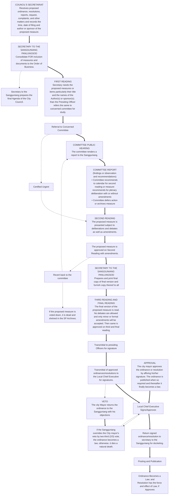

```mermaid
flowchart TD

%% Nodes

A["COUNCIL'S SECRETARIAT<br/>Receives proposed ordinance, resolutions, reports, request, complaints, and other matters and records the time, date of filing and author or sponsor of the proposed measure."]

B["SECRETARY TO THE SANGGUNIANG PANLUNGSOD<br/>Consolidate FOR inclusion of measures and documents to the Order of Business."]

C["Secretary to the Sangguniang prepares the final Agenda of the City Council."]

D["FIRST READING<br/>Secretary needs the proposed measures or items particularly their title and the names of the Author(s) or sponsor(s); than the Presiding Officer refers the same to concerned committee for study."]

E["Referral to Concerned Committee"]

F["Certified Urgent"]

G["COMMITTEE PUBLIC HEARING<br/>The committee renders a report to the Sangguniang."]

H["COMMITTEE REPORT<br/>(findings or observation and recommendations)<br/>• Committee recommends to calendar for second reading or measure recommends for plenary deliberation with or without amendments<br/>• Committee defers action or archives measure"]

I["SECOND READING<br/>The proposed measure is presanted subject to deliberations and debates as well as amendments."]

J["The proposed measure is approved on Second Reading with amendments."]

K["Revert back to the committee"]

L["If the proposed measure is voted down, it is dead and shelved in the SP Archives."]

M["SECRETARY TO THE SANGGUNIANG PANLUNGSOD<br/>Prepares and print final copy of final version and furnish copy thereof to all"]

N["THIRD READING AND FINAL READING<br/>The final version of the proposed measure is read. No debates are allowed and only minor or formal amendments will be accepted. Then same is approved on third and final reading."]

O["Transmittal to presiding Officers for signature"]

P["Transmittal of approved ordinances/resolutions to the Local Chief Executive for signatures."]

Q["APPROVAL<br/>The city mayor approves the ordinance or resolution by affixing his/her signature. The ordinance is published when so required and thereafter it finally becomes a law."]

R["Local Chief Executive<br/>Signs/Approves"]

S["VETO<br/>The city Mayor returns the ordinance to the Sangguniang with his objections"]

T["if the Sangguniang overrides the City mayor's veto by two-third (2/3) vote, the ordinance becomes a law, otherwise, it dies a natural death."]

U["Return signed ordinance/resolution to secretary to the Sangguniang for docketing."]

V["Posting and Publication"]

W["Ordinance Becomes a Law; and<br/>Resolution has the force and effect of Law, if Approves"]


%% Solid Connections (Block Arrows)

A ==> B

B ==> D

D ==> E

E ==> G

G ==> H

H ==> I

I ==> J

J ==> M

M ==> N

N ==> O

O ==> P

P ==> R

Q ==> R

R ==> U

U ==> V

V ==> W


%% Dashed Connections

B -.-> C

E -.-> F

F -.-> I

J -.-> K

K -.-> G

K -.-> L

P -.-> S

S ==> T

T -.-> R

R -.-> T
```
