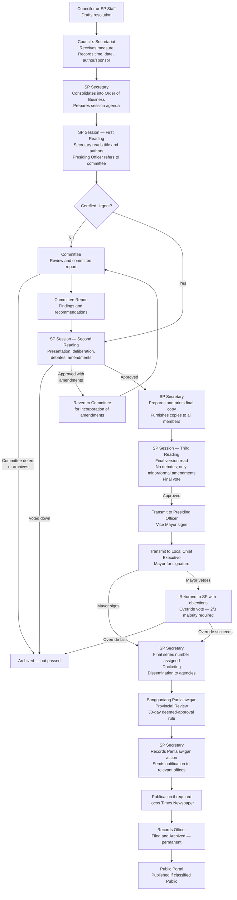
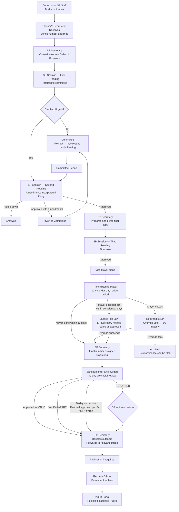

# First Stakeholder Interview — Synthesis and Clarification Questions

**Interview Date:** June 9  
**Primary Subjects:** SP Secretariat (Records Officer; SP Secretary implied)  
**Additional Sources:** Official legislative process flowchart; SP organizational chart; scanned operational documents (14 document type samples, 2022–2026)  
**Status:** Raw notes synthesized and augmented with documentary evidence. Clarification questions directed at Luke are in Part 2.

---

## Part 1 — Confirmed Findings

### 1.0 Confirmed Stakeholders and Organizational Structure

The following names and positions are confirmed from the official SP organizational chart.

**Vice Mayor (Presiding Officer, 7th SP):** Hon. Albert D. Chua

**SP Members (7th SP):**

| Name                                    | Role               |
| --------------------------------------- | ------------------ |
| Hon. Kichel Jomarie G. Pungtilan        | City Councilor     |
| Hon. Eleuterio A. Salamangkit Jr.       | City Councilor     |
| Hon. Martha Louise Aurora M. Borleo     | City Councilor     |
| Hon. Gwyneth S. Quidang                 | City Councilor     |
| Hon. John Gabrielle Dominique M. Daguio | City Councilor     |
| Hon. Lucky Rene G. Bunye                | City Councilor     |
| Hon. Violeta Eugenia D. Nalupta         | City Councilor     |
| Hon. Macarthur A. Aguinaldo             | City Councilor     |
| Hon. Rizal P. Castillo                  | City Councilor     |
| Hon. Juan Paulo P. Flojo                | City Councilor     |
| Hon. Gilbert O. Medina                  | ABC Representative |
| Hon. Reign Gwendia T. Mirasol           | SK Representative  |

**Office of the Secretary to the Sangguniang Panlungsod:**

| Name                        | Position                                                       |
| --------------------------- | -------------------------------------------------------------- |
| Gladys R. Lagura            | SP Secretary                                                   |
| Mia Prima M. Mesina         | Administrative Officer II — Ordinances & Resolutions Section   |
| Ronald P. Beltran           | Administrative Officer II — Franchise Section                  |
| Bonn Roger G. Rosales       | Administrative Aide VI (Clerk III) — Administrative Section    |
| Kathielyn R. Ilayat         | Administrative Aide VI (Clerk III) — Administrative Section    |
| Paul Josiah N. Chua         | Administrative Aide VI (Clerk III) — Administrative Section    |
| Joanne Marie Q. Macugay     | Administrative Aide VI (Clerk III) — Franchise Section         |
| Jeniffer S. Gaoiran         | Administrative Aide VI (Clerk III) — Franchise Section         |
| Antonia Elizabeth G. Yaplag | Administrative Aide VI (Clerk III) — Franchise Section         |
| Florentino Pablo R. Lumang  | Administrative Aide VI (Data Controller I) — Franchise Section |
| Ronell R. Purisima          | Administrative Aide III (Utility Worker II)                    |
| Ramil F. Rante              | Administrative Aide IV (Driver III)                            |
| Cherill S. Malicad          | Librarian I — City Library                                     |

**Personal Staff of the Vice Mayor:**

| Name | Position |
| --- | --- |
| Jocelyn D. Villavicencio | Executive Assistant II |
| Tristan Melecia D. Advincula | Executive Assistant I |
| Artelyn B. Rupisan | Secretary I |
| Jay Carlo V. Ragudo | Driver II |

The current Mayor is Hon. Mark Christian R. Chua. Previous Mayor (6th SP era) was Hon. Albert D. Chua (the current Vice Mayor's name is different — the Vice Mayor and previous Mayor appear to be namesakes but distinct individuals based on memo prefixes: "MRC" for current Mayor, "ADC" for current Vice Mayor).

---

### 1.1 Scope Decisions

| Item                                                | Status                                                                |
| --------------------------------------------------- | --------------------------------------------------------------------- |
| SP Resolutions                                      | In scope — confirmed                                                  |
| SP Ordinances                                       | In scope — confirmed                                                  |
| Appropriation Ordinances                            | In scope — confirmed (same workflow as regular ordinances)            |
| Franchise Ordinances                                | In scope — confirmed (observed in Panlalawigan review log)            |
| Internal Memos (Outgoing)                           | In scope — currently processed by Secretariat                         |
| Memos Incoming                                      | In scope — received from Mayor's Office and other sources             |
| Letters Received                                    | In scope — currently processed by Secretariat                         |
| Letters Sent                                        | In scope — currently processed by Secretariat                         |
| Notice of Committee Hearing                         | In scope                                                              |
| Notice of Special Session                           | In scope                                                              |
| Designation                                         | In scope — confirmed from scanned records; distinct document type     |
| Barangay Resolutions / Ordinances                   | In scope — physically submitted to secretariat; secretariat logs them |
| Sangguniang Panlalawigan Review/Action Taken        | In scope as a tracking log, not an active workflow document           |
| Administrative Cases (complaints against officials) | In scope; confidential; Legislative access only                       |
| Citizen Complaints (tricycle/transportation)        | In scope — distinct SP-managed complaint type                         |
| Executive Orders                                    | **Removed from scope**                                                |
| Purchase Requests                                   | **Not part of the system**                                            |

Stakeholder comment recorded: *"The scope of the proposed system is so large yet."* [See Q-INT-05]

---

### 1.2 Current Systems

- Prior digital system: **Legislative Management and Information Tracking System (LMITS)**. Subscription ended. Managed by **CPDO** (not the SP Secretariat or IT Office). Hosted at **batac.gov.ph**. Stored only document **titles**.
- **Data migration from LMITS is required.**
- The SP Secretariat has its own active website: **sp.batac.gov.ph** (confirmed from Document and Records Request Form). Scope of current digital content on this site is unconfirmed and will require review. [See Q-INT-23]
- Records Officer currently uses **MS Word with keyword search** for records. Physical records are not yet uploaded into any system.

---

### 1.3 SP Resolution Workflow — Confirmed and Augmented

The interview described this as a **fixed workflow** (same steps every time). The official legislative process flowchart provides the complete and authoritative step sequence, which is more detailed than the interview notes alone captured.

**Key notes from interview and documentary evidence:**

- A **preliminary series number** is assigned when the secretariat logs the draft for First Reading. A **final series number** is assigned at finalization (after Mayor signature). These are described as **different from each other**. [See Q-INT-01 — this remains unresolved]
- **Certified Urgent** measures bypass committee referral and go directly to Second Reading. The trigger for "certified urgent" is unconfirmed. [See Q-INT-17]
- Amendments at Second Reading: if approved with amendments, the measure reverts to committee for incorporation before being printed as a final copy. This is a loop-back in the workflow engine.
- Third Reading: no debates allowed; only minor or formal amendments accepted. Third Reading is a distinct session step, not merged with Second Reading.
- The **Mayor's 10-day review** is confirmed by the Index of Ordinances (which records "Date Approved by LCE" as a separate field). The interview did not describe this step explicitly for resolutions; [See Q-INT-14] for whether resolutions also require LCE signature.
- **Veto override** is a formal process: requires 2/3 of the SP (i.e., 8 of 12 members). If override fails, the measure is archived and a new measure can be started. Confirmed by official legislative flowchart.
- The Sangguniang Panlalawigan review occurs **after Mayor signature**, not before. Sequence confirmed from Index of Ordinances: Date Approved by SP → Date Approved by LCE → Date Received by Higher Sanggunian.
- **Publication** in a newspaper (Ilocos Times) is required for some but not all ordinances. Which types require publication is unresolved. [See Q-INT-24]
- Voting threshold: 12 members, half+1 required — **7 votes**. No proxy voting.

---

### 1.4 SP Ordinance Workflow — Confirmed and Augmented

The ordinance workflow follows the same legislative process as a resolution, with these additions:

**Key notes:**

- Appropriation Ordinances follow the same workflow. Confirmed.
- The Panlalawigan can return an ordinance marked **"VALID-IN-PART"** — what happens to the invalid provisions is unresolved. [See Q-INT-19]
- When the Panlalawigan acts **beyond 30 days**, the ordinance is **"presumed consistent with law and therefore VALID pursuant to Section 56(d) of R.A. 7160"** — this is confirmed from the Index of Ordinances. Whether this is triggered automatically by the system or manually recorded by the SP Secretary is unresolved. [See Q-INT-13]
- Ordinance categories confirmed: Human Capital Development, Economic Transformation, Infrastructure Development, Climate and Disaster Resilience, Good Governance and Social Protection.

---

### 1.5 Sangguniang Panlalawigan Review — Confirmed Details

After the Mayor signs, SP documents are transmitted to the Sangguniang Panlalawigan (Provincial Board) for review. The SP Secretariat maintains a dedicated **Sangguniang Panlalawigan Review/Action Taken** tracking log.

**Transmission:** SP Secretariat sends batches via the **Ordinance/Resolution Sent** log. The primary recipient is the Sangguniang Panlalawigan Secretary (confirmed name: Mildred Nirmla R. Lamoste).

**Log fields tracked by SP Secretariat:**

| Field | Detail |
| --- | --- |
| Control No. | SP Secretariat's own sequence number (e.g., 2026-01) |
| Date Received | When the Panlalawigan's response was received back |
| SP Reso. No. | Panlalawigan's own resolution number (e.g., R2026-0841) |
| Subject | Which SP document(s) were reviewed |
| Date Approved / Disapproved | From the Panlalawigan |
| Date Referred | Date Panlalawigan sent to their own committee |
| Remarks | Outcome and notes |

**Confirmed outcome types:**

| Outcome | Meaning |
| --- | --- |
| VALID | Approved by Panlalawigan |
| VALID-IN-PART | Partially approved; some provisions found invalid |
| RETURNED | Returned with objections (treated as disapproved) |
| Referred to committee | Panlalawigan committee review in progress; 30-day clock running |
| Operative-in-its-entirety | Used specifically for Appropriation Ordinances |
| *(blank — 30 days elapsed)* | Deemed approved per Section 56(d) of R.A. 7160; recorded in Remarks as "Presumed consistent with law…" |

**Scope:** Both ordinances **and** resolutions are transmitted to the Panlalawigan. Confirmed from the Ordinance/Resolution Sent log.

**Multiple documents per transmission:** The Panlalawigan frequently acts on batches (multiple SP documents addressed in one resolution). Confirmed from review log entries.

**Feedback loop:** When the Panlalawigan acts, the SP Secretariat records the action and forwards notification to relevant offices (e.g., CPDO, Budget Office, City Engineer). Confirmed from Letters Sent log.

---

### 1.6 Barangay Resolution Workflow

| Step | Actor | Notes |
| --- | --- | --- |
| 1 | Barangay | Submits to SP Secretariat (physically) |
| 2 | Secretariat / Records Officer | Logs; attaches QR code |
| 3 | SP Session | First Reading |
| 4 | Vice Mayor | Refers to committee |
| 5 | Committee | Reviews; produces committee report |
| 6 | Secretariat | Finalizes; assigns series number |
| 7 | Secretariat | Returns decision to barangay (physical) |
| — | System | Status notification sent to barangay |

---

### 1.7 Barangay Budget Workflow

Referred simultaneously to multiple offices for preliminary review (parallel step confirmed).

| Step | Actor | Notes |
| --- | --- | --- |
| 1 | Barangay | Submits to SP Secretariat |
| 2 | SP Session | First Reading |
| 3 | Local Finance Committee; Budget Office; Treasury Office; CPDO | Parallel preliminary review |
| 4 | Secretariat | Waits for all preliminary reviews to complete |
| 5 | Referred committee | Produces committee report |
| 6 | Secretariat | Assigns series number; SP votes |
| 7 | Secretariat | Returns decision to barangay (physical) |

---

### 1.8 Internal Memo (Outgoing)

| Field          | Detail                                                                                                                        |
| -------------- | ----------------------------------------------------------------------------------------------------------------------------- |
| Initiator      | Vice Mayor or SP Secretary                                                                                                    |
| Memo number    | Assigned from originating authority (e.g., VM ADC Memo No. 2025-01) — fixed and immutable                                     |
| Control number | SP Secretariat's own sequential number — assigned after finalization; mutable                                                 |
| Signatories    | Vice Mayor                                                                                                                    |
| Flow           | VM issues memo → SP Secretary receives → QR generated → Disseminated physically to SP Members and other recipients → Archived |

**Confirmed document number format:** `{YEAR}-{NN}` (e.g., 2025-01, 2025-04) — sequential within year.

---

### 1.9 Memo Incoming

Memos received from the Mayor's Office and external sources. Logged separately from Letters Received.

| Field | Detail |
| --- | --- |
| Sources | Mayor's Office (Memorandum Circulars with prefix MRC); other offices |
| Log fields | Control No.; Date Received; Origin (including the originating memo number); Subject |
| Control number format | `{YEAR}-{NN}` (continues from same sequence as outgoing — [See Q-INT-25]) |

**Sample entries confirm:** Incoming memos are numbered separately from letters received. Origin field stores the sender's own reference number (e.g., "MRC Memo Circ. No. 2025-001").

---

### 1.10 Letters Received

| Field | Detail |
| --- | --- |
| Sources | Outside agencies, departments, barangays, citizens, private individuals |
| Log fields | Control No.; Date Received; Origin; Subject |
| Flow | Received by secretariat → QR attached → Given to Vice Mayor (adds notes/routing instructions) → Returned to secretariat → Action taken (concerned offices notified) → Disseminated → Archived |

**Confirmed document number format:** `{YEAR}-{NN}` (e.g., 2026-01 through 2026-98). Year resets to 01 each year.

**Volume data:** Control numbers 2026-01 through 2026-98 were assigned between approximately January 5 and March 18, 2026 — roughly 38 letters per month to the SP Secretariat alone. This is a meaningful volume for system sizing.

**Gap pattern observed:** Several entries near the end of the log show the control number recorded as "2026-" with no sequential number assigned yet — suggesting numbers are sometimes not immediately assigned at receipt. [See Q-INT-02]

**Variety of senders confirmed:** DILG-Batac, other city departments, barangay officials, provincial board members, universities (MMSU), private organizations, citizens requesting assistance.

---

### 1.11 Letters Sent

| Field | Detail |
| --- | --- |
| Initiator | Vice Mayor or SP Secretary |
| Signatories | SP Secretary and Vice Mayor |
| Flow | Secretariat creates → QR attached → Signed → Disseminated → Archived (receiving copies retained) |
| Content types confirmed | Forwarding committee reports; transmitting Panlalawigan action taken; invitations to sessions; requests to Mayor's Office; forwarding ordinances/resolutions to external parties |

**Confirmed document number format:** `{YEAR}-{NN}` (e.g., 2026-01 through 2026-36 in Q1 2026). Same format as Letters Received but appears to be a **separate counter**.

**Important:** Letters Sent include formal forwarding of committee reports on transportation complaints to both complainants and respondents. This is systematic, not ad hoc — the system must support this routing.

---

### 1.12 Notice of Committee Hearing (NCH)

| Field | Detail |
| --- | --- |
| Log fields | Control No.; Date Sent; Recipient; Subject |
| Encoders | SP staff under secretariat; secretariat stores |
| Signatories | SP Secretary and Vice Mayor |
| Flow | Encoded → Signed → Disseminated |

**Confirmed document number format:** `NCH {YEAR}-{NN}` (e.g., NCH 2025-03 through NCH 2025-33).

**Multiple recipients per notice confirmed:** A single NCH can go to multiple parties — committee members, external agencies, officials involved in the subject matter. Example: NCH 2025-04 addressed to Members of Committee on Agriculture AND Members of Committee on Tourism simultaneously, plus invited external stakeholders.

**Multiple committees co-notified:** Some hearings involve two or more committees simultaneously (e.g., Committee on Transportation and Committee on Laws). This confirms the need for multi-recipient routing in the Notice of Committee Hearing workflow.

---

### 1.13 Notice of Special Session

| Field       | Detail                                                             |
| ----------- | ------------------------------------------------------------------ |
| Purpose     | Urgent notification that a special session is happening            |
| Log fields  | Control No.; Date Sent; Session No. (ordinal, date, time); Subject |
| Signatories | SP Secretary and Vice Mayor                                        |
| Flow        | Created → QR attached → Sent as letter → Archived                  |

**Confirmed number format anomaly:** In the 2023 log, the first notice used prefix NOSP (NOSP 2023-01), but subsequent notices in the same log switched to NCH prefix (NCH 2023-02, NCH 2023-03). It is unclear whether the NCH prefix is shared between Committee Hearing notices and Special Session notices, or whether this is a documentation inconsistency. [See Q-INT-21]

---

### 1.14 Ordinances and Resolutions Sent Log

| Field | Detail |
| --- | --- |
| Purpose | **Logging only** — records transmission to Panlalawigan |
| Log fields | Date Sent; Recipient; Ord./Res. No.; Remarks |
| Created by | Secretariat |
| Signed by | SP Secretary (before sending) |
| Confirmed recipient | Sangguniang Panlalawigan — through their Secretary |

**Multiple documents per entry:** A single log entry can list multiple ordinances or resolutions sent in one batch.

---

### 1.15 Designation

Confirmed as a **distinct document type** from scanned records. Not the same as an internal memo.

| Field | Detail |
| --- | --- |
| Purpose | Formal designation of an official to act in an authorized capacity (Acting Mayor, OIC, etc.) |
| Origin | Issued by the originating authority (Mayor's Office or Vice Mayor) under their own memo number |
| SP log fields | Control No. (D {YEAR}-{NN}); Memo No. (originator's reference, e.g., "ADC Memo. No. 2024-002"); Date Sent/Received; Recipient; Subject |
| Examples confirmed | Vice Mayor designated as Acting Mayor during Mayor's travel; Administrative Officer II designated as OIC of SP Secretariat; SP Member designated as Acting Vice Mayor |
| Signatories | Mayor (for Mayor-level designations); Vice Mayor (for VP-level designations) |

**Confirmed document number format:** `D {YEAR}-{NN}` (e.g., D 2024-01 through D 2024-19).

**Dual number system confirmed:** Each Designation document has two numbers — the originating authority's own memo/order number AND the SP Secretariat's control number. This is consistent with the broader pattern observed across all incoming documents.

**Note:** This document type has implications for the delegation and acting-authority features in the system. When a Designation is logged, it should optionally trigger an authority-transfer record in the workflow engine. [See Q-INT-22]

---

### 1.16 QR Codes and Numbering System — Key Findings

- **All documents processed by the SP Secretariat receive QR codes.** No exceptions stated.
- QR code is attached as early as the **draft stage**.
- **QR tracking number is fixed and immutable for the life of the document.**
- **Control number is mutable** — assigned after finalization; can be modified.
- Resolutions and Ordinances have a **preliminary series number** (assigned early) and a **final series number** (assigned at finalization), described as **different from each other**.
- Memo number is **fixed** and **separate from control number**.

Critical ambiguities in the numbering system must be resolved before any numbering tables are designed. [See Q-INT-01, Q-INT-02, Q-INT-03]

**Confirmed numbering formats from scanned documents:**

| Document Type | Format | Example |
| --- | --- | --- |
| Ordinance | {SP_NUMBER}SP {YEAR}-{NN} | 7SP 2025-01; 7SP 2025-08 |
| Appropriation Ordinance | Same as above | 7SP 2025-02 |
| Franchise Ordinance | {SP_NUMBER}SP {NNNN}-{YY}R | 7SP 0001-26R |
| Resolution | {SP_NUMBER}SP {YEAR}-{NN} | 7SP 2025-35; 7SP 2025-66 |
| Notice of Committee Hearing | NCH {YEAR}-{NN} | NCH 2025-03 |
| Notice of Special Session | NOSP {YEAR}-{NN} or NCH {YEAR}-{NN} | [See Q-INT-21] |
| Designation | D {YEAR}-{NN} | D 2024-01 |
| Letters Received | {YEAR}-{NN} | 2026-01 |
| Letters Sent | {YEAR}-{NN} | 2026-01 |
| Memo Outgoing | {YEAR}-{NN} | 2025-01 |
| Memo Incoming | {YEAR}-{NN} | 2025-26 |
| Sangguniang Panlalawigan Review | {YEAR}-{NN} | 2026-01 |
| Panlalawigan's own reference | R{YEAR}-{NNNN} | R2026-0841 |

**The franchise ordinance format** (`7SP 0001-26R`) uses a different scheme — a running number and a year suffix with "R". [See Q-INT-26]

---

### 1.17 Confirmed Standing Committees (7th SP)

Twenty-two standing committees confirmed from the official committee list. Full membership below.

| Committee                                                      | Chairman    | Vice Chairman | Member      |
| -------------------------------------------------------------- | ----------- | ------------- | ----------- |
| Laws, Rules, Ethics & Privileges                               | Flojo       | Daguio        | Borleo      |
| Peace & Order, Public Safety & Dangerous Drugs                 | Aguinaldo   | Flojo         | Salamangkit |
| Social Welfare Development, Public Service & Calamities        | Pungtilan   | Salamangkit   | Daguio      |
| Education, Culture, Science & Technology                       | Daguio      | Pungtilan     | Mirasol     |
| Health and Sanitation & Public Welfare                         | Borleo      | Daguio        | Mirasol     |
| Appropriations & Finance, Ways and Means                       | Borleo      | Daguio        | Salamangkit |
| Human Rights & CSOs                                            | Quidang     | Bunye         | Flojo       |
| Special Projects & Corporate Affairs                           | Aguinaldo   | Borleo        | Nalupta     |
| Barangay Affairs                                               | Medina      | Salamangkit   | Castillo    |
| Transportation and Communication                               | Medina      | Aguinaldo     | Pungtilan   |
| Tourism & Public Information                                   | Daguio      | Salamangkit   | Borleo      |
| Games and Amusements                                           | Mirasol     | Flojo         | Quidang     |
| Senior Citizens & NGOs                                         | Castillo    | Pungtilan     | Aguinaldo   |
| Economic Enterprise, Market & Slaughterhouse                   | Flojo       | Aguinaldo     | Pungtilan   |
| Landed Estates & Assessments                                   | Nalupta     | Quidang       | Daguio      |
| Good Government / Public Ethics & Accountability               | Bunye       | Nalupta       | Flojo       |
| Public Works, Infrastructure, Housing & Urban Development      | Salamangkit | Medina        | Aguinaldo   |
| Agriculture, Food, Cooperatives and Livelihood                 | Salamangkit | Pungtilan     | Mirasol     |
| Environment, Natural Resources, Climate Change, Water & Energy | Salamangkit | Castillo      | Medina      |
| Trade, Commerce & Industry                                     | Aguinaldo   | Salamangkit   | Bunye       |
| Women, Children, Family Relations & Indigenous Peoples         | Pungtilan   | Borleo        | Flojo       |
| Labor, Employment & Civil Service                              | Flojo       | Mirasol       | Borleo      |
| Youth & Sports Development                                     | Mirasol     | Daguio        | Pungtilan   |

**Key architectural implications:**

- Most measures are referred to **two committees simultaneously**: the subject-matter committee plus the Committee on Laws. This is the standard practice confirmed by the Notice of Committee Hearing log. The system must support multi-committee referral as a core workflow feature, not a special case.
- The Committee on Laws appears on nearly every committee hearing notice — it is effectively a co-reviewer by default.
- Each Councilor sits on 4–6 committees. Notification and inbox logic must handle overlapping committee membership without duplicating workflow steps.

---

### 1.18 Confirmed Index of Ordinances Metadata Fields

The Index of Ordinances is the master reference log for ordinances. The following fields must be tracked or computable by the system:

| Field | Notes |
| --- | --- |
| Title of Ordinance | Full title text |
| Authored By | All co-authors (VM + Councilors) |
| Introduced By | Subset of authors who formally introduced |
| General Subject Matter | Category (e.g., Social Development, Economic Development) |
| Specific Subject Matter | Subcategory (e.g., Health, Finance) |
| Date Approved by SP | Third Reading vote date |
| Date Approved by LCE | Mayor's signature date |
| Date Received by Higher Sanggunian | Date sent to Panlalawigan |
| Sangguniang Panlalawigan Action Taken | Outcome code + Panlalawigan resolution number + date |
| Remarks / Post Review Action of SP | Notes on any corrections or follow-up action |
| Publication | Newspaper name + date (if required) |

**Implication:** The system must expose all of these as tracked data points on the ordinance record. The Index is not just a reports feature — it is an active operational record used by the SP Secretary for every ordinance.

---

### 1.19 Citizen Complaint — Confirmed Document Type

The scanned Citizen Complaint form is specific to **transportation complaints** (tricycle operators) and is addressed directly to the Sangguniang Panlungsod.

**Form fields confirmed:**

- Violation type (checkboxes): Overcharging, Trip Cutting, Refused to Convey Passenger, Discourtesy, Others
- Tricycle number
- Date and time of violation
- Place of violation
- Remarks / specifics
- Complainant's name, address, contact number (via signature block)

**Process implication:** These complaints are processed through the Committee on Transportation (and co-referred to Committee on Laws). The committee renders a report. The SP Secretariat sends the committee report back to both the complainant and the respondent via Letters Sent (confirmed from letters sent log — e.g., "Forwarded committee report of Committees on Transportation and Laws re: complaint against SC#0763"). The complaint form has no pre-assigned document number.

---

### 1.20 Document and Records Request Form — Confirmed Details

The formal request process for copies of SP documents is confirmed and fee-based.

**Form fields confirmed:**

- Document type: Ordinance / Resolution / Others
- Title
- Number of pages
- Requester name and agency
- Date requested
- Email address
- ID presented
- Purpose

**Approval authority:** Vice Mayor AND SP Secretary must both authorize.

**Payment:** Secretary's Fees under Ordinance No. 3SP 2014-05. Records: Amount paid, Official Receipt (OR) number, date paid, collecting officer.

**QR code on form:** Confirmed present at bottom. Website reference: sp.batac.gov.ph.

**Implication for portal design:** The paid copy request feature is a real operational process with a legal fee basis. Whether Phase 1 includes active Land Bank payment integration or starts with a manual offline payment step is unresolved. [See Q-INT-12]

---

### 1.21 Document Access and Public Portal

- Uploaded documents: **first page visible publicly; body is blurred**.
- **Title only** shown in public listings.
- **Request a copy** feature mentioned: potentially monetized via Land Bank payment system. Buyer name logged. [See Q-INT-12]
- Reference suggested: **Quezon City's citizen portal** as a design model.

---

### 1.22 Confidentiality

- No generally confidential records in SP Secretariat routine operations.
- **Administrative cases** (complaints against officials — mostly barangay officials) are **confidential** — access restricted to the Legislative branch only.

---

### 1.23 Retention

- Ordinances and resolutions: **permanent** retention.
- All documents currently retained — none disposed of.

---

### 1.24 Full-Text Search and OCR

- Full-text search across all documents is desired.
- All documents should be OCR-processed.
- Physical records are **not yet uploaded** into any system.
[See Q-INT-11 for OCR processing policy]

---

### 1.25 Delegation

User/position can assign a delegate or person-in-charge. Confirmed in interview.

**Additional evidence from Designation logs:** Designations of Acting Mayor occur frequently (multiple times per year). Confirmed examples from 2023–2024 alone show 10+ separate designations of the Vice Mayor as Acting Mayor. The system must handle delegation as a routine, high-frequency operation — not as an edge case.

---

### 1.26 Session Activity

- Up to **three hearings per day** possible.
- Average **five hearings per week**.
- During hearings, participants read **physical documents** (not digital).

---

### 1.27 Primary Digitalization Purpose

Stakeholder framing: *"Digitalization is just for convenience so that people do not have to go in person."*

This positions the system's primary stakeholder-perceived value as **public access and status transparency**, not internal workflow automation. Phase 1 prioritization and stakeholder communication should reflect this.

---

### 1.28 Dashboard

Analytics dashboard desired. Access is **account/role-scoped**.

---

### 1.29 Administration Transitions

When administration changes, resolutions and ordinances are **re-passed with new authors and signatories**. Prior versions remain archived under the previous administration. What happens to in-flight documents at transition time is unresolved. [See Q-INT-10]

---

### 1.30 Existing Web Presence

The SP Secretariat has an active website: **sp.batac.gov.ph**. This was referenced on the Document and Records Request Form. The content, technology, and data structure of this website are not yet known. Whether it contains data that needs to be migrated into the new system must be determined before architecture of the migration layer is finalized. [See Q-INT-23]

---

### 1.31 Document Volumes (Confirmed Estimates)

| Document Type | Volume | Period | Source |
| --- | --- | --- | --- |
| Letters Received | ~38/month | 2026 | Letters Received log (Control Nos. 2026-01 to 2026-98, Jan–Mar 2026) |
| Letters Sent | ~12/month | Q1 2026 | Letters Sent log (2026-01 to 2026-36, Jan–Mar 2026) |
| Memo Outgoing | ~2/month | Jul–Sep 2025 | Memo Outgoing log (2025-01 to 2025-04) |
| Memo Incoming | ~1/month | Jul–Sep 2025 | Memo Incoming log (2025-26 to 2025-28) |
| Notice of Committee Hearing | ~3–4/month | 2025 | NCH log (2025-03 to 2025-33 across Jul–Dec 2025) |
| Ordinances | ~1–2/month | 2025–2026 | Panlalawigan sent log |
| Designations | ~1–2/month | 2024 | Designation log (D 2024-01 to D 2024-19) |

These volumes are small by commercial software standards but are meaningful for the SP Secretariat's daily workload. Migration of historical records will add significantly to storage requirements.

---

## Part 2 — Clarification Questions

Questions for Luke, ordered by severity of development block. `[RESOLVED]` items are retained for reference but do not require follow-up. New questions added from documentary evidence are marked `[NEW]`.

---

### Q-INT-01 — Preliminary vs. Final Series Number `[Critical — blocks numbering module schema]`

The notes say a resolution has a "preliminary series number" at the secretariat/first reading stage and a "final series number" at finalization, described as different.

1. Is the preliminary series number an internal placeholder, or an early version of the official document number that later gets replaced?
2. At exactly which workflow step is the preliminary number assigned? At which step is the final number assigned?
3. If a resolution is rejected after receiving a preliminary number, what happens to that number — is the gap logged, or is the number simply abandoned?
4. Does the preliminary number appear on the document itself (e.g., on the cover sheet), or is it only used internally?

---

### Q-INT-02 — Control Number vs. Series Number `[Critical — blocks numbering module schema]`

Three number types appear in the notes: series number (for ordinances/resolutions), control number (assigned after finalization, mutable), and memo number (fixed, for internal memos).

1. For ordinances and resolutions: is the **control number** the same thing as the **final series number**, or are they two completely separate identifiers on the same document?
2. For which document types does a control number apply? All of them, or only letters, memos, and notices?
3. The control number is described as mutable — who has authority to modify it, and under what circumstances would it need to change?
4. Do the Letters Received, Letters Sent, Memos, and NCH all share **one single sequential counter per year**, or does each document type have its own separate counter? (The scanned logs suggest separate counters per type, but this needs confirmation.)
5. Does the QR tracking number correspond to the control number, the series number, or is it a completely separate system-generated identifier?

---

### Q-INT-03 — QR Code Assignment Point `[Critical — blocks tracking module design]`

The notes say QR codes are added at the draft stage — earlier than the architecture assumed.

1. Is the QR code generated the moment the secretariat receives the draft, or can it be generated before that?
2. Who physically generates and prints the QR code — only the secretariat?
3. Does the QR tracking number remain the same for the entire life of the document, even after the official series/control number is assigned?

---

### Q-INT-04 — Phase 1 Document Type Scope `[Critical — determines development timeline]`

1. Does the stakeholder expect all confirmed document types to be in Phase 1, or only ordinances and resolutions?
2. Is it acceptable to release Phase 1 with only resolutions and ordinances, then add letters, memos, notices, and designations in Phase 1B or Phase 2?

---

### Q-INT-05 — Scope Concern: What Exactly Was Said `[High]`

The statement *"The scope of the proposed system is so large yet"* was recorded.

1. Who made this statement — the SP Secretary, the Records Officer, or another person?
2. Is this a request to reduce the scope of Phase 1, or a general observation?
3. If they want a smaller Phase 1, what is the minimum set of features they consider immediately useful?

---

### Q-INT-06 — Session Minutes as a Document Type `[High]`

1. Are session minutes a standalone document type in Phase 1, with their own QR code, tracking, and workflow?
2. Or are they an attachment or sub-document associated with the session record?
3. Who reviews and certifies the minutes before they are considered official?
4. Are session minutes also given a control number?

---

### Q-INT-07 — Vice Mayor Review of All Incoming Letters `[High]`

1. Does the Vice Mayor review **every** incoming letter without exception?
2. Are there categories of letters that go directly to action by the secretariat without VM review?
3. If the Vice Mayor is unavailable, who reviews incoming letters?

---

### Q-INT-08 — Barangay Phase 1 Scope `[High]`

1. For Phase 1: is the correct model that barangay officials have **no system access**, and the secretariat logs their physically submitted documents on their behalf?
2. Or do some barangay officials need login accounts in Phase 1?

---

### Q-INT-09 — Hearing Schedule in Workflow `[Medium]`

1. Is this asking for a **scheduled date and time** to be attached to the committee hearing workflow step?
2. Or is this a request for a separate **hearing calendar module**?
3. Who inputs the hearing schedule?

---

### Q-INT-10 — In-Flight Documents at Administration Change `[Medium]`

If a document is mid-workflow when the new administration takes office, what happens?
- Does it continue under the new administration?
- Is it automatically cancelled?
- Is it placed on hold pending the new administration's decision?

---

### Q-INT-11 — OCR Processing `[Medium]`

1. Should OCR processing run automatically when a document is uploaded, or is it a manual step triggered by the Records Officer?
2. Is OCR required for historical records migrated from LMITS, or only for newly uploaded documents?

---

### Q-INT-12 — Paid Copy Request and Monetization `[Medium]`

1. Is the paid copy request feature in scope for Phase 1, or a later phase?
2. If Phase 1: must payment be active at launch, or can the copy request start without payment?
3. Who sets the fee for copies? (Legal basis is Ordinance No. 3SP 2014-05 — confirm if still current.)

---

### Q-INT-13 — Sangguniang Panlalawigan Review — Partially Resolved `[Medium]`

**Resolved:** Scope confirmed — both ordinances AND resolutions are transmitted to the Panlalawigan. The 30-day deemed-approval rule applies and is recorded with the Section 56(d) remark.

**Still unresolved:**

1. Is the 30-day countdown automatically tracked by the system, or does the SP Secretary manually record the date and note the outcome when the 30 days elapse?
2. When the Panlalawigan returns a document as VALID-IN-PART, what does the SP Secretariat do? Is there any follow-up action required in the SP? [See also Q-INT-19]

---

### Q-INT-14 — Mayor's Review of SP Ordinances — Partially Resolved `[Medium]`

**Resolved:** The Mayor's review and LCE signature step IS confirmed. The Index of Ordinances shows "Date Approved by LCE" as a standard field, with signatures typically occurring within 4–7 days of SP approval.

**Still unresolved:**

1. Does the 10-day lapse-into-law rule also apply to **SP Resolutions**, or only to Ordinances?
2. Is there a formal transmittal document sent from the SP Secretariat to the Mayor's Office for each ordinance?

---

### Q-INT-15 — Veto Override Process — Resolved `[Low]`

**Resolved:** The veto override process IS formal. Under the official legislative flowchart, if the Mayor vetoes, the SP holds an override vote. A 2/3 majority (8 of 12 members) is required. If the override fails, the ordinance is archived. If it succeeds, the ordinance proceeds to Panlalawigan review as if approved.

No further follow-up needed.

---

### Q-INT-16 — LMITS Migration Scope `[Low]`

1. Beyond document titles, what other fields need to be migrated? Reference: the ordinances index fields include — authored by, introduced by, general subject, specific subject, date approved by SP, date approved by LCE, Panlalawigan action taken, remarks, publication date.
2. In what format does the old data exist — a database export, spreadsheets, a combination?
3. Who currently has access to that data for extraction?

---

### Q-INT-17 — Certified Urgent Measures `[NEW — High]`

The official legislative flowchart confirms a "Certified Urgent" fast-track path that bypasses committee referral entirely. No information was provided in the interview.

1. Who has authority to declare a measure "certified urgent" — the Mayor, the Vice Mayor, a majority of the SP?
2. Is "certified urgent" formally declared in a document (e.g., a certification from the Mayor), or is it declared verbally in session?
3. How frequently is this path used in practice?
4. Can any document type be certified urgent, or only certain types?

---

### Q-INT-18 — Effectiveness of Ordinance Before Panlalawigan Review `[NEW — Medium]`

The Index of Ordinances confirms that the Mayor signs the ordinance BEFORE it is transmitted to the Panlalawigan for review. The ordinance enters the Panlalawigan log after LCE signature.

1. Is the ordinance considered **effective immediately after Mayor signature**, or does it become effective only after Panlalawigan validation?
2. If the Panlalawigan RETURNS or VALID-IN-PART an ordinance that the LGU has already been implementing, what is the procedure?

---

### Q-INT-19 — VALID-IN-PART Outcome `[NEW — Medium]`

The Panlalawigan Review log shows ordinances returned as "VALID-IN-PART."

1. What does the SP Secretariat do with a VALID-IN-PART return? Does the SP vote again on only the invalid provisions?
2. Does the system need to track which provisions are invalid?

---

### Q-INT-20 — Newspaper Publication Requirements `[NEW — Medium]`

The Index of Ordinances shows some ordinances published in the Ilocos Times; others have no publication entry.

1. Which ordinance types require newspaper publication?
2. Who is responsible for arranging publication?
3. Is the publication date tracked in the SP Secretariat's records?

---

### Q-INT-21 — NCH vs. NOSP Number Prefix Inconsistency `[NEW — Medium — blocks numbering schema]`

In the 2023 Notice of Special Session log, the first entry used the prefix NOSP (NOSP 2023-01), but subsequent entries in the same year switched to NCH (NCH 2023-02, NCH 2023-03).

1. Is the NCH prefix shared between Notices of Committee Hearing and Notices of Special Session?
2. Or was the NOSP prefix used briefly and then abandoned?
3. What is the current numbering convention for Notices of Special Session?

---

### Q-INT-22 — Designation Document Type and Workflow Implications `[NEW — High]`

Designation is confirmed as a distinct document type. Designations frequently name the Vice Mayor or SP Members as Acting Mayor, and SP staff as OIC of the Secretariat.

1. When a Designation is received and logged, does it trigger any change in the system's authority model — e.g., routing documents to the designated person instead of the original?
2. Or is the Designation simply logged as a document with no automatic system-level effect?
3. Who is authorized to process and file Designation documents in the SP Secretariat?

---

### Q-INT-23 — sp.batac.gov.ph Existing Website `[NEW — High]`

The Document and Records Request Form references sp.batac.gov.ph as the official SP website.

1. What is currently published on sp.batac.gov.ph?
2. Does it contain any ordinance or resolution data that would need to be migrated?
3. Is the new system intended to replace sp.batac.gov.ph, or to exist alongside it?

---

### Q-INT-24 — Incoming Memos vs. Letters Received — Numbering Relationship `[NEW — Medium]`

The Memo Incoming log uses `{YEAR}-{NN}` format. The Letters Received log also uses `{YEAR}-{NN}`. Both appear to have separate sequential counters (e.g., Memo Incoming goes 2025-26, 2025-27, 2025-28 — high numbers suggesting earlier entries exist; Letters Received starts from 2026-01 each year).

1. Are Memos Incoming and Letters Received tracked in **separate counters** or a **single shared counter** per year?
2. What distinguishes a document classified as "Memo Incoming" from one classified as "Letter Received" — is it purely the form of the original (a memo format vs. a letter format)?

---

### Q-INT-25 — Letters Sent vs. Letters Received — Shared or Separate Counter `[NEW — Medium]`

Both Letters Sent and Letters Received appear to use `{YEAR}-{NN}` format with what look like separate counters.

1. Are outgoing and incoming letters in **separate sequential counters** or a single counter?
2. If separate, can the same control number (e.g., 2026-07) appear in both the Received and Sent logs without ambiguity?

---

### Q-INT-26 — Franchise Ordinance Numbering Format `[NEW — Medium]`

The Panlalawigan review log shows a franchise ordinance numbered `7SP 0001-26R` through `7SP 0178-26R` — a different format from regular ordinances.

1. Is this a completely separate numbering series for franchise ordinances?
2. What does the "R" suffix signify?
3. Are franchise ordinances processed through the same workflow as regular ordinances, or a different one?

---

*End of Document.*

*This synthesis reflects raw interview notes plus documentary evidence from the official legislative process flowchart, SP organizational chart, and 14 categories of scanned operational documents (2022–2026). Items marked `[NEW]` arose from the documentary evidence, not the interview itself. Questions without resolution status must be answered before the corresponding development task begins.*