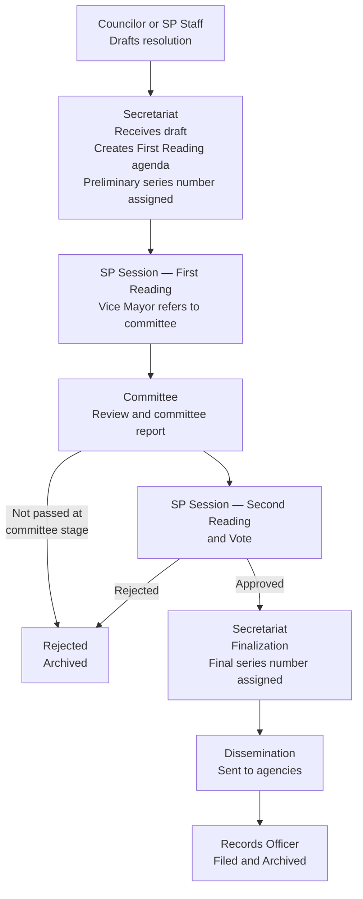
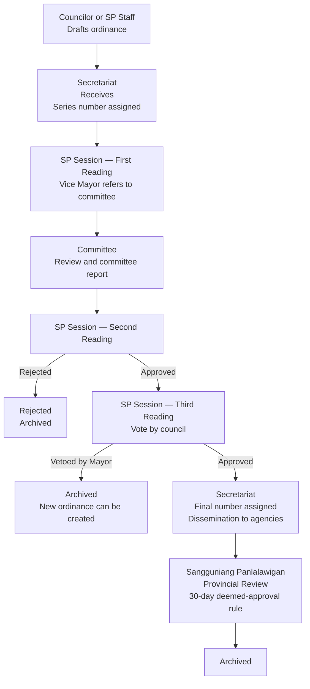

# First Stakeholder Interview — Synthesis and Clarification Questions

**Interview Date:** June 9  
**Primary Subjects:** SP Secretariat (Records Officer; SP Secretary implied)  
**Status:** Raw notes synthesized. Clarification questions directed at Luke are in Part 2.

---

## Part 1 — Confirmed Findings

### 1.1 Scope Decisions

| Item                                                | Status                                                                                               |
| --------------------------------------------------- | ---------------------------------------------------------------------------------------------------- |
| SP Resolutions                                      | In scope — confirmed                                                                                 |
| SP Ordinances                                       | In scope — confirmed                                                                                 |
| Internal Memos                                      | In scope — currently processed by Secretariat                                                        |
| Letters Received                                    | In scope — currently processed by Secretariat                                                        |
| Letters Sent                                        | In scope — currently processed by Secretariat                                                        |
| Notice of Committee Hearing                         | In scope                                                                                             |
| Notice of Special Session                           | In scope                                                                                             |
| Administrative Cases (complaints against officials) | In scope; confidential; Legislative access only                                                      |
| Barangay documents                                  | Physically submitted to secretariat; secretariat logs them; barangay system access not yet confirmed |
| Executive Orders                                    | **Removed from scope**                                                                               |
| Purchase Requests                                   | **Not part of the system**                                                                           |

Stakeholder comment recorded: *"The scope of the proposed system is so large yet."* [See Q-INT-05]

---

### 1.2 Current Systems

- Prior digital system: **Legislative Management and Information Tracking System (LMITS)**. Subscription ended. Managed by **CPDO** (not the SP Secretariat or IT Office). Hosted at **batac.gov.ph**. Stored only document **titles**.
- **Data migration from LMITS is required.**
- Records Officer currently uses **MS Word with keyword search** for records. Physical records are not yet uploaded into any system.

---

### 1.3 SP Resolution Workflow — Confirmed

Described as a **fixed workflow** (same steps every time).

**Key notes:**
- A **preliminary series number** is assigned when the secretariat logs the draft for First Reading.
- A **final series number** is assigned at finalization — described as **different from the preliminary number**.
- Resolutions can be rejected at the Committee Report stage or at Second Reading/Vote.

---

### 1.4 SP Ordinance Workflow — Confirmed

**Key notes:**
- Amendments occur at Second Reading. SP Secretary records minutes. Councilor incorporates changes before Third Reading.
- Session minutes are archived separately. SP Secretary prepares them.
- Appropriation Ordinances follow the same workflow.
- Ordinance categories: Human Capital Development, Economic Transformation, Infrastructure Development, Climate and Disaster Resilience, Good Governance and Social Protection.
- Voting: 12 members, half+1 (7 votes required). **No proxy voting.**
- **Mayor's 10-day review period** (RA 7160 requirement) was **not mentioned** in the described workflow. [See Q-INT-14]

---

### 1.5 Sangguniang Panlalawigan Review

After SP approval, ordinances undergo provincial review by the Sangguniang Panlalawigan (Provincial Board).

| Field | Detail |
|-------|--------|
| QR code | Assigned at receipt by secretariat |
| 30-day rule | If no provincial action within 30 days, deemed approved |
| Log fields | Control number; SP number; subject; date approved/disapproved; date referred; remarks; comments/reviews; date referred by Panlalawigan to their committee |
| Signatories | Provincial Board Secretary; Acting Vice Governor; Temporary Presiding Officer |
| Outcome | Assigned a control number; archived |
| Outside communications | Received by email but printed |

Which document types are subject to this review, and whether the 30-day rule is system-automatic or manually recorded, are unresolved. [See Q-INT-13]

---

### 1.6 Barangay Resolution Workflow

| Step | Actor | Notes |
|------|-------|-------|
| 1 | Barangay | Submits to SP Secretariat (physically) |
| 2 | Secretariat / Records Officer | Logs; attaches QR code |
| 3 | SP Session | First Reading |
| 4 | Vice Mayor | Refers to committee |
| 5 | Committee | Reviews; produces committee report |
| 6 | Secretariat | Finalizes; assigns series number |
| 7 | Secretariat | Returns decision to barangay (physical) |
| — | System | Status notification sent to barangay |

---

### 1.7 Barangay Budget Workflow

Referred simultaneously to multiple offices for preliminary review.

| Step | Actor | Notes |
|------|-------|-------|
| 1 | Barangay | Submits to SP Secretariat |
| 2 | SP Session | First Reading |
| 3 | Local Finance Committee; Budget Office; Treasury Office; CPDO | Parallel preliminary review |
| 4 | Secretariat | Waits for all preliminary reviews to complete |
| 5 | Referred committee | Produces committee report |
| 6 | Secretariat | Assigns series number; SP votes |
| 7 | Secretariat | Returns decision to barangay (physical) |

---

### 1.8 Internal Memo

| Field | Detail |
|-------|--------|
| Initiator | VM or SP Secretary |
| Memo number | Fixed and immutable; **different from control number** |
| Control number | Mutable; assigned only after finalization |
| Flow | Secretariat creates → QR generated → VM signs → Returned to secretariat → Disseminated physically to recipients (SP members, etc.) |

---

### 1.9 Letters Received

| Field | Detail |
|-------|--------|
| Sources | Outside agencies, departments, barangays, citizens |
| Log fields | Date received; origin; subject; control number (assigned after finalization only) |
| Flow | Received by secretariat → QR attached → Given to Vice Mayor (adds notes/routing instructions) → Returned to secretariat → Action taken (concerned offices notified) → Disseminated → Archived under category "Letter Received" |

---

### 1.10 Letters Sent

| Field | Detail |
|-------|--------|
| Initiator | VM or SP Secretary |
| Flow | Secretariat creates → QR attached → Signed by SP Secretary and VM → Disseminated → Archived (receiving copies retained) |

---

### 1.11 Notice of Committee Hearing

| Field | Detail |
|-------|--------|
| Log fields | Subject; recipient; date sent; control number |
| Encoders | SP staff under secretariat; secretariat stores |
| Signatories | SP Secretary and VM |
| Flow | Encoded → Signed → Disseminated |

---

### 1.12 Notice of Special Session

| Field | Detail |
|-------|--------|
| Purpose | Urgent notification that a special session is happening |
| Log fields | Control number; date sent; session number (ordinal, date, time); subject |
| QR code | Yes |
| Signatories | SP Secretary and VM |
| Flow | Created → QR attached → Sent as letter → Archived |

---

### 1.13 Ordinances and Resolutions Sent Log

| Field | Detail |
|-------|--------|
| Purpose | **Logging only** — not for active tracking |
| Log fields | Date sent; recipient; ord/res number; remarks |
| Created by | Secretariat |
| Signed by | SP Secretary (before sending) |

---

### 1.14 QR Codes and Numbering System — Key Findings

- **All documents processed by the SP Secretariat receive QR codes.** No exceptions stated.
- QR code is attached as early as the **draft stage**.
- **QR tracking number is fixed and immutable for the life of the document.**
- **Control number is mutable** — assigned after finalization; can be modified.
- Resolutions and Ordinances have a **preliminary series number** (assigned early) and a **final series number** (assigned at finalization), described as **different from each other**.
- Memo number is **fixed** and **separate from control number**.

Critical ambiguities in the numbering system must be resolved before any numbering tables are designed. [See Q-INT-01, Q-INT-02, Q-INT-03]

---

### 1.15 Document Access and Public Portal

- Uploaded documents: **first page visible publicly; body is blurred**.
- **Title only** shown in public listings.
- **Request a copy** feature mentioned: potentially monetized via Land Bank payment system. Buyer name logged. Treasury has a related but currently unconnected system. [See Q-INT-12]

---

### 1.16 Confidentiality

- No generally confidential records in SP Secretariat operations.
- **Administrative cases** (complaints against officials — mostly barangay officials) are **confidential** — access restricted to the Legislative branch only.

---

### 1.17 Retention

- Ordinances and resolutions: **permanent** retention.
- All documents currently retained — none disposed of.
- Some documents described as unarchived (example given: police reports).

---

### 1.18 Full-Text Search and OCR

- Full-text search across all documents is desired.
- All documents should be OCR-processed.
- Physical records are **not yet uploaded** into any system.
[See Q-INT-11 for OCR processing policy]

---

### 1.19 Delegation

User/position can assign a delegate or person-in-charge. Confirmed.

---

### 1.20 Session Activity

- Up to **three hearings per day** possible.
- Average **five hearings per week**.
- During hearings, participants read **physical documents** (not digital).

---

### 1.21 Primary Digitalization Purpose

Stakeholder framing: *"Digitalization is just for convenience so that people do not have to go in person."*

This positions the system's primary stakeholder-perceived value as **public access and status transparency**, not internal workflow automation. This is worth noting for how Phase 1 is prioritized and communicated.

---

### 1.22 Dashboard

Analytics dashboard desired. Access is **account/role-scoped**.

---

### 1.23 Administration Transitions

When administration changes, resolutions and ordinances are **re-passed with new authors and signatories**. Prior versions remain archived under the previous administration. What happens to in-flight documents (mid-workflow at transition) is unresolved. [See Q-INT-10]

---

### 1.24 Devices and Access

- Not all staff have a computer or laptop.
- Physical records are not yet digitized or uploaded.

---

### 1.25 Citizen Request Tracking

- Request/complaint type is selectable.
- Citizen authentication methods mentioned: Face ID, PhilSys ID.
- Data privacy controls for citizen accounts are required.
- Reference suggested: **Quezon City's citizen portal** — stakeholder suggested checking it as a model.

---

## Part 2 — Clarification Questions

These are questions for Luke, arising from ambiguities or inconsistencies in the interview notes. They are ordered by how severely they block development. Questions Luke cannot answer from context will feed directly into the second stakeholder interview.

---

### Q-INT-01 — Preliminary vs. Final Series Number `[Critical — blocks numbering module schema]`

The notes say a resolution has a "preliminary series number" at the secretariat/first reading stage and a "final series number" at finalization, described as different.

1. Is the preliminary series number an internal placeholder, or an early version of the official document number that later gets replaced?
2. At exactly which workflow step is the preliminary number assigned? At which step is the final number assigned?
3. If a resolution is rejected after receiving a preliminary number, what happens to that number — is the gap logged, or is the number simply abandoned?
4. Does the preliminary number appear on the document itself (e.g., on the cover sheet), or is it only used internally?

---

### Q-INT-02 — Control Number vs. Series Number `[Critical — blocks numbering module schema]`

Three number types appear in the notes: series number (for ordinances/resolutions), control number (assigned after finalization, mutable), and memo number (fixed, for internal memos).

1. For ordinances and resolutions: is the **control number** the same thing as the **final series number**, or are they two completely separate identifiers on the same document?
2. For which document types does a control number apply? All of them, or only letters, memos, and notices?
3. The control number is described as mutable — who has authority to modify it, and under what circumstances would it need to change?
4. Does the QR tracking number (fixed) correspond to the control number, the series number, or is it a completely separate system-generated identifier?

---

### Q-INT-03 — QR Code Assignment Point `[Critical — blocks tracking module design]`

The notes say QR codes are added at the draft stage — earlier than the architecture assumed (formal receipt by secretariat).

1. Is the QR code generated the moment the secretariat receives the draft, or can it be generated before that — e.g., by the drafting councilor or staff?
2. Who physically generates and prints the QR code — only the secretariat?
3. Does the QR tracking number remain the same for the entire life of the document, even after the official series/control number is assigned?

---

### Q-INT-04 — Phase 1 Document Type Scope `[Critical — determines development timeline]`

The interview confirms that the secretariat currently handles these daily: letters received, letters sent, internal memos, notices of committee hearing, notices of special session — in addition to ordinances and resolutions.

1. Does the stakeholder expect all of these document types to be in Phase 1, or only ordinances and resolutions?
2. Is it acceptable to release Phase 1 with only resolutions and ordinances, then add the other document types in Phase 1B or Phase 2?

---

### Q-INT-05 — Scope Concern: What Exactly Was Said `[High — affects Phase 1 scope definition]`

The statement *"The scope of the proposed system is so large yet"* was recorded.

1. Who made this statement — the SP Secretary, the Records Officer, or another person?
2. Is this a request to reduce the scope of Phase 1, or a general observation about the project overall?
3. If they want a smaller Phase 1, what is the minimum set of features they consider immediately useful?

---

### Q-INT-06 — Session Minutes as a Document Type `[High — affects Phase 1 feature set]`

Session minutes are confirmed as archived separately, prepared by the SP Secretary.

1. Are session minutes a standalone document type in Phase 1, with their own QR code, tracking, and workflow?
2. Or are they an attachment or sub-document associated with the session record?
3. Who reviews and certifies the minutes before they are considered official?
4. Are session minutes also given a control number?

---

### Q-INT-07 — Vice Mayor Review of All Incoming Letters `[High — affects letter workflow design]`

The notes show every incoming letter being routed to the Vice Mayor for notes and instructions before any action is taken.

1. Does the Vice Mayor review **every** incoming letter without exception?
2. Are there categories of letters (e.g., routine notifications) that go directly to action by the secretariat without VM review?
3. If the Vice Mayor is unavailable, who reviews incoming letters?

---

### Q-INT-08 — Barangay Phase 1 Scope `[High — affects Phase 1 access model]`

The notes give conflicting signals: "cannot be digitized yet" but also reference digital tracking and limited barangay access.

1. For Phase 1: is the correct model that barangay officials have **no system access**, and the secretariat simply logs their physically submitted documents on their behalf?
2. Or do some barangay officials need login accounts in Phase 1?

---

### Q-INT-09 — Hearing Schedule in Workflow `[Medium — affects workflow design]`

The notes include: "Include hearing schedule in workflow."

1. Is this asking for a **scheduled date and time** to be attached to the committee hearing workflow step — so the step shows when the hearing is scheduled?
2. Or is this a request for a separate **hearing calendar module** that exists outside the workflow?
3. Who inputs the hearing schedule?

---

### Q-INT-10 — In-Flight Documents at Administration Change `[Medium — affects workflow engine]`

The notes confirm re-passing documents under a new administration. But what happens to documents mid-workflow when the transition occurs is not addressed.

1. If a document is mid-workflow when the new administration takes office, what happens?
   - Does it continue under the new administration?
   - Is it automatically cancelled?
   - Is it placed on hold pending the new administration's decision?

---

### Q-INT-11 — OCR Processing `[Medium — affects document processing pipeline]`

1. Should OCR processing run automatically when a document is uploaded, or is it a manual step triggered by the Records Officer?
2. Is OCR required for historical records migrated from LMITS, or only for newly uploaded documents?

---

### Q-INT-12 — Paid Copy Request and Monetization `[Medium — affects portal design]`

The notes mention a "request a copy" feature with Land Bank payment system integration.

1. Is the paid copy request feature in scope for Phase 1, or a later phase?
2. If Phase 1: must payment be active at launch, or can the copy request start without payment and add Land Bank integration in a subsequent phase?
3. Who sets the fee for copies?

---

### Q-INT-13 — Sangguniang Panlalawigan Review Scope `[Medium — affects ordinance workflow completeness]`

1. Does the provincial review apply to **all** SP Ordinances, or only certain types?
2. Does it apply to SP Resolutions as well?
3. Is the 30-day deemed-approval rule automatically applied by the system, or does a staff member manually record the outcome?

---

### Q-INT-14 — Mayor's 10-Day Review of SP Ordinances `[Medium — legal requirement not mentioned]`

Under RA 7160, the Mayor receives SP Ordinances after passage and must act within 10 calendar days; if no action is taken, the ordinance lapses into law. This step was **not described** in the ordinance workflow during the interview.

1. Does the ordinance currently go to the Mayor's Office for review after SP passage?
2. Is there a formal transmission step from SP Secretariat to the Mayor's Office for each ordinance?
3. If the Mayor does not act within 10 days, is the lapse tracked by the secretariat?

---

### Q-INT-15 — Veto Override Process `[Low — affects ordinance workflow design]`

The notes say: when the Mayor vetoes, the ordinance is archived and a new one can be created. The architecture previously assumed a formal 2/3 override vote process under RA 7160.

1. Does Batac City's SP Rules of Procedure include a formal veto override vote?
2. Or is the established practice to archive the vetoed ordinance and begin a new one?
3. If a formal override process exists, does it need to be in the system?

---

### Q-INT-16 — LMITS Migration Scope `[Low — affects migration planning]`

1. Beyond titles, what other fields need to be migrated?
   Reference: the ordinances log fields mentioned in the interview include — authored by, introduced by, general subject, specific subject, date approved by SP, date approved by LCE, Panlalawigan action taken, remarks, publication date.
2. In what format does the old data exist — a database export, spreadsheets, a combination?
3. Who currently has access to that data for extraction?