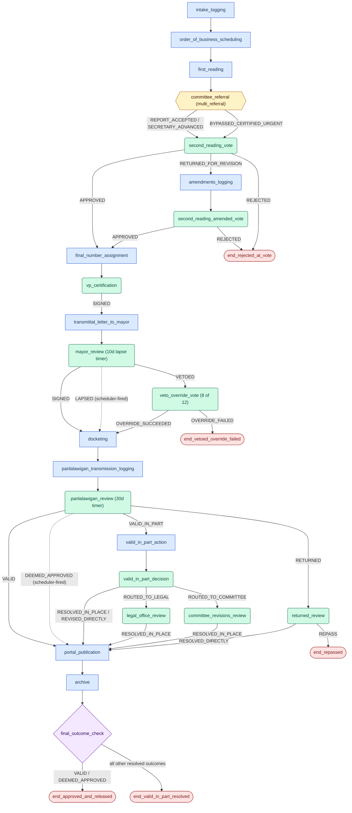

```mermaid
flowchart TD
    classDef action fill:#dbeafe,stroke:#1d4ed8,color:#1e3a5f
    classDef approval fill:#d1fae5,stroke:#065f46,color:#064e3b
    classDef multiref fill:#fef3c7,stroke:#b45309,color:#451a03
    classDef decision fill:#f3e8ff,stroke:#6b21a8,color:#3b0764
    classDef term fill:#fee2e2,stroke:#991b1b,color:#7f1d1d

    IL["intake_logging"]:::action --> OB["order_of_business_scheduling"]:::action
    OB --> FR["first_reading"]:::action
    FR --> CR{{"committee_referral (multi_referral)"}}:::multiref

    CR -- "REPORT_ACCEPTED / SECRETARY_ADVANCED" --> SR2
    CR -- "BYPASSED_CERTIFIED_URGENT" --> SR2

    SR2("second_reading_vote"):::approval
    SR2 -- "APPROVED" --> FN
    SR2 -- "RETURNED_FOR_REVISION" --> AL["amendments_logging"]:::action
    SR2 -- "REJECTED" --> ERV

    AL --> SR2A("second_reading_amended_vote"):::approval
    SR2A -- "APPROVED" --> FN
    SR2A -- "REJECTED" --> ERV

    FN["final_number_assignment"]:::action --> VPC
    VPC("vp_certification"):::approval -- "SIGNED" --> TLM
    TLM["transmittal_letter_to_mayor"]:::action --> MR
    MR("mayor_review (10d lapse timer)"):::approval
    MR -- "SIGNED" --> DOCK
    MR -. "LAPSED (scheduler-fired)" .-> DOCK
    MR -- "VETOED" --> VOV
    VOV("veto_override_vote (8 of 12)"):::approval
    VOV -- "OVERRIDE_SUCCEEDED" --> DOCK
    VOV -- "OVERRIDE_FAILED" --> EVOF

    DOCK["docketing"]:::action --> PTL
    PTL["panlalawigan_transmission_logging"]:::action --> PR
    PR("panlalawigan_review (30d timer)"):::approval

    PR -- "VALID" --> PP
    PR -. "DEEMED_APPROVED (scheduler-fired)" .-> PP
    PR -- "VALID_IN_PART" --> VIA
    PR -- "RETURNED" --> RR

    VIA["valid_in_part_action"]:::action --> VID
    VID("valid_in_part_decision"):::approval
    VID -- "RESOLVED_IN_PLACE / REVISED_DIRECTLY" --> PP
    VID -- "ROUTED_TO_LEGAL" --> LOR("legal_office_review"):::approval
    VID -- "ROUTED_TO_COMMITTEE" --> CRR("committee_revisions_review"):::approval
    LOR -- "RESOLVED_IN_PLACE" --> PP
    CRR -- "RESOLVED_IN_PLACE" --> PP

    RR("returned_review"):::approval
    RR -- "RESOLVED_DIRECTLY" --> PP
    RR -- "REPASS" --> EREP

    PP["portal_publication"]:::action --> ARC["archive"]:::action
    ARC --> FOC{"final_outcome_check"}:::decision
    FOC -- "VALID / DEEMED_APPROVED" --> EAAR
    FOC -- "all other resolved outcomes" --> EVIP

    EAAR(["end_approved_and_released"]):::term
    EVIP(["end_valid_in_part_resolved"]):::term
    ERV(["end_rejected_at_vote"]):::term
    EVOF(["end_vetoed_override_failed"]):::term
    EREP(["end_repassed"]):::term
```